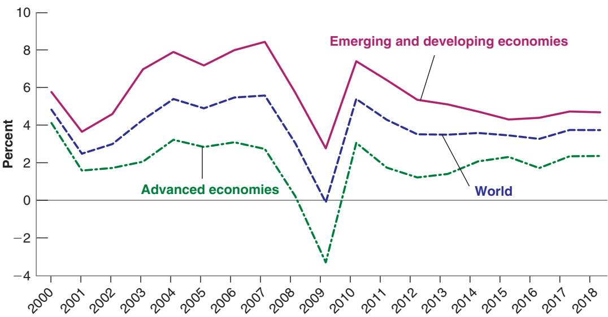
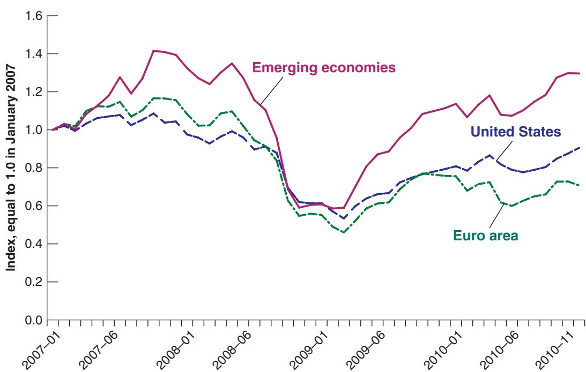
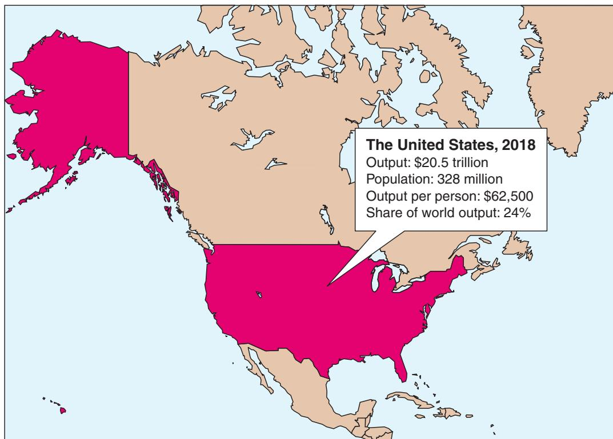
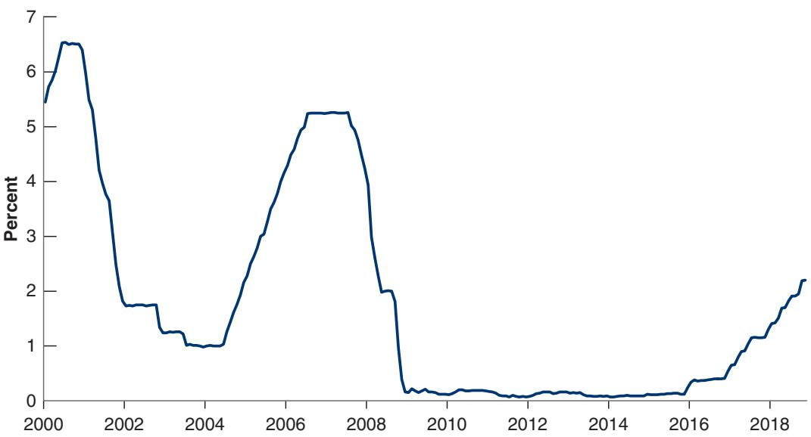
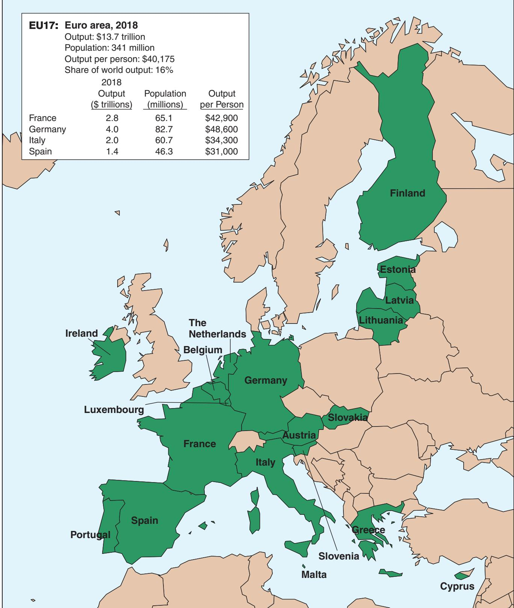
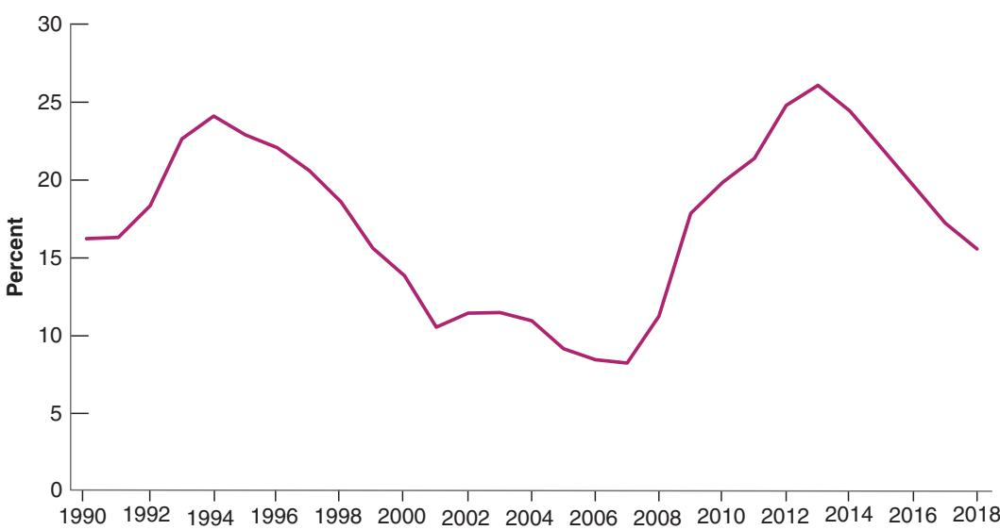
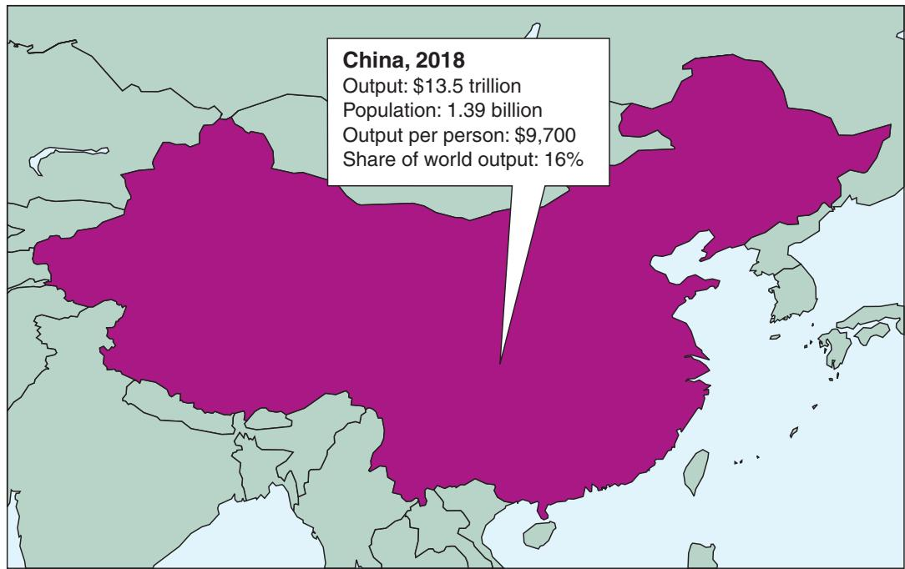

# A Tour of the World

What is macroeconomics? The best way to answer is not to give you a formaldefinition, but rather to take you on an economic tour of the world, to describeboth the main economic evolutions and the issues that keep macroeconomists definition, but rather to take you on an economic tour of the world, to describe both the main economic evolutions and the issues that keep macroeconomists and macroeconomic policymakers awake at night.

At the time of this writing (the start of 2019), policymakers are sleeping better than they did a decade ago. In 2008, the world economy entered a major macroeconomic crisis, the deepest since the Great Depression. World output growth, which typically runs at 4% to 5% a year, was negative in 2009. Since then, growth has turned positive, and the world economy has largely recovered. But the crisis, now known as the Great Financial Crisis, has left several scars, and some worries remain.

My goal in this chapter is to give you a sense of these events and of some of the macroeconomic issues confronting different countries today. I shall start with an overview of the crisis, and then focus on the three main economic powers of the world: the United States, the euro area, and China.

Section 1-1 looks at the crisis.

Section 1-2 looks at the United States.

Section 1-3 looks at the euro area.

Section 1-4 looks at China.

Section 1-5 concludes and looks ahead.

Read this chapter as you would read an article in a newspaper. Do not worry about the exact meaning of the words or about understanding the arguments in detail: The words will be defined, and the arguments will be developed in later chapters. Think of this chapter as background, intended to introduce you to the issues of macroeconomics. If you enjoy reading this chapter, you will probably enjoy reading this book. Indeed, once you have read it, come back to this chapter; see where you stand on the issues, and judge how much progress you have made in your study of macroeconomics.

If you do not, please acceptb my apologies. . .

If you remember one basic message from this chapter, it should be: Economies, like people, get sick—high unemployment, recessions, financial crises, low growth. Macroeconomics is about why it happens, and what can be done about it.

Figure 1-1 shows output growth rates for the world economy, for advanced economies, and for emerging and developing economies, separately, since 2000. As you can see, from 2000 to 2007 the world economy had a sustained expansion. Annual average world output growth was 4.5%, with advanced economies (the group of 30 or so richest countries in the world) growing at 2.7% per year, and emerging and developing economies growing at an even faster 6.6% per year.

In 2007, however, signs that the expansion might be coming to an end started to appear. US housing prices, which had doubled since 2000, started declining. Economists started to worry. Optimists believed that, although lower housing prices might lead to lower housing construction and to lower spending by consumers, the Federal Reserve Bank (the US central bank, called the Fed for short) could lower interest rates to stimulate demand and avoid a recession. Pessimists believed that the decrease in interest rates might not be enough to sustain demand and that the United States might go through a short recession.

“Banks” here actually means “banks and other financial institutions.” But this is too long to write and I do not want to go into these complications in Chapter 1.

Even the pessimists turned out not to be pessimistic enough. As housing prices continued to decline, it became clear that the problems were deeper. Many of the mortgages that had been sold during the previous expansion were of poor quality. Many of the borrowers had taken too large a loan and were increasingly unable to make the monthly payments. And, with declining housing prices, the value of their mortgage often exceeded the price of the house, giving them an incentive to default. This was not the worst of it: The banks that had issued the mortgages had often bundled and packaged them together into new securities and then sold these securities to other banks and investors. These securities had then often been repackaged into yet newc securities, and so on. The result is that many banks, instead of holding the mortgages themselves, held these securities, which were so complex that their value was nearly impossible to assess.

This complexity and opaqueness turned a housing price decline into a major financial crisis, a development that few economists had anticipated. Not knowing the quality of the assets that other banks had on their balance sheets, banks became reluctant to lend to each other for fear that the bank to which they lent might not be able to repay. Unable to borrow, and with assets of uncertain value, many banks found themselves in trouble. On September 15, 2008, a major bank, Lehman Brothers, went bankrupt.

Figure 1-1

Output Growth Rates for the World Economy, for Advanced Economies, and for Emerging and Developing Economies, 2000–2018

Source: IMF, World Economic Outlook Database, July 2018. NGDP\_RPCH.A.

  
Figure 1-2  
Stock Prices in the United States, the Euro Area, and Emerging Economies, 2007–2010  
Source: Haver Analytics USA (S111ACD), Eurogroup (S023ACD), all emerging markets (S200ACD), all monthly averages.  
I started my job asb chief economist of the International Monetary Fund two weeks before the Lehman bankruptcy. I faced a steep learning curve.

The effects were dramatic. Because the links between Lehman and other banks were so opaque, many other banks appeared at risk of going bankrupt as well. For a few weeks, it looked as if the whole financial system might collapse.

This financial crisis quickly turned into a major economic crisis. Stock prices collapsed. Figure 1-2 plots stock price indexes for the United States, the euro area, and emerging economies from the beginning of 2007 to the end of 2010. The indexes are set equal to 1 in January 2007. Note that, by the end of 2008, stock prices had lost half or more of their value from their previous peak. Note also that, even though the crisis originated in the United States, European and emerging market stock prices decreased by as much as their US counterparts; I shall return to this later.

Hit by the decrease in housing prices and the collapse in stock prices, and worried that this might be the beginning of another Great Depression, people sharply cut their consumption. Worried about sales and uncertain about the future, firms sharply cut back their investment. With housing prices dropping and many vacant homes on the market, very few new homes were built. Despite strong actions by the Fed, which cut interest rates all the way down to zero, and by the US government, which cut taxes and increased spending, demand decreased, and so did output. In the third quarter of 2008, US output growth turned negative and remained so in 2009.

One might have hoped that the crisis would remain largely contained in the United States. As Figures 1-1 and 1-2 both show, this was not the case. The US crisis quickly became a world crisis. Other countries were affected through two channels.

The first channel was trade. As US consumers and firms cut spending, part of the decrease fell on imports of foreign goods. Looking at it from the viewpoint of countries exporting to the United States, their exports went down, and so, in turn, did their output.

The second channel was finance. US banks, badly needing funds in the United States, repatriated funds from other countries, creating problems for banks in those countries as well. As those banks got in trouble, lending came to a halt, leading to a decrease in spending and in output. Also, in several European countries, governments had accumulated high levels of debt and were now running large deficits. Investors began to worry about whether debt could be repaid and asked for much higher interest rates. Confronted with those high interest rates, governments drastically reduced their deficits, through a combination of lower spending and higher taxes. This led in turn to a further decrease in demand and in output. In Europe, the decline in output was so bad that this aspect of the crisis acquired its own name, the Euro Crisis. In short, the US recession turned into a world recession. By 2009, average growth in advanced economies was −3.4%, by far the lowest annual growth rate since the Great Depression. Growth in emerging and developing economies remained positive but was 3.5 percentage points lower than the 2000–2007 average.

Thanks to strong monetary and fiscal policies and to the gradual repair of the financial system, economies turned around and started recovering. As you can see from Figure 1-1, growth in advanced countries turned positive in 2010 and has remained positive since. In some advanced countries, most notably the United States, unemployment is now very low. The euro area, however, is still struggling; growth is positive, but unemployment remains high. Growth in emerging and developing economies has also recovered, but, as you can see from Figure 1-1, it is lower than it was before the crisis.

Now that I have set the stage, let me take you on a tour of the three main economic powers in the world: the United States, the euro area, and China.

## 1-2 THE UNITED STATES

When economists look at a country, the first two questions they ask are: How big is the country from an economic point of view? And what is its standard of living? To answer the first, they look at output—the level of production of the country as a whole. To answer the second, they look at output per person. The answers, for the United States, are given in Figure 1-3: The United States is big, with an output of \$20.5 trillion in 2018, accounting for 24% of world output. And the standard of living in the United States is high: Output per person is \$62,500. It is not the country with the highest output per person in the world, but it is close to the top.

Figure 1-3 The United States, 2018  

When economists want to dig deeper and look at the health of the country, they look at three basic variables:

■ Output growth—the rate of change of output

The unemployment rate—the proportion of workers in the economy who are not employed and are looking for a job

■ The inflation rate—the rate at which the average price of goods in the economy is increasing over time

Can you guess some of the countries with a higherb standard of living than the United States? Hint: Think of oil producers and financia centers. For answers, look for “Gross Domestic Product per capita, in current prices” in the WEO database (see the chapter appendix for the web address).

Numbers for these three variables for the US economy are given in Table 1-1. To put current numbers in historical perspective, the first column gives the average value of each of the three variables for the period 1990 up to 2007, the year before the crisis. The second column shows numbers for the acute part of the crisis, the years 2008 and 2009. The third column shows the numbers from 2010 to 2017, and the last column gives the numbers for 2018.

By looking at the numbers for 2018, you can see why economists are upbeat about the US economy at this point. Growth in 2018 is 2.9%, close to the 1990–2007 average. The unemployment rate, which increased during the crisis and its aftermath (it reached 10% during 2010), has steadily decreased and is now 3.7%, substantially lower than the 1990–2007 average. Inflation is also low, equal to its 1990–2007 average. In short, the US economy seems to be in good shape, having largely left the effects of the crisis behind.

So what are the main macroeconomic problems facing US policymakers? I shall pick two. The first concerns the short run, namely whether policymakers have the necessary tools to handle a recession. The second is how to increase productivity growth in the long run. Let’s look at both issues in turn.

## Do Policymakers Have the Tools to Handle the Next Recession?

The recovery from the financial crisis started in the United States in June 2009. Since then, output growth has been positive, and at the time of writing, the expansion has gone on for 115 months. If it goes on until July 2019, it will be the longest expansion on record since 1945.

If history is any guide, however, the sad reality is that expansions do not go on forever, and the United States will, sooner or later, go through another recession. It may come from several places. It may be triggered by a trade war, leading, for example, to a sharp decrease in exports. It may come from increased uncertainty, leading people to consume less and firms to invest less. It may come from another financial crisis, despite

Table 1-1 Growth, Unemployment, and Inflation in the United States, 1990–2018

<table><tr><td>Percent</td><td>1990–2007(average)</td><td>2008–2009(average)</td><td>2010–2017(average)</td><td>2018</td></tr><tr><td>Output growth rate</td><td>3.0</td><td>-1.3</td><td>2.2</td><td>2.9</td></tr><tr><td>Unemployment rate</td><td>5.4</td><td>7.5</td><td>6.8</td><td>3.7</td></tr><tr><td>Inflation rate</td><td>2.3</td><td>1.3</td><td>1.6</td><td>2.3</td></tr><tr><td colspan="5">Output growth rate: annual rate of growth of output (GDP). Unemployment rate: average over the year. Inflation rate: annual rate of change of the price level (GDP deflator).</td></tr><tr><td colspan="5">Source: IMF, World Economic Outlook, October 2018.</td></tr></table>

Figure 1-4

The US Federal Fund Rate, since 2000

had a very insightful quote. “There are known unknowns. But there are also unknown unknowns.

And it is the latter category that tend to be the difficult ones.”

Because keeping cash in large sums is inconvenient and dangerous, people might be willing to hold some bonds even if those pay a small negative interest rate. But there is a clear limit to how negative the interest rate can go before people switch to cash.

By the time you read this book, a recession may have started. If so, you will know what the correct answer was.

the measures that have been taken since 2009 to decrease risk. Or it may come, as has happened many times in the past, from events we simply have not thought about.

When the recession comes, the question will be what policymakers can do to limit the decline in output. The Fed will have to play a central role. This is for two reasons. First, because part of the mandate of the Fed is indeed to fight recessions. Second, because it has the best policy instrument to do so, namely control of the interest rate. By decreasing the interest rate, the Federal Reserve can stimulate demand, increase output, and decrease unemployment. By increasing the interest rate, it can slow down demand and increase unemployment.

The problem that the Fed faces at this point, however, is shown in Figure 1-4, which shows the path of the policy interest rate (called the Federal Funds Rate) since 2000. Note how much the Fed decreased the interest rate when the crisis hit, from 5.3% in July 2008 to close to 0% in December 2008. Note then that the rate remained close to 0% until the end of 2015, and how it has increased a little since then and now stands at 2.4%.

Why did the Fed stop at zero? It would have liked to decrease the interest rate further, but it could not because the interest rate cannot be negative. If it were, then nobody would hold bonds; everybody would want to hold cash instead—because cash pays a zero interest rate. This constraint is known as the zero lower bound, and this is the bound the Fed ran into in December 2008.

Now that the interest rate has increased, why is the zero lower bound still an issue? Because the interest rate remains very low by historical standards. And this implies that there is little room for the Fed to decrease it. If another recession were to happen, the Fed could decrease the policy rate by only about 2%, not enough to have a large effect on demand.

Are there other tools that the Fed could use? Can fiscal policy help? The answer to both questions, as we shall see later in the book, is yes. But whether these other tools will be enough is far from certain. This is why many economists are worried that it might be difficult to limit the depth of the next recession.c

## How Worrisome Is Low Productivity Growth?

In the short run, what happens to the economy depends, as we just discussed, on movements in demand and the decisions of the central bank. In the longer run, however, growth is determined by other factors, the main one being productivity growth: Without productivity growth, there just cannot be a sustained increase in income per person. And, here, the news is worrisome. Table 1-2 shows average US productivity growth by decade since 1990 for the private nonfarm business sector and for the manufacturing sector. As you can see, productivity growth in the 2010s has been, so far, much lower than it was in the previous two decades.

Table 1-2 Labor Productivity Growth, by Decade, 1990–2018

<table><tr><td>Percent change; year on year (average)</td><td>1990s</td><td>2000s</td><td>2010–2018</td></tr><tr><td>Private nonfarm business sector</td><td>2.2</td><td>2.8</td><td>0.9</td></tr><tr><td>Manufacturing</td><td>4.1</td><td>3.6</td><td>0.4</td></tr><tr><td colspan="4">Source: FRED database. PRS85006092, MPU490063</td></tr></table>

How worrisome is this? Productivity growth varies a lot from year to year, and some economists believe that it may just be a few bad years and not much to worry about. Others believe that measurement issues make it difficult to measure output and that productivity growth may be underestimated. For example, how do you measure the productivity of a new smartphone relative to an older model? For the same price as an older model, it does many things that the older model could not do. Put another way, it is much more productive, and we may not be very good at measuring the improvement in productivity. Yet others believe that the United States has truly entered a period of lower productivity growth, that the major gains from the current innovations in information technology (IT) may already have been obtained, and that progress is likely to be less rapid, at least for some time.

One particular reason to worry is that this slowdown in productivity growth is happening in the context of growing inequality. When productivity growth is high, most are likely to benefit, even if inequality increases. The poor may benefit less than the rich, but they still see their standard of living increase. This is not the case today in the United States. Since 2000, the real earnings of workers with a high school education or less have actually decreased. If policymakers want to invert this trend, they need to either raise productivity growth or limit the rise of inequality, or both. These are two major challenges facing US policymakers today.

Increasing inequality is a problem affecting not just the United States but many advanced economies. It has serious political implications.

## 1-3 THE EURO AREA

In 1957, six European countries decided to form a common European market—an economic zone where people, goods, and services could move freely. Over time, 22 more countries joined, bringing the total to 28. This group is now known as the European Union (EU) and its scope extends beyond just economic issues. In 2016, the United Kingdom held a referendum in which the government was given the mandate to exit the Union. At this juncture, negotiations are still going on, but, if and when the United Kingdom leaves, this will leave 27 members.

In 1999, the EU decided to go a step further and started the process of replacing national currencies with one common currency, called the euro. Only 11 countries participated at the start; since then, 8 more have joined. Nineteen countries now belong to this common currency area, known as the euro area.

As you can see from the numbers in Figure 1-5, the euro area is a strong economic power. At the current exchange rate between the euro and the dollar, its output is equal to two-thirds of US output. (The EU as a whole has an output equal to 90% of that of the United States.)

Until a few years ago, the official name was the European Community, or EC. You may still encounter that name. EC now stands for European Commission, the executive arm of theb European Union.

The area also goes by the names of “Eurozone” or 1 “Euroland.” The first sounds too technocratic, and the second reminds one of Disneyland. I shall avoid them.

<table><tr><td colspan="4">EU17: Euro area, 2018</td></tr><tr><td></td><td>Output ($ trillions)</td><td>Population (millions)</td><td>Output per Person</td></tr><tr><td>France</td><td>2.8</td><td>65.1</td><td>$42,900</td></tr><tr><td>Germany</td><td>4.0</td><td>82.7</td><td>$48,600</td></tr><tr><td>Italy</td><td>2.0</td><td>60.7</td><td>$34,300</td></tr><tr><td>Spain</td><td>1.4</td><td>46.3</td><td>$31,000</td></tr></table>

  
Figure 1-5

The Euro Area, 2018

Table 1-3 Growth, Unemployment, and Inflation in the Euro Area, 1990–2018

<table><tr><td>Percent</td><td>1990–2007(average)</td><td>2008–2009(average)</td><td>2010–2017(average)</td><td>2018</td></tr><tr><td>Output growth rate</td><td>2.1</td><td>-2.0</td><td>1.3</td><td>2.0</td></tr><tr><td>Unemployment rate</td><td>9.4</td><td>8.6</td><td>10.6</td><td>8.3</td></tr><tr><td>Inflation rate</td><td>2.1</td><td>1.5</td><td>1.0</td><td>1.5</td></tr><tr><td colspan="5">Output growth rate: annual rate of growth of output (GDP). Unemployment rate: average over the year. Inflation rate: annual rate of change of the price level (GDP deflator).</td></tr><tr><td colspan="5">Source: IMF, World Economic Outlook, October 2018.</td></tr></table>

Table 1-3 gives the numbers for output growth, the unemployment rate, and the inflation rate for 1990–2007, 2008–2009, 2010–2017, and 2018. Just as in the United States, the acute phase of the crisis, 2008–2009, was characterized by negative growth. Whereas the United States recovered, growth in the euro area remained anemic. Indeed, while this is not shown in the table, growth was negative in both 2012 and 2013. Growth has now increased, reaching 2% in 2018, but the unemployment rate remains high, at 8.3%. Inflation remains too low, below the 2% target of the European Central Bank (ECB).

The euro area faces two main issues today. The first is how to reduce unemployment. Second is whether and how it can function efficiently as a common currency area. Let’s look at the two issues in turn.

## Can European Unemployment Be Reduced?

The high average unemployment rate for the euro area, 8.3% in 2018, hides large variations across the euro countries. At one end, Greece and Spain have unemployment rates of 20% and 15%, respectively. At the other, Germany’s unemployment rate is close to 3%. In the middle are countries like France and Italy, with unemployment rates of 9% and 11%, respectively. Thus, how to reduce unemployment must be tailored to the specifics of each country.

To show the complexity of the issues, it is useful to look at a country with high unemployment, say Spain. Figure 1-6 shows the striking evolution of the Spanish unemployment rate since 1990. After a long boom starting in the mid-1990s, the unemployment rate decreased from a high of nearly 25% in 1994 to 8% by 2007. But, with the crisis, unemployment exploded again, exceeding 25% in 2013. It has declined since then, but still stands at 15%.

  
Figure 1-6  
Unemployment in Spain since 1990  
(Source: International Monetary Fund, World Economic Outlook, October 2018).

The figure suggests two conclusions:

■ Part of the high unemployment rate today is probably still a result of the crisis and the sudden collapse in demand we discussed in the first section. A housing boom that turned into a housing bust, plus a sudden increase in interest rates, triggered the increase in unemployment from 2008 on. One can hope that, eventually, demand will continue to increase, and unemployment will decrease further.

Even at the peak of the boom, the unemployment rate in Spain never went below 8%, nearly three times the unemployment rate in Germany today. This suggests that more is at work than the crisis and the fall in demand. The fact that, for most of the last 20 years, unemployment has exceeded 10%, points to problems in the labor market. The challenge is then to identify exactly what these problems are.

Some economists believe the main problem is that European states protect workers too much. To prevent workers from losing their jobs, they make it expensive for firms to lay off workers. One of the unintended results of this policy is to deter firms from hiring workers in the first place, thus increasing unemployment. Also, to protect workers who become unemployed, European governments provide generous unemployment insurance. But, by doing so, they decrease the incentives for the unemployed to take jobs rapidly; this also may increase unemployment. The solution, these economists argue, is to be less protective, to eliminate these labor market rigidities, and to adopt US-style labor market institutions. This is what the United Kingdom has largely done, and its unemployment rate is low.

Others, and this includes me, are more skeptical. They point to the fact that unemployment is not high everywhere in Europe. Yet most European countries provide protection and generous social insurance to workers. This suggests that the problem may lie not so much with the degree of protection but with the way it is implemented. The challenge, these economists argue, is to understand what the low-unemployment European countries are doing right, and whether what they do right can be exported to the other European countries.

Resolving these questions is one of the major tasks facing European macroeconomists and policymakers.

## What Has the Euro Done for Its Members?

Supporters of the euro point to its enormous symbolic importance. In light of the many past wars among European countries, what better proof of the permanent end to conflict than the adoption of a common currency? They also point to the economic advantages of having a common currency: no more changes in exchange rates for European firms to worry about; no more need to change currencies when crossing borders. Together with the removal of other obstacles to trade among European countries, the euro contributes, they argue, to the creation of a large economic power in the world. There is little question that the move to the euro was indeed one of the main economic events of the start of the 21st century.

Others worry, however, that the symbolism of the euro has come with substantial economic costs. Even before the crisis, they pointed out that a common currency means a common monetary policy, which means the same interest rate across the euro countries. What if, they argue, one country plunges into recession while another is in the middle of an economic boom? The first country needs lower interest rates to increase spending

China, 2018

and output; the second country needs higher interest rates to slow down its economy. If interest rates must be the same in both countries, what will happen? Isn’t there the risk that one country will remain in recession for a long time or that the other will not be able to slow down its booming economy? A common currency also means the loss of the exchange rate as an instrument of adjustment within the euro area. What if, they argue, a country has a large trade deficit and needs to become more competitive? If it cannot adjust its exchange rate, it must adjust by decreasing prices relative to its competitors. This is likely to be a painful and long process.

Until the euro crisis, the debate had remained somewhat abstract. It no longer is. As a result of the crisis, several euro members, from Ireland and Portugal to Greece, have gone through deep recessions. If they had their own currency, they could have depreciated their currency vis-à-vis other euro members to increase the demand for their exports. Because they shared a currency with their neighbors, this was not possible. Thus, some economists conclude, some countries should drop out of the euro and recover control of their monetary policy and their exchange rate. Others argue that such an exit would be both unwise because it would give up the other advantages of being in the euro and extremely disruptive, leading to even deeper problems for the country that exited. This issue is likely to remain a hot one for some time to come.

At the time of this writing, some Italian politicians argue that Italy, which suffers from low growth, would be better off outside the euro and advocate b euro exit.

## 1-4 CHINA

China is in the news every day. It is perceived as one of the major economic powers in the world. Is the attention justified? A first look at the numbers in Figure 1-7 suggests it may not. True, the population of China is enormous, more than four times that of the United States. But its output, expressed in dollars by multiplying the number in yuan (the Chinese currency) by the dollar–yuan exchange rate, is still only \$13.5 trillion, about 60% of that of the United States. Output per person is about \$9,700, only roughly 15% of output per person in the United States.

So why is so much attention paid to China? There are two main reasons:

  
Source: IMF, World Economic Outlook, October 2018.

To understand the first, we need to go back to the number for output per person. When comparing output per person in a rich country like the United States and a relatively poor country like China, one must be careful. The reason is that many goods are cheaper in poor countries. For example, the average price of a restaurant meal in New York City is about \$40; the average price of a restaurant meal in Beijing is about 50 yuan, or, at the current exchange rate, about \$7.50. Put another way, the same income (expressed in dollars) buys you much more in Beijing than in New York City. If we want to compare standards of living, we must correct for these differences; measures that do so are called PPP (for purchasing power parity) measures. Using such a measure, China’s output is estimated to be \$25.3 trillion, thus higher than that of the United States. And output per person in China is estimated to be about \$18,100, a bit less than one-third of the output per person in the United States. This gives a more accurate picture of the standard of living in China. It is obviously still much lower than that of the United States or other rich countries. But it is higher than suggested by the numbers in Figure 1-7.

Second, and more importantly, China has been growing very rapidly for more than three decades. This is shown in Table 1-4, which, like the previous tables for the United States and the euro area, gives output growth, unemployment, and inflation for 1990–2007, 2008–2009, 2010–2017, and 2018.

The first line of the table tells the basic story. From 1990 (indeed, from 1980, if we were to extend the table back by another 10 years) to the late 2000s, China grew at close to 10% a year. This represents a doubling of output every 7 years. Compare this to the numbers for the United States and for Europe, and you understand why the weight of the emerging economies in the world economy, China being the main one, is increasing so rapidly.

There are two other interesting aspects to Table 1-4.

The first is how difficult it is to see the effects of the crisis in the data. Growth barely decreased during 2008 and 2009, and unemployment barely increased. The reason is not that China is closed to the rest of the world. Chinese exports slowed during the crisis. But the adverse effect on demand was nearly fully offset by a major fiscal expansion by the Chinese government, with, in particular, a major increase in public investment. The result was sustained growth of demand and, in turn, of output.

The second is the decline in growth rates from 10% before the crisis to less than 8% after the crisis, and to 6.6% for 2018. This raises questions both about how China maintained such a high growth rate for so long, and whether it is now entering a period of lower growth.

A preliminary question is whether the numbers are for real. Could it be that Chinese growth was and is still overstated? After all, China is still officially a communist country, and government officials may have incentives to overstate the economic performance of their sector or their province. Economists who have looked at this carefully conclude that this is probably not the case. The statistics are not as reliable as they are in richer countries, but there is no major bias. Output growth has indeed been very high in China.

Table 1-4 Growth, Unemployment, and Inflation in China, 1990–2018

<table><tr><td>Percent</td><td>1990–2007(average)</td><td>2008–2009(average)</td><td>2010–2017(average)</td><td>2018</td></tr><tr><td>Output growth rate</td><td>10.2</td><td>9.4</td><td>7.9</td><td>6.6</td></tr><tr><td>Unemployment rate</td><td>3.3</td><td>4.3</td><td>4.1</td><td>4.0</td></tr><tr><td>Inflation rate</td><td>5.9</td><td>3.7</td><td>2.9</td><td>2.2</td></tr><tr><td colspan="5">Output growth rate: annual rate of growth of output (GDP). Unemployment rate: average over the year. Inflation rate: annual rate of change of the price level (GDP deflator).</td></tr><tr><td colspan="5">Source: IMF, World Economic Outlook, October 2018.</td></tr></table>

So where has growth come from? It has come from two sources: The first was high accumulation of capital. The investment rate (the ratio of investment to output) in China is 46%, a very high number. For comparison, the investment rate in the United States is only 21%. More capital means higher productivity and higher output. The second is rapid technological progress. One of the strategies followed by the Chinese government has been to encourage foreign firms to relocate and produce in China. As foreign firms are typically much more productive than Chinese firms, this has increased productivity and output. Another aspect of the strategy has been to encourage joint ventures between foreign and Chinese firms. By making Chinese firms work with and learn from foreign firms, the productivity of the Chinese firms has increased dramatically.

This transfer of technology is the subject of strong criticism by the United States government, which argues that part of it has been done illegally, and is a source of trade tensions between the two countries.

When described in this way, achieving high productivity and high output growth appears easy and a recipe that every poor country could and should follow. In fact, things are less obvious. China is one of several countries that made the transition from central planning to a market economy. Most of the other countries, from those in Central Europe to Russia and the other former Soviet republics, experienced a large decrease in output at the time of transition. Most still have growth rates far below that of China. In many countries, widespread corruption and poor property rights make firms unwilling to invest. So why has China fared so much better? Some economists believe that this is the result of a slower transition: The first Chinese reforms took place in agriculture as early as 1980, and even today, many firms remain owned by the state. Others argue that the fact that the communist party has remained in control has actually helped the economic transition; tight political control has allowed for better protection of property rights, at least for new firms, giving them incentives to invest. Getting the answers to these questions, and thus learning what other poor countries can take from the Chinese experience, can clearly make a huge difference, not only for China but for the rest of the world.

Tight political control has allowed corruption to develop, and corruption can also threaten investment. China is now in the midst of a strong anti-corruption campaign.

At the same time, the recent growth slowdown raises a new set of questions: Where does the slowdown come from? Should the Chinese government try to maintain high growth or accept the lower growth rate? Most economists and, indeed, the Chinese authorities themselves believe that lower growth is now desirable, that the Chinese people will be better served if the investment rate decreases, allowing more output to go to consumption. Achieving the transition from investment to consumption is the major challenge facing the Chinese authorities today.

## 1-5 LOOKING AHEAD

This concludes our whirlwind world tour. There are many other regions of the world and many other macroeconomic issues we could have looked at:

India, another poor and large country, with a population of 1,330 million, which, like China, is now growing very fast and becoming a world economic power.

■ Japan, whose growth performance for the 40 years following World War II was so impressive that it was referred to as an economic miracle, but has done very poorly in the last two decades. Since a stock market crash in the early 1990s, Japan has been in a prolonged slump, with average output growth only around 1% per year.

■ Latin America, which went from high inflation to low inflation in the 1990s, and then sustained strong growth. Recently, however, its growth has slowed, as a result, in part, of a decline in the price of commodities.

■ Central and Eastern Europe, which shifted from central planning to a market system in the early 1990s. In most countries, the shift was characterized by a sharp decline in output at the start of transition. Since then, however, most countries have achieved high growth rates, and are catching up with Western Europe.

■ Sub-Saharan Africa, which has suffered decades of economic stagnation, but where, contrary to common perceptions, growth has been high since 2000, averaging 5% per year and reflecting growth in most of the countries of the continent.

There is a limit to how much you can absorb in this first chapter. Think about the issues to which you have been exposed:

■ The big issues triggered by the crisis: What caused the crisis? Why was it transmitted from the United States to the rest of the world? In retrospect, what could and should have been done to prevent it? Were the monetary and fiscal responses appropriate? Why has the recovery been so slow in Europe? How was China able to maintain high growth during the crisis?

■ How can monetary and fiscal policies be used to fight recessions? What are the pros and cons of joining a common currency area such as the euro area? What measures could be taken in Europe to reduce persistently high unemployment?

■ Why do growth rates differ so much across countries, even over long periods of time? Can advanced economies achieve sustained growth without increasing inequality? Can poor countries emulate China and grow at the same rate? Should China slow down?

The purpose of this book is to give you a way of thinking about these questions. As we develop the tools you need, I shall show you how to use them by returning to these questions and showing you the answers that the tools suggest.

## KEY TERMS

Great Financial Crisis, 3 European Union (EU), 9 euro area, 9 common currency area, 9

## QUESTIONS AND PROBLEMS

## QUICK CHECK

1. Using the information in this chapter, label each of the following statements true, false, or uncertain. Explain briefly.

a. Output growth was negative in advanced as well as emerging and developing countries in 2009.

b. World output growth recovered to its pre-recession level after 2009.

c. Stock prices around the world fell between 2007 and 2010 and then recovered to their pre-recession level.

d. The rate of unemployment in the United Kingdom is much lower than in much of the rest of Europe.

e. China’s seemingly high growth rate is a myth; it is a product solely of misleading official statistics.

f. The high rate of unemployment in Europe started when a group of major European countries adopted a common currency.

g. The Federal Reserve lowers interest rates when it wants to avoid a recession and raises interest rates when it wants to slow the rate of growth in the economy.

h. Output per person is different in the euro area, the United States, and China.

i. Interest rates in the United States were at or near zero from 2009 to 2018.

## 2. Macroeconomic policy in Europe

Beware of simplistic answers to complicated macroeconomic questions. Consider each of the following statements and comment on whether there is another side to the story.

a. There is a simple solution to the problem of high European unemployment: Reduce labor market rigidities.

b. What can be wrong about joining forces and adopting a common currency? Adoption of the euro is obviously good for Europe.
