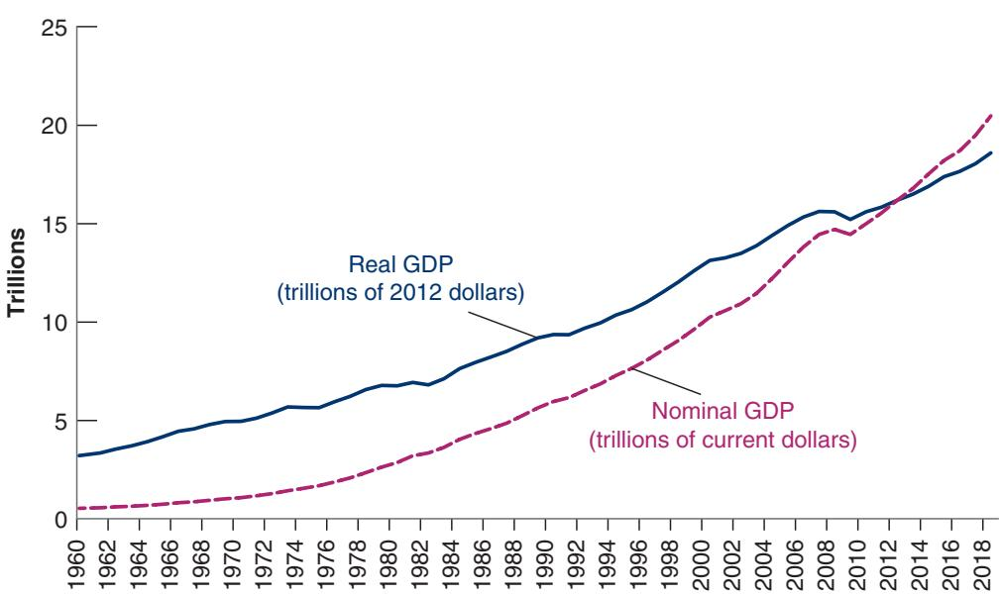
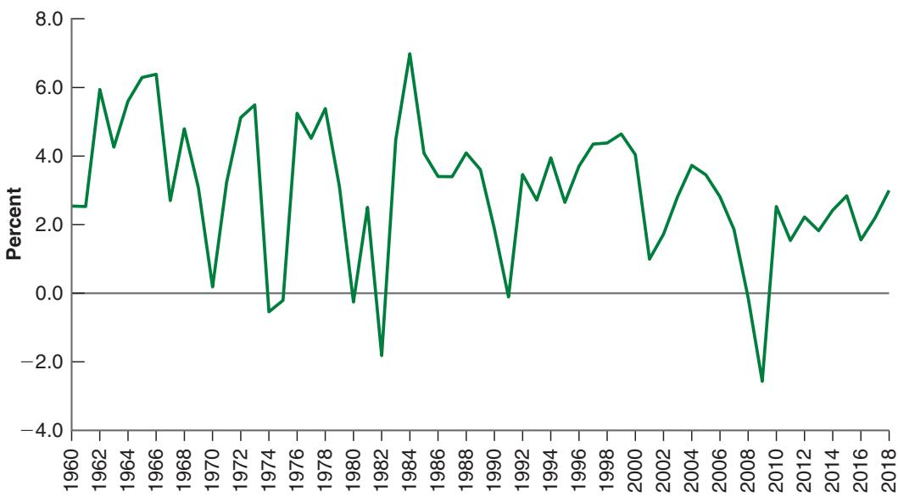
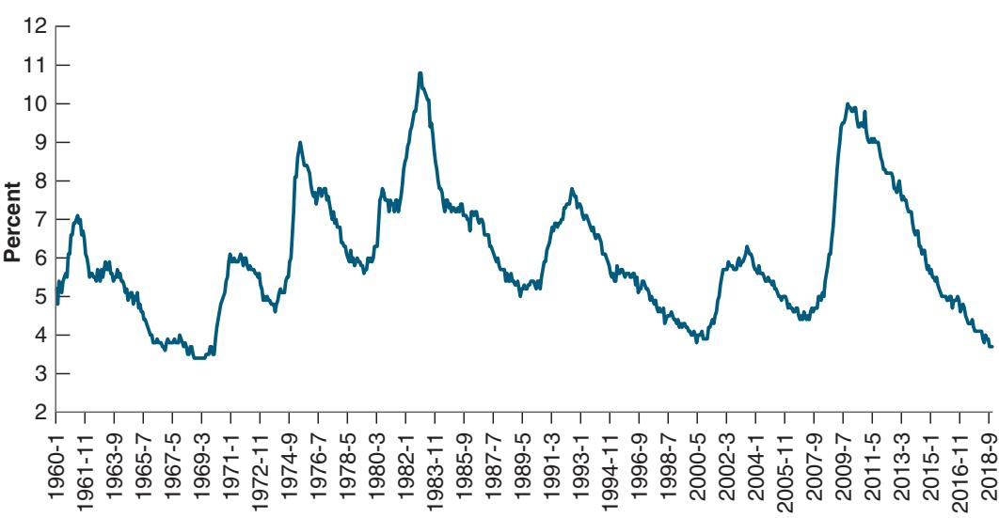
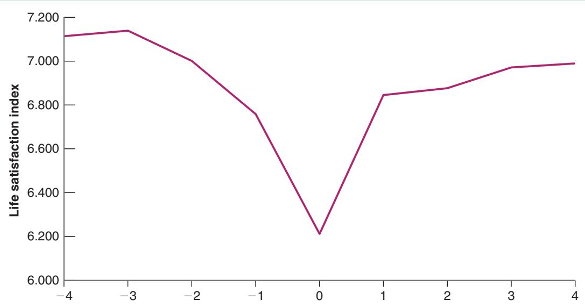
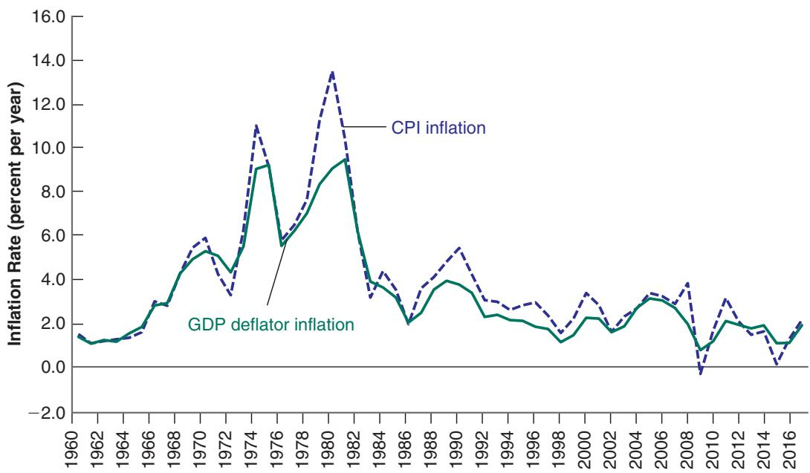
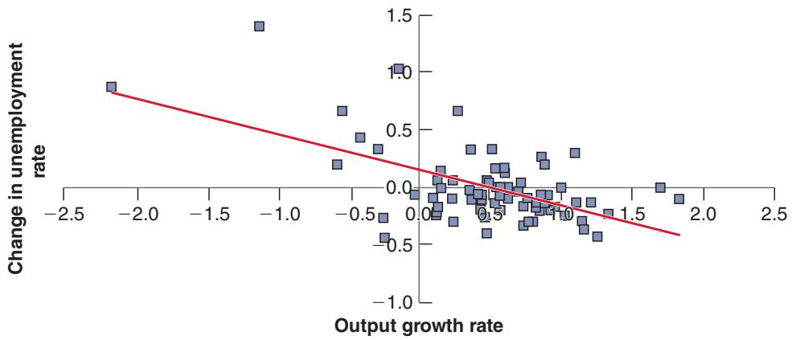

# 2-1 AGGREGATE OUTPUT

Two economists, Simon Kuznets, from Harvard University, and Richard Stone, from Cambridge University, received the Nobel Prize for their contributions to the development of the national income and product accounts—a gigantic intellectual and empirical achievement.

You may come across another term, gross national product, or GNP. There is a subtle difference between “domestic” and “national,” and thus between GDP and GNP. We examine the distinction in Chapter 18 and in Appendix 1 at the end of the

In reality, not only workers 1 and machines are required for steel production, but so are iron ore, electricity, and so on. I ignore these to keep the example simple.

An intermediate good is a good used in the production of another good. Some goods can be both final goods and intermediate goods. Potatoes sold directly to consumers are final goods. Potatoes used to produce potato chips are intermediate goods. What are some other examples?

Economists studying economic activity in the 19th century or even during the Great Depression had no measure of aggregate activity (aggregate is the word macroeconomists use for total) on which to rely. They had to put together bits and pieces of information, such as the shipments of iron ore, or sales at some department stores, to try to infer what was happening to the economy as a whole.

It was not until the end of World War II that national income and product accounts (or national income accounts, for short) were put together. Measures of aggregate output have been published on a regular basis in the United States since October 1947. (Measures of aggregate output for earlier times have been constructed retrospectively.)

Like any accounting system, the national income accounts first define concepts and then construct measures corresponding to these concepts. You need only to look at statistics from countries that have not yet developed such accounts to realize that precision and consistency in such accounts are crucial. Without precision and consistency, numbers that should add up do not; trying to understand what is going on feels like trying to balance someone else’s checkbook. I shall not burden you with the details of national income accounting here. But because you will occasionally need to know the definition of a variable and how variables relate to each other, Appendix 1 at the end of the book gives you the basic accounting framework used in the United States (and, with minor variations, in most other countries) today. You will find it useful whenever you want to look at economic data on your own.

## GDP: Production and Income

The measure of aggregate output in the national income accounts is called the gross domestic product, or GDP. To understand how GDP is constructed, it is best to work with a simple example. Consider an economy composed of just two firms:

Firm 1 produces steel, employing workers and using machines to produce the steel. It sells the steel for \$100 to Firm 2, which produces cars. Firm 1 pays its workers \$80, leaving \$20 in profit to the firm.

■ Firm 2 buys the steel and uses it, together with workers and machines, to produce cars. Revenues from car sales are \$200. Of the \$200, \$100 goes to pay for steel and \$70 goes to workers in the firm, leaving \$30 in profit to the firm.

We can summarize this information in a table:

<table><tr><td colspan="2">Steel Company (Firm 1)</td><td colspan="2">Car Company (Firm 2)</td></tr><tr><td>Revenues from sales</td><td>$100</td><td>Revenues from sales</td><td>$200</td></tr><tr><td>Expenses</td><td>$80</td><td>Expenses</td><td>$170</td></tr><tr><td>Wages</td><td>$80</td><td>Wages</td><td>$70</td></tr><tr><td></td><td></td><td>Steel purchases</td><td>$100</td></tr><tr><td>Profit</td><td>$20</td><td>Profit</td><td>$30</td></tr></table>

How would you define aggregate output in this economy? As the sum of the values of all goods produced in the economy—the sum of \$100 from the production of steel and \$200 from the production of cars, so \$300? Or as just the value of cars, which is equal to \$200?

Some thought suggests that the right answer must be \$200. Why? Because steel is an intermediate good: It is used in the production of cars. Once we count the productionc of cars, we do not want to also count the production of the goods that went into the production of these cars.

This leads to the first definition of GDP:

## 1. GDP Is the Value of the Final Goods and Services Produced in the Economy during a Given Period.

The important word here is final. We want to count only the production of final goods, not intermediate goods. Using our example, we can make this point in another way. Suppose the two firms merged, so that the sale of steel took place in the new firm and was no longer recorded. The accounts of the new firm would be given by the following table:

Steel and Car Company

<table><tr><td>Revenues from sales</td><td>$200</td></tr><tr><td>Expenses (wages)</td><td>$150</td></tr><tr><td>Profit</td><td>$50</td></tr></table>

All we would see would be one firm selling cars for \$200, paying workers $\$ 80 +\$ 870=9150$ and making $\$ 20 +\$ 30=450$ in profits. The \$200 measure would remain unchanged—as it should. We do not want our measure of aggregate output to depend on whether firms decide to merge or not.

This first definition gives us one way to construct GDP: by recording and adding up the production of all final goods—and this is indeed roughly the way actual GDP numbers are put together. But it also suggests a second way of thinking about and constructing GDP.

## 2. GDP Is the Sum of Value Added in the Economy during a Given Period.

The value added by a firm is defined as the value of its production minus the value of the intermediate goods used in production.

In our two-firms example, the steel company does not use intermediate goods. Its value added is simply equal to the value of the steel it produces, \$100. The car company, however, uses steel as an intermediate good. Thus, the value added by the car company is equal to the value of the cars it produces minus the value of the steel it uses in production, $\$ 200-9100=9100$ . Total value added in the economy, or GDP, equals $\$ 100 +8100=8200$ . (Note that aggregate value added would remain the same if the steel and car firms merged and became a single firm. In this case, we would not observe intermediate goods at all—because steel would be produced and then used to produce cars within the single firm—and the value added in the single firm would simply be equal to the value of cars, \$200.)

This definition gives us a second way of thinking about GDP. Put together, the two definitions imply that the value of final goods and services—the first definition of GDP— can also be thought of as the sum of the value added by all the firms in the economy—the second definition of GDP.

So far, we have looked at GDP from the production side. The other way of looking at GDP is from the income side. Go back to our example and think about the revenues left to a firm after it has paid for its intermediate goods: Some of the revenues go to pay workers— this component is called labor income. The rest goes to the firm—that component is called capital income or profit income (the reason it is called capital income is that you can think of it as remuneration for the owners of the capital used in production).

Of the \$100 of value added by the steel manufacturer, \$80 goes to workers (labor income) and the remaining \$20 goes to the firm (capital income). Of the \$100 of value added by the car manufacturer, \$70 goes to labor income and \$30 to capital income.

The labor share in the example is thus 75%. In advanced countries, the share of labor is indeed typically between 60% and 75%.

For the economy as a whole, labor income is equal to \$1501\$80 + \$702 and capital income is equal toc $\$ 50(\$ 20+\$ 30)$ . Value added is equal to the sum of labor income and capital income: \$2001\$150 + \$502.

Two lessons to remember:

i. GDP is the measure of aggregate output, which we can look at from the production side (aggregate production) or the income side (aggregate income); and

ii. Aggregate production and aggregate income are always equal.

Warning! People often use nominal to denote small nominal to dénoté small amounts. Economists amounts. Economists

and they surely do not refer to small amounts: The numbers typically run in the billions or trillions of dollars.

This leads to the third definition of GDP.

3. GDP Is the Sum of Incomes in the Economy during a Given Period.

To summarize: You can think about aggregate output—GDP—in three different but equivalent ways.c

■ From the production side: GDP equals the value of the final goods and services produced in the economy during a given period.

■ Also from the production side: GDP is the sum of value added in the economy during a given period.

■ From the income side: GDP is the sum of incomes in the economy during a given period.

## Nominal and Real GDP

US GDP was \$20,500 billion in 2018, compared to \$543 billion in 1960. Was US output really almost 38 times higher in 2018 than in 1960? Obviously not: Much of the increase reflected an increase in prices rather than an increase in quantities produced. This leads to the distinction between nominal GDP and real GDP.

Nominal GDP is the sum of the quantities of final goods produced times their current price. This definition makes clear that nominal GDP increases over time for twouse nominal for variables c reasons: expressed in current prices,

■ First, the production of most goods increases over time.

■ Second, the price of most goods also increases over time.

If our goal is to measure production and its change over time, we need to eliminate the effect of increasing prices on our measure of GDP. That’s why real GDP is constructed as the sum of the quantities of final goods times constant (rather than current) prices.

If the economy produced only one final good, say, a single car model, constructing real GDP would be easy: We would use the price of the car in a given year and multiply the quantity of cars produced in each year. An example will help here. Consider an economy that only produces cars—and to avoid issues we shall tackle later, assume the same model is produced every year. Suppose the number and the price of cars in three successive vears are given by

successive years are given by:States. c

<table><tr><td>Year</td><td>Quantity of Cars</td><td>Price of Cars</td><td>Nominal GDP</td><td>Real GDP (in 2012 dollars)</td></tr><tr><td>2011</td><td>10</td><td>$20,000</td><td>$200,000</td><td>$240,000</td></tr><tr><td>2012</td><td>12</td><td>$24,000</td><td>$288,000</td><td>$288,000</td></tr><tr><td>2013</td><td>13</td><td>$26,000</td><td>$338,000</td><td>$312,000</td></tr></table>

Nominal GDP, which is equal to the quantity of cars times their price, goes up from \$200,000 in 2011 to \$288,000 in 2012—a 44% increase—and from \$288,000 in 2012 to \$338,000 in 2013—a 17% increase.

■ To construct real GDP, we need to multiply the number of cars in each year by a common price. Suppose we use the price of a car in 2012 as the common price. This approach gives us real GDP in 2012 dollars.

■ Using this approach, real GDP in 2011 (in 2012 dollars) equals 10 cars \* \$24,000 percar = \$240,000. Real GDP in 2012 (in 2012 dollars) equals 12 cars \* \$24,000percar = \$288,000, the same as nominal GDP in 2012. Real GDP in 2013 (in 2012 dollars) is equal to $1 3 \times \$ 4,00 0 = \$ 312,000$ So real GDP goes up from \$240,000 in 2011 to \$288,000 in 2012—a 20% increase— and from \$288,000 in 2012 to \$312,000 in 2013—an 8% increase.

■ How different would our results have been if we had decided to construct real GDP using the price of a car in, say, 2013 rather than 2012? Obviously, the level of real GDP in each year would be different (because the prices are not the same in 2013 than in 2012); but its rate of change from year to year would be the same as shown.

To check, compute real GDP in 2013 dollars, and compute the rate of growth from 2011 to 2012, and from 2012 to b 2013.

The problem when constructing real GDP in practice is that there is obviously more than one final good. Real GDP must be defined as a weighted average of the output of all final goods, and this brings us to what the weights should be.

The relative prices of the goods would appear to be the natural weights. If one good costs twice as much per unit as another, then that good should count for twice as much as the other in the construction of real output. But this raises the question: What if, as is typically the case, relative prices change over time? Should we choose the relative prices of a particular year as weights, or should we change the weights over time? More discussion of these issues, and of the way real GDP is constructed in the United States, is in the appendix to this chapter. Here, what you should know is that the measure of real GDP in the US national income accounts uses weights that reflect relative prices and change over time. The measure is called real GDP in chained (2012) dollars. It says 2012 because, as in our example, at this point in time 2012 is the year when, by construction, real GDP is equal to nominal GDP. It is our best measure of the output of the US economy, and its evolution shows how US output has increased over time.

The year used to construct prices, at this point 2012, is called the base year. The base year is changed from time to time, and when you read this book, it may have changed again.

Figure 2-1 plots the evolution of both nominal GDP and real GDP since 1960. By construction, the two are equal in 2012. Real GDP in 2018 was about 5.7 times its level of 1960—a considerable increase, but clearly much less than the 38-fold increase in

  
Figure 2-1  
Nominal and Real US GDP, 1960–2018.  
From 1960 to 2018, nomina GDP increased by a factor of 38. Real GDP increased by a factor of 5.7.

Suppose real GDP was measured in 2000 dollars rather than 2012 dollars. Where would the nominal GDP and real GDP lines on the graph intersect?

nominal GDP over the same period. The difference between the two results comes from the increase in prices over the period.c

The terms nominal GDP and real GDP each have many synonyms, and you are likely to encounter them in your readings:

■ Nominal GDP is also called dollar GDP or GDP in current dollars.

■ Real GDP is also called GDP in terms of goods, GDP in constant dollars, GDP adjusted for inflation, or GDP in chained (2012) dollars, or GDP in 2012 dollars (if the year in which real GDP is set equal to nominal GDP is 2012, as is the case in the United States at this time).

In the chapters that follow, unless I indicate otherwise,

■ GDP will refer to real GDP and $Y _ { t }$ will denote real GDP in year t.

■ Nominal GDP, and variables measured in current dollars, will be denoted by a dollar sign in front of them—for example, $\$ Y _ { t }$ for nominal GDP in year t.

## GDP: Level versus Growth Rate

Warning: One must be careful about how one does the comparison: Recall the discussion in Chapter 1 about the standard of living in China. This is discussed further in Chapter 10.

We have focused so far on the level of real GDP. This is an important number that gives the economic size of a country. A country with twice the GDP of another country is economically twice as big as the other country. Equally important is the level of real GDP per person, the ratio of real GDP to the population of the country. It gives us the average standard of living of the country.c

In assessing the performance of the economy from year to year, economists focus however on the rate of growth of real GDP, often called just GDP growth. Periods of positive GDP growth are called expansions. Periods of negative GDP growth are called recessions.

GDP growth in the United States since 1960 is given in Figure 2-2. GDP growth in year t is constructed as $( Y _ { t } - Y _ { t - 1 } ) / Y _ { t - 1 }$ and expressed as a percentage. The figure shows how the US economy has gone through a series of expansions (periods of positive growth), interrupted by short recessions. Again, you can see the effects of the recent crisis: zero growth in 2008, and a large negative growth rate in 2009.

## Figure 2-2

Growth Rate of US GDP, 1960–2018.

Since 1960, the US economy has gone through a series of expansions, interrupted by short recessions. The 2008–2009 recession was the most severe recession in the period from 1960 to 2018.

Source: Calculated using series GDPC in Figure 2-1.

## Real GDP, Technological Progress, and the Price of Computers

A tough problem in calculating real GDP is how to deal with changes in quality of existing goods. One of the most difficult cases is computers. It would clearly be absurd to assume that a personal computer in 2019 is the same good as a personal computer produced, say, 20 years ago: The 2019 version can clearly do much more than the 1999 version. But how much more? How do we measure it? How do we take into account the improvements in internal speed, the size of the RAM (random access memory) or of the hard disk, faster access to the internet, and so on?

The approach used by economists to adjust for these improvements is to look at the market for computers and how it values computers with different characteristics in a given year. Example: Suppose the evidence from prices of different models on the market shows that people are willing to pay 10% more for a computer with a speed of 4 GHz (4,000 megahertz) rather than 3 GHz. (The first edition of this book, published in 1996, compared two computers, with speeds of 50 and 16 megahertz, respectively. This change is a good indication of technological progress.) Suppose new computers this year have a speed of 4 GHz compared to a speed of 3 GHz for new computers last year. (A further indication of the complexity of technological progress is that, in the more recent past, progress has been made not so much by increasing the speed of processors but rather by using multicore processors, which allow for faster parallel processing. We shall leave this aspect aside here, but people in charge of national income accounts cannot.) And suppose the dollar price of new computers this year is the same as the dollar price of new computers last year. Then economists in charge of computing the adjusted price of computers will conclude that new computers are in fact 10% cheaper than last year.

This approach, which treats goods as providing a collection of characteristics—for computers, speed, memory, and so on—each with an implicit price, is called hedonic pricing (“hedone” means “pleasure” in Greek. What matters in assessing the value of a good is how much utility (“pleasure”) it provides). It is used by the Department of Commerce—which constructs real GDP—to estimate changes in the price of complex and fast-changing goods, such as automobiles and computers. Using this approach, the Department of Commerce estimates, for example, that for a given price, the quality of new laptops has increased on average by 20% a year since 1999 (if you want to look, the series is given by PCU33411133411172 in the FRED database). Put another way, a typical laptop in 2019 delivers $1 . 2 0 ^ { 2 1 } = 4 6 $ times the computing services a typical laptop delivered in 1999. (Interestingly, in light of the discussion of slowing US productivity growth in Chapter 1, the rate of quality improvement has decreased substantially in the recent past, and is now closer to 10%.)

Not only do laptops deliver more services, they have become cheaper as well: Their dollar price has declined by about 7% a year since 1999. Putting this together with the information in the previous paragraph, this implies that their quality-adjusted price has fallen at an average rate of 20% + 7% = 27% per year. Put another way, a dollar spent on a laptop today buys $1 . 2 7 ^ { 2 1 } = 1 5 1$ times more computing services than a dollar spent on a laptop in 1999.

## 2-2 THE UNEMPLOYMENT RATE

Because it is a measure of aggregate activity, GDP is obviously the most important macroeconomic variable. But two other variables, unemployment and inflation, tell us about other important aspects of how an economy is performing. This section focuses on the unemployment rate.

We start with two definitions: Employment is the number of people who have a job. Unemployment is the number of people who do not have a job but are looking for one. The labor force is the sum of employment and unemployment:

$$
\begin{array}{c} L \quad = \quad N \quad + \quad U \\ \text {labor force} = \text {employment} + \text {unemployment} \end{array}
$$

The unemployment rate is the ratio of the number of people who are unemployed to the number of people in the labor force:

$$
u = \frac {U}{L}
$$

$$
\text { unemployment   rate } = \text { unemployment / labor   force }
$$

Constructing the unemployment rate is less obvious than it might seem. Determining whether somebody is employed is relatively straightforward. Determining whether somebody is unemployed is more difficult. Recall from the definition that, to be classified as unemployed, a person must meet two conditions: he or she does not have a job, and he or she is looking for one; this second condition is harder to assess.

Until the 1940s in the United States, and until more recently in most other countries, the only available source of data on unemployment was the number of people registered at unemployment offices, and so only those workers who were registered in unemployment offices were counted as unemployed. This system led to a poor measure of unemployment. The number of those who were looking for jobs and were registered at the unemployment office varied both across countries and across time. Those who had no incentive to register—for example, those who had exhausted their unemployment benefits—were unlikely to take the time to come to the unemployment office, so they were not counted. Countries with less generous benefit systems were likely to have fewer unemployed people registered, and therefore smaller measured unemployment rates.

Today, most rich countries rely on large surveys of households to compute the unemployment rate. In the United States, this survey is called the Current Population Survey (CPS). It relies on interviews of 60,000 households every month. The surveyc classifies a person as employed if he or she has a job at the time of the interview; it classifies a person as unemployed if he or she does not have a job and has been looking for a job in the last four weeks. Most other countries use a similar definition of unemployment. In the United States, estimates based on the CPS show that, in December 2018, an average of 157 million people were employed, and 6.3 million people were unemployed, so the unemployment rate was 6.3>1157 + 6.32 = 3.9%.

Note that only those looking for a job are counted as unemployed; those who do not have a job and are not looking for one are counted as not in the labor force. When unemployment is high, some of the unemployed give up looking for a job and therefore are no longer counted as unemployed. These people are known as discouraged workers. Take an extreme example: If all workers without a job gave up looking for one, the unemployment rate would go to zero. This would make the unemployment rate a poor indicator of what is actually happening in the labor market. This example is too extreme; in practice, when the economy slows down, we typically observe both an increase in unemployment and an increase in the number of people who drop out of the labor force. Equivalently, a higher unemployment rate is typically associated with a lower participation rate, defined as the ratio of the labor force to the total population of working age.

Figure 2-3 shows the unemployment rate in the United States since 1960. It has fluctuated between 3% and 11%, going up during recessions and down during expansions. Again, you can see the effect of the recent crisis, with the unemployment rate reaching a peak at nearly 10% in 2010, the highest since the 1980s, followed by a steady decline since then.

## Why Do Economists Care about Unemployment?

Economists care about unemployment for two reasons. First, they care about unemployment because of its direct effect on the welfare of the unemployed. Although unemployment benefits are more generous today than they were during the Great Depression, unemployment is still associated with financial and psychological suffering. The extent of suffering depends on the nature of unemployment.

One image of unemployment is that of a stagnant pool, of people remaining unemployed for long periods of time. In normal times, in the United States, this image is not

## Figure 2-3

US Unemployment Rate, 1960–2018.

Since 1960, the US unemployment rate has fluctuated between about 3% and 11%.

Source: FRED Series: UNRATE.

right: Every month, many people become unemployed, and many of the unemployed find jobs. When unemployment is high, however, as it was during the crisis, another image becomes more relevant. Not only are more people unemployed, but also many of them are unemployed for a long time. For example, the mean duration of unemployment was 16 weeks on average during 2000–2007, but increased to 40 weeks in 2011. When unemployment increases, not only does unemployment become more widespread, it also becomes more painful for those who are unemployed.

Second, economists also care about the unemployment rate because it provides a signal that the economy is not using some of its resources. When unemployment is high, many workers who want to work do not find jobs; the economy is clearly not using its human resources efficiently. What about when unemployment is low? Can very low unemployment also be a problem? The answer is yes. Like an engine running at too high a speed, an economy in which unemployment is very low may be overusing its resources and run into labor shortages. How low is “too low”? This is a difficult question, and a question that, as of early 2019, is very relevant. The current rate of unemployment is below 4%, which is, as you can see from Figure 2-3, historically low. Whether it should be allowed to decrease further, or instead stabilized at the current level, is one of the main policy issues facing the Fed today.

It is probably because ofb statements like this that economics is known as the “dismal science.”

## 2-3 THE INFLATION RATE

Inflation is a sustained rise in the general level of prices—the price level. The inflation rate is the rate at which the price level increases. (Symmetrically, deflation is a sustained decline in the price level. It corresponds to a negative inflation rate.)

The practical issue is how to define the price level so the inflation rate can be measured. Macroeconomists typically look at two measures of the price level, two price indexes: the GDP deflator and the Consumer Price Index.

## The GDP Deflator

We saw how increases in nominal GDP can come either from an increase in real GDP, or from an increase in prices. Put another way, if we see nominal GDP increase faster than real GDP, the difference must come from an increase in prices.

Deflation is rare, but it happens. The United States experienced sustained deflation in the 1930s during the Great Depression (see the Focus Box in Chapter 9). Japan has had deflation, off and on, since the late 1990s. More recently, the euro area has had short spells of deflation.

## Unemployment and Happiness

How painful is unemployment? To answer this question, one needs information about particular individuals and how their happiness varies as they become unemployed. This information is available from the German Socio-Economic Panel survey. The survey has followed about 11,000 households each year since 1984, asking each member of the household a number of questions about their employment status, their income, and their happiness. The specific question in the survey about happiness is the following: “How satisfied are you at present with your life as a whole?”, with the answer rated from 0 (“completely dissatisfied”) to 10 (“completely satisfied”).

The effect of unemployment on happiness defined in this way is shown in Figure 1. The figure plots the average life satisfaction for individuals who were unemployed during one year, and employed in the four years before and in the four years after. Year 0 is the year of unemployment. Years −4 to −1 are the years before unemployment, years 1 to 4 the years after.

The figure suggests three conclusions. The first and main one is indeed that becoming unemployed leads to a large decrease in happiness. To give you a sense of scale, other studies suggest that this decrease in happiness is close to the decrease triggered by a divorce or a separation. The second is that happiness declines before the actual unemployment spell. This suggests that either workers know they are more likely to become unemployed, or that they like their job less and less. The third is that happiness does not fully recover even four years after the unemployment spell. This suggests that unemployment may do some longlasting damage, either because of the experience of unemployment itself or because the new job is not as satisfying as the old one.

In thinking about how to deal with unemployment, it is essential to understand how unemployment decreases happiness. One important finding in this respect is that the decrease in happiness does not depend very much on the generosity of unemployment benefits. In other words, unemployment affects happiness not so much through financial channels as through psychological channels. To cite George Akerlof, a Nobel Prize–winning economist, “A person without a job loses not just his income but often the sense that he is fulfilling the duties expected of him as a human being.”1

Figure 1

Effects of Unemployment on Happiness.

Source: Winkelmann 2014.

This remark motivates the definition of the GDP deflator. The GDP deflator in year t, $P _ { t } ,$ , is defined as the ratio of nominal GDP to real GDP in year t:

$$
P _ {t} = \frac {\text {Nominal GDP} _ {t}}{\text {Real GDP} _ {t}} = \frac {\$ Y _ {t}}{Y _ {t}}
$$

Note that, in the year in which, by construction, real GDP is equal to nominal GDP (2012 at this point in the United States), this definition implies that the price level is equal to 1. This is worth emphasizing: The GDP deflator is called an index number. Its level is chosen arbitrarily—here it is equal to 1 in 2012—and has no economic interpretation. But its rate of change, $( P _ { t } - P _ { t - 1 } ) / P _ { t - 1 }$ (which we shall denote by $\pi _ { t }$ in the rest of the book), has a clear economic interpretation: It gives the rate at which the general level of prices increases over time—the rate of inflation.

One advantage to defining the price level as the GDP deflator is that it implies a simple relation between nominal GDP, real GDP, and the GDP deflator. To see this, reorganize the previous equation to get:

$$
\$ Y _ {t} = P _ {t} Y _ {t}
$$

Nominal GDP is equal to the GDP deflator times real GDP. Or, putting it in terms of rates of change: The rate of growth of nominal GDP is equal to the rate of inflation plus the rate of growth of real GDP.

## The Consumer Price Index

Index numbers are often setb equal to 100 (in the base year) rather than to 1. If you look at the series for the GDP deflator in FRED (GDPDEF), it is equal to 100 for 2012 (the base year), 101.7 in 2013, and so on.

Compute the GDP deflator and the associated rate of inflation from 2011 to 2012 and from 2012 to 2013 in our car example in Section 2-1,

The GDP deflator gives the average price of output—the final goods produced in the economy. But consumers care about the average price of consumption—the goods they consume. The two prices need not be the same: The set of goods produced in the economy is not the same as the set of goods purchased by consumers, for two reasons:

when real GDP is constructed using the 2012 price of cars as the common price. (For a refresher on going from levels to rates of change, see Appendix 2 at the end of the book, Proposition 7.)

■ Some of the goods in GDP are sold not to consumers but to firms (machine tools, for example), to the government, or to foreigners.

■ Some of the goods bought by consumers are not produced domestically but are imported from abroad.

To measure the average price of consumption, or, equivalently, the cost of living, macroeconomists look at another index, the Consumer Price Index, or CPI. The CPI has been in existence in the United States since 1917 and is published monthly (in contrast, numbers for GDP and the GDP deflator are constructed and published only quarterly).

The CPI gives the cost in dollars of a specific list of goods and services over time. The list, which is based on a detailed study of consumer spending, attempts to represent the consumption basket of a typical urban consumer and is updated every two years.

Do not confuse the CPI with the PPI, or producer price index, which is an index of prices of domestically produced goods in manufacturing, mining, agriculture, fishing, forestry, and electric utility industries.

Each month, Bureau of Labor Statistics (BLS) employees visit stores to find out what has happened to the price of the goods on the list; prices are collected for 211 items in 38 cities. These prices are then used to construct the CPI.

Like the GDP deflator (the price level associated with aggregate output, GDP), the CPI is an index. It is set equal to 100 in the period chosen as the base period and so its level has no particular significance. The current base period is 1982 to 1984, so the average for that period is equal to 100. In 2018, the CPI was 250; thus, it cost two and a half times as much in dollars to purchase the same consumption basket than in 1982–1984.

Do not ask why such a strange base period was chosen. Nobody seems to b remember.

You may wonder how the rate of inflation differs depending on whether the GDP deflator or the CPI is used to measure it. The answer is given in Figure 2-4, which plots the two inflation rates since 1960 for the United States. The figure yields two conclusions:

■ The CPI and the GDP deflator move together most of the time. In most years, the two inflation rates differ by less than 1%.

■ But there are clear exceptions. In 1979 and 1980, the increase in the CPI was significantly larger than the increase in the GDP deflator. The reason is not hard to find. Recall that the GDP deflator is the price of goods produced in the United States, whereas the CPI is the price of goods consumed in the United States. That

Figure 2-4

Inflation Rate, Using the CPI and the GDP Deflator, 1960–2018.

The inflation rates, computed using either the CPI or the GDP deflator, are largely similar.

means when the price of imported goods increases relative to the price of goods produced in the United States, the CPI increases faster than the GDP deflator. This is precisely what happened in 1979 and 1980. The price of oil doubled. And although the United States was a producer of oil, it produced less than it consumed: It was an oil importer. The result was a large increase in the CPI compared to the GDP deflator.

In what follows, we shall typically assume that the two indexes move together so we do not need to distinguish between them. We shall simply talk about the price level and denote it by $P _ { t } ,$ without indicating whether we have the CPI or the GDP deflator in mind.

## Why Do Economists Care about Inflation?

If a higher inflation rate meant just a faster but proportional increase in all prices and wages—a case called pure inflation—inflation would be only a minor inconvenience because relative prices would be unaffected.

Take, for example, the workers’ real wage—the wage measured in terms of goods rather than dollars. Suppose that price inflation was 2%, and wage inflation 4%, so real wages increased by 2% a year, reflecting productivity growth. Now suppose that price inflation was instead 4% and wage inflation 6%. Real wages would still increase at $6 \% - 4 \% = 2 \%$ , the same as before. In other words, higher inflation would not affect real wages (or other relative prices). Inflation would not be entirely irrelevant; people would have to keep track of the increase in prices and wages when making decisions. But this would be a small burden, hardly justifying making control of the inflation rate one of the major goals of macroeconomic policy.

So why do economists care about inflation? Precisely because there is no such thing as pure inflation:

■ During periods of inflation, not all prices and wages rise proportionately. Because they don’t, inflation affects income distribution. For example, retirees in some countries receive payments that do not keep up with the price level, so they lose in relation to other groups when inflation is high. This is not the case in the United States, where Social Security benefits automatically rise with the CPI, protecting retirees from inflation. But during the very high inflation that took place in Russia in the 1990s, retirement pensions did not keep up with inflation, and many retirees were pushed to near starvation.

Inflation leads to other distortions. Variations in relative prices also lead to more uncertainty, making it harder for firms to make decisions about the future, such as investment decisions. Some prices, which are fixed by law or by regulation, lag behind the others, leading to changes in relative prices. Taxation interacts with inflation to create more distortions. If tax brackets are not adjusted for inflation, for example, people move into higher and higher tax brackets as their nominal income increases, even if their real income remains the same.

If inflation is so bad, does this imply that deflation (negative inflation) is good?

The answer is no. First, high deflation (a large negative rate of inflation) would create many of the same problems as high inflation, from distortions to increased uncertainty. Second, as we shall see in Chapter 4, even a low rate of deflation limits the ability of monetary policy to affect output. So what is the “best” rate of inflation? Most macroeconomists believe that the best rate of inflation is low and stable, somewhere between 1% and 4%.

This is known as bracket creep. In the United States, the tax brackets are adjusted automatically for inflation: If inflation is 5%, all tax brackets also go up by 5%—in other words, there is no bracket creep. By contrast, in Italy, where inflation averaged 17% a year in the second half of the 1970s, bracket creep led to a rise of almost 9 percentage points in the rate b of income taxation.

## Newspapers sometimes

confuse deflation and recession. They may happen at the same time but they are not the same. Deflation is a decrease in the price level. A recession is a decrease in real output.

We shall look at the prosb and cons of different rates of inflation in Chapter 23.

## 2-4 OUTPUT, UNEMPLOYMENT, AND THE INFLATION RATE: OKUN’S LAW AND THE PHILLIPS CURVE

We have looked separately at the three main dimensions of aggregate economic activity: output growth, the unemployment rate, and the inflation rate. Clearly, they are not independent, and much of this book will be spent looking at the relations among them in detail. But it is useful to have a first pass now.

## Okun’s Law

Intuition suggests that if output growth is high, unemployment will decrease, and this is indeed true. This relation was first examined by US economist Arthur Okun and for this reason has become known as Okun’s law. Figure 2-5 plots quarterly changes in the unemployment rate on the vertical axis against the quarterly rate of growth of output on the horizontal axis for the United States since the first quarter of 2000. It also draws the line that best fits the cloud of points. Looking at the figure and the line suggests two conclusions:

■ The line is downward sloping and fits the cloud of points quite well. Put in economic terms: There is a strong relation between the two variables: Higher output growth leads to a decrease in unemployment. The slope of the line is—0.3. This implies that, on average, an increase in the growth rate of 1% decreases the unemployment rate by roughly—0.3%. This is why unemployment goes up in recessions and down in expansions. This relation has a simple but important implication: The key to decreasing unemployment is a high enough rate of growth.

■ This line crosses the horizontal axis at the point where quarterly output growth is roughly equal to 0.5%, equivalently when annual output growth is equal to 2%. In economic terms: It takes an annual growth rate of about 2% to keep unemployment

Arthur Okun was an adviser to President John F. Kennedy in the 1960s. Okun’s law is, of course, not a law but an empirical regularity.

Such a graph, plotting one variable against another, is called a scatterplot. The line is called a regression line. For more on regressions, see Appendix 3 at the end of the book.

Output growth that is higher than usual is associated with a reduction in the unemployment rate; output growth that is lower than usual is associated with an increase in the unemployment rate.

Changes in the Unemployment Rate versus Growth in the United States, 2000 Q1 to 2018 Q4.

Figure 2-5

Source: FRED: Series GDPC, UNRATE.

constant. This is for two reasons. The first is that population, and thus the labor force, increases over time, so employment must grow over time just to keep the unemployment rate constant. The second is that output per worker is also increasing with time, which implies that output growth is higher than employment growth. Suppose, for example, that the labor force grows at 1% and that output per worker grows at 1%. Then output growth must be equal to $1 \% + 1 \% = 2 \%$ just to keep the unemployment rate constant.
