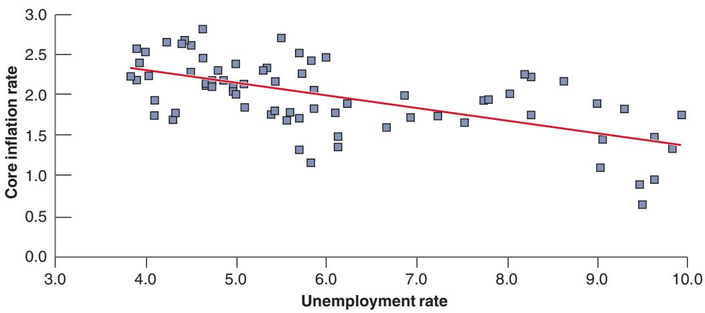
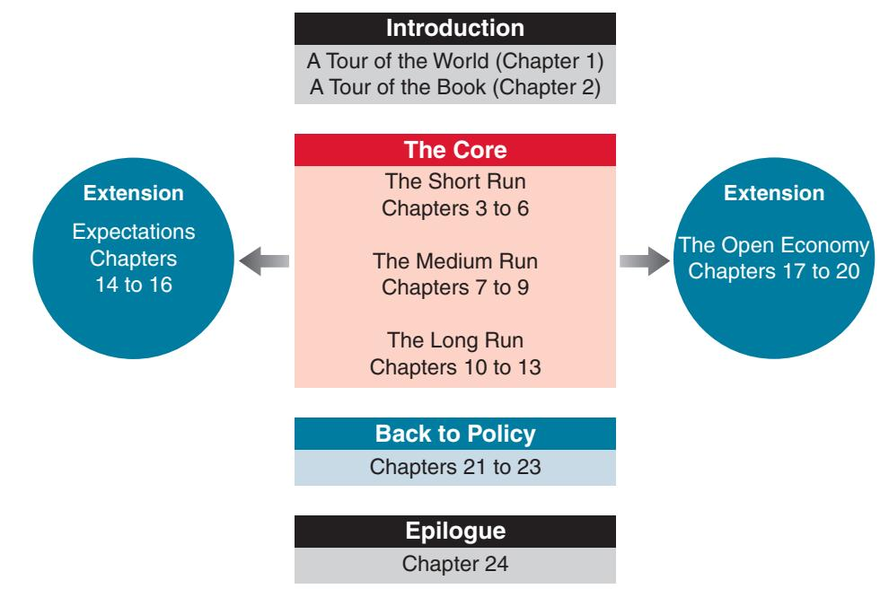

## The Phillips Curve

Okun’s law implies that, with strong enough growth, one can decrease the unemployment rate to very low levels. But intuition suggests that, when unemployment becomes very low, the economy is likely to overheat, and that this will lead to upward pressure on inflation. And, to a large extent, this is true. This relation was first explored in 1958 by a New Zealand economist, A. W. Phillips, and has become known as the Phillips curve. Phillips plotted the rate of inflation against the unemployment rate. Figure 2-6 does the same by plotting, on the vertical axis, the quarterly core inflation rate, which is the inflation rate constructed by leaving out volatile prices, such as food and energy, against the unemployment rate on the horizontal axis, together with the line that fits the cloud of points best, for the United States, quarterly since the first quarter of 2000. Looking at the figure again suggests two conclusions:

■ The line is downward sloping, although the fit is definitely not as good as it was for Okun’s law: Higher unemployment is associated, on average, with lower inflation; lower unemployment is associated with higher inflation. But this is only true on average. As we shall see later in Chapter 8, not only is the Phillips curve relation not as tight as Okun’s law, but it has evolved over time, complicating in important ways the job of central banks, which have to care about both inflation and unemployment.

■ Using the regression line, we can compute the rate of unemployment associated with a given rate of inflation. If, for example, we want the inflation rate to be 2%, which is the current target of the Fed and many other central banks, the line implies that the unemployment rate has to be roughly equal to 5%. In economic terms, since 2000, when unemployment has been below 5%, inflation has typically been above 2%. When unemployment has been above 5%, inflation has typically been above 2%. But again, the relation is not tight enough that the required unemployment rate can be pinned down precisely. Indeed, at the time of writing, unemployment is lower than 4% and core inflation is 2.2%, barely above 2%.

## Figure 2-6

Changes in the Inflation Rate versus the Unemployment Rate in the United States, 2000 Q1 To 2018 Q4.

Lower unemployment rate is associated with a higher inflation rate, higher unemployment rate with a lower inflation rate.

Source: FRED. Series GDPC, CPILFESL.

Clearly, a successful economy is an economy that combines high output growth, low unemployment, and low inflation. Can all these objectives be achieved simultaneously? Is low unemployment compatible with low and stable inflation? Do policymakers have the tools to sustain growth, to achieve low unemployment while maintaining low inflation? These are the questions we shall take up as we go through the book. The next two sections give you the road map.

## 2-5 THE SHORT RUN, THE MEDIUM RUN,AND THE LONG RUN

What determines the level of aggregate output in an economy? Consider three answers:

■ Newspaper articles suggest a first answer: Movements in output come from movements in the demand for goods. You probably have read news stories that begin like this: “Production and sales of automobiles were higher last month due to a surge in consumer confidence, which drove consumers to showrooms in record numbers.” Stories like these highlight the role demand plays in determining aggregate output; they point to factors that affect demand, ranging from consumer confidence to government spending to interest rates.

■ But, surely, no amount of Indian consumers rushing to Indian showrooms can raise India’s output to the level of output in the United States. This suggests a second answer: What matters when it comes to aggregate output is the supply side—how much the economy can produce. How much can be produced depends on how advanced the technology of the country is, how much capital it is using, and the size and the skills of its labor force. These factors—not consumer confidence—are the fundamental determinants of a country’s level of output.

■ The previous argument can be taken one step further: Neither technology, nor capital, nor skills are given. The technological sophistication of a country depends on its ability to innovate and introduce new technologies. The size of its capital stock depends on how much people have saved. The skills of workers depend on the quality of the country’s education system. Other factors are also important: If firms are to operate efficiently, for example, they need a clear system of laws under which to operate and an honest government to enforce those laws. This suggests a third answer: The true determinants of output are factors like a country’s education system, its saving rate, and the quality of its government. If we want to understand what determines the level of output, we must look at these factors.

The next three bullet points may be the most important You might be wondering at this point, which of the three answers is right? The fact is that all three are right. But each applies over a different time frame:lesson of the book. c

■ In the short run, say, a few years, the first answer is the right one. Year-to-year movements in output are primarily driven by movements in demand. Changes in demand, perhaps as a result of changes in consumer confidence or other factors, can lead to a decrease in output (a recession) or an increase in output (an expansion).

■ In the medium run, say, a decade, the second answer is the right one. Over the medium run, the economy tends to return to the level of output determined by supply factors: the capital stock, the level of technology, and the size of the labor force. And, over a decade or so, these factors move sufficiently slowly that we can take them as given.

In the long run, say, a few decades or more, the third answer is the right one. To understand why China has been able to achieve such a high growth rate since 1980, we must understand why both the capital stock and the level of technology in China are increasing so fast. To do so, we must look at factors like the education system, the saving rate, and the role of the government.

This way of thinking about the determinants of output underlies macroeconomics, and it underlies the organization of this book.

## 2-6 A TOUR OF THE BOOK

The book is organized in three parts: A core; two extensions; and, finally, a comprehensive look at the role of macroeconomic policy. This organization is shown in Figure 2-7. We now describe it in more detail.

Figure 2-7

The Organization of the Book.

## The Core

The core is composed of three parts—the short run, the medium run, and the long run.

■ Chapters 3 to 6 look at how output is determined in the short run. To focus on the role of demand, we assume that firms are willing to supply any quantity at a given price. In other words, we ignore supply constraints. Chapter 3 shows how the demand for goods determines output. Chapter 4 shows how monetary policy determines the interest rate. Chapter 5 puts the two together, by allowing demand to depend on the interest rate, and then showing the role of monetary and fiscal policy in determining output. Chapter 6 extends the model by introducing a richer financial system and using it to explain what happened during the financial crisis.

■ Chapters 7 to 9 develop the supply side and look at how output is determined in the medium run. Chapter 7 introduces the labor market. Chapter 8 builds on it to derive the relation between inflation and unemployment. Chapter 9 puts all the parts together, and shows the determination of output, unemployment, and inflation in both the short and the medium run.

■ Chapters 10 to 13 focus on the long run. Chapter 10 introduces the relevant facts by looking at the growth of output both across countries and over long periods of time. Chapters 11 and 12 discuss how both capital accumulation and technological progress determine growth. Chapter 13 looks at the challenges to growth, from inequality to global warming.

## Extensions

The core chapters give you a way of thinking about how output (and unemployment, and inflation) is determined over the short, medium, and long run. However, they leave out several elements, which are explored in two extensions:

■ Expectations play an essential role in macroeconomics. Nearly all the economic decisions people and firms make depend on their expectations about future income, future profits, future interest rates, and so on. Fiscal and monetary policies affect economic activity not only through their direct effects, but also through their effects on people’s and firms’ expectations. Although we touch on these issues in the core, Chapters 14 to 16 offer a more detailed treatment and draw the implications for fiscal and monetary policy.

■ The core chapters treat the economy as closed, ignoring its interactions with the rest of the world. But the fact is, economies are increasingly open, trading goods and services and financial assets with one another. As a result, countries are becoming more and more interdependent. The nature of this interdependence and the implications for fiscal and monetary policy are the topics of Chapters 17 to 20.

## Back to Policy

Monetary and fiscal policies are discussed in nearly every chapter of this book. But once the core and the extensions have been covered, it is useful to go back and put things together.

Chapter 21 focuses on general issues of policy, whether macroeconomists know enough about how the economy works to use policy as a stabilization tool at all, and whether policymakers can be trusted to do what is right.

Chapters 22 and 23 return to the role of fiscal and monetary policies.

## Epilogue

Macroeconomics is not a fixed body of knowledge. It evolves over time. The final chapter, Chapter 24, looks at the history of macroeconomics and how macroeconomists have come to believe what they believe today. From the outside, macroeconomics sometimes looks like a field divided among schools of economists—“Keynesians,” “monetarists,” “new classicals,” “supply-siders,” and so on—hurling arguments at each other. The actual process of research is more orderly and more productive than this image suggests. I identify what I see as the main differences among macroeconomists, and the set of propositions that define the core of macroeconomics today.

## SUMMARY

We can think of GDP, the measure of aggregate output, in three equivalent ways: (1) GDP is the value of the final goods and services produced in the economy during a given period; (2) GDP is the sum of value added in the economy during a given period; and (3) GDP is the sum of incomes in the economy during a given period.

Nominal GDP is the sum of the quantities of final goods produced times their current prices. This implies that changes in nominal GDP reflect both changes in quantities and changes in prices. Real GDP is a measure of output. Changes in real GDP reflect changes in quantities only.

A person is classified as unemployed if he or she does not have a job and is looking for one. The unemployment rate is the ratio of the number of people unemployed to the number of people in the labor force. The labor force is the sum of those employed and those unemployed.

Economists care about unemployment because of the human cost it represents. They also look at unemployment because it sends a signal about how efficiently the economy is using its resources. High unemployment indicates that the country is not using its resources efficiently.

Inflation is a rise in the general level of prices—the price level. The inflation rate is the rate at which the price level increases. Macroeconomists look at two measures of the price level. The first is the GDP deflator, which is the average price of the goods produced in the economy. The second is the Consumer Price Index (CPI), which is the average price of goods consumed in the economy.

Inflation leads to changes in income distribution, to distortions, and to increased uncertainty.

There are two important relations among output, unemployment, and inflation. The first, called Okun’s law, is a relation between output growth and the change in unemployment: High output growth typically leads to a decrease in the unemployment rate. The second, called the Phillips curve, is a relation between unemployment and inflation: A lower unemployment rate typically leads to a higher inflation rate.

Macroeconomists distinguish between the short run (a few years), the medium run (a decade), and the long run (a few decades or more). They think of output as being determined by demand in the short run. They think of output as being determined by the level of technology, the capital stock, and the labor force in the medium run. Finally, they think of output as being determined by factors like education, research, saving, and the quality of government in the long run.

## KEY TERMS

national income and product accounts, 20 aggregate output, 20 gross domestic product (GDP), 20 gross national product (GNP), 20 intermediate good, 20 final good, 21 value added, 21 nominal GDP, 22 real GDP, 22 real GDP in chained (2009) dollars, 23 dollar GDP, GDP in current dollars, 24

GDP in terms of goods, GDP in constant dollars, GDP adjusted for inflation, GDP in chained 2012 dollars, GDP in 2012 dollars, 24 real GDP per person, 24 GDP growth, 24 expansions, 24 recessions, 24 hedonic pricing, 25 employment, 25 unemployment, 25 labor force, 25

unemployment rate, 25 Current Population Survey (CPS), 26 not in the labor force, 26 discouraged workers, 26 participation rate, 26 inflation, 27 price level, 27 inflation rate, 27 deflation, 27 GDP deflator, 28

## QUESTIONS AND PROBLEMS

## QUICK CHECK

1. Using the information in this chapter, label each of the following statements true, false, or uncertain. Explain briefly.

a. US GDP was 38 times higher in 2018 than it was in 1960.

b. When the unemployment rate is high, the participation rate is also likely to be high.

c. The rate of unemployment tends to fall during expansions and rise during recessions.

d. If the Japanese CPI is currently at 108 and the US CPI is at 104, then the Japanese rate of inflation is higher than the US rate of inflation.

e. The rate of inflation computed using the CPI is a better index of inflation than the rate of inflation computed using the GDP deflator.

f. Okun’s law shows that when output growth is lower than normal, the unemployment rate tends to rise.

g. Periods of negative GDP growth are called recessions.

h. When the economy is functioning normally, the unemployment rate is zero.

i. The Phillips curve is a relation between the level of prices and the level of unemployment.

2. Suppose you are measuring annual US GDP by adding up the final value of all goods and services produced in the economy.

Determine the effect on GDP of each of the following transactions.

a. A seafood restaurant buys \$100 worth of fish from a fisherman.

b. A family spends \$100 on a fish dinner at a seafood restaurant.

c. Delta Air Lines buys a new jet from Boeing for \$200 million.

d. The Greek national airline buys a new jet from Boeing for \$200 million.

e. Delta Air Lines sells one of its jets to Jennifer Lawrence for \$100 million.

3. During a given year, the following activities occur:

i. A silver mining company pays its workers \$200,000 to mine 75 pounds of silver. The silver is then sold to a jewelry manufacturer for \$300,000.

ii. The jewelry manufacturer pays its workers \$250,000 to make silver necklaces, which the manufacturer sells directly to consumers for \$1,000,000.

index number, 28 cost of living, 29 Consumer Price Index (CPI), 29 Okun’s law, 31 Phillips curve, 32 core inflation, 32 short run, 34 medium run, 34 long run, 34

a. Using the production-of-final-goods approach, what is GDP in this economy?

b. What is the value added at each stage of production? Using the value-added approach, what is GDP?

c. What are the total wages and profits earned? Using the income approach, what is GDP?

4. An economy produces three goods: cars, computers, and oranges. Quantities and prices per unit for years 2012 and 2013 are as follows:

<table><tr><td rowspan="2"></td><td colspan="2">2012</td><td colspan="2">2013</td></tr><tr><td>Quantity</td><td>Price</td><td>Quantity</td><td>Price</td></tr><tr><td>Cars</td><td>10</td><td>$2000</td><td>12</td><td>$3000</td></tr><tr><td>Computers</td><td>4</td><td>$1000</td><td>6</td><td>$500</td></tr><tr><td>Oranges</td><td>1,000</td><td>$1</td><td>1000</td><td>$1</td></tr></table>

a. What is nominal GDP in 2012 and in 2013? By what percentage does nominal GDP change from 2012 to 2013?

b. Using the prices for 2012 as the set of common prices, what is real GDP in 2012 and in 2013? By what percentage does real GDP change from 2012 to 2013?

c. Using the prices for 2013 as the set of common prices, what is real GDP in 2012 and in 2013? By what percentage does real GDP change from 2012 to 2013?

d. Why are the two output growth rates constructed in parts b and c different? Which one is correct? Explain your answer.

## 5. Consider the economy described in Problem 4.

a. Use the prices for 2012 as the set of common prices to compute real GDP in 2012 and in 2013. Compute the GDP deflator for 2012 and for 2013, and compute the rate of inflation from 2012 to 2013.

b. Use the prices for 2013 as the set of common prices to compute real GDP in 2012 and in 2013. Compute the GDP deflator for 2012 and for 2013 and compute the rate of inflation from 2012 to 2013.

c. Why are the two rates of inflation different? Which one is correct? Explain your answer.

6. Consider the economy described in Problem 4.

a. Construct real GDP for years 2012 and 2013 by using the average price of each good over the two years.

b. By what percentage does real GDP change from 2012 to 2013?

c. What is the GDP deflator in 2012 and 2013? Using the GDP deflator, what is the rate of inflation from 2012 to 2013?

d. Is this an attractive solution to the problems pointed out in Problems 4 and 5 (i.e., two different growth rates and two different inflation rates, depending on which set of prices is used)? (The answer is yes and is the basis for the construction of chained-type deflators. See the appendix to this chapter for more discussion.)

## 7. The Consumer Price Index

The Consumer Price Index represents the average price of goods that households consume. Many thousands of goods are included in such an index. Here consumers are represented as buying only food (pizza) and gas as their basket of goods. Here is a representation of the kind of data the Bureau of Economic Analysis collects to construct a consumer price index. In the base year, 2012, both the prices of goods purchased and the quantity of goods purchased are collected. In subsequent years, only prices are collected. Each year, the agency collects the price of that good and constructs an index of prices that represents two exactly equivalent concepts: How much more money does it take to buy the same basket of goods in the current year than in the base year? How much has the purchasing power of money declined, measured in baskets of goods, in the current year, from the base year?

The data: In an average week in 2012, the Bureau of Economic Analysis surveys many consumers and determines that the average consumer purchases 2 pizzas and 6 gallons of gas in a week. The prices per pizza and per gallon in subsequent years are shown below.

<table><tr><td>Year</td><td>Price of Pizzas</td><td>Price of Gas</td></tr><tr><td>2012</td><td>$10</td><td>$3</td></tr><tr><td>2013</td><td>$11</td><td>$3.30</td></tr><tr><td>2014</td><td>$11.55</td><td>$3.47</td></tr><tr><td>2015</td><td>$11.55</td><td>$3.50</td></tr><tr><td>2016</td><td>$11.55</td><td>$2.50</td></tr><tr><td>2017</td><td>$11.55</td><td>$3.47</td></tr></table>

a. What is the cost of the consumer price basket in 2012?

b. What is the cost of the consumer price basket in 2013 and in subsequent years?

c. Represent the annual cost of the consumer price basket as an index number. Set the value of the index number equal to 100 in 2012.

d. Calculate the annual rate of inflation using the percent change in the value of the index number between each year from 2013 on.

You may find it helpful to fill in the table below:

<table><tr><td rowspan="2">Year</td><td colspan="2">Consumer Price Index</td></tr><tr><td>2012 = 100</td><td>Inflation rate</td></tr><tr><td>2012</td><td>100</td><td></td></tr><tr><td>2013</td><td></td><td></td></tr><tr><td>2014</td><td></td><td></td></tr><tr><td>2015</td><td></td><td></td></tr><tr><td>2016</td><td></td><td></td></tr><tr><td>2017</td><td></td><td></td></tr></table>

e. Is there a year in which inflation is negative? Why does this happen?

f. What is the source of inflation in the year 2015? How is that different from inflation in 2013 and 2014?

g. How many baskets of goods can I buy with \$100 in 2012? How many baskets can I buy with that money in 2017? What is the percentage decline in the purchasing power of my money? How does that decline relate to the change in the value of the price index between 2012 and 2017?

h. From 2013 to 2015, the price of a pizza remains the same. The price of gas rises. How might consumers respond to such a change? In 2016, the price of gas falls. What are the implications of such changes in relative prices for the construction of the Consumer Price Index?

i. Suppose the Bureau of Economic Analysis determines that in 2017, the average consumer buys 2 pizzas and 7 gallons of gas in a week. Use a spreadsheet to calculate the Consumer Price Index set equal to 100 in 2017 and use the 2017 basket in the years from 2012 to 2017. Fill in the table below:

<table><tr><td rowspan="2">Year</td><td colspan="2">Consumer Price Index</td></tr><tr><td>2017 = 100</td><td>Inflation rate</td></tr><tr><td>2012</td><td></td><td></td></tr><tr><td>2013</td><td></td><td></td></tr><tr><td>2014</td><td></td><td></td></tr><tr><td>2015</td><td></td><td></td></tr><tr><td>2016</td><td></td><td></td></tr><tr><td>2017</td><td>100</td><td></td></tr></table>

Why are the inflation rates (slightly) different in part d and part i?

8. Using macroeconomic relations:

a. Okun’s law states that when output growth is higher than usual, the unemployment rate tends to fall. Explain why usual output growth is positive.

b. In which year—a year in which output growth is 2% or a year in which it is –2%—will the unemployment rate rise more?

c. The Phillips curve is a relation between the inflation rate and the unemployment rate. Using the Phillips curve, is the unemployment rate zero when the rate of inflation is 2%?

d. The Phillips curve is often portrayed as a line with a negative slope. In Figure 2-6, the slope is about - 0.17. In your opinion, will the economy be “better” if the line has a large slope, say –0.5, or a smaller slope, say - 0.1?

## DIG DEEPER

## 9. Hedonic pricing

As the first Focus box in this chapter explains, it is difficult to measure the true increase in prices of goods whose characteristics change over time. For such goods, part of any price increase can be attributed to an increase in quality. Hedonic pricing offers a method to compute the quality-adjusted increase in prices.

a. Consider the case of a routine medical check-up. Name some reasons you might want to use hedonic pricing to measure the change in the price of this service.

Now consider the case of a medical check-up for a pregnant woman. Suppose that a new ultrasound method is introduced. In the first year that this method is available, half of doctors offer the new method, and half offer the old method. A check-up using the new method costs 10% more than a check-up using the old method.

b. In percentage terms, how much of a quality increase does the new method represent over the old method? (Hint: Consider the fact that some women choose to see a doctor offering the new method when they could have chosen to see a doctor offering the old method.)

Now, in addition, suppose that in the first year the new ultrasound method is available, the price of check-ups using the new method is 15% higher than the price of check-ups in the previous year (when everyone used the old method).

c. How much of the higher price for check-ups using the new method (as compared to check-ups in the previous year) reflects a true price increase of check-ups and how much represents a quality increase? In other words, how much higher is the quality-adjusted price of check-ups using the new method

as compared to the price of check-ups in the previous year? In many cases, the kind of information we used in parts (b) and (c) is not available. For example, suppose that in the year the new ultrasound method is introduced, all doctors adopt the new method, so the old method is no longer used. In addition, continue

## FURTHER READINGS

In 1995, the US Senate set up a commission to study the construction of the CPI and make recommendations about potential changes. The commission concluded that the rate of inflation computed using the CPI was on average about 1% too high. If this conclusion is correct, this implies in particular that real wages (nominal wages divided by the

to assume that the price of check-ups in the year the new method is introduced is 15% higher than the price of check-ups in the previous year (when everyone used the old method). Thus, we observe a 15% price increase in check-ups, but we realize that the quality of check-ups has increased.

d. Under these assumptions, what information required to compute the quality-adjusted price increase of checkups is lacking? Even without this information, can we say anything about the quality-adjusted price increase of check-ups? Is it more than 15%? Less than 15%? Explain.

## 10. Measured and true GDP

Suppose that instead of cooking dinner for an hour, you decide to work an extra hour, earning an additional \$12. You then purchase some (takeout) Chinese food, which costs you \$10.

a. By how much does measured GDP increase?

b. Do you think the increase in measured GDP accurately reflects the effect on output of your decision to work? Explain.

## EXPLORE FURTHER

11. Comparing the recessions of 2000 and 2008.

One very easy to use source of data is the FRED database. The series that measures real GDP is GDPC1, real GDP in each quarter of the year expressed at a seasonally adjusted annual rate (denoted SAAR). The monthly series for the unemployment rate is UNRATE. You can download these series in a variety of ways from this database.

a. Look at the data on quarterly real GDP growth from 1999 through 2001 and then from 2007 through 2009. Which recession has larger negative values for GDP growth, the recession centered on 2000 or the recession centered on 2008?

b. The unemployment rate is series UNRATE. Is the unemployment rate higher in the 2001 recession or the 2009 recession?

c. The National Bureau of Economic Research (NBER), which dates recessions, identified a recession beginning in March 2001 and ending in November 2001. The equivalent dates for the next, longer recession were December 2007 ending June 2009. In other words, according to the NBER, the economy began a recovery in November 2001 and in June 2009. Given your answers to parts a and b, do you think the labor market recovered as quickly as GDP? Explain.

For more on NBER recession dating, visit www.nber.org. This site provides a history of recession dates and some discussion of NBER’s methodology.

CPI) have grown 1% more per year than is currently being reported. For more on the conclusions of the commission and some of the exchanges that followed, read “Consumer Prices, the Consumer Price Index, and the Cost of Living, by Michael Boskin et al., Journal of Economic Perspectives, 1998, 12(1): pp. 3–26.

For a short history of the construction of the National Income Accounts, read GDP: One of the Great Inventions of the 20th Century, Survey of Current Business, January 2000, 1–9 (www.bea.gov/scb/pdf/ BEAWIDE/2000/0100od.pdf).

For a discussion of some of the problems involved in measuring activity, read Katherine Abraham, “What We Don’t Know Could Hurt Us; Some Reflections on the Measurement of Economic Activity,” Journal of Economic Perspectives, 2005, 19(3): pp. 3–18.

To see why it is hard to measure the price level and output correctly, read “Viagra and the Wealth of Nations” by Paul Krugman, New York Times, August 23, 1998 (www.pkarchive. org/theory/viagra.html). (Paul Krugman is a Nobel Prize–

winning economist and a columnist at the New York Times. His columns are opinionated, insightful, and fun to read.)

Data underlying the construction of the CPI are typically collected monthly, from visits to stores. With the advent of the internet and big data methods, the process seems archaic. And, indeed, the Billion Prices Project (www.thebillionpricesproject.com/) now constructs daily price indexes, based on 15 million products from 900 retailers in 20 countries. The project turned out to particularly useful in Argentina in the late 2000s when the government started manipulating official numbers in order to minimize reported inflation. The project was able to show that the true rate of inflation was more than double the rate reported by the government.
