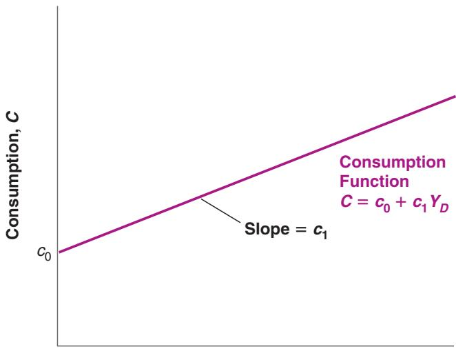

## The Goods Market

on the interactions among demand, production, and income:

■ Changes in the demand for goods lead to changes in production.

■ Changes in production lead to changes in income.

■ Changes in income lead to changes in the demand for goods.

Nothing makes the point better than this cartoon:

This chapter looks at these interactions and their implications.

Section 3-1 looks at the composition of GDP and the different sources of the demand for goods.

Section 3-2 looks at the determinants of the demand for goods.

Section 3-3 shows how equilibrium output is determined by the condition that the production of goods must be equal to the demand for goods.

Section 3-4 gives an alternative way of thinking about the equilibrium, based on the equality of investment and saving.

Section 3-5 takes a first pass at the effects of fiscal policy on equilibrium output.

If you remember one basic message from this chapter, it should be: In the short run, demand determines output.

## 3-1 THE COMPOSITION OF GDP

The terms output and production are synonymous. There is no rule for using one or the other. Use the one that sounds better.

Warning! To most people, the term investment refers to the purchase of assets like gold or shares of General Motors. Economists use investment to refer to the purchase of new capital goods, such as (new) machines, (new) buildings, or (new) houses. When economists refer to the purchase of gold, or shares of General Motors, or other financial assets, they use the term financial investment.

The purchase of a machine by a firm, the decision to go to a restaurant by a consumer, and the purchase of combat airplanes by the federal government are clearly different decisions and depend on different factors. So, if we want to understand what determines the demand for goods, it makes sense to decompose aggregate output (GDP) from the point of view of the different goods being produced, and from the point of view of the different buyers for these goods.

The decomposition of GDP (which we shall denote by the letter Y when we use algebra throughout this book) typically used by macroeconomists is shown in Table3-1 (a more detailed version, with precise definitions, appears in Appendix 1 at the end of the book).

■ First comes consumption (C). These are the goods and services purchased by consumers, ranging from food to airline tickets, to new cars, and so on. Consumption is by far the largest component of GDP. In 2018, it accounted for 68% of GDP.

■ Second comes investment (I), sometimes called fixed investment to distinguish it from inventory investment (which we will discuss later). Investment is the sum of nonresidential investment, the purchase by firms of new plants or new machines (from turbines to computers), and residential investment, the purchase by people of new houses or apartments.

Nonresidential investment and residential investment, and the decisions behind them, have more in common than might first appear. Firms buy machines or plants to produce output in the future. People buy houses or apartments to get housing services in the future. In both cases, the decision to buy depends on the services these goods will yield in the future, so it makes sense to treat them together. Together, nonresidential and residential investment accounted for 17.5% of GDP in 2018.

Table 3-1 The Composition of US GDP, 2018

<table><tr><td></td><td></td><td>Billions of Dollars</td><td>Percent of GDP</td></tr><tr><td></td><td>GDP (Y)</td><td>20,500</td><td>100.0</td></tr><tr><td>1</td><td>Consumption (C)</td><td>13,951</td><td>68.0</td></tr><tr><td rowspan="3">2</td><td>Investment (I)</td><td>3,595</td><td>17.5</td></tr><tr><td>Nonresidential</td><td>2,800</td><td>13.6</td></tr><tr><td>Residential</td><td>795</td><td>3.8</td></tr><tr><td>3</td><td>Government spending (G)</td><td>3,522</td><td>17.2</td></tr><tr><td rowspan="3">4</td><td>Net exports</td><td>-625</td><td>-3.0</td></tr><tr><td>Exports (X)</td><td>2,550</td><td>12.4</td></tr><tr><td>Imports (IM)</td><td>-3,156</td><td>-15.4</td></tr><tr><td>5</td><td>Inventory investment</td><td>56</td><td>0.2</td></tr><tr><td colspan="4">Source: Survey of Current Business, February 2019, Table 1-1-5</td></tr></table>

■ Third comes government spending (G). This represents the purchases of goods and services by the federal, state, and local governments. The goods range from airplanes to office equipment. The services include services provided by government employees: In effect, the national income accounts treat the government as buying the services provided by government employees—and then providing these services to the public, free of charge.

Note that G does not include government transfers, like Medicare or Social Security payments, nor interest payments on the government debt. Although these are clearly government expenditures, they are not purchases of goods and services. That is why the number for government spending on goods and services in Table 3-1, 17.2% of GDP, is smaller than the number for total government spending including transfers and interest payments. That number, in 2018, was approximately 33.0% of GDP when transfers and interest payments of federal, state, and local governments are combined.

■ The sum of lines 1, 2, and 3 gives the purchases of goods and services by US consumers, US firms, and the US government. To determine the purchases of US goods and services, two more steps are needed:

First, we must add exports (X), the purchases of US goods and services by foreigners.

Second, we must subtract imports (IM), the purchases of foreign goods and services by US consumers, US firms, and the US government.

The difference between exports and imports is called net exports 1X - IM2, or the trade balance. If exports exceed imports, the country is said to run a trade surplus. If exports are less than imports, the country is said to run a trade deficit. In 2018, US exports accounted for 12.4% of GDP. US imports were equal to 15.4% of GDP, so the United States was running a trade deficit equal to 3.0% of GDP.

■ So far we have looked at various sources of purchases (sales) of US goods and services in 2018. To determine US production in 2018, we need to take one last step: In any given year, production and sales need not be equal. Some of the goods produced in a given year are not sold in that year but in later years. And some of the goods sold in a given year may have been produced in a previous year. The difference between goods produced and goods sold in a given year—the difference between production and sales, in other words—is called inventory investment.

If production exceeds sales and firms accumulate inventories as a result, then inventory investment is said to be positive. If production is less than sales and firms’ inventories fall, then inventory investment is said to be negative. Inventory investment is typically small—positive in some years and negative in others. In 2018, inventory investment was positive, equal to just \$56 billion. Put another way, production was higher than sales by an amount equal to \$56 billion.

We now have what we need to develop our first model of output determination.

## 3-2 THE DEMAND FOR GOODS

Denote the total demand for goods by Z. Using the decomposition of GDP we saw in Section 3-1, we can write Z as

$$
Z \equiv C + I + G + X - I M
$$

Exports > imports

3 trade surplus

Imports > exportsb

3 trade deficit

Although it is called “inventory investment,” the word investment is slightly misleading. In contrast to fixed investment, which represents decisions by firms, inventory investment is partly involuntary, reflecting the fact that firms did not anticipate sales accurately in making produc-b tion plans.

Make sure you understand each of these three equivalent ways of stating the relations among production, sales, and inventory investment:

Inventory Investment = Production - Sales

Production = Sales + Inventory Investment

Sales

Production - Inventory Investment

Recall that inventory invest- This equation is an identity (which is why it is written using the symbol $^ { 6 6 } \equiv ^ { \prime \prime }$ rather than an equals sign). It defines Z as the sum of consumption, plus investment, plusment is not part of demand. c government spending, plus exports, minus imports.

We now need to think about the determinants of Z. To make the task easier, let’s first make a number of simplifications:

Assume that all firms produce the same good, which can then be used by consumers for consumption, by firms for investment, or by the government. With this (big) simplification, we need to look at only one market—the market for “the” good—and think about what determines supply and demand in that market.

issue at hand.

■ Assume that firms are willing to supply any amount of the good at a given price level (P). This assumption allows us to focus on the role demand plays in the determination of output. As we shall see, this assumption is valid only in the short run. When we move to the study of the medium run (starting in Chapter 7), we shall abandon it. But for the moment, it will simplify our discussion.

■ Assume that the economy is closed—that it does not trade with the rest of the world: Both exports and imports are zero. This assumption clearly goes against the facts: Modern economies trade with the rest of the world. Later on (starting in Chapter 17), we will abandon this assumption as well and look at what happens when the economy is open. But, for the moment, this assumption will also simplify our discussion because we won’t have to think about what determines exports and imports.

Under the assumption that the economy is closed, $X = I M = 0$ , so the demand for goods Z is simply the sum of consumption, investment, and government spending:

$$
Z \equiv C + I + G
$$

Let’s discuss each of these three components in turn.

## Consumption (C)

Consumption decisions depend on many factors. But the main one is surely income, or, more precisely, disposable income $\left( { { Y } _ { D } } \right)$ , the income that remains once consumers have received transfers from the government and paid their taxes. When their disposable income goes up, people buy more goods; when it goes down, they buy fewer goods.

We can then write:

$$
\begin{array}{c} C = C (Y _ {D}) \\ (+) \end{array}\tag{3.1}
$$

This is a formal way of stating that consumption C is a function of disposable income $Y _ { D } .$ The function $C ( Y _ { D } )$ is called the consumption function. The positive sign below $Y _ { D }$ reflects the fact that when disposable income increases, so does consumption. Economists call such an equation a behavioral equation to indicate that the equation captures some aspect of behavior—in this case, the behavior of consumers.

We will use functions in this book as a way of representing relations between variables. What you need to know about functions—which is very little—is described in Appendix 2 at the end of the book. This appendix develops the mathematics you need to go through this book. Not to worry: I shall always describe a function in words when I introduce it for the first time.

It is often useful to be more specific about the form of the function. Here is such a case. It is reasonable to assume that the relation between consumption and disposable income is given by the simpler relation:

$$
C = c _ {0} + c _ {1} Y _ {D}\tag{3.2}
$$

In other words, it is reasonable to assume that the function is a linear relation. The relation between consumption and disposable income is then characterized by two parameters, $c _ { 0 }$ and $c _ { 1 } { : }$

Think about your own consumption behavior. What are your values of $c _ { 0 }$ and $c _ { 1 } ?$

■ The parameter $c _ { 1 }$ is called the propensity to consume. (It is also called the marginal propensity to consume. I will drop the word marginal for simplicity.) It gives the effect an additional dollar of disposable income has on consumption. If $c _ { 1 }$ is equal $\tan 0 . 6 ,$ , then an additional dollar of disposable income increases consumption by ${ \$ 1} \times { 0.6} \mathrm { ~ = ~ } 6 0 \mathrm { c e n t s }$

A natural restriction on $c _ { 1 }$ is that it be positive: An increase in disposable income is likely to lead to an increase in consumption. Another natural restriction is that $c _ { 1 }$ be less than 1: People are likely to consume only part of any increase in disposable income and save the rest.

■ The parameter $c _ { 0 }$ has a literal interpretation. It is what people would consume if their disposable income in the current year were equal to zero: If $Y _ { D }$ equals zero in equation (3.2), $C = c _ { 0 } .$ . If we use this interpretation, a natural restriction is that, if current income were equal to zero, consumption would still be positive: With or without income, people still need to eat! This implies that $c _ { 0 }$ is positive. How can people have positive consumption if their income is equal to zero? Answer: They dissave. They consume either by selling some of their assets or by borrowing.

■ The parameter $c _ { 0 }$ has a less literal and more frequently used interpretation. Changes in $c _ { 0 }$ reflect changes in consumption for a given level of disposable income. Increases in $c _ { 0 }$ reflect an increase in consumption given income, decreases in $c _ { 0 }$ a decrease. There are many reasons why people may decide to consume more or less, given their disposable income. They may, for example, find it easier or more difficult to borrow, or may become more or less optimistic about the future. An example of a decrease in $c _ { 0 }$ is given in the Focus Box, “The Lehman Bankruptcy, Fears of Another Great Depression, and Shifts in the Consumption Function.”

The relation between consumption and disposable income shown in equation (3.2) is drawn in Figure 3-1. Because it is a linear relation, it is represented by a straight line. Its intercept with the vertical axis is $c _ { 0 } ;$ its slope is $c _ { 1 } .$ . Because $c _ { 1 }$ is less than 1, the slope of the line is less than 1: Equivalently, the line is flatter than a 45-degree line. If the value of $c _ { 0 }$ increases, then the line shifts up by the same amount. (A refresher on graphs, slopes, and intercepts is given in Appendix 2 at the end of the book.)

  
Disposable Income, $\pmb { Y _ { D } }$  
Figure 3-1 Consumption and Disposable Income

Consumption increases with disposable income but less than one for one. A lower value of $c _ { 0 }$ will shift the entire line down.

major taxes paid by individuals are income taxes and Social Security contributions. The main government transfers are Social Security benefits, Medicare (health care for retirees), and Medicaid (health care for the poor). In 2018, taxes and social contributions paid by individuals were \$2,990 billion, and government transfers to individuals were \$3,000 billion.

Next we need to define disposable income $Y _ { D } .$ . Disposable income is given by

$$
Y _ {D} \equiv Y - T
$$

where Y is income and T is taxes paid minus government transfers received by consumers.c For short, we will refer to T simply as taxes—but remember that it is equal to taxes minus transfers. Note that the equation is an identity, indicated by $^ { 6 6 } \equiv ^ { \prime 9 }$

Replacing $Y _ { D }$ in equation (3.2) gives

$$
C = c _ {0} + c _ {1} (Y - T)\tag{3.3}
$$

Equation (3.3) tells us that consumption C is a function of income Y and taxes T. Higher income increases consumption, but less than one for one. Higher taxes decrease consumption, also less than one for one.

## Investment (I)

Models have two types of variables. Some variables depend on other variables in the model and are therefore explained within the model. Variables like these are called endogenous variables. This was the case for consumption given previously. Other variables are not explained within the model but are instead taken as given. Variables like these are called exogenous variables. This is how we will treat investment here. We will take investment as given and write:

$$
I = \bar {I}\tag{3.4}
$$

Putting a bar on investment is a simple typographical way to remind us that we take investment as given.

We take investment as given to keep our model simple. But the assumption is not innocuous. It implies that, when we later look at the effects of changes in production, we will assume that investment does not respond to changes in production. It is not hard to see that this implication may be a bad description of reality: Firms that experience an increase in production might well decide they need more machines and increase their investment as a result. For now, though, we will leave this mechanism out of the model. In Chapter 5 we will introduce a more realistic treatment of investment.

## Government Spending (G)

The third component of demand in our model is government spending, G. Together with taxes T, G describes fiscal policy—the choice of taxes and spending by the government. Just as we did for investment, we will take G and T as exogenous. But the reason why we assume G and T are exogenous is different from the reason we assumed investment is exogenous. It is based on two distinct arguments:

■ First, governments do not behave with the same regularity as consumers or firms, so there is no reliable rule we could write for G or T corresponding to the rule we wrote, for example, for consumption. (This argument is not airtight, though. Even if governments do not follow simple behavioral rules as consumers do, a good part of their behavior is predictable. We will look at these issues later, in particular in Chapters 22 and 23. Until then, I shall set them aside.)

Because we will (nearly always) take G and T as exogenous, I won’t use a bar to denote their values. This will keep the notation lighter. c

■ Second, and more importantly, one of the tasks of macroeconomists is to think about the implications of alternative spending and tax decisions. We want to be able to say, “If the government chose these values for G and T, this is what would happen.” The approach in this book will typically treat G and T as variables chosen by the government and will not try to explain them within the model.

# 3-3 THE DETERMINATION OF EQUILIBRIUM OUTPUT

Let’s put together the pieces we have introduced so far.

Assuming that exports and imports are both equal to zero, the demand for goods is the sum of consumption, investment, and government spending:

$$
Z \equiv C + I + G
$$

Replacing C and I from equations (3.3) and (3.4), we get

$$
Z = c _ {0} + c _ {1} (Y - T) + \bar {I} + G\tag{3.5}
$$

The demand for goods Z depends on income Y, taxes T, investment I, and government spending G.

Let’s now turn to equilibrium in the goods market, and the relation between production and demand. If firms hold inventories, then production need not be equal to demand: For example, firms can satisfy an increase in demand by drawing upon their inventories—by having negative inventory investment. They can respond to a decrease in demand by continuing to produce and accumulating inventories—by having positive inventory investment. Let’s first ignore this complication, though, and begin by assuming that firms do not hold inventories. In this case, inventory investment is always equal to zero, and equilibrium in the goods market requires that production Y be equal to the demand for goods Z:

$$
Y = Z\tag{3.6}
$$

Think of an economy that produces only haircuts. There cannot be inventories of haircuts—haircuts produced but not sold?—so production must always be equal to demand.

This equation is called an equilibrium condition. Models include three types of equations: identities, behavioral equations, and equilibrium conditions. You now have seen examples of each: The equation defining disposable income is an identity, the consumption function is a behavioral equation, and the condition that production equals demand is an equilibrium condition.

Replacing demand Z in (3.6) by its expression from equation (3.5) gives

$$
Y = c _ {0} + c _ {1} (Y - T) + \bar {I} + G\tag{3.7}
$$

There are three types of equations: Identities Behavioral equations Equilibrium conditions

Equation (3.7) represents algebraically what we stated informally at the beginning of this chapter:

In equilibrium, production Y (the left side of the equation), is equal to demand (the right side). Demand in turn depends on income Y, which is itself equal to production.

Note that we are using the same symbol Y for production and income. This is no accident! As you saw in Chapter 2, we can look at GDP either from the production side or from the income side. Production and income are identically equal.

Having constructed a model, we can solve it to look at what determines the level of output—how output changes in response to, say, a change in government spending. Solving a model means not only solving it algebraically but also understanding why the results are what they are. In this book, solving a model will also mean characterizing the results using graphs—sometimes skipping the algebra altogether—and describing the results and the mechanisms in words. Macroeconomists always use these three tools:

1. Algebra to make sure that the logic is correct,

2. Graphs to build the intuition, and

3. Words to explain the results.

Make it a habit to do the same.

## Using Algebra

Rewrite the equilibrium equation (3.7):

$$
Y = c _ {0} + c _ {1} Y - c _ {1} T + \bar {I} + G
$$

Move $c _ { 1 } Y$ to the left side and reorganize the right side:

$$
(1 - c _ {1}) Y = c _ {0} + \bar {I} + G - c _ {1} T
$$

Divide both sides by $( 1 - c _ { 1 } )$ :

$$
Y = \frac {1}{1 - c _ {1}} \left[ c _ {0} + \bar {I} + G - c _ {1} T \right]\tag{3.8}
$$

Equation (3.8) characterizes equilibrium output, i.e. the level of output such that production equals demand. Let’s look at both terms on the right, beginning with the term in brackets.

■ The term $[ c _ { 0 } + \bar { I } + G - c _ { 1 } T ]$ is the part of the demand for goods that does not depend on output. For this reason, it is called autonomous spending.

Can we be sure that autonomous spending is positive? We cannot, but it is very likely to be. The first two terms in brackets, $c _ { 0 }$ and I, are positive. What about the last two, $\mathrm { ~ G ~ - ~ } c _ { 1 } T \colon$ Suppose the government is running a balanced budget—taxes equal government spending. If $T = G$ , and the propensity to consume $\left( c _ { 1 } \right)$ is less than 1 (as we have assumed), then $\left( G - c _ { 1 } T \right)$ is positive and so is autonomous spending. Only if the government were running a very large budget surplus—if taxes were much larger than government spending—could autonomous spending be negative. We can safely ignore that case here.

${ \mathsf { I f } } { \mathsf { T } } = { \mathsf { G } } ,$ then $\begin{array} { c } { { ( G - c _ { 1 } T ) = ( T - c _ { 1 } T ) } } \\ { { = ( 1 - c _ { 1 } ) T > 0 \gg } } \end{array}$

■ Turn to the first term, $1 / ( 1 - c _ { 1 } )$ . Because the propensity to consume $\left( c _ { 1 } \right)$ is between zero and 1, $1 / ( 1 - c _ { 1 } )$ is a number greater than one. For this reason, this number, which multiplies autonomous spending, is called the multiplier. The closer $c _ { 1 }$ is to 1, the larger the multiplier.

What does the multiplier imply? Suppose that, for a given level of income, consumers decide to consume more. More concretely, assume that $c _ { 0 }$ in equation (3.3) increases by \$1 billion. Equation (3.8) tells us that output will increase by more than \$1 billion. For example, if $c _ { 1 }$ equals 0.6, the multiplier equals $1 / ( 1 - 0 . 6 ) = 1 / 0 . 4 = 2 . 5$ , so that output increases by $2 . 5 \times \$ 16 i l l i o n =82 .$ 5 billion

We have looked at an increase in consumption, but equation (3.8) makes it clear that any change in autonomous spending—from a change in investment, to a change in government spending, to a change in taxes—will have the same qualitative effect: It will change output by more than its direct effect on autonomous spending.

Where does the multiplier effect come from? Looking back at equation (3.7) gives us the clue: An increase in $c _ { 0 }$ increases demand. The increase in demand then leads to an increase in production. The increase in production leads to an equivalent increase in income (remember the two are identically equal). The increase in income further increases consumption, which further increases demand, and so on. The best way to describe this mechanism is to represent the equilibrium using a graph. Let’s do that.

## Using a Graph

Let’s characterize the equilibrium graphically.

■ First, plot production as a function of income.

In Figure 3-2, measure production on the vertical axis. Measure income on the horizontal axis. Plotting production as a function of income is straightforward: Recall that production and income are identically equal. Thus, the relation between them is the 45-degree line, the line with a slope equal to 1.

■ Second, plot demand as a function of income.

The relation between demand and income is given by equation (3.5). Let’s rewrite it here for convenience, regrouping the terms for autonomous spending together in the term in parentheses:

$$
Z = \left(c _ {0} + \bar {I} + G - c _ {1} T\right) + c _ {1} Y\tag{3.9}
$$

Demand depends on autonomous spending and on income—via its effect on consumption. The relation between demand and income is drawn as ZZ in the graph. The intercept with the vertical axis—the value of demand when income is equal to zero— equals autonomous spending. The slope of the line is the propensity to consume, $c _ { 1 } { : }$ When income increases by 1, demand increases by $c _ { 1 }$ Under the restriction that $c _ { 1 }$ is positive but less than 1, the line is upward sloping but has a slope of less than 1.

■ In equilibrium, production equals demand.

Equilibrium output, Y, therefore occurs at the intersection of the 45-degree line and the demand function. This is at point A. To the left of A, demand exceeds production; to the right of A, production exceeds demand. Only at A are demand and production equal.

Suppose that the economy is at the initial equilibrium, represented by point A in the graph, with production equal to Y.

  
Income, Y  
Figure 3-2  
Equilibrium in the Goods Market

Equilibrium output is determined by the condition that production is equal to demand.

This makes use of the second interpretation of changes in $c _ { 0 } .$ How much more consumers are willing to spend at a given level of income.

Figure 3-3

The Effects of an Increase in Autonomous Spending on Output

An increase in autonomous spending has a more than one-for-one effect on equilibrium output.

Now suppose $c _ { 0 }$ increases by \$1 billion. At the initial level of income (the level of disposable income associated with point A since T is unchanged in this example), con-c sumers increase their consumption by \$1 billion. What happens is shown in Figure 3-3, which builds on Figure 3-2.

Equation (3.9) tells us that, for any value of income, if $c _ { 0 }$ is higher by \$1 billion, demand is higher by \$1 billion. Before the increase in $c _ { 0 }$ the relation between demand and income was given by the line ZZ. After the increase in $c _ { 0 }$ by \$1 billion, the relation between demand and income is given by the line $\mathrm { Z Z ^ { \prime } }$ , which is parallel to ZZ but higher by \$1 billion. In other words, the demand curve shifts up by \$1 billion. The new equilibrium is at the intersection of the 45-degree line and the new demand relation, at point $A ^ { \prime }$

Equilibrium output increases from Y to $Y ^ { \prime }$ . The increase in output, $( Y ^ { \prime } \mathrm { ~ - ~ } Y )$ , which we can measure either on the horizontal or the vertical axis, is larger than the initial increase in consumption of \$1 billion. This is the multiplier effect.

With the help of the graph, it becomes easier to tell how and why the economy moves from A to $A ^ { \prime }$ . The initial increase in consumption leads to an increase in demand of \$1 billion. At the initial level of income, Y, the level of demand is shown by point B:

Demand is \$1 billion higher. To satisfy this higher level of demand, firms increase production by \$1 billion. This increase in production of \$1 billion implies that income increases by \$1 billion (recall: income = production), so the economy moves to point C. (In other words, both production and income are higher by \$1 billion.) But this is not the end of the story. The increase in income leads to a further increase in demand. Demand is now shown by point D. Point D leads to a higher level of production, and so on, until the economy is at $A ^ { \prime }$ , where production and demand are again equal. This is therefore the new equilibrium.

We can pursue this line of explanation a bit more, which will give us another way to think about the multiplier.

■ The first-round increase in demand, shown by the distance AB in Figure 3-3—equals \$1 billion.

■ This first-round increase in demand leads to an equal increase in production, or \$1 billion, which is also shown by the distance AB.

■ This first-round increase in production leads to an equal increase in income, shown by the distance BC, also equal to \$1 billion.

■ The second-round increase in demand, shown by the distance CD, equals \$1 billion (the increase in income in the first round) times the propensity to consume, $c _ { 1 } -$ hence, $\$ 0$ billion.

■ This second-round increase in demand leads to an equal increase in production, also shown by the distance CD, and thus an equal increase in income, shown by the distance DE.

■ The third-round increase in demand equals $\$ 0$ billion (the increase in income in the second round) times $c _ { 1 }$ , the marginal propensity to consume; it is equal to $\$ 123,456$ billion, and so on.

Following this logic, the total increase in production after, say, $n + 1$ rounds equals \$1 billion times the sum:

$$
1 + c _ {1} + c _ {1} ^ {2} + \dots + c _ {1} ^ {n}
$$

Such a sum is called a geometric series. Geometric series will frequently appear in this book. A refresher is given in Appendix 2 at the end of the book. One property of geometric series is that, when $c _ { 1 }$ is less than one (as it is here) and as n gets larger and larger, the sum keeps increasing but approaches a limit. That limit is $1 / ( 1 - c _ { 1 } )$ , making the eventual increase in output $\$ 1/(1- c _ { 1 } )$ billion.

The expression $1 / ( 1 - c _ { 1 } )$ should be familiar: It is the multiplier, derived another way. This gives us an equivalent but more intuitive way of thinking about the multiplier. We can think of the original increase in demand as triggering successive increases in production, with each increase in production leading to an increase in income, which leads to an increase in demand, which leads to a further increase in production, and so on. The multiplier is the sum of all these successive increases in production.

## Using Words

Trick question: Think about the multiplier as the result of these successive rounds.b What would happen in each successive round if $c _ { 1 } .$ , the propensity to consume, was larger than one?

How can we summarize our findings in words?

Production depends on demand, which depends on income, which is itself equal to production. An increase in demand, such as an increase in government spending, leads to an increase in production and a corresponding increase in income. This increase in income leads to a further increase in demand, which leads to a further increase in production, and so on. The end result is an increase in output that is larger than the initial shift in demand, by a factor equal to the multiplier.

The size of the multiplier is directly related to the value of the propensity to consume: The higher the propensity to consume, the higher the multiplier. What is the value of the propensity to consume in the United States today? To answer this question, and more generally to estimate behavioral equations and their parameters, economists use econometrics, the set of statistical methods used in economics. To give you a sense of what econometrics is and how it is used, read Appendix 3 at the end of the book. This appendix gives you a quick introduction, along with an application estimating the propensity to consume. A reasonable estimate of the propensity to consume in the United States today is around 0.6 (the regressions in Appendix 3 yield two estimates, 0.5 and 0.8). In other words, an additional dollar of disposable income leads on average to an increase in consumption of 60 cents. This implies that the multiplier is equal to $1 / ( 1 - c _ { 1 } ) = 1 / ( 1 - 0 . 6 ) = 2 . 5 .$

The empirical evidence suggests that multipliers are typically smaller than that. This is because the simple model developed in this chapter leaves out a number of important mechanisms, for example, the reaction of monetary policy to changes in spending, or the fact that some of the demand falls on foreign goods. We shall come back to the issue as

b we go through the book.

## How Long Does It Take for Output to Adjust?

Let’s return to our example one last time. Suppose that $c _ { 0 }$ increases by \$1 billion. We know that output will increase by an amount equal to the multiplier $1 / ( 1 - c _ { 1 } )$ times \$1 billion. But how long will it take for output to reach this higher value?

In the model we saw previously, we ruled out this possibility by assuming firms did not hold inventories, and so could not rely on drawing down inventories to satisfy an increase in demand.

Under the assumptions we have made so far, the answer is: Right away! In writing the equilibrium condition (3.6), I have assumed that production is always equal to demand. In other words, I have assumed that production responds to demand instantaneously. In writing the consumption function (3.2) as I did, I have assumed that consumption responds to changes in disposable income instantaneously. Under these two assumptions, the economy goes instantaneously from point A to point $A ^ { \prime }$ in Figure 3-3: The increase in demand leads to an immediate increase in production, the increase in income associated with the increase in production leads to an immediate increase in demand, and so on. There is nothing wrong in thinking about the adjustment in terms of successive rounds as we did previously, even though the equations indicate that all these rounds happen at once.

This instantaneous adjustment isn’t really plausible: A firm that faces an increase in demand might well decide to wait before adjusting its production, meanwhile drawing down its inventories to satisfy demand. A worker who gets a pay raise might not adjust her consumption right away. These delays imply that the adjustment of output will take time.

Formally describing this adjustment of output over time—that is, writing the equations for what economists call the dynamics of adjustment, and solving this more complicated model—would be too hard to do here. But it is easy to do it informally in words:

■ Suppose, for example, that firms make decisions about their production levels at the beginning of each quarter. Once their decisions are made, production cannot be adjusted for the rest of the quarter. If purchases by consumers are higher than production, firms draw down their inventories to satisfy the purchases. On the other hand, if purchases are lower than production, firms accumulate inventories.

■ Now suppose consumers decide to spend more, that they increase $c _ { 0 } .$ . During the quarter in which this happens, demand increases, but production—because we assumed it was set at the beginning of the quarter—doesn’t yet change. Therefore, income doesn’t change either.

■ Having observed an increase in demand, firms are likely to set a higher level of production in the following quarter. This increase in production leads to a corresponding increase in income and a further increase in demand. If purchases still exceed production, firms further increase production in the following quarter, and so on.

■ In short, in response to an increase in consumer spending, output does not jump to the new equilibrium, but rather increases over time from Y to $Y ^ { \prime }$

How long the adjustment takes depends on how fast consumers respond to changes in income and how fast firms respond to changes in sales. If firms adjust their production schedules more frequently in response to past increases in purchases, the adjustment will occur faster.

We will often do in this book what I just did here. After we have looked at changes in equilibrium output, we will then describe informally how the economy moves from one equilibrium to the other. This will not only make the description of what happens in the economy feel more realistic, but it will often reinforce your intuition about why the equilibrium changes.

We have focused in this section on increases in demand. But the mechanism, of course, works both ways: Decreases in demand lead to decreases in output. The recession of 2008–2009 was the result of two of the four components of autonomous spending dropping by a large amount at the same time. Recall that autonomous spending is given by $[ c _ { 0 } + I + G - c _ { 1 } T ]$ . The Focus Box “The Lehman Bankruptcy, Fears of Another Great Depression, and Shifts in the Consumption Function” shows how, when the crisis started,
