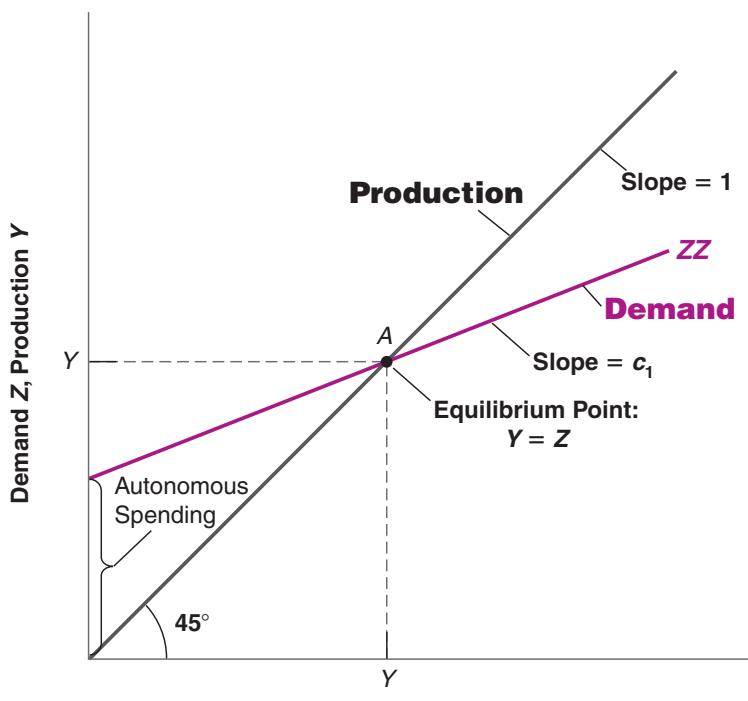
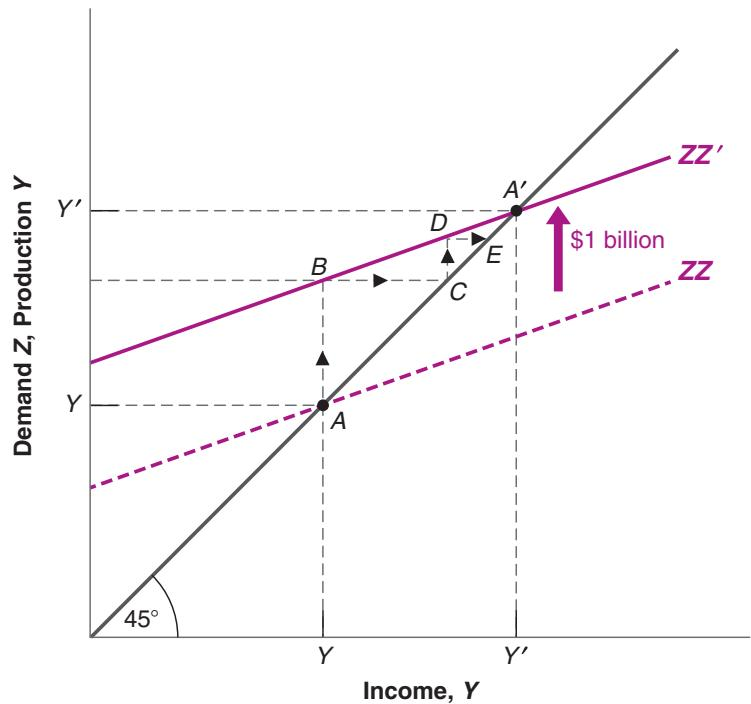

# 3-3 THE DETERMINATION OF EQUILIBRIUM OUTPUT

Let’s put together the pieces we have introduced so far.

Assuming that exports and imports are both equal to zero, the demand for goods is the sum of consumption, investment, and government spending:

$$
Z \equiv C + I + G
$$

Replacing C and I from equations (3.3) and (3.4), we get

$$
Z = c _ {0} + c _ {1} (Y - T) + \bar {I} + G\tag{3.5}
$$

The demand for goods Z depends on income Y, taxes T, investment I, and government spending G.

Let’s now turn to equilibrium in the goods market, and the relation between production and demand. If firms hold inventories, then production need not be equal to demand: For example, firms can satisfy an increase in demand by drawing upon their inventories—by having negative inventory investment. They can respond to a decrease in demand by continuing to produce and accumulating inventories—by having positive inventory investment. Let’s first ignore this complication, though, and begin by assuming that firms do not hold inventories. In this case, inventory investment is always equal to zero, and equilibrium in the goods market requires that production Y be equal to the demand for goods Z:

$$
Y = Z\tag{3.6}
$$

Think of an economy that produces only haircuts. There cannot be inventories of haircuts—haircuts produced but not sold?—so production must always be equal to demand.

This equation is called an equilibrium condition. Models include three types of equations: identities, behavioral equations, and equilibrium conditions. You now have seen examples of each: The equation defining disposable income is an identity, the consumption function is a behavioral equation, and the condition that production equals demand is an equilibrium condition.

Replacing demand Z in (3.6) by its expression from equation (3.5) gives

$$
Y = c _ {0} + c _ {1} (Y - T) + \bar {I} + G\tag{3.7}
$$

There are three types of equations: Identities Behavioral equations Equilibrium conditions

Equation (3.7) represents algebraically what we stated informally at the beginning of this chapter:

In equilibrium, production Y (the left side of the equation), is equal to demand (the right side). Demand in turn depends on income Y, which is itself equal to production.

Note that we are using the same symbol Y for production and income. This is no accident! As you saw in Chapter 2, we can look at GDP either from the production side or from the income side. Production and income are identically equal.

Having constructed a model, we can solve it to look at what determines the level of output—how output changes in response to, say, a change in government spending. Solving a model means not only solving it algebraically but also understanding why the results are what they are. In this book, solving a model will also mean characterizing the results using graphs—sometimes skipping the algebra altogether—and describing the results and the mechanisms in words. Macroeconomists always use these three tools:

1. Algebra to make sure that the logic is correct,

2. Graphs to build the intuition, and

3. Words to explain the results.

Make it a habit to do the same.

## Using Algebra

Rewrite the equilibrium equation (3.7):

$$
Y = c _ {0} + c _ {1} Y - c _ {1} T + \bar {I} + G
$$

Move $c _ { 1 } Y$ to the left side and reorganize the right side:

$$
(1 - c _ {1}) Y = c _ {0} + \bar {I} + G - c _ {1} T
$$

Divide both sides by $( 1 - c _ { 1 } )$ :

$$
Y = \frac {1}{1 - c _ {1}} \left[ c _ {0} + \bar {I} + G - c _ {1} T \right]\tag{3.8}
$$

Equation (3.8) characterizes equilibrium output, i.e. the level of output such that production equals demand. Let’s look at both terms on the right, beginning with the term in brackets.

■ The term $[ c _ { 0 } + \bar { I } + G - c _ { 1 } T ]$ is the part of the demand for goods that does not depend on output. For this reason, it is called autonomous spending.

Can we be sure that autonomous spending is positive? We cannot, but it is very likely to be. The first two terms in brackets, $c _ { 0 }$ and I, are positive. What about the last two, $\mathrm { ~ G ~ - ~ } c _ { 1 } T \colon$ Suppose the government is running a balanced budget—taxes equal government spending. If $T = G$ , and the propensity to consume $\left( c _ { 1 } \right)$ is less than 1 (as we have assumed), then $\left( G - c _ { 1 } T \right)$ is positive and so is autonomous spending. Only if the government were running a very large budget surplus—if taxes were much larger than government spending—could autonomous spending be negative. We can safely ignore that case here.

${ \mathsf { I f } } { \mathsf { T } } = { \mathsf { G } } ,$ then $\begin{array} { c } { { ( G - c _ { 1 } T ) = ( T - c _ { 1 } T ) } } \\ { { = ( 1 - c _ { 1 } ) T > 0 \gg } } \end{array}$

■ Turn to the first term, $1 / ( 1 - c _ { 1 } )$ . Because the propensity to consume $\left( c _ { 1 } \right)$ is between zero and 1, $1 / ( 1 - c _ { 1 } )$ is a number greater than one. For this reason, this number, which multiplies autonomous spending, is called the multiplier. The closer $c _ { 1 }$ is to 1, the larger the multiplier.

What does the multiplier imply? Suppose that, for a given level of income, consumers decide to consume more. More concretely, assume that $c _ { 0 }$ in equation (3.3) increases by \$1 billion. Equation (3.8) tells us that output will increase by more than \$1 billion. For example, if $c _ { 1 }$ equals 0.6, the multiplier equals $1 / ( 1 - 0 . 6 ) = 1 / 0 . 4 = 2 . 5$ , so that output increases by $2 . 5 \times \$ 16 i l l i o n =82 .$ 5 billion

We have looked at an increase in consumption, but equation (3.8) makes it clear that any change in autonomous spending—from a change in investment, to a change in government spending, to a change in taxes—will have the same qualitative effect: It will change output by more than its direct effect on autonomous spending.

Where does the multiplier effect come from? Looking back at equation (3.7) gives us the clue: An increase in $c _ { 0 }$ increases demand. The increase in demand then leads to an increase in production. The increase in production leads to an equivalent increase in income (remember the two are identically equal). The increase in income further increases consumption, which further increases demand, and so on. The best way to describe this mechanism is to represent the equilibrium using a graph. Let’s do that.

## Using a Graph

Let’s characterize the equilibrium graphically.

■ First, plot production as a function of income.

In Figure 3-2, measure production on the vertical axis. Measure income on the horizontal axis. Plotting production as a function of income is straightforward: Recall that production and income are identically equal. Thus, the relation between them is the 45-degree line, the line with a slope equal to 1.

■ Second, plot demand as a function of income.

The relation between demand and income is given by equation (3.5). Let’s rewrite it here for convenience, regrouping the terms for autonomous spending together in the term in parentheses:

$$
Z = \left(c _ {0} + \bar {I} + G - c _ {1} T\right) + c _ {1} Y\tag{3.9}
$$

Demand depends on autonomous spending and on income—via its effect on consumption. The relation between demand and income is drawn as ZZ in the graph. The intercept with the vertical axis—the value of demand when income is equal to zero— equals autonomous spending. The slope of the line is the propensity to consume, $c _ { 1 } { : }$ When income increases by 1, demand increases by $c _ { 1 }$ Under the restriction that $c _ { 1 }$ is positive but less than 1, the line is upward sloping but has a slope of less than 1.

■ In equilibrium, production equals demand.

Equilibrium output, Y, therefore occurs at the intersection of the 45-degree line and the demand function. This is at point A. To the left of A, demand exceeds production; to the right of A, production exceeds demand. Only at A are demand and production equal.

Suppose that the economy is at the initial equilibrium, represented by point A in the graph, with production equal to Y.

  
Income, Y  
Figure 3-2  
Equilibrium in the Goods Market

Equilibrium output is determined by the condition that production is equal to demand.

This makes use of the second interpretation of changes in $c _ { 0 } .$ How much more consumers are willing to spend at a given level of income.

Figure 3-3

The Effects of an Increase in Autonomous Spending on Output

An increase in autonomous spending has a more than one-for-one effect on equilibrium output.

Now suppose $c _ { 0 }$ increases by \$1 billion. At the initial level of income (the level of disposable income associated with point A since T is unchanged in this example), con-c sumers increase their consumption by \$1 billion. What happens is shown in Figure 3-3, which builds on Figure 3-2.

Equation (3.9) tells us that, for any value of income, if $c _ { 0 }$ is higher by \$1 billion, demand is higher by \$1 billion. Before the increase in $c _ { 0 }$ the relation between demand and income was given by the line ZZ. After the increase in $c _ { 0 }$ by \$1 billion, the relation between demand and income is given by the line $\mathrm { Z Z ^ { \prime } }$ , which is parallel to ZZ but higher by \$1 billion. In other words, the demand curve shifts up by \$1 billion. The new equilibrium is at the intersection of the 45-degree line and the new demand relation, at point $A ^ { \prime }$

Equilibrium output increases from Y to $Y ^ { \prime }$ . The increase in output, $( Y ^ { \prime } \mathrm { ~ - ~ } Y )$ , which we can measure either on the horizontal or the vertical axis, is larger than the initial increase in consumption of \$1 billion. This is the multiplier effect.

With the help of the graph, it becomes easier to tell how and why the economy moves from A to $A ^ { \prime }$ . The initial increase in consumption leads to an increase in demand of \$1 billion. At the initial level of income, Y, the level of demand is shown by point B:

Demand is \$1 billion higher. To satisfy this higher level of demand, firms increase production by \$1 billion. This increase in production of \$1 billion implies that income increases by \$1 billion (recall: income = production), so the economy moves to point C. (In other words, both production and income are higher by \$1 billion.) But this is not the end of the story. The increase in income leads to a further increase in demand. Demand is now shown by point D. Point D leads to a higher level of production, and so on, until the economy is at $A ^ { \prime }$ , where production and demand are again equal. This is therefore the new equilibrium.

We can pursue this line of explanation a bit more, which will give us another way to think about the multiplier.

■ The first-round increase in demand, shown by the distance AB in Figure 3-3—equals \$1 billion.

■ This first-round increase in demand leads to an equal increase in production, or \$1 billion, which is also shown by the distance AB.

■ This first-round increase in production leads to an equal increase in income, shown by the distance BC, also equal to \$1 billion.

■ The second-round increase in demand, shown by the distance CD, equals \$1 billion (the increase in income in the first round) times the propensity to consume, $c _ { 1 } -$ hence, $\$ 0$ billion.

■ This second-round increase in demand leads to an equal increase in production, also shown by the distance CD, and thus an equal increase in income, shown by the distance DE.

■ The third-round increase in demand equals $\$ 0$ billion (the increase in income in the second round) times $c _ { 1 }$ , the marginal propensity to consume; it is equal to $\$ 123,456$ billion, and so on.

Following this logic, the total increase in production after, say, $n + 1$ rounds equals \$1 billion times the sum:

$$
1 + c _ {1} + c _ {1} ^ {2} + \dots + c _ {1} ^ {n}
$$

Such a sum is called a geometric series. Geometric series will frequently appear in this book. A refresher is given in Appendix 2 at the end of the book. One property of geometric series is that, when $c _ { 1 }$ is less than one (as it is here) and as n gets larger and larger, the sum keeps increasing but approaches a limit. That limit is $1 / ( 1 - c _ { 1 } )$ , making the eventual increase in output $\$ 1/(1- c _ { 1 } )$ billion.

The expression $1 / ( 1 - c _ { 1 } )$ should be familiar: It is the multiplier, derived another way. This gives us an equivalent but more intuitive way of thinking about the multiplier. We can think of the original increase in demand as triggering successive increases in production, with each increase in production leading to an increase in income, which leads to an increase in demand, which leads to a further increase in production, and so on. The multiplier is the sum of all these successive increases in production.

## Using Words

Trick question: Think about the multiplier as the result of these successive rounds.b What would happen in each successive round if $c _ { 1 } .$ , the propensity to consume, was larger than one?

How can we summarize our findings in words?

Production depends on demand, which depends on income, which is itself equal to production. An increase in demand, such as an increase in government spending, leads to an increase in production and a corresponding increase in income. This increase in income leads to a further increase in demand, which leads to a further increase in production, and so on. The end result is an increase in output that is larger than the initial shift in demand, by a factor equal to the multiplier.

The size of the multiplier is directly related to the value of the propensity to consume: The higher the propensity to consume, the higher the multiplier. What is the value of the propensity to consume in the United States today? To answer this question, and more generally to estimate behavioral equations and their parameters, economists use econometrics, the set of statistical methods used in economics. To give you a sense of what econometrics is and how it is used, read Appendix 3 at the end of the book. This appendix gives you a quick introduction, along with an application estimating the propensity to consume. A reasonable estimate of the propensity to consume in the United States today is around 0.6 (the regressions in Appendix 3 yield two estimates, 0.5 and 0.8). In other words, an additional dollar of disposable income leads on average to an increase in consumption of 60 cents. This implies that the multiplier is equal to $1 / ( 1 - c _ { 1 } ) = 1 / ( 1 - 0 . 6 ) = 2 . 5 .$

The empirical evidence suggests that multipliers are typically smaller than that. This is because the simple model developed in this chapter leaves out a number of important mechanisms, for example, the reaction of monetary policy to changes in spending, or the fact that some of the demand falls on foreign goods. We shall come back to the issue as

b we go through the book.

## How Long Does It Take for Output to Adjust?

Let’s return to our example one last time. Suppose that $c _ { 0 }$ increases by \$1 billion. We know that output will increase by an amount equal to the multiplier $1 / ( 1 - c _ { 1 } )$ times \$1 billion. But how long will it take for output to reach this higher value?

In the model we saw previously, we ruled out this possibility by assuming firms did not hold inventories, and so could not rely on drawing down inventories to satisfy an increase in demand.

Under the assumptions we have made so far, the answer is: Right away! In writing the equilibrium condition (3.6), I have assumed that production is always equal to demand. In other words, I have assumed that production responds to demand instantaneously. In writing the consumption function (3.2) as I did, I have assumed that consumption responds to changes in disposable income instantaneously. Under these two assumptions, the economy goes instantaneously from point A to point $A ^ { \prime }$ in Figure 3-3: The increase in demand leads to an immediate increase in production, the increase in income associated with the increase in production leads to an immediate increase in demand, and so on. There is nothing wrong in thinking about the adjustment in terms of successive rounds as we did previously, even though the equations indicate that all these rounds happen at once.

This instantaneous adjustment isn’t really plausible: A firm that faces an increase in demand might well decide to wait before adjusting its production, meanwhile drawing down its inventories to satisfy demand. A worker who gets a pay raise might not adjust her consumption right away. These delays imply that the adjustment of output will take time.

Formally describing this adjustment of output over time—that is, writing the equations for what economists call the dynamics of adjustment, and solving this more complicated model—would be too hard to do here. But it is easy to do it informally in words:

■ Suppose, for example, that firms make decisions about their production levels at the beginning of each quarter. Once their decisions are made, production cannot be adjusted for the rest of the quarter. If purchases by consumers are higher than production, firms draw down their inventories to satisfy the purchases. On the other hand, if purchases are lower than production, firms accumulate inventories.

■ Now suppose consumers decide to spend more, that they increase $c _ { 0 } .$ . During the quarter in which this happens, demand increases, but production—because we assumed it was set at the beginning of the quarter—doesn’t yet change. Therefore, income doesn’t change either.

■ Having observed an increase in demand, firms are likely to set a higher level of production in the following quarter. This increase in production leads to a corresponding increase in income and a further increase in demand. If purchases still exceed production, firms further increase production in the following quarter, and so on.

■ In short, in response to an increase in consumer spending, output does not jump to the new equilibrium, but rather increases over time from Y to $Y ^ { \prime }$

How long the adjustment takes depends on how fast consumers respond to changes in income and how fast firms respond to changes in sales. If firms adjust their production schedules more frequently in response to past increases in purchases, the adjustment will occur faster.

We will often do in this book what I just did here. After we have looked at changes in equilibrium output, we will then describe informally how the economy moves from one equilibrium to the other. This will not only make the description of what happens in the economy feel more realistic, but it will often reinforce your intuition about why the equilibrium changes.

We have focused in this section on increases in demand. But the mechanism, of course, works both ways: Decreases in demand lead to decreases in output. The recession of 2008–2009 was the result of two of the four components of autonomous spending dropping by a large amount at the same time. Recall that autonomous spending is given by $[ c _ { 0 } + I + G - c _ { 1 } T ]$ . The Focus Box “The Lehman Bankruptcy, Fears of Another Great Depression, and Shifts in the Consumption Function” shows how, when the crisis started,
