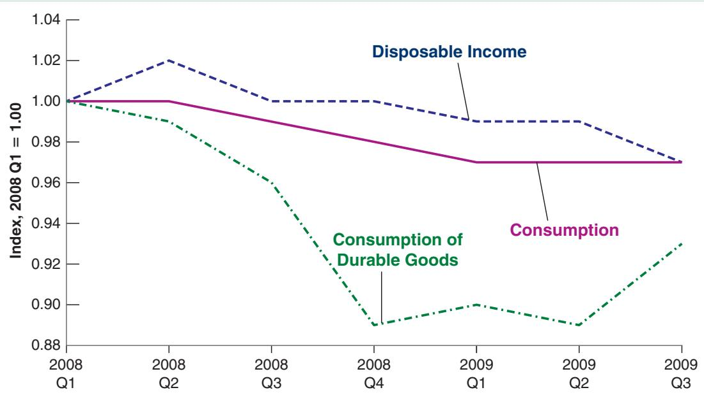
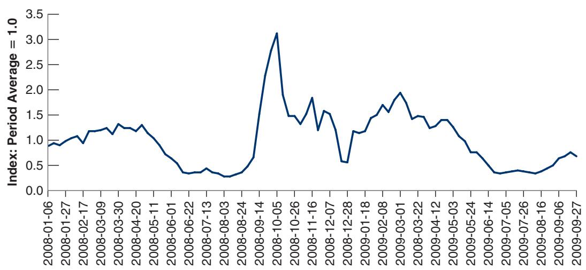

# The Lehman Bankruptcy, Fears of Another Great Depression, and Shifts in the Consumption Function

Why would consumers decrease consumption if their disposable income has not changed? $_ { \mathrm { ~ 0 ~ r ~ } }$ in terms of equation (3.2), why might $c _ { 0 }$ decrease—leading in turn to a decrease in demand, output, and so on?

One of the first reasons that come to mind is that, even if their current income has not changed, consumers start worrying about the future and decide to save more. This is precisely what happened at the start of the crisis, in late 2008 and early 2009. The basic facts are shown in Figure 1 below. The figure plots, from the first quarter of 2008 to the third quarter of 2009, the behavior of three variables: disposable income, total consumption, and consumption of durables—the part of consumption that falls on goods such as cars, computers, and so on (Appendix 1 at the end of the book gives a more precise definition). To make things visually simple, all three variables are normalized to equal 1 in the first quarter of 2008.

Note two things about the figure. First, even though the crisis led to a large fall in GDP, during that period, disposable income did not initially move much. It even increased in the first quarter of 2008. But consumption was unchanged from the first to the second quarter of 2008 and then fell before disposable income fell. It fell by 3 percentage points in 2009 relative to 2008, more than the decrease in disposable income.

In terms of Figure 1, the distance between the line for disposable income and the line for consumption increased. Second, during the third and especially the fourth quarters of 2008, the consumption of durables dropped sharply. By the fourth quarter of 2008, it was down 10% relative to the first quarter, before recovering briefly in early 2009 and then decreasing again.

Why did consumption, and especially consumption of durables, decrease at the end of 2008 despite relatively small changes in disposable income? Several factors were at play, but the main one was the psychological fallout of the financial crisis. Recall from Chapter 1 that, on September 15, 2008, Lehman Brothers, a very large bank, went bankrupt, and that, in the ensuing weeks, it appeared that many more banks might follow suit and the financial system might collapse. For most people, the main sign of trouble was what they read in newspapers: Even though they still had their job and received their monthly income checks, the events reminded them of the stories of the Great Depression and the pain that came with it. One way to see this is to look at the Google Trends series that gives the number of searches for “Great Depression,” from January 2008 to September 2009, and is plotted in Figure 2. The series is normalized so its average value is 1 over the two years. Note how sharply the series peaked in October 2008 and then slowly decreased over the course of 2009 as it became clear that, while the crisis was a serious one, policy makers were going to do whatever they could to avoid a repeat of the Great Depression.

  
Figure 1  
Disposable Income, Consumption, and Consumption of Durables in the United States, 2008:1 to 2009:3 Source: FRED: DPIC96, PCECC96, PCDGCC96.

If you felt that the economy might go into another Great Depression, what would you do? Worried that you might become unemployed or that your income might decline in the future, you would probably cut consumption, even if your disposable income had not yet changed. And, given the uncertainty about what was going on, you might also delay the purchases you could afford to delay; for example, the purchase of a new car or a new TV. As Figure 1 in this box shows, this is exactly what consumers did in late 2008: Total consumption decreased, and consumption of durables collapsed. In 2009, as the smoke slowly cleared, and the worst scenarios became increasingly unlikely, consumption of durables picked up. But by then, many other factors were contributing to the crisis.

  
Figure 2  
Google Search Volume for “Great Depression,” January 2008 to September 2009  
Source: Google Trends, “Great Depression.”

worries about the future led consumers to cut their spending despite the fact that their disposable income had not yet declined; that is, c decreased sharply. As house prices fell, building new homes became much less desirable. New homes are part of autonomous investment spending, so I also fell sharply. As autonomous spending decreased, the total demand for goods fell, and so did output. We shall return at many points in the book to the factors and the mechanisms behind the crisis and steadily enrich our story line. But this effect on autonomous spending will remain a central element of the story.

## 3-4 INVESTMENT EQUALS SAVING: AN ALTERNATIVE WAY OF THINKING ABOUT GOODS-MARKET EQUILIBRIUM

Thus far, we have been thinking of equilibrium in the goods market in terms of the equality of the production and the demand for goods. An alternative—but, it turns out, equivalent—way of thinking about equilibrium focuses instead on investment and saving. This is how John Maynard Keynes first articulated this model in 1936, in The General Theory of Employment, Interest and Money.

Let’s start by looking at saving. Saving is the sum of private saving and public saving.

By definition, private saving (S) (i.e., saving by consumers) is equal to their disposable income minus their consumption:

$$
S \equiv Y _ {D} - C
$$

Using the definition of disposable income, we can rewrite private saving as income minus taxes minus consumption:

$$
S \equiv Y - T - C
$$

Private saving is also done by firms, which do not distribute all of their profits and use those retained earnings to finance investment. For simplicity, we ignore saving by firms here. But the bottom line, namely the equality of investment and saving in equation (3.10), does not depend on this simplification.

■ By definition, public saving 1T - G2 is equal to taxes (net of transfers) minus government spending. If taxes exceed government spending, the government is running a budget surplus, so public saving is positive. If taxes are less than government spending, the government is running a budget deficit, so public saving is negative.

■ Now return to the equation for equilibrium in the goods market that we derived previously. Production must be equal to demand, which, in turn, is the sum of consumption, investment, and government spending:

$$
Y = C + I + G
$$

Subtract taxes (T) from both sides and move consumption to the left side:

$$
Y - T - C = I + G - T
$$

The left side of this equation is simply private saving (S), so

$$
S = I + G - T
$$

Or, equivalently,

$$
I = S + (T - G)\tag{3.10}
$$

On the left is investment. On the right is saving, the sum of private saving and public saving.

Equation (3.10) gives us another way of thinking about equilibrium in the goods market: It says that equilibrium in the goods market requires that investment equal saving—the sum of private and public saving. This way of looking at equilibrium explains why the equilibrium condition for the goods market is called the IS relation, which stands for “Investment equals Saving”: What firms want to invest must be equal to what people and the government want to save.

To understand equation (3.10), imagine an economy with only one person who has to decide how much to consume, invest, and save—a “Robinson Crusoe” economy, for example. For Robinson Crusoe, the saving and the investment decisions are one and the same: What he invests (say, by keeping rabbits for breeding rather than having them for dinner), he automatically saves. In a modern economy, however, investment decisions are made by firms, whereas saving decisions are made by consumers and the government. In equilibrium, equation (3.10) tells us, all these decisions have to be consistent: Investment must equal saving.

To summarize: There are two equivalent ways of stating the condition for equilibrium in the goods market:

$$
\begin{array}{l} \text {Production = Demand} \\ \text {Investment = Saving} \end{array}
$$

We characterized the equilibrium using the first condition, equation (3.6). We now do the same using the second condition, equation (3.10). The results will be the same, but the derivation will give you another way of thinking about the equilibrium.

■ Note first that consumption and saving decisions are one and the same: Given their disposable income, once consumers have chosen consumption, their saving is determined, and vice versa. The way we specified consumption behavior implies that private saving is given by:

$$
\begin{array}{r l} S & = Y - T - C \\ & = Y - T - c _ {0} - c _ {1} (Y - T) \end{array}
$$

Rearranging, we get

$$
S = - c _ {0} + (1 - c _ {1}) (Y - T)\tag{3.11}
$$

■ In the same way that we called $c _ { 1 }$ the propensity to consume, we can call $\left( 1 \mathrm { ~ - ~ } c _ { 1 } \right)$ the propensity to save. The propensity to save tells us how much of an additional unit of income people save. The assumption we made previously—that the propensity to consume 1c 2 is between zero and one implies that the propensity to save $\left( 1 \mathrm { ~ - ~ } c _ { 1 } \right)$ is also between zero and one. Private saving increases with disposable income, but by less than one dollar for each additional dollar of disposable income.

In equilibrium, investment must be equal to saving, the sum of private and public saving. Replacing private saving in equation (3.10) by its expression in equation (3.11),

$$
I = - c _ {0} + (1 - c _ {1}) (Y - T) + (T - G)
$$

Solving for output,

$$
Y = \frac {1}{1 - c _ {1}} [ c _ {0} + \bar {I} + G - c _ {1} T ]\tag{3.12}
$$

Equation (3.12) is exactly the same as equation (3.8). This should come as no surprise. We are looking at the same equilibrium condition, just in a different way. This alternative way will prove useful in various applications later in the book. The Focus Box “The Paradox of Saving” looks at such an application, which was first emphasized by Keynes and is often called the paradox of saving.

## 3-5 IS THE GOVERNMENT OMNIPOTENT? A WARNING

Equation (3.8) implies that the government, by choosing the level of spending (G) or the level of taxes (T) can choose the level of output it wants. If it wants output to be higher by, say, \$1 billion, all it needs to do is to increase G by $\mathbb { S } ( 1 - c _ { 1 } )$ billion. This increase in government spending, in theory, will lead to an output increase of $\mathbb { S } ( 1 - c _ { 1 } )$ billion times the multiplier $1 / ( 1 - c _ { 1 } )$ , or \$1 billion.

Can governments really achieve the level of output they want? Obviously not: If they could, and it was as easy as it sounds in the previous paragraph, why would the US government have allowed growth to stall in 2008 and output to actually fall in 2009? Why wouldn’t the government increase the growth rate now, so as to decrease unemployment more rapidly? There are many aspects of reality that we have not yet incorporated in our model, and all of them complicate the government’s task. We shall introduce them in due time. But it is useful to list them briefly here:

■ Changing government spending or taxes is not easy. Getting the US Congress to pass bills always takes time. Implementing what is in the bills takes even more time (Chapters 21 and 22).

## The Paradox of Saving

As we grow up, we are told about the virtues of thrift. Those who spend all their income are condemned to end up poor. Those who save are promised a happy life. Similarly, governments tell us, an economy that saves is an economy that will grow strong and prosper! The model we have seen in this chapter, however, tells a different and surprising story.

Suppose that, at a given level of disposable income, consumers decide to save more. In other words, suppose consumers decrease $^ { c _ { 0 } , }$ therefore decreasing consumption and increasing saving at a given level of disposable income. What happens to output and to saving?

Equation (3.12) makes it clear that equilibrium output decreases: As people save more at their initial level of income, they decrease their consumption. But this decreased consumption decreases demand, which decreases production.

Can we tell what happens to saving? Let’s return to the equation for private saving, equation (3.11) (recall that we assume no change in public saving, so saving and private saving move together):

$$
S = - c _ {0} + (1 - c _ {1}) (Y - T)
$$

On the one hand, - $- \mathbf { c _ { 0 } }$ is higher (less negative): Consumers are saving more at any level of income; this tends to increase saving. But, on the other hand, their income Y is lower (because production is lower): This decreases saving. The net effect would seem to be ambiguous. In fact, we can tell which way it goes. To see how, go back to equation (3.10), the equilibrium condition that investment and saving must be equal:

$$
I = S + (T - G)
$$

By assumption, investment does not change: $I = { \bar { I } } .$ Nor do T or G. So the equilibrium condition tells us that in equilibrium, private saving S cannot change either. Although people want to save more at a given level of income, their income decreases by an amount such that their saving is unchanged.

This means that as people attempt to save more, the result is both a decline in output and unchanged saving, not a good outcome. This surprising pair of results is known as the paradox of saving (or the paradox of thrift). Note that the same result would obtain if we looked at public rather than private saving: A decrease in the budget deficit would also lead to a lower output and unchanged overall (public and private) saving. And note that, if we extended our model to allow investment to decrease with output (we shall do this in Chapter 5) rather than assuming it is constant, the result would be even more dramatic: An attempt to save more, either by consumers or by the government, would lead to lower output, lower investment, and by implication lower saving!

So should you forget the old wisdom? Should the government tell people to be less thrifty? No. The results of this simple model are of much relevance in the short run. The desire of consumers to save more is an important factor in many of the US recessions, including, as we saw in the previous Focus box, the financial crisis. But—as we will see later when we look at the medium run and the long run—other mechanisms come into play over time, and an increase in the saving rate is likely to lead over time to higher saving and higher income. A warning remains, however: Policies that encourage saving might be good in the medium run and in the long run, but they can lead to a reduction in demand and in output, and perhaps even a recession, in the short run.

■ We have assumed that investment remained constant. But investment is also likely to respond in a variety of ways. So are imports: Some of the increased demand by consumers and firms will not be for domestic goods but for foreign goods. The exchange rate may change. All these responses are likely to be associated with complex, dynamic effects, making it hard for governments to assess the effects of their policies with much certainty (Chapters 5 and 9, and 18 to 20).

■ Expectations are likely to matter. For example, the reaction of consumers to a tax cut is likely to depend on whether they think of the tax cut as transitory or permanent. The more they perceive the tax cut as permanent, the larger will be their consumption response. Similarly, the reaction of consumers to an increase in spending is likely to depend on when they think the government will raise taxes to pay for the spending (Chapters 14 to 16).

■ Achieving a given level of output can come with unpleasant side effects. Trying to achieve too high a level of output can, for example, lead to increasing inflation and, for that reason, be unsustainable in the medium run (Chapter 9).

■ Cutting taxes or increasing government spending, as attractive as it may seem in the short run, can lead to large budget deficits and an accumulation of public debt. A large debt has adverse effects in the long run. This is a hot issue today in almost every advanced country in the world (Chapters 9, 11, 16, and 22).

<table><tr><td>consumption (C), 46</td><td>endogenous variables, 50</td></tr><tr><td>investment (I), 46</td><td>exogenous variables, 50</td></tr><tr><td>fixed investment, 46</td><td>fiscal policy, 50</td></tr><tr><td>nonresidential investment, 46</td><td>equilibrium, 51</td></tr><tr><td>residential investment, 46</td><td>equilibrium in the goods market, 51</td></tr><tr><td>government spending (G), 47</td><td>equilibrium condition, 51</td></tr><tr><td>government transfers, 47</td><td>autonomous spending, 52</td></tr><tr><td>exports (X), 47</td><td>balanced budget, 52</td></tr><tr><td>imports (IM), 47</td><td>multiplier, 52</td></tr><tr><td>net exports (X - IM), 47</td><td>geometric series, 55</td></tr><tr><td>trade balance, 47</td><td>econometrics, 55</td></tr><tr><td>trade surplus, 47</td><td>dynamics, 56</td></tr><tr><td>trade deficit, 47</td><td>private saving (S), 59</td></tr><tr><td>inventory investment, 47</td><td>public saving (T - G), 59</td></tr><tr><td>identity, 48</td><td>budget surplus, 59</td></tr><tr><td>disposable income (YD), 48</td><td>budget deficit, 59</td></tr><tr><td>consumption function, 48</td><td>saving, 59</td></tr><tr><td>behavioral equation, 48</td><td>IS relation, 59</td></tr><tr><td>linear relation, 49</td><td>propensity to save, 60</td></tr><tr><td>parameter, 49</td><td>paradox of saving, 61</td></tr><tr><td>propensity to consume (c1), 49</td><td></td></tr></table>

In short, the proposition that, by using fiscal policy, the government can affect demand and output in the short run is an important and correct proposition. But as we refine our analysis, we will see that the role of the government in general, and the successful use of fiscal policy in particular, become increasingly difficult: Governments will never have it so good as they have had it in this chapter.

## SUMMARY

What you should remember about the components of GDP:

GDP is the sum of consumption, investment, government spending, inventory investment, and exports minus imports.

■ Consumption (C) is the purchase of goods and services by consumers. Consumption is the largest component of demand.

Investment (I) is the sum of nonresidential investment—the purchase of new plants and new machines by firms—and of residential investment—the purchase of new houses or apartments by people.

Government spending (G) is the purchase of goods and services by federal, state, and local governments.

Exports (X) are purchases of US goods by foreigners. Imports (IM) are purchases of foreign goods by US consumers, US firms, and the US government.

Inventory investment is the difference between production and purchases. It can be positive or negative.

What you should remember about our first model of output determination:

In the short run, demand determines production. Production is equal to income. Income in turn affects demand.

The consumption function shows how consumption depends on disposable income. The propensity to consume describes how much consumption increases for a given increase in disposable income.

Equilibrium output is the level of output at which production equals demand. In equilibrium, output equals autonomous spending times the multiplier. Autonomous spending is that part of demand that does not depend on income. The multiplier is equal to $1 / ( 1 - c _ { 1 } )$ , where $c _ { 1 }$ is the propensity to consume.

Increases in consumer confidence, investment demand, government spending, or decreases in taxes all increase equilibrium output in the short run.

An alternative way of stating the goods-market equilibrium condition is that investment must be equal to saving—the sum of private and public saving. For this reason, the equilibrium condition is called the IS relation (I for investment, S for saving).

## KEY TERMS

## QUESTIONS AND PROBLEMS

## QUICK CHECK

1. Using the information in this chapter, label each of the following statements true, false, or uncertain. Explain briefly.

a. The largest component of GDP is consumption.

b. Government spending, including transfers, was equal to 17.4% of GDP in 2018.

c. The propensity to consume has to be positive, but otherwise it can take on any positive value.

d. One factor in the 2009 recession was a drop in the value of the parameter $c _ { 0 } .$

e. Fiscal policy describes the choice of government spending and taxes and is treated as exogenous in our goods market model.

f. The equilibrium condition for the goods market states that consumption equals output.

g. An increase of one unit in government spending leads to an increase of one unit in equilibrium output.

h. An increase in the propensity to consume leads to a decrease in output.

2. Suppose that the economy is characterized by the following

$$
\begin{array}{r l} C & = 1 6 0 + 0. 6 Y _ {D} \\ I & = 1 5 0 \\ G & = 1 5 0 \\ T & = 1 0 0 \end{array}
$$

Solve for the following variables.

a. Equilibrium GDP (Y)

b. Disposable income $( Y _ { \mathrm { D } } )$

c. Consumption spending (C)

3. Use the economy described in Problem 2.

a. Solve for equilibrium output. Compute total demand. Is it equal to production? Explain.

b. Assume that G is now equal to 110. Solve for equilibrium output. Compute total demand. Is it equal to production? Explain.

c. Assume that G is equal to 110, so output is given by your answer to part b. Compute private plus public saving. Is the sum of private and public saving equal to investment? Explain.

## DIG DEEPER

## 4. The balanced budget multiplier

For both political and macroeconomic reasons, governments are often reluctant to run budget deficits. Here, we examine whether policy changes in G and T that maintain a balanced budget are macroeconomically neutral. Put another way, we examine whether it is possible to affect output through changes in G and T so that the government budget remains balanced.

Start from equation (3.8).

a. By how much does Y increase when G increases by one unit?

b. By how much does Y decrease when T increases by one unit?

c. Why are your answers to parts a and b different?

Suppose that the economy starts with a balanced budget: $G = T .$ If the increase in G is equal to the increase in T, then the budget remains in balance. Let us now compute the balanced budget multiplier.

d. Suppose that G and T increase by one unit each. Using your answers to parts a and b, what is the change in equilibrium GDP? Are balanced budget changes in G and T macroeconomically neutral?

e. How does the specific value of the propensity to consume affect your answer to part a? Why?

## 5. Automatic stabilizers

In this chapter we have assumed that the fiscal policy variables G and T are independent of the level of income. In the real world, however, this is not the case. Taxes typically depend on the level of income and so tend to be higher when income is higher. In this problem, we examine how this automatic response of taxes can help reduce the impact of changes in autonomous spending on output.

Consider the following behavioral equations:

$$
\begin{array}{c} C = c _ {0} + c _ {1} Y _ {D} \\ T = t _ {0} + t _ {1} Y \\ Y _ {D} = Y - T \end{array}
$$

G and I are both constant. Assume that $t _ { I }$ is between 0 and 1.

a. Solve for equilibrium output.

b. What is the multiplier? Does the economy respond more to changes in autonomous spending when $t _ { 1 }$ is 0 or when $t _ { 1 }$ is positive? Explain.

c. Why is fiscal policy in this case called an automatic stabilizer?

6. Balanced budget versus automatic stabilizers

It is often argued that a balanced budget amendment would actually be destabilizing. To understand this argument, consider the economy in Problem 5.

a. Solve for equilibrium output.

b. Solve for taxes in equilibrium.

Suppose that the government starts with a balanced budget and that there is a drop in $c _ { O } .$

c. What happens to Y? What happens to taxes?

d. Suppose that the government cuts spending in order to keep the budget balanced. What will be the effect on Y? Does the cut in spending required to balance the budget counteract or reinforce the effect of the drop in $c _ { 0 }$ on output? (Don’t do the algebra. Use your intuition and give the answer in words.)

## 7. Taxes and transfers

Recall that we define taxes, T, as net of transfers. In other words,

$$
T = \text { Taxes } - \text { Transfer   Payments }
$$

a. Suppose that the government increases transfer payments to private households, but these transfer payments are not financed by tax increases. Instead, the government borrows to pay for the transfer payments. Show in a diagram (similar to Figure 3-2) how this policy affects equilibrium output. Explain.

b. Suppose instead that the government pays for the increase in transfer payments with an equivalent increase in taxes. How does the increase in transfer payments affect equilibrium output in this case?

c. Now suppose that the population includes two kinds of people: those with high propensity to consume and those with low propensity to consume. Suppose the transfer policy increases taxes on those with low propensity to consume to pay for transfers to people with high propensity to consume. How does this policy affect equilibrium output?

d. How do you think the propensity to consume might vary across individuals according to income? In other words, how do you think the propensity to consume compares for people with high income and people with low income? Explain. Given your answer, do you think tax cuts will be more effective at stimulating output when they are directed toward high-income or toward low-income taxpayers?

## 8. Investment and income

This problem examines the implications of allowing investment to depend on output. Chapter 5 carries this analysis much further and introduces an essential relation—the effect of the interest rate on investment—not examined in this problem.

a. Suppose the economy is characterized by the following behavioral equations:

$$
\begin{array}{c} C = c _ {0} + c _ {1} Y _ {D} \\ Y _ {D} = Y - T \\ I = b _ {0} + b _ {1} Y \end{array}
$$

Government spending and taxes are constant. Note that investment now increases with output. (Chapter 5 discusses the reasons for this relation.) Solve for equilibrium output.

b. What is the value of the multiplier? How does the relation between investment and output affect the value of the multiplier? For the multiplier to be positive, what condition must $( c _ { 1 } + b _ { 1 } )$ satisfy? Explain your answers.

c. What would happen if $( c _ { 1 } + b _ { 1 } ) > 1 ?$ (Trick question. Think about what happens in each round of spending).

d. Suppose that the parameter $b _ { 0 } ,$ sometimes called business confidence, increases. How will equilibrium output be affected? Will investment change by more or less than the change in $b _ { 0 } ?$ Why? What will happen to national saving?

## EXPLORE FURTHER

## 9. The paradox of saving revisited

You should be able to complete this question without doing any algebra, although you may find making a diagram helpful for part a. For this problem, you do not need to calculate the magnitudes of changes in economic variables—only the direction of change.

a. Consider the economy described in Problem 8. Suppose that consumers decide to consume less (and therefore to save more) for any given amount of disposable income. Specifically, assume that consumer confidence $( c _ { 0 } )$ falls. What will happen to output?

b. As a result of the effect on output you determined in part a, what will happen to investment? What will happen to public saving? What will happen to private saving? Explain. (Hint: Consider the saving-equals-investment characterization of equilibrium.) What is the effect on consumption?

c. Suppose that consumers had decided to increase consumption expenditure, so that $c _ { 0 }$ had increased. What would have been the effect on output, investment, and private saving in this case? Explain. What would have been the effect on consumption?

d. Comment on the following logic: “When output is too low, what is needed is an increase in demand for goods and services. Investment is one component of demand, and saving equals investment. Therefore, if the government could just convince households to attempt to save more, then investment, and output, would increase.”

Output is not the only variable that affects investment. As we develop our model of the economy, we will revisit the paradox of saving in future chapter problems.

10. Using fiscal policy to avoid the recession of 2009.

GDP in 2009 was roughly \$15,000 billion. In 2009, GDP

fell by approximately 3 percentage points in 2009.

a. How many billion dollars is 3 percentage points of \$15,000 billion?

b. If the propensity to consume were 0.5, by how much would government spending have to have increased to prevent a decrease in output?

c. If the propensity to consume were 0.5, by how much would taxes have been cut to prevent any decrease in output?

d. Suppose Congress had chosen to both increase government spending and raise taxes by the same amount in 2009. What increase in government spending and taxes would have been required to prevent the decline in output in 2009?

## 11. The “exit strategy” problem

In fighting the recession associated with the crisis, taxes were cut and government spending was increased. The result was a large government deficit. To reduce that deficit, taxes must be increased or government spending must be cut. This is the “exit strategy” from the large deficit.

a. How will reducing the deficit in either way affect the equilibrium level of output in the short run?

b. Which will change equilibrium output more: (i) cutting G by \$100 billion (ii) raising T by \$100 billion?

c. How does your answer to part b depend on the value of the marginal propensity to consume?

d. You hear the argument that a reduction in the deficit will increase consumer and business confidence and thus reduce the decline in output that would otherwise occur with deficit reduction. Is this argument valid?

12. Fiscal policy and the boom of 2018 in the simplest model

The Tax Cut and Jobs Act was passed by Congress in December 2017. GDP grew from \$18,000 billion (2012 dollars) in 2017 to \$18,500 billion (2012 dollars) in 2018.

a. By what percentage did real GDP grow from 2017 to 2018? b. Estimates from the Congressional Budget Office suggest the tax cut in 2018 associated with the Tax Cut and Jobs Act was approximately \$150 B (measured in current dollars). The GDP deflator in 2018 (2012=100) was 110. How large was the tax cut measured in 2012 dollars?

c. If the marginal propensity to consume is 0.6, how large was the increase in real GDP attributable to the tax cut?

d. What proportion of real GDP growth from 2017 to 2018 would be accounted for by the tax cut with a marginal propensity to consume of 0.6?

e. You hear the argument that a tax cut will increase consumer and business confidence and cause a larger than usual increase in demand. If normal growth in US real GDP is 2%, does the effect of the tax cut in 2018 support this argument? How does your answer change if normal growth in US real GDP is 1%? We saw in Chapter 1 that normal growth in labor productivity has been closer to 1% in recent years.

This page is intentionally left blank
