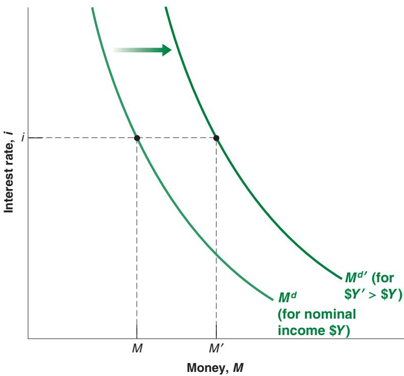
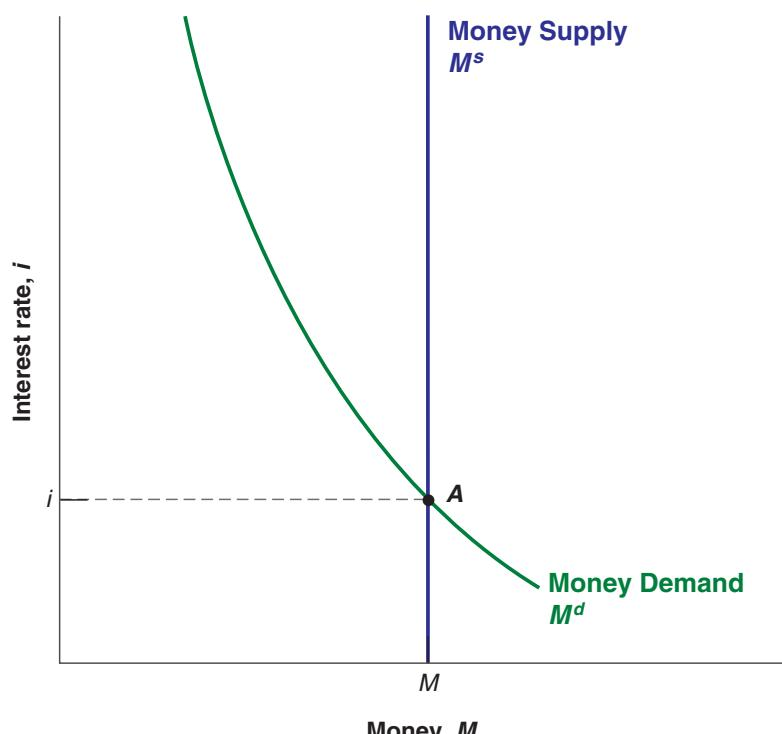
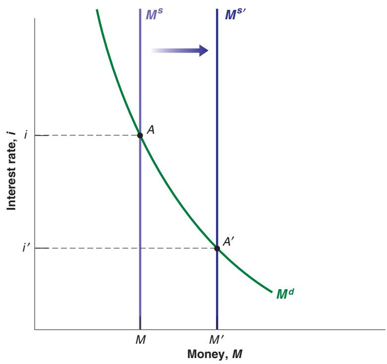
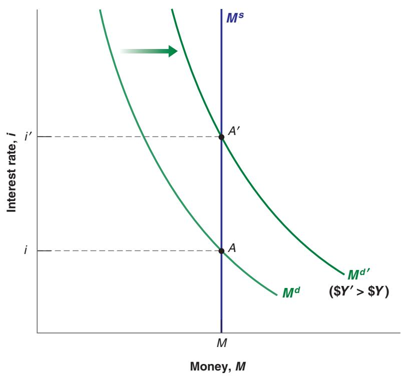
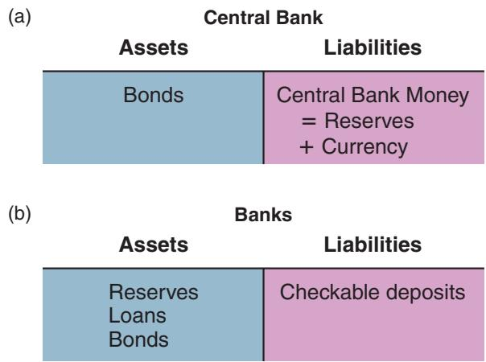
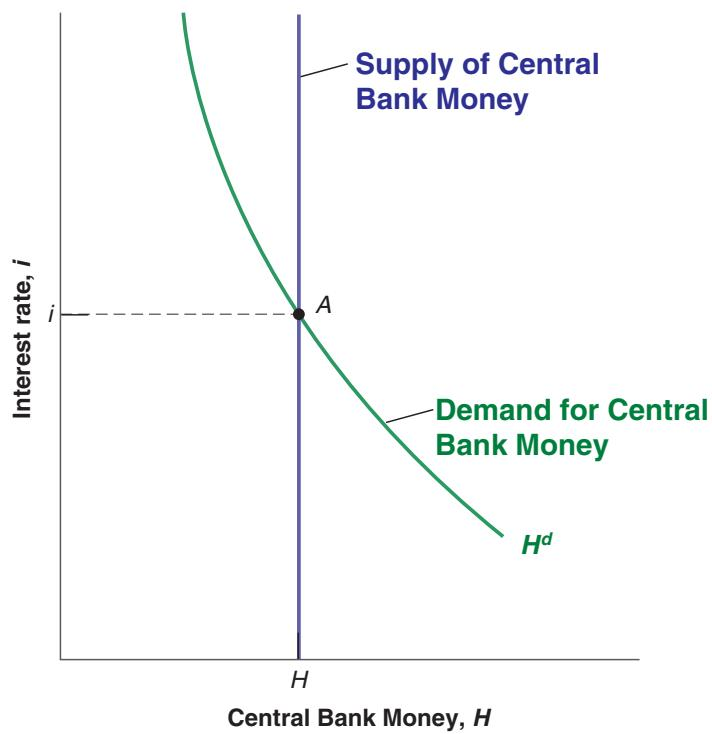
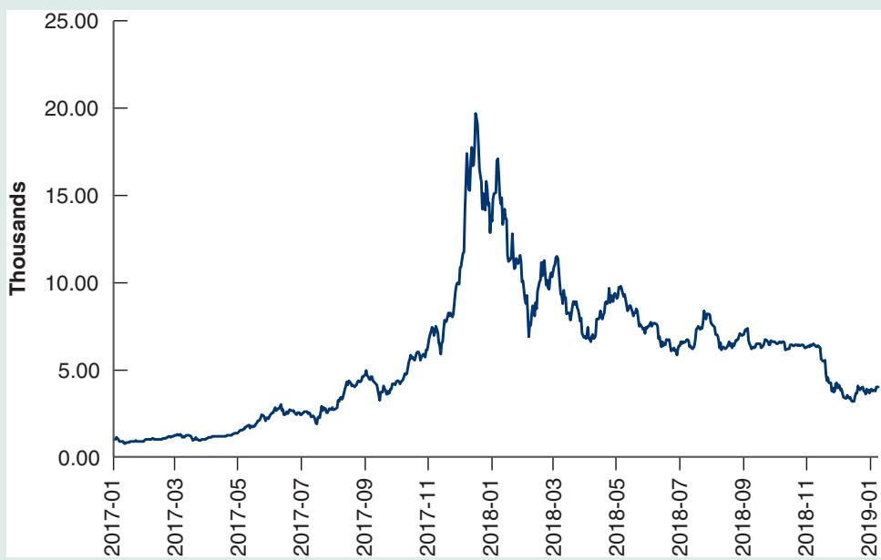
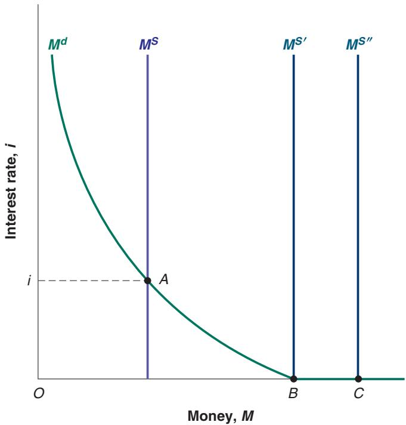

# Semantic Traps: Money, Income, and Wealth

In everyday conversation, we use “money” to denote many different things. We use it as a synonym for income: “making money.” We use it as a synonym for wealth: “She has a lot of money.” In economics, you must be more careful. Here is a basic guide to some terms and their precise meanings in economics.

Money is what can be used to pay for transactions. Money is currency and checkable deposits at banks.

Income is what you earn from working plus what you receive in interest and dividends. It is a flow—something expressed in units of time: weekly income, monthly income, or yearly income, for example. It is said that J. Paul Getty was once asked what his income was. Getty answered: “\$1,000.” He meant, but did not say: \$1,000 per minute!

Saving is that part of after-tax income that you do not spend. It is also a flow. If you save 10% of your income, and your income is \$3,000 per month, then you save \$300 per month. Savings (plural) is sometimes used as a synonym for wealth— the value of what you have accumulated over time. To avoid confusion, I shall not use the term savings in this book.

Your financial wealth, or wealth for short, is the value of all your financial assets minus all your financial liabilities. In contrast to income or saving, which are flow variables, financial wealth is a stock variable. It is the value of wealth at a given moment in time.

At a given moment in time, you cannot change the total amount of your financial wealth. It can only change over time as you save or dissave, or as the value of your assets and liabilities change. But, at any time, you can change the composition of your wealth; you can, for example, decide to repay part of your mortgage by writing a check against your checking account. This leads to a decrease in your liabilities (a smaller mortgage) and a corresponding decrease in your assets (a smaller checking account balance); but, at that moment, it does not change your wealth.

Financial assets that can be used directly to buy goods are called money. Someone who is wealthy might have only small money holdings—say, \$1,000,000 in stocks but only \$500 in a checking account. It is also possible for a person to have a large income but only small money holdings— say, a monthly income of \$10,000 but only \$1,000 in the checking account.

Investment is a term economists reserve for the purchase of new capital goods, from machines to plants to office buildings. When you want to talk about the purchase of shares or other financial assets, you should refer to them as a financial investment.

Learn how to be economically correct:

Do not say “Mary is making a lot of money”; say “Mary has a high income.”

Do not say “Joe has a lot of money”; say “Joe is very wealthy.”

funds are then used to buy bonds—typically government bonds. Money market funds pay an interest rate close to but slightly below the interest rate on the bonds they hold—the difference coming from the administrative costs of running the funds and from their profit margins.

When the interest rate on these funds reached 14% per year in the early 1980s (a very high interest rate by today’s standards), people who had previously kept all of their wealth in their checking accounts (which paid little or no interest) realized how much interest they could earn by moving some of it into money market accounts instead. Now that interest rates are much lower, people are less careful about putting as much as they can in money market funds. Put another way, for a given level of transactions, people now keep more of their wealth in money than they did in the early 1980s.

## Deriving the Demand for Money

Let’s go from this discussion to an equation describing the demand for money.

Denote the amount of money people and firms want to hold—their demand for money— by Md (the superscript d stands for demand). The demand for money in the economy as a whole is just the sum of all the individual demands for money by the people and firms in the economy. Therefore, it depends on the overall level of transactions in the economy and on the interest rate. The overall level of transactions in the economy is hard to measure, but it is likely to be roughly proportional to nominal income (income measured in dollars): If nominal income were to increase by 10%, it is reasonable to think that the dollar value of

Revisit Chapter 2’s example of an economy composed of a steel company and a car company. Calculate the tota value of transactions in that economy. If the steel and the car companies doubled in size, what would happen to transactions and to GDP?

transactions in the economy would also increase by roughly 10%. So we can write the relation between the demand for money, nominal income, and the interest rate as:

$$
M ^ {d} = \begin{array}{c} Y L (i) \\ (-) \end{array}\tag{4.1}
$$

What matters here is nominal income—income in dollars, not real income. If real income does not change but prices double, leading to a doubling of nominal income, people will need to hold

twice as much money to buy the same consumption basket.

Where $\$ Y$ denotes nominal income. Read this equation in the following way: The demand for money $M ^ { d }$ is equal to nominal income \$Y times a decreasing function of the interest rate, with the function denoted by L(i). The minus sign under i in $L ( i )$ captures the fact that the interest rate has a negative effect on money demand: An increase in the interest rate decreases the demand for money, as people put more of their wealth into bonds.

Equation (4.1) summarizes what we have discussed so far:

First, the demand for money increases in proportion to nominal income. If nominal income doubles, increasing from \$Y to \$2Y, then the demand for money also doubles, increasing from $\$ Y L( i )$ to \$2Y L(i).

Second, the demand for money depends negatively on the interest rate. This is captured by the function L(i) and the negative sign underneath: An increase in the interest rate decreases the demand for money.

The relation between the demand for money, nominal income, and the interest rate implied by equation (4.1) is shown in Figure 4-1. The interest rate, i, is measured on the vertical axis. Money, M, is measured on the horizontal axis.

The relation between the demand for money and the interest rate for a given level of nominal income \$Y is represented by the $M ^ { d }$ curve. The curve is downward sloping: The lower the interest rate (the lower i), the higher the amount of money people want to hold (the higher M).

For a given interest rate, an increase in nominal income increases the demand for money. In other words, an increase in nominal income shifts the demand for money to the right, from $M ^ { d }$ to $M ^ { d \prime }$ . For example, at interest rate i, an increase in nominal income from \$Y to $\$ { Y ^ { \prime } }$ increases the demand for money from M to $M ^ { \prime }$

## Figure 4-1

## The Demand for Money.

For a given level of nominal income, a lower interest rate increases the demand for money. At a given interest rate, an increase in nominal income shifts the demand for money to the right.

## Who Holds US Currency?

According to a 2006 household survey, the average US household held \$1,600 in currency (dollar bills and coins). Multiplying by the number of households in the US economy at the time (about 110 million), this implies that the total amount of currency held by US households was around \$170 billion.

But according to the Federal Reserve Board—which issues the dollar bills and therefore knows how much is in circulation—the amount of currency in circulation was actually a much higher \$750 billion. Here lies the puzzle: If it was not held by households, where was all this currency?

Clearly some currency was held by firms rather than by households. And some was held by those involved in the underground economy or in illegal activities. When dealing with drugs, for example, dollar bills (and, now, bitcoin?), not checks, are the way to settle accounts. Surveys of firms and IRS estimates of the underground economy suggest, however, that this can only account for another \$80 billion at most. This leaves \$500 billion, or 66% of the total, unaccounted for. Where was it? The answer: Abroad, held by foreigners.

A few countries, Ecuador and El Salvador among them, have actually adopted the US dollar as their own currency. So people in these countries use dollar bills for transactions. But these countries are just too small to explain the puzzle.

In a number of countries that have suffered from high inflation in the past, people have learned that their domestic currency may quickly become worthless and they see dollars as a safe and convenient asset. This is, for example, the case for Argentina and Russia. Estimates by the US Treasury suggest that Argentina holds more than \$50 billion in dollar bills, Russia more than \$80 billion—together, close to the holdings of US households.

In yet other countries, people who have emigrated to the United States send home US dollar bills; or tourists pay some transactions in dollars, and the dollar bills stay in the country. This is, for example, the case for Mexico or Thailand.

The fact that foreigners hold such a high proportion of the dollar bills in circulation has two main macroeconomic implications. First, the rest of the world, by being willing to hold US currency, is making in effect an interest-free loan to the United States to the tune of \$500 billion. Second, while we shall think of money demand (which includes both currency and checkable deposits) as being determined by the interest rate and the level of transactions in the country, it is clear that US money demand also depends on other factors. Can you guess, for example, what would happen to US money demand if the degree of civil unrest increased in the rest of the world?

## 4-2 DETERMINING THE INTEREST RATE: I

Having looked at the demand for money, we now look at the supply of money and then at the equilibrium.

In the real world, there are two types of money: checkable deposits, which are supplied by banks, and currency, which is supplied by the central bank. In this section, we shall assume that the only money in the economy is currency, central bank money. This is clearly not realistic, but it will make the basic mechanisms most transparent. We shall reintroduce checkable deposits and look at the role banks play in the next section.

## Money Demand, Money Supply, and the Equilibrium Interest Rate

Suppose the central bank decides to supply an amount of money equal to M, so

$$
M ^ {s} = M
$$

The superscript s stands for supply. (Let’s disregard, for the moment, the issue of how exactly the central bank supplies this amount of money. We shall return to it in a few paragraphs.)

Throughout this section, the term money means central bank money, or currency.

Equilibrium in financial markets requires that money supply be equal to money demand, that $M ^ { s } = M ^ { d }$ . Then, using $M ^ { s } = M$ , and equation (4.1) for money demand, the equilibrium condition is

$$
\text {Money supply} = \text {Money demand}
$$

$$
M = \mathbb {S} Y L (i)\tag{4.2}
$$

Figure 4-2

The Determination of the Interest Rate.

The interest rate must be such that the supply of money is equal to the demand for money.

  
Money, M

This equation tells us that the interest rate i must be such that, given their income \$Y, people are willing to hold an amount of money equal to the existing money supply M.

This equilibrium condition is represented graphically in Figure 4-2. As in Figure 4-1, money is measured on the horizontal axis and the interest rate is measured on the vertical axis. The demand for money, $M ^ { d }$ , drawn for a given level of nominal income, \$Y, is downward sloping: A lower interest rate implies a higher demand for money. The supply of money is drawn as the vertical line denoted $M ^ { s }$ : The money supply equals M and is independent of the interest rate. Equilibrium occurs at point A, and the equilibrium interest rate is given by i.

Now that we have characterized the equilibrium, we can look at how changes in the money supply by the central bank or changes in nominal income affect the equilibrium interest rate.

■ Figure 4-3 shows the effects of an increase in the money supply on the interest rate. The initial equilibrium is at point A, with interest rate i. An increase in the money supply, from $M ^ { s } = M$ to $M ^ { s \prime } = M ^ { \prime }$ , leads to a shift of the money supply curve to the right, from $M ^ { s }$ to $M ^ { s \prime }$ . The equilibrium moves from A down to $A ^ { \prime }$ ; the interest rate decreases from i to i′.

In words: an increase in the supply of money by the central bank leads to a decrease in the interest rate. The decrease in the interest rate increases the demand for money so it equals the now larger money supply.

■ Figure 4-4 shows the effects of an increase in nominal income on the interest rate.

The figure replicates Figure 4-2, and the initial equilibrium is at point A. An increase in nominal income from \$Y to $\$ { Y ^ { \prime } }$ increases the level of transactions, which increases the demand for money at any interest rate. The money demand curve shifts to the right, from $M ^ { d }$ to $M ^ { d \prime }$ . The equilibrium moves from A up to $A ^ { \prime }$ , and the equilibrium interest rate increases from i to i′.

In words: For a given money supply, an increase in nominal income leads to an increase in the interest rate. The reason: At the initial interest rate, the demand for money exceeds the supply. The increase in the interest rate decreases the amount of money people want to hold and reestablishes equilibrium.

  
Figure 4-3  
The Effects of an Increase in the Money Supply on the Interest Rate.  
An increase in the supply of money leads to a decrease in the interest rate.

  
Figure 4-4  
The Effects of an Increase in Nominal Income on the Interest Rate.  
Given the money supply, an increase in nominal income leads to an increase in the interest rate.

## Monetary Policy and Open Market Operations

We can get a better understanding of the results in Figures 4-3 and 4-4 by looking more closely at how the central bank actually changes the money supply, and what happens when it does so.

The way central banks typically change the supply of money is by buying or selling bonds in the bond market. If a central bank wants to increase the amount of money in b

Central banks buy and sell other assets, or engage in lending to or borrowing from banks. But leave this aside for the time being.

the economy, it buys bonds and pays for them by creating money. If it wants to decrease the amount of money in the economy, it sells bonds and removes from circulation the money it receives in exchange for the bonds. These actions are called open market operations because they take place in the “open market” for bonds.

The balance sheet of a bank (or firm, or individual) is a list of its assets and liabilities at a point in time. The assets are the sum of what the bank owns and what is owed to the bank by others. The liabilities are what the bank owes to others. It goes without saying that Figure 4-5 gives a much simplified version of an actual central bank balance sheet, but it will do for our purposes.

## The Balance Sheet of the Central Bank

To understand what open market operations do, it is useful to start with the balance sheet of the central bank, given in Figure 4-5. The assets of the central bank are the bonds itc holds in its portfolio. Its liabilities are the stock of money in the economy. Open market operations lead to equal changes in assets and liabilities.

If the central bank buys, say, \$1 million worth of bonds, the amount of bonds it holds is higher by \$1 million, and so is the amount of money in the economy. Such an operation is called an expansionary open market operation, because the central bank increases (expands) the supply of money.

If the central bank sells \$1 million worth of bonds, both the amount of bonds held by the central bank and the amount of money in the economy are lower by \$1 million. Such an operation is called a contractionary open market operation, because the central bank decreases (contracts) the supply of money.

## Bond Prices and Bond Yields

We have focused so far on the interest rate on bonds. In fact, what is determined in bond markets are not interest rates, but bond prices. The two are, however, directly related. Understanding the relation between the two will prove useful both here and later in this book.

■ Suppose the bonds are one-year bonds—bonds that promise a payment of a given number of dollars, say \$100, a year from now. In the United States, bonds issued by the government promising payment in a year or less are called Treasury bills or T-bills. Let the price of a bond today be $\$ 9$ where the subscript B stands for “bond.” If you buy the bond today and hold it for a year, the rate of return on holding the bond for a year is $( \mathbb { S } 1 0 0 - \mathbb { S } P _ { B } ) / \mathbb { S } P _ { B }$ . Therefore, the interest rate on the bond is given by

$$
i = \frac {\$ 100 - \$ P _ {B}}{\$ P _ {B}}
$$

Figure 4-5

<table><tr><td rowspan="3">The Balance Sheet of the Central Bank and the Effects of an Expansionary Open Market Operation.</td><td colspan="2">Central Bank Balance Sheet</td></tr><tr><td>Assets</td><td>Liabilities</td></tr><tr><td>Bonds</td><td>Money (currency)</td></tr><tr><td rowspan="3">The assets of the central bank are the bonds it holds. The liabilities are the stock of money in the economy. An open market operation in which the central bank buys bonds and issues money increases both assets and liabilities by the same amount.</td><td colspan="2">The Effects of an Expansionary Open Market Operation</td></tr><tr><td>Assets</td><td>Liabilities</td></tr><tr><td>Change in bond holdings: +$1 million</td><td>Change in money stock: +$1 million</td></tr></table>

If $\$ 9_ { B }$ is \$99, the interest rate equals $\ S 1 / \ S 9 9 = 0 . 0 1 0 , \mathrm { o r 1 . 0 \% }$ per year. If $\$ 9_ { B }$ is \$90, the interest rate is $\$ 10/ \$ 90=11.1$ % per year. The higher the price of the bond, the lower the interest rate.

■ If we are given the interest rate, we can figure out the price of the bond using the same formula. Reorganizing the formula above, the price today of a one-year bond paying \$100 a year from today is given by

The interest rate is what you get for the bond a year from now (\$100) minus what you pay for the bond today $( \$ 9$ divided by the price of the bond today $( \$ 9$

$$
\$ P _ {B} = \frac {1 0 0}{1 + i}
$$

The price of the bond today is equal to the final payment divided by 1 plus the interest rate. If the interest rate is positive, the price of the bond is less than the final payment. The higher the interest rate, the lower the price today. You may read or hear that “bond markets went up today.” This means that the prices of bonds went up, and therefore that interest rates went down.

## Back to Open Market Operations

We are now ready to return to the effects of an open market operation and its effect on equilibrium in the money market.

Consider first an expansionary open market operation, in which the central bank buys bonds in the bond market and pays for them by creating money. As the central bank buys bonds, the demand for bonds goes up, increasing their price. Conversely, the interest rate on bonds goes down. Note that by buying the bonds in exchange for money that it created, the central bank has increased the money supply.

Consider instead a contractionary open market operation, in which the central bank decreases the supply of money. This leads to a decrease in the bond price. Conversely, the interest rate goes up. Note that by selling the bonds in exchange for money previously held by households, the central bank has reduced the money supply.

This way of describing how monetary policy affects interest rates is pretty intuitive. By buying or selling bonds in exchange for money, the central bank affects the price of bonds, and by implication, the interest rate on bonds.

Let’s summarize what we have learned in the first two sections:

■ The interest rate is determined by the equilibrium condition that the supply of money equals the demand for money.

■ By changing the supply of money, the central bank can affect the interest rate.

■ The central bank changes the supply of money through open market operations, which are purchases or sales of bonds for money.

■ Open market operations in which the central bank increases the money supply by buying bonds lead to an increase in the price of bonds and a decrease in the interest rate. In Figure 4-2, the purchase of bonds by the central bank shifts the money supply to the right.

■ Open market operations in which the central bank decreases the money supply by selling bonds lead to a decrease in the price of bonds and an increase in the interest rate. In Figure 4-2, the sale of bonds by the central bank shifts the money supply to the left.

## Choosing Money or Choosing the Interest Rate?

Let me take up one more issue before moving on. I have described the central bank as choosing the money supply and letting the interest rate be determined at the point where money supply equals money demand. Instead, I could have described the central bank as choosing the interest rate and then adjusting the money supply so as to achieve the interest rate it has chosen.

To see this, return to Figure 4-3. Figure 4-3 showed the effect of a decision by the central bank to increase the money supply from $M ^ { s }$ to $M ^ { s \prime }$ causing the interest rate to fall from i to $i ^ { \prime }$ . However, we could have described the figure in terms of the central bank decision to lower the interest rate from i to $i ^ { \prime }$ by increasing the money supply from $M ^ { s }$ to $M ^ { s \prime }$

Or return to Figure 4-4. Figure 4-4 showed the effect of an increase in nominal income, which led to a shift in the money demand curve from $M ^ { d }$ to $M ^ { d \prime }$ , causing the interest rate to increase from i to i′. Suppose, however, that the central bank did not want the interest rate to increase. Then, it could shift the money supply to the right, until the equilibrium interest rate remained unchanged and equal to i. In this case, the increase in money demand would be fully reflected in an equal increase in the money supply.

Why is it useful to think about the central bank as choosing the interest rate? Because this is what modern central banks, including the Fed, typically do. They typically think about the interest rate they want to achieve, and then move the money supply to achieve it. This is why, when you listen to the news, you do not hear: “The Fed decided to decrease the money supply today.” Instead you hear: “The Fed decided to increase the interest rate today.” The way the Fed did it was by decreasing the money supply appropriately.

## 4-3 DETERMINING THE INTEREST RATE: II

We took a shortcut in Section 4–2 in assuming that all money in the economy consisted of currency supplied by the central bank. In the real world, money includes not only currency but also checkable deposits. Checkable deposits are supplied not by the central bank but by (private) banks. In this section, we reintroduce checkable deposits and examine how this changes our conclusions. Let me give you the bottom line: Even in this more complicated case, by changing the amount of central bank money the central bank still can, and does, control the interest rate.

To understand what determines the interest rate in an economy with both currency and checkable deposits, we must first look at what banks do.

## What Banks Do

Modern economies are characterized by the existence of many types of financial intermediaries—institutions that receive funds from people and firms and use these funds to buy financial assets or to make loans to other people and firms. The assets of these institutions are the financial assets they own and the loans they have made. Their liabilities are what they owe to the people and firms from whom they have received funds.

Banks have other types of liabilities in addition to checkable deposits, and they are engaged in more activities than just holding bonds or making loans. Ignore these complications for the moment. We consider them in Chapter 6.

Banks are one type of financial intermediary. What makes banks special—and the reason we focus on banks here rather than on financial intermediaries in general—is that their liabilities are money: People can pay for transactions by writing checks up to the amount of their account balance. Let’s look more closely at what they do.c

The balance sheet of banks is shown in Figure 4-6(b).

■ Banks receive funds from people and firms who either deposit funds directly or have funds sent to their checking account (via direct deposit of their paycheck, for example). At any point in time, people and firms can write checks, use a debit card, or withdraw funds, up to the full amount of their account balance. The liabilities of the banks are therefore equal to the value of these checkable deposits.

<table><tr><td colspan="2">Banks</td></tr><tr><td>Assets</td><td>Liabilities</td></tr><tr><td>ReservesLoansBonds</td><td>Checkable deposits</td></tr></table>

<table><tr><td colspan="2">Central Bank</td></tr><tr><td>Assets</td><td>Liabilities</td></tr><tr><td>Bonds</td><td>Central Bank Money = Reserves + Currency</td></tr></table>

  
Figure 4-6  
The Balance Sheet of Banks, and the Balance Sheet of the Central Bank Revisited.

■ Banks keep as reserves some of the funds they receive. They are held partly in cash and partly in an account the banks have at the central bank, which they can draw on when they need to. Banks hold reserves for four reasons:

On any given day, some depositors withdraw cash from their checking accounts, and others deposit cash into their accounts. There is no reason for the inflows and outflows of cash to be equal, so the bank must keep some cash on hand.

In the same way, on any given day, people with accounts at the bank write checks to people with accounts at other banks, and people with accounts at other banks write checks to people with accounts at the bank. As a result of these transactions, what the bank owes the other banks can be larger or smaller than what the other banks owe to it. For this reason also, the bank needs to keep reserves.

The first two reasons imply that the banks would want to keep some reserves even if they were not required to do so. But, in addition, banks are typically subject to reserve requirements, which require them to hold reserves in some proportion of their checkable deposits. In the United States, reserve requirements are set by the Fed. In the US, banks are required to hold at least 10% of the value of the checkable deposits. They can use the rest to make loans or buy bonds.

The last reason is that, in many countries including the United States, the central bank now pays interest on reserves. The higher the interest rate on reserves, the less unattractive it is for banks to hold reserves rather than to buy bonds or make loans, thus the higher the reserves they are willing to hold. In this chapter, for simplicity, I shall assume that reserves do not pay interest. But the interest rate on reserves is becoming a more and more important monetary policy instrument, and I shall return to the issue in Chapter 23.

■ Loans represent roughly 70% of banks’ nonreserve assets. Bonds account for the rest, 30%. The distinction between bonds and loans is unimportant for our purposes in this chapter on how the money supply is determined. For this reason, I shall assume that banks do not make loans, that they hold only reserves and bonds as assets.

The distinction between loans and bonds is important for other purposes, from the possibility of “bank runs” to the role of federal deposit insurance. More on this in b Chapter 6.

Figure 4-6(a) returns to the balance sheet of the central bank, in an economy in which there are banks. It is similar to the balance sheet of the central bank we saw in Figure 4-5. The asset side is the same as before: The assets of the central bank are the bonds it holds. The liabilities of the central bank are the money it has issued, central bank money. The new feature, relative to Figure 4-5, is that not all central bank money is held as currency by the public. Some of it is held as reserves by banks.

## The Demand for and Supply of Central Bank Money

How do we think about the equilibrium in this more realistic setting? Very much in the same way as before, in terms of the demand for and supply of central bank money.

一 The demand for central bank money is now equal to the demand for currency by people plus the demand for reserves by banks.

■ The supply of central bank money is under the direct control of the central bank.

1 The equilibrium interest rate is such that the demand and the supply for central bank money are equal.

## The Demand for Central Bank Money

The demand for central bank money now has two components. The first is the demand for currency by people, the second is the demand for reserves by banks. To make the algebra simple, I shall assume that people want to hold money only in the form of checkable deposits, and do not hold any currency. Relaxing this assumption would involve more algebra, but yield the same basic conclusions.

In this case, the demand for central bank money is simply the demand for reserves by banks. This demand in turn depends on the demand for checkable deposits by people. So let’s start there. Under our assumption that people hold no currency, the demand for checkable deposits is equal to the demand for money by people. So, to describe the demand for checkable deposits, we can use the same equation as we used before (equation (4.1)):

$$
\begin{array}{c} M ^ {d} = \\ Y L (i) \\ (-) \end{array}\tag{4.3}
$$

People want to hold more checkable deposits the higher their level of transactions and the lower the interest rate on bonds.

The use of the letter H comes from the fact that central bank money is sometimes called high-powered money, to reflect its role in determining the equilibrium interest rate. Another name for central bank money is the monetary base.

Now turn to the demand for reserves by banks. The larger the amount of checkable deposits, the larger the amount of reserves the banks must hold, for both precautionary and regulatory reasons. Let u (the Greek lowercase letter theta) be the reserve ratio, the amount of reserves banks hold per dollar of checkable deposits. Under the assumption that reserves do not pay interest, banks will not want to hold more than what they are required to hold, so you can think of u as the required reserve ratio.

Then, using equation (4.3), the demand for reserves by banks, call it $H ^ { d }$ is given by:

$$
H ^ {d} = \theta M ^ {d} = \theta   Y L (i)\tag{4.4}
$$

The first equality reflects the fact that the demand for reserves is proportional to the demand for checkable deposits. The second equality reflects the fact that the demand for checkable deposits depends on nominal income and on the interest rate. So, the demand for central bank money, equivalent to the demand for reserves by banks, is equal to u times the demand for money by people.

## Equilibrium in the Market for Central Bank Money

As before, the supply of central bank money—equivalently the supply of reserves by the central bank—is under the control of the central bank. And as before, the central bank can change the amount of central bank money H through open market operations. The equilibrium condition is that the supply of central bank money be equal to the demand for central bank money:

  
Figure 4-7  
Equilibrium in the Market for Central Bank Money and the Determination of the Interest Rate.  
The equilibrium interest rate is such that the supply of central bank money is equal to the demand for central bank money.

$$
H = H ^ {d}\tag{4.5}
$$

Or, using equation (4.4):

$$
H = \theta \S Y L (i)\tag{4.6}
$$

We can represent the equilibrium condition, equation (4.6), graphically, and we do this in Figure 4-7. The figure looks the same as Figure 4-2, but with central bank money (H) rather than money (M) on the horizontal axis. The interest rate is measured on the vertical axis. The demand for central bank money, $H ^ { d } ,$ is drawn for a given level of nominal income. A higher interest rate implies a lower demand for central bank money as the demand for checkable deposits by people, and thus the demand for reserves by banks, goes down. The supply of money is fixed and is represented by a vertical line at H. Equilibrium is at point A, with interest rate i.

The effects of either changes in nominal income or changes in the supply of central bank money are qualitatively the same as in the previous section. In particular, an increase in the supply of central bank money leads to a shift in the vertical supply line to the right. This leads to a lower interest rate. Conversely, a decrease in the supply of central bank money leads to an increase in the interest rate. So, the basic conclusion is the same as in Section 4–2: By controlling the supply of central bank money, the central bank can determine the interest rate on bonds.

## The Federal Funds Market and the Federal Funds Rate

You may wonder whether there is an actual market in which the demand and the supply of reserves determine the interest rate. And, indeed, in the United States, there is an actual market for bank reserves, where the interest rate adjusts to balance the supply and demand for reserves. This market is called the federal funds market. The interest

## Will Bitcoins Replace Dollars?

Bitcoins are virtual assets that can be used in transactions. Their use relies on a technology that allows transactions to take place without any third party being involved. As of December 2018, the total number of bitcoins in circulation was 17.3 million. One bitcoin was worth \$3,900, so the total value of the bitcoin stock was \$67 billion. This may sound big, but it is very small compared to the total value of the stock of US currency, \$1.5 trillion. Despite this, some bitcoin supporters argue that, one day, bitcoins will replace dollars (and euros and yen) as the currency used in most transactions. If this were to happen, the supply of currency would no longer be determined by the Fed (or other central banks), but by the mechanical rule that determines the creation of new bitcoins over time. Monetary policy as we know it would disappear (and much of my textbook would have to be rewritten).

Is it at all conceivable? One can indeed imagine a world in which all prices were quoted in bitcoins, all interest rates were quoted in bitcoins, and people and firms did all their transactions in bitcoins. Then, there would be no reason to hold dollars, and dollars would indeed disappear.

Is it likely to happen? No. For three reasons:

First, for economic reasons. So long as most prices are quoted in dollars, transactions in bitcoins will involve what is known as “price risk.” If the price of bitcoins in terms of dollars were stable, the risk would be limited. This is not the case. As shown in Figure 1 below, since its introduction, the price of bitcoins has fluctuated widely. From about \$1,000 at the beginning of 2017, it soared to \$19,300 at the end of 2017, only to fall back to \$3,900 at the end of 2018. Holding bitcoins is a very risky proposition and is likely to remain so.

Second, for technical reasons. The technology of bitcoins is such that the verification process and the creation of bitcoins are extremely expensive. The electricity used today by computers for Bitcoin-related operations would be enough to supply electricity to 4 million US households. Were the use of bitcoins increase dramatically, the costs would most likely follow.

Third, for political reasons. Countries want to keep control of their monetary policy and will not relinquish it to private actors. Moving to an equilibrium where bitcoins become the main or the only currency would require a large coordination among price setters: You will typically not want to quote your prices in bitcoins if nearly everybody else quotes theirs in dollars. You will only do it if nearly everybody else quotes theirs in bitcoins. Such coordination to move from one equilibrium to the other can be achieved only with the help of the state. And the states will not willingly give up their currency.

For more on Bitcoin: Rainer Böhme, Nicolas Christin, Benjamin Edelman, Tyler Moore, “Bitcoin: Economics, Technology, and Governance,” Journal of Economic Perspectives, 2015, 29(2): pp. 213–238.

rate determined in this market is called the federal funds rate. Because the Fed can in effect choose the federal funds rate by changing the supply of central bank money, H, the federal funds rate is typically thought of as the main indicator of US monetary policy. This is why so much attention is focused on it, and why changes in the federal funds rate typically make front page news.

The main conclusion from the first three sections was that the central bank can, by choosing the supply of central bank money, choose the interest rate that it wants. If it wants to increase the interest rate, it decreases the amount of central bank money. If it wants to decrease the interest rate, it increases the amount of central bank money. This section shows that this conclusion comes with an important caveat: The interest rate cannot go below zero, a constraint known as the zero lower bound. When the interest rate is down to zero, monetary policy cannot decrease it further. Monetary policy no longer works, and the economy is said to be in a liquidity trap.

Fifteen years ago, the zero lower bound was seen as a mostly irrelevant issue. Most economists believed that there would never be a need for negative interest rates, so the constraint did not matter. The Great Financial Crisis, however, changed those perceptions. Many central banks decreased interest rates down to zero and would have liked to go down even further. But the zero lower bound stood in the way and turned out to be a serious constraint on policy.

Let’s look at the argument more closely. When we derived the demand for money in Section 4–1, we did not ask what happens when the interest rate is down to zero. Now we must ask the question. The answer: When the interest rate on bonds is down to zero, and once people hold enough money for transaction purposes, they are then indifferent between holding the rest of their financial wealth in the form of money or in the form of bonds. The reason they are indifferent is that both money and bonds pay the same interest rate, namely zero. Thus, the demand for money is as shown in Figure 4-8.

■ As the interest rate decreases, people want to hold more money (and thus fewer bonds): The demand for money increases.

■ As the interest rate becomes equal to zero, people want to hold an amount of money at least equal to the distance OB. This is what they need for transaction purposes. But they are willing to hold even more money (and therefore hold fewer bonds) because they are indifferent between money and bonds. Both pay zero interest. Therefore, the demand for money (Md) becomes horizontal beyond point B.

The concept of a liquidity trap (i.e., a situation in which increasing the amount of money [“liquidity”] does not have an effect on the interest rate [the liquidity is “trapped”]) was developed by John Maynard Keynes in the 1930s, although the expression itself came later.

If you look at Figure 4-1, you will see that I avoided the issue by not drawing the demand for money when interest rates are close to zero.

of holding currency in very large amounts, people and firms are willing to hold some bonds even when the interest rate is a bit negative. This is the case in Germany today (look at German bond rates on the internet), another complication we ignore here.

## Figure 4-8

## Money Demand, Money Supply, and the Liquidity Trap.

When the interest rate is equal to zero, and once people have enough money for transaction purposes, they become indifferent between holding money and holding bonds. The demand for money becomes horizontal. When the interest rate is equal to zero, increases in the money supply have no effect on the interest rate and it remains equal to zero.
