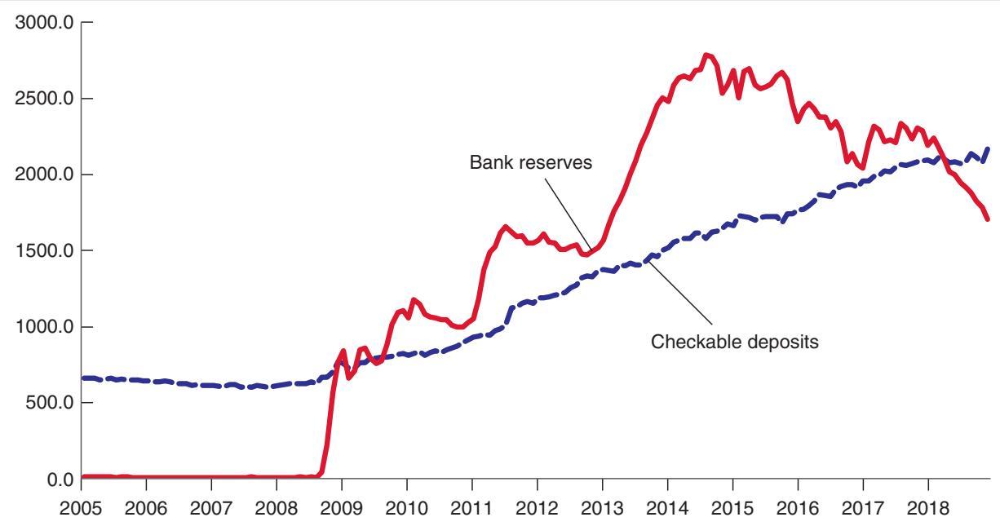
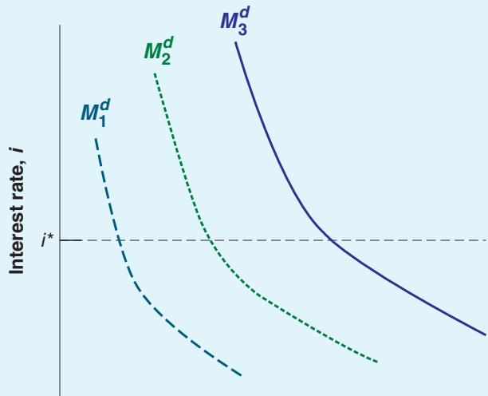

## The Liquidity Trap in Action

You saw in Chapter 1 how, when the financial crisis began, the Fed decreased the federal funds rate from 5% in mid-2007 to 0% by the end of 2008, when it hit the zero lower bound. It remained at zero for seven years, before starting to slowly increase again.

What did the Fed do? From the end of 2008 on, it continued to increase the money supply through open market operations, buying bonds in exchange for money. The analysis in the text suggests that, despite the interest rate remaining equal to zero, there should have been an increase in checkable deposits by households, and an increase in reserves by banks. And, indeed, as Figure 1 shows, this is exactly what happened. Checkable deposits of both households and firms—which were decreasing before 2007, reflecting the increasing use of credit cards—increased from \$620 billion in mid-2008 to \$1,700 billion at the end of 2015. Bank reserves rose dramatically from \$10 billion in mid-2008 to \$700 billion at the end of 2008 and to \$2,500 billion by the end of 2015. In other words, the very large increase in the supply of central bank money was willingly absorbed by households and by banks with no change in the interest rate, which remained equal to zero.

This brief description, together with Figure 1, should, however, lead you to ask two questions:

Why did the Fed continue to increase the money supply, despite the fact that it had no effect on the federal funds rate, which remained equal to zero? You will see the reason in Chapter 6: In effect, in an economy with more than one type of bond, open market operations can affect interest rates on other bonds and affect the economy.

Why were banks willing to keep high levels of reserves when, starting at the end of 2015, the interest rate started to increase? You will see the reason in Chapter 22: In order to induce banks to keep high reserve levels, the Fed increased the interest rate on reserves, and this policy instrument is becoming steadily more important.

  
Figure 1  
Checkable Deposits and Bank Reserves, 2005–2018. (billions).  
Source: FRED: TCP, WRESBAL.

Now consider the effects of an increase in the money supply. (Let’s ignore banks for the time being, and assume, as in Section 4–2, that all money is currency, so we can use the same diagram as in Figure 4-2 extended to allow for the horizontal portion of money demand. We come back to banks and bank money below.)

■ Consider the case where the money supply is Ms, so the interest rate consistent with financial market equilibrium is positive and equal to i. (This is the case we considered in Section 4–2.) Starting from that equilibrium, an increase in the money supply—a shift of the Ms line to the right—leads to a decrease in the interest rate.

■ Now consider the case where the money supply is Ms′, so the equilibrium is at point B; or the case where the money supply is Ms″, so the equilibrium is given by point C. In either case, the initial interest rate is zero. And, in either case, an increase in the money supply has no effect on the interest rate. Think of it this way:

Suppose the central bank increases the money supply. It does so through an open market operation in which it buys bonds and pays for them by creating money. As the interest rate is zero, people are indifferent to how much money or bonds they hold, so they are willing to hold fewer bonds and more money at the same interest rate, namely zero. The money supply increases, but with no effect on the interest rate—which remains equal to zero.

What happens when we reintroduce checkable deposits and a role for banks, along the lines of Section 4–3? Everything we just said still applies to the demand for money by people: If the interest rate is zero, they are indifferent to whether they hold money or bonds: Both pay zero interest. But, now a similar argument also applies to banks and their decision whether to hold reserves or buy bonds. If the interest rate is equal to zero, they will also be indifferent as to whether to hold reserves and to buy bonds: Both pay zero interest. Thus, when the interest rate is down to zero, and the central bank increases the money supply, we are likely to see an increase in checkable deposits and an increase in bank reserves, with the interest rate remaining at zero. As the Focus Box “The Liquidity Trap in Action” shows, this is exactly what we saw during the crisis. As the Fed decreased the interest rate to zero, and continued to expand the money supply, both checkable deposits by people and reserves by banks steadily increased.

## SUMMARY

The demand for money depends positively on the level of transactions in the economy and negatively on the interest rate.

The interest rate is determined by the equilibrium condition that the supply of money be equal to the demand for money.

For a given supply of money, an increase in income leads to an increase in the demand for money and an increase in the interest rate. An increase in the supply of money for a given income leads to a decrease in the interest rate.

The way the central bank changes the supply of money is through open market operations.

Expansionary open market operations, in which the central bank increases the money supply by buying bonds, lead to an increase in the price of bonds and a decrease in the interest rate.

Contractionary open market operations, in which the central bank decreases the money supply by selling bonds, lead to a decrease in the price of bonds and an increase in the interest rate.

When money includes both currency and checkable deposits, we can think of the interest rate as being determined by the condition that the supply of central bank money be equal to the demand for central bank money.

The supply of central bank money is under the control of the central bank. In the special case where people hold only checkable deposits, the demand for central bank money is equal to the demand for reserves by banks, which is itself equal to the overall demand for money times the reserve ratio chosen by banks.

The market for bank reserves is called the federal funds market. The interest rate determined in that market is called the federal funds rate.

The interest rate chosen by the central bank cannot go below zero. When the interest rate is equal to zero, people and banks become indifferent to holding money or bonds. An increase in the money supply leads to an increase in money demand, an increase in reserves by banks, and no change in the interest rate. This case is known as the liquidity trap. In the liquidity trap, monetary policy no longer affects the interest rate.

## KEY TERMS

Federal Reserve Bank (Fed), 67 currency, 68 checkable deposits, 68 bonds, 68 money market funds, 68 money, 69 income, 69 flow, 69 saving, 69 savings, 69 financial wealth, 69 stock, 69 investment, 69 financial investment, 69

## QUESTIONS AND PROBLEMS

## QUICK CHECK

1. Using the information in this chapter, label each of the following statements true, false, or uncertain. Explain briefly.

a. Income and financial wealth are both examples of stock variables.

b. The term investment, as used by economists, refers to the purchase of bonds and shares of stock.

c. The demand for money does not depend on the interest rate because only bonds earn interest.

d. A large proportion of US currency appears to be held outside the United States.

e. The central bank can increase the supply of money by selling bonds.

f. The Federal Reserve can determine the money supply, but it cannot change interest rates.

g. Bond prices and interest rates always move in opposite directions.

h. An increase in income (GDP) will always be accompanied by an increase in interest rates when the money supply is not increased.

i. Once the interest rate is zero, the Fed has no further policy options.

2. Suppose that a person’s yearly income is \$60,000. Also suppose that this person’s money demand function is given by

$$
M ^ {d} = \mathbb {S} Y (0. 3 5 - i)
$$

a. What is this person’s demand for money when the interest rate is 5%? 10%?

b. Explain how the interest rate affects money demand.

c. Suppose that the interest rate is 10%. In percentage terms, what happens to this person’s demand for money if the yearly income is reduced by 50%?

d. Suppose that the interest rate is 5%. In percentage terms, what happens to this person’s demand for money if the yearly income is reduced by 50%?

open market operation, 74 expansionary open market operation, 74 contractionary open market operation, 74 Treasury bill (T-bill), 74 financial intermediaries, 76 (bank) reserves, 77 central bank money, 78 reserve ratio, 78 high-powered money, 78 monetary base, 78 federal funds market, 79 federal funds rate, 80 zero lower bound, 81 liquidity trap, 81

e. Summarize the effect of income on money demand. In percentage terms, how does this effect depend on the interest rate?

3. Consider a bond that promises to pay \$100 in one year.

a. What is the interest rate on the bond if its price today is \$75? \$85? \$95?

b. What is the relation between the price of the bond and the interest rate?

c. If the interest rate is 8%, what is the price of the bond today?

4. Suppose that money demand is given by

$$
M ^ {d} = \mathbb {S} Y (0. 2 5 - i)
$$

where \$Y is \$100. Also, suppose that the supply of money is \$20.

a. What is the equilibrium interest rate?

b. If the Federal Reserve Bank wants to increase the equilibrium interest rate i by 10 percentage points from its value in part a, at what level should it set the supply of money?

## DIG DEEPER

5. Suppose that a person’s wealth is \$50,000 and that her yearly income is \$60,000. Also suppose that her money demand function is given by

$$
M ^ {d} = \mathbb {S} Y (0. 3 5 - i)
$$

a. Derive the demand for bonds. Suppose the interest rate increases by 10 percentage points. What is the effect on her demand for bonds?

b. What are the effects of an increase in wealth on her demand for money and her demand for bonds? Explain in words.

c. What are the effects of an increase in income on her demand for money and her demand for bonds? Explain in words.

d. Consider the statement “When people earn more money, they obviously will hold more bonds.” What is wrong with this statement?

6. The demand for bonds

In this chapter, you learned that an increase in the interest rate makes bonds more attractive, so it leads people to hold more of their wealth in bonds as opposed to money. However, you also learned that an increase in the interest rate reduces the price of bonds.

How can an increase in the interest rate make bonds more attractive and reduce their price?

7. ATMs and credit cards

This problem examines the effect of the introduction of ATMs and credit cards on money demand. For simplicity, let’s examine a person’s demand for money over a period of four days. Suppose that before ATMs and credit cards, this person goes to the bank once at the beginning of each four-day period and withdraws from her savings account all the money she needs for four days. Assume that she needs \$4 per day.

a. How much does this person withdraw each time she goes to the bank? Compute this person’s money holdings for days 1 through 4 (in the morning, before she needs any of the money she withdraws).

b. What is the amount of money this person holds, on average? Suppose now that with the advent of ATMs, this person withdraws money once every two days.

c. Recompute your answer to part a.

d. Recompute your answer to part b.

Finally, with the advent of credit cards, this person pays for all her purchases using her card. She withdraws no money until the fourth day, when she withdraws the whole amount necessary to pay for her credit card purchases over the previous four days.

e. Recompute your answer to part a.

f. Recompute your answer to part b.

g. Based on your previous answers, what do you think has been the effect of ATMs and credit cards on money demand?

8. Money and the banking system

I described a monetary system that included simple banks in Section 4-3. Assume the following:

i. The public holds no currency.

ii. The ratio of reserves to deposits is 0.1.

iii. The demand for money is given by

Fill in the table below using the first entry as an example.

<table><tr><td colspan="4">Initial Money Demand Curve for real income Y and price level P</td><td colspan="4">Final Money Demand Curve for real income Y and price level P</td><td>Action required by the Fed to maintain an interest rate at i*</td></tr><tr><td>Initial  $M^d$  curve</td><td>Y</td><td>P</td><td>$Y</td><td>Final  $M^d$  curve</td><td>Y</td><td>P</td><td>$Y</td><td>Explanation</td></tr><tr><td> $M^d_2$ </td><td>250</td><td>100</td><td>250</td><td> $M^d_3$ </td><td>300</td><td>105</td><td>315</td><td>The Fed must increase the money supply as nominal income rises — both real income and prices rise</td></tr><tr><td> $M^d_2$ </td><td>200</td><td>80</td><td></td><td></td><td>250</td><td>100</td><td></td><td></td></tr><tr><td> $M^d_2$ </td><td>250</td><td>100</td><td></td><td></td><td>300</td><td>100</td><td></td><td></td></tr><tr><td> $M^d_2$ </td><td>250</td><td>100</td><td></td><td></td><td>200</td><td>95</td><td></td><td></td></tr><tr><td> $M^d_2$ </td><td>250</td><td>100</td><td></td><td></td><td>275</td><td>80</td><td></td><td></td></tr></table>

$$
M ^ {d} = \mathbb {S} Y (0. 8 - 4 i)
$$

Initially, the supply of central bank money is \$100 billion, and nominal income is \$5 trillion.

a. What is the demand for central bank money?

b. Find the equilibrium interest rate by setting the demand for central bank money equal to the supply of central bank money.

c. What is the overall supply of money? Is it equal to the overall demand for money at the interest rate you found in part b?

d. What is the effect on the interest rate if central bank money is increased to \$300 billion?

e. If the overall money supply increases to \$3,000 billion, what will be the effect on i? [Hint: Use what you discovered in part c.]

The diagram below shows three different money demand curves and a target interest rate i\*

9. Understanding the Fed’s actions that are needed to stabilize the interest rate

10. Choosing the quantity of money or the interest rate

Suppose that money demand is given by

$$
M ^ {d} = \mathbb {S} Y (0. 2 5 - i)
$$

where \$Y is \$100.

a. If the Federal Reserve Bank sets an interest rate target of 5%, what is the money supply the Federal Reserve must create?

b. If the Federal Reserve Bank wants to increase i from 5% to 10%, what is the new level of the money supply the Federal Reserve must set?

c. What is the effect on the Federal Reserve’s balance sheet of the increase in the interest rate from 5% to 10%?

11. Monetary policy in a liquidity trap

Suppose that money demand is given by

$$
M ^ {d} = \mathbb {S} Y (0. 2 5 - i)
$$

as long as interest rates are positive. The questions below then refer to situations where the interest rate is zero.

a. What is the demand for money when interest rates are zero and \$Y = 80?

b. If \$Y = 80, what is the smallest value of the money supply at which the interest rate is zero?

c. Once the interest rate is zero, can the central bank continue to increase the money supply?

d. The United States experienced a long period of zero interest rates after 2008. Can you find evidence in the text that the money supply continued to increase over this period?

## FURTHER READINGS

While we shall return to many aspects of the financial system throughout the book, you may want to dig deeper and read a textbook on money and banking. Here are four of them:

Money, Banking, and Financial Markets, by Laurence Ball (Worth, 2017)

Money, Banking, and Financial Markets, by Stephen Cecchetti and Kermit Schoenholtz (McGraw-Hill/Irwin, 2017)

e. Go to the database at the Federal Reserve Bank of St. Louis known as FRED. Find the series BOGGMBASE (the central bank money, also called the monetary base) and look at its behavior from 2010 to 2015. What happened to the monetary base? What happened to the federal funds rate in the same period?

## EXPLORE FURTHER

## 12. Current monetary policy

Go to the website for the Federal Reserve Board of Governors (www.federalreserve.gov) and download the most recent monetary policy press release of the Federal Open Market Committee (FOMC), the body that makes monetary policy decisions. Make sure you get the most recent FOMC press release and not simply the most recent Fed press release.

a. What is the current stance of monetary policy? (Note that policy will be described in terms of increasing or decreasing the federal funds rate as opposed to increasing or decreasing the money supply or the monetary base.)

b. Find a press release announcing a change in the federal funds rate. How did the Federal Reserve explain the need for that change in monetary policy?

Finally, visit the Fed’s website and find various statements explaining the Fed’s current policy on interest rates. These statements set the stage for the analysis in Chapter 5. Some parts of these statements will be clearer once you have read Chapter 5.

Money, the Financial System and the Economy, by R. Glenn Hubbard (Addison-Wesley, 2013) The Economics of Money, Banking, and the Financial System, by Frederic Mishkin (Pearson, 2018)

The Fed maintains a useful website with data on financial markets, information on what the Fed does, recent testimonies by the Fed Chair, and so on (www.federalreserve.gov).
