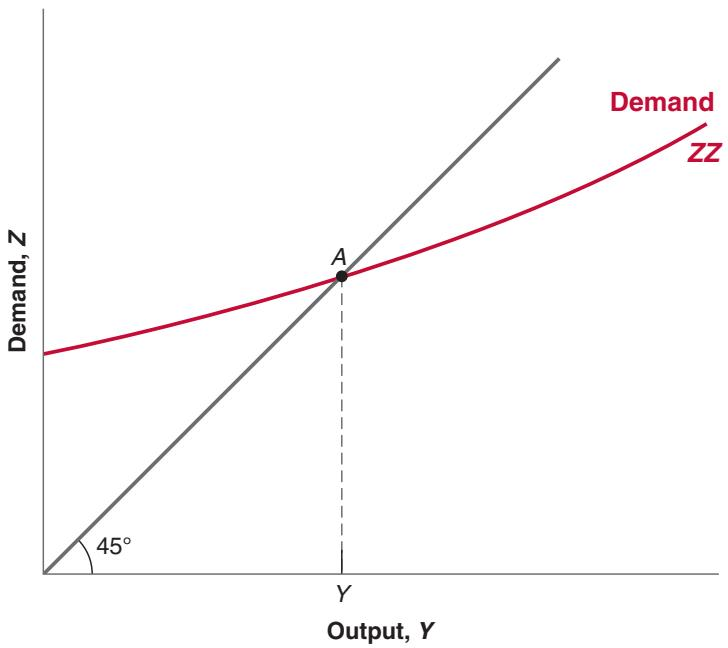
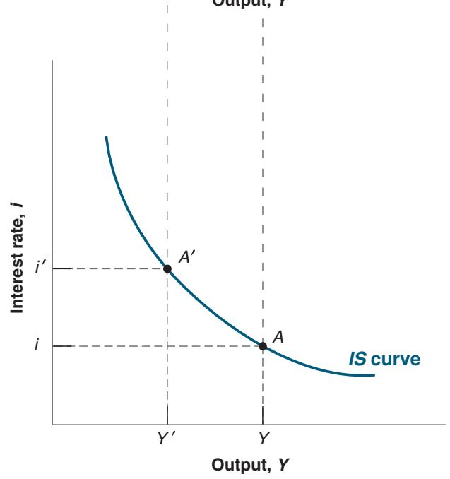
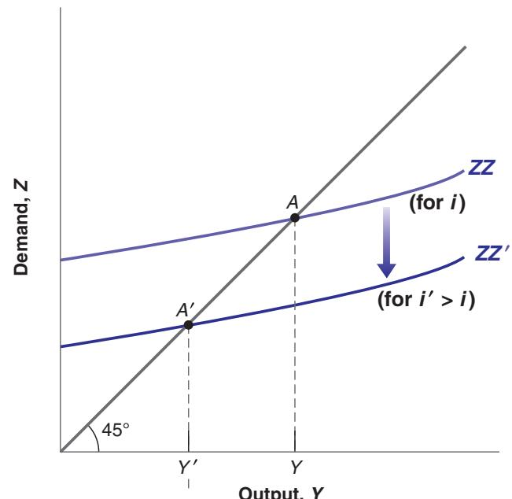
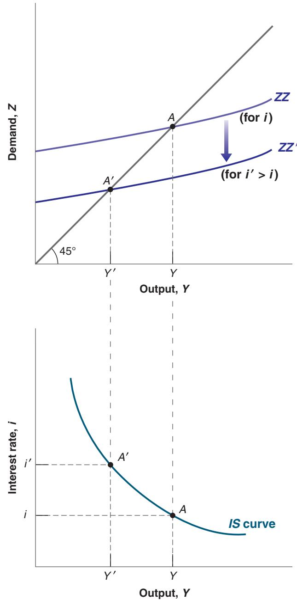
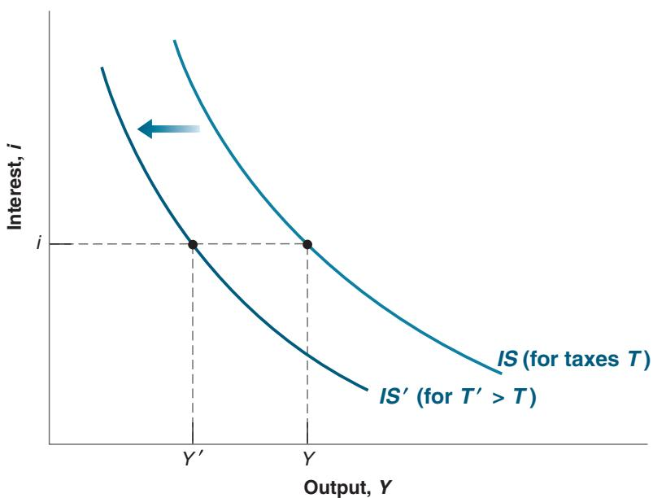
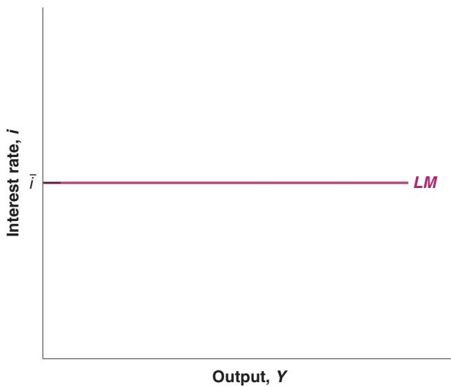

# Goods and Financial Markets: The IS-LM Model

n Chapter 3, we looked at the goods market. In Chapter 4, we looked at financial markets. We now look at goods and financial markets together. By the end of this chapter you will have a framework to think about how output and the interest rate are determined in the short run.

In developing this framework, we follow a path first traced by two economists, John Hicks and Alvin Hansen in the late 1930s and early 1940s. When the economist John Maynard Keynes published his General Theory in 1936, there was much agreement that his book was both fundamental and nearly impenetrable. (Try to read it, and you will agree.) There were (and still are) many debates about what Keynes “really meant.” In 1937, John Hicks summarized what he saw as one of Keynes’s main contributions: the joint description of goods and financial markets. His analysis was later extended by Alvin Hansen. Hicks and Hansen called their formalization the IS-LM (investment-saving, liquidity-money) model.

Macroeconomics has made substantial progress since the early 1940s. This is why the IS-LM model is treated in this and the next chapter rather than in Chapter 24 of this book. (If you had taken this course 40 years ago, you would be nearly done!) But to most economists, the IS-LM model still represents an essential building block—one that, despite its simplicity, captures much of what happens in the economy in the short run. This is why the IS-LM model is still taught and used today.

This chapter develops the basic version of the IS-LM model.

The version of the IS-LM model presented in this book is a bit different (and, you will be happy to know, simpler) than the model developed by Hicks and Hansen. This reflects a change in the way central banks now conduct monetary policy, with a shift in focus from controlling the money stock to controlling the interest rate, as explained in Chapter 4.

Section 5-1 looks at equilibrium in the goods market and derives the IS relation.

Section 5-2 looks at equilibrium in financial markets and derives the LM relation.

Sections 5-3 and 5-4 put the IS and LM relations together and use the resulting IS-LM model to study the effects of fiscal and monetary policy—first separately, then together.

Section 5-5 introduces dynamics and explores how the IS-LM model captures what happens in the economy in the short run.

If you remember one basic message from this chapter, it should be: In the short run, output is determined by equilibrium in the goods and financial markets.

Much more on the effects of interest rates on both consumption and investment in

■The argument still holds if c the firm uses its own funds: The higher the interest rate, the more attractive it is to lend the funds rather than to use them to buy the new machine.

## Let’s first summarize what we learned in Chapter 3:

■ We characterized equilibrium in the goods market as the condition that production, Y, be equal to the demand for goods, Z. We called this condition the IS relation.

■ We defined demand as the sum of consumption, investment, and government spending. We assumed that consumption was a function of disposable income (income minus taxes), and took investment spending, government spending, and taxes as given:

$$
Z = C (Y - T) + \bar {I} + G
$$

(In Chapter 3, we assumed, to simplify the algebra, that the relation between consumption, C, and disposable income, Y-T, was linear. Here, we shall not make this assumption but use the more general form $C = C ( Y - T )$ instead.)

■ The equilibrium condition was thus given by

$$
Y = C (Y - T) + \bar {I} + G
$$

Using this equilibrium condition, we then looked at the factors that moved equilibrium output. We looked in particular at the effects of changes in government spending and of shifts in consumption demand.

The main simplification of this first model was that the interest rate did not affect the demand for goods. Our first task in this chapter is to abandon this simplification and introduce the interest rate in our model of equilibrium in the goods market. For the time being, we focus only on the effect of the interest rate on investment and leave the discussion of its effects on the other components of demand until later.c

## Investment, Sales, and the Interest Rate

In Chapter 3, investment was assumed to be constant. This was for simplicity. Investment is in fact far from constant and depends primarily on two factors:

■ The level of sales. Consider a firm facing an increase in sales and needing to increase production. To do so, it may need to buy additional machines or build an additional plant. In other words, it needs to invest. A firm facing low sales will feel no such need and will spend little, if anything, on investment.

The interest rate. Consider a firm deciding whether to buy a new machine. Suppose that to buy the new machine, the firm must borrow. The higher the interest rate, the less attractive it is to borrow and buy the machine. (For the moment, and to keep things simple, we make two simplifications. First, we assume that all firms can borrow at the same interest rate—namely, the interest rate on bonds as determined in Chapter 4. In fact, many firms borrow from banks, possibly at a different rate. We also leave aside the distinction between the nominal interest rate—the interest rate in terms of dollars—and the real interest rate—the interest rate in terms of goods. We return to both issues in Chapter 6.) At a high enough interest rate, the additional profits from using the new machine will not cover interest payments, and the new machine will not be worth buying.

To capture these two effects, we write the investment relation as follows:

$$
\begin{array}{c} I = I (Y, i) \\ (+, -) \end{array}\tag{5.1}
$$

Equation (5.1) states that investment I depends on production Y and the interest rate i. (We continue to assume that inventory investment is equal to zero, so sales and production are always equal. As a result, Y denotes both sales and production.) The positive sign under Y indicates that an increase in production (equivalently, an increase in sales) leads to an increase in investment. The negative sign under the interest rate i indicates that an increase in the interest rate leads to a decrease in investment.

An increase in output leads to an increase in investment. An increase in the interest rate leads to a decrease in investment.

## Determining Output

Taking into account the investment relation (5.1), the condition for equilibrium in the goods market becomes

$$
Y = C (Y - T) + I (Y, i) + G\tag{5.2}
$$

Production (the left side of the equation) must be equal to the demand for goods (the right side). Equation (5.2) is our expanded IS relation. We can now look at what happens to output when the interest rate changes.

Start with Figure 5-1. Measure the demand for goods (Z) on the vertical axis. Measure output (Y) on the horizontal axis. For a given value of the interest rate i, demand is an increasing function of output, for two reasons:

■ An increase in output leads to an increase in income and thus to an increase in disposable income. The increase in disposable income leads to an increase in consumption. We studied this relation in Chapter 3.

■ An increase in output also leads to an increase in investment. This is the relation between investment and sales that we have introduced in this chapter.

In short, an increase in output leads, through its effects on both consumption and investment, to an increase in the demand for goods. This relation between demand and output, for a given interest rate, is represented by the upward-sloping curve ZZ.

Note two characteristics of ZZ in Figure 5-1:

■ Because we have not assumed that the consumption and investment relations in equation (5.2) are linear, ZZ is in general a curve rather than a line, as shown in Figure 5-1. All the arguments that follow would apply if we assumed

  
Figure 5-1 Equilibrium in the Goods Market

The demand for goods is an increasing function of output. Equilibrium requires that the demand for goods be equal to output.

## Figure 5-2

## The IS Curve

(a) An increase in the interest rate decreases the demand for goods at any level of output, leading to a decrease in the equilibrium level of output. (b) Equilibrium in the goods market implies that an inc rease in the interest rate leads to a decrease in output. The IS curve, which gives the relation between the interest rate and output, is therefore downward sloping.

(a)  
(b)  

that the consumption and investment relations were linear and that ZZ were a straight line.

Make sure you understand why the two statements mean the same thing.

■ We have drawn ZZ so that it is flatter than the 45-degree line. Put another, but equivalent, way, we have assumed that an increase in output leads to a less than one-for-one increase in demand. In Chapter 3, where investment was constant, this restriction naturally followed from the assumption that consumers spend only part of their additional income on consumption. But now that we allow investment to respond to production, this restriction may no longer hold. In response to an increase in output, the sum of the increase in consumption and the increase in investment could exceed the initial increase in output. Although this is a theoretical possibility, the empirical evidence suggests that it is not the case in reality. That’s why we shall assume that the response of demand to output is less than one for one and draw ZZ flatter than the 45-degree line.

Equilibrium in the goods market is reached at the point where the demand for goods equals output; that is, at point A, the intersection of ZZ and the 45-degree line. The equilibrium level of output is given by Y.

So far, what we have done is extend, in straightforward fashion, the analysis of Chapter 3. We are now ready to derive the IS curve.

## Deriving the IS Curve

We have drawn the demand relation, ZZ, in Figure 5-1 for a given value of the interest rate. Let’s now derive in Figure 5-2 what happens if the interest rate changes.

Suppose that, in Figure 5-2(a), the demand curve is given by ZZ and the initial equilibrium is at point A. Suppose now that the interest rate increases from its initial value i to i′. At any level of output, the higher interest rate leads to lower investment and lower demand. The demand curve ZZ shifts down to ZZ′: At a given level of output, demand is lower. The new equilibrium is at the intersection of the lower demand curve ZZ′ and the 45-degree line, at point A′. The equilibrium level of output is now equal to Y′.

In words: The increase in the interest rate decreases investment. The decrease in investment leads to a decrease in output, which further decreases consumption and investment, through the multiplier effect.

Can you show graphically the size of the multiplier? (Hint: Look at the ratio of the decrease in equilibrium out-b put to the initial decrease in investment.)

Using Figure 5-2(a), we can find the equilibrium value of output associated with any value of the interest rate. The resulting relation between equilibrium output and the interest rate is drawn in Figure 5-2(b).

Figure 5-2(b) plots equilibrium output Y on the horizontal axis against the interest rate on the vertical axis. Point A in Figure 5-2(b) corresponds to point A in Figure 5-2(a), and point A′ in Figure 5-2(b) corresponds to A′ in Figure 5-2(a). The higher interest rate is associated with a lower level of output.

This relation between the interest rate and output is represented by the downwardsloping curve in Figure 5-2(b). This curve is called the IS curve.

Equilibrium in the goods market implies that an increase in the interest rate leads to a decrease in output. This relation is represented by the b downward-sloping IS curve.

## Shifts of the IS Curve

We have drawn the IS curve in Figure 5-2, taking as given the values of taxes, T, and government spending, G. Changes in either T or G will shift the IS curve.

  
Figure 5-3  
Shifts of the IS Curve  
An increase in taxes shifts the IS curve to the left.

For a given interest rate, an increase in taxes leads to a decrease in output. In graphic terms: An increase in taxes shifts the IS curve to the left.

## Suppose that the

government announces that the Social Security system is in trouble and it may have to cut retirement benefits in the future. How are consumers likely to react? What is then likely to happen to demand and output?

To see how, consider Figure 5-3. The IS curve gives the equilibrium level of output as a function of the interest rate. It is drawn for given values of taxes and spending. Now consider an increase in taxes, from T to T′. At a given interest rate, i, disposable income decreases, leading to a decrease in consumption, leading in turn to a decrease in the demand for goods and a decrease in equilibrium output, from Y to $Y ^ { \prime }$ . The IS curve shifts to the left: At a given interest rate, the equilibrium level of output is lower than it was before the increase in taxes.

More generally, any factor that, for a given interest rate, decreases the equilibrium level of output causes the IS curve to shift to the left. We have looked at an increase in taxes. But the same would hold for a decrease in government spending or in consumer confidence (which decreases consumption given disposable income). Symmetrically, any factor that, for a given interest rate, increases the equilibrium level of output—a decrease in taxes, an increase in government spending, an increase in consumer confidence— causes the IS curve to shift to the right.c

Let’s summarize:

■ Equilibrium in the goods market implies that an increase in the interest rate leads to a decrease in output. This relation is represented by the downward-sloping IS curve.

■ Changes in factors that decrease the demand for goods, given the interest rate, shift the IS curve to the left. Changes in factors that increase the demand for goods, given the interest rate, shift the IS curve to the right.

## 5-2 FINANCIAL MARKETS AND THE LM RELATION

Let’s now turn to financial markets. We saw in Chapter 4 that the interest rate is determined by the equality of the supply of and demand for money:

$$
M = \mathbb {S} Y L (i)
$$

The variable M on the left side is the nominal money stock. We shall ignore here the details of the money-supply process that we saw in Section 4-3, and simply think of the central bank as controlling M directly.

The right side gives the demand for money, which is a function of nominal income, \$Y, and of the nominal interest rate, i. As we saw in Section 4-1, an increase in nominal income increases the demand for money; an increase in the interest rate decreases the demand for money. Equilibrium requires that money supply (the left side of the equation) be equal to money demand (the right side of the equation).

## Real Money, Real Income, and the Interest Rate

From Chapter 2: NominalGDP = RealGDP multiplied by the GDP deflator \$Y = Y P. Equivalently: RealGDP = NominalGDP dividedbytheGDPdeflator \$Y>P = Y.

The equation M = \$Y L1i2 gives a relation between money, nominal income, and the interest rate. It will be more convenient here to rewrite it as a relation among real money (that is, money in terms of goods), real income (that is, income in terms of goods), and the interest rate.

Recall that nominal income divided by the price level equals real income, Y. Dividing both sides of the equation by the price level P gives

$$
\frac {M}{P} = Y L (i)\tag{5.3}
$$

Hence, we can restate our equilibrium condition as the condition that the real money supply—that is, the money stock in terms of goods, not dollars—be equal to the real money demand, which depends on real income, Y, and the interest rate, i.

The notion of a “real” demand for money may feel a bit abstract, so an example will help. Instead of thinking of your demand for money in general, think of your demand for coins. Suppose you like to have coins in your pocket to buy two cups of coffee during the day. If a cup costs \$1.20, you will want to keep about \$2.40 in coins. This is your nominal demand for coins. Equivalently, you want to keep enough coins in your pocket to buy two cups of coffee. This is your demand for coins in terms of goods—here in terms of cups of coffee.

From now on, we shall refer to equation (5.3) as the LM relation. The advantage of writing things this way is that real income, Y, appears on the right side of the equation instead of nominal income, \$Y. And real income (equivalently real output) is the variable we focus on when looking at equilibrium in the goods market. To make the reading lighter, we will refer to the left and right sides of equation (5.3) simply as “money supply” and “money demand” rather than the more accurate but heavier “real money supply” and “real money demand.” Similarly, we will refer to income rather than “real income.”

## Deriving the LM Curve

In deriving the IS curve, we took the two policy variables as government spending, G, and taxes, T. In deriving the LM curve—the curve corresponding to the LM relation— we have to decide how we characterize monetary policy: as the choice of M, the money stock, or the choice of i, the interest rate.

If we think of monetary policy as choosing the nominal money supply, M, and, by implication, given the price level that we shall take as fixed in the short run, choosing M/P, the real money stock, equation (5.3) tells us that real money demand, the right-hand side of the equation, must be equal to the given real money supply, the left-hand side of the equation. Thus, if, for example, real income increases, increasing money demand, the interest rate must increase so that money demand remains equal to the given money supply. In other words, for a given money supply, an increase in income automatically leads to an increase in the interest rate.

This is the traditional way of deriving the LM relation and the resulting LM curve. As we discussed in Chapter 4, however, the assumption that the central bank chooses the money stock and then just lets the interest rate adjust is at odds with reality today. Although, in the past, central banks thought of the money supply as the monetary policy variable, they now focus directly on the interest rate. They choose an interest rate, call it i, and adjust the money supply so as to achieve it. Thus, in the rest of the book, we shall think of the central bank as choosing the interest rate (and doing what it needs to do with the money supply to achieve this interest rate). This will make for an extremely simple LM curve, namely, a horizontal line (in Figure 5-4) at the value of the interest rate, i, chosen by the central bank.

b shall follow tradition.

## Figure 5-4

The LM Curve

The central bank chooses the interest rate (and adjusts the money supply so as to achieve it).
