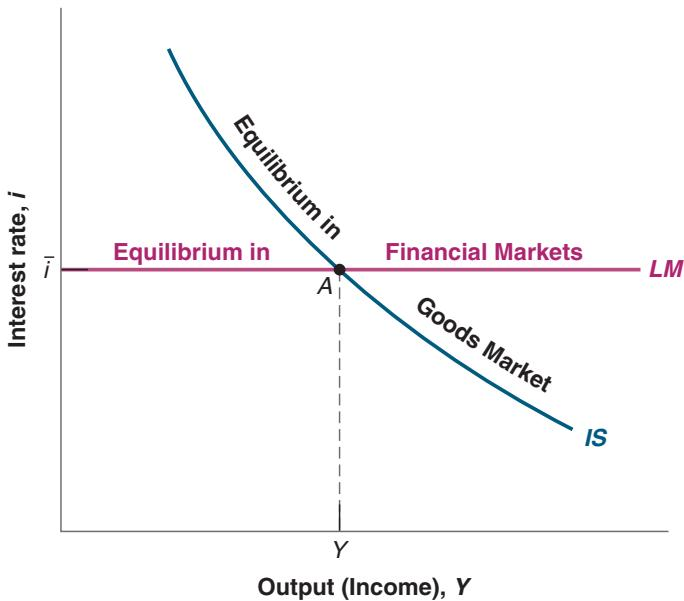
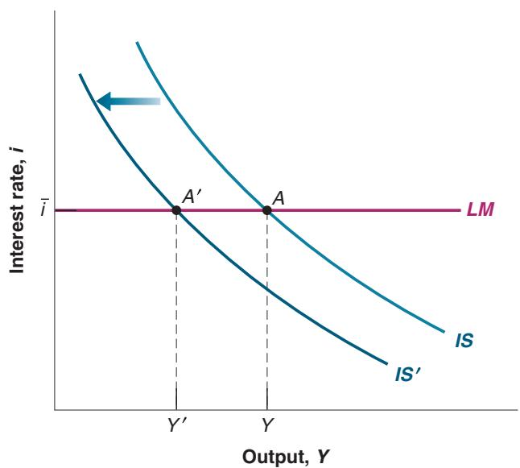
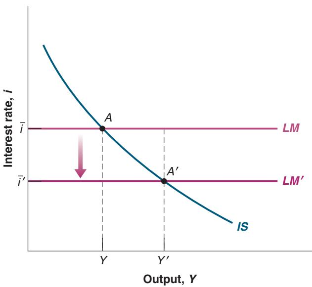
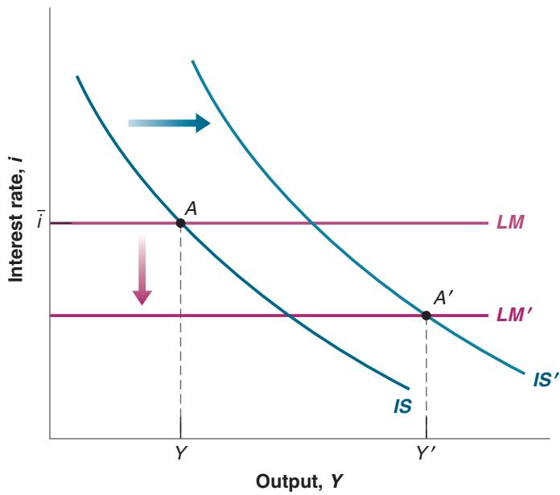
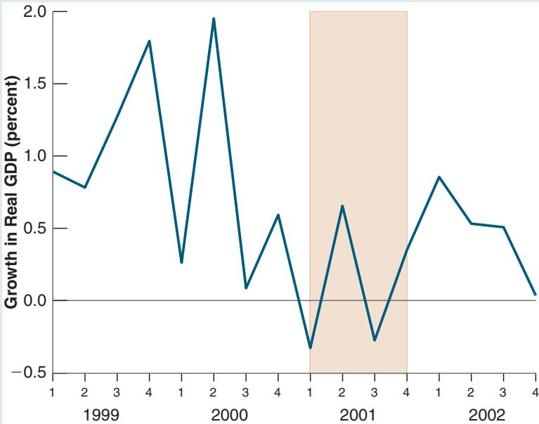
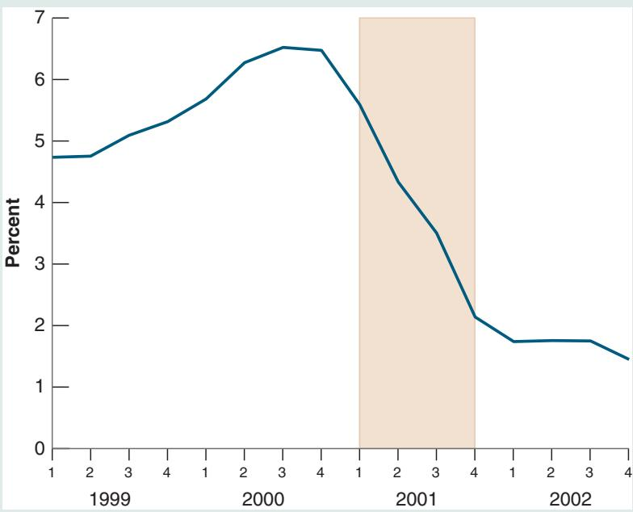
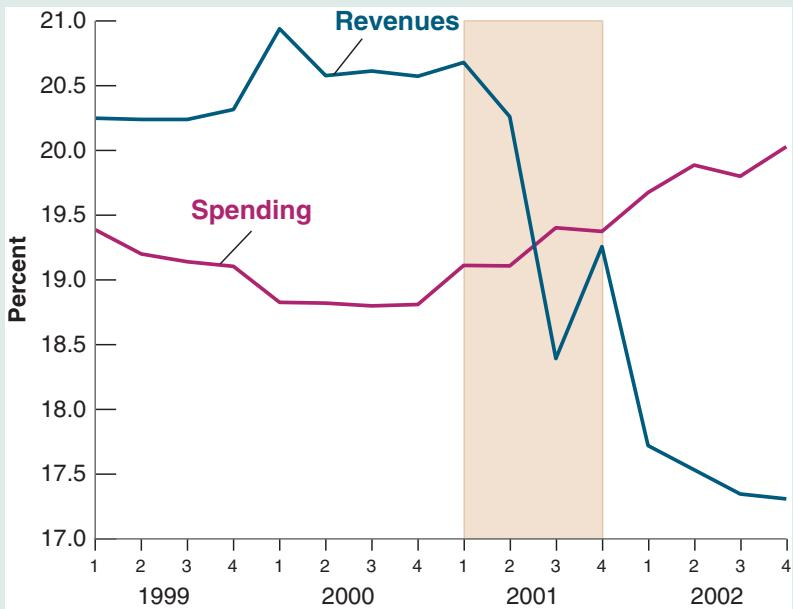
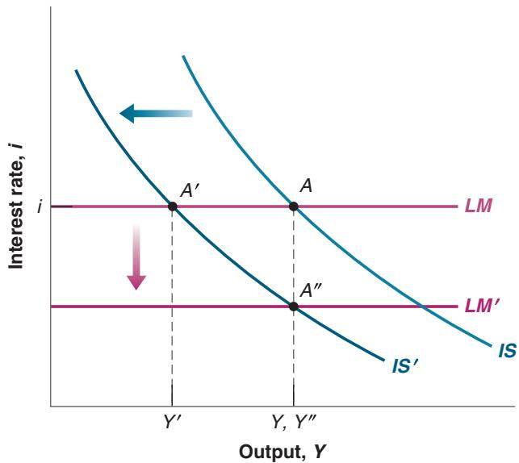

# Goods and Financial Markets: The IS-LM Model

n Chapter 3, we looked at the goods market. In Chapter 4, we looked at financial markets. We now look at goods and financial markets together. By the end of this chapter you will have a framework to think about how output and the interest rate are determined in the short run.

In developing this framework, we follow a path first traced by two economists, John Hicks and Alvin Hansen in the late 1930s and early 1940s. When the economist John Maynard Keynes published his General Theory in 1936, there was much agreement that his book was both fundamental and nearly impenetrable. (Try to read it, and you will agree.) There were (and still are) many debates about what Keynes “really meant.” In 1937, John Hicks summarized what he saw as one of Keynes’s main contributions: the joint description of goods and financial markets. His analysis was later extended by Alvin Hansen. Hicks and Hansen called their formalization the IS-LM (investment-saving, liquidity-money) model.

Macroeconomics has made substantial progress since the early 1940s. This is why the IS-LM model is treated in this and the next chapter rather than in Chapter 24 of this book. (If you had taken this course 40 years ago, you would be nearly done!) But to most economists, the IS-LM model still represents an essential building block—one that, despite its simplicity, captures much of what happens in the economy in the short run. This is why the IS-LM model is still taught and used today.

This chapter develops the basic version of the IS-LM model.

The version of the IS-LM model presented in this book is a bit different (and, you will be happy to know, simpler) than the model developed by Hicks and Hansen. This reflects a change in the way central banks now conduct monetary policy, with a shift in focus from controlling the money stock to controlling the interest rate, as explained in Chapter 4.

Section 5-1 looks at equilibrium in the goods market and derives the IS relation.

Section 5-2 looks at equilibrium in financial markets and derives the LM relation.

Sections 5-3 and 5-4 put the IS and LM relations together and use the resulting IS-LM model to study the effects of fiscal and monetary policy—first separately, then together.

Section 5-5 introduces dynamics and explores how the IS-LM model captures what happens in the economy in the short run.

If you remember one basic message from this chapter, it should be: In the short run, output is determined by equilibrium in the goods and financial markets.

Much more on the effects of interest rates on both consumption and investment in

■The argument still holds if c the firm uses its own funds: The higher the interest rate, the more attractive it is to lend the funds rather than to use them to buy the new machine.

## Let’s first summarize what we learned in Chapter 3:

■ We characterized equilibrium in the goods market as the condition that production, Y, be equal to the demand for goods, Z. We called this condition the IS relation.

■ We defined demand as the sum of consumption, investment, and government spending. We assumed that consumption was a function of disposable income (income minus taxes), and took investment spending, government spending, and taxes as given:

$$
Z = C (Y - T) + \bar {I} + G
$$

(In Chapter 3, we assumed, to simplify the algebra, that the relation between consumption, C, and disposable income, Y-T, was linear. Here, we shall not make this assumption but use the more general form $C = C ( Y - T )$ instead.)

■ The equilibrium condition was thus given by

$$
Y = C (Y - T) + \bar {I} + G
$$

Using this equilibrium condition, we then looked at the factors that moved equilibrium output. We looked in particular at the effects of changes in government spending and of shifts in consumption demand.

The main simplification of this first model was that the interest rate did not affect the demand for goods. Our first task in this chapter is to abandon this simplification and introduce the interest rate in our model of equilibrium in the goods market. For the time being, we focus only on the effect of the interest rate on investment and leave the discussion of its effects on the other components of demand until later.c

## Investment, Sales, and the Interest Rate

In Chapter 3, investment was assumed to be constant. This was for simplicity. Investment is in fact far from constant and depends primarily on two factors:

■ The level of sales. Consider a firm facing an increase in sales and needing to increase production. To do so, it may need to buy additional machines or build an additional plant. In other words, it needs to invest. A firm facing low sales will feel no such need and will spend little, if anything, on investment.

The interest rate. Consider a firm deciding whether to buy a new machine. Suppose that to buy the new machine, the firm must borrow. The higher the interest rate, the less attractive it is to borrow and buy the machine. (For the moment, and to keep things simple, we make two simplifications. First, we assume that all firms can borrow at the same interest rate—namely, the interest rate on bonds as determined in Chapter 4. In fact, many firms borrow from banks, possibly at a different rate. We also leave aside the distinction between the nominal interest rate—the interest rate in terms of dollars—and the real interest rate—the interest rate in terms of goods. We return to both issues in Chapter 6.) At a high enough interest rate, the additional profits from using the new machine will not cover interest payments, and the new machine will not be worth buying.

To capture these two effects, we write the investment relation as follows:

$$
\begin{array}{c} I = I (Y, i) \\ (+, -) \end{array}\tag{5.1}
$$

Equation (5.1) states that investment I depends on production Y and the interest rate i. (We continue to assume that inventory investment is equal to zero, so sales and production are always equal. As a result, Y denotes both sales and production.) The positive sign under Y indicates that an increase in production (equivalently, an increase in sales) leads to an increase in investment. The negative sign under the interest rate i indicates that an increase in the interest rate leads to a decrease in investment.

An increase in output leads to an increase in investment. An increase in the interest rate leads to a decrease in investment.

## Determining Output

Taking into account the investment relation (5.1), the condition for equilibrium in the goods market becomes

$$
Y = C (Y - T) + I (Y, i) + G\tag{5.2}
$$

Production (the left side of the equation) must be equal to the demand for goods (the right side). Equation (5.2) is our expanded IS relation. We can now look at what happens to output when the interest rate changes.

Start with Figure 5-1. Measure the demand for goods (Z) on the vertical axis. Measure output (Y) on the horizontal axis. For a given value of the interest rate i, demand is an increasing function of output, for two reasons:

■ An increase in output leads to an increase in income and thus to an increase in disposable income. The increase in disposable income leads to an increase in consumption. We studied this relation in Chapter 3.

■ An increase in output also leads to an increase in investment. This is the relation between investment and sales that we have introduced in this chapter.

In short, an increase in output leads, through its effects on both consumption and investment, to an increase in the demand for goods. This relation between demand and output, for a given interest rate, is represented by the upward-sloping curve ZZ.

Note two characteristics of ZZ in Figure 5-1:

■ Because we have not assumed that the consumption and investment relations in equation (5.2) are linear, ZZ is in general a curve rather than a line, as shown in Figure 5-1. All the arguments that follow would apply if we assumed

  
Figure 5-1 Equilibrium in the Goods Market

The demand for goods is an increasing function of output. Equilibrium requires that the demand for goods be equal to output.

## Figure 5-2

## The IS Curve

(a) An increase in the interest rate decreases the demand for goods at any level of output, leading to a decrease in the equilibrium level of output. (b) Equilibrium in the goods market implies that an inc rease in the interest rate leads to a decrease in output. The IS curve, which gives the relation between the interest rate and output, is therefore downward sloping.

(a)  
(b)  

that the consumption and investment relations were linear and that ZZ were a straight line.

Make sure you understand why the two statements mean the same thing.

■ We have drawn ZZ so that it is flatter than the 45-degree line. Put another, but equivalent, way, we have assumed that an increase in output leads to a less than one-for-one increase in demand. In Chapter 3, where investment was constant, this restriction naturally followed from the assumption that consumers spend only part of their additional income on consumption. But now that we allow investment to respond to production, this restriction may no longer hold. In response to an increase in output, the sum of the increase in consumption and the increase in investment could exceed the initial increase in output. Although this is a theoretical possibility, the empirical evidence suggests that it is not the case in reality. That’s why we shall assume that the response of demand to output is less than one for one and draw ZZ flatter than the 45-degree line.

Equilibrium in the goods market is reached at the point where the demand for goods equals output; that is, at point A, the intersection of ZZ and the 45-degree line. The equilibrium level of output is given by Y.

So far, what we have done is extend, in straightforward fashion, the analysis of Chapter 3. We are now ready to derive the IS curve.

## Deriving the IS Curve

We have drawn the demand relation, ZZ, in Figure 5-1 for a given value of the interest rate. Let’s now derive in Figure 5-2 what happens if the interest rate changes.

Suppose that, in Figure 5-2(a), the demand curve is given by ZZ and the initial equilibrium is at point A. Suppose now that the interest rate increases from its initial value i to i′. At any level of output, the higher interest rate leads to lower investment and lower demand. The demand curve ZZ shifts down to ZZ′: At a given level of output, demand is lower. The new equilibrium is at the intersection of the lower demand curve ZZ′ and the 45-degree line, at point A′. The equilibrium level of output is now equal to Y′.

In words: The increase in the interest rate decreases investment. The decrease in investment leads to a decrease in output, which further decreases consumption and investment, through the multiplier effect.

Can you show graphically the size of the multiplier? (Hint: Look at the ratio of the decrease in equilibrium out-b put to the initial decrease in investment.)

Using Figure 5-2(a), we can find the equilibrium value of output associated with any value of the interest rate. The resulting relation between equilibrium output and the interest rate is drawn in Figure 5-2(b).

Figure 5-2(b) plots equilibrium output Y on the horizontal axis against the interest rate on the vertical axis. Point A in Figure 5-2(b) corresponds to point A in Figure 5-2(a), and point A′ in Figure 5-2(b) corresponds to A′ in Figure 5-2(a). The higher interest rate is associated with a lower level of output.

This relation between the interest rate and output is represented by the downwardsloping curve in Figure 5-2(b). This curve is called the IS curve.

Equilibrium in the goods market implies that an increase in the interest rate leads to a decrease in output. This relation is represented by the b downward-sloping IS curve.

## Shifts of the IS Curve

We have drawn the IS curve in Figure 5-2, taking as given the values of taxes, T, and government spending, G. Changes in either T or G will shift the IS curve.

  
Figure 5-3  
Shifts of the IS Curve  
An increase in taxes shifts the IS curve to the left.

For a given interest rate, an increase in taxes leads to a decrease in output. In graphic terms: An increase in taxes shifts the IS curve to the left.

## Suppose that the

government announces that the Social Security system is in trouble and it may have to cut retirement benefits in the future. How are consumers likely to react? What is then likely to happen to demand and output?

To see how, consider Figure 5-3. The IS curve gives the equilibrium level of output as a function of the interest rate. It is drawn for given values of taxes and spending. Now consider an increase in taxes, from T to T′. At a given interest rate, i, disposable income decreases, leading to a decrease in consumption, leading in turn to a decrease in the demand for goods and a decrease in equilibrium output, from Y to $Y ^ { \prime }$ . The IS curve shifts to the left: At a given interest rate, the equilibrium level of output is lower than it was before the increase in taxes.

More generally, any factor that, for a given interest rate, decreases the equilibrium level of output causes the IS curve to shift to the left. We have looked at an increase in taxes. But the same would hold for a decrease in government spending or in consumer confidence (which decreases consumption given disposable income). Symmetrically, any factor that, for a given interest rate, increases the equilibrium level of output—a decrease in taxes, an increase in government spending, an increase in consumer confidence— causes the IS curve to shift to the right.c

Let’s summarize:

■ Equilibrium in the goods market implies that an increase in the interest rate leads to a decrease in output. This relation is represented by the downward-sloping IS curve.

■ Changes in factors that decrease the demand for goods, given the interest rate, shift the IS curve to the left. Changes in factors that increase the demand for goods, given the interest rate, shift the IS curve to the right.

## 5-2 FINANCIAL MARKETS AND THE LM RELATION

Let’s now turn to financial markets. We saw in Chapter 4 that the interest rate is determined by the equality of the supply of and demand for money:

$$
M = \mathbb {S} Y L (i)
$$

The variable M on the left side is the nominal money stock. We shall ignore here the details of the money-supply process that we saw in Section 4-3, and simply think of the central bank as controlling M directly.

The right side gives the demand for money, which is a function of nominal income, \$Y, and of the nominal interest rate, i. As we saw in Section 4-1, an increase in nominal income increases the demand for money; an increase in the interest rate decreases the demand for money. Equilibrium requires that money supply (the left side of the equation) be equal to money demand (the right side of the equation).

## Real Money, Real Income, and the Interest Rate

From Chapter 2: NominalGDP = RealGDP multiplied by the GDP deflator \$Y = Y P. Equivalently: RealGDP = NominalGDP dividedbytheGDPdeflator \$Y>P = Y.

The equation M = \$Y L1i2 gives a relation between money, nominal income, and the interest rate. It will be more convenient here to rewrite it as a relation among real money (that is, money in terms of goods), real income (that is, income in terms of goods), and the interest rate.

Recall that nominal income divided by the price level equals real income, Y. Dividing both sides of the equation by the price level P gives

$$
\frac {M}{P} = Y L (i)\tag{5.3}
$$

Hence, we can restate our equilibrium condition as the condition that the real money supply—that is, the money stock in terms of goods, not dollars—be equal to the real money demand, which depends on real income, Y, and the interest rate, i.

The notion of a “real” demand for money may feel a bit abstract, so an example will help. Instead of thinking of your demand for money in general, think of your demand for coins. Suppose you like to have coins in your pocket to buy two cups of coffee during the day. If a cup costs \$1.20, you will want to keep about \$2.40 in coins. This is your nominal demand for coins. Equivalently, you want to keep enough coins in your pocket to buy two cups of coffee. This is your demand for coins in terms of goods—here in terms of cups of coffee.

From now on, we shall refer to equation (5.3) as the LM relation. The advantage of writing things this way is that real income, Y, appears on the right side of the equation instead of nominal income, \$Y. And real income (equivalently real output) is the variable we focus on when looking at equilibrium in the goods market. To make the reading lighter, we will refer to the left and right sides of equation (5.3) simply as “money supply” and “money demand” rather than the more accurate but heavier “real money supply” and “real money demand.” Similarly, we will refer to income rather than “real income.”

## Deriving the LM Curve

In deriving the IS curve, we took the two policy variables as government spending, G, and taxes, T. In deriving the LM curve—the curve corresponding to the LM relation— we have to decide how we characterize monetary policy: as the choice of M, the money stock, or the choice of i, the interest rate.

If we think of monetary policy as choosing the nominal money supply, M, and, by implication, given the price level that we shall take as fixed in the short run, choosing M/P, the real money stock, equation (5.3) tells us that real money demand, the right-hand side of the equation, must be equal to the given real money supply, the left-hand side of the equation. Thus, if, for example, real income increases, increasing money demand, the interest rate must increase so that money demand remains equal to the given money supply. In other words, for a given money supply, an increase in income automatically leads to an increase in the interest rate.

This is the traditional way of deriving the LM relation and the resulting LM curve. As we discussed in Chapter 4, however, the assumption that the central bank chooses the money stock and then just lets the interest rate adjust is at odds with reality today. Although, in the past, central banks thought of the money supply as the monetary policy variable, they now focus directly on the interest rate. They choose an interest rate, call it i, and adjust the money supply so as to achieve it. Thus, in the rest of the book, we shall think of the central bank as choosing the interest rate (and doing what it needs to do with the money supply to achieve this interest rate). This will make for an extremely simple LM curve, namely, a horizontal line (in Figure 5-4) at the value of the interest rate, i, chosen by the central bank.

b shall follow tradition.

## Figure 5-4

The LM Curve

The central bank chooses the interest rate (and adjusts the money supply so as to achieve it).

# 5-3 PUTTING THE IS AND LM RELATIONS TOGETHER

The IS relation follows from goods market equilibrium. The LM relation follows from financial market equilibrium. They must both hold.

$$
\begin{array}{l} I S \text {relation:} Y = C (Y - T) + I (Y, i) + G \\ L M \text {relation:} i = \bar {i} \end{array}
$$

Together they determine output. Figure 5-5 plots both the IS curve and the LM curve on one graph. Output—equivalently, production or income—is measured on the horizontal axis. The interest rate is measured on the vertical axis.

Any point on the downward-sloping IS curve corresponds to equilibrium in the goods market. Any point on the horizontal LM curve corresponds to equilibrium in financial markets. Only at point A are both equilibrium conditions satisfied. That means point A, with the associated level of output Y and interest rate i, is the overall equilibrium—the point at which there is equilibrium in both the goods market and the financial markets.

In future chapters, you will see how we can extend it to think about the financial crisis, or about the role of expectations, or about the role of policy in an open economy.

You may ask: So what if the equilibrium is at point A, how does this fact translate into anything directly useful about the world? Don’t despair: Figure 5-5 holds the answer to many questions in macroeconomics. The IS and LM relations that underlie the figure contain a lot of information about consumption, investment, and equilibrium conditions. Used properly, Figure 5-5 allows us to study what happens to output when the central bank decides to decrease the interest rate, or when the government decides to increase taxes, or when consumers become more pessimistic about the future, and so on.

Let’s now see what the IS-LM model tells us, by looking separately at the effects of fiscal and monetary policy.

## Fiscal Policy

Decrease in G-T 3 fiscal contraction 3 fiscal consolidation

A reduction in the budget deficit, achieved either by increasing taxes, or by decreasing spending, or both, is called a fiscal contraction or a fiscal consolidation. Symmetrically, an increase in the budget deficit, achieved either by decreasing taxes, or by increasing spending, or both, is called a fiscal expansion.

Increase in G-T 3 fiscal expansion

Suppose the government decides to reduce the fiscal deficit, and to achieve this fiscal contraction through an increase in taxes. What will be the effects on output, on its composition, and on the interest rate?

## Figure 5-5

## The IS-LM Model

Equilibrium in the goods market implies that an increase in the interest rate leads to a decrease in output. This is represented by the IS curve. Equilibrium in financial markets is represented by the horizontal LM curve. Only at point A, which is on both curves, are both goods and financial markets in equilibrium.

When you answer this or any question about the effects of changes in policy (or, more generally, changes in exogenous variables), always go through the following three steps:

1. Ask how the change affects equilibrium in the goods market and how it affects equilibrium in the financial markets. Put another way: Does it shift the IS curve and/or the LM curve, and, if so, how?

2. Characterize the effects of these shifts on the intersection of the IS and LM curves. What does this do to equilibrium output and the equilibrium interest rate?

3. Describe the effects in words.

With time and experience, you will often be able to go directly to step 3. By then you will be ready to give an instant commentary on the economic events of the day. But until you get to that level of expertise, go step by step.

In this case, the three steps are easy. But going through them is good practice.

And when you feel really confident, put on a bow tie and go explain events on TV.b (Why so many TV economists wear bow ties is a mystery.)

■ Start with step 1. The first question is how the increase in taxes affects equilibrium in the goods market—that is, how it affects the relation between output and the interest rate captured in the IS curve. We derived the answer in Figure 5-3: At a given interest rate, the increase in taxes decreases output. The IS curve shifts to the left, from IS to $I S ^ { \prime }$ in Figure 5-6.

Next, let’s see if anything happens to the LM curve. By assumption, as we are looking at a change only in fiscal policy, the central bank does not change the interest rate. Thus, the LM curve, i.e., the horizontal line at i = i, remains unchanged—it does not shift.

■ Now consider step 2, the determination of the equilibrium.

Before the increase in taxes, the equilibrium is given by point A, at the intersection of the IS and LM curves. After the increase in taxes and the shift to the left of the IS curve from IS to $I S ^ { \prime }$ , the new equilibrium is given by point $A ^ { \prime }$ . Output decreases from Y to $Y ^ { \prime }$ . By assumption, the interest rate does not change. Thus, as the IS curve shifts, the economy moves along the LM curve, from A to $A ^ { \prime } .$ . The reason these words are italicized is that it is important always to distinguish between the shift of a curve (here the shift of the IS curve) and movement along a curve (here the movement along the LM curve). Many mistakes result from not distinguishing between the two.

The increase in taxes shifts the IS curve. The LM curve does not shift. The economy moves along the LM curve.

  
Chapter 5 Goods and Financial Markets: The IS-LM Model

## Figure 5-6

The Effects of an Increase in Taxes

An increase in taxes shifts the IS curve to the left. This leads to a decrease in the equilibrium level of output.

## Figure 5-7

The Effects of a Decrease in the Interest Rate

A monetary expansion shifts the LM curve down and leads to higher output.

Note that we have just given a formal treatment of the informal discussion of the effects of an increase in public saving given in the Focus Box on “The Paradox of Saving” in Chapter 3.

■ Step 3 is to tell the story in words:

At a given interest rate, the increase in taxes leads to lower disposable income, which causes people to decrease their consumption. This decrease in demand leads, through a multiplier, to a decrease in output and income and, by implication, a decrease in investment.

## Monetary Policy

Decrease in i 3 increase in M 3 monetary expansion.

Now we turn to monetary policy. Suppose the central bank decreases the interest rate. Recall that, to do so, it increases the money supply. Such a change in monetary policy is called a monetary expansion. (Conversely, an increase in the interest rate, which is achieved through a decrease in the money supply, is called a monetary contraction or monetary tightening.)

## monetary tightening.)Increase in i 3 decrease in c

(or monetary tightening).

■ Again, step 1 is to see whether and how the IS and the LM curves shift.

Make sure you understand why the IS curve does not shift.

Let’s look at the IS curve first. The change in the interest rate does not change the relation between output and the interest rate. It does not shift the IS curve.

The change in the interest rate, however, leads (trivially) to a shift in the LM curve: it shifts down, from the horizontal line at i = i to the horizontal line i = i′.

■ Step 2 is to see how these shifts affect the equilibrium, represented in Figure 5-7. The economy moves down along the IS curve, and the equilibrium moves from point A to point A¿. Output increases from Y to Y′, and the interest rate decreases from i to i¿.

■ Step 3 is to say it in words: The lower interest rate leads to an increase in investment and, in turn, an increase in demand and output. Looking at the components of output: The increase in output and the decrease in the interest rate both lead to an increase in investment. The increase in income leads to an increase in disposable income and, in turn, consumption, so both consumption and investment increase.

## 5-4 USING A POLICY MIX

We have looked so far at fiscal policy and monetary policy in isolation. Our purpose was to show how each worked. In practice, the two are often used together. The combination of monetary and fiscal policies is known as the monetary-fiscal policy mix, or simply the policy mix.

  
Figure 5-8  
The Effects of a Combined Fiscal and Monetary Expansion  
Fiscal expansion shifts the IS curve to the right. Monetary expansion shifts the LM curve down. Both lead to higher output.

Sometimes, the right mix is to use fiscal and monetary policy in the same direction. Suppose, for example, that the economy is in a recession and output is too low. Then, both fiscal and monetary policies can be used to increase output. This combination is represented in Figure 5-8. The initial equilibrium is given by the intersection of IS and LM at point A, with corresponding output Y. Expansionary fiscal policy, say through a decrease in taxes, shifts the IS curve to the right, from IS to IS¿. Expansionary monetary policy shifts the LM curve down from LM to LM¿. The new equilibrium is at A′, with corresponding output Y¿. Thus, both fiscal and monetary policies contribute to the increase in output: Lower taxes and higher income result in higher consumption, which in turn leads to higher output and, together with a lower interest rate, higher investment.

Such a combination of fiscal and monetary policy is typically used to fight recessions. An example is given in the Focus Box “The US Recession of 2001.”

We shall see other examples later in the book. Section 6-5 looks at the role of fiscal and monetary policy during the Great Financial Crisis.

You might ask: Why use both policies when either one on its own could achieve the desired increase in output? An increase in output could in principle be achieved just by using fiscal policy—say through a sufficiently large increase in government spending, or a sufficiently large decrease in taxes—or just by using monetary policy, through a sufficiently large decrease in the interest rate. The answer is that there are a number of reasons why policymakers may want to use a policy mix.

■ A fiscal expansion means either an increase in government spending, or a decrease in taxes, or both. This means an increase in the budget deficit (or, if the budget was initially in surplus, a smaller surplus). As we shall see later, but you surely can guess why already, running a large deficit and increasing government debt could be dangerous later. In this case, it is better to rely, at least in part, on monetary policy.

■ A monetary expansion means a decrease in the interest rate. If the interest rate is very low, then the room for using monetary policy may be limited. In this case, fiscal policy has to do more of the job. If the interest rate is already equal to zero because of the zero lower bound, fiscal policy has to do all the work. As we saw in Chapter 1, while US interest rates have become positive, they remain low. If demand were to decrease soon, the room for monetary policy to decrease interest rates would be limited, and fiscal policy would have to play the main role.

## The US Recession of 2001

In 1992, the US economy embarked on a long expansion. For the rest of the decade, GDP growth was positive and high. In 2000, however, the expansion came to an end. From the third quarter of 2000 to the fourth quarter of 2001, GDP growth was either positive and close to zero, or negative. Based on data available at the time, it was thought that growth was negative through the first three quarters of 2001. Based on revised data, shown in Figure 1, which gives the growth rate for each quarter from 1999Q1 to 2002Q4 measured at an annual rate, it appears that growth was actually small but positive in the second quarter. (These data revisions happen often, so that what we see when we look back is not always what national income statisticians and policymakers perceived at the time.) The National Bureau of Economic Research (NBER), an academic organization that has traditionally dated US recessions and expansions, concluded that the US economy had indeed had a recession in 2001, starting in March 2001 and ending in December 2001; this period is represented by the shaded area in the figure.

What triggered the recession was a sharp decline in investment demand. Nonresidential investment — the demand for plant and equipment by firms —decreased by 4.5% in 2001. The cause was the end of what Alan Greenspan, the chairman of the Fed at the time, had dubbed a period of “irrational exuberance”: During the second part of the 1990s, firms had been extremely optimistic about the future, and the rate of investment had been very high —the average yearly growth rate of investment from 1995 to 2000 exceeded 10%. In 2001, however, it became clear to firms that they had been overly optimistic and had invested too much. This led them to cut back on investment, leading to a decrease in demand and, through the multiplier, a decrease in GDP.

The recession could have been much worse. But its depth and the length were limited by a strong macroeconomic policy response.

Take monetary policy first. Starting in early 2001, the Fed, recognizing that the economy was slowing down, started decreasing the federal funds rate aggressively. (Figure 2 shows the behavior of the federal funds rate from 1991Q1 to 2002Q4.) It continued to do so throughout the year. The rate, which stood at 6.5% in January, was less than 2% at the end of the year.

Turn to fiscal policy. During the 2000 presidential campaign, then candidate George Bush ran on a platform of lower taxes. The argument was that the federal budget was in surplus, and so there was room to reduce tax rates while keeping the budget in balance. When President Bush took office in 2001 and it became clear that the economy was slowing down, he had an additional rationale to cut tax rates, namely to increase demand and fight the recession. Both the 2001 and 2002 budgets included substantial reductions in tax rates. On the spending side, the events of September 11, 2001 also led to an increase in spending, mostly on defense and homeland security.

Figure 3 shows federal government revenues and spending from 1999Q1 to 2002Q4, both expressed as ratios to GDP. Note the dramatic decrease in revenues starting in the third quarter of 2001. Even without decreases in tax rates, revenues would have gone down during the recession: Lower output and lower income mechanically imply lower tax revenues. But, because of the tax cuts, the decrease in revenues in 2001 and 2002 was much larger than can be explained by the recession. Note also the smaller but steady increase in spending starting around the same time. As a result, the budget surplus—the difference

  
Figure 1  
The US Growth Rate, 1999Q1 to 2002Q4

Source: Data from Calculated using Series GDPC1, Federal Reserve Economic Data (FRED) http://research.stlouisfed.org/fred2/

  
Figure 2  
The Federal Funds Rate, 1999Q1 to 2002Q4  
Source: Data from Calculated using Series GDP, FGRECPY, FGEXPND, Federal Reserve Economic Data (FRED) http://research.stlouisfed.org/fred2/

between revenues and spending—went from positive up until 2000, to negative in 2001 and much more so in 2002.

Let me end by taking up four questions you might be asking yourself at this point:

Why weren’t monetary and fiscal policy used to avoid rather than just limit the size of the recession? The reason is that changes in policy affect demand and output only over time (more on this in Section 5-5). Thus, by the time it became clear that the US economy was entering a recession, it was already too late to use policy to avoid it. But the policy did reduce both the depth and length of the recession.

Weren’t the events of September 11, 2001, also a cause of the recession? The answer, in short, is no, tragic as the event was. As we have seen, the recession started long before September 11, and ended soon after. Indeed, GDP growth was positive in the last quarter of 2001. One might have expected—and, indeed, most economists expected—the events of September 11 to have large adverse effects on output, leading, in particular, consumers and firms to delay spending decisions until the outlook was clearer. In fact, the drop in spending was short-lived and limited. Decreases in the federal funds rate after September 11—and large discounts by automobile producers in the last quarter of 2001—are believed to have been crucial in maintaining consumer confidence and consumer spending during that period. Was the monetary-fiscal mix used to fight the recession Was the monetary-fiscal mix used to fight the recession a textbook example of how policy should be conducted?

  
Figure 3  
US Federal Government Revenues and Spending (as Ratios to GDP), 1999Q1 to 2002Q4  
Source: Data from Calculated using Series GDP, FGRECPY, FGEXPND, Federal Reserve Economic Data (FRED) http://research.stlouisfed.org/fred2/

On this, economists differ. Most economists give high marks to the Fed for strongly decreasing interest rates as soon as the economy slowed down. But many economists are worried that the tax cuts introduced in 2001 and 2002 led to large budget deficits that lasted long after the recession was over. They argue that the tax cuts should have been temporary, helping the US economy get out of the recession but stopping thereafter.

Why were monetary and fiscal policy unable to avoid the recession of 2009? The answer, in short, is twofold. The shocks were much larger, and much harder to react to. And the room for policy responses was more limited. We shall return to these two aspects in Chapter 6.

■ Fiscal and monetary policies have different effects on the composition of output. A decrease in income taxes, for example, tends to increase consumption relative to investment. A decrease in the interest rate affects investment more than consumption. Thus, depending on the initial composition of output, policymakers may want to rely more on fiscal or more on monetary policy.

■ Finally, neither fiscal policy nor monetary policy works perfectly. A decrease in taxes may fail to increase consumption. A decrease in the interest rate may fail to increase investment. Thus, in case one policy does not work as well as hoped for, it is better to use both.

Sometimes, the right policy mix is instead to use the two policies in opposite directions, for example, combining a fiscal consolidation with a monetary expansion. Suppose, for example, that the government is running a large budget deficit and would like to reduce it, but does not want to trigger a recession. In Figure 5-9, the initial equilibrium is given by the intersection of the IS and LM curves at point A, with associated output Y. Output is thought to be at the right level, but the budget deficit, T-G, is too large.

If the government reduces the deficit, say by increasing T or by decreasing G (or both), the IS curve will shift to the left, from IS to IS¿. The equilibrium will be at point A′, with level of output Y′. At a given interest rate, higher taxes or lower spending

Figure 5-9

The Effects of a Combined Fiscal Consolidation and a Monetary Expansion

The fiscal consolidation shifts the IS curve to the left. A monetary expansion shifts the LM curve down. Together, they leave output unchanged while the budget deficit is reduced.

