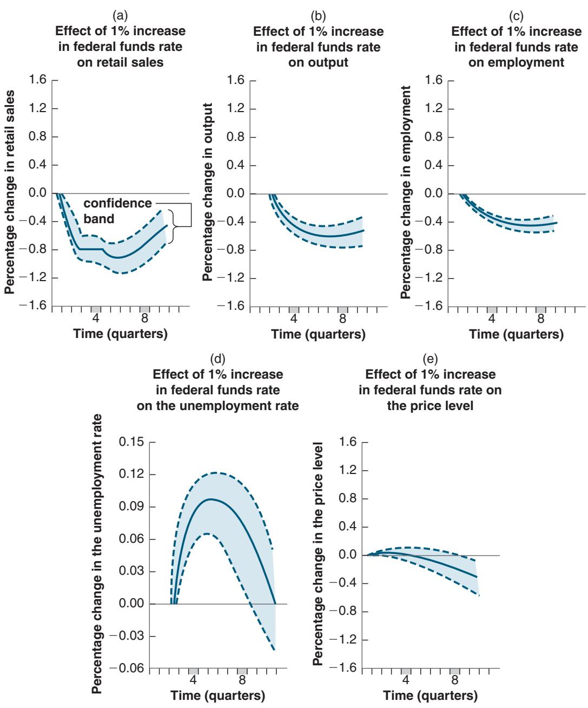

# Deficit Reduction: Good or Bad for Investment?

You may have heard this argument in some form: “Private saving goes either toward financing the budget deficit or financing investment. It does not take a genius to conclude that reducing the budget deficit leaves more saving available for investment, so investment increases.”

This argument sounds convincing. But, as we have seen earlier in the book, it must be wrong. If, for example, deficit reduction is not accompanied by a decrease in the interest rate, then we know that output decreases (see Figure 5-7) and, by implication, so does investment since it depends on output. So what is going on in this case?

Go back to Chapter 3, equation (3.10). There we learned that we can also think of the goods-market equilibrium condition as

$$
\begin{array}{r l r} \text {Investment} & = \text {Private saving} & + \quad \text {Public saving} \\ I & = S & + \quad (T - G) \end{array}
$$

In equilibrium, investment is equal to private saving plus public saving. If public saving is positive, the government is said to be running a budget surplus; if public saving is negative, the government is said to be running a budget deficit. So it is true that given private saving, if the government reduces its deficit—either by increasing taxes or reducing government spending so that T-G goes up—investment must go up: Given S, T-G going up implies that I goes up.

The crucial part of this statement, however, is “given private saving.” The point is that a fiscal contraction affects private saving as well: The contraction leads to lower output and therefore lower income. As consumption goes down by less than income, private saving also goes down. It actually goes down by more than the reduction in the budget deficit, leading to a decrease in investment. In terms of the equation: S decreases by more than T-G increases, and so I decreases. (You may want to do the algebra and convince yourself that saving actually goes down by more than the increase in T-G.)

Does this mean that deficit reduction always decreases investment? The answer is clearly no. We saw this in Figure 5-9. If, when the deficit is reduced, the central bank also decreases the interest rate so as to keep output constant, then investment necessarily goes up. Although output is unchanged, the lower interest rate leads to higher investment.

The moral of this box is clear: Whether deficit reduction leads to an increase in investment is far from automatic. It may or it may not, depending on the response of monetary policy.

will decrease demand, and through the multiplier, decrease output. Thus, the reduction in the deficit will lead to a recession.

The recession can be avoided, however, if monetary policy is also used. If the central bank reduces the interest rate to $\bar { i } ^ { \prime }$ , the equilibrium is given by point $A ^ { \prime \prime }$ with corresponding output $Y ^ { \prime \prime } = Y$ . The combination of both policies thus allows for the reduction in the deficit, but without a recession.

What happens to consumption and investment in this case? What happens to consumption depends on how the deficit is reduced. If the reduction takes the form of a decrease in government spending rather than an increase in taxes, income is unchanged, disposable income is unchanged, and so consumption is unchanged. If the reduction takes the form of an increase in income taxes, then disposable income is lower, and so is consumption. What happens to investment is unambiguous: Unchanged output and a lower interest rate imply higher investment. The relation between deficit reduction and investment is discussed further in the Focus Box “Deficit Reduction: Good or Bad for Investment?”

Such a policy mix was used in the early 1990s. When Bill Clinton was elected president in 1992, one of his priorities was to reduce the budget deficit using a combination of cuts in spending and increases in taxes. He was worried, however, that, by itself, such a fiscal contraction would lead to a decrease in demand and trigger another recession. The right strategy was to combine a fiscal contraction (to get rid of the deficit) with a monetary expansion (to make sure that demand and output remained high). This was the strategy adopted and carried out by Clinton (who was in charge of fiscal policy) and Alan Greenspan (who was in charge of monetary policy). The result of this strategy—and a bit of economic luck—was a steady reduction of the budget deficit (which turned into a budget surplus at the end of the 1990s) and a steady increase in output throughout the rest of the decade.

A similar discussion is taking place today in the euro area but with a twist. Worried about high public debt levels, governments would like to reduce fiscal deficits to decrease debt levels over time, a policy known as fiscal austerity. The problem, however, is that interest rates are already very low, so there is little room for monetary policy to offset the adverse effects of a fiscal contraction on output. This is leading to an intense debate between those who think that fiscal austerity is needed, even if it has adverse effects on output, and those who think that fiscal consolidation should wait until monetary policy can be used to offset its adverse effect on output.

## 5-5 HOW DOES THE IS-LM MODEL FIT THE FACTS?

We have so far ignored dynamics. For example, when looking at the effects of an increase in taxes in Figure 5-6—or the effects of a monetary expansion in Figure 5-7—we made it look as if the economy moved instantaneously from A to A′, as if output went instantaneously from Y to Y′. This is clearly not realistic: The adjustment of output takes time. To capture this time dimension, we need to reintroduce dynamics.

Introducing dynamics formally would be difficult. But, as we did in Chapter 3, we can describe the basic mechanisms in words. Some of the mechanisms will be familiar from Chapter 3, some are new:

■ Consumers are likely to take some time to adjust their consumption following a change in disposable income.

■ Firms are likely to take some time to adjust investment spending following a change in their sales.

■ Firms are likely to take some time to adjust investment spending following a change in the interest rate.

■ Firms are likely to take some time to adjust production following a change in their sales.

So, in response to an increase in taxes, it takes some time for consumption spending to respond to the decrease in disposable income, some more time for production to decrease in response to the decrease in consumption spending, yet more time for investment to decrease in response to lower sales, and so on.

In response to the decrease in the interest rate, it takes some time for investment spending to respond, some more time for production to increase in response to the increase in demand, yet more time for consumption and investment to increase in response to the induced change in output, and so on.

Describing precisely the adjustment process implied by all these sources of dynamics is complicated, but the basic implication is straightforward: Time is needed for output to adjust to changes in fiscal and monetary policy. How much time? This question can be answered only by looking at the data and using econometrics. Figure 5-10 shows the results of such an econometric study, which uses data from the United States from 1960 to 1990.

The study looks at the effects of a decision by the Fed to increase the federal funds rate by 1%. It traces the typical effects of such an increase on a number of macroeconomic variables.

Each panel in Figure 5-10 represents the effects of the change in the interest rate on a given variable: retail sales, output, employment, unemployment, and prices. Each panel plots three lines: the solid line in the center of a band gives the best estimate of the effect of the interest rate change on the variable, and the two dashed lines and tinted space between them represent a confidence band, within which the true value of the effect lies with 60% probability.

■ Figure 5-10(a) shows the effects of an increase in the federal funds rate of 1% on retail sales over time (12 quarters). The percentage change in retail sales is plotted on the vertical axis; time, measured in quarters, is on the horizontal axis.

Focusing on the best estimate—the solid line—we see that the increase in the federal funds rate of 1% leads to a decline in retail sales. The largest decrease in retail sales, - 0.9%, occurs after five quarters.

■ Figure 5-10(b) shows that lower sales lead to lower output. In response to the decrease in sales, firms cut production, but by less than the decrease in sales. This is

## Figure 5-10

## The Empirical Effects of an Increase in the Federal Funds Rate

In the short run, an increase in the federal funds rate leads to a decrease in sales, output, and employment and an increase in unemployment, but it has little effect on the price level.

Source: Lawrence Christiano, Martin Eichenbaum, and Charles Evans, “The Effects of Monetary Policy Shocks: Evidence from the Flow of Funds,” Review of Economics and Statistics, 1996, 78 (February): pp. 16–34.

There is no such thing in econometrics as learning the exact value of a coefficient or the exact effect of one variable on another. Rather, econometrics provides a best estimate (here, the solid line) and a measure of confidence in the estimate (the confidence band).

This explains why monetary policy could not have prevented the 2001 recession

because firms accumulate inventories for some time, so the adjustment of production is smoother and slower than the adjustment of sales. The largest decrease, - 0.7%, is reached after eight quarters.

(see the Focus Box “The US Recession of 2001”). When the Fed started decreasing the federal funds rate at the start of 2001, it was already

In other words, monetary policy works, but with long lags. It takes nearly two years for monetary policy to have its full effect on output.c

too late for these cuts to have much effect that year.

■ Figure 5-10(c) shows that lower output leads to lower employment: As firms cut production, they also cut employment. As with output, the decline in employment is slow and steady, reaching −0.5% after eight quarters. The decline in employment leads to an increase in the unemployment rate, shown in Figure 5-10(d).

■ Figure 5-10(e) looks at the behavior of the price level. Remember, one of the assumptions of the IS-LM model is that the price level is given, and so it does not change in response to changes in demand. Figure 5-10(e) shows that this assumption is not a bad approximation of reality in the short run. The price level is nearly unchanged for the first six quarters or so. Only after the first six quarters does it decline. This gives us a strong hint as to why the IS-LM model becomes less reliable as we look at the medium run: In the medium run, we can no longer assume that the price level is given, and movements in the price level become important.

Figure 5-10 provides two important lessons. First, it gives a sense of the dynamic adjustment of output and other variables to monetary policy.

Second, and more fundamentally, it shows that what we observe in the economy is consistent with the implications of the IS-LM model. This does not prove that the IS-LM model is the right model. It may be that what we observe in the economy is the result of a completely different mechanism, and the fact that the IS-LM model fits well is a coincidence. But this seems unlikely. The IS-LM model looks like a solid basis on which to build when looking at movements in activity in the short run. Later on, we shall extend the model to look at the role of expectations (Chapters 14 to 16) and the implications of openness in goods and financial markets (Chapters 17 to 20). But we must first understand what determines output in the medium run. This is the topic of Chapters 7 to 9.

## SUMMARY

The IS-LM model characterizes the implications of equilibrium in both the goods and financial markets.

The IS relation and the IS curve show the combinations of the interest rate and the level of output that are consistent with equilibrium in the goods market. An increase in the interest rate leads to a decline in output. Consequently, the IS curve is downward sloping.

The LM relation and the LM curve show the combinations of the interest rate and the level of output consistent with equilibrium in financial markets. Under the assumption that the central bank chooses the interest rate, the LM curve is a horizontal line at the interest rate chosen by the central bank.

A fiscal expansion shifts the IS curve to the right, leading to an increase in output. A fiscal contraction shifts the IS curve to the left, leading to a decrease in output.

A monetary expansion shifts the LM curve down, leading to a decrease in the interest rate and an increase in output. A monetary contraction shifts the LM curve up, leading to an increase in the interest rate and a decrease in output.

The combination of monetary and fiscal policies is known as the monetary-fiscal policy mix, or simply the policy mix. Sometimes monetary and fiscal policy are used in the same direction, sometimes in opposite directions. Together, a fiscal contraction and a monetary expansion can, for example, achieve a decrease in the budget deficit while avoiding a decrease in output.

The IS-LM model appears to describe well the behavior of the economy in the short run. In particular, the effects of monetary policy are similar to those implied by the IS-LM model once dynamics are introduced in the model. An increase in the interest rate due to a monetary contraction leads to a decrease in output, with the maximum effect taking place after about eight quarters.
