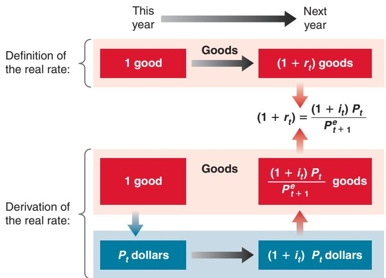
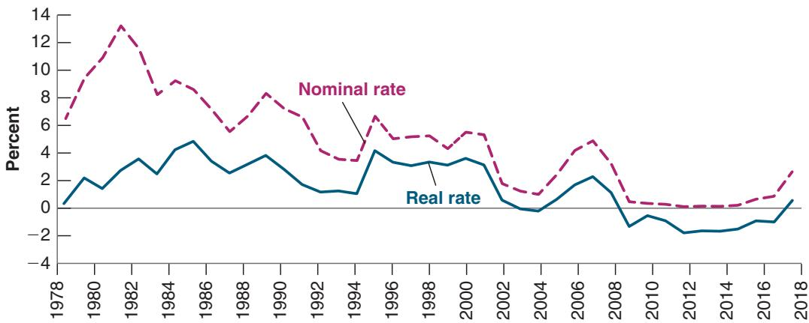
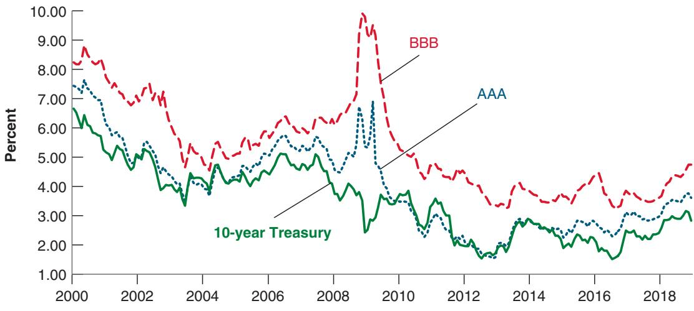
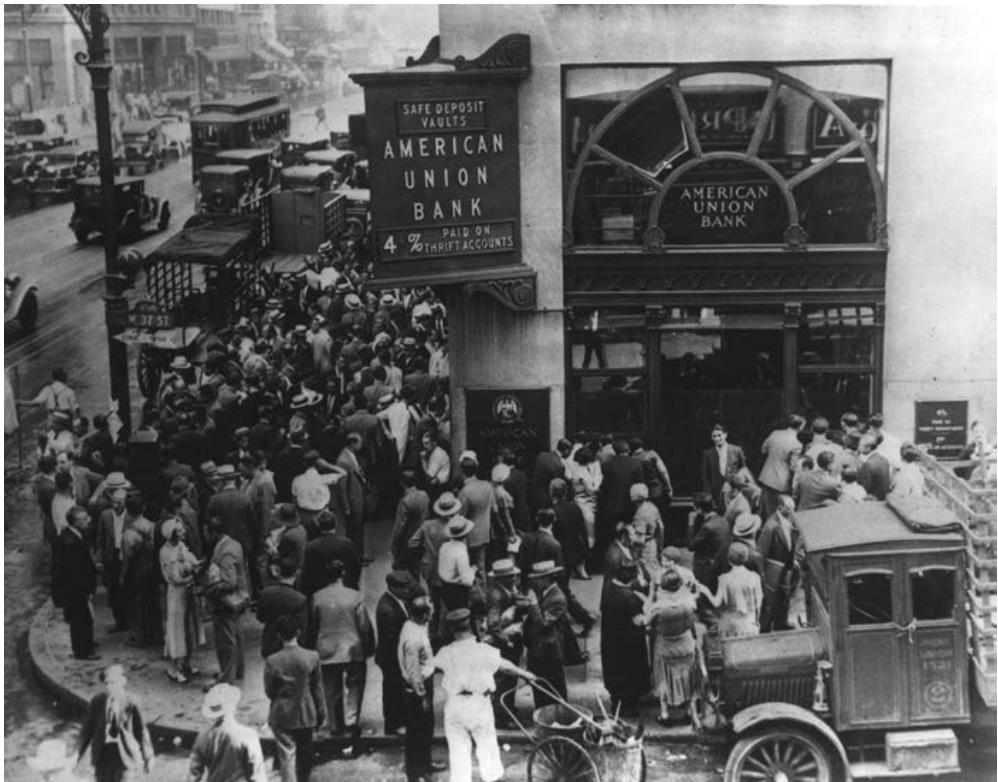
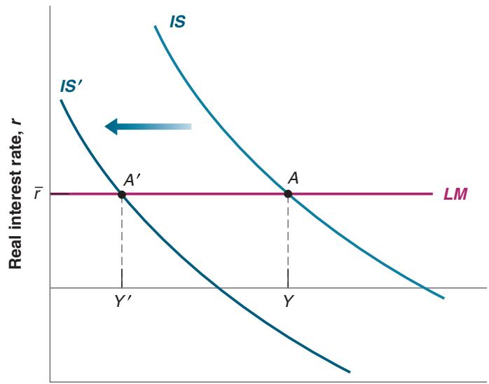

# Financial Markets II: The Extended IS-LM Model

Until now, we assumed that there were only two financial assets—money andbonds—and just one interest rate—the rate on bonds—determined by monetarypolicy. As you know, the financial system is vastly more complex than that. There bonds—and just one interest rate—the rate on bonds—determined by monetary policy. As you know, the financial system is vastly more complex than that. There are many interest rates and many financial institutions. And the financial system plays a major role in the economy: In the United States, financial activity accounts for 7% of GDP, a large number.

Before the 2008 crisis, the importance of the financial system was downplayed in macroeconomics. All interest rates were often assumed to move with the rate determined by monetary policy, so one could just focus on the rate determined by monetary policy and assume that other rates would move with it. The crisis made painfully clear that this assumption was too simplistic and that the financial system can be subject to crises with major macroeconomic implications. This chapter looks more closely at the role of the financial system and its macroeconomic implications, and then gives an account of what happened during the Great Financial Crisis.

This chapter cannot replace a text in finance. But it will tell you enough to understand why the financial system is b central to macroeconomics.

Section 6-1 introduces the distinction between nominal and real interest rates.

Section 6-2 introduces the notion of risk and how it affects the interest rates charged to different borrowers.

Section 6-3 looks at the role of financial intermediaries.

Section 6-4 extends the IS-LM model to integrate what we have just learned.

Section 6-5 then uses this extended model to describe the recent financial crisis and its macroeconomic implications.

If you remember one basic message from this chapter, it should be: The financial system matters, and financial crises can have large macroeconomic effects.

## 6-1 NOMINAL VERSUS REAL INTEREST RATES

In January 1980, the one-year US T-bill rate—the interest rate on one-year government bonds—was 10.9%. In January 2006, the rate was only 4.2%. It was clearly much cheaper to borrow in 2006 than it was in 1981.

Or was it? In January 1980, expected inflation was around 9.5%. In January 2006, expected inflation was around 2.5%. This would seem relevant. The interest rate tells us how many dollars we shall have to pay in the future in exchange for having one more dollar today. But when we borrow, what we really want to know is how many goods we will have to give up in the future in exchange for the goods we get today. Likewise, when we lend, we want to know how many goods—not how many dollars—we will get in the future for the goods we give up today. The presence of inflation makes this distinction important. What is the point of receiving high interest payments in the future if inflation between now and then is so high that, with the return we shall receive then, we shall be unable to buy more goods?

This is where the distinction between nominal interest rates and real interest rates comes in.

■ Interest rates expressed in terms of dollars (or, more generally, in units of the national currency) are called nominal interest rates. The interest rates printed in the financial pages of newspapers are typically nominal interest rates. For example, when we say that the one-year T-bill rate is 4.2%, we mean that for every dollar the government borrows by issuing one-year T-bills, it promises to pay 1.042 dollars a year from now. More generally, if the nominal interest rate for year t is $i _ { t } ,$ borrowing 1 dollar this year requires you to pay $1 + i _ { t }$ dollars next year. (I shall use interchangeably “this year” for “today,” and “next year” for “one year from today.”)

■ Interest rates expressed in terms of a basket of goods are called real interest rates. If we denote the real interest rate for year t by $r _ { t } ,$ then, by definition, borrowing the equivalent of one basket of goods this year requires you to pay the equivalent of $\mathrm { ~ 1 ~ + ~ } r _ { t }$ baskets of goods next year.

What is the relation between nominal and real interest rates? How do we go from nominal interest rates—which we do observe—to real interest rates—which we typically do not observe? The intuitive answer: We must adjust the nominal interest rate to take into account expected inflation.

Let’s go through the step-by-step derivation.

Assume there is only one good in the economy, bread (we shall add jam and other goods later). Denote the one-year nominal interest rate, in terms of dollars, by $i _ { t } .$ . If you borrow 1 dollar this year, you will have to repay $( 1 + i _ { t } )$ dollars next year. But what you really want to know is: If you borrow enough to eat one more pound of bread this year, how much will you have to repay, in terms of pounds of bread, next year?

Figure 6-1 helps us derive the answer. The top part repeats the definition of the one-year real interest rate. The bottom part shows how we can derive the one-year real interest rate from information about the one-year nominal interest rate and the price of bread.

■ Start with the downward pointing arrow in the lower left of Figure 6-1. Suppose you want to eat one more pound of bread this year. If the price of a pound of bread this year is $P _ { t }$ dollars, to eat one more pound of bread you must borrow $P _ { t }$ dollars.

  
Figure 6-1  
Definition and Derivation of the Real Interest Rate

■ If $i _ { t }$ is the one-year nominal interest rate—the interest rate in terms of dollars—and you borrow $P _ { t }$ dollars, you will have to repay $( 1 + i _ { t } ) P _ { t }$ dollars next year. This is represented by the arrow from left to right at the bottom of Figure $^ { 6 - 1 }$

■ What you care about, however, is not dollars but pounds of bread. Thus, the last step involves converting dollars back to pounds of bread next year. Let $P _ { t + 1 } ^ { e }$ be the price of bread you expect to pay next year. (The superscript e indicates that this is an expectation; you do not know yet what the price of bread will be next year.) How much you expect to repay next year, in terms of pounds of bread, is therefore equal to $( 1 + i _ { t } ) P _ { t }$ (the number of dollars you have to repay next year) divided by $P _ { t + 1 } ^ { e }$ (the price of bread in terms of dollars expected for next year), so $( 1 + i _ { t } ) P _ { t } / P _ { t + 1 } ^ { e }$ . This is represented by the arrow pointing up in the lower right of Figure 6-1.

If you have to repay \$10 next year and you expect the price of bread to be \$2 a loaf, you expect to have to repay the equivalent of $1 0 / 2 = 5$ loaves of bread next year. This is why we divide the dollar amount $( 1 + i _ { t } ) P _ { t }$ by the expected price of bread next year, $P _ { t + 1 } ^ { e }$

Putting together what you see in the top and bottom parts of Figure 6-1, it follows that the one-year real interest rate, $r _ { t } ,$ is given by:

$$
1 + r _ {t} = (1 + i _ {t}) \frac {P _ {t}}{P _ {t + 1} ^ {e}}\tag{6.1}
$$

This relation looks intimidating. Two simple manipulations make it look friendlier:

■ Denote expected inflation between t and t+1 by $\pi _ { t + 1 } ^ { e }$ . Given that there is only one good—bread—the expected rate of inflation equals the expected change in the dollar price of bread between this year and next year, divided by the dollar price of bread this year:

Add 1 to both sides in equation (6.2):

$$
1 + \pi_ {t + 1} ^ {e} = 1 + \frac {(P _ {t + 1} ^ {e})}{P _ {t}}\tag{\(P_{t})\}
$$

$$
\pi_ {t + 1} ^ {e} \equiv \frac {(P _ {t + 1} ^ {e} - P _ {t})}{P _ {t}}\tag{6.2}
$$

Reorganize:

$$
1 + \pi_ {t + 1} ^ {e} = \frac {P _ {t + 1} ^ {e}}{P _ {t}}
$$

Using equation (6.2), rewrite $P _ { t } / P _ { t + 1 } ^ { e }$ in equation (6.1) as $1 / ( 1 + \pi _ { t + 1 } ^ { e } )$ . Replace in equation (6.1) to get

Take the inverse on both sides:

$$
(1 + r _ {t}) = \frac {1 + i _ {t}}{1 + \pi_ {t + 1} ^ {e}}\tag{6.3}
$$

$$
\frac {1}{1 + \pi_ {t + 1} ^ {e}} = \frac {P _ {t}}{P _ {t + 1} ^ {e}}
$$

One plus the real interest rate equals the ratio of one plus the nominal interest rate, divided by one plus the expected rate of inflation.

Replace in equation (6.1) to get equation (6.3)

See Proposition 6 in Appendix 2 at the end of the book. Suppose $i = 1 0 \%$ and

$$
\pi^{\mathrm{e}} = 5\%
$$

tion in equation (6.3) gives $r _ { t } = 4 . 8 \%$ . The approximation given by equation (6.4) gives 5%—close enough. The approximation can be quite bad, however, when i and $\pi ^ { e }$ are high. If, for example, $j = 1 0 0 \%$ and $\pi ^ { e } = 8 0 \%$ , the exact relation gives $r = 1 1 \% ,$ but the approximation gives $r = 2 0 \% { - \mathsf { a } }$ big difference.

■ Equation (6.3) gives us the exact relation of the real interest rate to the nominal interest rate and expected inflation. However, when both the nominal interest rate and expected inflation are not too large—say, less than 10% per year—a close approximation (denoted by ≈) to this equation is given by

$$
r _ {t} \approx i _ {t} - \pi_ {t + 1} ^ {e}\tag{6.4}
$$

Make sure you remember equation (6.4). It says that the real interest rate is (approximately) equal to the nominal interest rate minus expected inflation. (In the rest of the book, I shall often treat the relation in equation (6.4) as if it were an equality. Remember, however, that it is only an approximation.)

Note some of the implications of equation (6.4):

■ When expected inflation equals zero, the nominal and the real interest rates are equal.

■ Because expected inflation is typically positive, the real interest rate is typically lower than the nominal interest rate.

■ For a given nominal interest rate, the higher the expected rate of inflation, the lower the real interest rate.

The case where expected inflation happens to be equal to the nominal interest rate is worth looking at more closely. Suppose the nominal interest rate and expected inflation both equal 10%, and you are the borrower. For every dollar you borrow this year, you will have to repay 1.10 dollars next year. This looks expensive. But dollars will be worth 10% less in terms of bread next year. So, if you borrow the equivalent of one pound of bread, you will have to repay the equivalent of one pound of bread next year. The real cost of borrowing—the real interest rate—is equal to zero. Now suppose you are the lender: For every dollar you lend this year, you will receive 1.10 dollars next year. This looks attractive, but dollars next year will be worth 10% less in terms of bread. If you lend the equivalent of one pound of bread this year, you will get the equivalent of one pound of bread next year: Despite the 10% nominal interest rate, the real interest rate is equal to zero.

We have assumed so far that there is only one good—bread—but what we have done generalizes easily to many goods. All we need to do is substitute the price level—the price of a basket of goods—for the price of bread in equation (6.1) or (6.3). If we use the consumer price index (CPI) to measure the price level, the real interest rate tells us how much consumption we must give up next year to consume more today.

## Nominal and Real Interest Rates in the United States since 1978

Let us return to the question at the start of this section. We can now restate it as follows: Was the real interest rate lower in 2006 than it was in 1981? More generally, what has happened to the real interest rate in the United States over the past four decades?

The answer is shown in Figure 6-2, which plots both nominal and real interest rates since 1978. For each year, the nominal interest rate is the one-year T-bill rate at the beginning of the year. To construct the real interest rate, we need a measure of expected inflation—more precisely, the rate of inflation expected as of the beginning of each year. We use, for each year, the forecast of inflation, using the GDP deflator, for that year published at the end of the previous year by the OECD. For example, the forecast of inflation used to construct the real interest rate for 2006 is 2.5%, the 2006 inflation forecast published by the OECD in November 2005.

Note that the real interest rate $( i \mathrm { ~ - ~ } \pi ^ { e } )$ is based on expected inflation. If actual inflation turns out to be different from expected inflation, the realized real interest rate $( i - \pi )$ will be different from the real interest rate. For this reason, the real interest rate is sometimes called the ex-ante real interest rate (ex-ante means “before the fact”; here, before inflation is known). The realized real interest rate is called the ex-post real interest rate (ex-post means “after the fact”; here, after inflation is known).

  
Figure 6-2  
Nominal and Real One-Year T-Bill Rates in the United States, since 1978  
The nominal rate has declined considerably since the early 1980s, but because expected inflation has declined as well, the real rate has declined much less than the nominal rate.  
Source: FRED: Nominal interest rate is the one-year Treasury bill in December of the previous year: Series TB1YR (Series TB6MS in December 2001, 2002, 2003, and 2004). Expected inflation is the 12-month forecast of inflation, using the GDP deflator, from the November OECD Economic Outlook from the previous year.

Figure 6-2 shows the importance of adjusting for inflation. Although the nominal interest rate was much lower in 2006 than it was in 1981, the real interest rate was actually higher in 2006 (about 1.7%) than it was in 1981 (about 1.4%). Put another way, despite the large decline in nominal interest rates, borrowing was actually more expensive in 2006 than it was 1981. This is because inflation (and with it, expected inflation) has steadily declined since the early 1980s.

## Nominal and Real Interest Rates: The Zero Lower Bound and Deflation

Which interest rate should enter the IS relation? Clearly, in thinking about consumption or investment decisions, what matters to people or to firms is the real interest rate, the rate in terms of goods. This has a straightforward implication for monetary policy. Although the central bank chooses the nominal rate (as we saw in Chapter 4), it cares about the real interest rate because this is the rate that affects spending decisions. To set the real interest rate it wants, it thus has to take into account expected inflation.

If the central bank wants to set the real interest rate equal to r, it must choose the nominal rate, i, so that, given expected inflation, $\pi ^ { e }$ , the real interest rate, $r = i - \pi ^ { e } ,$ , is at the desired level. For example, if it wants the real interest rate to be 4% and expected inflation is 2%, it will set the nominal interest rate, i, at 6%.

But, as we discussed in Chapter 4 in the context of the liquidity trap, the zero lower bound means that the nominal interest rate cannot be negative; otherwise, people would not want to hold bonds. This implies that the real interest rate cannot be lower than the negative of the rate of inflation. If expected inflation is 2%, for example, then the lowest the real interest rate can be is 0%-2% = -2%. So long as expected inflation is positive, this allows for negative real interest rates. But if expected inflation turns negative, if people anticipate deflation, then the lower bound on the real rate becomes positive and can turn out to be high. If, for example, expected deflation is 2%, the real rate cannot be less than 2%. This may not be low enough to increase the demand for goods by much, and the economy may remain in recession. As we shall see in Section 6-5, the zero lower bound turned out to be a serious concern during the 2008 crisis.

## 6-2 RISK AND RISK PREMIA

Until now, we assumed there was only one type of bond. But bonds differ in several ways. They differ in terms of maturity—i.e., the length of time over which they promise payments. For example, 1-year government bonds promise one payment a year hence; 10-year government bonds promise a stream of payments over 10 years. They also differ in terms of risk. Some bonds are nearly riskless; the probability that the borrower will not repay is negligible. Some bonds instead are risky, with a nonnegligible probability that the borrower will not be able or willing to repay. In this chapter, we shall focus on risk, leaving aside the issue of maturity.

Neither you nor I can borrow at the federal funds rate set by the Fed. Nor can we borrow at the same rate as the US government. There is a good reason for this. Whoever might be lending to us knows that there is a chance that we may not be able to repay. The same is true for firms that issue bonds. Some firms present little risk and others more. To compensate for the risk, bond holders require a risk premium.

What determines this risk premium?

The first factor is the probability of default itself. The higher this probability, the higher the interest rate investors will ask for. More formally, let i be the nominal interest rate on a riskless bond, and i + x be the nominal interest rate on a risky bond, which has probability, p, of defaulting. Call x the risk premium. Suppose investors are risk neutral, so they want to have the same expected return on a riskless and a risky bond. For the expected return on both, the following relation must hold:

$$
(1 + i) = (1 - p) (1 + i + x) + p (0)
$$

The left-hand side gives the return on the riskless bond. The right-hand side gives the expected return on the risky bond. With probability 11 - p2, there is no default and the bond will pay 11 + i + x2. With probability p, there is default and the bond will pay nothing. Reorganizing gives:

$$
x = (1 + i) p / (1 - p)
$$

For small values of i and p, a good approximation to this formula is simply x = p.

So, for example, if the interest rate on a riskless bond is 4% and the probability of default on the risky bond is 2%, then the risk premium required to give the same expected rate of return as on the riskless bond is 2.1%.

Different rating agencies use different rating systems. The rating scale used here is that of Standard and Poor’s and ranges from AAA (nearly riskless) and BBB to C (bonds

■ The second factor is the degree of risk aversion of the bond holders. Even if the expected return on the risky bond is the same as on a riskless bond, the risk itself will make them reluctant to hold the risky bond. Thus, they will ask for an even higher premium to compensate for the risk, so x will be higher than the value we just derived. How much higher will depend on bond holders’ degree of risk aversion. And if they become more risk averse, the risk premium will go up even if the probability of default has not changed.

To show why this matters, Figure 6-3 plots the interest rates on three types of bonds since 2000: US government bonds, which are considered nearly riskless; and corporate bonds rated as safe (AAA) and less safe (BBB) by ratings agencies.

Yields on 10-Year US Government Treasury, AAA, and BBB Corporate Bonds, since 2000 In September 2008, the financial crisis led to a sharp increase in the rates at which firms could borrow. Source: FRED: Series DGS10; For AAA and BBB corporate bonds, Bank of America Merrill Lynch Series BAMLC0A4CBBB, BAMLC0A1CAAAEY

  
Figure 6-3

Note three things about Figure 6-3. First, the rate on even the most highly rated (AAA) corporate bonds is higher than the rate on US government bonds, by a premium of about 1% on average. The US government can borrow at cheaper rates than US corporations. Second, the rate on lower-rated (BBB) corporate bonds is higher than the rate on the most highly rated bonds by a premium often exceeding 2%. Third, note what happened during the financial crisis in 2008 and 2009. Although the rate on government bonds decreased, reflecting the Fed’s decision to decrease the policy rate, the interest rate on lower-rated bonds increased sharply, reaching 10% at the height of the crisis. Put another way, despite the fact that the Fed was lowering the policy rate to zero, the rate at which lower-rated firms could borrow became much higher, making it extremely unattractive for these firms to invest. In terms of the IS-LM model, this shows why we cannot assume that the policy rate enters the IS relation. The rate at which many borrowers can borrow may be much higher than the policy rate.

To summarize: In the last two sections, I have introduced the concepts of real versus nominal rates and the concept of a risk premium. In Section 6-4, we shall extend the IS-LM model to take both concepts into account. Before we do, let’s turn to the role of financial intermediaries.

## 6-3 THE ROLE OF FINANCIAL INTERMEDIARIES

Until now, we have looked at direct finance, that is, borrowing directly by the ultimate borrowers from the ultimate lenders. In fact, much of the borrowing and lending takes place through financial intermediaries, which are financial institutions that receive

Bank Assets, Capital, and Liabilities

Because it grew in the “shadow” of banks, the nonbank part of the financial system is called shadow banking. But it is now large and no longer in the shadows.

One wishes that the balance sheets of banks were that simple and transparent. Had that been the case, the crisis would have been much more limited.

<table><tr><td>Assets 100</td><td>Liabilities 80Capital 20</td></tr></table>

funds from some investors and then lend these funds to others. Among these institutions are banks, but also, increasingly, “nonbanks,” such as mortgage companies, money market funds, and hedge funds.c

Financial intermediaries perform an important function. They develop expertise about specific borrowers and can tailor lending to their specific needs. In normal times, they function smoothly. They borrow and lend, charging a slightly higher interest rate than the rate at which they borrow so as to make a profit. Once in a while, however, they run into trouble, and this is what happened in the Great Financial Crisis. To understand why, let’s first focus on banks and start, in Figure 6-4, with a much simplified bank balance sheet (the discussion applies to nonbanks as well and we shall return to them later).

Consider a bank that has assets of 100, liabilities of 80, and capital of 20. You can think of the owners of the bank as having directly invested 20 of their own funds, borrowed another 80 from other investors, and bought various assets for 100. The liabilities may be checkable deposits, interest-paying deposits, or borrowing from investors and other banks. The assets may be reserves (central bank money), loans to consumers, loans to firms, loans to other banks, mortgages, government bonds, or other forms of securities.

In drawing a bank balance sheet in Chapter 4, we ignored capital (and focused instead on the distinction between reserves and other assets). Ignoring capital was unimportant there. But it is important here. Let’s see why.

## The Choice of Leverage

Start with two definitions. The capital ratio of a bank is defined as the ratio of its capital to its assets, so, for the bank in Figure $6 { - } 4 , 2 0 / 1 0 0 = 2 0 \%$ . The leverage ratio of a bank is defined as the ratio of assets to capital, so as the inverse of the capital ratio, in this case $1 0 0 / 2 0 = 5 $ . It is traditional to think in terms of leverage and to focus on the leverage ratio. I shall follow tradition. But given the simple relation between the two, the discussion could equivalently be in terms of the capital ratio.

In thinking about what leverage ratio it should choose, the bank has to balance two factors. A higher leverage ratio implies a higher expected profit rate. But it also implies a higher risk of bankruptcy. Let’s look at each factor in turn.

What would be the expected profit per unit of capital if the bank chose to have zero leverage? If the bank chose to have full leverage (no capital)? (The second question is a trick question.)

Suppose the expected rate of return on assets is 5% and the expected rate of return on liabilities is 4%. Then, the expected profit of the bank is equal to $( 1 0 0 \times 5 \% - 8 0 \times 4 \% ) = 1 . 8$ . Given that the owners of the bank have put in 20 of their own funds, the expected profit per unit of capital is equal to $1 . 8 / 2 0 = 9 \% .$ Now suppose the owners of the bank decided instead to put in only 10 of their own funds and borrowed 90. The capital ratio of the bank would then be equal to $1 0 / 1 0 0 = 1 0 \%$ , its leverage would be 10, and its expected profit would be equal to $( 1 0 0 \times 5 \% - 9 0 \times 4 \% ) = 1 . 4$ . Its expected profit per unit of capital would be 1.4>10 = 14%, so substantially higher. By increasing its leverage, and decreasing its own funds, the bank would increase its expected profit per unit of capital.

■ Why shouldn’t the bank choose a high leverage ratio? Because higher leverage also implies a higher risk that the value of the assets becomes less than the value of liabilities, in turn implying a higher risk of insolvency. For the bank in Figure 6-4, its assets can decrease in value to 80 without the bank becoming insolvent and going bankrupt. But if it were to choose a leverage ratio of 10, any decrease in the value of the assets below 90 would lead the bank to become insolvent. The risk of bankruptcy would be much higher.

A bank is solvent if the value of its assets exceeds the value of its liabilities. It is b insolvent otherwise.

Thus, the bank must choose a leverage ratio that takes into account both factors. Too low a leverage ratio means less profit. Too high a leverage ratio means too high a risk of bankruptcy.

## Leverage and Lending

Suppose a bank has chosen its preferred leverage ratio, and suppose that the value of its assets declines. For example, the assets of the bank in Figure 6-4 decrease in value from 100 to 90, say as a result of bad loans. The capital of the bank is now down to $9 0 \mathrm { ~ - ~ } 8 0 = 1 0$ . Its leverage ratio increases from 5 to 9. The bank is still solvent, but it is clearly more at risk than it was before. What will it want to do? It may want to increase capital, for example, by asking other investors to provide funds. But it is also likely to want to decrease the size of its balance sheet. For example, if it can call back some loans for an amount of 40 and thus reduce its assets to $9 0 - 4 0 = 5 0 $ , and then use the 40 to decrease its liabilities to $8 0 - 4 0 = 4 0$ , its capital ratio will be $1 0 / 5 0 = 2 0 \%$ , back to its original value. But although the capital ratio of the bank is back to its desired level, the effect is a sharp decrease in the bank’s lending.

Let’s go one step further. Suppose that, starting from the balance sheet in Figure 6-4, the decline in the value of the assets is large, say down from 100 to 70. The bank will become insolvent and go bankrupt. The borrowers that depended on the bank may have a hard time finding another lender.

Why is this relevant to us? Because whether banks remain solvent but cut lending or become insolvent, the decrease in lending that this triggers may well have major adverse macroeconomic effects. Again, let’s defer a discussion of macroeconomic implications to the next section. And before we get there, let’s explore things further.

## Liquidity

We looked at the case where bank assets declined in value and saw that this led banks to reduce lending. Now consider a case in which investors are unsure of the value of the assets of the bank, and believe, right or wrong, that the value of the assets may have come down. Then, leverage can have disastrous effects. Let’s see why.

■ If investors have doubts about the value of the bank assets, the safe thing for them to do is to take their funds out of the bank. This creates serious problems for the bank, which needs to come up with the funds to repay the investors. The loans it has made cannot easily be called back. Typically, the borrowers no longer have the funds at the ready; they have used them to pay bills, buy a car, purchase a machine, and such. Selling the loans to another bank is likely to be difficult as well. Assessing the value of the loans is difficult for the other banks, which do not have the specific knowledge about the borrowers the original bank has.

■ In general, the harder it is for others to assess the value of a bank’s assets, the more likely the bank is to be unable to sell them or to have to do it at fire sale prices, prices far below the true value of the loans. Such sales make matters worse for the bank. As the value of the assets decreases, the bank may well become insolvent and go bankrupt. In turn, as investors realize this may happen, they are more likely to want to get their funds out, forcing more fire sales, and making the problem worse. Note that this can happen even if the initial doubts of investors were totally unfounded, even if the value of the bank assets had not decreased in the first place. The decision by

Take a healthy bank, that is, a bank with a portfolio of good loans. Suppose rumors start that the bank is not doing well and some loans will not be repaid. Believing that the bank may fail, people with deposits at the bank will want to close their accounts and withdraw cash. If enough people do so, the bank will run out of funds. Given that the loans cannot easily be called back, the bank will not be able to satisfy the demand for cash, and it will have to close.

Conclusion: Fear that a bank will close can actually cause it to close—even if all its loans were good in the first place. The financial history of the United States up to the 1930s is full of such bank runs. One bank fails for the right reason (because it has made bad loans). This causes depositors at other banks to panic and withdraw money from their banks, forcing them to close. You have probably seen It’s a Wonderful Life, a classic movie with James Stewart that runs on TV every year around Christmas. After another bank in Stewart’s town fails, depositors at the savings and loan he manages get scared and want to withdraw their money, too. Stewart successfully persuades them this is not a good idea. It’s a Wonderful Life has a happy ending. But in real life, most bank runs didn’t end well. (For another famous movie bank run, and how it can start, watch Mary Poppins.)

What can be done to avoid bank runs?

One potential solution is called narrow banking. Narrow banking would restrict banks to holding liquid and safe government bonds, like T-bills. Loans would have to be made by financial intermediaries other than banks. This would likely eliminate bank runs. Some recent changes in US regulation have gone in that direction, restricting banks that rely on deposits from engaging in some financial operations, but they stop far short of imposing narrow banking. One worry with narrow banking is that, although it might indeed eliminate runs on banks, the problem might migrate to shadow banking and create runs there.

In practice, the problem has been tackled in two ways: First, by trying to limit bank runs in the first place; second, if bank runs happen nevertheless, by having the central bank provide funds to banks so that they do not have to engage in fire sales.

To limit bank runs, governments in most advanced countries have put in place a system of deposit insurance. The United States, for example, introduced federal deposit insurance in 1934. The US government now insures each checkable deposit account up to a ceiling, which, since 2008, is \$250,000. As a result, there is no reason for depositors to run and withdraw their money.

Deposit insurance leads, however, to problems of its own. Depositors, who do not have to worry about their deposits, no longer look at the activities of the banks in which they have their accounts. Banks may then misbehave, by making loans they wouldn’t have made in the absence of deposit insurance. They may take too much risk, take too much leverage.

And as the 2008–2009 crisis unfortunately showed, deposit insurance is no longer enough. First, banks rely on sources of funds other than deposits, often borrowing overnight from other financial institutions and investors. These other funds are not insured, and during the crisis there was in effect a run on many banks—not from the traditional depositors but from wholesale funders. Second, financial institutions other than banks can be subject to the same problem, with investors wanting their funds back quickly and with assets difficult to dispose of or sell quickly.

So, to the extent that runs cannot be fully prevented, central banks have put in place programs to provide funds to banks in case they face a run. In such circumstances, the central bank will agree to lend to a bank against the value of the bank’s assets so that the bank does not have to sell its assets and fire sales can be avoided. Access to such a provision was traditionally reserved for banks. But the recent crisis showed that other financial institutions may be subject to runs and may also need access.

Just like deposit insurance, the central bank’s liquidity provision (as it is called) is not a perfect solution. In practice, central banks may face a difficult choice. Assessing which financial institutions beyond banks can have access to the liquidity provision is delicate. Assessing the value of the assets, and thus deciding how much can be lent to a financial institution, can also be difficult. The central bank would not want to provide funds to an institution that is actually insolvent; but, in the middle of a financial crisis, the difference between insolvency and illiquidity may be difficult to establish.

To watch the bank run in It’s a Wonderful Life, go to www. youtube.com/watch?v=lbwjS9iJ2Sw

To watch the bank run in Mary Poppins, go to www. youtube.com/watch?v=C6DGs3qjRwQ

investors to ask for their funds, and the fire sales this triggers, can make the bank insolvent even if it was fully solvent to start.

■ Note also that the problem is worse if investors can ask for their funds on short notice. This is clearly the case for checkable deposits at banks. Checkable deposits are also called demand deposits, precisely because people can ask for their funds on demand. The fact that banks’ assets are largely composed of loans and their liabilities are largely composed of demand deposits makes them particularly exposed to the risk of runs, and the history of the financial system is full of examples of bank runs, when worries about banks’ assets led to runs on banks, forcing them to close. Bank runs were a major feature of the Great Depression, and as discussed in the Focus Box “Bank Runs,” central banks have taken measures to limit them. As we shall see later in this chapter, however, this has not fully taken care of the problem, and a modern form of runs—not on banks but on other financial intermediaries—played a major role in the Great Financial Crisis.

We can summarize what we have just learned in terms of the liquidity of assets and liabilities. The lower the liquidity of the assets (i.e., the more difficult they are to sell), the higher the risk of fire sales and the risk that the bank becomes insolvent and goes bankrupt. The higher the liquidity of the liabilities (i.e., the easier it is for investors to get their funds at short notice), the higher the risk of fire sales as well, and the risk that the bank becomes insolvent and goes bankrupt. Again, the reason this is relevant for us is that such bankruptcies, if they occur, may well have major macroeconomic consequences. This is the topic of the next section.

## 6-4 EXTENDING THE IS-LM MODEL

The IS-LM model introduced in Chapter 5 had only one interest rate. It was determined by the central bank, and it entered spending decisions. It appeared both in the LM relation and the IS relation. The first three sections of this chapter showed that, although this was a useful first step, reality is substantially more complex, and we must extend our initial model.

First, we must distinguish between the nominal interest rate and the real interest rate. Second, we must distinguish the policy rate set by the central bank and the interest rates faced by borrowers. As we saw, these interest rates depend both on the risk associated with borrowers and on the state of health of financial intermediaries. The higher the risks, or the higher the leverage ratio of intermediaries, the higher the interest

The way the central bank controls the nominal interest rate is by adjusting the money supply. (If you need a refresher, go back to Chapter 4.)

rate borrowers have to pay. We capture those two aspects by rewriting the IS-LM in the following way:

$$
\begin{array}{l} I S \text {relation:} Y = C (Y - T) + I (Y, i - \pi^ {e} + x) + G \\ L M \text {relation:} i = \bar {i} \end{array}
$$

The LM relation remains the same. The central bank still controls the nominal interest rate. But there are two changes to the IS relation, the presence of expected inflation, $\pi ^ { e } .$ , and the risk premium, x.

■ The expected inflation term reflects the fact that spending decisions depend, all other things equal, on the real interest rate, $r = i - \pi ^ { e }$ , rather than on the nominal rate.

■ The risk premium, x, captures, in a simple way, the factors we discussed previously: probability of default and level of risk aversion. It may be high because lenders perceive a higher risk that borrowers will not repay or because they are more risk averse. Or it may be high because financial intermediaries are reducing lending, because of worries about solvency or liquidity.

The two equations make clear that the interest rate in the LM equation, i, is no longer the same as the interest rate in the IS relation, $r + x .$ . Let’s call the rate in the LM equation the (nominal) policy rate (because it is determined by monetary policy), and that of the IS equation the (real) borrowing rate (because it is the rate at which consumers and firms can borrow).

One simplification: As we discussed in Section 6-2, although the central bank formally chooses the nominal interest rate, it can choose it in such a way as to achieve the real interest rate it wants (this ignores the issue of the zero lower bound to which we shall return). Thus, we can think of the central banks as choosing the real policy rate directly and rewrite the two equations as:

$$
\text {IS relation:} \quad Y = C (Y - T) + I (Y, r + x) + G
$$

$$
\text {LM relation:} r = \bar {r}\tag{6.5}
$$

(6.6)

The central bank chooses the real policy rate, r. But the real interest rate relevant for spending decisions is the borrowing rate, $r + x$ , which depends not only on the policy rate but also on the risk premium.

Figure 6-5

Financial Shocks and Output

An increase in the risk premium x leads to a shift of the IS curve to the left and a decrease in equilibrium output.

  
Output, Y

## Financial Shocks, Monetary Policy, and Output

The two equations are represented in Figure 6-5. The policy rate—the real interest rate implicitly chosen by the central bank—is measured on the vertical axis and output on the horizontal axis. The IS curve is drawn for given values of G, T, and x. All other things equal, an increase in the real policy rate decreases spending and in turn output: The IS curve is downward sloping. The LM is a horizontal line at the policy rate. Equilibrium is given by point A, with associated level of output Y.

## Financial Shocks and Policies

Suppose that, for some reason, x increases. There are many potential scenarios here. This may be, for example, because investors have become more risk averse and require a higher risk premium, or because one financial institution has gone bankrupt and investors have become worried about the health of other banks, starting a run, forcing these other banks to reduce lending. In Figure 6-5, the IS curve shifts to the left. At the same policy rate r, the borrowing rate, $r + x ,$ increases, leading to a decrease in demand and output. The new equilibrium is at point A¿. Problems in the financial system lead to a recession and a financial crisis becomes a macroeconomic crisis.

What can policy do? As explained in Chapter 5, fiscal policy, be it an increase in G or a decrease in T, can shift the IS curve to the right and increase output. But a large increase in spending or a cut in taxes may imply a large increase in the budget deficit, and the government may be reluctant to cause this.

For simplicity, we have looked at an exogenous increase in x. But x may well depend on output. A decrease in output, say a recession, increases the probability that some borrowers will be unable to repay: workers who become unemployed may not be able to repay loans, firms that lose sales may go bankrupt. The increase in risk leads to a further increase in the risk premium, and thus to a further increase in the borrowing rate, which can further decrease output.

Given that the cause of the low output is that the interest rate for borrowers is too high, monetary policy appears to be a better tool. Indeed, a sufficient decrease in the policy rate, as drawn in Figure 6-6, can in principle be enough to take the economy to point A– and keep output to its initial level. In effect, in the face of the increase in x, the central bank must decrease r so as to keep $r + x ,$ the rate relevant to spending decisions, unchanged.

Note that the policy rate necessary to increase demand sufficiently and return output to its previous level may well be negative, as shown in Figure 6-6. Suppose that, for example, in the initial equilibrium, r was equal to 2% and x was equal to 1%. Suppose that x increases by 4%, from 1% to 5%. To maintain the same value of $r + x ,$ the central bank must decrease the policy rate from 2% to $2 \% - 4 \% = - 2 \%$ . This raises the issue of the constraint arising from the zero lower bound on the nominal interest rate.

Given the zero lower bound on the nominal rate, the lowest real rate the central bank can achieve is given by $r = i - \pi ^ { e } = 0 - \pi ^ { e } = - \pi ^ { e }$ . In words, the lowest real policy rate the central bank can achieve is the negative of inflation. If inflation is high enough,

  
Figure 6-6

If sufficiently large, a decrease in the policy rate can in principle offset the increase in the risk premium. The zero lower bound may, however, put a limit on the decrease in the real policy rate.

say 5%, then a zero nominal rate implies a real rate of - 5%, which is likely to be low enough to offset the increase in x. But if inflation is low or even negative, then the lowest real rate the central bank can achieve may not be enough to offset the increase in x. It may not be enough to return the economy to its equilibrium. As we shall see, two characteristics of the recent crisis were indeed a large increase in x and low actual and expected inflation, limiting how much central banks could use monetary policy to offset the increase in x.

We now have the elements we need to understand what triggered the financial crisis in 2008 and how it morphed into a major macroeconomic crisis. This is the topic of the next and last section of this chapter.

## 6-5 FROM A HOUSING PROBLEM TO A FINANCIAL CRISIS

When housing prices started declining in the United States in 2006, most economists forecast that this would lead to a decrease in demand and a slowdown in growth. Few economists anticipated that it would lead to a major macroeconomic crisis. What most had not anticipated was the effect of the decline in housing prices on the financial system, and in turn, on the economy.

## Housing Prices and Subprime Mortgages

Look up Case-Shiller on the internet to find the index and see its recent evolution. You can also see what has happened to prices in the city

Figure 6-7 shows the evolution of an index of US housing prices since 2000. The index is known as the Case-Shiller index, named for the two economists who constructed it. The index is normalized to equal 100 in January 2000. You can see the large increase in prices in the early 2000s, followed by a large decrease. From a value of 100 in 2000, the index increased to 226 in mid-2006. It then started to decline. By the end of 2008, at the start of the financial crisis, the index was down to 162. It reached a low of 150 in early 2012 and started recovering thereafter. At the time of this writing, it is 227, close to its mid-2006 peak.

  
Figure 6-7

## US Housing Prices since 2000

The increase in housing prices from 2000 to 2006 was followed by a sharp decline. Source: FRED: Case-Shiller Home Price Indices, 10-city home price index, Series SPCS10RSA

Was the sharp price increase from 2000 to 2006 justified? In retrospect, and given the ensuing collapse, surely not. But at the time, when prices were increasing, economists were not so sure. Some increase in prices was clearly justified:

■ The 2000s were a period of unusually low interest rates. Mortgage rates were low, increasing the demand for housing and thus pushing up the price.

■ Other factors were also at work. Mortgage lenders became increasingly willing to make loans to more risky borrowers. These mortgages, known as subprime mortgages (subprimes), had existed since the mid-1990s but became more prevalent in the 2000s. By 2006, about 20% of all US mortgages were subprimes. Was this necessarily bad? Again, at the time, it was seen by most economists as a positive development. It allowed more poor people to buy homes, and under the assumption that housing prices would continue to increase, so the value of the mortgage would decrease over time relative to the price of the house, it looked safe for both lenders and borrowers. Judging from the past, the assumption that housing prices would not decrease also seemed reasonable. As you can see from Figure 6-7, housing prices had not decreased even during the 2000–2001 recession.

In retrospect, these developments were much less benign than most economists thought. First, housing prices could go down, as became evident from 2006 on. When this happened, many borrowers found that the mortgage they owed now exceeded the value of their house (when this happens, the mortgage is said to be underwater). Second, it became clear that, in many cases, the mortgages were in fact much riskier than either the lender pretended or the borrower understood. In many cases, borrowers had taken mortgages with low initial interest rates, known as “teaser rates,” and thus low initial interest payments, probably not fully realizing that their payments would increase sharply later on. Even if house prices had not declined, many of these borrowers would have been unable to meet their mortgage payments.

Thus, as many borrowers defaulted, lenders found themselves faced with large losses. In mid-2008, losses on mortgages were estimated to be around \$300 billion. This is a large number, but, relative to the size of the US economy, it is only about 2% of US GDP. One might have thought that the US financial system could absorb the shock and that the adverse effect on output would be limited. This was not to be. Although the trigger of the crisis was the decline in housing prices, its effects were enormously amplified. Even economists who had anticipated the housing price decline did not realize how strong the amplification mechanisms would be. To understand those, we return to the role of financial intermediaries.

## The Role of Financial Intermediaries

In the previous section, we saw that high leverage, illiquidity of assets, and liquidity of liabilities all increase the risk of trouble in the financial system. All three elements were present in 2008, creating a perfect storm.

## Leverage

Banks were highly leveraged. Why? For a number of reasons: First, they probably underestimated the risk they were taking: Times were good, and in good times, banks, just like people, tend to underestimate the risk of bad times. Second, the compensation and bonus system gave incentives to managers to go for high expected returns without fully taking the risk of bankruptcy into account. Third, although financial regulation required banks to keep their capital ratio above some minimum, banks found new ways to avoid the regulation by creating structured investment vehicles (SIVs).

On the liability side, SIVs borrowed from investors, typically in the form of shortterm debt. On the asset side, SIVs held various forms of securities. To reassure investors

Even if people did not finance the purchase of a house by taking a mortgage, low interest rates would lead to an increase in the price of houses. More on this when web discuss present discounted values in Chapter 14.

Some economists were worried even as housing prices were going up. Robert Shiller, one of the two economists behind the Case-Shiller

index, was among them, warning that the price increase was a bubble that would most likely crash. He received the Nobel Prize in 2013 for his work on asset prices.

that they would get repaid, SIVs typically had a guarantee from the bank that had created them that, if needed, the bank would provide funds to the SIV. Although the first SIV was set up by Citigroup in 1988, SIVs rapidly grew in the 2000s. You may ask why banks did not simply do all these things on their own balance sheet rather than create a separate vehicle. The main reason was to be able to increase leverage. If the banks had done these operations themselves, the operations would have appeared on their balance sheet and been subject to regulatory capital requirements, forcing them to hold enough capital to limit the risk of bankruptcy. Doing these operations through an SIV did not require banks to put down capital. For that reason, by setting up an SIV, banks could increase leverage and increase expected profits, and they did.

When housing prices started declining and many mortgages turned out to be bad, the securities held by SIVs dropped in value. Questions arose about the solvency of the SIVs, and given the banks’ guarantee to provide funds to the SIVs if needed, questions arose about the solvency of the banks themselves. Then, two other factors, securitization and wholesale funding, came into play.

## Securitization and Illiquidity of Assets

An important financial development of the 1990s and 2000s was the growth of securitization. Traditionally, the financial intermediaries that made loans or issued mortgages kept them on their own balance sheet. This had obvious drawbacks. A local bank with local loans and mortgages on its books was much exposed to the local economic situation. When, for example, oil prices came down sharply in the mid-1980s and Texas was in recession, many local banks went bankrupt. With a more diversified portfolio of mortgages, say from many parts of the country, these banks might have avoided bankruptcy.

This is the idea behind securitization. Securitization is the creation of securities based on a bundle of assets (e.g., loans or mortgages). For instance, a mortgage-backed security (MBS) is a title to the returns from a bundle of mortgages, with the number of underlying mortgages often in the tens of thousands. The advantage is that many investors who would not want to hold individual mortgages will be willing to buy and hold these securities. This increase in the supply of funds from investors is, in turn, likely to decrease the cost of borrowing.

Securitization can go further. For example, instead of issuing identical claims to the returns on the underlying bundle of assets, one can issue different types of securities. For example, one can issue senior securities, which have first claims on the returns from the bundle, and junior securities, which come after and pay only if anything remains after the senior securities have been paid. Senior securities appeal to investors who want little risk; junior securities appeal to investors who are willing to take more risk. Such securities, known as collateralized debt obligations (CDOs), were first issued in the late 1980s but grew in importance in the 1990s and 2000s. Securitization went even further with the creation of CDOs combining previously created CDOs, or CDO2.

Securitization would seem like a good idea, a way of diversifying risk and getting a larger group of investors involved in lending to households or firms. And, indeed, it is. But it also came with two large costs, which became clear during the crisis. The first was that if a bank sold a mortgage as part of a securitization bundle and thus did not keep it on its balance sheet, it had fewer incentives to make sure that the borrower could repay. The second was a risk that rating agencies, firms that assess the risk of various securities, had largely missed: When underlying mortgages went bad, assessing their value in an MBS, or, even more so, in a CDO, was extremely hard to do. These assets came to be known as toxic assets. This led investors to assume the worst and be reluctant either to hold them or to continue lending to institutions such as SIVs that held them. Many of the assets held by banks, SIVs, and other financial intermediaries were illiquid. They were extremely hard to assess and thus hard to sell except at fire sale prices.

## Wholesale Funding and Liquidity of Liabilities

Yet another development of the 1990s and 2000s was the emergence of sources of finance other than checkable deposits by banks. Increasingly, they relied on borrowing from other banks or other investors, in the form of short-term debt, to finance the purchase of their assets, a process known as wholesale funding. SIVs, the financial entities set up by banks, were entirely funded through such wholesale funding.

Wholesale funding again would seem like a good idea, giving banks more flexibility in the amount of funds they could use to make loans or buy assets. But it had a cost, which became clear during the crisis. Although holders of checkable deposits were protected by deposit insurance and did not have to worry about the value of their deposits, this was not the case for other investors. Thus, when those investors worried about the value of the assets held by the banks or SIVs, they asked for their funds back. Banks and SIVs had liquid liabilities, much more liquid than their assets.

The combination of high leverage, illiquid assets, and liquid liabilities led to a major financial crisis. As housing prices declined and some mortgages went bad, high leverage implied a sharp decline in the capital of banks and SIVs. This forced them to sell some of their assets. Because these assets were often hard to value, the banks had to sell them at fire sale prices. This, in turn, decreased the value of similar assets remaining on their balance sheet, or on the balance sheet of other financial intermediaries, leading to a further decline in capital ratios and forcing further sales of assets and further declines in prices. The complexity of the securities held by banks and SIVs made it difficult to assess their solvency. Investors therefore became reluctant to continue to lend to them, and wholesale funding came to a stop, which forced further asset sales and price declines. Even the banks became reluctant to lend to each other. On September 15, 2008, Lehman Brothers, a major bank with more than \$600 billion in assets, declared bankruptcy, leading financial participants to conclude that many, if not most, other banks and financial institutions were at risk. By late September, the financia system became paralyzed. Banks basically stopped lending to each other or to anyone else. Quickly, what had been largely a financial crisis turned into a macroeconomic crisis.

## Macroeconomic Implications

The immediate effects of the financial crisis on the macroeconomy were twofold: first, a large increase in the interest rates at which people and firms could borrow, if they could borrow at all; second, a dramatic decrease in confidence.

We saw the effect on various interest rates in Figure 6-3. In late 2008, interest rates on highly rated (AAA) bonds increased to 7% and on lower-rated (BBB) bonds to 10%. Suddenly, borrowing became extremely expensive for most firms. And for the many firms too small to issue bonds and thus dependent on bank credit, it became nearly impossible to borrow at all.

The events of September 2008 also triggered wide anxiety among consumers and firms. Thoughts of another Great Depression and, more generally, confusion and fear about what was happening in the financial system led to a large drop in confidence. The evolution of consumer and business confidence indexes is shown in Figure 6-8; both are normalized to equal 100 in January 2007. Note how consumer confidence, which had started declining in mid-2007, took a sharp turn in the fall of 2008 and reached a low of 22 in early 2009, far below historical lows. The result of lower confidence and lower housing and stock prices was a sharp decrease in consumption.

See the Focus Box “The Lehman Bankruptcy, Fears of Another Great Depression, and Shifts in the Consumption Function” in b Chapter 3.

## Policy Responses

The high cost of borrowing, lower stock prices, and lower confidence all combined to decrease the demand for goods. In terms of the IS-LM model, there was a sharp adverse shift of the IS curve, just as we drew in Figure 6-5. In the face of this large decrease in demand, policymakers did not remain passive.

## Figure 6-8

US Consumer and Business Confidence, 2007–2011

The financial crisis led to a sharp drop in confidence, which bottomed in early 2009. Source: Bloomberg L.P.

## Financial Policies

The most urgent measures were aimed at strengthening the financial system:

■ To prevent a run by depositors, federal deposit insurance was increased from \$100,000 to \$250,000 per account. Recall, however, that much of banks’ funding came not from deposits but from the issuance of short-term debt to investors. To allow the banks to continue to fund themselves through wholesale funding, the federal government offered a program guaranteeing new debt issues by banks.

■ The Federal Reserve provided widespread liquidity to the financial system. We have seen that, if investors wanted to take their funds back, the banks had to sell some of their assets, often at fire sale prices. In many cases, this would have meant bankruptcy. To avoid this, the Fed put in place a number of liquidity facilities to make it easier for banks and other financial intermediaries to borrow from the Fed. The Fed also increased the set of assets that financial institutions could use as collateral when borrowing from the Fed (collateral refers to the asset a borrower pledges when borrowing from a lender; if the borrower defaults, the asset goes to the lender). Together, these facilities allowed banks and financial intermediaries to pay back investors without having to sell their assets. They also decreased the incentives of investors to ask for their funds by decreasing the risk that banks and financial intermediaries would go bankrupt.

At the time of writing, all banks have bought back their shares and reimbursed the government. Indeed, in the final estimation, TARP actually has made a small profit. 1

■ In addition, the government introduced the Troubled Asset Relief Program (TARP), aimed at cleaning up banks. The initial goal of the \$700 billion program, introduced in October 2008, was to remove the complex assets from bank balance sheets, thus decreasing uncertainty, reassuring investors, and making it easier to assess the health of each bank. The Treasury, however, faced the same problems as private investors. If the complex assets were going to be exchanged for, say, Treasury bills, at what price should the exchange be done? Within a few weeks, it became clear that the task of assessing the value of each of these assets was extremely hard and would take a long time, and the initial goal was abandoned. The new goal became to increase the capital of banks. This was done by the government’s acquiring shares and thus providing funds to most of the largest US banks. By increasing their capital ratio, and thus decreasing their leverage, the banks could avoid bankruptcy and, over time, return to normal. As of the end of September 2009, total spending under the TARP was \$360 billion, of which \$200 billion was spent through the purchase of shares in banks.

Fiscal and monetary policies were used aggressively as well.

## Monetary Policy

In the summer of 2007, the Fed had begun to worry about a slowdown in growth and started decreasing the policy rate, slowly at first, faster later as evidence of the crisis mounted. The evolution of the federal funds rate from 2000 on was shown in Figure 1-4 in Chapter 1. By December 2008, the rate was down to zero. But monetary policy was constrained by the zero lower bound and the policy rate could not be decreased further. The Fed then turned to what has become known as unconventional monetary policy, buying other assets so as to directly affect the rate faced by borrowers. We shall explore the various dimensions of unconventional monetary policy at more length in Chapter 23. Suffice it to say that, although these measures were useful, the efficacy of monetary policy was nevertheless severely constrained by the zero lower bound.

## Fiscal Policy

Recall that the interest rate faced by borrowers is given by r + x. You can think of conventional monetary policy as the choice of r, and unconventional monetary policy as measures to reduce x.

When the size of the adverse shock became clear, the US government turned to fiscal policy. When the Obama administration assumed office in 2009, its first priority was to design a fiscal program that would increase demand and reduce the size of the recession. Such a fiscal program, called the American Recovery and Reinvestment Act, was passed in February 2009. It called for \$780 billion in new measures, in the form of both tax reductions and spending increases, over 2009 and 2010. The US budget deficit increased from 1.7% of GDP in 2007 to a high of 9.0% in 2010. The increase was largely the mechanical effect of the crisis because the decrease in output led automatically to a decrease in tax revenues and an increase in transfer programs such as unemployment benefits. But it was also the result of the specific measures in the fiscal program aimed at increasing either private or public spending. Some economists argued that the increase in spending and the cuts in taxes should be even larger, given the seriousness of the situation. Others, however, worried that the deficit was becoming too large, that it might lead to an explosion of public debt, and that it had to be reduced. Beginning in 2011, the deficit was indeed reduced, down to 2.4% in 2015.

Since 2015, the deficit has increased, reaching 4% in 2018. This increase reflects in large part tax cuts implemented by the Trump administration. More on this in b Chapter 22.

We can summarize our discussion by going back to the IS-LM model we developed in the previous section. This is done in Figure 6-9. The financial crisis led to a large shift of the IS curve to the left, from IS to IS¿. In the absence of changes in policy, the equilibrium

  
Figure 6-9

## The Financial Crisis and the Use of Financial, Fiscal, and Monetary Policies

The financial crisis led to a shift of the IS to the left. Financial and fiscal policies led to some shift of the IS back to the right. Monetary policy led to a shift of the LM curve down. Policies were not enough, however, to avoid a major recession.

It is difficult to know what would have happened in the absence of those policies. It is reasonable to think, but impossible to prove, that the decrease in output would have been much larger, leading to a repeat of the Great

would have moved from point A to point B. Financial and fiscal policies offset some of the shift, so that, instead of shifting to IS¿, the economy shifted to IS–. And monetary policy led to a shift of the LM down, from LM to LM¿, so the resulting equilibrium was at point A¿. At that point, the zero lower bound on the nominal policy rate implied that the real policy rate could not be decreased further. The result was a decrease in output from Y to Y¿. The initial shock was so large that the combination of financial, fiscal, and monetary measures was just not enough to avoid a large decrease in output. US GDP fell by 3.5% in 2009 and recovered only slowly thereafter.c

## SUMMARY

The nominal interest rate tells you how many dollars you need to repay in the future in exchange for one dollar today.

The real interest rate tells you how many goods you need to repay in the future in exchange for one good today.

The real interest rate is approximately equal to the nominal rate minus expected inflation.

The zero lower bound on the nominal interest rate implies that the real interest rate cannot be lower than expected inflation.

The interest rate on a bond depends both on the risk that the bond issuer will default and on the bond holder’s degree of risk aversion. A higher probability or a higher degree of risk aversion leads to a higher interest rate.

Financial intermediaries receive funds from investors and then lend these funds to others. In choosing their leverage ratio, financial intermediaries trade off expected profit against the risk of insolvency.

Because of leverage, the financial system is exposed to both in solvency and illiquidity risks. Both may lead financial intermediaries to decrease lending.

The higher the leverage ratio, or the more illiquid the assets, or the more liquid the liabilities, the higher the risk of a bank run or a run on financial intermediaries.

The IS-LM model must be extended to take into account the difference between the nominal and the real interest rate, and the difference between the policy rate chosen by the central bank and the interest rate at which firms and people can borrow.

A shock to the financial system leads to an increase in the interest rate at which people and firms can borrow for a given policy rate. It leads to a decrease in output.

The financial crisis of the late 2000s was triggered by a decrease in housing prices. It was amplified by the financial system.

At the time of the crisis, financial intermediaries were highly leveraged. Because of securitization, their assets were hard to assess and thus illiquid. Because of wholesale funding, their liabilities were liquid. Runs forced financial intermediaries to reduce lending, with strong adverse effects on output.

Financial, fiscal, and monetary policies were used. They were not enough, however, to prevent a deep recession.
