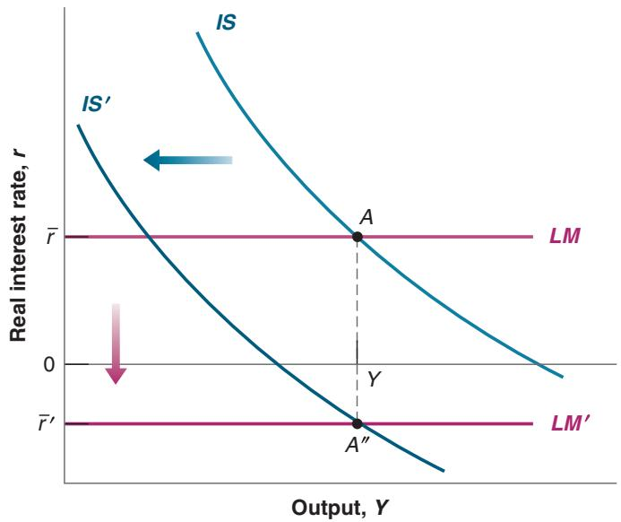
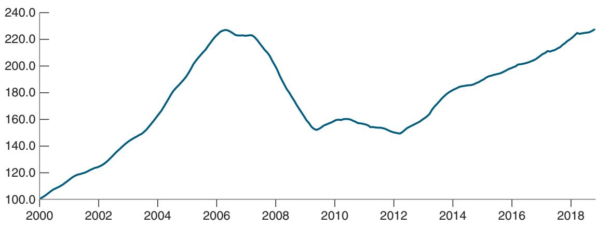
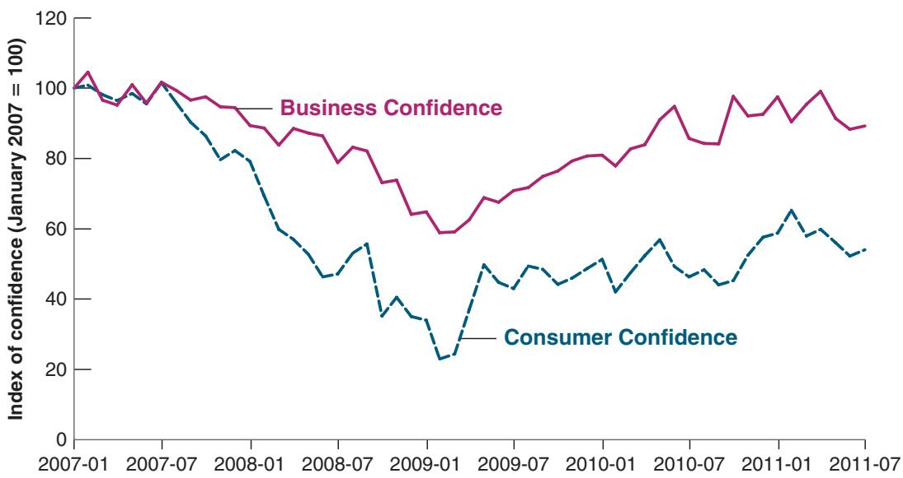
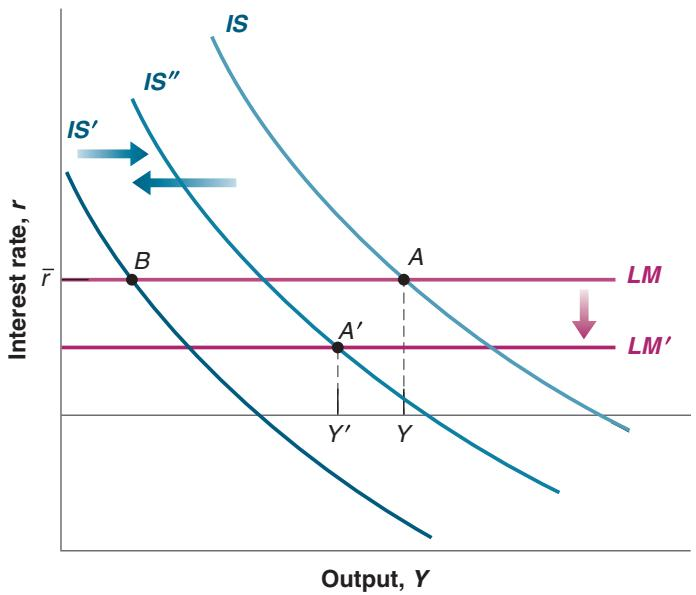

## Financial Shocks and Policies

Suppose that, for some reason, x increases. There are many potential scenarios here. This may be, for example, because investors have become more risk averse and require a higher risk premium, or because one financial institution has gone bankrupt and investors have become worried about the health of other banks, starting a run, forcing these other banks to reduce lending. In Figure 6-5, the IS curve shifts to the left. At the same policy rate r, the borrowing rate, $r + x ,$ increases, leading to a decrease in demand and output. The new equilibrium is at point A¿. Problems in the financial system lead to a recession and a financial crisis becomes a macroeconomic crisis.

What can policy do? As explained in Chapter 5, fiscal policy, be it an increase in G or a decrease in T, can shift the IS curve to the right and increase output. But a large increase in spending or a cut in taxes may imply a large increase in the budget deficit, and the government may be reluctant to cause this.

For simplicity, we have looked at an exogenous increase in x. But x may well depend on output. A decrease in output, say a recession, increases the probability that some borrowers will be unable to repay: workers who become unemployed may not be able to repay loans, firms that lose sales may go bankrupt. The increase in risk leads to a further increase in the risk premium, and thus to a further increase in the borrowing rate, which can further decrease output.

Given that the cause of the low output is that the interest rate for borrowers is too high, monetary policy appears to be a better tool. Indeed, a sufficient decrease in the policy rate, as drawn in Figure 6-6, can in principle be enough to take the economy to point A– and keep output to its initial level. In effect, in the face of the increase in x, the central bank must decrease r so as to keep $r + x ,$ the rate relevant to spending decisions, unchanged.

Note that the policy rate necessary to increase demand sufficiently and return output to its previous level may well be negative, as shown in Figure 6-6. Suppose that, for example, in the initial equilibrium, r was equal to 2% and x was equal to 1%. Suppose that x increases by 4%, from 1% to 5%. To maintain the same value of $r + x ,$ the central bank must decrease the policy rate from 2% to $2 \% - 4 \% = - 2 \%$ . This raises the issue of the constraint arising from the zero lower bound on the nominal interest rate.

Given the zero lower bound on the nominal rate, the lowest real rate the central bank can achieve is given by $r = i - \pi ^ { e } = 0 - \pi ^ { e } = - \pi ^ { e }$ . In words, the lowest real policy rate the central bank can achieve is the negative of inflation. If inflation is high enough,

  
Figure 6-6

If sufficiently large, a decrease in the policy rate can in principle offset the increase in the risk premium. The zero lower bound may, however, put a limit on the decrease in the real policy rate.

say 5%, then a zero nominal rate implies a real rate of - 5%, which is likely to be low enough to offset the increase in x. But if inflation is low or even negative, then the lowest real rate the central bank can achieve may not be enough to offset the increase in x. It may not be enough to return the economy to its equilibrium. As we shall see, two characteristics of the recent crisis were indeed a large increase in x and low actual and expected inflation, limiting how much central banks could use monetary policy to offset the increase in x.

We now have the elements we need to understand what triggered the financial crisis in 2008 and how it morphed into a major macroeconomic crisis. This is the topic of the next and last section of this chapter.

## 6-5 FROM A HOUSING PROBLEM TO A FINANCIAL CRISIS

When housing prices started declining in the United States in 2006, most economists forecast that this would lead to a decrease in demand and a slowdown in growth. Few economists anticipated that it would lead to a major macroeconomic crisis. What most had not anticipated was the effect of the decline in housing prices on the financial system, and in turn, on the economy.

## Housing Prices and Subprime Mortgages

Look up Case-Shiller on the internet to find the index and see its recent evolution. You can also see what has happened to prices in the city

Figure 6-7 shows the evolution of an index of US housing prices since 2000. The index is known as the Case-Shiller index, named for the two economists who constructed it. The index is normalized to equal 100 in January 2000. You can see the large increase in prices in the early 2000s, followed by a large decrease. From a value of 100 in 2000, the index increased to 226 in mid-2006. It then started to decline. By the end of 2008, at the start of the financial crisis, the index was down to 162. It reached a low of 150 in early 2012 and started recovering thereafter. At the time of this writing, it is 227, close to its mid-2006 peak.

  
Figure 6-7

## US Housing Prices since 2000

The increase in housing prices from 2000 to 2006 was followed by a sharp decline. Source: FRED: Case-Shiller Home Price Indices, 10-city home price index, Series SPCS10RSA

Was the sharp price increase from 2000 to 2006 justified? In retrospect, and given the ensuing collapse, surely not. But at the time, when prices were increasing, economists were not so sure. Some increase in prices was clearly justified:

■ The 2000s were a period of unusually low interest rates. Mortgage rates were low, increasing the demand for housing and thus pushing up the price.

■ Other factors were also at work. Mortgage lenders became increasingly willing to make loans to more risky borrowers. These mortgages, known as subprime mortgages (subprimes), had existed since the mid-1990s but became more prevalent in the 2000s. By 2006, about 20% of all US mortgages were subprimes. Was this necessarily bad? Again, at the time, it was seen by most economists as a positive development. It allowed more poor people to buy homes, and under the assumption that housing prices would continue to increase, so the value of the mortgage would decrease over time relative to the price of the house, it looked safe for both lenders and borrowers. Judging from the past, the assumption that housing prices would not decrease also seemed reasonable. As you can see from Figure 6-7, housing prices had not decreased even during the 2000–2001 recession.

In retrospect, these developments were much less benign than most economists thought. First, housing prices could go down, as became evident from 2006 on. When this happened, many borrowers found that the mortgage they owed now exceeded the value of their house (when this happens, the mortgage is said to be underwater). Second, it became clear that, in many cases, the mortgages were in fact much riskier than either the lender pretended or the borrower understood. In many cases, borrowers had taken mortgages with low initial interest rates, known as “teaser rates,” and thus low initial interest payments, probably not fully realizing that their payments would increase sharply later on. Even if house prices had not declined, many of these borrowers would have been unable to meet their mortgage payments.

Thus, as many borrowers defaulted, lenders found themselves faced with large losses. In mid-2008, losses on mortgages were estimated to be around \$300 billion. This is a large number, but, relative to the size of the US economy, it is only about 2% of US GDP. One might have thought that the US financial system could absorb the shock and that the adverse effect on output would be limited. This was not to be. Although the trigger of the crisis was the decline in housing prices, its effects were enormously amplified. Even economists who had anticipated the housing price decline did not realize how strong the amplification mechanisms would be. To understand those, we return to the role of financial intermediaries.

## The Role of Financial Intermediaries

In the previous section, we saw that high leverage, illiquidity of assets, and liquidity of liabilities all increase the risk of trouble in the financial system. All three elements were present in 2008, creating a perfect storm.

## Leverage

Banks were highly leveraged. Why? For a number of reasons: First, they probably underestimated the risk they were taking: Times were good, and in good times, banks, just like people, tend to underestimate the risk of bad times. Second, the compensation and bonus system gave incentives to managers to go for high expected returns without fully taking the risk of bankruptcy into account. Third, although financial regulation required banks to keep their capital ratio above some minimum, banks found new ways to avoid the regulation by creating structured investment vehicles (SIVs).

On the liability side, SIVs borrowed from investors, typically in the form of shortterm debt. On the asset side, SIVs held various forms of securities. To reassure investors

Even if people did not finance the purchase of a house by taking a mortgage, low interest rates would lead to an increase in the price of houses. More on this when web discuss present discounted values in Chapter 14.

Some economists were worried even as housing prices were going up. Robert Shiller, one of the two economists behind the Case-Shiller

index, was among them, warning that the price increase was a bubble that would most likely crash. He received the Nobel Prize in 2013 for his work on asset prices.

that they would get repaid, SIVs typically had a guarantee from the bank that had created them that, if needed, the bank would provide funds to the SIV. Although the first SIV was set up by Citigroup in 1988, SIVs rapidly grew in the 2000s. You may ask why banks did not simply do all these things on their own balance sheet rather than create a separate vehicle. The main reason was to be able to increase leverage. If the banks had done these operations themselves, the operations would have appeared on their balance sheet and been subject to regulatory capital requirements, forcing them to hold enough capital to limit the risk of bankruptcy. Doing these operations through an SIV did not require banks to put down capital. For that reason, by setting up an SIV, banks could increase leverage and increase expected profits, and they did.

When housing prices started declining and many mortgages turned out to be bad, the securities held by SIVs dropped in value. Questions arose about the solvency of the SIVs, and given the banks’ guarantee to provide funds to the SIVs if needed, questions arose about the solvency of the banks themselves. Then, two other factors, securitization and wholesale funding, came into play.

## Securitization and Illiquidity of Assets

An important financial development of the 1990s and 2000s was the growth of securitization. Traditionally, the financial intermediaries that made loans or issued mortgages kept them on their own balance sheet. This had obvious drawbacks. A local bank with local loans and mortgages on its books was much exposed to the local economic situation. When, for example, oil prices came down sharply in the mid-1980s and Texas was in recession, many local banks went bankrupt. With a more diversified portfolio of mortgages, say from many parts of the country, these banks might have avoided bankruptcy.

This is the idea behind securitization. Securitization is the creation of securities based on a bundle of assets (e.g., loans or mortgages). For instance, a mortgage-backed security (MBS) is a title to the returns from a bundle of mortgages, with the number of underlying mortgages often in the tens of thousands. The advantage is that many investors who would not want to hold individual mortgages will be willing to buy and hold these securities. This increase in the supply of funds from investors is, in turn, likely to decrease the cost of borrowing.

Securitization can go further. For example, instead of issuing identical claims to the returns on the underlying bundle of assets, one can issue different types of securities. For example, one can issue senior securities, which have first claims on the returns from the bundle, and junior securities, which come after and pay only if anything remains after the senior securities have been paid. Senior securities appeal to investors who want little risk; junior securities appeal to investors who are willing to take more risk. Such securities, known as collateralized debt obligations (CDOs), were first issued in the late 1980s but grew in importance in the 1990s and 2000s. Securitization went even further with the creation of CDOs combining previously created CDOs, or CDO2.

Securitization would seem like a good idea, a way of diversifying risk and getting a larger group of investors involved in lending to households or firms. And, indeed, it is. But it also came with two large costs, which became clear during the crisis. The first was that if a bank sold a mortgage as part of a securitization bundle and thus did not keep it on its balance sheet, it had fewer incentives to make sure that the borrower could repay. The second was a risk that rating agencies, firms that assess the risk of various securities, had largely missed: When underlying mortgages went bad, assessing their value in an MBS, or, even more so, in a CDO, was extremely hard to do. These assets came to be known as toxic assets. This led investors to assume the worst and be reluctant either to hold them or to continue lending to institutions such as SIVs that held them. Many of the assets held by banks, SIVs, and other financial intermediaries were illiquid. They were extremely hard to assess and thus hard to sell except at fire sale prices.

## Wholesale Funding and Liquidity of Liabilities

Yet another development of the 1990s and 2000s was the emergence of sources of finance other than checkable deposits by banks. Increasingly, they relied on borrowing from other banks or other investors, in the form of short-term debt, to finance the purchase of their assets, a process known as wholesale funding. SIVs, the financial entities set up by banks, were entirely funded through such wholesale funding.

Wholesale funding again would seem like a good idea, giving banks more flexibility in the amount of funds they could use to make loans or buy assets. But it had a cost, which became clear during the crisis. Although holders of checkable deposits were protected by deposit insurance and did not have to worry about the value of their deposits, this was not the case for other investors. Thus, when those investors worried about the value of the assets held by the banks or SIVs, they asked for their funds back. Banks and SIVs had liquid liabilities, much more liquid than their assets.

The combination of high leverage, illiquid assets, and liquid liabilities led to a major financial crisis. As housing prices declined and some mortgages went bad, high leverage implied a sharp decline in the capital of banks and SIVs. This forced them to sell some of their assets. Because these assets were often hard to value, the banks had to sell them at fire sale prices. This, in turn, decreased the value of similar assets remaining on their balance sheet, or on the balance sheet of other financial intermediaries, leading to a further decline in capital ratios and forcing further sales of assets and further declines in prices. The complexity of the securities held by banks and SIVs made it difficult to assess their solvency. Investors therefore became reluctant to continue to lend to them, and wholesale funding came to a stop, which forced further asset sales and price declines. Even the banks became reluctant to lend to each other. On September 15, 2008, Lehman Brothers, a major bank with more than \$600 billion in assets, declared bankruptcy, leading financial participants to conclude that many, if not most, other banks and financial institutions were at risk. By late September, the financia system became paralyzed. Banks basically stopped lending to each other or to anyone else. Quickly, what had been largely a financial crisis turned into a macroeconomic crisis.

## Macroeconomic Implications

The immediate effects of the financial crisis on the macroeconomy were twofold: first, a large increase in the interest rates at which people and firms could borrow, if they could borrow at all; second, a dramatic decrease in confidence.

We saw the effect on various interest rates in Figure 6-3. In late 2008, interest rates on highly rated (AAA) bonds increased to 7% and on lower-rated (BBB) bonds to 10%. Suddenly, borrowing became extremely expensive for most firms. And for the many firms too small to issue bonds and thus dependent on bank credit, it became nearly impossible to borrow at all.

The events of September 2008 also triggered wide anxiety among consumers and firms. Thoughts of another Great Depression and, more generally, confusion and fear about what was happening in the financial system led to a large drop in confidence. The evolution of consumer and business confidence indexes is shown in Figure 6-8; both are normalized to equal 100 in January 2007. Note how consumer confidence, which had started declining in mid-2007, took a sharp turn in the fall of 2008 and reached a low of 22 in early 2009, far below historical lows. The result of lower confidence and lower housing and stock prices was a sharp decrease in consumption.

See the Focus Box “The Lehman Bankruptcy, Fears of Another Great Depression, and Shifts in the Consumption Function” in b Chapter 3.

## Policy Responses

The high cost of borrowing, lower stock prices, and lower confidence all combined to decrease the demand for goods. In terms of the IS-LM model, there was a sharp adverse shift of the IS curve, just as we drew in Figure 6-5. In the face of this large decrease in demand, policymakers did not remain passive.

## Figure 6-8

US Consumer and Business Confidence, 2007–2011

The financial crisis led to a sharp drop in confidence, which bottomed in early 2009. Source: Bloomberg L.P.

## Financial Policies

The most urgent measures were aimed at strengthening the financial system:

■ To prevent a run by depositors, federal deposit insurance was increased from \$100,000 to \$250,000 per account. Recall, however, that much of banks’ funding came not from deposits but from the issuance of short-term debt to investors. To allow the banks to continue to fund themselves through wholesale funding, the federal government offered a program guaranteeing new debt issues by banks.

■ The Federal Reserve provided widespread liquidity to the financial system. We have seen that, if investors wanted to take their funds back, the banks had to sell some of their assets, often at fire sale prices. In many cases, this would have meant bankruptcy. To avoid this, the Fed put in place a number of liquidity facilities to make it easier for banks and other financial intermediaries to borrow from the Fed. The Fed also increased the set of assets that financial institutions could use as collateral when borrowing from the Fed (collateral refers to the asset a borrower pledges when borrowing from a lender; if the borrower defaults, the asset goes to the lender). Together, these facilities allowed banks and financial intermediaries to pay back investors without having to sell their assets. They also decreased the incentives of investors to ask for their funds by decreasing the risk that banks and financial intermediaries would go bankrupt.

At the time of writing, all banks have bought back their shares and reimbursed the government. Indeed, in the final estimation, TARP actually has made a small profit. 1

■ In addition, the government introduced the Troubled Asset Relief Program (TARP), aimed at cleaning up banks. The initial goal of the \$700 billion program, introduced in October 2008, was to remove the complex assets from bank balance sheets, thus decreasing uncertainty, reassuring investors, and making it easier to assess the health of each bank. The Treasury, however, faced the same problems as private investors. If the complex assets were going to be exchanged for, say, Treasury bills, at what price should the exchange be done? Within a few weeks, it became clear that the task of assessing the value of each of these assets was extremely hard and would take a long time, and the initial goal was abandoned. The new goal became to increase the capital of banks. This was done by the government’s acquiring shares and thus providing funds to most of the largest US banks. By increasing their capital ratio, and thus decreasing their leverage, the banks could avoid bankruptcy and, over time, return to normal. As of the end of September 2009, total spending under the TARP was \$360 billion, of which \$200 billion was spent through the purchase of shares in banks.

Fiscal and monetary policies were used aggressively as well.

## Monetary Policy

In the summer of 2007, the Fed had begun to worry about a slowdown in growth and started decreasing the policy rate, slowly at first, faster later as evidence of the crisis mounted. The evolution of the federal funds rate from 2000 on was shown in Figure 1-4 in Chapter 1. By December 2008, the rate was down to zero. But monetary policy was constrained by the zero lower bound and the policy rate could not be decreased further. The Fed then turned to what has become known as unconventional monetary policy, buying other assets so as to directly affect the rate faced by borrowers. We shall explore the various dimensions of unconventional monetary policy at more length in Chapter 23. Suffice it to say that, although these measures were useful, the efficacy of monetary policy was nevertheless severely constrained by the zero lower bound.

## Fiscal Policy

Recall that the interest rate faced by borrowers is given by r + x. You can think of conventional monetary policy as the choice of r, and unconventional monetary policy as measures to reduce x.

When the size of the adverse shock became clear, the US government turned to fiscal policy. When the Obama administration assumed office in 2009, its first priority was to design a fiscal program that would increase demand and reduce the size of the recession. Such a fiscal program, called the American Recovery and Reinvestment Act, was passed in February 2009. It called for \$780 billion in new measures, in the form of both tax reductions and spending increases, over 2009 and 2010. The US budget deficit increased from 1.7% of GDP in 2007 to a high of 9.0% in 2010. The increase was largely the mechanical effect of the crisis because the decrease in output led automatically to a decrease in tax revenues and an increase in transfer programs such as unemployment benefits. But it was also the result of the specific measures in the fiscal program aimed at increasing either private or public spending. Some economists argued that the increase in spending and the cuts in taxes should be even larger, given the seriousness of the situation. Others, however, worried that the deficit was becoming too large, that it might lead to an explosion of public debt, and that it had to be reduced. Beginning in 2011, the deficit was indeed reduced, down to 2.4% in 2015.

Since 2015, the deficit has increased, reaching 4% in 2018. This increase reflects in large part tax cuts implemented by the Trump administration. More on this in b Chapter 22.

We can summarize our discussion by going back to the IS-LM model we developed in the previous section. This is done in Figure 6-9. The financial crisis led to a large shift of the IS curve to the left, from IS to IS¿. In the absence of changes in policy, the equilibrium

  
Figure 6-9

## The Financial Crisis and the Use of Financial, Fiscal, and Monetary Policies

The financial crisis led to a shift of the IS to the left. Financial and fiscal policies led to some shift of the IS back to the right. Monetary policy led to a shift of the LM curve down. Policies were not enough, however, to avoid a major recession.

It is difficult to know what would have happened in the absence of those policies. It is reasonable to think, but impossible to prove, that the decrease in output would have been much larger, leading to a repeat of the Great

would have moved from point A to point B. Financial and fiscal policies offset some of the shift, so that, instead of shifting to IS¿, the economy shifted to IS–. And monetary policy led to a shift of the LM down, from LM to LM¿, so the resulting equilibrium was at point A¿. At that point, the zero lower bound on the nominal policy rate implied that the real policy rate could not be decreased further. The result was a decrease in output from Y to Y¿. The initial shock was so large that the combination of financial, fiscal, and monetary measures was just not enough to avoid a large decrease in output. US GDP fell by 3.5% in 2009 and recovered only slowly thereafter.c

## SUMMARY

The nominal interest rate tells you how many dollars you need to repay in the future in exchange for one dollar today.

The real interest rate tells you how many goods you need to repay in the future in exchange for one good today.

The real interest rate is approximately equal to the nominal rate minus expected inflation.

The zero lower bound on the nominal interest rate implies that the real interest rate cannot be lower than expected inflation.

The interest rate on a bond depends both on the risk that the bond issuer will default and on the bond holder’s degree of risk aversion. A higher probability or a higher degree of risk aversion leads to a higher interest rate.

Financial intermediaries receive funds from investors and then lend these funds to others. In choosing their leverage ratio, financial intermediaries trade off expected profit against the risk of insolvency.

Because of leverage, the financial system is exposed to both in solvency and illiquidity risks. Both may lead financial intermediaries to decrease lending.

The higher the leverage ratio, or the more illiquid the assets, or the more liquid the liabilities, the higher the risk of a bank run or a run on financial intermediaries.

The IS-LM model must be extended to take into account the difference between the nominal and the real interest rate, and the difference between the policy rate chosen by the central bank and the interest rate at which firms and people can borrow.

A shock to the financial system leads to an increase in the interest rate at which people and firms can borrow for a given policy rate. It leads to a decrease in output.

The financial crisis of the late 2000s was triggered by a decrease in housing prices. It was amplified by the financial system.

At the time of the crisis, financial intermediaries were highly leveraged. Because of securitization, their assets were hard to assess and thus illiquid. Because of wholesale funding, their liabilities were liquid. Runs forced financial intermediaries to reduce lending, with strong adverse effects on output.

Financial, fiscal, and monetary policies were used. They were not enough, however, to prevent a deep recession.

## KEY TERMS

nominal interest rate, 110 real interest rate, 110 risk premium, 114 risk aversion, 114 direct finance, 115 shadow banking, 116 capital ratio, 116 leverage ratio, 116 insolvency, 116 fire sale prices, 117 demand deposits, 118 bank runs, 118 narrow banking, 118 federal deposit insurance, 118 liquidity provision, 118 liquidity, 119 policy rate, 120 borrowing rate, 120

mortgage lenders, 123 subprime mortgages, or subprimes, 123 underwater, 123 structured investment vehicles (SIVs), 123 securitization, 124 mortgage-backed security (MBS), 124 senior securities, 124 junior securities, 124 collateralized debt obligations (CDOs), 124 rating agencies, 124 toxic assets, 124 wholesale funding, 125 liquidity facilities, 126 collateral, 126 Troubled Asset Relief Program (TARP), 126 unconventional monetary policy, 127 American Recovery and Reinvestment Act, 127
