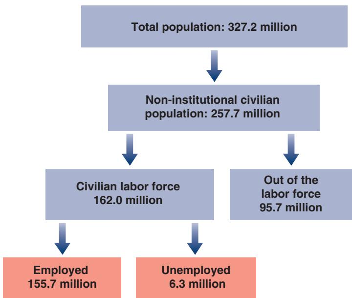
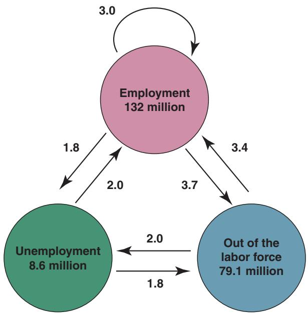

T ing production. Higher production leads to higher employment. Higher employmentleads to lower unemployment. Lower unemployment leads to higher wages. Higher ing production. Higher production leads to higher employment. Higher employment leads to lower unemployment. Lower unemployment leads to higher wages. Higher wages increase production costs, leading firms to increase prices. Higher prices lead workers to ask for higher wages. Higher wages lead to further increases in prices, and so on.

So far, we have simply ignored this sequence of events. By assuming a constant price level in the IS-LM model, we in effect assumed that firms were able and willing to supply any amount of output at a given price level. As long as our focus was on the short run, this assumption was fine. But, as our attention now turns to the medium run, we must now abandon this assumption, explore how prices and wages adjust over time, and how this affects output. This will be our task in this and the next two chapters.

Recall the behavior of theb price level in Figure 5-10.

At the center of the sequence of events described in the first paragraph is the labor market, which is the market in which wages are determined. This chapter focuses on the labor market. It has six sections:

Section 7-1 provides an overview of the labor market.

Section 7-2 focuses on unemployment, how it moves over time, and how its movements affect individual workers.

Sections 7-3 and 7-4 look at wage and price determination.

Section 7-5 then looks at equilibrium in the labor market. It characterizes the natural rate of unemployment, which is the rate of unemployment to which the economy tends to return in the medium run.

Section 7-6 gives a map of where we will be going next.

If you remember one basic message from this chapter, it should be: The natural rate of unemployment is the rate at which the wage demands of workers are consistent with the price decisions of firms.

# 7-1 A TOUR OF THE LABOR MARKET

The total US population in 2018 was 327.2 million (Figure 7-1). Excluding those who were either younger than working age (under 16), in the armed forces, or behind bars, the number of people potentially available for civilian employment, the noninstitutional civilian population, was 257.7 million.

The civilian labor force, which is the sum of those either working or looking for work, was only 162.0 million. The other 95.7 million people were out of the labor force, neither working in the marketplace nor looking for work. The participation rate, which is defined as the ratio of the labor force to the noninstitutional civilian population, was therefore 162.0/257.7, or 62%. The participation rate has steadily increased over time, reflecting mostly the increasing participation rate of women. In 1950, one woman out of three was in the labor force; now the number is close to two out of three.

Of those in the labor force, 155.7 million were employed and 6.3 million were unemployed—looking for work. The unemployment rate, which is defined as the ratio of the unemployed to the labor force, was thus 3.9%.

## The Large Flows of Workers

To get a sense of what a given unemployment rate implies for individual workers, consider the following analogy.

Take an airport full of passengers. It may be crowded because many planes are coming and going, and many passengers are quickly moving in and out of the airport. Or it may be because bad weather is delaying flights and passengers are stranded, waiting for the weather to improve. The number of passengers in the airport will be high in both cases, but their plights are quite different. Passengers in the second scenario are likely to be much less happy.

In the same way, a given unemployment rate may reflect two different realities. It may reflect an active labor market, with many separations and many hires, and thus many workers entering and exiting unemployment, or it may reflect a sclerotic labor market, with few separations, few hires, and a stagnant unemployment pool.

Finding out which reality hides behind the aggregate unemployment rate requires data on the movements of workers. In the United States, the data are available from

Figure 7-1

Population, Labor Force, Employment, and Unemployment in the United States (in Millions), 2018

Source: Current Population Survey www.bls.gov/cps/.

a monthly survey called the Current Population Survey (CPS). Average monthly flows, computed from the CPS from 1994 to 2018, are reported in Figure 7-2. (For more on the ins and outs of the CPS, see the Focus Box “The Current Population Survey.”)

Figure 7-2 has three striking features.

■ The flows of workers in and out of employment are large.

On average, there are 8.5 million separations each month in the United States (out of an employment pool of 132.0 million), 3.0 million people change jobs (shown by the circular arrow at the top), 3.7 million move from employment out of the labor force, and 1.8 million move from employment to unemployment.

Why are there so many separations each month? About three-fourths of all separations are quits, workers leaving their jobs for what they perceive as a better alternative. The remaining one-fourth are layoffs. Layoffs come mostly from changes in employment levels across firms. The slowly changing aggregate employment numbers hide a reality of continual job destruction and job creation across firms. At any given time, some firms are suffering decreases in demand and decreasing their employment, while other firms are enjoying increases in demand and increasing employment.

■ The flows in and out of unemployment are large relative to the number of unemployed. The average monthly flow out of unemployment each month is 3.8 million: 2.0 million people get a job, and 1.9 million stop searching for a job and drop out of the labor force. Put another way, the proportion of unemployed people leaving unemployment equals 3.8/8.8 or about 44% each month. Put yet another way, the average duration of unemployment, which is the average length of time people spend unemployed, is between two and three months.

This fact has an important implication. You should not think of unemployment in the United States as a stagnant pool of workers waiting indefinitely for jobs. For most (but obviously not all) of the unemployed, being unemployed is more a quick transition than a long wait between jobs. One needs, however, to make two remarks at this point. First, the United States is unusual in this respect. In many European countries, the average duration is much longer than in the United States. Second, as we shall see, even in the United States, when unemployment is high, as was the

The numbers for employment, unemployment, and those out of the labor force in Figure 7-1 refer to 2018. The numbers for the same variables in Figure 7-2 refer to averages from 1994 to 2018. This is why they are different.

Put in another, and perhaps more dramatic, way: On average, every day in the United States, about 60,000 workers become unemployed.

The average duration of unemployment equals the inverse of the proportion of unemployed people leaving unemployment each month. To see why, consider an example. Suppose the number of unemployed is constant and equal to 100, and each unemployed person remains unemployed for two months. So, at any given time, there are 50 people who have been unemployed for one month and 50 who have been unemployed for two months.

Each month, the 50 unem-ployed who have been unemployed for two months leave unemployment. In this example, the proportion of unemployed leaving unemployment each month is 50/100, or 50%. The duration of unemployment is two months, which is the inverse of 1/50%.

## Figure 7-2

Average Monthly Flows between Employment, Unemployment, and Nonparticipation in the United States, 1994 to 2018 (Millions)

(1) The flows of workers in and out of employment are large. (2) The flows in and out of unemployment are large relative to the number of unemployed. (3) There are also large flows in and out of the labor force, much of it directly to and from employment.
