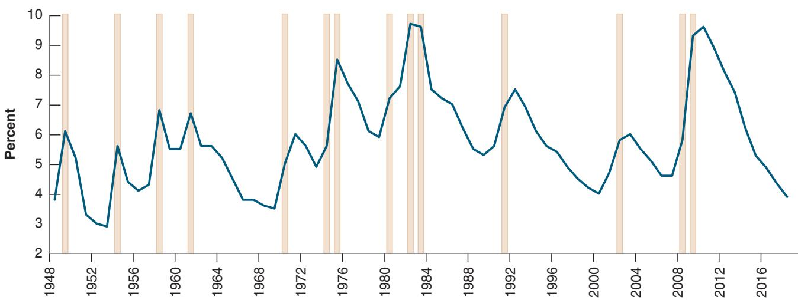
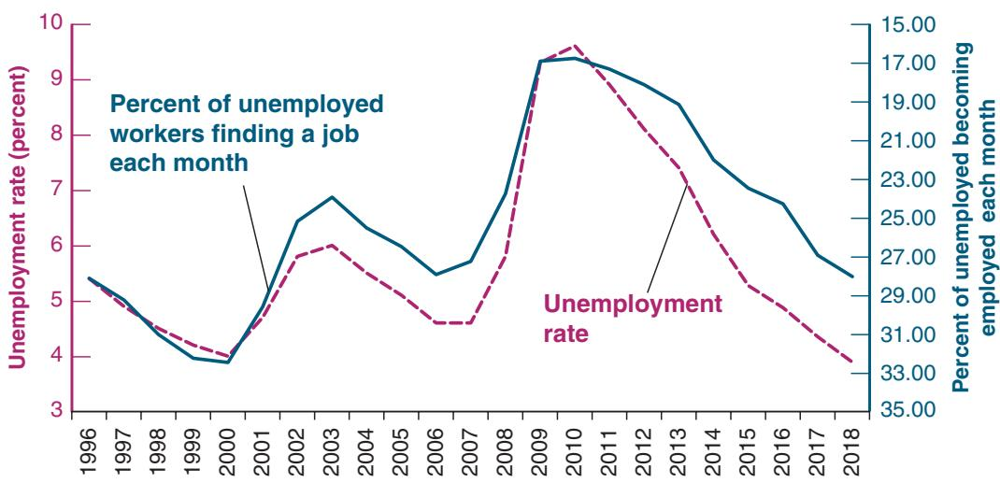
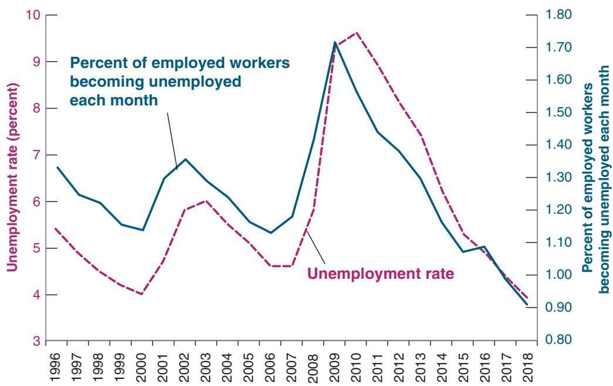

# The Current Population Survey

The Current Population Survey (CPS) is the main source of statistics on the labor force, employment, participation, and earnings in the United States.

When the CPS began in 1940, it was based on interviews of 8,000 households. The sample has grown considerably, and now about 60,000 households are interviewed every month. The households are chosen so that the sample is representative of the US population. Each household stays in the sample for four months, leaves the sample for the following eight months, then comes back for another four months before leaving the sample permanently.

The survey is now based on computer-assisted interviews. Interviews are done either in person, in which case interviewers use laptop computers, or by phone. Some questions are asked in every survey. Other questions are specific to a particular survey and are used to find out about particular aspects of the labor market.

The Labor Department uses the data to compute and publish numbers on employment, unemployment, and participation by age, gender, education, and industry. Economists use these data, which are available in large computer files, in two ways.

The first is to get snapshots of how things are at various points in time, to answer such questions as: What is the distribution of wages for Hispanic American workers with only primary education, and how does it compare with the same distribution 10 or 20 years ago?

The second way, of which Figure 7-2 is an example, relies on the fact that the survey follows people through time. By looking at the same people in two consecutive months, economists can find out, for example, how many of those who were unemployed last month are employed this month. This number gives them an estimate of the probability that somebody who was unemployed last month found a job this month.

For more on the CPS, go to the CPS homepage (www.bls. gov/cps/home.htm).

case during the crisis, the average duration of unemployment becomes much longer. Being unemployed becomes much more painful.

■ The flows in and out of the labor force are also surprisingly large. Each month, 5.5 million workers drop out of the labor force (3.7 plus 1.8), and a roughly equal slightly larger number, 5.4 million, join the labor force (3.4 plus 2.0). You might have expected these two flows to be composed, on one side, of those completing school and entering the labor force for the first time, and on the other side, of workers entering retirement. But each of these two groups actually represents a small fraction of the total flows. Each month only about 450,000 new people enter the labor force, and about 350,000 retire. But the actual flows in and out of the labor force are 10.9 million, about 14 times larger.

Conversely, some of the unemployed may be unwilling to accept any job offered to them and should probably

not be counted as unemployed because they are not really looking for a job.

In 2018, employment was 155.7 million and the population available for work was 257.7 million. The employment rate was 60.4%. The employment rate is sometimes called the employment-

to-population ratio. (Make sure you understand why the sum of the employment rate and the unemployment rate is not equal to 1. Hint: look at the denominators.)

What this fact implies is that many of those classified as “out of the labor force” are in fact willing to work and move back and forth between participation and nonparticipation. Indeed, among those classified as out of the labor force, a large proportion report that although they are not looking, they “want a job.” What they really mean by this statement is unclear, but the evidence is that many do take jobs when offered them.

This fact has another important implication. The sharp focus on the unemployment rate by economists, policymakers, and news media is partly misdirected. Some of the people classified as out of the labor force are much like the unemployed. They are in effect discouraged workers. And although they are not actively looking for a job, they will take it if they find one.

This is why economists sometimes focus on the employment rate, which is the ratio of employment to the population available for work, rather than on the unemployment rate. The higher unemployment, or the higher the number of people out of the labor force, the lower the employment rate.

I shall follow tradition in this text and focus on the unemployment rate as an indicator of the state of the labor market, but you should keep in mind that the unemployment rate is not the best estimate of the number of people available for work.

## 7-2 MOVEMENTS IN UNEMPLOYMENT

Let’s now look at movements in unemployment. Figure 7-3 shows the average annual value of the US unemployment rate since 1948. The shaded bars represent years when there was a recession.

Figure 7-3 has two important features.

■ Year-to-year movements in the unemployment rate are closely associated with recessions and expansions. Look, for example, at the last four peaks in unemployment in Figure 7-3. The most recent peak, at 9.6% in 2010, was the result of the crisis. The previous two peaks, associated with the recessions of 2001 and 1990–1991, were much lower, around 7%. Only the recession of 1982, when the unemployment rate reached 9.7%, is comparable to the recent crisis. (Annual averages can mask larger values within the year. In the 1982 recession, although the average unemployment rate over the year was 9.7%, the rate actually reached 10.8% in November. Similarly, the monthly unemployment rate in the Great Financial Crisis peaked at 10.0% in October 2009.)

Note also that the unemployment rate sometimes peaks in the year after the recession, not in the actual recession year. This occurred, for example, in the 2001 recession. The reason is that, although growth is positive, so the economy is technically no longer in recession, the additional output does not lead to enough new hires to reduce the unemployment rate.

■ There does not seem to be much of an underlying trend. Until the mid-1980s, it looked as if the US unemployment rate was on an upward trend, from an average of 4.5% in the 1950s to 4.7% in the 1960s, 6.2% in the 1970s, and 7.3% in the 1980s. From the 1980s on, however, the unemployment rate generally declined for more than two decades. By 2006, it was down to 4.6%. The unemployment rate increased sharply with the crisis, but has come down again. At the time of writing, it stands at 3.9%, the lowest rate since 1968.

How do these fluctuations in the overall unemployment rate affect individual workers? This is an important question because the answer determines both:

■ The effect of movements in the aggregate unemployment rate on the welfare of individual workers, and

■ The effect of the aggregate unemployment rate on wages.

  
Figure 7-3  
Movements in the US Unemployment Rate, 1948–2018  
Since 1948, the average yearly US unemployment rate has fluctuated between 3% and 10%.

Source: Series UNRATE: Federal Reserve Economic Data (FRED) http://research.stlouisfed.org/fred2/.

Let’s start by asking how firms can decrease their employment in response to a decrease in demand. They can hire fewer new workers, or they can lay off the workers they currently employ. Typically, firms prefer to slow or stop the hiring of new workers first, relying on quits and retirements to achieve a decrease in employment. But this may not be enough if the decrease in demand is large, so firms may then have to lay off workers.

Now think about the implications for both employed and unemployed workers:

■ If the adjustment takes place through fewer hires, the chance that an unemployed worker will find a job diminishes. Fewer hires mean fewer job openings; higher unemployment means more job applicants. Fewer openings and more applicants combine to make it harder for the unemployed to find jobs.

■ If the adjustment takes place instead through layoffs, then employed workers are at a higher risk of losing their job.

In general, as firms do both, higher unemployment is associated with both a lower chance of finding a job if one is unemployed and a higher chance of losing it if one is employed. Figures 7-4 and 7-5 show these two effects at work over the period 1996 to 2018.

Figure 7-4 plots two variables against time: the unemployment rate (measured on the left vertical axis) and the proportion of unemployed workers becoming employed each month (measured on the right vertical axis). This proportion is constructed by dividing the flow from unemployment to employment during each month by the number of unemployed at the start of the month. To show the relation between the two variables more clearly, the proportion of unemployed becoming employed is plotted on an inverted scale. Be sure to note that on the right vertical scale, the proportion is lowest at the top and highest at the bottom.

The relation between movements in the proportion of unemployed workers becoming employed and the unemployment rate is striking. Periods of higher unemployment are associated with much lower proportions of unemployed workers becoming employed. In 2010, for example, with unemployment close to 10%, only about 17% of the unemployed became employed within a month, as opposed to 28% in 2007, when unemployment was much lower.

Similarly, Figure 7-5 plots two variables against time: the unemployment rate (measured on the left vertical axis) and the proportion of workers who become unemployed

The Unemployment Rate and the Proportion of Unemployed Becoming Employed within a Month, 1996–2018

When unemployment is higher, the proportion of unemployed becoming employed within one month is lower. Note that the scale on the right is an inverted scale.

Sources: FRED: Unemployment: UNRATE; Percent of unemployed workers becoming employed each month: Series constructed by Fleischman and Fallick, www. federalreserve.gov/econresdata/ researchdata/.

Figure 7-4  

## Figure 7-5

The Unemployment Rate and the Proportion of Workers Becoming Unemployed, 1996–2018

When unemployment is higher, a higher proportion of workers become unemployed.

Sources: FRED. Unemployment rate UNRATE: Federal Reserve Economic Data; Proportion of employed workers becoming unemployed each month: Fleischman and Fallick, www. federalreserve.gov/econresdata/ research data/feds200434.xls.

each month (measured on the right vertical axis). This proportion is constructed by dividing the flow from employment to unemployment during each month by the number of employed in the month. The relation between the proportion of workers who become unemployed and the unemployment rate plotted is quite strong. Higher unemployment implies a higher probability for employed workers to become unemployed. The probability nearly doubles between times of low unemployment and times of high unemployment.

Let’s summarize:

We could look instead at the separation rate, the sum of the flows to unemployment and out of the labor force. It would yield similar b conclusions.

When unemployment is high, workers are worse off in two ways:

Unemployed workers face a lower probability of becoming employed; equivalently, they can expect to remain unemployed for a longer time.

■ Employed workers face a higher probability of becoming unemployed.

## 7-3 WAGE DETERMINATION

Having looked at unemployment, let’s turn to wage determination and to the relation between wages and unemployment.

Wages are set in many ways. Sometimes they are set by collective bargaining, that is, bargaining between firms and unions. In the United States, collective bargaining plays a limited role, especially outside the manufacturing sector. Today, barely more than 10% of US workers have their wages set by collective bargaining agreements. For the rest, wages are either set by employers or by bargaining between the employer and individual employees. The higher the skills needed to do the job, the more likely there is to be bargaining. Wages offered for entry-level jobs at McDonald’s are on a take-it-or-leaveit basis. New college graduates, on the other hand, can typically negotiate a few aspects of their contracts. CEOs and baseball stars can negotiate a lot more.

Collective bargaining is bargaining between a union (or a set of unions) and a firm (or a set of firms).

There are also large differences across countries. Collective bargaining plays an important role in Japan and in most European countries. Negotiations may take place at the firm level, at the industry level, or at the national level. Sometimes contract agreements apply only to firms that have signed the agreement. Sometimes they are automatically extended to all firms and all workers in the sector or the economy.

Given these differences across workers and across countries, can we hope to formulate anything like a general theory of wage determination? Yes. Although institutional differences influence wage determination, there are common forces at work in all countries. Two sets of facts stand out:

■ Workers are typically paid a wage that exceeds their reservation wage, which is the wage that would make them indifferent between working or being unemployed. In other words, most workers are paid a high enough wage that they prefer being employed to being unemployed.

■ Wages typically depend on labor market conditions. The lower the unemployment rate, the higher the wages. (I shall state this more precisely in the next section.)

To think about these facts, economists have focused on two broad lines of explanation. The first is that even in the absence of collective bargaining, most workers have some bargaining power, which they can and do use to obtain wages above their reservation wages. The second is that firms themselves may, for a number of reasons, want to pay wages higher than the reservation wage. Let’s look at each explanation in turn.

## Bargaining

How much bargaining power workers have depends on two factors. The first is how costly it would be for the firm to find other workers were they to leave the firm. The second is how hard it would be for them to find another job were they to leave the firm. The costlier it is for the firm to replace them, and the easier it is for them to find another job, the more bargaining power they have. This has two implications:

How much bargaining power a worker has depends first on the nature of the job. Replacing a worker at McDonald’s is not costly. The required skills can be taught quickly, and typically a large number of willing applicants have already filled out job application forms. In this situation, the worker is unlikely to have much bargaining power. If he or she asks for a higher wage, the firm can lay him or her off and find a replacement at minimum cost. In contrast, a highly skilled worker who knows in detail how the firm operates may be difficult and costly to replace. This gives him or her more bargaining power. If he or she asks for a higher wage, the firm may decide that it is best to provide it.

How much bargaining power a worker has also depends on labor market conditions. When the unemployment rate is low, it is more difficult for firms to find acceptable replacement workers. At the same time, it is easier for workers to find other jobs. Under these conditions, workers are in a stronger bargaining position and may be able to obtain a higher wage. Conversely, when the unemployment rate is high, finding good replacement workers is easier for firms, whereas finding another job is harder for workers. Being in a weak bargaining position, workers may have no choice but to accept a lower wage.

## Efficiency Wages

Regardless of workers’ bargaining power, firms may want to pay more than the reservation wage. They may want their workers to be productive, and a higher wage can help them achieve that goal. If, for example, it takes a while for workers to learn how to do a job correctly, firms will want their workers to stay for some time. But if workers are paid only their reservation wage, they will be indifferent between staying or leaving. In this
