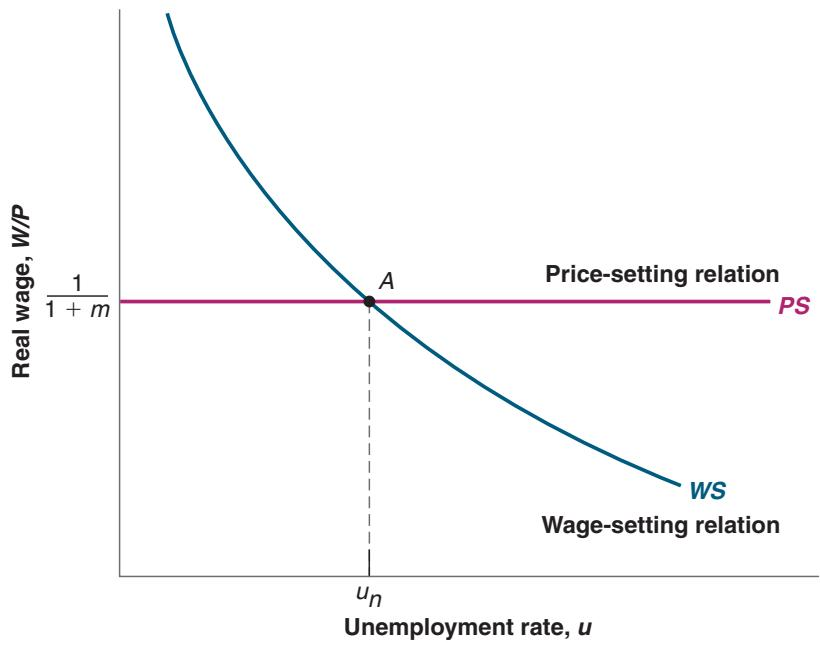
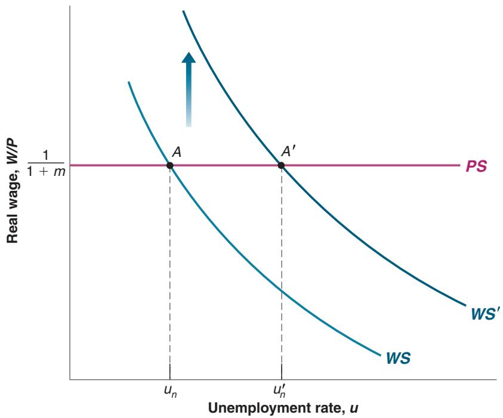
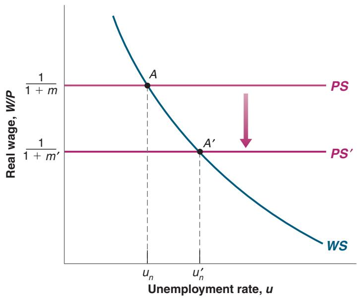

# From Henry Ford to Jeff Bezos

In 1914, Henry Ford—the builder of the most popular car in the world at the time, the Model T—made a stunning announcement. His company would pay all qualified employees a minimum of \$5.00 a day for an eight-hour day. This was a large salary increase for most employees, who had been earning an average of \$2.30 for a nine-hour day. From the point of view of the Ford Company, this increase in pay was far from negligible; it represented about half of the company’s profits at the time.

What Ford’s motivations were is not entirely clear. Ford himself gave too many reasons for us to know which ones he actually believed. The reason was not that the company had a hard time finding workers at the previous wage. But the company clearly had a hard time retaining workers. There was a high turnover rate, as well as high dissatisfaction among workers.

Whatever the reasons behind Ford’s decision, as Table 1 shows, the results of the wage increase were astounding.

The annual turnover rate (the ratio of separations to employment) plunged from a high of 370% in 1913 to a low of 16% in 1915. (An annual turnover rate of 370% means that on average 31% of the company’s workers left each month, so that over the course of a year the ratio of separations to employment was 31% \* 12 = 370%.) The layoff rate collapsed from 62% to nearly 0%. The average rate of absenteeism (not shown in the table), which ran at close to 10% in 1913, was down to 2.5% one year later. There is little question that higher wages were the main source of these changes.

<table><tr><td colspan="4">Table 1 Annual Turnover and Layoff Rates (%) At Ford, 1913–1915</td></tr><tr><td colspan="4"></td></tr><tr><td></td><td>1913</td><td>1914</td><td>1915</td></tr><tr><td>Turnover rate (%)</td><td>370</td><td>54</td><td>16</td></tr><tr><td>Layoff rate (%)</td><td>62</td><td>7</td><td>0.1</td></tr></table>

Did productivity at the Ford plant increase enough to offset the cost of increased wages? The answer to this question is less clear. Productivity was much higher in 1914 than in 1913. Estimates of the productivity increases range from 30% to 50%. Despite higher wages, profits were also higher in 1914 than in 1913. But how much of this increase in profits was the result of changes in workers’ behavior and how much was because of the increasing success of Model T cars is harder to establish.

Although the effects support efficiency wage theories, it may be that the increase in wages to \$5 a day was excessive, at least from the point of view of profit maximization. But Henry Ford probably had other objectives as well, from keeping the unions out—which he did—to generating publicity for himself and the company—which he also surely did.

Interestingly, we may be witnessing another similar experiment. In October 2018, Jeff Bezos announced that Amazon would increase the minimum wage paid to its 250,000 regular workers and 100,000 seasonal workers to \$15 an hour (compared to a federal minimum wage of \$7.50). One reason is certainly the need to attract and keep workers given the very low unemployment rate. Another is to counter some of the negative publicity Amazon has attracted. Another reason may be, just as it was for Ford, the desire to improve morale and productivity. It is too early to know what the effects will be.1

case, many of them will quit, and the turnover rate will be high. Paying a wage above the reservation wage makes it more attractive for workers to stay.

Behind this example lies a more general proposition. Most firms want their workers to feel good about their jobs. Feeling good promotes good work, which leads to higher productivity. Paying a high wage is one instrument the firm can use to achieve these goals. (See the Focus Box “From Henry Ford to Jeff Bezos.”) Economists call the theories that link the productivity or the efficiency of workers to the wage they are paid efficiency wage theories.

Like theories based on bargaining, efficiency wage theories suggest that wages depend on both the nature of the job and labor market conditions.

■ Firms, such as high-tech firms, that see employee morale and commitment as essential to the quality of their work will pay more than firms in sectors where workers activities are more routine.

■ Labor market conditions affect wages. A low unemployment rate makes it more attractive for employed workers to quit: When unemployment is low, it is easy to find

Before September 11, 2001, the approach to airport security was to hire workers at low wages and accept the resulting high turnover. Now that airport security has become a higher priority, the approach has been to make the jobs more attractive and increase pay, so as to get more motivated and more competent workers and reduce turnover. The average salary of a TSA officer is \$40,000, and turnover at the Transport Security Administration (TSA) is now roughly equal to the service industry average.

another job. A firm that wants to avoid an increase in quits when unemployment is low has to increase wages to induce workers to stay with the firm. When this happens, lower unemployment again leads to higher wages. Conversely, higher unemployment leads to lower wages.

## Wages, Prices, and Unemployment

We can capture our discussion of wage determination by using the following equation:

$$
\begin{array}{c} W = P ^ {e}   F (u, z) \\ (-, +) \end{array}\tag{7.1}
$$

The aggregate nominal wage W depends on three factors:

■ The expected price level, Pe

■ The unemployment rate, u

■ A catch-all variable, z, that stands for all other variables that may affect the outcome of wage setting.

Let’s look at each factor.

## The Expected Price Level

First, ignore the difference between the expected and the actual price level and ask: Why does the price level affect nominal wages? The answer: Because both workers and firms care about real wages, not nominal wages.

■ Workers do not care about how many dollars they receive but about how many goods they can buy with those dollars. In other words, they care about the nominal wages (W) they receive relative to the price of the goods they buy (P). They care about W/P.

■ In the same way, firms do not care about the nominal wages they pay but about the nominal wages (W) they pay relative to the price of the goods they sell (P). So they also care about W/P.

Think of it another way. If workers expect the price level—the price of the goods they buy—to double, they will ask for a doubling of their nominal wage. If firms expect the price level—the price of the goods they sell—to double, they will be willing to double the nominal wage. So, if both workers and firms expect the price level to double, they will agree to double the nominal wage, keeping the real wage constant. This is captured in equation (7.1): A doubling in the expected price level leads to a doubling of the nominal wage chosen when wages are set.c

An increase in the expected price level leads to an increase in the nominal wage in the same proportion.

Why do wages depend on the expected price level, Pe, rather than the actual price level, P? Because wages are set in nominal (dollar) terms, and when they are set, the relevant price level is not yet known.

For example, in some union contracts in the United States, nominal wages are set in advance for three years. Unions and firms have to decide what nominal wages will be over the following three years based on what they expect the price level to be over those three years. Even when wages are set by firms, or by bargaining between the firm and each worker, nominal wages are typically set for a year. If the price level goes up unexpectedly during the year, nominal wages are typically not readjusted. (How workers and firms form expectations of the price level will occupy us for much of the next two chapters; we will leave this issue aside for the moment.)

## The Unemployment Rate

Also affecting the wage in equation (7.1) is the unemployment rate, u. The minus sign under u indicates that an increase in the unemployment rate decreases wages.

The fact that wages depend on the unemployment rate was one of the main conclusions of our previous discussion. If we think of wages as being determined by bargaining, then higher unemployment weakens workers’ bargaining power, forcing them to accept lower wages. If we think of wages as being determined by efficiency wage considerations, then higher unemployment allows firms to pay lower wages and still keep workers willing to work.

## The Other Factors

The third variable in equation (7.1), z, is a catch-all variable that stands for all the factors that affect wages given the expected price level and the unemployment rate. By convention, we will define z so that an increase in z implies an increase in the wage (thus, the positive sign under z in the equation). Our previous discussion suggests a long list of potential factors here.

Take, for example, unemployment insurance, the payment of unemployment benefits to workers who lose their jobs. There are good reasons why society should provide some insurance to workers who lose their job and have a hard time finding another. But there is little question that, by making the prospects of unemployment less distressing, more generous unemployment benefits do increase wages at a given unemployment rate. If unemployment insurance did not exist, some workers would have little to live on and would be willing to accept low wages to avoid remaining unemployed. But unemployment insurance does exist, and it allows unemployed workers to hold out for higher wages. In this case, we can think of z as representing the level of unemployment benefits. At a given unemployment rate, higher unemployment benefits increase the wage.

It is easy to think of other factors. An increase in the minimum wage may also increase wages just above the minimum wage, leading to an increase in the average wage, W, at a given unemployment rate. Or take an increase in employment protection, which makes it more expensive for firms to lay off workers. Such a change is likely to increase the bargaining power of workers covered by this protection (laying them off and hiring other workers is now costlier for firms), increasing the wage for a given unemployment rate.

We will explore some of these factors as we go along.

## 7-4 PRICE DETERMINATION

Having looked at wage determination, let’s now turn to price determination.

The prices set by firms depend on the costs they face. These costs depend, in turn, on the nature of the production function, which is the relation between the inputs used in production and the quantity of output produced, and on the prices of these inputs.

For the moment, we will assume that firms produce goods using labor as the only factor of production. We will write the production function as follows:

$$
Y = A N
$$

where Y is output, A is labor productivity, and N is employment. This way of writing the production function implies that labor productivity, which is defined as output per worker, is constant.

Using a term from microeconomics, this assumption implies constant returns to labor in production. If firms double the number of workers they employ, they double the amount of output they produce.

It should be clear that this is a strong simplification. In reality, firms use other factors of production in addition to labor. They use capital—machines and factories. They use raw materials—oil, for example. Moreover, there is technological progress, so that labor productivity (A) is not constant but steadily increases over time. We shall introduce these complications later. We shall introduce raw materials in Chapter 9 when we discuss changes in the price of oil. We shall focus on the role of capital and technological progress when we turn to the determination of output in the long run in Chapter 10 through Chapter 13. For the moment, though, this simple relation between output and employment will serve our purposes.

Given the assumption that labor productivity, A, is constant, we can make one further simplification. We can choose the units of output so that one worker produces one unit of output—in other words, so that $A = 1$ . (This way we do not have to carry the letter A around, and this will simplify notation.) With this assumption, the production function becomes:

$$
Y = N\tag{7.2}
$$

The production function Y = N implies that the cost of producing one more unit of output is the cost of employing one more worker, at wage W. Using the terminology introduced in your microeconomics course: The marginal cost of production—the cost of producing one more unit of output—is equal to W.

If there was perfect competition in the goods market, the price of a unit of output would be equal to marginal cost: P would be equal to W. But many goods markets are not competitive, and firms charge a price higher than their marginal cost. A simple way of capturing this fact is to assume that firms set their price according to

$$
P = (1 + m) W\tag{7.3}
$$

where m is the markup of the price over the cost. To the extent that goods markets are not competitive and firms have market power, m is positive, and the price, P, will exceed the cost, W, by a factor equal to (1 + m).

## 7-5 THE NATURAL RATE OF UNEMPLOYMENT

Let’s now look at the implications of wage and price determination for unemployment.

For the rest of this chapter, we shall do so under the assumption that nominal wages depend on the actual price level, P, rather than on the expected price level, $P ^ { e }$ (why we make this assumption will become clear soon). Under this additional assumption, wage setting and price setting determine the equilibrium rate of unemployment, also called the natural rate of unemployment. Let’s see how.

## The Wage-Setting Relation

Given the assumption that nominal wages depend on the actual price level (P) rather than on the expected price level $( P ^ { e } )$ , equation (7.1), which characterizes wage determination, becomes:

$$
W = P F (u, z)
$$

Dividing both sides by the price level,

$$
\begin{array}{c} \frac {W}{P} = F (u, z) \\ (-, +) \end{array}\tag{7.4}
$$

  
Figure 7-6  
Wages, Prices, and the Natural Rate of Unemployment  
The natural rate of unemployment is the unemployment rate such that the real wage chosen in wage setting is equal to the real wage implied by price setting.  
“Wage setters” are unions and firms if wages are set by collective bargaining; individual workers and firms if wages are set on a case-bycase basis; or firms if wages are set on a take-it-or-leaveit basis.

Wage determination implies a negative relation between the real wage, W/P, and the unemployment rate, u: The higher the unemployment rate, the lower the real wage chosen by wage setters. The intuition is straightforward. The higher the unemployment rate, the weaker the workers’ bargaining position, and the lower the real wage.

This relation between the real wage and the rate of unemployment—let’s call it the wage-setting relation—is drawn in Figure 7-6. The real wage is measured on the vertical axis, the unemployment rate on the horizontal axis. The wage-setting relation is drawn as the downward-sloping curve WS. The higher the unemployment rate, the lower the real wage.

## The Price-Setting Relation

Let’s now look at the implications of price determination. If we divide both sides of the price determination equation, (7.3), by the nominal wage, we get

$$
\frac {P}{W} = 1 + m\tag{7.5}
$$

The ratio of the price level to the wage implied by the price-setting behavior of firms equals 1 plus the markup. Now invert both sides of this equation to get the implied real wage:

$$
\frac {W}{P} = \frac {1}{1 + m}\tag{7.6}
$$

Note what this equation says: Price-setting decisions determine the real wage paid by firms. An increase in the markup leads firms to increase their prices given the wage they have to pay; equivalently, it leads to a decrease in the real wage.

The step from equation (7.5) to equation (7.6) is algebraically straightforward. But how price setting actually determines the real wage paid by firms may not be intuitively obvious. Think of it this way: Suppose the firm you work for increases its markup and therefore increases the price of its product. Your real wage does not change much; you are still paid the same nominal wage, and the product produced by the firm is likely a small part of your consumption basket. Now suppose that not only the firm you work for but all the firms in the economy increase their markup. All the prices go up. Even if you are paid the same nominal wage, your real wage goes down. So, the higher the markup set by firms, the lower your (and everyone else’s) real wage will be. This is what equation (7.6) says.

The price-setting relation in equation (7.6) is drawn as the horizontal line PS (for price setting) in Figure 7-6. The real wage implied by price setting is $1 / ( 1 + m )$ ; it does not depend on the unemployment rate.

## Equilibrium Real Wages and Unemployment

Equilibrium in the labor market requires that the real wage chosen in wage setting be equal to the real wage implied by price setting. (This way of stating equilibrium may sound strange if you learned to think in terms of labor supply and labor demand in your microeconomics course. The relation between wage setting and price setting, on the one hand, and labor supply and labor demand, on the other, is closer than it looks at first and is explored further in the appendix at the end of this chapter.) In Figure $7 -$ 6, equilibrium is therefore given by point A, and the equilibrium unemployment rate is given by $u _ { n } .$

We can also characterize the equilibrium unemployment rate algebraically; eliminating W/P between equations (7.4) and (7.6) gives

$$
F (u _ {n}, z) = \frac {1}{1 + m}\tag{7.7}
$$

The equilibrium unemployment rate, denoted $u _ { n }$ (n for natural), is such that the real wage chosen in wage setting—the left side of equation (7.7)—is equal to the real wage implied by price setting—the right side of equation (7.7).

Natural in Webster’s Dictionary means “in a state provided by nature, without man-made changes.”

benefits shifts the wagesetting curve up. The economy moves along the price-setting curve. Equilibrium unemployment increases. Does this mean that unemployment benefits are necessarily a bad idea? (Hint: No, but they have side effects)

This has led some econo- mists to call unemployment a “discipline device.” It sounds harsh, but higher unemployment is indeed the economic mechanism through which wages get back in line with what firms are willing to pay.

The equilibrium unemployment rate $u _ { n }$ is called the natural rate of unemployment (which is why we have used the subscript n to denote it). The terminology has become standard, so we shall use it, but this is a really bad choice of words. The word natural suggests a constant of nature, one that is unaffected by institutions and policy. As its derivation makes clear, however, the natural rate of unemployment is anything but natural. The positions of the wage-setting and price-setting curves, and thus the equilibrium unemployment rate, depend on both z and m. Consider two examples:

■ An increase in unemployment benefits. This can be represented by an increase in z. Because an increase in benefits makes the prospect of unemployment less painful, it increases the wage set by wage setters at a given unemployment rate. It shifts the wage-setting relation up, from WS to $W S ^ { \prime }$ in Figure 7-7. The economy moves along the PS line, from A to $A ^ { \prime }$ . The natural rate of unemployment increases from $u _ { n }$ to $u ^ { \prime } { } _ { n } .$

In words: At a given unemployment rate, higher unemployment benefits lead to a higher real wage. A higher unemployment rate brings the real wage back to what firms are willing to pay.

■ A less stringent enforcement of existing antitrust legislation. To the extent that this allows firms to collude more easily and increase their market power, it will lead to an increase in their markup m. This increase implies a decrease in the real wage paid by firms, and so it shifts the price-setting relation down, from PS to $P S ^ { \prime }$ in Figure 7-8. The economy moves along WS. The equilibrium moves from A to $A ^ { \prime }$ , and the natural rate of unemployment increases from $u _ { n }$ to $\boldsymbol { u ^ { \prime } } _ { n }$

An increase in markups decreases the real wage and leads to an increase in the natural rate of unemployment. By letting firms increase their prices given the wage, less stringent enforcement of antitrust legislation leads to a decrease in the real wage. Higher unemployment is what makes workers accept this lower real wage, leading to an increase in the natural rate of unemployment.

  
Figure 7-7  
Unemployment Benefits and the Natural Rate of Unemployment  
An increase in unemployment benefits leads to an increase in the natural rate of unemployment.

  
Figure 7-8  
Markups and the Natural Rate of Unemployment  
An increase in the markup leads to an increase in the natural rate of unemployment.  
This name has been suggested by Edmund Phelps, of Columbia University. He was awarded the Nobel Prize in 2006. For more on some of his contributions, see Chapters 8 and 24.

Factors like the generosity of unemployment benefits or antitrust legislation can hardly be thought of as the result of nature. Rather, they reflect various characteristics of the structure of the economy. For that reason, a better name for the equilibrium rate of unemployment would be the structural rate of unemployment, but so far the name has not caught on.

## 7-6 WHERE WE GO FROM HERE

We have just seen how equilibrium in the labor market determines the equilibrium unemployment rate (called the natural rate of unemployment). Although we leave a precise derivation to Chapter 9, it is clear that, for a given labor force, the unemployment rate determines the level of employment, and that, given the production function, the level of employment determines the level of output. Thus, associated with the natural rate of unemployment is a natural level of output.

So, you may (and, indeed, you should) ask, What did we do in the previous four chapters? If equilibrium in the labor market determines the unemployment rate and, by implication, the level of output, why did we spend so much time looking at the goods and financial markets? What about our previous conclusions that the level of output was determined by factors such as monetary policy, fiscal policy, consumer confidence, and so on—all factors that do not enter equation (7.7) and therefore do not affect the natural level of output?

The key to the answer lies in the difference between the short run and the medium run:

■ We have derived the natural rate of unemployment and, by implication, the associated level of output under two assumptions. First, we have assumed equilibrium in the labor market. Second, we have assumed that the price level was equal to the expected price level.

In the short run, the factors that determine movements in output are the factors we focused on in the preceding four chapters: monetary policy, fiscal policy, and so on. c

■ However, there is no reason for the second assumption to be true in the short run. The price level may well turn out to be different from what was expected when nominal wages were set. Hence, in the short run, there is no reason for unemployment to be equal to the natural rate or for output to be equal to its natural level.

As we shall see in Chapter 9, the factors that determine movements in output in the short run are indeed the factors we focused on in the preceding three chapters: monetary policy, fiscal policy, and so on. Your time (and mine) was not wasted.

In the medium run, output tends to return to the natural level. The factors that determine unemployment and, by

■ But expectations are unlikely to be systematically wrong (say, too high or too low) forever. That is why, in the medium run, output tends to return to its natural level. In the medium run, the factors that determine unemployment and output are the factors that appear in equation (7.7).

implication, output are the factors we have focused on this chapter.

These, in short, are the answers to the questions asked in the first paragraph of this chapter. Developing these answers in detail will be our task in the next two chapters. Chapter 8 relaxes the assumption that the price level is equal to the expected price level and derives the relation between unemployment and inflation known as the Phillips curve. Chapter 9 puts all the pieces together.

## SUMMARY

The labor force consists of those who are working (employed) or looking for work (unemployed). The unemployment rate is equal to the ratio of the number of unemployed to the number in the labor force. The participation rate is equal to the ratio of the labor force to the working-age population.

The US labor market is characterized by large flows between employment, unemployment, and “out of the labor force.” On average, each month, about 44% of the unemployed move out of unemployment, either to take a job or to drop out of the labor force.

Unemployment is high in recessions and low in expansions. During periods of high unemployment, the probability of losing a job increases and the probability of finding a job decreases.

Wages are set unilaterally by firms or by bargaining between workers and firms. They depend negatively on the unemployment rate and positively on the expected price level. The reason why wages depend on the expected price level is that they are typically set in nominal terms for some period of time. During that time, even if the price level turns out to be different from what was expected, wages are typically not readjusted.

The price set by firms depends on the wage and on the markup of prices over wages. A higher markup implies a higher price given the wage, and thus a lower real wage.

Equilibrium in the labor market requires that the real wage chosen in wage setting be equal to the real wage implied by price setting. Under the additional assumption that the expected price level is equal to the actual price level, equilibrium in the labor market determines the unemployment rate. This unemployment rate is known as the natural rate of unemployment.

In general, the actual price level may turn out to be different from the price level expected by wage setters. Therefore, the unemployment rate need not be equal to the natural rate.

## KEY TERMS

noninstitutional civilian population, 136 labor force, 136 out of the labor force, 136 participation rate, 136 unemployment rate, 136 separations, 136 hires, 136 Current Population Survey (CPS), 137 quits, 137 layoffs, 137 duration of unemployment, 137 discouraged workers, 138 employment rate, 138 collective bargaining, 141

The coming chapters will show that, in the short run, unemployment and output are determined by the factors we focused on in the previous four chapters, but, in the medium run, unemployment tends to return to the natural rate and output tends to return to its natural level.

reservation wage, 142 efficiency wage, 143 bargaining power, 142 efficiency wage theories, 143 unemployment insurance, 145 employment protection, 145 production function, 145 labor productivity, 145 markup, 146 natural rate of unemployment, 146 wage-setting relation, 147 price-setting relation, 148 structural rate of unemployment, 149

## QUESTIONS AND PROBLEMS

## QUICK CHECK

1. Using the information in this chapter, label each of the following statements true, false, or uncertain. Explain briefly.

a. Since 1950, the participation rate in the United States has remained roughly constant at 60%.

b. Each month, the flows into and out of employment are very small compared to the size of the labor force.

c. Fewer than 10% of all unemployed workers exit the unemployment pool each year.

d. The unemployment rate tends to be high in recessions and low in expansions.

e. Most workers are typically paid their reservation wage.

f. Workers who do not belong to unions have no bargaining power.

g. It may be in the best interest of employers to pay wages higher than their workers’ reservation wage.

h. The natural rate of unemployment is unaffected by policy changes.

2. Answer the following questions using the information provided in this chapter.

a. As a percentage of employed workers, what is the size of the flows into and out of employment (i.e., hires and separations) each month?

b. As a percentage of unemployed workers, what is the size of the flows from unemployment into employment each month?

c. As a percentage of the unemployed, what is the size of total flows out of unemployment each month? What is the average duration of unemployment?

d. As a percentage of the labor force, what is the size of the total flows into and out of the labor force each month?

e. In the text we say that there is an average of 450,000 new workers entering the labor force each month. What percentage of total flows into the labor force do new workers entering the labor force constitute?

3. The natural rate of unemployment

Suppose that the markup of goods prices over marginal cost is 5%, and that the wage-setting equation is

$$
W = P (1 - u),
$$

where u is the unemployment rate.

a. What is the real wage, as determined by the price-setting equation?

b. What is the natural rate of unemployment?

c. Suppose that the markup of prices over costs increases to 10%. What happens to the natural rate of unemployment? Explain the logic behind your answer.

## DIG DEEPER

## 4. Reservation wages

In the mid-1980s, a famous supermodel once said that she would not get out of bed for less than \$10,000 (presumably per day). a. What is your own reservation wage?

b. Did your first job pay more than your reservation wage at the time?

c. Relative to your reservation wage at the time you accept each job, which job pays more: your first one or the one you expect to have in 10 years?

d. Explain your answers to parts a through c in terms of the efficiency wage theory.

e. Part of the policy response to the crisis was to extend the length of time workers could receive unemployment benefits. How would this affect reservation wages if this change were made permanent?

## 5. Bargaining power and wage determination

Even in the absence of collective bargaining, workers do have some bargaining power that allows them to receive wages higher than their reservation wage. Each worker’s bargaining power depends both on the nature of the job and on the economywide labor market conditions. Let’s consider each factor in turn.

a. Compare the job of a delivery person and a computer network administrator. In which of these jobs does a worker have more bargaining power? Why?

b. For any given job, how do labor market conditions affect a worker’s bargaining power? Which labor market variable would you look at to assess labor-market conditions?

c. Suppose that for given labor market conditions (the variable you identified in part b), worker bargaining power throughout the economy increases. What effect would this have on the real wage in the medium run? in the short run? What determines the real wage in the model described in this chapter?

## 6. The existence of unemployment

a. Why does the wage-setting relation in Figure 1 have an upward slope? As N approaches L, what happens to the unemployment rate?

b. The price-setting relation is horizontal. How would an increase in the mark-up affect the position of the price-setting relation in Figure 1? How would an increase in the mark-up affect the natural rate of unemployment in Figure 1?

## 7. The informal labor market

You learned in Chapter 2 that informal work at home (e.g., preparing meals, taking care of children) is not counted as part of GDP. Such work also does not constitute employment in labor market statistics. With these observations in mind, consider two economies, each with 100 people, divided into 25 households each composed of four people. In each household, one person stays at home and prepares the food, two people work in the nonfood sector, and one person is unemployed. Assume that the workers outside food preparation produce the same actual and measured output in both economies.

In the first economy, EatIn, the 25 food preparation workers (one per household) cook for their families and do not work outside the home. All meals are prepared and eaten at home. The 25 foodpreparation workers in this economy do not seek work in the formal labor market (and when asked, they say they are not looking for work). In the second economy, EatOut, the 25 food preparation workers are employed by restaurants. All meals are purchased in restaurants.

a. Calculate measured employment and unemployment and the measured labor force for each economy. Calculate the measured unemployment rate and participation rate for each economy. In which economy is measured GDP higher?

b. Suppose now that EatIn’s economy changes. A few restaurants open, and the food preparation workers in 10 households take jobs in restaurants. The members of these 10 households now eat all of their meals at restaurants. The food preparation workers in the remaining 15 households continue to work at home and do not seek jobs in the formal sector. The members of these 15 households continue to eat all of their meals at home. Without calculating the numbers, what will happen to measured employment and unemployment and to the measured labor force, unemployment rate, and participation rate in EatIn? What will happen to measured GDP in EatIn?

c. Suppose that you want to include work at home in GDP and the employment statistics. How would you measure the value of work at home in GDP? How would you alter the definitions of employment, unemployment, and out of the labor force?

d. Given your new definitions in part c, would the labor market statistics differ for EatIn and EatOut? Assuming that the food produced by these economies has the same value, would measured GDP in these economies differ? Under your new definitions, would the experiment in part b have any effect on the labor market or GDP statistics for EatIn?

## EXPLORE FURTHER

## 8. Unemployment durations and long-term unemployment

According to the data presented in this chapter, about 44% of unemployed workers leave unemployment each month.

a. Assume that the probability of leaving unemployment is the same for all unemployed persons, independent of how long they have been unemployed. What is the probability that an unemployed worker will still be unemployed after one month? two months? six months?

Now consider the composition of the unemployment pool. We will use a simple experiment to determine the proportion of the unemployed who have been unemployed six months or more. Suppose the number of unemployed workers is constant and equal to x. Each month, 47% of the unemployed find jobs, and an equivalent number of previously employed workers become unemployed.

b. Consider the group of x workers who are unemployed this month. After a month, what percentage of this group will still be unemployed? (Hint: If 47% of unemployed workers find jobs every month, what percentage of the original x unemployed workers did not find jobs in the first month?)

c. After a second month, what percentage of the original x unemployed workers has been unemployed for at least two months? (Hint: Given your answer to part b, what percentage of those unemployed for at least one month do not find jobs in the second month?) After the sixth month, what percentage of the original x unemployed workers has been unemployed for at least six months?

d. Using Table B-28 of the Economic Report of the President (this is the table number as of the 2019 report) you can compute the proportion of unemployed who have been unemployed six months or more (27 weeks or more) for each year between 2000 and 2019. How do the numbers between 2000 and 2008 (the precrisis years) compare with the answer you obtained in part c? Can you guess what may account for the difference between the actual numbers and the answer you obtained in this problem? (Hint: Suppose that the probability of exiting unemployment decreases the longer you are unemployed.)

e. For the unemployed who have been unemployed 6 months or more, what happens to them during the crisis years 2009 to 2011?

f. Is there any evidence of the crisis ending when you look at the percentage of the unemployed who have been unemployed 6 months or more?

g. Part of the policy response to the crisis was an extension of the length of time that an unemployed worker could receive unemployment benefits. How do you predict this change would affect the proportion of those unemployed more than six months? Did this occur?

9. Go to the website maintained by the US Bureau of Labor Statistics (www.bls.gov). Find the latest Employment Situation Summary. Look under the link “National Employment.”

a. What are the latest monthly data on the size of the US civilian labor force, on the number of unemployed, and on the unemployment rate?

b. How many people are employed?

c. Compute the change in the number of unemployed from the first number in the table to the most recent month in the table. Do the same for the number of employed workers. Is the decline in unemployment equal to the increase in employment? Explain in words.

10. The typical dynamics of unemployment over a recession

The table below shows the behavior of annual real GDP growth during three recessions. These data are from Table B-4 of the Economic Report of the President.

<table><tr><td>Year</td><td>Real GDP Growth</td><td>Unemployment Rate</td></tr><tr><td>1981</td><td>2.5</td><td></td></tr><tr><td>1982</td><td>-1.9</td><td></td></tr><tr><td>1983</td><td>4.5</td><td></td></tr><tr><td>1990</td><td>1.9</td><td></td></tr><tr><td>1991</td><td>-0.2</td><td></td></tr><tr><td>1992</td><td>3.4</td><td></td></tr><tr><td>2008</td><td>0.0</td><td></td></tr><tr><td>2009</td><td>-2.6</td><td></td></tr><tr><td>2010</td><td>2.9</td><td></td></tr></table>

Use Table B-35 from the Economic Report of the President to fill in the annual values of the unemployment rate in the table above and consider these questions.

## FURTHER READINGS

A further discussion of unemployment along the lines of this chapter is given by Richard Layard, Stephen Nickell, and Richard Jackman in The Unemployment Crisis (1994, Oxford University Press).

a. When is the unemployment rate in a recession higher, during the year of declining output or the following year? Explain why.

b. Explain the pattern of the unemployment rate after a recession if discouraged workers return to the labor force as the economy recovers.

c. The rate of unemployment remains substantially higher after the crisis-induced recession in 2009. In that recession, unemployment benefits were extended in length from 6 months to 12 months. What does the model predict the effect of this policy will be on the natural rate of unemployment? Do the data support this prediction in any way?

## 11. A closer look at changes in state labor markets

There is a lot of discussion of the decline of the “Rust Belt” and the differences between labor markets at the state level. The table below is a snapshot of the labor market in California, Ohio, and Texas in 2003 before the Great Financial Crisis, in 2009 at the height of the crisis, and in 2018 after the crisis. Ohio is considered a Rust Belt state.

Source: www.bls.gov/lau/ex14tables.htma.

<table><tr><td>State</td><td>California</td><td>Ohio</td><td>Texas</td></tr><tr><td>Variable</td><td colspan="3">Participation Rate</td></tr><tr><td>2003</td><td>65.9</td><td>67.4</td><td>68.0</td></tr><tr><td>2009</td><td>65.1</td><td>66.0</td><td>60.8</td></tr><tr><td>2018</td><td>62.4</td><td>62.4</td><td>61.7</td></tr><tr><td colspan="4">Employment Rate</td></tr><tr><td>2003</td><td>61.5</td><td>63.3</td><td>63.4</td></tr><tr><td>2009</td><td>57.8</td><td>59.2</td><td>60.8</td></tr><tr><td>2018</td><td>59.8</td><td>59.5</td><td>61.7</td></tr><tr><td colspan="4">Unemployment Rate</td></tr><tr><td>2003</td><td>6.7</td><td>6.1</td><td>6.8</td></tr><tr><td>2009</td><td>11.3</td><td>11.8</td><td>7.5</td></tr><tr><td>2018</td><td>4.2</td><td>4.5</td><td>3.8</td></tr></table>

a. In which state did participation rates fall by the largest amount between 2003 and 2018? Is this consistent with the story of economic decline in the Rust Belt?

b. Using the increase in the unemployment rate from 2003 to 2009 to measure economic stress, in what state did the crisis hit hardest?

c. Using the decline in the participation rate from 2003 to 2009 to measure economic stress, in what state did the financial crisis hit hardest?

d. As of 2018, which state has the weakest labor market using all three statistics?

For more detail on how recessions affect various groups, read “Who Suffers During Recessions?” by Hilary Hoynes, Douglas Miller, and Jessamyn Schaller, Journal of Economic Perspectives, 2012, 26(3): pp. 27–48.
