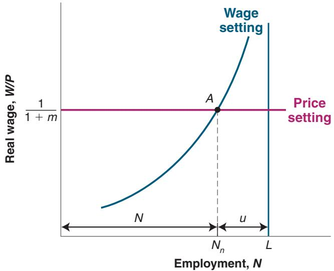

## QUESTIONS AND PROBLEMS

## QUICK CHECK

1. Using the information in this chapter, label each of the following statements true, false, or uncertain. Explain briefly.

a. Since 1950, the participation rate in the United States has remained roughly constant at 60%.

b. Each month, the flows into and out of employment are very small compared to the size of the labor force.

c. Fewer than 10% of all unemployed workers exit the unemployment pool each year.

d. The unemployment rate tends to be high in recessions and low in expansions.

e. Most workers are typically paid their reservation wage.

f. Workers who do not belong to unions have no bargaining power.

g. It may be in the best interest of employers to pay wages higher than their workers’ reservation wage.

h. The natural rate of unemployment is unaffected by policy changes.

2. Answer the following questions using the information provided in this chapter.

a. As a percentage of employed workers, what is the size of the flows into and out of employment (i.e., hires and separations) each month?

b. As a percentage of unemployed workers, what is the size of the flows from unemployment into employment each month?

c. As a percentage of the unemployed, what is the size of total flows out of unemployment each month? What is the average duration of unemployment?

d. As a percentage of the labor force, what is the size of the total flows into and out of the labor force each month?

e. In the text we say that there is an average of 450,000 new workers entering the labor force each month. What percentage of total flows into the labor force do new workers entering the labor force constitute?

3. The natural rate of unemployment

Suppose that the markup of goods prices over marginal cost is 5%, and that the wage-setting equation is

$$
W = P (1 - u),
$$

where u is the unemployment rate.

a. What is the real wage, as determined by the price-setting equation?

b. What is the natural rate of unemployment?

c. Suppose that the markup of prices over costs increases to 10%. What happens to the natural rate of unemployment? Explain the logic behind your answer.

## DIG DEEPER

## 4. Reservation wages

In the mid-1980s, a famous supermodel once said that she would not get out of bed for less than \$10,000 (presumably per day). a. What is your own reservation wage?

b. Did your first job pay more than your reservation wage at the time?

c. Relative to your reservation wage at the time you accept each job, which job pays more: your first one or the one you expect to have in 10 years?

d. Explain your answers to parts a through c in terms of the efficiency wage theory.

e. Part of the policy response to the crisis was to extend the length of time workers could receive unemployment benefits. How would this affect reservation wages if this change were made permanent?

## 5. Bargaining power and wage determination

Even in the absence of collective bargaining, workers do have some bargaining power that allows them to receive wages higher than their reservation wage. Each worker’s bargaining power depends both on the nature of the job and on the economywide labor market conditions. Let’s consider each factor in turn.

a. Compare the job of a delivery person and a computer network administrator. In which of these jobs does a worker have more bargaining power? Why?

b. For any given job, how do labor market conditions affect a worker’s bargaining power? Which labor market variable would you look at to assess labor-market conditions?

c. Suppose that for given labor market conditions (the variable you identified in part b), worker bargaining power throughout the economy increases. What effect would this have on the real wage in the medium run? in the short run? What determines the real wage in the model described in this chapter?

## 6. The existence of unemployment

a. Why does the wage-setting relation in Figure 1 have an upward slope? As N approaches L, what happens to the unemployment rate?

b. The price-setting relation is horizontal. How would an increase in the mark-up affect the position of the price-setting relation in Figure 1? How would an increase in the mark-up affect the natural rate of unemployment in Figure 1?

## 7. The informal labor market

You learned in Chapter 2 that informal work at home (e.g., preparing meals, taking care of children) is not counted as part of GDP. Such work also does not constitute employment in labor market statistics. With these observations in mind, consider two economies, each with 100 people, divided into 25 households each composed of four people. In each household, one person stays at home and prepares the food, two people work in the nonfood sector, and one person is unemployed. Assume that the workers outside food preparation produce the same actual and measured output in both economies.

In the first economy, EatIn, the 25 food preparation workers (one per household) cook for their families and do not work outside the home. All meals are prepared and eaten at home. The 25 foodpreparation workers in this economy do not seek work in the formal labor market (and when asked, they say they are not looking for work). In the second economy, EatOut, the 25 food preparation workers are employed by restaurants. All meals are purchased in restaurants.

a. Calculate measured employment and unemployment and the measured labor force for each economy. Calculate the measured unemployment rate and participation rate for each economy. In which economy is measured GDP higher?

b. Suppose now that EatIn’s economy changes. A few restaurants open, and the food preparation workers in 10 households take jobs in restaurants. The members of these 10 households now eat all of their meals at restaurants. The food preparation workers in the remaining 15 households continue to work at home and do not seek jobs in the formal sector. The members of these 15 households continue to eat all of their meals at home. Without calculating the numbers, what will happen to measured employment and unemployment and to the measured labor force, unemployment rate, and participation rate in EatIn? What will happen to measured GDP in EatIn?

c. Suppose that you want to include work at home in GDP and the employment statistics. How would you measure the value of work at home in GDP? How would you alter the definitions of employment, unemployment, and out of the labor force?

d. Given your new definitions in part c, would the labor market statistics differ for EatIn and EatOut? Assuming that the food produced by these economies has the same value, would measured GDP in these economies differ? Under your new definitions, would the experiment in part b have any effect on the labor market or GDP statistics for EatIn?

## EXPLORE FURTHER

## 8. Unemployment durations and long-term unemployment

According to the data presented in this chapter, about 44% of unemployed workers leave unemployment each month.

a. Assume that the probability of leaving unemployment is the same for all unemployed persons, independent of how long they have been unemployed. What is the probability that an unemployed worker will still be unemployed after one month? two months? six months?

Now consider the composition of the unemployment pool. We will use a simple experiment to determine the proportion of the unemployed who have been unemployed six months or more. Suppose the number of unemployed workers is constant and equal to x. Each month, 47% of the unemployed find jobs, and an equivalent number of previously employed workers become unemployed.

b. Consider the group of x workers who are unemployed this month. After a month, what percentage of this group will still be unemployed? (Hint: If 47% of unemployed workers find jobs every month, what percentage of the original x unemployed workers did not find jobs in the first month?)

c. After a second month, what percentage of the original x unemployed workers has been unemployed for at least two months? (Hint: Given your answer to part b, what percentage of those unemployed for at least one month do not find jobs in the second month?) After the sixth month, what percentage of the original x unemployed workers has been unemployed for at least six months?

d. Using Table B-28 of the Economic Report of the President (this is the table number as of the 2019 report) you can compute the proportion of unemployed who have been unemployed six months or more (27 weeks or more) for each year between 2000 and 2019. How do the numbers between 2000 and 2008 (the precrisis years) compare with the answer you obtained in part c? Can you guess what may account for the difference between the actual numbers and the answer you obtained in this problem? (Hint: Suppose that the probability of exiting unemployment decreases the longer you are unemployed.)

e. For the unemployed who have been unemployed 6 months or more, what happens to them during the crisis years 2009 to 2011?

f. Is there any evidence of the crisis ending when you look at the percentage of the unemployed who have been unemployed 6 months or more?

g. Part of the policy response to the crisis was an extension of the length of time that an unemployed worker could receive unemployment benefits. How do you predict this change would affect the proportion of those unemployed more than six months? Did this occur?

9. Go to the website maintained by the US Bureau of Labor Statistics (www.bls.gov). Find the latest Employment Situation Summary. Look under the link “National Employment.”

a. What are the latest monthly data on the size of the US civilian labor force, on the number of unemployed, and on the unemployment rate?

b. How many people are employed?

c. Compute the change in the number of unemployed from the first number in the table to the most recent month in the table. Do the same for the number of employed workers. Is the decline in unemployment equal to the increase in employment? Explain in words.

10. The typical dynamics of unemployment over a recession

The table below shows the behavior of annual real GDP growth during three recessions. These data are from Table B-4 of the Economic Report of the President.

<table><tr><td>Year</td><td>Real GDP Growth</td><td>Unemployment Rate</td></tr><tr><td>1981</td><td>2.5</td><td></td></tr><tr><td>1982</td><td>-1.9</td><td></td></tr><tr><td>1983</td><td>4.5</td><td></td></tr><tr><td>1990</td><td>1.9</td><td></td></tr><tr><td>1991</td><td>-0.2</td><td></td></tr><tr><td>1992</td><td>3.4</td><td></td></tr><tr><td>2008</td><td>0.0</td><td></td></tr><tr><td>2009</td><td>-2.6</td><td></td></tr><tr><td>2010</td><td>2.9</td><td></td></tr></table>

Use Table B-35 from the Economic Report of the President to fill in the annual values of the unemployment rate in the table above and consider these questions.

## FURTHER READINGS

A further discussion of unemployment along the lines of this chapter is given by Richard Layard, Stephen Nickell, and Richard Jackman in The Unemployment Crisis (1994, Oxford University Press).

a. When is the unemployment rate in a recession higher, during the year of declining output or the following year? Explain why.

b. Explain the pattern of the unemployment rate after a recession if discouraged workers return to the labor force as the economy recovers.

c. The rate of unemployment remains substantially higher after the crisis-induced recession in 2009. In that recession, unemployment benefits were extended in length from 6 months to 12 months. What does the model predict the effect of this policy will be on the natural rate of unemployment? Do the data support this prediction in any way?

## 11. A closer look at changes in state labor markets

There is a lot of discussion of the decline of the “Rust Belt” and the differences between labor markets at the state level. The table below is a snapshot of the labor market in California, Ohio, and Texas in 2003 before the Great Financial Crisis, in 2009 at the height of the crisis, and in 2018 after the crisis. Ohio is considered a Rust Belt state.

Source: www.bls.gov/lau/ex14tables.htma.

<table><tr><td>State</td><td>California</td><td>Ohio</td><td>Texas</td></tr><tr><td>Variable</td><td colspan="3">Participation Rate</td></tr><tr><td>2003</td><td>65.9</td><td>67.4</td><td>68.0</td></tr><tr><td>2009</td><td>65.1</td><td>66.0</td><td>60.8</td></tr><tr><td>2018</td><td>62.4</td><td>62.4</td><td>61.7</td></tr><tr><td colspan="4">Employment Rate</td></tr><tr><td>2003</td><td>61.5</td><td>63.3</td><td>63.4</td></tr><tr><td>2009</td><td>57.8</td><td>59.2</td><td>60.8</td></tr><tr><td>2018</td><td>59.8</td><td>59.5</td><td>61.7</td></tr><tr><td colspan="4">Unemployment Rate</td></tr><tr><td>2003</td><td>6.7</td><td>6.1</td><td>6.8</td></tr><tr><td>2009</td><td>11.3</td><td>11.8</td><td>7.5</td></tr><tr><td>2018</td><td>4.2</td><td>4.5</td><td>3.8</td></tr></table>

a. In which state did participation rates fall by the largest amount between 2003 and 2018? Is this consistent with the story of economic decline in the Rust Belt?

b. Using the increase in the unemployment rate from 2003 to 2009 to measure economic stress, in what state did the crisis hit hardest?

c. Using the decline in the participation rate from 2003 to 2009 to measure economic stress, in what state did the financial crisis hit hardest?

d. As of 2018, which state has the weakest labor market using all three statistics?

For more detail on how recessions affect various groups, read “Who Suffers During Recessions?” by Hilary Hoynes, Douglas Miller, and Jessamyn Schaller, Journal of Economic Perspectives, 2012, 26(3): pp. 27–48.

# APPENDIX: Wage- and Price-Setting Relations versus Labor Supply and Labor Demand

If you have taken a microeconomics course, you probably saw a representation of labor market equilibrium in terms of labor supply and labor demand. You may therefore be asking yourself: How does the representation in terms of wage setting and price setting relate to the representation of the labor market I saw in that course?

In an important sense, the two representations are similar.

To see why, let’s redraw Figure 7-6 in terms of the real wage on the vertical axis, and the level of employment (rather than the unemployment rate) on the horizontal axis. We do this in Figure 1.

Employment, N, is measured on the horizontal axis. The level of employment must be somewhere between zero and L, the labor force. Employment cannot exceed the number of people available for work (i.e., the labor force). For any employment level N, unemployment is given by $u = L - N .$ . Knowing this, we can measure unemployment by starting from L and moving to the left on the horizontal axis. Unemployment is given by the distance between L and N. The lower is employment, N, the higher is unemployment, and by implication the higher the unemployment rate, u.

Let’s now draw the wage-setting and price-setting relations and characterize the equilibrium.

■ An increase in employment (a move to the right along the horizontal axis) implies a decrease in unemployment and therefore an increase in the real wage chosen in wage setting. Thus, the wage-setting relation is now upward sloping. Higher employment implies a higher real wage.

■ The price-setting relation is still a horizontal line at $W / P = 1 / ( 1 + m )$

■ The equilibrium is given by point A, with “natural” employment level $N _ { n }$ (and an implied natural unemployment rate equal to $u _ { n } = ( L - N _ { n } ) / L )$ .

  
Figure 1  
Wage and Price Setting and the Natural Level of Employment

In this figure the wage-setting relation looks like a labor supply relation. As the level of employment increases, the real wage paid to workers increases as well. For that reason, the wage-setting relation is sometimes called the “labor supply” relation (in quotes).

What we have called the price-setting relation looks like a flat labor demand relation. The reason it is flat rather than downward sloping has to do with our simplifying assumption of constant returns to labor in production. Had we assumed, more conventionally, that there were decreasing returns to labor in production, our price-setting curve would, like the standard labor demand curve, be downward sloping: As employment increased, the marginal cost of production would increase, forcing firms to increase their prices given the wages they pay. In other words, the real wage implied by price setting would decrease as employment increased.

But in a number of ways, the two approaches are different:

■ The standard labor supply relation gives the wage at which a given number of workers are willing to work. The higher the wage, the larger the number of workers who are willing to work.

In contrast, the wage corresponding to a given level of employment in the wage-setting relation is the result of a process of bargaining between workers and firms or unilateral wage setting by firms. Factors like the structure of collective bargaining or the use of wages to deter quits affect the wage-setting relation. In the real world, they seem to play an important role. Yet they play no role in the standard labor supply relation.

■ The standard labor demand relation gives the level of employment chosen by firms at a given real wage. It is derived under the assumption that firms operate in competitive goods and labor markets and therefore take wages and prices—and by implication the real wage—as given.

In contrast, the price-setting relation takes into account the fact that in most markets firms actually set prices. Factors such as the degree of competition in the goods market affect the price-setting relation by affecting the markup. But these factors aren’t considered in the standard labor demand relation.

In the labor supply–labor demand framework, those who are unemployed are willingly unemployed. At the equilibrium real wage, they prefer to be unemployed rather than work.

In contrast, in the wage- and price-setting framework, unemployment is likely to be involuntary. For example, if firms pay an efficiency wage—a wage above the reservation wage—workers would rather be employed than unemployed. Yet, in equilibrium, there is still involuntary unemployment. This also seems to capture reality better than does the labor supply–labor demand framework.

These are the three reasons why we have relied on the wage-setting and price-setting relations rather than on the labor supply–labor demand approach to characterize equilibrium in this chapter.
