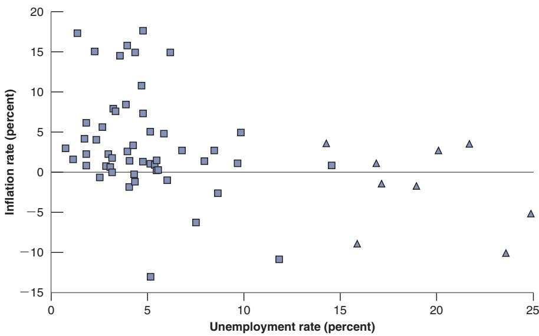
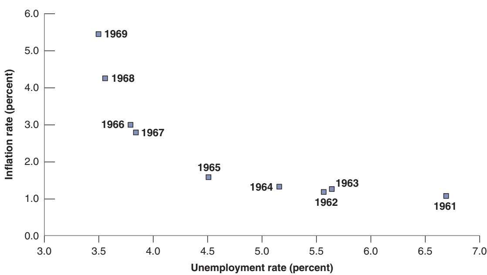
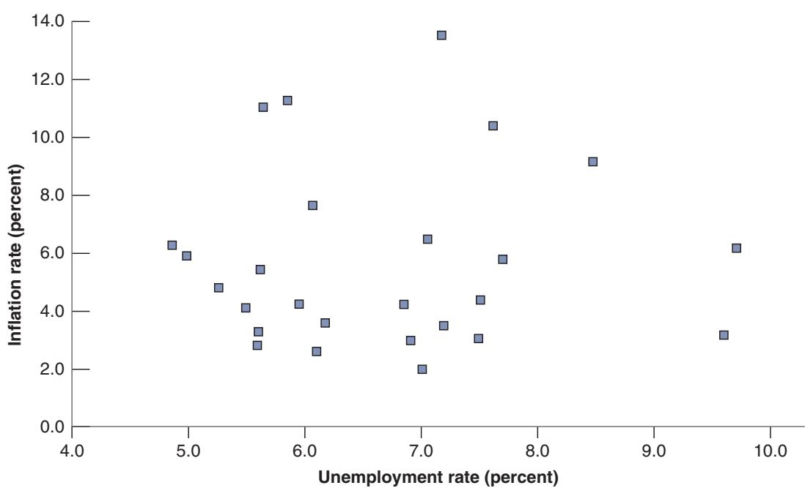
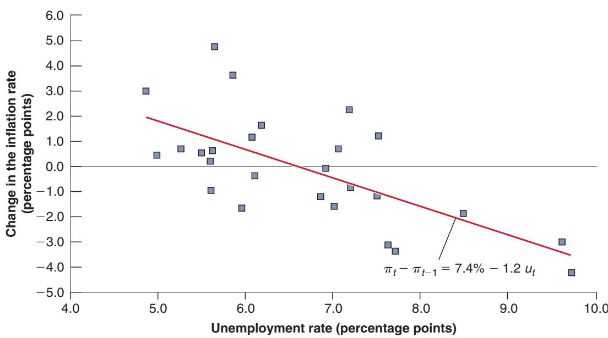
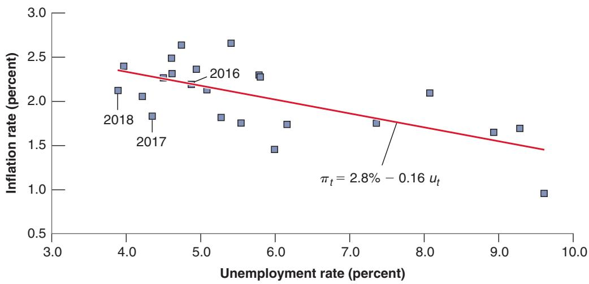

# The Phillips Curve, the Natural Rate of Unemployment, and Inflation

n 1958, A. W. Phillips drew a diagram plotting the inflation rate against the unemployment rate in the United Kingdom for each year from 1861 to 1957. He found clear evidence of an inverse relation between inflation and unemployment. When unemployment was low, inflation was high, and when unemployment was high, inflation was low, often even negative.

Two years later, two US economists, Paul Samuelson and Robert Solow, replicated Phillips’s exercise for the United States, using data from 1900 to 1960. Figure 8-1 reproduces their findings using consumer price index (CPI) inflation as a measure of the inflation rate. Apart from the period of high unemployment during the 1930s (the years from 1931 to 1939 are denoted by triangles and are well to the right of the other points in the figure), there was a clear negative relation between inflation and unemployment in the United States. This relation, which Samuelson and Solow labeled the Phillips curve, rapidly became central to macroeconomic thinking and policy. It appeared to imply that countries could choose between different combinations of unemployment and inflation. A country could achieve low unemployment if it were willing to tolerate higher inflation, or it could achieve price level stability—zero inflation—if it were willing to tolerate higher unemployment. Much of the discussion about macroeconomic policy became a discussion about which point to choose on the Phillips curve.

A. W. Phillips was a New Zealander who taught at the London School of Economics. He had been, among other things, a crocodile hunter in his youth. He also built a hydraulic machine to describe the behavior of the macroeconomy. A working version of the machine is still on display in Cambridge, England.

During the 1970s, however, this relation broke down. In the United States and most OECD countries, there was both high inflation and high unemployment, clearly contradicting the original Phillips curve. A relation reappeared, but as a relation between the change in the inflation rate and the unemployment rate. In the 1990s, the relation changed once again, and the old relation between inflation and unemployment reappeared. The purpose of this chapter is to explore these mutations of the Phillips curve and, more generally, to understand the relation between inflation and unemployment. We shall derive the Phillips curve from the model of the labor market we saw in Chapter 7. And you will see how the mutations of the Phillips curve have come from changes in the way people and firms have formed expectations.

The chapter has four sections:

Section 8-1 shows how the model of the labor market we saw previously implies a relation between inflation, expected inflation, and unemployment.

Section 8-2 uses this relation to interpret the mutations of the Phillips curve over time.

## Figure 8-1

Inflation versus Unemployment in the United States, 1900–1960

During the period 1900–1960 in the United States, a low unemployment rate was typically associated with a high inflation rate, and a high unemployment rate was typically associated with a low or negative inflation rate.

Source: Based on Historical Statistics of the United States. http://hsus.cambridge.org/ HSUSWeb/index.do.

  
Section 8-3 shows the relation between the Phillips curve and the natural rate of unemployment.  
Section 8-4 further discusses the relation between unemployment and inflation across countries and over time.

If you remember a basic message from this chapter, it should be: Low unemployment puts upward pressure on inflation, but the form of the relation depends very much on how people and firms form expectations.

## 8-1 INFLATION, EXPECTED INFLATION, AND UNEMPLOYMENT

In Chapter 7, we derived the following equation for wage determination (equation (7.1)):

$$
W = P ^ {e} F (u, z)
$$

The nominal wage W, set by wage setters, depends on the expected price level, Pe, the unemployment rate, u, and a variable, z, that captures all the other factors that affect wage determination, from unemployment benefits to the form of collective bargaining.

It will be convenient to assume a specific form for the function, F:

$$
F (u, z) = 1 - \alpha u + z
$$

This captures the notion that the higher the unemployment rate, the lower the nominal wage; and the higher z (for example, the more generous unemployment benefits are), the higher the nominal wage. The parameter a (the Greek lowercase letter alpha) captures the strength of the effect of unemployment on the wage. Replacing the function, F, by this specific form in the equation above gives:

$$
W = P ^ {e} (1 - \alpha u + z)
$$

Also in Chapter 7, we derived the following equation for price determination (equation (7.3)):

$$
P = (1 + m) W
$$

The price, P, set by firms (equivalently, the price level) is equal to the nominal wage, W, times 1 plus the markup, m.

We then used these two relations together with the additional assumption that the actual price level was equal to the expected price level. Under this additional assumption, we then derived the natural rate of unemployment. We now explore what happens when we do not impose this additional assumption.

Replacing the nominal wage in the second equation by its expression from the first gives:

$$
P = P ^ {e} (1 + m) (1 - \alpha u + z)\tag{8.1}
$$

This gives us a relation between the price level, the expected price level, and the unemployment rate.

Let $\pi$ denote the inflation rate and $\pi ^ { e }$ the expected inflation rate. Then equation (8.1) can be rewritten as a relation between inflation, expected inflation, and the unemployment rate:

$$
\pi = \pi^ {e} + (m + z) - \alpha u\tag{8.2}
$$

Deriving equation (8.2) from equation (8.1) is not difficult, but it is tedious, so it is left to an appendix at the end of this chapter. Equation (8.2) is one of the most important equations in macroeconomics. It is important that you understand each of the effects at work:

■ An increase in expected inflation, $\pi ^ { e } ,$ , leads to an increase in actual inflation, $\pi .$

To see why, start from equation (8.1). An increase in the expected price level Pe leads, one for one, to an increase in the actual price level, P: If wage setters expect a higher price level, they set a higher nominal wage, which leads in turn to an increase in the price level.

Now note that, given last period’s price level, a higher price level this period implies a higher rate of increase in the price level from last period to this period— that is, higher inflation. Similarly, given last period’s price level, a higher expected price level this period implies a higher expected rate of increase in the price level from last period to this period—that is, higher expected inflation. Thus the fact that an increase in the expected price level leads to an increase in the actual price level can be restated as: An increase in expected inflation leads to an increase in inflation.

■ Given expected inflation, $\pi ^ { e } ,$ an increase in the markup, m, or an increase in the factors that affect wage determination—an increase in z—leads to an increase in actual inflation, $\pi .$ From equation (8.1): Given the expected price level, $P ^ { e } ,$ , an increase in either m or z increases the price level, P. Using the same argument as in the previous bullet to restate this proposition in terms of inflation and expected inflation: Given expected inflation, $\pi ^ { e }$ , an increase in either m or z leads to an increase in inflation p.

■ Given expected inflation, $\pi ^ { e }$ , a decrease in the unemployment rate, u, leads to an increase in actual inflation p.

From equation (8.1): Given the expected price level, $P ^ { e } ,$ a decrease in the unemployment rate, u, leads to a higher nominal wage, which leads to a higher price level, P. Restating this in terms of inflation and expected inflation: Given expected inflation, $\pi ^ { e }$ , an increase in the unemployment rate, u, leads to an increase in inflation, p.

We need to take one more step before we return to a discussion of the Phillips curve. When we look at movements in inflation and unemployment in the rest of the chapter, it will be convenient to use time indexes so that we can refer to variables such as inflation, expected inflation, or unemployment in a specific year. So we rewrite equation (8.2) as:

$$
\pi_ {t} = \pi_ {t} ^ {e} + (m + z) - \alpha u _ {t}\tag{8.3}
$$

The variables $\pi _ { t } , \pi _ { t } ^ { e } ,$ , and $u _ { t }$ refer to inflation, expected inflation, and unemployment in year t. Note that there are no time indexes on m and z. This is because although m and z may move over time, they are likely to move slowly, especially relative to movement in inflation and unemployment. Thus, for the moment, we shall treat them as constant.

Equipped with equation (8.3), we can now return to the Phillips curve and its mutations.

## 8-2 THE PHILLIPS CURVE AND ITS MUTATIONS

Let’s start with the relation between unemployment and inflation as it was first discovered by Phillips, Samuelson, and Solow.

## The Original Phillips Curve

Assume that inflation varies from year to year around some value p. Assume also that inflation is not persistent, so that inflation this year is not a good predictor of inflation next year. This happens to be a good characterization of the behavior of inflation over the period that Phillips or Solow and Samuelson were studying. In such an environment, it makes sense for wage setters in particular to expect that, whatever inflation was last year, inflation this year will simply be equal to p. In this case, $\pi _ { t } ^ { e } = \overline { { \pi } }$ and equation (8.3) becomes:

$$
\pi_ {t} = \overline {{\pi}} + (m + z) - \alpha u _ {t}\tag{8.4}
$$

In this case, we should observe a negative relation between unemployment and inflation. This is precisely the negative relation between unemployment and inflation that Phillips found for the United Kingdom and Solow and Samuelson found for the United States. When unemployment was high, inflation was low, even sometimes negative. When unemployment was low, inflation was positive.

When these findings were published, they suggested that policymakers faced a tradeoff between inflation and unemployment. If they were willing to accept more inflation, they could achieve lower unemployment. This looked like an attractive trade-off, and starting in the early 1960s, US macroeconomic policy aimed at steadily decreasing unemployment. Figure 8-2 plots the combinations of the inflation rate and the unemployment rate in the United States for each year from 1961 to 1969. Note how well the negative relation between unemployment and inflation corresponding to equation (8.4) held during the long economic expansion that lasted throughout most of the 1960s. From 1961 to 1969, the unemployment rate declined steadily from 6.8% to 3.4%, and the inflation rate steadily increased, from 1.0% to 5.5%. Put informally, the US economy moved up along the Phillips curve. It indeed appeared that, if policymakers were willing to accept higher inflation, they could achieve lower unemployment.

## The De-anchoring of Expectations

Around 1970, however, the relation between the inflation rate and the unemployment rate, so clear in Figure 8-2, broke down. Figure 8-3 shows the combination of the inflation rate and the unemployment rate in the United States for each year from 1970 to

  
Figure 8-2  
Inflation versus Unemployment in the United States, 1961–1969  
The steady decline in the US unemployment rate throughout the 1960s was associated with a steady increase in the inflation rate.  
Source: FRED: Series UNRATE, CPIAUSCL

1995. The points are scattered in a roughly symmetric cloud. There is no longer any visible relation between the unemployment rate and the inflation rate.

Why did the original Phillips curve vanish? Because wage setters changed the way they formed their expectations about inflation.

This change came from a change in the behavior of inflation. The rate of inflation became more persistent. High inflation in one year became more likely to be followed by high inflation the next year. As a result, people, when forming expectations, started to take into account the persistence of inflation, and this change in expectation formation changed the nature of the relation between unemployment and inflation. In macroeconomic jargon, expectations that had been anchored (i.e., roughly constant) became de-anchored.

  
Figure 8-3  
Inflation versus Unemployment in the United States, 1970–1995  
Beginning in 1970 in the United States, the relation between the unemployment rate and the inflation rate disappeared.  
Source: FRED: UNRATE, CPIAUSCL

Let’s look at the argument in the previous paragraph more closely. Suppose expectations of inflation are formed according to:

$$
\pi_ {t} ^ {e} = (1 - \theta) \overline {{\pi}} + \theta \pi_ {t - 1}\tag{8.5}
$$

In words: Expected inflation this year depends partly on a constant value, p, with weight 1 - u, and partly on inflation last year, which we denote by $\pi _ { t - 1 }$ , with weight u. The higher the value of u, the more last year’s inflation leads workers and firms to revise their expectations of what inflation will be this year, and so the higher the expected inflation rate.

We can then think of what happened in the 1970s as an increase in the value of u over time:

Go back to Figure 8-2 and look at the points corresponding to 1966 to 1969. If you had been a worker in 1969, what would you have assumed inflation was going to be in 1970? What nominal wage increase would you have asked for?

■ So long as inflation was stable, it was reasonable for workers and firms to just ignore past inflation and to assume a constant value for inflation. For the period that Phillips and Samuelson and Solow had looked at, u was close to zero and expectations were roughly given by $\pi ^ { e } = \overline { { \pi } }$ . The Phillips curve was given by equation (8.4).

■ But as inflation started to increase, workers and firms started changing the way they formed expectations. They started assuming that, if inflation had been high last year, it was likely to be high this year as well. The parameter u, the effect of last year’s inflation rate on this year’s expected inflation rate, increased. The evidence suggests that, by the mid-1970s, people expected this year’s inflation rate to be the same as last year’s inflation rate—in other words, that u was now equal to 1.

Now turn to the implications of different values of u for the relation between inflation and unemployment. Substitute equation (8.5) for the value of $\pi _ { t } ^ { e }$ into equation (8.2): πe

$$
\pi_ {t} = \overbrace {(1 - \theta) \overline {{\pi}} + \theta \pi_ {t - 1}} ^ {\pi^ {e}} + (m + z) - \alpha u _ {t}
$$

■ When u equals zero, we get the original Phillips curve, a relation between the inflation rate and the unemployment rate:

$$
\pi_ {t} = \overline {{\pi}} + (m + z) - \alpha u _ {t}
$$

■ When u is positive, the inflation rate depends not only on the unemployment rate but also on last year’s inflation rate:

$$
\pi_ {t} = \left[ (1 - \theta) \overline {{\pi}} + (m + z) \right] + \theta \pi_ {t - 1} - \alpha u _ {t}
$$

一 When u equals 1, the relation becomes (moving last year’s inflation rate to the left side of the equation)

$$
\pi_ {t} - \pi_ {t - 1} = (m + z) - \alpha u _ {t}\tag{8.6}
$$

So, when $\theta = 1$ , the unemployment rate affects not the inflation rate but rather the change in the inflation rate. High unemployment leads to decreasing inflation; low unemployment leads to increasing inflation.

This discussion is the key to what happened after 1970. As u increased from 0 to 1, the simple relation between the unemployment rate and the inflation rate disappeared. This disappearance is what we saw in Figure 8-3.

But a new relation emerged, this time between the unemployment rate and the change in the inflation rate, as predicted by equation (8.6). This relation is shown in Figure 8-4, which plots the change in the inflation rate versus the unemployment rate observed for each year from 1970 to 1995 and shows a clear negative relation between the unemployment and the change in the inflation rate. The figure also plots the relation that best fits the scatter of points for that period and is given by:

  
Figure 8-4  
Change in Inflation versus Unemployment in the United States, 1970–1995  
From 1970 to 1995, there was a negative relation between the unemployment rate and the change in the inflation rate in the United States.  
Source: FRED: CPIAUCSL, UNRATE

$$
\pi_t - \pi_{t-1} = 7.4\% - 1.2 u_t\tag{8.7}
$$

The lower the unemployment rate, the larger is the increase in the inflation rate. We shall return to this equation below.

So, instead of a relation between the inflation rate and the unemployment rate, the Phillips curve took the form of a relation between the change in the inflation rate and the unemployment rate. To distinguish it from the original Phillips curve, it became known as the accelerationist Phillips curve (to indicate that a low unemployment rate leads to an increase in the inflation rate and thus an acceleration of the price level).

## The Re-anchoring of Expectations

Accelerationist Phillips curve: Low $u _ { t }$ 1 Increasing inflation.

In the 1990s, the Phillips curve relation changed yet again, because of a change in monetary policy: From the early 1980s on, many central banks, including the Fed, increasingly emphasized their commitment to maintaining low and stable inflation. Many of them indicated that they would maintain inflation close to a given target, typically around 2%.

By the mid-1990s, the Fed had largely achieved its goal. Inflation had been stable for more than a decade, and so the way people formed expectations changed again. Even if inflation was higher than the target in a given year, people assumed that the central bank would take measures to return inflation to its target value in the future, and expected inflation became roughly constant, equal to the target inflation set by the central bank. Expectations of inflation that had become de-anchored during the 1970s and the 1980s became re-anchored, reacting little or not at all to movements in actual inflation.

## Figure 8-5

Inflation versus Unemployment in the United States, 1996–2018

Since the mid-1990s, the Phillips curve has taken the form of a relation between the inflation rate and the unemployment rate.

Source: FRED: CPILFESL, UNRATE

In terms of equation (8.5), u went back down to zero, and the Phillips curve returned to the relation between inflation and unemployment given by equation (8.4):

$$
\pi_ {t} = \overline {{\pi}} + (m + z) - \alpha u _ {t}
$$

You can see the negative relation between inflation and unemployment from 1996 to 2018 in Figure 8-5. Higher unemployment has been associated with lower inflation, lower unemployment associated with higher inflation. The figure also plots the line that best fits the scatter of points for the period 1996–2018 and is given by:

$$
\pi_t = 2.8\% - 0.16 u_t\tag{8.8}
$$

So are we back to the original Phillips curve? Yes, but having learned an important lesson.

The Phillips curve relation is a relation between inflation, expected inflation, and unemployment. What this implies for the relation between inflation and unemployment thus depends very much on how people form expectations. And this in turn depends very much on the behavior of inflation.

Today, because inflation has been stable for a long time, expectations of inflation are roughly constant and the Phillips curve again takes the form of a relation between the inflation rate and the unemployment rate. But we know that, were inflation to deviate again substantially from target, the way people would form expectations would change, and the relation between inflation and unemployment would change again, perhaps returning to the accelerationist Phillips curve of the 1970s and 1980s.

## 8-3 THE PHILLIPS CURVE AND THE NATURAL RATE OF UNEMPLOYMENT

The history of the Phillips curve is closely related to the discovery of the concept of the natural rate of unemployment that we introduced in Chapter 7.

The original Phillips curve was interpreted at the time as implying that there was no such thing as a natural unemployment rate. If policymakers were willing to tolerate a higher inflation rate, they could maintain a lower unemployment rate forever. And, indeed, throughout the 1960s, it looked as though they were right.
