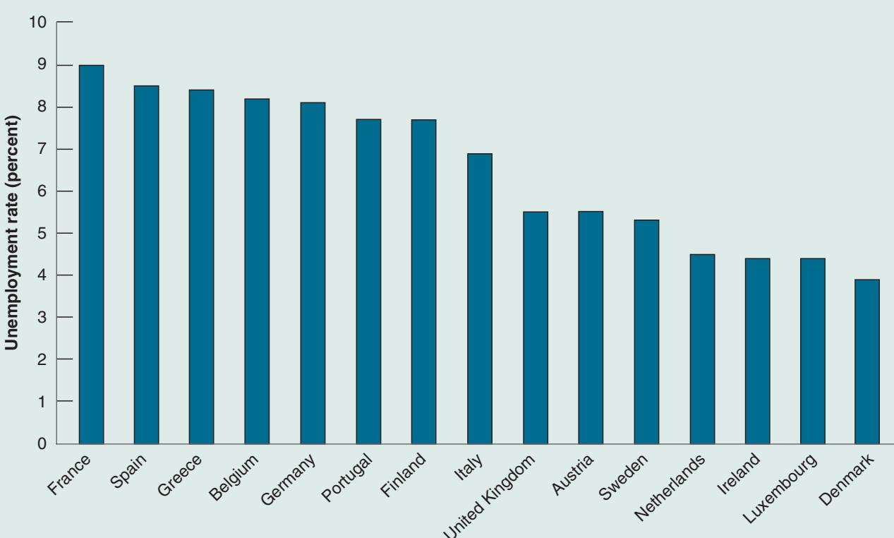
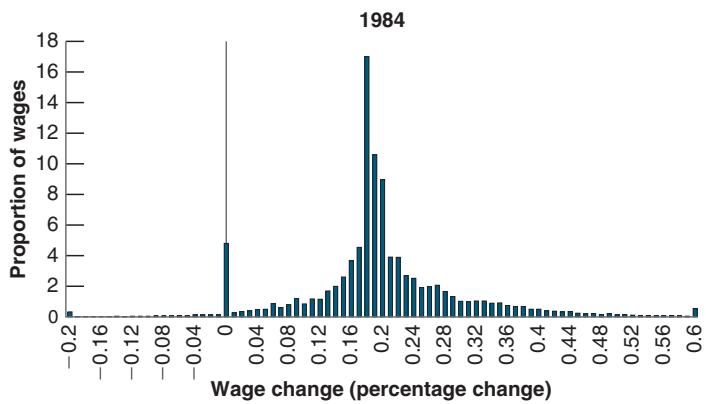
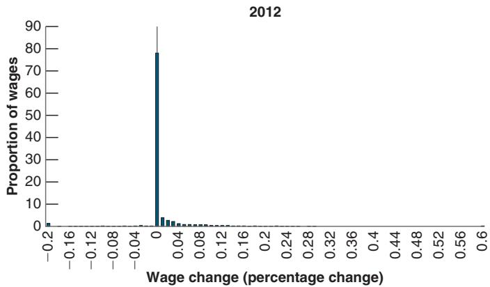

# Theory ahead of Facts: Milton Friedman and Edmund Phelps

Economists are usually not good at predicting major changes before they happen, and most of their insights are derived after the fact. Here is an exception.

In the late 1960s—precisely as the original Phillips curve was working like a charm—two economists, Milton Friedman and Edmund Phelps, argued that the appearance of a trade-off between inflation and unemployment was an illusion.

Here are a few quotes from Milton Friedman about the Phillips curve:

“Implicitly, Phillips wrote his article for a world in which everyone anticipated that nominal prices would be stable and in which this anticipation remained unshaken and immutable whatever happened to actual prices and wages. Suppose, by contrast, that everyone anticipates that prices will rise at a rate of more than 75% a year—as, for example, Brazilians did a few years ago. Then, wages must rise at that rate simply to keep real wages unchanged. An excess supply of labor [by this, Friedman means high unemployment] will be reflected in a less rapid rise in nominal wages than in anticipated prices, not in an absolute decline in wages.”

## He went on:

“To state [my] conclusion differently, there is always a temporary trade-off between inflation and unemployment; there is no permanent trade-off. The temporary trade-off comes not from inflation per se, but from a rising rate of inflation.”

He then tried to guess how much longer the apparent trade-off between inflation and unemployment would last in the United States:

“But how long, you will say, is ‘temporary’?... I can at most venture a personal judgment, based on some examination of the historical evidence, that the initial effect of a higher and unanticipated rate of inflation lasts for something like two to five years; that this initial effect then begins to be reversed; and that a full adjustment to the new rate of inflation takes as long for employment as for interest rates, say, a couple of decades.”

Friedman could not have been more right. A few years later, the original Phillips curve started to disappear, in exactly the way Friedman had predicted.1

In the late 1960s, however, although the original Phillips curve still gave a good description of the data, two economists, Milton Friedman and Edmund Phelps, questioned the existence of such a trade-off between unemployment and inflation. They questioned it on logical grounds, arguing that such a trade-off could exist only if wage setters systematically underpredicted inflation and that they were unlikely to make the same mistake forever. Friedman and Phelps also argued that if the government attempted to sustain lower unemployment by accepting higher inflation, the trade-off would ultimately disappear; the unemployment rate could not be sustained below a certain level that they called the natural rate of unemployment. Events proved them right, and, as we saw in Figure 8-3, the trade-off between the inflation rate and the unemployment rate indeed disappeared. (See the Focus Box “Theory ahead of Facts: Milton Friedman and Edmund Phelps.”) Today, most economists accept the notion of a natural rate of unemployment—that is, subject to many caveats we shall see in the next section.

Friedman was awarded theb Nobel Prize in 1976. Phelps was awarded the Nobel Prize in 2006.

Let’s make explicit the connection between the Phillips curve and the natural rate of unemployment.

By definition (see Chapter 7), the natural rate of unemployment is the unemployment rate at which the actual price level is equal to the expected price level. Equivalently, and more conveniently here, the natural rate of unemployment is the unemployment rate such that the actual inflation rate is equal to the expected inflation rate. Denote the natural unemployment rate by $u _ { n }$ (n stands for “natural”). Then, imposing the condition that actual inflation and expected inflation be the same $( \pi = \pi ^ { e } )$ in equation (8.3) gives:

$$
0 = (m + z) - \alpha u _ {n}
$$

Note that under our assump-

tion that m and z are constant, the natural rate is also constant, so we can drop the time index. We shall return to a discussion of what happens if m and z change over time.

Solving for the natural rate $u _ { n } ,$

$$
u _ {n} = \frac {m + z}{\alpha}\tag{8.9}
$$

The higher the markup, m, or the higher the factors that affect wage setting, z, the higher is the natural rate of unemployment.

Now rewrite equation (8.3) as

$$
\pi_ {t} - \pi_ {t} ^ {e} = - \alpha \bigg (u _ {t} - \frac {m + z}{\alpha} \bigg)
$$

Note from equation (8.9) that the fraction on the right side is equal to $u _ { n } ,$ , so we can rewrite the equation as

$$
\pi_ {t} - \pi_ {t} ^ {e} = - \alpha (u _ {t} - u _ {n})\tag{8.10}
$$

This is an important equation, and one you must remember. It links the inflation rate, the expected inflation rate, and the deviation of the unemployment rate from the natural rate. It says that, if unemployment is at the natural rate, then inflation will be equal to expected inflation. If unemployment is below the natural rate, inflation will be higher than expected. If unemployment is instead above the natural rate, inflation will be lower than expected.

The equation also gives us a way of getting an estimate of the natural rate.

Take, for example, the period from 1970 to 1995, during which $\pi ^ { e }$ was equal to last year’s inflation rate, $\pi _ { t - 1 }$ , so the natural rate of unemployment was the rate at which $\pi _ { t } - \pi _ { t } ^ { e } = \pi _ { t } - \pi _ { t - 1 } = 0$ . Using equation (8.7) and putting $\pi _ { t } - \pi _ { t - 1 } { = } 0$ , the natural rate was thus given by:

$$
0 = 7.4\% - 1.2u_n \Rightarrow u_n = 7.4\% / 1.2 = 6.2\%
$$

The natural rate was thus equal to roughly 6.2%. Why “roughly”? Because, as you can see from Figure 8-3, the fit of the regression is not tight, so we cannot be sure about the exact coefficients in the estimated equation. A more appropriate statement may be that the natural rate was probably between 6% and 7% during that period.

Turn to the Phillips curve relation that has prevailed since the mid-1990s. From survey evidence, expected inflation remained close to the target inflation of the Fed, 2%, so the natural rate of unemployment during this period has been the rate of unemployment at which inflation was equal to 2%. Using equation (8.8) and putting $\pi _ { t } = 2 \%$ gives:

Suppose, for example, that the true coefficient on the unemployment rate was 0.20 instead of 0.16. This would imply a natural unemployment rate of $0 . 8 / 0 . 2 = 4 \%$

$$
2\% = 2.8\% - 0.16u_n \Rightarrow u_n = 0.8 / 0.16 = 5.0\%
$$

This suggests that the natural unemployment rate during this period has been roughly 5.0%. Again, the “roughly” qualification is important. The fit of the regression line is not very good, and we cannot be sure of the exact values of the coefficients. By implication, we cannot be sure of the exact value of the natural rate. This uncertainty has important implications for monetary policy, a point to which we shall return later in the book.

## 8-4 A SUMMARY AND MANY WARNINGS

Let’s take stock of what we have learned:

The relation between inflation and unemployment depends on how wage setters form expectations of inflation.

■ If expectations are anchored, as they were in the 1960s and have been again since the mid-1990s, then the Phillips curve takes the form of a relation between inflation and unemployment. Inflation is higher than expected if unemployment is below the natural rate; it is lower than expected if unemployment is above the natural rate.

■ If, however, expectations are unanchored—as they became in the 1970s and 1980s—and expected inflation this year is equal to inflation last year, the Phillips curve relation becomes a relation between the change in inflation and unemployment. Inflation increases if unemployment is below the natural rate, and it decreases if unemployment is above the natural rate.

In short, there is a relation between inflation and unemployment, but it is a complex one. And, unfortunately, further warnings are in order: The natural unemployment rate itself moves over time; it varies across countries; the relation between unemployment and inflation can completely disappear when inflation becomes very high; and it can disappear when inflation becomes low and turns into deflation. Let’s take these issues in turn.

## Variations in the Natural Rate over Time

In estimating equation (8.7) or equation (8.8), we implicitly treated m + z as a constant. But there are good reasons to believe that m and z vary over time. The degree of monopoly power of firms, the costs of inputs other than labor, the structure of wage bargaining, the system of unemployment benefits, and so on are likely to change over time, leading to changes in either m or z and, by implication, changes in the natural rate of unemployment.

Indeed, we saw earlier that the estimate for the natural rate of unemployment for the period 1970–1995 was 6.2%, but the estimate for the period starting in 1995 was down to 5%. And, even during this more recent period, it is not clear that it has remained constant. As you can see from Figure 8-5, the unemployment rate has been lower than 5% since 2016, and yet inflation has remained close to 2%. As I am writing, there is an intense debate on whether the natural rate today is actually lower than 5%, perhaps as low as 3.5%. Why this might be is explored in the Focus Box “Changes in the US Natural Rate of Unemployment since 1990.”

Will the natural rate of unemployment remain low in the future? Globalization, aging, prisons, temporary help agencies, the growth of platform companies like Uber, and the increasing role of the internet are probably all here to stay, suggesting that the natural rate will indeed remain low for the foreseeable future.

## Variations in the Natural Unemployment Rate across Countries

Recall from equation (8.9) that the natural rate of unemployment depends on all the factors that affect wage setting, represented by the catchall variable, z; the markup set by firms, m; and the response of inflation to unemployment, represented by a. If these factors differ across countries, there is no reason to expect all countries to have the same natural rate of unemployment. And natural rates indeed differ across countries, sometimes considerably.

Take, for example, the unemployment rate in the euro area, where it has averaged close to 10% since 1990. A high unemployment rate for a few years may well reflect a deviation of the unemployment rate from the natural rate. A high average unemployment rate for 29 years almost surely reflects a high natural rate. This tells us where we should look for explanations, namely in the factors determining the wage-setting and the price-setting relations.

Is it easy to identify the relevant factors? One often hears the statement that one of the main problems of Europe is its labor market rigidities. These rigidities, the

## Changes in the US Natural Rate of Unemployment since 1990

As we discussed in the text, the natural rate of unemployment appears to have decreased in the United States from 6% or 7% in the 1970s and 1980s to perhaps less than 4% today. Researchers have offered a number of explanations.

The fact that firms can more easily move some of their operations abroad makes them stronger when bargaining with their workers. Unions are becoming weaker. The unionization rate in the United States, which stood at 25% in the mid-1970s, is around 10% today. As we saw in Chapter 7, weaker bargaining power on the part of workers is likely to lead to a lower natural rate of unemployment.

The nature of the labor market has changed. The number of workers under “alternative employment arrangements” (this includes on-call workers, temporary help agencies, independent contractors) has steadily increased, and now accounts for around 10% of the labor force. These workers are likely to have little bargaining power. The growth of alternative arrangements also allows many workers to look for jobs while being employed rather than unemployed. The increasing role of internet-based job sites has made the matching of jobs and workers easier. All these changes lead to lower unemployment.

Some of the other explanations may surprise you. For example, researchers have also pointed to:

The aging of the US population. The proportion of young workers (those between the ages of 16 and 24) has fallen from 24% in 1980 to 15% today. This reflects the end of the baby boom, which ended in the mid-1960s. Young workers tend to start their working life by going from job to job and typically have a higher unemployment rate. A decrease in the proportion of young workers leads to a decrease in the overall unemployment rate.

An increase in the incarceration rate. The proportion of the US population in prison or in jail has tripled in the last 40 years. In 1980, 0.3% of the US population of working age was in prison; today the proportion is 0.9%. Because many of those in prison would likely have been unemployed were they not incarcerated, this is likely to have decreased the unemployment rate.

The increase in the number of workers on disability. A relaxation of eligibility criteria since 1984 has led to a steady increase in the number of workers receiving disability insurance, from 2.2% of the working-age population in 1984 to 3.9% today. It is again likely that, absent changes in the rules, some of the workers now on disability insurance would have been unemployed instead.

During the 2008–2009 crisis, there was the worry that the large increase in the actual unemployment rate (close to 10% in 2010) might eventually translate into an increase in the natural unemployment rate. The mechanism through which this might happen is known as hysteresis (in economics, hysteresis is used to mean that, “after a shock, a variable does not return to its initial value, even when the shock has gone away”). Workers who have been unemployed for a long time may lose their skills, or their morale, and become, in effect, unemployable, leading to a higher natural rate. This was a relevant concern: In 2010, the average duration of unemployment was 33 weeks, an exceptionally high number by historical standards. Of the unemployed, 43% had been unemployed for more than six months, and 28% for more than a year. When the economy picked up, how many of them would be scarred by their unemployment experience and hard to reemploy? Today, the verdict seems to be in. The return to a very low unemployment rate without high inflation and the recovery in labor force participation suggest that this worry was not justified, at least at the macroeconomic level.

argument goes, are responsible for its high unemployment. Although there is some truth to this statement, the reality is more complex. The Focus Box “What Explains European Unemployment?” discusses these issues further.

## High Inflation and the Phillips Curve

Recall how, in the 1970s, the US Phillips curve changed as inflation became more persistent and wage setters changed the way they formed inflation expectations. The lesson is a general one. The relation between unemployment and inflation is likely to change with the level and persistence of inflation. Evidence from countries with high inflation confirms this. Not only does the way workers and firms form their expectations change, but so do institutional arrangements.

## What Explains European Unemployment?

What do critics have in mind when they talk about the “labor market rigidities” afflicting Europe? They have in mind in particular:

A generous system of unemployment insurance. The replacement rate—that is, the ratio of unemployment benefits to the after-tax wage—is often high in Europe, and the duration of benefits—the period during which the unemployed are entitled to receive benefits—often runs in years.

Unemployment insurance is clearly desirable. But generous benefits are likely to increase unemployment in at least two ways. They decrease the incentives the unemployed have to search for jobs. They may also increase the wage that firms have to pay. Recall our discussion of efficiency wages in Chapter 7. The higher unemployment benefits are, the higher the wages firms must pay to motivate and keep workers.

A high degree of employment protection. By employment protection, economists have in mind the set of rules that increase the cost of layoffs for firms. These include high severance payments, the need for firms to justify layoffs, and the possibility for workers to appeal the decision and have it reversed.

The purpose of employment protection is to decrease layoffs, and thus to protect workers from the risk of unemployment. It indeed does that. What it also does, however, is make firms more reluctant to hire workers and thus make it harder for the unemployed to get jobs. The evidence suggests that, although employment protection does not necessarily increase unemployment, it changes its nature. The flows in and out of unemployment decrease, but the average duration of unemployment increases. Long durations increase the risk that the unemployed lose skills and morale, decreasing their employability.

Minimum wages. Most European countries have national minimum wages. And in some countries, the ratio of the minimum wage to the median wage can be quite high. High minimum wages clearly risk limiting employment for the least-skilled workers, thus increasing their unemployment rate.

Bargaining rules. In most European countries, labor contracts are subject to extension agreements. A contract agreed to by a subset of firms and unions can be automatically extended to all firms in the sector. This considerably reinforces the bargaining power of unions because it reduces the scope for competition by nonunionized firms. As we saw in Chapter 7, stronger bargaining power on the part of the unions may result in higher unemployment. Higher unemployment is the economic mechanism through which the higher demands of workers are reconciled with the wages paid by firms.

Do these labor market institutions really explain high unemployment in Europe? Is the case open and shut? Not quite. Here it is important to recall two important facts.

Fact 1: Unemployment was not always high in Europe. In the 1960s, the unemployment rate in the four major continental European countries (France, Germany, Italy, and Spain) was lower than that in the United States, around 2% to 3%. US economists would cross the ocean to study the “European unemployment miracle”! The natural rate in these countries today is around 8% to 9%. How do we explain this increase?

One hypothesis is that institutions were different then, and that labor market rigidities have appeared only in the last 40 years. This turns out not to be the case, however. It is true that, in response to the adverse shocks of the 1970s (in particular two recessions following large increases in the price of oil), many European governments increased the generosity of unemployment insurance and the degree of employment protection. But even in the 1960s, European labor market institutions looked nothing like US labor market institutions. Social protection was much higher in Europe; yet unemployment was lower.

A more convincing line of explanation focuses on the interaction between institutions and shocks. Some labor market institutions may be benign in some environments, yet costly in others. Take employment protection. If competition between firms is limited, the need to adjust employment in each firm may be limited as well, and so the cost of employment protection may be low. But if competition, either from other domestic firms or from foreign firms, increases, the cost of employment protection may become high. Firms that cannot adjust their labor force quickly may be unable to compete and go out of business.

Fact 2: There are large differences between natural rates across European countries. This is shown in Figure 1, which gives the unemployment rate for 15 European countries (the 15 members of the European Union before the increase in membership to 27) in 2006. I chose 2006 for two reasons: First, after 2006, the financial crisis triggered a large increase in unemployment above the natural rate; second, in most of these countries, inflation was stable and low in 2006, suggesting that the unemployment rate was roughly equal to the natural rate.

As you can see, the unemployment rate was indeed high in the four large continental countries: France, Spain, Germany, and Italy. (The German natural unemployment rate appears to have decreased a lot since then; in 2018, the actual unemployment rate was 3.5%, with little sign of inflation—another example of changes in the natural rate over time.)

But note also how low the unemployment rate was in some of the other countries, in particular Denmark, Ireland, and the Netherlands. Did these low unemployment countries have low benefits, low employment protection, and weak unions? Things are unfortunately not so simple. Spain has a generous safety net and has had a very high average unemployment rate. But so does the Netherlands, which has low average unemployment.

So, what is one to conclude? An emerging consensus among economists is that the devil is in the details. Generous social protection is consistent with low unemployment, but

  
Figure 1

Unemployment Rates in 15 European Countries, 2006

Source: WEO database.

it must be provided efficiently. Unemployment benefits can be generous so long as the unemployed are induced to take jobs if jobs are available. Employment protection (e.g., in the form of generous severance payments) is consistent with low unemployment, so long as firms do not face the prospect of long administrative or judicial uncertainty when they lay off workers. Countries such as Denmark appear to have been more successful in achieving these goals. Creating incentives for the unemployed to take jobs and simplifying the rules of employment protection are on the reform agenda of many European governments. One may hope they will lead to a decrease in the natural rate in the future.

For more on European unemployment, read Olivier Blanchard, “European Unemployment: The Evolution of Facts and Ideas,” Economic Policy, 2006, 21(45): pp. 1–54.

When the inflation rate becomes high, inflation tends to become more variable. As a result, workers and firms become more reluctant to enter into labor contracts that set nominal wages for a long period of time. If inflation turns out higher than expected, real wages may plunge, and workers will suffer a large cut in their living standard. If inflation turns out lower than expected, real wages may sharply increase, firms may not be able to pay their workers, and some firms may go bankrupt.

For this reason, the terms of wage agreements change with the level of inflation. Nominal wages are set for shorter periods of time, down from a year to a month or even less. Wage indexation, which is a provision that automatically increases wages in line with inflation, becomes more prevalent.

These changes lead in turn to a stronger response of inflation to unemployment. To see this, an example based on wage indexation will help. Imagine an economy that has two types of labor contracts. A proportion l (the Greek lowercase letter lambda) of labor contracts is indexed. Nominal wages in those contracts move one-for-one with variations in the actual price level. A proportion $1 - \lambda$ of labor contracts is not indexed. Nominal wages are set on the basis of expected inflation.

Under this assumption, equation (8.10) becomes:

$$
\pi_ {t} = \left[ \lambda \pi_ {t} + (1 - \lambda) \pi_ {t} ^ {e} \right] - \alpha (u _ {t} - u _ {n})
$$

The term in brackets on the right reflects the fact that a proportion l of contracts is indexed and thus responds to actual inflation $\pi _ { t } ,$ and a proportion, $1 \ - \ \lambda ,$ , responds to expected inflation, $\pi _ { t } ^ { e } .$ . If we assume that this year’s expected inflation is equal to last year’s actual inflation, $\pi _ { t } ^ { e } = \pi _ { t - 1 }$ , we get:

$$
\pi_ {t} = \left[ \lambda \pi_ {t} + (1 - \lambda) \pi_ {t - 1} \right] - \alpha (u _ {t} - u _ {n})\tag{8.11}
$$

When $\lambda = 0$ , all wages are set on the basis of expected inflation—which is equal to last year’s inflation, $\pi _ { t - 1 }$ —and the equation reduces to:

$$
\pi_ {t} - \pi_ {t - 1} = - \alpha (u _ {t} - u _ {n})
$$

When l is positive, however, a proportion l of wages is set on the basis of actual inflation rather than expected inflation. To see what this implies, reorganize equation (8.11). Move the term in brackets to the left, factor $( 1 - \lambda )$ on the left of the equation, and divide both sides by $1 - \lambda$ to get:

$$
\pi_ {t} - \pi_ {t - 1} = - \frac {\alpha}{(1 - \lambda)} (u _ {t} - u _ {n})
$$

Wage indexation increases the effect of unemployment on inflation. The higher the proportion of wage contracts that are indexed—the higher l—the larger the effect the unemployment rate has on the change in inflation—the higher the coefficient $\alpha / ( 1 - \lambda )$ .

The intuition is as follows: Without wage indexation, lower unemployment increases wages, which in turn increase prices. But because wages do not respond to prices right away, there is no further increase in prices within the year. With wage indexation, however, an increase in prices leads to a further increase in wages within the year, which leads to a further increase in prices, and so on, so that the effect of unemployment on inflation within the year is higher.

If, and when, l gets close to 1—which is when most labor contracts allow for wage indexation—small changes in unemployment can lead to large changes in inflation. Put another way, there can be large changes in inflation with nearly no change in unemployment. This is what happens in countries where inflation is high. The relation between inflation and unemployment becomes more and more tenuous and eventually disappears altogether.

## Deflation and the Phillips Curve

We have just looked at what happens to the Phillips curve when inflation is high. Another issue is what happens when inflation is low and possibly negative—when there is deflation.

One motivation for asking this question is given by an aspect of Figure 8-1 we mentioned at the start of the chapter but then left aside. In that figure, note that the points corresponding to the 1930s (denoted by triangles) lie to the right of the others. Not only was unemployment unusually high—this is no surprise because we are looking at the years corresponding to the Great Depression—but, given the high unemployment rate, the inflation rate was surprisingly high. In other words, given the high unemployment rate, we would have expected not merely deflation, but a large rate of deflation. In fact, deflation was limited, and from 1934 to 1937, despite high unemployment, inflation actually turned positive.

  
Figure 8-6

  
Distribution of Wage Changes in Portugal, in Times of High and Low Inflation  
Source: Pedro Portugal, based on Portuguese household survey.

If $u _ { n }$ increases with u, then $\boldsymbol { u } - \boldsymbol { u } _ { n }$ may remain small, and thus downward pressure on inflation may also remain small, even if u is high.

How do we interpret this fact? There are two potential explanations.

One is that the Great Depression was associated with an increase not only in the actual unemployment rate but also in the natural unemployment rate. This seems unlikely. Most economic historians see the Great Depression primarily as the result of a large adverse shift in demand (think of a large shift to the left of the IS curve) leading to an increase in the actual unemployment rate over the natural rate of unemployment, rather than an increase in the natural rate of unemployment itself.

The other is that, when the economy experiences deflation, the Phillips curve relation breaks down. One possible reason is the reluctance of workers to accept decreases in their nominal wages. Workers may unwittingly accept a cut in their real wages that occurs when their nominal wages increase more slowly than inflation. However, they are likely to fight the same cut in their real wages if it results from an overt cut in their nominal wages. This mechanism was clearly at work in some countries during the financial crisis.

Figure 8-6, for example, plots the distribution of wage changes in Portugal in two different years: 1984 when the inflation rate was a high 27%, and 2012, when it was just 2.1%. Note how the distribution of wage changes is roughly symmetric in 1984, but bunched at zero in 2012, with nearly no negative wage changes. To the extent that this mechanism is at work, this implies that the Phillips curve relation between inflation and unemployment may disappear, or at least become weaker, when the economy is close to zero inflation.

## SUMMARY

Labor market equilibrium delivers a relation between inflation, expected inflation, and unemployment. Given unemployment, higher expected inflation leads to higher inflation. Given expected inflation, higher unemployment leads to lower inflation.

If expectations of inflation are anchored and expected inflation is roughly constant, the Phillips curve takes the form of a relation between the inflation rate and the unemployment rate. This is what Phillips in the United Kingdom and Solow and Samuelson in the United States discovered when they looked, in the late 1950s, at the joint behavior of unemployment and inflation.

As inflation became higher and more persistent in the 1970s, expectations of inflation became de-anchored, increasingly reflecting past inflation. The Phillips curve took the form of a relation between the change in the inflation rate and the unemployment rate. High unemployment led to decreasing inflation; low unemployment led to increasing inflation.

Starting in the 1980s, the Fed committed to keeping inflation low and stable. By the 1990s, expectations of inflation had become re-anchored, and expected inflation had become roughly constant. The Phillips curve became, again, a relation between the inflation rate and the unemployment rate.

The natural unemployment rate is the unemployment rate at which the inflation rate is equal to expected inflation. If expectations are anchored and expected inflation is equal to the target rate of the central bank, this implies that, at the natural unemployment rate, actual inflation is equal to the target rate. When the actual unemployment rate exceeds the natural rate of unemployment, the inflation rate is lower than the target rate; when the actual unemployment rate is less than the natural unemployment rate, the inflation rate is higher than the target rate.
