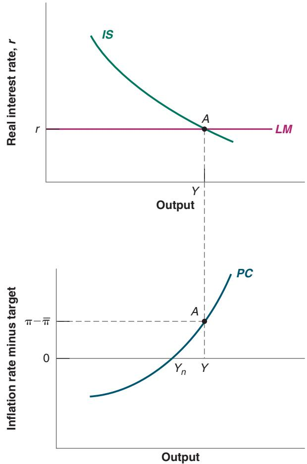

# From the Short to the Medium Run: The IS-LM-PC Model

n Chapters 3 through 6 we looked at equilibrium in the goods and financial markets and saw how, in the short run, output is determined by demand. In Chapters 7 and 8, we looked at equilibrium in the labor market and derived how unemployment affects inflation. We now put the two parts together to characterize the behavior of output, unemployment, and inflation, in both the short run and the medium run. When confronted with a macroeconomic question about a particular shock or a particular policy, this model, which we shall call the IS-LM-PC (PC for Phillips curve), is typically the model I start from. I hope you find it as useful as I do.

The chapter is organized as follows.

Section 9-1 develops the IS-LM-PC model.

Section 9-2 shows how the economy adjusts from its short-run equilibrium to its medium-run equilibrium.

Section 9-3 discusses complications and how things can go wrong.

Section 9-4 looks at the dynamic effects of fiscal consolidation.

Section 9-5 looks at the dynamic effects of an increase in the price of oil.

Section 9-6 concludes the chapter.

If you remember one basic message from this chapter, it should be: In the short run, demand determines output. In the medium run, with the help of policy, output returns to potential.

In Chapter 6, we looked at the implications of equilibrium in the goods and financial markets.

From equilibrium in the goods market, we derived the following equation (equation 6.5) for the behavior of output in the short run:

$$
Y = C (Y - T) + I (Y, r + x) + G\tag{9.1}
$$

In the short run, output is determined by demand. Demand is the sum of consumption, investment, and government spending. Consumption depends on disposable income, which is equal to income net of taxes. Investment depends on output and on the real borrowing rate. The real borrowing rate is the sum of real rate, r, chosen by the central bank, and a risk premium, x. Government spending is exogenous.

As we did in Chapter 6, we can draw the IS curve implied by equation (9.1) between output, Y, and the real rate, r, taking as given taxes T, the risk premium x, and government spending G. This is done in the top half of Figure 9-1. The IS curve is downward sloping: The lower the real rate, r, the higher the equilibrium level of output. The mechanism behind the relation should be familiar by now: A lower real rate increases investment. Higher investment leads to higher demand. Higher demand leads to higher output. The increase in output further increases consumption and investment, leading to a further increase in demand, and so on.c

From equilibrium in financial markets, we derived a flat LM curve, showing the real rate, r, chosen by the central bank. (We saw in Chapter 4 how, behind the scenes, the central bank adjusts the supply of money so as to achieve its desired interest rate.)

Figure 9-1

The IS-LM-PC Model: Output and Inflation

Top graph: A lower real rate leads to higher output. Bottom graph: Higher output leads to higher inflation.

It is drawn as the horizontal line at r in the top half of the figure. The intersection of the downward sloping IS curve and the horizontal LM curve gives us the equilibrium level of output in the short run.

From equilibrium in labor markets in Chapter 8, we derived the following equation (equation 8.10) for the relation between inflation and unemployment, a relation we called the Phillips curve (I am dropping the time indexes, which are not needed here):

$$
\pi - \pi^ {e} = - \alpha (u - u _ {n})\tag{9.2}
$$

When the unemployment rate is lower than the natural rate, inflation is higher than expected. If the unemployment rate is higher than the natural rate, inflation is lower than expected.

Given that the first relation (equation (9.1)) is in terms of output, we must express this Phillips curve relation in terms of output and inflation rather than unemployment and inflation. It is easy, but it takes a few steps.

Start by looking at the relation between the unemployment rate and employment. By definition, the unemployment rate is equal to unemployment divided by the labor force:

$$
u \equiv U / L = (L - N) / L = 1 - N / L
$$

where N denotes employment and L denotes the labor force. The first equality is simply the definition of the unemployment rate. The second equality follows from the definition of unemployment, and the third equality is obtained through simplification. The unemployment rate is equal to one minus the ratio of employment to the labor force. Reorganizing to express N as a function of u gives:

$$
N = L (1 - u)
$$

Employment is equal to the labor force times one minus the unemployment rate.

Turning to output, we shall maintain for the moment the simplifying assumption we made in Chapter 7, that output is equal to employment, so:

$$
Y = N = L (1 - u)
$$

where the second equality follows from the previous equation.

Thus, when the unemployment rate is equal to the natural rate, $u _ { n } ,$ employment is given by $N _ { n } = L ( 1 - u _ { n } )$ and output is equal to $Y _ { n } = L ( 1 - u _ { n } )$ . Call $N _ { n }$ the natural level of employment (natural employment for short), and $Y _ { n }$ the natural level of output (natural output for short). $Y _ { n }$ is also called potential output and I shall often use that expression in what follows.

It follows that we can express the deviation of output from its natural level as:

$$
Y - Y _ {n} = L ((1 - u) - (1 - u _ {n})) = - L (u - u _ {n})
$$

This gives us a simple relation between the deviation of output from potential and the deviation of unemployment from its natural rate. The difference between output and potential output is called the output gap. If unemployment is equal to the natural rate, output is equal to potential, and the output gap is equal to zero; if unemployment is above the natural rate, output is below potential and the output gap is negative; and if unemployment is below the natural rate, output is above potential and the output gap is positive. (The relation of this equation to the actual relation between output and unemployment, known as Okun’s law, is explored further in the Focus Box “Okun’s Law across Time and Countries.”)

Replacing $u \mathrm { ~ - ~ } u _ { n }$ in equation (9.2) gives:

$$
\pi - \pi^ {e} = (\alpha / L) (Y - Y _ {n})\tag{9.3}
$$
