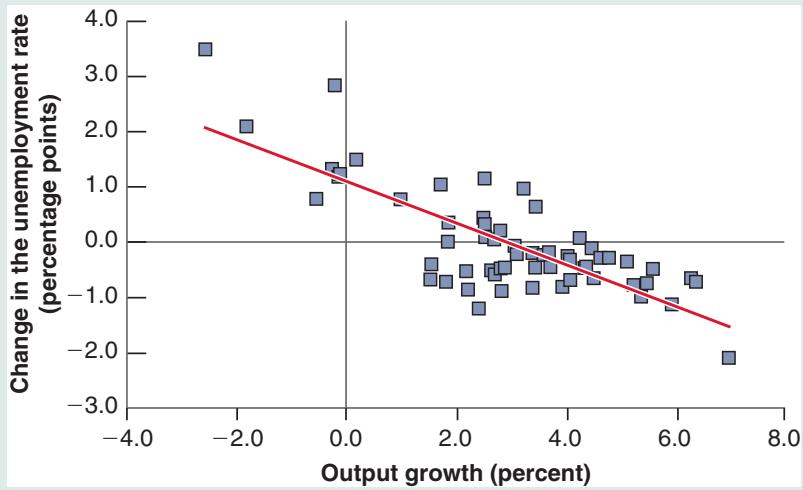
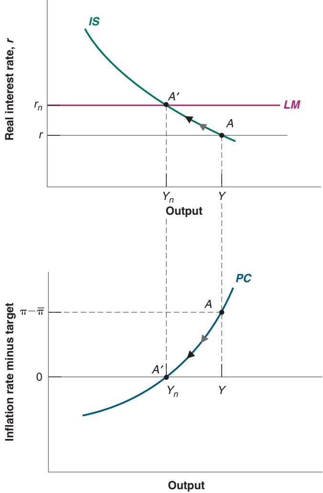
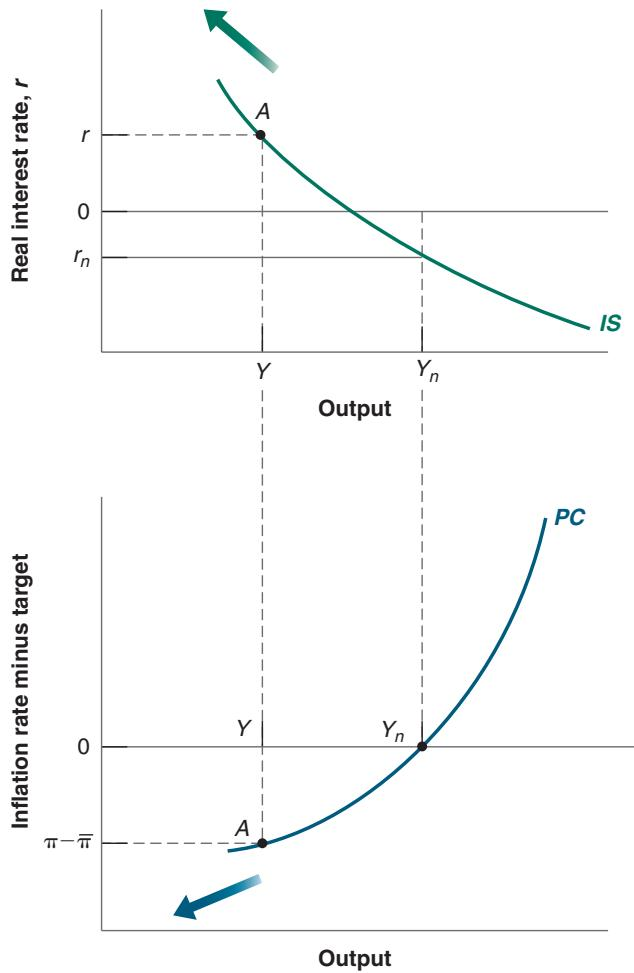

# Okun’s Law across Time and Countries

How does the relation between output and unemployment that we derived in the text relate to the empirical relation between the two, known as Okun’s law, which we saw in Chapter 2?

To answer this question, we must first rewrite the relation in the text in a way that makes the comparison easy between the two. Before giving you the derivation, which takes a few steps, let me give you the bottom line. The relation between unemployment and output derived in the text can be rewritten as shown in equation (9B.1) (the notation (–1) after a variable simply means last year’s value of the variable):

$$
u - u (- 1) \approx - g _ {Y}\tag{9B.1}
$$

The change in the unemployment rate is approximately equal (≈) to the negative of the growth rate (g) of output.

Here is the derivation. Start from the relation between employment, the labor force, and the unemployment rate $N = L ( 1 - u )$ . Write the same relation for the year before, assuming a constant labor force L, so $N ( - 1 ) = L ( 1 - u ( - 1 ) )$ Put the two relations together to get:

$$
\begin{array}{r l} N - N (- 1) & = L (1 - u) - L (1 - u (- 1)) \\ & = - L (u - u (- 1)) \end{array}
$$

The change in employment is equal to minus the change in the unemployment rate, times the labor force. Divide both sides by N( - 1) to get

$$
(N - N (- 1)) / N (- 1) = - (L / N (- 1)) (u - u (- 1))
$$

Note that the expression on the left-hand side gives the rate of growth of employment, call it $g _ { N } .$ Given our assumption that output is proportional to employment, the rate of growth of output, call it ${ \mathit { g } } _ { Y } ,$ is equal to $g _ { N } .$ Note also that $L / N ( - 1 )$ is a number close to 1. If the unemployment rate is equal to 5%, for example, then the ratio of the labor force to employment is 1.05. So, rounding it to 1, we can rewrite the expression as:

$$
g _ {Y} \approx - (u - u (- 1)),
$$

Reorganizing gives us the equation we want:

$$
u - u (- 1) \approx - g _ {Y}\tag{9B.1}
$$

Now turn to the actual relation between the change in the unemployment rate and output growth, which is plotted in Figure 1 using annual data since 1960. (Figure 2-5 in Chapter 2 showed the same relation, but for the period starting in 2000 and using quarterly data.) The regression line that fits the points best is given by:

$$
u - u(-1) = -0.4 \left( g_Y - 3\% \right)\tag{9B.2}
$$

Like equation (9B.1), equation (9B.2) shows a negative relation between the change in unemployment and output growth. But it differs from equation (9B.1) in two ways.

First, annual output growth must be at least 3% to prevent the unemployment rate from rising. This is because of two factors we ignored in our derivation: labor force growth and labor productivity growth. To maintain a constant unemployment rate, employment must grow at the same rate as the labor force. Suppose the labor force grows at 1.7% per year; then employment must grow at 1.7% per year. If, in addition, labor productivity (i.e., output per worker) grows at 1.3% per year, this implies that output must grow at $1 . 7 \% + \ 1 . 3 \% = \ 3 \%$ per year. In other words, to maintain a constant unemployment rate, output growth must be equal to the sum of labor force growth and labor productivity growth. In the United States, the sum of the rate of labor force growth and of labor productivity growth has been equal to 3% per year on average since 1960, and this explains why the number 3% appears on the right side of equation (9B.2). (There is some evidence, which we discussed in Chapter 1 and shall come back to in later chapters, that productivity growth has declined over time and that the growth rate needed to maintain a constant unemployment rate is now closer to 2%.)

Second, the coefficient on the right side of equation (9B.2) is -0.4, compared to -1.0 in equation (9B.1). Put another way, output growth 1% above normal leads only to a 0.4% reduction in the unemployment rate in equation (9B.2) rather than the 1% reduction in equation (9B.1). There are two reasons why:

Firms adjust employment less than one-for-one in response to deviations of output growth from normal. More specifically, output growth 1% above normal for one year leads to only a 0.6% increase in the employment rate. One reason is that some workers are needed no matter what the level of output. The accounting department of a firm, for example, needs roughly the same number of employees whether the firm is selling more or less than normal. Another reason is that training new employees is costly, so firms prefer to keep current workers rather than lay them off when output is lower than normal and ask them to work overtime rather than hire new employees when output is higher than normal. In bad times, firms in effect hoard the labor they will need when times are better, a behavior called labor hoarding.

An increase in the employment rate does not lead to a one-for-one decrease in the unemployment rate. More specifically, a 0.6% increase in the employment rate leads to only a 0.4% decrease in the unemployment rate. The reason is that labor force participation increases. When employment increases, not all the new jobs are filled by the unemployed. Some of the jobs go to people who were classified as out of the labor force, meaning they were not actively looking for a job. Also, as labor market prospects improve for the unemployed, some discouraged workers, who were previously classified as out of the labor force, decide to start actively looking for a job and become classified as unemployed. For these reasons, unemployment decreases less than employment increases.

Putting the two steps together: Unemployment responds less than one-for-one to movements in employment, which itself responds less than one-for-one to movements in

output. The coefficient giving the effect of output growth on the change in the unemployment rate, here 0.4, is called the Okun coefficient. Given the factors that determine this coefficient, one would expect the coefficient to differ across countries, and indeed it does. For example, in Japan, which has a tradition of lifetime employment, firms adjust employment much less in response to movements in output, leading to an Okun coefficient of only 0.1. Fluctuations in output are associated with much smaller fluctuations in unemployment in Japan than in the United States.

## Figure 1

Changes in the Unemployment Rate versus Output Growth in the United States, 1960–2018 High output growth is associated with a reduction in the unemployment rate; low output growth is associated with an increase in the unemployment rate.

For more on Okun’s law across countries and time, read “Okun’s Law: Fit at $5 0 ? \cdots$ by Laurence Ball, Daniel Leigh, and Prakash Loungani, working paper 606, The Johns Hopkins University, 2012.

Source: FRED: Series GDPCA, UNRATE

We need to take one last step. We saw in Chapter 8 that the way wage setters form expectations about inflation has changed through time. The evidence in Chapter 8 suggests that, in the United States today, inflation expectations are anchored and a reasonable assumption is that wage setters expect inflation to be equal to the target set by the Fed, denoted ${ \overline { { \pi } } } .$ . This is an important assumption and I shall return to what happens when it does not hold at various points in the chapter. With this assumption, the relation between inflation and output is given by:

$$
\pi - \overline {{\pi}} = (\alpha / L) (Y - Y _ {n})
$$

If you live in a country other than the United States, it may well be that this assumption is not the right one. You may want to explore the implications of other assumptions about expectations, for example, that wage setters expect inflation this year to be equal to last year’s inflation.

(9.4)

We have derived two relations in this section. The first, derived from goods and financial market equilibrium links the real rate to output. The second, derived from labor market equilibrium, links output to inflation. With these two equations, we can now describe what happens in the short and the medium run. This is what we do in the next section.

## 9-2 FROM THE SHORT TO THE MEDIUM RUN

Return to Figure 9-1. Assume that the real rate chosen by the central bank is equal to r. The top part of the figure tells us that, associated with this interest rate, the level of output is given by Y. The bottom part of the figure tells us that this level of output Y implies an inflation rate equal to π. Given the way I have drawn the figure, Y is larger than $Y _ { n } ,$ so output is above potential. There is a positive output gap, which implies that inflation is higher than the target inflation, p. Put less formally, the economy is overheating, putting pressure on inflation. This is the short-run equilibrium.

What happens over time? Suppose the central bank leaves the real rate unchanged at r. Then, output remains above potential and inflation remains above target. At some point, however, policy is likely to react to this higher inflation, for two reasons.

The first is that the mandate of the central bank is to keep inflation close to the target.

The second is that, if it does not react, what we saw happen in the 1970s and 1980s will happen again: Inflation expectations will de-anchor. Seeing that inflation continues to exceed the target, wage setters will change the way they form expectations. If, for example, they expect inflation to equal past inflation, then the Phillips curve relation will become a relation between the change in inflation and the output gap. If the output gap remains positive, inflation not only will be higher than the target but will start increasing. The central bank will have to act to stop it from increasing, and eventually return it to target. Better to react early before expectations de-anchor.

So, for both reasons, the central bank will react to the positive output gap by increasing the real rate so as to reduce inflation and, in so doing, reduce output. The process of adjustment is described in Figure 9-2. Let the initial equilibrium be denoted by point A in both the top and bottom graphs. The central bank increases the real rate over time, shifting the LM curve up, so the economy moves along the IS curve up from A to A′. Output decreases. Now turn to the bottom graph. As output decreases and the output gap shrinks, the economy moves down the PC curve from A to A′.

At point A′, the economy reaches its medium-run equilibrium. Let’s look at it more closely. In the medium run, output returns to its natural level: $Y = Y _ { n } .$ In parallel, unemployment returns to the natural unemployment rate: $u = u _ { n }$ . With unemployment at the natural rate, the inflation rate returns to the target rate $\pi = { \overline { { \pi } } }$

Turning to interest rates: The real rate must be such that the demand for goods is equal to potential output, and is thus given by $r = r _ { n }$ in Figure 9-2. This interest rate is

Figure 9-2

Medium-Run Output and Inflation

Over the medium run, the economy converges to potential output and inflation converges to target inflation.

often called the natural rate of interest (to reflect the fact that it is the rate of interest associated with the natural rate of unemployment, or the natural level of output); it is also sometimes called the neutral rate of interest or the Wicksellian rate of interest (because the concept was introduced by Knut Wicksell, a Swedish economist who characterized it at the end of the 19th century). The real borrowing rate is given in turn by $r _ { n } + x ,$ , where x is the risk premium.

What about the nominal interest rate, i? Recall the relation between the nominal and the real rate from Chapter 6 (equation 6.4): The real rate is equal to the nominal rate minus expected inflation. Equivalently, the nominal rate is equal to the real rate plus expected inflation: $i = r + \pi ^ { e }$ . Given that, in the medium run, the real rate is equal to the neutral rate, and that expected inflation is equal to actual inflation, which is itself equal to target inflation, this implies that the nominal rate is equal to $i = r _ { n } + \overline { { \pi } }$ . The higher the target inflation rate, the higher the nominal interest rate.

Finally, what about money and money growth? Recall the characterization of the equilibrium condition in Chapter 5 (equation 5.3) that the real supply of money equals real money demand, $M / P = Y L ( i )$ . Given that output is equal to potential, and the nominal interest rate is determined from above, we can rewrite this equation as:

Recall that we are ignoring output growth for the time being.

$$
\frac {M}{P} = Y _ {n} L (r _ {n} + \overline {{\pi}})
$$

Note that all three variables on the right-hand side, natural output, natural rate of interest, and target inflation, are constant in steady state, so the real demand for money is constant in steady state. This implies that the left-hand side, the real supply of money, must be constant. This in turn implies that the price level, P, must be growing at the same rate as nominal money, M. Writing the rate of growth of money as $g _ { M } ,$ , this gives $\pi = g _ { M } .$ Replacing in the equation for the nominal interest rate, and using the fact that ${ \overline { { \pi } } } = \pi$ we can rewrite the nominal rate as $i = r _ { n } + g _ { M }$ . In the medium run, the nominal interest rate is equal to the real neutral rate plus the rate of nominal money growth.

A summary of the mediumrun results: $Y = Y _ { n } , u = u _ { n } ,$ $\pi = \overline { { { \pi } } } = g _ { M } , r = r _ { n } ,$ $\triangleleft i = r _ { n } + g _ { M }$

To summarize: In the medium run, the real variables, be it output, unemployment, or the real rate of interest, are independent of monetary policy. What monetary policy determines is the rate of inflation and the nominal interest rate. In the medium run, a higher rate of money growth leads only to higher inflation and higher nominal interest rates. The fact that monetary policy does not affect real variables in the medium run is referred to as the neutrality of money.

## 9-3 COMPLICATIONS AND HOW THINGS CAN GO WRONG

The adjustment to the medium-run equilibrium in Section 9-2 seemed smooth and easy. Indeed, as you were reading, you may have asked yourself why, if the central bank wanted to return inflation to p and output to $Y _ { n } ,$ didn’t it simply increase the real rate from r to $r _ { n }$ right away, so that the medium-run equilibrium was reached without delay?

The answer is that central banks would indeed like to keep the economy at $Y _ { n }$ but, although it looks easy to do in Figure 9-2, reality is more complicated.

First, it is difficult for the central bank to know where potential output is exactly and thus how far output is from potential. The change in inflation provides a signal about the output gap (the distance between actual and potential output), but in contrast to the simple equation (9.4), the signal is noisy. The central bank may thus want to adjust the real rate slowly and see what happens. We saw in Chapter 8 that this is indeed one of the issues facing the Fed today. At 3.9%, the unemployment rate is below previous estimates of the natural rate. Yet, inflation, at 2.3%, is barely above 2%, the target inflation rate. Is the unemployment rate well below the natural rate, in which case the Fed should increase the interest rate in order to slow down the economy and allow the unemployment rate to increase? Or has the natural rate decreased, and there is no reason for the Fed to tighten? This is the main topic of discussion at the Fed and in the economic section of newspapers today.

Second, it takes time for the economy to respond, as discussed in Chapter 3 in the context of fiscal policy. Adjustments do not take place instantaneously. Firms take time to adjust their investment decisions. As investment spending slows down in response to the higher real rate, leading to lower demand, lower output, and lower income, it takes time for consumers to adjust to the decrease in income and for firms to adjust to the decrease in sales. In short, even if the central bank acts quickly, it takes time for the economy to go back to potential output.

Note the difficult problem facing the central bank in Figure 9-2. Output and inflation are too high. It may be difficult or even counterproductive to decrease demand and output too quickly. But going too slowly involves another risk, namely that, if inflation remains above target for too long, inflation expectations will de-anchor, leading to increasing inflation and requiring a costlier adjustment later on by the central bank. The next subsection explores a related and very relevant danger, which arises when the central bank is facing the zero lower bound.

For example, if the output gap is such that inflation is 3% below target $( \pi - \overline { { \pi } } = - 3 \% )$ , and the target inflation rate p is 2%, this implies that inflation is equal

$$
\text{to} 2\% - 3\% = -1\%.
$$

Recall that a negative real rate does not necessarily imply that people and firms, who borrow at a real rate equal to $r + x ,$ also face a negative real rate. If x is sufficiently large, the real rate at which they can borrow is positive even if the real rate is negative.

$$
= 0\% - (-2\%) = 2\%.
$$

## The Zero Lower Bound and Deflation Spirals

In Figure 9-2, we considered the case where output was above potential and inflation was above target. Consider instead the case, represented in Figure 9-3, where the economy is in a recession. Given the real rate r and the position of the IS curve, the equilibrium is at point A. Output is equal to Y, which is lower than $Y _ { n } ,$ so there is a negative output gap, implying that inflation is lower than target inflation. If the output gap is very large and so inflation is much lower than target inflation, this may imply that inflation is negative, that the economy is experiencing deflation.

What the central bank should do in this case appears straightforward. It should decrease the real rate until output has increased back to its natural level. In terms of Figure 9-3, it should decrease the real rate from r to $r _ { n } . \mathrm { A t } r _ { n } ,$ output is equal to $Y _ { n }$ and inflation is equal to the target. Note that, if the economy is sufficiently depressed, the real rate, $r _ { n } ,$ needed to return output to its natural level may be very low, perhaps even negative. I have drawn it so it is negative in the figure.c

The zero lower bound may, however, make it impossible to achieve this negative real rate because the lowest nominal rate monetary policy can achieve is a rate of 0%. If there is deflation, however, then this implies that the lowest real rate monetary policy can achieve is actually positive, and equal to the deflation rate.

This means that the central bank may not be able to decrease the real rate enough to return output to potential. To avoid cluttering the figure, assume that the central bank simply cannot decrease the real rate below r. (You could assume instead that it can decrease the real rate somewhat, but not all the way to $r _ { n } . )$ What happens then?

The first answer is that the economy remains at point A, with both a large output gap and deflation, not a good outcome. But the right answer is that things are likely to go from bad to worse. As people see that inflation is below target and the economy is experiencing deflation, they start changing the way they form expectations and start anticipating deflation. Expectations become de-anchored, and the negative output gap now leads not just to deflation but to larger and larger deflation. Not only that, but as deflation becomes larger, the real interest rate, which is equal to the deflation rate, increases. The larger thec deflation, the higher the real interest rate, the lower output, and so on, a situation known as a deflation spiral or a deflation trap. As indicated by the two arrows in the figure,

## Figure 9-3

## The Deflation Spiral

If the zero lower bound prevents monetary policy from increasing output back to potential, the result may be a deflation spiral. More deflation leads to a higher real rate, which in turn leads to lower output and more deflation.

instead of returning to its medium-run equilibrium, the economy moves further away, with lower and lower output and larger and large deflation.

This nightmare scenario is not just a theoretical concern. It played out during the Great Depression. As shown in the Focus Box “Deflation in the Great Depression,” from 1929 to 1933 inflation turned into larger and larger deflation, steadily increasing the real rate and decreasing spending and output, until other policy measures were taken and the economy started turning around.

More recently, the Great Recession gave rise to a similar worry. With the nominal rate down to zero in the major advanced countries, the worry was that inflation would turn negative and start a similar spiral. Thankfully, it did not happen. Inflation decreased and in some countries—Greece, Spain, and Portugal, for example—turned to deflation. This limited the ability of the central bank to decrease the real rate and increase output, but deflation remained limited, and the deflation spiral did not happen. One reason for this, which connects to our previous discussion of expectation formation, is that inflation expectations remained largely anchored. Low output led to low inflation and in some cases mild deflation, but not to steadily larger deflation, as was the case during the Great Depression.

## 9-4 FISCAL CONSOLIDATION REVISITED

We can now take the IS-LM-PC model through its paces. In this section, we go back to the fiscal consolidation we discussed in Chapter 5 and look at not only its short-run effects but its medium-run effects as well.
