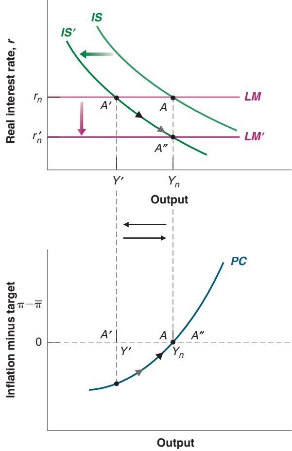
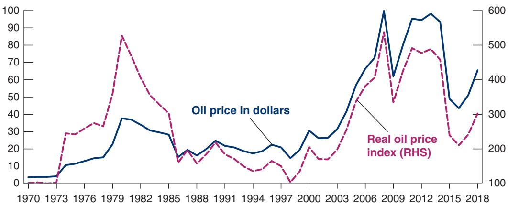
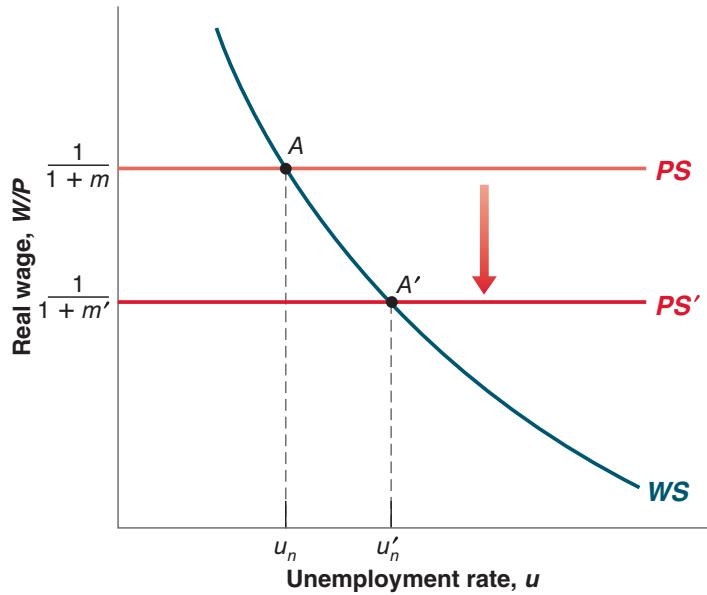
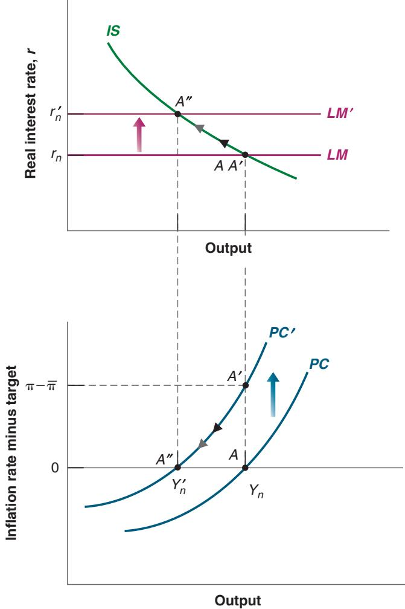
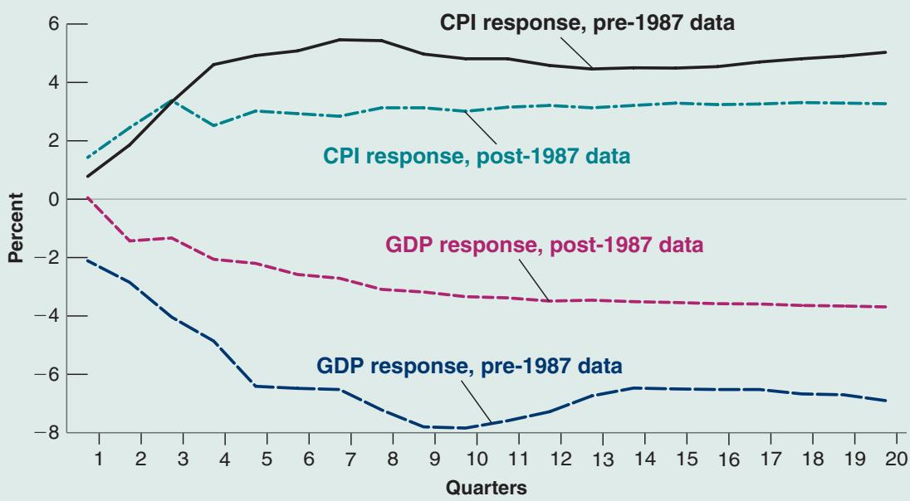

# Deflation in the Great Depression

After the collapse of the stock market in 1929, the US economy plunged into an economic depression. As the first two columns of Table 1 show, the unemployment rate soared from 3.2% in 1929 to 24.9% in 1933, and output growth was strongly negative for four years in a row. From 1933 on, the economy recovered slowly, but by 1940 the unemployment rate was still high at 14.6%.

The Great Depression has many elements in common with the Great Recession. A large increase in asset prices before the crash: housing prices in the recent crisis, stock market prices in the Great Depression, and the amplification of the shock through the banking system. There are also important differences. As you can see by comparing the output growth and unemployment numbers in Table 1 to the numbers for the Great Recession in Chapter 1, the decrease in output and the increase in unemployment were much larger then than in the Great Recession. In this box, we focus on just one aspect of the Great Depression: the evolution of the nominal and real interest rates and the dangers of deflation.

As you can see in the third column of the table, in the face of rising unemployment, the Fed decreased the nominal rate, measured in the table by the one-year T-bill rate, although it did this slowly and did not quite go all the way to zero. The nominal rate decreased from 5.3% in 1929 to 2.6% in 1933. At the same time, as shown in the fourth column, the decline in output and the increase in unemployment led to a sharp decrease in inflation. Inflation, equal to zero in 1929, turned negative in 1930, reaching -9.2% in 1931, and -10.8% in 1932. If we make the assumption that expected deflation was equal to actual deflation in each year, we can construct a series for the real rate. This is done in the last column of the table and gives a hint for why output continued to decline until 1933. The real rate reached 12.3% in 1931, 14.8% in 1932, and still a high 7.8% in 1933! It is no great surprise that, at those interest rates, both consumption and investment demand remained very low, and the depression worsened.

In 1933, the economy seemed to be in a deflation trap, with low activity leading to more deflation, a higher real interest rate, lower spending, and so on. Starting in 1934, however, deflation gave way to inflation, leading to a large decrease in the real interest rate, and the economy began to recover. Why, despite a high unemployment rate, the US economy was able to avoid further deflation remains a hotly debated issue. Some point to a change in monetary policy, a large increase in the money supply, leading to a change in inflation expectations. Others point to the policies of the New Deal, in particular the establishment of a minimum wage, thus limiting further wage decreases. Whatever the reason, this was the end of the deflation trap and the beginning of a long recovery.

## For more on the Great Depression:

Lester Chandler, America’s Greatest Depression (1970, HarperCollins), gives the basic facts. So does the book by John A. Garraty, The Great Depression (1986, Anchor).

Did Monetary Forces Cause the Great Depression? (1976, W. W. Norton), by Peter Temin, looks more specifically at the macroeconomic issues. So do the articles from a symposium on the Great Depression in the Journal of Economic Perspectives, Spring 1993.

For a look at the Great Depression in countries other than the United States, read Peter Temin’s Lessons from the Great Depression (1989, MIT Press).

Table 1 Unemployment, Output Growth, Nominal Interest Rate, Inflation, and Real Interest Rate, 1929–1933

<table><tr><td>Year</td><td>Unemployment Rate (%)</td><td>Output Growth Rate (%)</td><td>One-Year Nominal Interest Rate (%), i</td><td>Inflation Rate (%), π</td><td>One-Year Real Interest Rate (%), r</td></tr><tr><td>1929</td><td>3.2</td><td>-9.8</td><td>5.3</td><td>0.0</td><td>5.3</td></tr><tr><td>1930</td><td>8.7</td><td>-7.6</td><td>4.4</td><td>-2.5</td><td>6.9</td></tr><tr><td>1931</td><td>15.9</td><td>-14.7</td><td>3.1</td><td>-9.2</td><td>12.3</td></tr><tr><td>1932</td><td>23.6</td><td>-1.8</td><td>4.0</td><td>-10.8</td><td>14.8</td></tr><tr><td>1933</td><td>24.9</td><td>9.1</td><td>2.6</td><td>-5.2</td><td>7.8</td></tr></table>

Suppose that output is at potential, so the economy is at point A in both the top and bottom graphs of Figure 9-4. Output is equal to $Y _ { n } ,$ the real rate is equal to $r _ { n } ,$ and inflation is equal to target. Now, assume that the government, which was running a deficit, decides to reduce it by, say, increasing taxes. The increase in taxes shifts the IS curve to the left, from IS to $I S ^ { \prime }$ . The new short-run equilibrium is given by point $A ^ { \prime }$ in the top and bottom graphs. At the given real rate $r _ { n } ,$ output decreases from $Y _ { n }$ to $Y ^ { \prime }$ and inflation is lower. In other words, if output was equal to potential output to start with, the fiscal consolidation, as desirable as it may be on other grounds, leads to a recession. This is the short-run equilibrium we characterized in Section 5-3 of Chapter 5. Note that, as income comes down and taxes increase, consumption decreases on both counts. Note also that, as output decreases, so does investment. In the short run, on macroeconomic grounds, fiscal consolidation looks rather unappealing: Both consumption and investment go down.

  
Figure 9-4  
Fiscal Consolidation in the Short and the Medium Run  
Fiscal consolidation leads to a decrease in output in the short run. In the medium run, output returns to potential, and the interest rate is lower.

Let’s, however, turn to the dynamics and to the medium run. As output is too low, and inflation is below target, the central bank is likely to react and decrease the policy rate until output is back to potential. In terms of Figure 9-4, the economy moves down the $I S ^ { \prime }$ curve in the top graph and output increases. As output increases, the economy moves up the PC curve in the bottom graph until output is back to potential. Thus, the medium-run equilibrium is given by point $A ^ { \prime \prime }$ in both the top and bottom graphs. Output is back at $Y _ { n }$ and inflation is again equal to target inflation. The real rate needed to maintain output at potential is now lower than before, equal to $\boldsymbol { r ^ { \prime } } _ { n }$ rather than $r _ { n }$

Now look at the composition of output in this new equilibrium. As income is the same as it was before fiscal consolidation but taxes are higher, consumption is lower, although not as low as it was in the short run. As output is the same as before but the interest rate is lower, investment is higher than before. In other words, the decrease in consumption is offset by an increase in investment, so demand, and by implication output, is unchanged. This is in sharp contrast to what happened in the short run and makes fiscal consolidation look more attractive. Although consolidation may decrease investment in the short run, it increases investment in the medium run.

This discussion raises some of the same issues we discussed in the previous section.

We have looked at a fiscal consolidation, or equivalently, at an increase in public saving. The same argument would apply to an increase in private saving. At a given real rate, such an increase would lead to a decrease in investment in the short run, but to an increase in investment in the medium run. (In light of these results, you may want to go back to the Focus Boxes “The Paradox of Saving” in Chapter 3 and “Deficit Reduction: Good or Bad for Investment?” in Chapter 5.)

It looks as if fiscal consolidation could take place without a decrease in output in the short run. All that is needed is for the central bank and the government to coordinate carefully. As fiscal consolidation takes place, the central bank should decrease the real rate so as to maintain output at the natural level. In other words, the proper combination of fiscal and monetary policy could achieve the medium-run equilibrium outcome in the short run. Such coordination indeed happens sometimes; as we saw in Chapter 5, it happened in the United States in the 1990s, when a fiscal consolidation was accompanied with a monetary expansion. But it does not always happen. One reason is that the central bank may be unable to decrease the real rate sufficiently because of the zero lower bound. This was the case in the euro area during the Great Recession: with the nominal policy rate at zero, monetary policy was unable to offset the adverse effects of fiscal consolidation on output. The result was a stronger and longer-lasting adverse effect of fiscal consolidation on output than would have been the case had the European Central Bank been able to decrease the real rate further.

## 9-5 THE EFFECTS OF AN INCREASE IN THE PRICE OF OIL

So far we have looked at shocks to demand, shocks that shifted the IS curve but left potential output and thus the position of the PC curve unaffected. There are other shocks, however, that affect both demand and potential output and play an important role in fluctuations. An obvious candidate is movements in the price of oil. To see why, turn to Figure 9-5.

Figure 9-5 plots two series. The first, represented by the blue line, is the price of a barrel of oil in dollars since 1970. It is measured on the vertical axis on the left. This is the series that is quoted in the newspapers every day. What matters, however, for economic decisions is not the dollar price, but the real price of oil; that is, the dollar price of oil divided by the price level. Thus, the second series in the figure, represented by the red line, shows the real price of oil, constructed as the dollar price of oil divided by the US consumer price index. Note that the real price, measured on the vertical axis on the right, is an index; it is normalized to equal 100 in 1970.

## Figure 9-5

## The Nominal and the Real Price of Oil, 1970–2018

Over the last 40 years, there have been two sharp increases in the real price of oil, the first in the 1970s and the second in the 2000s.

Source: FRED: OILPRICE, CPIAUSCL. Left vertical axis: nominal price of oil, dollars per barrel. Right vertical axis: real oi price index, 1970=100.

What is striking in the figure is the size of the movements in the real price of oil. Twice over the last 50 years, the US economy was hit with a fivefold increase in the real price of oil, the first time in the 1970s and the second time in the 2000s. The financial crisis then led to a dramatic drop in late 2008, followed by a partial recovery. What was behind the two large increases? In the 1970s, the main factors were the formation of OPEC (the Organization of Petroleum Exporting Countries), a cartel of oil producers that was able to act as a monopoly and increase prices, and disruptions due to wars and revolutions in the Middle East. In the 2000s, the main factor was quite different, namely the fast growth of emerging economies, in particular China, which led to a rapid increase in the world demand for oil and, by implication, a steady increase in real oil prices.

What was behind the recent two decreases in 2008 and 2014? The decrease at the end of 2008 was the result of the crisis, which led to a large recession and in turn a large and sudden decrease in the demand for oil. The causes of the more recent drop since 2014 are still being debated. Most observers believe that it is a combination of increased supply because of the increase in shale oil production in the United States and the partial breakdown of the OPEC cartel.

Let’s focus on the two large increases. Although the causes were different, the implication for US firms and consumers was the same: more expensive oil. The question is: What would we expect the short- and medium-run effects of such increases to be? In answering the question, we face a problem: The price of oil appears nowhere in the model we have developed so far! The reason is that, until now, I have assumed that output was produced using only labor. One way to extend our model would be to recognize explicitly that output is produced using labor and other inputs (including energy), and then figure out what effect an increase in the price of oil has on the price set by firms and on the relation between output and employment. An easier way, and the way we shall go here, is simply to capture the increase in the price of oil by an increase in m—the markup of the price over the nominal wage. The justification is straightforward. Given wages, an increase in the price of oil increases the cost of production, forcing firms to increase prices to maintain the same profit rate.

Having made this assumption, we can then track the dynamic effects of an increase in the markup on output and inflation.

## Effects on the Natural Rate of Unemployment

Let’s start by asking what happens to the natural rate of unemployment when the real price of oil increases (for simplicity, I shall drop “real” in what follows). For this, we need to return to Chapter 7 and the characterization of labor market equilibrium. Figure 9-6 reproduces the characterization of labor market equilibrium from Figure 7-8 in Chapter 7.

The wage-setting relation (WS) is downward sloping; a higher unemployment rate leads to lower real wages. The price-setting relation (PS) is represented by the horizontal line at $W / P = 1 / ( 1 + m )$ . The initial equilibrium is at point A, and the initial natural unemployment rate is $u _ { n } . \mathrm { A n }$ increase in the markup leads to a downward shift of the price-setting line, from PS to PS′. The higher the markup, the lower the real wage implied by price setting. The equilibrium moves from A to A′. The real wage is lower and the natural unemployment rate is higher. Think of it this way: Because firms have to pay more for the oil, the wage they can pay is lower. Getting workers to accept the lower real wage requires an increase in unemployment.

The increase in the natural rate of unemployment leads in turn to a decrease in the natural level of employment. If we assume that the relation between employment and output is unchanged—that is, that each unit of output still requires one worker in addition to the energy input—then the decrease in the natural level of employment leads to an identical decrease in potential output. Putting things together: An increase in the price of oil leads to a decrease in potential output.

Firms may, for some time, react by accepting a decrease in profit and so increase the price less than in the figure. But, if the price of oil remains high, eventually they will want to reestablish b their profit margins.

This assumes that the increase in the price of oil is permanent. If, in the medium run, the price of oil goes back to its initial value, then the medium run natural rate of unemployment is clearly unaffected.

## Figure 9-6

The Effects of an Increase in the Price of Oil on the Natural Rate of Unemployment

An increase in the price of oil is equivalent to an increase in the markup. It leads to lower real wages and a higher natural rate of unemployment.

We can now go back to the IS-LM-PC model, and this is done in Figure 9-7. Assume the initial equilibrium is at point A in both the top and bottom panels, with output at potential, so Y is equal to $Y _ { n } ,$ inflation is equal to target, and the real rate is equal to $r _ { n } .$ . As the price of oil increases, the natural level of output decreases (this is what we just saw), say from $Y _ { n }$ to $Y _ { n } ^ { \prime } .$ . The PC curve shifts up, from PC to $P C ^ { \prime }$ . If the IS curve does not shift (we return to this assumption later) and the central bank does not change the real rate, output does not change, but the same level of output is now associated with inflation above the target. The short-run equilibrium is given by point $A ^ { \prime }$ in the top and bottom panels. In the short run, output does not change, but inflation is higher.

Turn to dynamics. If the central bank were to leave the real rate unchanged, output would continue to exceed the now lower level of potential output, and inflation would remain high. Eventually, expectations would become de-anchored, wage setters would start expecting higher inflation, and, as we have seen, inflation would keep increasing. To avoid this, the central bank must increase the real rate to return inflation to target. As it does so, the economy moves from $A ^ { \prime }$ to $A ^ { \prime \prime }$ along the IS curve in the top panel, and from $A ^ { \prime }$ to $A ^ { \prime \prime }$ along the PC curve in the bottom panel. As output decreases to its lower level, inflation returns to target. Once the economy is at point $A ^ { \prime \prime }$ , the economy is in its medium-run equilibrium. Because potential output is lower, the increase in the price of oil is reflected in a permanently lower level of output. Note that along the way, lower output is associated with inflation higher than the target, a combination that economists call stagflation (stag- for stagnation, and -flation for inflation).

Stagflation: Lower output, higher inflation. c

As in the previous sections, this description raises many issues.

The first is our assumption that the IS curve does not shift. In fact, there are many channels through which the increase in the price of oil may affect demand and shift not only the PC curve but also the IS curve. The higher price of oil may lead firms to change their investment plans, canceling some investment projects, shifting to less energyintensive equipment. The increase in the price of oil also redistributes income from oil buyers to oil producers. Oil producers may spend less than oil buyers, leading to a decrease in demand. This is especially true if the oil producers are in other countries than the oil buyers (which is the case when the United States buys oil from the Middle East, for example). As the price increases and their income increases, the oil producers are likely to spend most of it on their own goods, not on the goods produced by the oil buyers. Thus, demand for domestic goods is likely to go down. So it may well be that the IS curve shifts to the left, leading to a decrease in output not only in the medium run but in the short run as well.

Short- and Medium-Run Effects of an Increase in the Price of Oil

  
Figure 9-7

In the short run, an increase in the price of oil leads to higher inflation. If the price increase is permanent, it leads to lower output in the medium run.

The second issue has to do with the persistence of the increase in the price of oil. What we looked at in Figure 9-7 was a permanent increase, leading in turn to a permanent decrease in potential output. The central bank had no alternative than to tighten and reduce inflation. But if the increase is temporary, then the central bank may want to let inflation be higher while the price of oil is high, anticipating that inflation will return to target by itself when the price of oil comes down. This may, however, be a risky strategy: If the price of oil does not decrease quickly, inflation will remain high for some time. Expectations of inflation may de-anchor, leading to higher and higher inflation and making the eventual adjustment more painful. You can see why this makes the job of the central bank much harder than suggested in Figure 9-7. Assessing whether the increase in the price of oil is temporary or permanent and whether and when inflation expectations may de-anchor is, in practice, very difficult.

This discussion again shows the importance of expectation formation on the dynamic effects of shocks. It also helps explain the difference between the effects of the price of oil in the 1970s, which led to high inflation and a large recession, and the much more benign effects of the price of oil in the 2000s. This is explored at more length in the Focus Box “Oil Price Increases: Why Were the 2000s So Different from the 1970s?”

## 9-6 CONCLUSIONS

This chapter has covered a lot of ground. Let me repeat some key ideas and develop some of the conclusions.

# Oil Price Increases: Why Were the 2000s So Different from the 1970s?

Why is it that oil price increases were associated with stagflation in the 1970s but had little apparent effect on the US economy in the 2000s?

A first line of explanation is that shocks other than the increase in the price of oil were at work in the 1970s but not in the 2000s. In the 1970s, not only did the price of oil increase, but so did the price of many other raw materials. So the effect was stronger than would have been the case had only the price of oil increased.

Econometric studies suggest, however, that more was at work, and that, even after controlling for the presence of these other factors, the effects of the price of oil have changed since the 1970s. Figure 1 shows the effects of a 100% increase in the price of oil on output and on the price level, estimated using data from two different periods. The black and blue lines show the effects of an increase in the price of oil on the consumer price index (CPI) and on gross domestic product (GDP), based on data from 1970:1 to 1986:4; the green and red lines do the same, but based on data from 1987:1 to 2006:4 (the time scale on the horizontal axis is in quarters). The figure suggests two main conclusions. First, in both periods, as predicted by our model, the increase in the price of oil led to an increase in the CPI and a decrease in GDP. Second, the effects of the increase in the price of oil on both the CPI and on GDP have become smaller, roughly half of what they were previously.

Why have the adverse effects of the increase in the price of oil become smaller? This is still a topic of research. But, at this stage, two hypotheses appear plausible.

The first hypothesis is that partly because of globalization and foreign competition, US workers have less bargaining power today than they did in the 1970s. Thus, as the price of oil has increased, workers have had no choice than to accept a reduction in real wages, limiting the increase in the unemployment rate.

The second hypothesis has to do with monetary policy. As we saw in Chapter 8, in the 1970s, inflation expectations were not anchored. Seeing the initial increase in inflation due to the increase in the price of oil, wage setters assumed that inflation would continue to be high and thus asked for higher nominal wages, which led to further increases in inflation. In contrast, in the 2000s, inflation expectations were anchored. Seeing the initial increase in inflation, wage setters assumed it was a one-time increase and did not change their expectations of future inflation as much as they would have in the 1970s. Thus, the effect on inflation was much more muted, and the need for the Fed to control inflation through higher real rates and low output was much more limited.

  
Figure 1  
The Effects of a 100% Permanent Increase in the Price of Oil on the CPI and on GDP  
The effects of an increase in the price of oil on output and the price level are smaller than they used to be.

## The Short Run versus the Medium Run

One key message of this chapter is that shocks or changes in policy typically have different effects in the short run and in the medium run. Disagreements among economists about the effects of various policies often come from differences in the time frame they have in mind. If you are worried about output and investment in the short run, you might be reluctant to proceed with fiscal consolidation. But if your focus is on the medium and long run, you will see the consolidation as helping investment and eventually, through higher investment and thus capital accumulation, increasing output. One implication is that where you stand depends, among other things, on how fast you think the economy adjusts to shocks. If you believe that it takes a long time for output to return to potential you wil naturally focus more on the short run and be willing to use policies that increase output in the short run, even if medium-run effects are nil or negative. If you believe instead that output returns to potential quickly, you will put more emphasis on the medium-run implications and will, by implication, be more reluctant to use those policies.

## Shocks and Propagation Mechanisms

This chapter also gives you a general way of thinking about output fluctuations (sometimes called business cycles)—movements in output around its trend (a trend that we have ignored so far but on which we will focus in Chapters 10 through 13).

You can think of the economy as being constantly hit by shocks. These shocks may be shifts in consumption coming from changes in consumer confidence, or shifts in investment, or shifts in the risk premium due to a financial crisis, and so on. Or they may come from changes in policy—such as the introduction of a new tax law, a new program of infrastructure investment, a decision by the central bank to fight inflation, or a trade war.

Each shock has dynamic effects on output and its components. These dynamic effects are called the propagation mechanism of the shock. Propagation mechanisms are different for different shocks. The effects of a shock on activity may build up over time, affecting output in the medium run, or they may build up for a while and then decrease and disappear. Some shocks are sufficiently large or come in sufficiently bad combinations that they create a recession. The two recessions of the 1970s were due largely to increases in the price of oil; the recession of the early 1980s was due to a sharp tightening of monetary policy; the recession of the early 1990s was due primarily to a sudden decline in consumer confidence; the recession of 2001 was due to a sharp drop in investment spending. The sharp decrease in output in 2009 had its origins in the problems of the housing market, which led to a major financial shock and in turn to a sharp reduction in output. What we call economic fluctuations are the result of these shocks and their dynamic effects on output.

Typically, the economy returns over time to its medium-run equilibrium. A major issue is whether we can expect the economy to return to that equilibrium on its own, or whether it requires an active policy response. While this is a controversial issue, I believe that the economy does not self-stabilize, and that an active policy response, whether through monetary or through fiscal policy, is typically needed. Indeed, in all the examples we saw in this chapter, a reaction from the central bank was the mechanism through which output returned to potential output over time. In the absence of a policy reaction, inflation would have either steadily increased or decreased, eventually requiring a more painful policy adjustment. This was particularly clear in the discussion of the zero lower bound case: To the extent that monetary policy could no longer be used, there was a risk that the economy may enter a deflation spiral, getting steadily worse over time. During the Great Recession, the worst was avoided, partly because the financial system slowly recovered and partly because of the use of fiscal policy.
