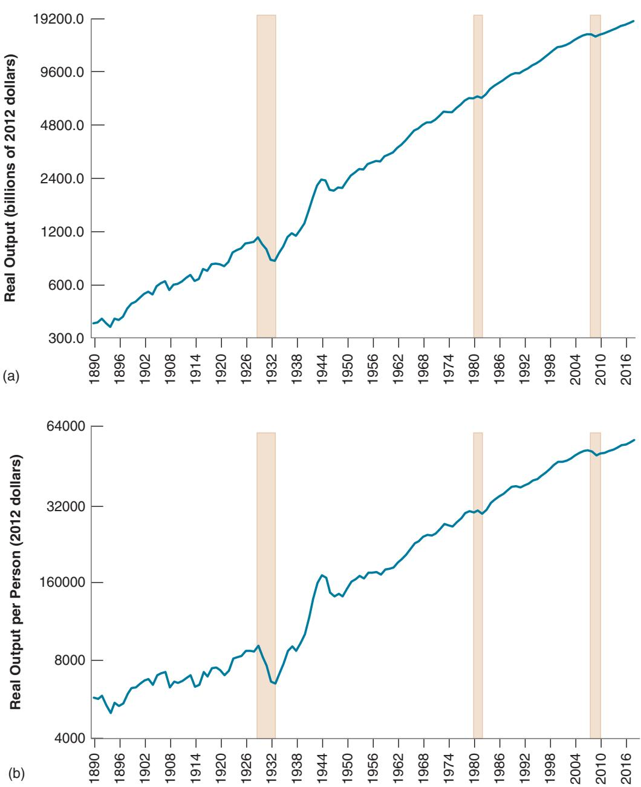

# The Facts of Growth

ur perceptions of how the economy is doing are often dominated by yearto-year fluctuations in economic activity. A recession leads to gloom, and an expansion to optimism. But if we step back to get a look at activity over longer periods—say, over many decades—the picture changes. Fluctuations fade. Growth, which is the steady increase in aggregate output over time, dominates the picture.

There is a famous quote from Robert Lucas, the 1995 Nobel Prize winner: “Once one starts thinking about growth, it is hard to think about anything else.”

Figure 10-1 shows the evolution of US GDP (panel (a)) and of US GDP per person (panel (b)) (both in 2012 dollars) since 1890. (The scale used to measure GDP or GDP per person on the vertical axis is called a logarithmic scale. The defining characteristic of a logarithmic scale is that the same proportional increase in a variable is represented by the same distance on the vertical axis.)

For more on log scales, see Appendix 2 at the end of the book.

The vertical bars from 1929 to 1933 correspond to the large decrease in output during the Great Depression: the other sets of bars correspond to the 1980–1982 recession, which is the largest postwar recession before the financial crisis and the Great Recession of 2008–2010. Note how small these three episodes appear compared to the steady increase in output per person over the last 130 years. The cartoon on p203 makes the same point about growth and fluctuations, in an even more obvious way.

With this in mind, we now shift our focus from fluctuations to growth. Put another way, we turn from the study of the determination of output in the short and medium run—where fluctuations dominate—to the determination of output in the long run—where growth dominates. Our goal is to understand what determines growth, why some countries are growing while others are not, and why some countries are rich while many others are still poor.

Section 10-1 discusses a central measurement issue; namely, how to measure the standard of living.

Section 10-2 looks at growth in the United States and other rich countries over the last 50 years.

Section 10-3 takes a broader look, across both time and space.

Section 10-4 gives a primer on growth and introduces the framework that will be developed in the next three chapters.

If you remember one basic message from this chapter, it should be: Over long periods of time, growth dwarfs fluctuations. The (complex) key to sustained growth is technological progress.

## Figure 10-1

## US GDP since 1890 and US GDP per Person since 1890

Panel (a) shows the enormous increase in US output since 1890, by a factor of 51. Panel (b) shows that the increase in output is not simply the result of the large increase in US population from 63 million to more than 320 million over this period. Output per person has risen by a factor of 10.

Sources: 1890–1947: Historical Statistics of the United States. http://hsus.cambridge.org/ HSUSWeb/toc/hsusHome.do. 1948–2014: National Income and Product Accounts. Population estimates 1890–2014: Louis Johnston and Samuel H. Williamson, “What Was the US GDP Then?” Measuring Worth, 2015, www.measuringworth. com/datasets/usgdp/. More recent data: FRED: GDPC1, B230RC0Q173SBEA.

We care about other dimensions of growth as well, in particular whether the increase in the standard of living benefits some more than others, whether growth comes with more or less inequality.

More on this in Chapter 13. Output per person is also called output per capita (capita means “head” in Latin). And given that output and income are always equal,

it is also called income per person or income per capita.

## 10-1 MEASURING THE STANDARD OF LIVING

The fundamental reason we care about the growth of a country is that we care about the average standard of living in the country. Looking across time, we want to knowc by how much the standard of living has increased. Looking across countries, we want to know how much higher the standard of living is in one country relative to another. Thus, the variable we want to focus on, and compare either over time or across countries, is output per person, rather than output itself.c

A practical problem then arises: How do we compare output per person across countries? Countries use different currencies; thus, output in each country is expressed in terms of its own currency. A natural solution is to use exchange rates. When comparing, say, the

Dana Fradon / The New Yorker Collection/The Cartoon Bank

  
"It's true, Caesar. Rome is declining, but I expect it to pick up in the next quarter."

output per person of India to the output per person of the United States, we can compute Indian GDP per person in rupees, use the exchange rate to get Indian GDP per person in dollars, and compare it to the US GDP per person in dollars. This simple approach will not do, however, for two reasons.

■ First, exchange rates can vary a lot (more on this in Chapters 17 to 20). For example, the dollar increased and then decreased in the 1980s by roughly 50% vis-à-vis the currencies of the trading partners of the United States. But the standard of living in the United States did not increase by 50% and then decrease by 50% compared to the standard of living of its trading partners during the decade. Yet this is the conclusion we would reach if we were to compare GDP per person using exchange rates.

■ The second reason goes beyond fluctuations in exchange rates. In 2018, GDP per person in India, using the current exchange rate, was \$2,016 compared to \$62,517 in the United States. Surely no one could live on \$2,016 a year in the United States. But people live on it—admittedly, not very well—in India, where the prices of basic goods (those needed for subsistence) are much lower than in the United States. The level of income of the average person in India, who consumes mostly basic goods, is certainly not 31 times smaller than that of the average person in the United States. This point applies to other countries as well. In general, the lower a country’s output per person, the lower the prices of food and basic services in that country.

Recall a similar discussion in Chapter 1 where we looked at output per person in China.

So, when we focus on comparing standards of living, we get more meaningful comparisons by correcting for these two effects—variations in exchange rates and systematic differences in prices across countries. The details of construction are complicated, but the principle is simple. The numbers for GDP—and hence for GDP per person—are constructed using a common set of prices for all countries. Such adjusted real GDP numbers, which you can think of as measures of purchasing power across time or across countries, are called purchasing power parity (PPP) numbers. Further discussion is given in the Focus Box “The Construction of PPP Numbers.”

When one is comparing rich versus poor countries, the differences between PPP numbers and the numbers based on current exchange rates can be large. Return to the
