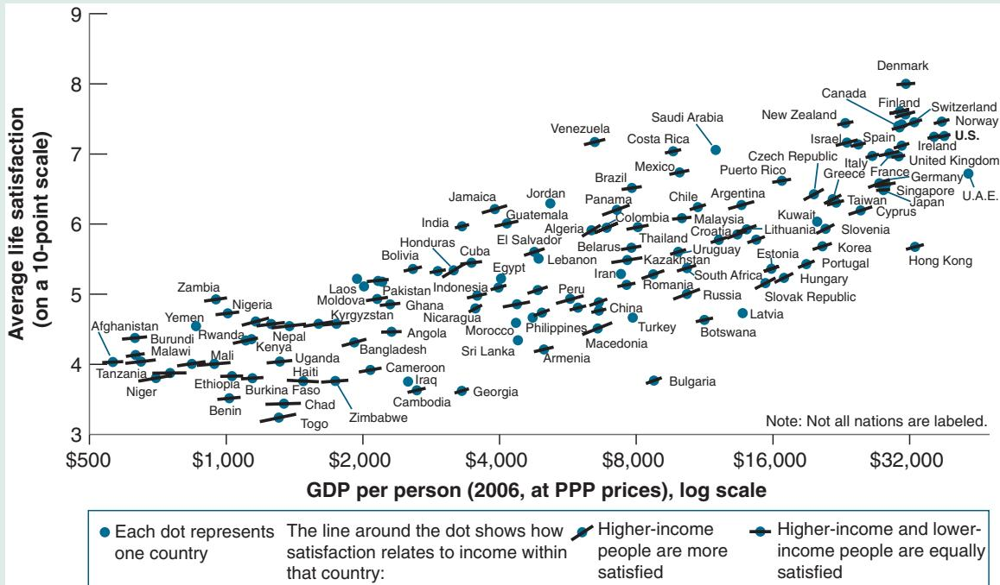
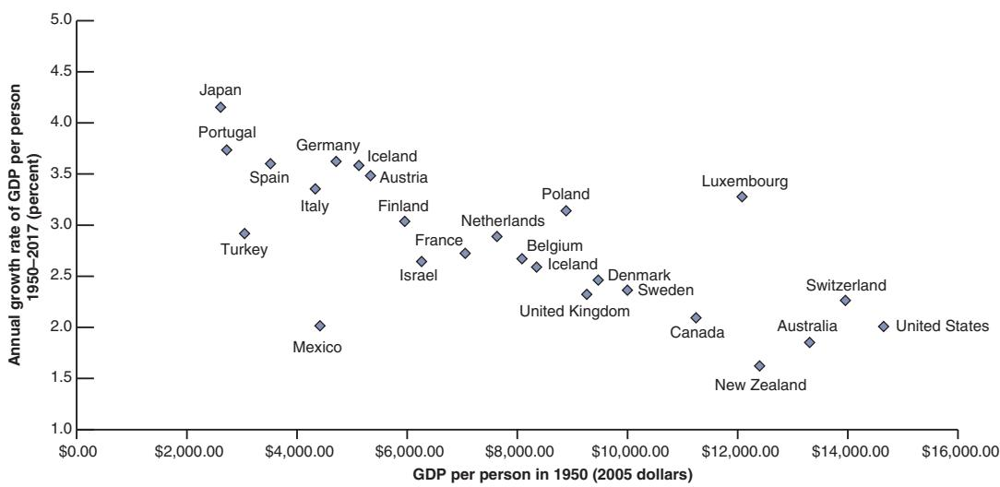
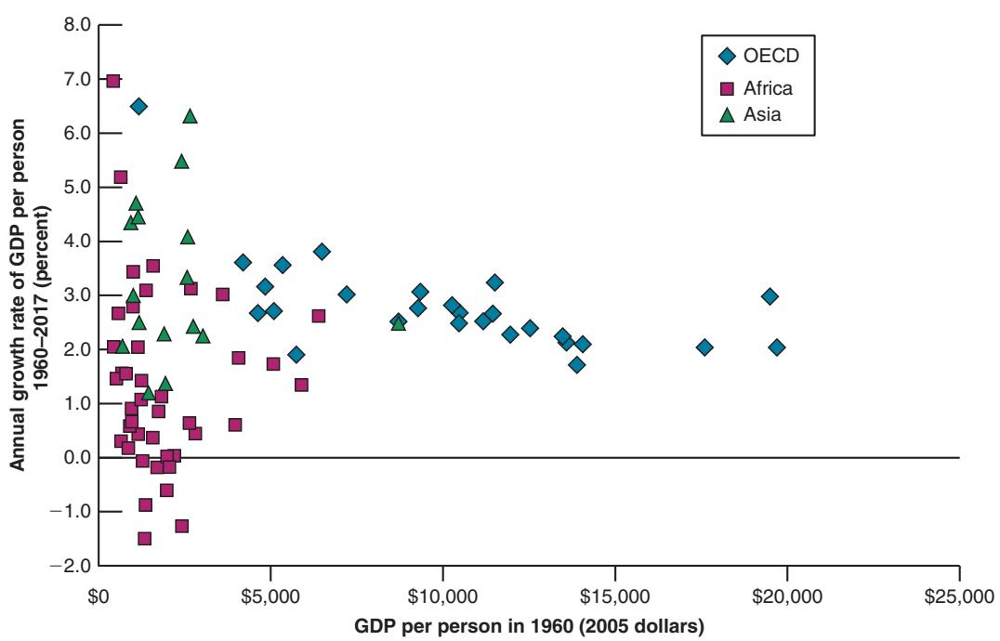

# The Construction of PPP Numbers

Consider two countries—let’s call them the United States and Russia, although we are not attempting to fit the characteristics of those two countries very closely.

Assume that, in the United States, annual consumption per person equals \$20,000 and that people each buy two goods every year: they buy a new car for \$10,000 and spend the rest on food. The price of a yearly bundle of food in the United States is \$10,000.

Assume that, in Russia, annual consumption per person equals 120,000 rubles and people keep their cars for 15 years. The price of a car is 600,000 rubles, so individuals spend on average 40,000 rubles—600,000 divided by 15—a year on cars. They buy the same yearly bundle of food as their US counterparts, at a price of 80,000 rubles.

Russian and US cars are of identical quality, and so are Russian and US food. (You may dispute the realism of these assumptions. Whether a car in country X is the same as a car in country Y is the type of problem economists face when constructing PPP measures.) The exchange rate is such that one dollar is equal to 60 rubles. What is consumption per person in Russia relative to consumption per person in the United States?

One way to answer this question is by taking consumption per person in Russia and converting it into dollars using the exchange rate. Using this method, Russian consumption per person in dollars is \$2,000 (120,000 rubles divided by the exchange rate, 60 rubles to the dollar). According to these numbers, consumption per person in Russia is only 10% of US consumption per person.

Does this answer make sense? It is true that Russians are poorer, but food is much cheaper in Russia. A US consumer spending all of his \$20,000 on food would buy 2 bundles of food (\$20,000/\$10,000). A Russian consumer spending all of his 120,000 rubles on food would buy 1.5 bundles of food (120,000 rubles/80,000 rubles). In terms of food bundles, the difference between US and Russian consumption per person looks much smaller. And given that onehalf of consumption in the United States and two-thirds of consumption in Russia go to spending on food, this seems like a relevant computation.

Can we improve on our initial answer? Yes. One way is to use the same set of prices for both countries and then measure the quantities of each good consumed in each country using this common set of prices. Suppose we use US prices. In terms of US prices, annual consumption per person in the United States is obviously still \$20,000. What is it in Russia? Every year, the average Russian buys approximately 0.07 car (one car every fifteen years) and one bundle of food. Using US prices—\$10,000 for a car and \$10,000 for a bundle of food—gives Russian consumption per person as 3(0.07 \* \$10,000) + (1 \* \$10,000)4 = 3\$700 + \$10,0004 = \$10,700. So, using US prices to compute consumption in both countries puts annual Russian consumption per person at \$10,700>\$20,000 = 53.5% of annual US consumption per person, a better estimate of relative standards of living than we obtained using our first method (which put the number at only 10%).

This type of computation, namely the construction of variables across countries using a common set of prices, underlies PPP estimates. Rather than using US dollar prices as in our example (why use US rather than Russian or, for that matter, French prices?), these estimates use average prices across countries. These average prices are called international dollar prices. Many of the estimates we use in this chapter are the result of an ambitious project known as the Penn World Tables. (Penn stands for the University of Pennsylvania, where the project was initially located.) Led by three economists— Irving Kravis, Robert Summers, and Alan Heston—over more than 40 years, researchers working on the project have constructed PPP series not only for consumption (as we just did in our example), but more generally for GDP and its components, going back to 1950, for most countries in the world. See Robert C. Feenstra, Robert Inklaar, and Marcel P. Timmer, “The Next Generation of the Penn World Table,” American Economic Review, 2015, 105(10): pp. 3150–3182. The PPP data are available for download at www.ggdc.net/pwt

The bottom line: When comparing standards of living across countries, make sure to use PPP numbers.

Among advanced economies, only Ireland and Switzerland have a higher PPP GDP per capita than the United States (see the WEO database). Other countries with higher PPP GDP include Kuwait and Qatar. Can you guess why?

comparison between India and the United States. We saw that, at current exchange rates, the ratio of GDP per person in the United States to GDP per person in India was 31.3. Using PPP numbers, the ratio is “only” 8. Although this is still a large difference, it is much smaller than the ratio we obtained using current exchange rates. Differences between PPP numbersc and numbers based on current exchange rates are typically smaller when making comparisons among rich countries. For example, using current exchange rates, the ratio of GDP per person in the United States to GDP per person in Germany in 2018 was 128%; based instead on PPP numbers, the ratio was 118%. (More generally, PPP numbers suggest that the United States still has the highest GDP per person among the world’s major countries.)c Let me end this section with three remarks before we move on and look at growth.

■ What matters for people’s welfare is their consumption rather than their income. One might therefore want to use consumption per person rather than output per person as a measure of the standard of living. (This is indeed what we do in the Focus Box “The Construction of PPP Numbers.”) Because the ratio of consumption to output is rather similar across countries, the ranking of countries is roughly the same, whether we use consumption per person or output per person.

■ Thinking about the production side, we may be interested in differences in productivity rather than differences in the standard of living across countries. In this case, the right measure is output per worker—or, even better, output per hour worked if the information about total hours worked is available—rather than output per person. Output per person and output per worker (or per hour) will differ to the extent that the ratio of the number of workers (or hours) to population differs across countries. Most of the difference we saw between output per person in the United States and in Germany comes, for example, from differences in hours worked per person (1,780 hours per year in the United States, compared to 1,360 hours per year in Germany, a difference largely due to a higher proportion of part-time employment in Germany) rather than from differences in productivity. Put another way, German workers are about as productive as their US counterparts, but they work fewer hours, so output per person is lower.

■ The reason we ultimately care about the standard of living is presumably that we care about happiness. We may therefore ask the obvious question: Does a higher standard of living lead to greater happiness? The answer is given in the Focus Box “Does Money Buy Happiness?” The answer: a qualified yes.

## 10-2 GROWTH IN RICH COUNTRIES SINCE 1950

Let’s start by looking, in this section, at growth in rich countries since 1950. In the next section, we shall look further back in time and across a wider range of countries.

Table 10-1 shows the evolution of output per person (GDP, measured at PPP prices, divided by population) for France, Japan, the United Kingdom, and the United States since 1950. We have chosen these four countries not only because they are some of the world’s major economic powers, but also because what has happened to them is broadly representative of what has happened in other advanced countries over the last half-century or so.

Table 10-1 yields two main conclusions:

■ There has been a large increase in output per person.

■ There has been a convergence of output per person across countries.

Let’s look at each of these points in turn.

<table><tr><td colspan="5">Table 10-1 The Evolution of Output per Person in Four Rich Countries since 1950</td></tr><tr><td colspan="5"></td></tr><tr><td></td><td>Annual Growth Rate Output per Person (%)</td><td colspan="3">Real Output per Person (2011 dollars)</td></tr><tr><td></td><td>1950–2017</td><td>1950</td><td>2017</td><td>2017/1950</td></tr><tr><td>France</td><td>2.6</td><td>7,025</td><td>39,461</td><td>5.6</td></tr><tr><td>Japan</td><td>4.1</td><td>2,531</td><td>40.374</td><td>15.9</td></tr><tr><td>United Kingdom</td><td>2.1</td><td>9,354</td><td>39,128</td><td>4.2</td></tr><tr><td>United States</td><td>2.0</td><td>14,569</td><td>54,995</td><td>3.8</td></tr><tr><td>Average</td><td>2.7</td><td>8,370</td><td>43,490</td><td>5.2</td></tr><tr><td colspan="5">The average in the last line is a simple unweighted average.</td></tr><tr><td colspan="5">Source: Penn World Table Version 8.1./Feenstra, Robert C., Robert Inklaar and Marcel P. Timmer (2015), “The Next Generation of the Penn World Table” forthcoming American Economic Review.</td></tr></table>

## Does Money Buy Happiness?

Does money buy happiness? Or, put more accurately, does higher income per person lead to more happiness? The implicit assumption, when economists assess the performance of an economy by looking at its level of income per person or at its growth rate, is that this is indeed the case. But early examinations of data on the relation between income and self-reported measures of happiness suggested that this assumption may not be right. They yielded what is now known as the Easterlin paradox (named for Richard Easterlin, one of the first economists to look systematically at the evidence):

Looking across countries, happiness in a country appeared to be higher the higher the average level of income per person. The relation, however, appeared to hold only in relatively poor countries. Looking at rich countries, say the OECD countries, there appeared to be little relation between average income per person and happiness.

Looking at individual countries over time, average happiness in rich countries did not seem to increase much, if at all, with income. (There were no reliable data for poor countries.) In other words, in rich countries, higher income per person did not appear to increase happiness.

Looking across people within a given country, happiness appeared to be strongly correlated with income. Rich people were consistently happier than poor people. This was true in both poor and rich countries.

The first two findings suggested that, once basic needs are satisfied, higher income per person did not increase happiness. The third fact suggested that what is important was not the absolute level of income but the level of income relative to others.

If these findings were correct, it would have major implications for the way we think about the world and about economic policies. In rich countries, policies aimed at increasing income per person might be misdirected because what matters is the distribution of income rather than its average level. Globalization and the diffusion of information, to the extent that they make people in poor countries compare themselves not to rich people in the same country but to people in richer countries, might actually decrease rather than increase happiness. So, as you can guess, these findings have led to an intense debate and further research. As new data have become available, better evidence has accumulated. The state of knowledge and the remaining controversies are analyzed in a recent article by Betsey Stevenson and Justin Wolfers. Their conclusions are well summarized in Figure 1.

The figure contains a lot of information. Let’s go through it step by step.

The horizontal axis measures PPP GDP per person for 131 countries. The scale is a logarithmic scale, so a given size interval represents a given percentage increase in GDP per person. The vertical axis measures average life satisfaction in each country. The source for this variable is a 2006 Gallup

  
Figure 1  
Life Satisfaction and Income per Person

Source: Betsey Stevenson and Justin Wolfers, Wharton School at the University of Pennsylvania.Used with Permission.

World Poll survey, which asked about a thousand individuals in each country the following question:

“Here is a ladder representing the ‘ladder of life.’ Let’s suppose the top of the ladder represents the best possible life for you; and the bottom, the worst possible life for you. On which step of the ladder do you feel you personally stand at the present time?”

The ladder went from 0 to 10. The variable measured on the vertical axis is the average of the individual answers in each country.

Focus first on the dots representing each country, ignoring for the moment the lines that cross each dot. The visual impression is clear. There is a strong relation across countries between average income and average happiness. The index is around 4 in the poorest countries, around 8 in the richest. And, more importantly in view of the Easterlin paradox, this relation appears to hold for both poor and rich countries; if anything, life satisfaction appears to increase faster, as GDP per person increases, in rich than in poor countries.

Focus now on the lines through each dot. The slope of each line reflects the estimated relation between life satisfaction and income within each country. Note first that all the lines slope upward. This confirms the third leg of the Easterlin paradox. In each country, rich people are happier than poor people. Note also that the slopes of most of these lines are roughly similar to the slope of the relation across countries. This goes against the Easterlin paradox. Individual happiness increases with income, whether this is because the country is getting richer or because the individual becomes relatively richer within the country.

Stevenson and Wolfers draw a strong conclusion from their findings. Although individual happiness depends on much more than income, it definitely increases with income. While the idea that there is some critical level of income beyond which income no longer impacts well-being is intuitively appealing, it is at odds with the data. Thus, it is not a crime for economists to focus first on levels and growth rates of GDP per person.

So, is the debate over? The answer is no. Even if we accept this interpretation of the evidence, clearly, many other aspects of the economy matter for welfare, income distribution surely being one of them. And not everyone is convinced by the evidence. In particular, the evidence on the relation between happiness and income per person over time within a country is not as clear as the evidence across countries or across individuals presented in Figure 1.

Given the importance of the question, the debate will continue. One aspect that has become clear, for example, from the work of Nobel Prize winners Angus Deaton and Daniel Kahneman is that, when thinking about “happiness,” it is important to distinguish between two ways in which a person may assess her or his well-being. The first one is emotional well-being—the frequency and intensity of experiences such as joy, stress, sadness, anger, and affection that make one’s life pleasant or unpleasant. Emotional well-being appears to rise with income because low income exacerbates the emotional pain associated with misfortunes such as divorce, ill health, and being alone. But only up to a threshold; there is no further progress beyond an annual income of about \$75,000 (the experiment was run in 2009). The second is life satisfaction, a person’s assessment of her or his life when they think about it. Life satisfaction appears more closely correlated with income. Deaton and Kahneman conclude that high income buys life satisfaction but not necessarily happiness. If measures of well-being are to be used to guide policy, their findings raise the question of whether life satisfaction or emotional well-being is better suited to these aims.1

## The Large Increase in the Standard of Living since 1950

Look at the column on the far right of Table 1. Output per person has increased by a factor of 3.8 since 1950 in the United States, by a factor of 5.6 in France, and by a factor of 15.9 in Japan. These numbers show what is sometimes called the force of compounding. In a different context, you probably have heard that saving even a little while you are young will build to a large amount by the time you retire. For example, if the interest rate is 4.1% a year, an investment of \$1, with the proceeds reinvested every year, will grow to about \$15.9 65 years later. The same logic applies to growth rates. The average annual growth rate per person in Japan over the period 1950 to 2017 (67 years) was equal to 4.1%. This high growth rate led to a 15.9-fold increase in real output per person in Japan over the period.

Clearly, a better understanding of growth, if it leads to the design of policies that stimulate growth, can have a large effect on the standard of living. Suppose we could find a policy measure that permanently increased the growth rate by 1% per year. This would lead, after 40 years, to a standard of living 48% higher than it would have been without the policy—a substantial difference.

Most of the increase in Japan took place before 1990. Since then, Japan has been in a prolonged economic slump, b with much lower growth.

1.0140-1 = 1.48-1 = 48% Unfortunately, policy measures with such magical results have proven difficult b to discover!

As a child in France in the 1950s, I thought of the United States as the land of skyscrapers, big automobiles, and Hollywood movies.

## The Convergence of Output per Person

The second and third columns of Table 10-1 show that the levels of output per person have converged over time. The numbers for output per person are much closer in 2017 than they were in 1950. Put another way, those countries that were behind have grown faster, reducing the gap between them and the United States.

In 1950, output per person in the United States was roughly twice the level of output per person in France and more than five times the level of output per person in Japan. From the perspective of people in Europe or Japan, the United States was the land of plenty, where everything was bigger and better.

Today these perceptions have faded, and the numbers explain why. Using PPP numbers, US output per person is still the highest, but in 2017 it was only 39% above average output per person in the other three countries, a much smaller difference than in the 1950s.

This convergence of levels of output per person across countries is not specific to these four countries. It extends to a set of OECD countries. This is shown in Figure 10-2, which plots the average annual growth rate of output per person since 1950 against the initial level of output per person in 1950 for the current OECD countries. There is a clear negative relation between the initial level of output per person and the growth rate since 1950: Countries that were behind in 1950 have typically grown faster. The relation is not perfect. Turkey, which had roughly the same low level of output per person as Japan in 1950, has had a growth rate equal to only about one-half that of Japan. But the relation is clearly there.

Some economists have pointed to a problem in graphs like Figure 10-2. By looking at the subset of countries that are members of the OECD today, we are in effect looking at a club of economic winners. OECD membership is not officially based on economic success, but economic success is an important determinant of membership. But when you look at a club whose membership is based on economic success, you will find that those who came from behind had the fastest growth. This is precisely why they made it into the club! So the finding of convergence could come in part from the way we selected the countries in the first place.

A better way of looking at convergence is to define the set of countries we look at not on the basis of where they are today—as we did in Figure 10-2 by taking today’s OECD members—but on the basis of where they were in, say, 1950. For example, we can look at all countries that had an output per person of at least one-fourth of US output per

## Figure 10-2

## Growth Rate of GDP per Person since 1950 versus GDP per Person in 1950, OECD Countries

Countries with lower levels of output per person in 1950 have typically grown faster.

Source: Penn World Tables Version 9. /Feenstra, Robert C., Robert Inklaar and Marcel P. Timmer (2015), “The Next Generation of the Penn World Table” American Economic Review, 105(10), 3150–3182, available for download at www. ggdc.net/pwt.

person in 1950, and then look for convergence within that group. It turns out that most of the countries in that group have indeed converged, and therefore convergence is not solely an OECD phenomenon. However, a few countries—Uruguay, Venezuela among them—have not converged. In 1950, those two countries had roughly the same output per person as France. In 2017, they had fallen far behind; Uruguay’s output per person stood at one-third of the French level, Venezuela’s at one-fifth (and since then, although we do not have PPP-adjusted numbers, the evidence is that Venezuela’s output has collapsed further).

## 10-3 A BROADER LOOK ACROSS TIME AND SPACE

In the previous section, we focused on growth since 1950 in rich countries. Let’s now put this in context by looking at the evidence over a much longer time span and a wider set of countries.

## Looking across Two Millennia

Has output per person in the currently rich economies always grown at rates similar to the growth rates shown in Table 10-1? The answer is no. Estimates of growth are clearly harder to construct as we look further back in time. But there is agreement among economic historians about the main evolutions over the last 2,000 years.

From the end of the Roman Empire in 476 to roughly 1500, there was essentially no growth of output per person in Europe. Most people worked in agriculture in which there was little technological progress. Because agriculture’s share of output was so large, inventions with applications outside agriculture could contribute little to overall production and output. Although there was some output growth, a roughly proportional increase in population led to roughly constant output per person.

This period of stagnation of output per person is often called the Malthusian era. Thomas Robert Malthus, an English economist at the end of the 18th century, argued that this proportional increase in output and population was not a coincidence. Any increase in output, he argued, would lead to a decrease in mortality, leading to an increase in population until output per person was back to its initial level. Europe was in a Malthusian trap, unable to increase its output per person.

Eventually, Europe was able to escape this trap. From about 1500 to 1700, growth of output per person turned positive, but it was still small—only around 0.1% per year. It then increased to just 0.2% per year from 1700 to 1820. Starting with the Industrial Revolution, growth rates increased, but from 1820 to 1950 the growth rate of output per person in the United States was still only 1.5% per year. On the scale of human history, therefore, sustained growth of output per person—especially the high growth rates we have seen since 1950—is definitely a recent phenomenon. The Focus Box “The Reality of Growth: A US Workingman’s Budget in 1851” gives a vivid sense of the progress over the last 150 years.

## Looking across Countries

We have seen how output per person has converged among OECD countries. But what about the other countries? Are the poorest countries also growing faster? Are they converging toward the United States, even if they are still far behind?

The answer is given in Figure 10-3, which plots the average annual growth rate of output per person since 1960 against output per person for the year 1960, for the 85 countries for which we have data.

The numbers for 1950 are missing for too many countries to use 1950 as the initial b year, as we did in Figure 10-2.

## The Reality of Growth: A US Workingman’s Budget in 1851

Data on GDP per capita do not fully convey the reality of growth and the accompanying increase in the standard of living. An examination of a “workingman’s budget” in 1851 Philadelphia gives a much better sense of the improvement.

<table><tr><td colspan="3">Table 1 Annual Workingman&#x27;s Budget, Philadelphia, 1851, in current dollars</td></tr><tr><td colspan="3"></td></tr><tr><td>Item of expenditure</td><td>Amount ($)</td><td>(% of total)</td></tr><tr><td>Butcher&#x27;s meat (2 lb a day)</td><td>72.80</td><td>13.5</td></tr><tr><td>Flour (61⁄2 lb a year)</td><td>32.50</td><td>6.0</td></tr><tr><td>Butter (2 lb a week)</td><td>32.50</td><td>6.0</td></tr><tr><td>Potatoes (2 pk a week)</td><td>26.00</td><td>4.8</td></tr><tr><td>Sugar (4 lb a week)</td><td>16.64</td><td>3.0</td></tr><tr><td>Coffee and tea</td><td>13.00</td><td>2.4</td></tr><tr><td>Milk</td><td>7.28</td><td>1.3</td></tr><tr><td>Salt, pepper, vinegar, starch, soap, yeast, cheese, eggs</td><td>20.80</td><td>3.8</td></tr><tr><td>Total expenditures for food</td><td>221.52</td><td>41.1</td></tr><tr><td>Rent</td><td>156.00</td><td>28.9</td></tr><tr><td>Coal (3 tons a year)</td><td>15.00</td><td>2.7</td></tr><tr><td>Charcoal, chips, matches</td><td>5.00</td><td>0.9</td></tr><tr><td>Candles and oil</td><td>7.28</td><td>1.4</td></tr><tr><td>Household articles (wear, tear, and breakage)</td><td>13.00</td><td>2.4</td></tr><tr><td>Bedclothes and bedding</td><td>10.40</td><td>1.9</td></tr><tr><td>Wearing apparel</td><td>104.00</td><td>19.3</td></tr><tr><td>Newspapers</td><td>6.24</td><td>1.1</td></tr><tr><td>Total expenditures other than food</td><td>316.92</td><td>58.9</td></tr><tr><td colspan="3">Note how much a worker spent on food, 41% of total expenditures. Today&#x27;s corresponding share—as reflected in the composition of the consumption basket used to compute the Consumer Price Index—is only 15.2%. And food at home—as opposed to food in restaurants—accounts for only 9.4% of total consumption today. But perhaps more revealing is the composition of food consumption. Compare the food in the table to the richness and diversity of the food we eat today.</td></tr><tr><td colspan="3">Sources: William Baumol, Sue Ann Batey Blackman, and Edward N. Wolff, Productivity and American Leadership: The Long View (1989, MIT Press), Chapter 3, Table 3.2. The composition of expenditures today comes from Appendix 9, Chapter 6, in the BLS Handbook of Methods.</td></tr></table>

The striking feature of Figure 10-3 is that there is no clear pattern. It is not the case that, in general, countries that were behind in 1960 have grown faster. Some have, but many have clearly not.

The cloud of points in Figure 10-3 hides, however, a number of interesting patterns that appear when we put countries into different groups, denoted by different symbols.

## Figure 10-3

Growth Rate of GDP per Person since 1960, versus GDP per Person in 1960, 85 Countries

There is no clear relation between the growth rate of output since 1960 and the level of output per person in 1960.

Source: Penn World Tables Version 9. /Feenstra, Robert C., Robert Inklaar and Marcel P. Timmer (2015), “The Next Generation of the Penn World Table” American Economic Review, 105(10), 3150–3182, available for download at www.ggdc.net/pwt.

The diamonds represent OECD countries, the squares African countries, and the triangles Asian countries. Looking at patterns by groups yields three main conclusions.

1. The picture for the OECD countries (the rich countries) is much the same as in Figure 10-2, which looked at a slightly longer period (from 1950 onward, rather than from 1960). Nearly all start at high levels of output per person (say, at least one-third of the US level in 1960) and there is clear evidence of convergence.

2. Convergence is also visible for many Asian countries: Most of the countries with high growth rates over the period are in Asia. Japan was the first country to take off. A decade later, in the 1960s, four countries—Singapore, Taiwan, Hong Kong, and South Korea, a group of countries sometimes called the four tigers—started catching up as well. In 1960, their average output per person was about 15% of that of the United States; by 2017, the ratio had increased to 85%. More recently, the major story has been China—both because of its very high growth rates and because of its sheer size. Over the period 1960–2017 average growth of output per person per year in China has been 4.5%. But, because it started low, its output per person is still only about one-fourth of that of the United States.

3. The picture is different, however, for African countries. Most African countries (represented by squares) were very poor in 1960, and most have not done well over the period. Many have suffered from either internal or external conflicts. Four of them have had negative growth of output per person—an absolute decline in their standard of living between 1960 and 2017. For example, growth averaged—1.1% in the Central African Republic and, as a result, output per person in 2017 was only 52% of its level in 1960. Hope for Africa, however, comes from more recent numbers: Growth of output per person in sub-Saharan Africa has been close to 3% since 2000.

Looking further back in time, the following picture emerges. For much of the first millennium, and until the 15th century, China probably had the world’s highest level of output per person. For a couple of centuries, leadership then moved to the cities of northern Italy. But until the 19th century, differences across countries were typically much

Paradoxically, the two fastest growing countries in Figure 10-3 are Botswana and Equatorial Guinea

in Africa. In both cases,b however, high growth reflects primarily favorable natural resources—diamonds in Botswana and oil in Guinea.

The distinction between growth theory and development economics is fuzzy. A rough distinction: Growth theory takes many of the institutions of a country (e.g., its legal system and its form of government) as given. Development economics asks what institutions are needed to sustain steady growth, and how they can be put in place.

smaller than they are today. Starting in the 19th century, a number of countries, first in Western Europe then in North and South America, started growing faster than others. Since then, a number of other countries, most notably in Asia, have started growing fast and are converging. Many others, mainly in Africa, are not.

Our main focus, in this and the next chapter, will be on growth in rich and emerging countries. We shall not take on some of the wider challenges raised by the facts we have just seen, such as why growth of output per person started in earnest in the 19th century or why Africa has remained so poor. Doing so would take us too far into economic history and development economics. But these facts put in perspective the two basic facts we discussed when looking at the OECD: Neither growth nor convergence is a historical necessity.

## 10-4 THINKING ABOUT GROWTH: A PRIMER

To think about growth, economists use a framework developed by Robert Solow, of the Massachusetts Institute of Technology (MIT), in the late 1950s. The framework has proven sturdy and useful, and we will use it here. This section provides an introduction; Chapters 11 and 12 will provide a more detailed analysis, first of the role of capital accumulation and then of the role of technological progress in the process of growth.c

## The Aggregate Production Function

The starting point for any theory of growth must be an aggregate production function, which is a specification of the relation between aggregate output and the inputs in production.

The aggregate production function we introduced in Chapter 7 to study the determination of output in the short run and the medium run took a particularly simple form. Output was simply proportional to the amount of labor used by firms; more specifically, proportional to the number of workers employed by firms (equation (7.2)). So long as our focus was on fluctuations in output and employment, the assumption was acceptable. But now that our focus has shifted to growth, this assumption will no longer do. It implies that output per worker is constant, ruling out growth of output per worker altogether. It is time to relax it. From now on, we will assume that there are two inputs— capital and labor—and that the relation between aggregate output and the two inputs is given by:

$$
Y = F (K, N)\tag{10.1}
$$

As before, Y is aggregate output. K is capital, the sum of all the machines, plants, and office buildings in the economy. N is labor, the number of workers in the economy. The function F, which tells us how much output is produced for given quantities of capital and labor, is the aggregate production function.

This way of thinking about aggregate production is an improvement on our treatment in Chapter 7. But it is still a dramatic simplification of reality. Machines and office buildings play different roles in production and should be treated as separate inputs. Workers with doctorate degrees are different from high school dropouts; yet, by constructing the labor input as simply the number of workers in the economy, we treat all workers as identical. We will relax some of these simplifications later. For the time being, equation (10.1), which emphasizes the role of both labor and capital in production, will do.

The next step must be to think about where the aggregate production function F, which relates output to the two inputs, comes from. In other words, what determines how much output can be produced for given quantities of capital and labor? The answer: the state of technology. A country with more advanced technology will produce more output from the same quantities of capital and labor than will an economy with primitive technology.

The function F depends on the state of technology. The higher the state of technology, the higher F(K, N) for a b given K and a given N.

## Returns to Scale and Returns to Factors

Now that we have introduced the aggregate production function, the next question is: What restrictions can we reasonably impose on this function?

Consider first a thought experiment in which we double both the number of workers and the amount of capital in the economy. What do you expect will happen to output? A reasonable answer is that output will double as well. In effect, we have cloned the original economy, and the clone economy can produce output in the same way as the original economy. This property is called constant returns to scale. If the scale of operation is doubled— that is, if the quantities of capital and labor are doubled—then output will also double.

$$
F (2 K, 2 N) = 2 Y
$$

Or, more generally, for any number x (this will be useful later)

$$
F (x K, x N) = x Y
$$

Constant returns to scale:b F(xK, xN) = xY.

(10.2)

We have just looked at what happens to production when both capital and labor are increased. Let’s now ask a different question. What should we expect to happen if only one of the two inputs in the economy—say, capital—is increased?

Output will increase. That part is clear. But the same increase in capital will lead to smaller and smaller increases in output. In other words, if there is little capital to start with, a little more capital will help a lot. If there is a lot of capital to start with, a little more capital may make little difference. Why? Think, for example, of a secretarial pool, composed of a given number of secretaries. Think of capital as computers. The introduction of the first computer will substantially increase the pool’s production because some of the more time-consuming tasks can now be done automatically by the computer. As the number of computers increases and more secretaries in the pool get their own computers, production will further increase, although by less per additional computer than was the case when the first one was introduced. Once every secretary has a computer, increasing the number of computers further is unlikely to increase production much, if at all. Additional computers might simply remain unused and left in their shipping boxes and lead to no increase in output.

We shall refer to the property that increases in capital lead to smaller and smaller increases in output as decreasing returns to capital (a property that will be familiar to those who have taken a course in microeconomics).

A similar argument applies to the other input, labor. Increases in labor, given capital, lead to smaller and smaller increases in output. (Return to our example, and think of what happens as you increase the number of secretaries for a given number of computers.) There are decreasing returns to labor as well.

## Output per Worker and Capital per Worker

The production function we have written, together with the assumption of constant returns to scale, implies that there is a simple relation between output per worker and capital per worker.

I know, the example is a bit old-fashioned, but it is the most transparent example I could think of.

Output here is secretarial services. The two inputs are secretaries and computers. The production function relates secretarial services to the number of secretaries and b the number of computers.

Even under constant returns to scale, there are decreasing returns to each factor, keeping the other factor constant. There are decreasing returns to capital. Given labor, increases in capital lead to smaller and smaller increases in output. There are decreasing returns to labor. Given capital, increases in labor lead to smaller and smaller increases in output.

Make sure you understand what is behind the algebra. Suppose that capital and the number of workers both double. What happens to output per worker?

To see this, set $x = 1 / N$ in equation (10.2), so that

$$
\frac {Y}{N} = F \bigg (\frac {K}{N}, \frac {N}{N} \bigg) = F \bigg (\frac {K}{N}, 1 \bigg)\tag{10.3}
$$

Y/N is output per worker, and K/N is capital per worker. So equation (10.3) tells us that the amount of output per worker depends on the amount of capital per worker. This relation between output per worker and capital per worker will play a central role in what follows, so let’s look at it more closely.c

This relation is drawn in Figure 10-4. Output per worker (Y/N) is measured on the vertical axis, and capital per worker (K/N) is measured on the horizontal axis. The relation between the two is given by the upward-sloping curve. As capital per worker increases, so does output per worker. Note that the curve is drawn so that increases in capital lead to smaller and smaller increases in output. This follows from the property that there are decreasing returns to capital: At point A, where capital per worker is low, an increase in capital per worker, represented by the horizontal distance AB, leads to an increase in output per worker equal to the vertical distance $A ^ { \prime } B ^ { \prime }$ . At point C, where capital per worker is larger, the same increase in capital per worker, represented by the horizontal distance CD (where the distance CD is equal to the distance AB), leads to a much smaller increase in output per worker, only the distance C′D′. This is just like our secretarial pool example, in which additional computers had less and less impact on total output.c

Increases in capital per worker lead to smaller and smaller increases in output per worker as the level of capital per worker increases.

## The Sources of Growth

We are now ready to return to our basic question. Where does growth come from? Why does output per worker—or output per person, if we assume the ratio of workers to the population as a whole remains constant—go up over time? Equation (10.3) gives a first answer:

■ Increases in output per worker (Y/N) can come from increases in capital per worker (K/N). This is the relation we just looked at in Figure 10-4. As (K/N) increases—that is, as we move to the right on the horizontal axis—(Y/N) increases.

■ Or they can come from improvements in the state of technology that shift the production function, F, and lead to more output per worker given capital per worker.

## Figure 10-4
