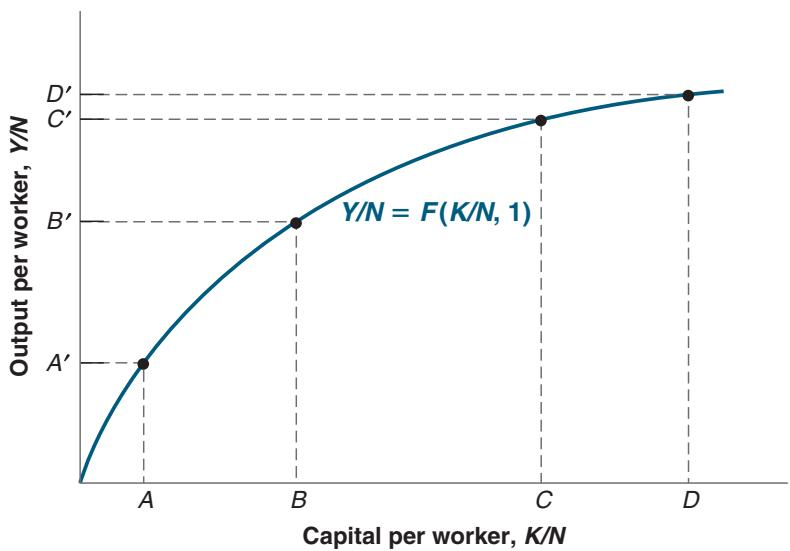
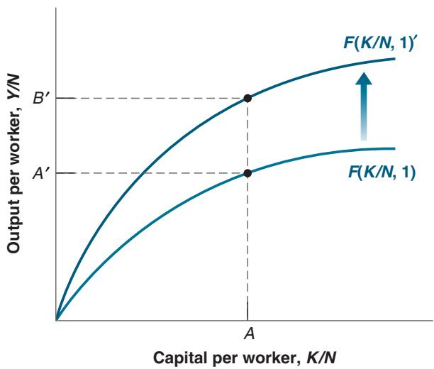

## Output and Capital per Worker

Increases in capital per worker lead to smaller and smaller increases in output per worker.

  
Figure 10-5  
The Effects of an Improvement in the State of Technology  
An improvement in technology shifts the production function up, leading to an increase in output per worker for a given level of capital per worker.

This is shown in Figure 10-5. An improvement in the state of technology shifts the production function up, from F(K>N, 1) to $F ( K / N , 1 ) ^ { \prime }$ . For a given level of capital per worker, the improvement in technology leads to an increase in output per worker. For example, for the level of capital per worker corresponding to point A, output per worker increases from A′ to B′. (To go back to our secretarial pool example, a reallocation of tasks within the pool may lead to a better division of labor and an increase in the output per secretary.)

Increases in capital per worker: Movements along the production function.

Improvements in the state of technology: Shifts (up) of the production function.

Hence, we can think of growth as coming from capital accumulation and from technological progress—the improvement in the state of technology. We will see, however, that these two factors play different roles in the growth process.

■ Capital accumulation by itself cannot sustain growth. A formal argument will have to wait until Chapter 11. But you can already see the intuition behind this in Figure 10-5. Because of decreasing returns to capital, sustaining a steady increase in output per worker will require larger and larger increases in the level of capital per worker. At some stage, the economy will be unwilling or unable to save and invest enough to further increase capital. At that point, output per worker will stop growing.

Does this mean that an economy’s saving rate (the proportion of income that is saved) is irrelevant? No. It is true that a higher saving rate cannot permanently increase the growth rate of output. But a higher saving rate can sustain a higher level of output. Let me state this in a slightly different way. Take two economies that differ only in their saving rates. The two economies will eventually grow at the same rate, but at any point in time, the economy with the higher saving rate will have a higher level of output per person than the other. How this happens, how much the saving rate affects the level of output, and whether a country like the United States (which has a low saving rate) should try to increase its saving rate will be discussed in Chapter 11.

Sustained growth requires sustained technological progress. This really follows from the previous proposition. Given that the two factors that can lead to an increase in output are capital accumulation and technological progress, if capital accumulation cannot sustain growth forever, then technological progress must be the key to growth. And it is. We will see in Chapter 12 that an economy’s rate of growth of output per person is eventually determined by its rate of technological progress.

This is important. It means that in the long run, an economy that sustains a higher rate of technological progress will eventually overtake all other economies. This, of course, raises the next question. What determines the rate of technological progress? One can think of the state of technology as the list of blueprints defining both the range of products that can be produced in the economy and the techniques available to produce them. But, in fact, how efficiently things are produced depends not only on the list of blueprints but also on the way the economy is organized— from the internal organization of firms, to the system of laws and the quality of their enforcement, to the political system, and so on. We shall review the evidence in Chapter 12.

## SUMMARY

Over long periods, fluctuations in output are dwarfed by growth, which is the steady increase of aggregate output over time.

Looking at growth in four rich countries (France, Japan, the United Kingdom, and the United States) since 1950, two main facts emerge.

1. All four countries have experienced strong growth and a large increase in the standard of living. Growth from 1950 to 2017 increased real output per person by a factor of 3.8 in the United States and by a factor of 15.9 in Japan.

2. The levels of output per person across the four countries have converged over time. Put another way, the countries that were behind have grown faster, reducing the gap between them and the current leader, the United States.

Looking at the evidence across a broader set of countries and a longer period, the following facts emerge.

1. On the scale of human history, sustained output growth is a recent phenomenon.

2. The convergence of levels of output per person is not a worldwide phenomenon. Many Asian countries are rapidly catching up, while many African countries have both low levels of output per person and low growth rates.

To think about growth, economists start from an aggregate production function relating aggregate output to two factors of production: capital and labor. How much output is produced given these inputs depends on the state of technology.

Under the assumption of constant returns, the aggregate production function implies that increases in output per worker can come either from increases in capital per worker or from improvements in the state of technology.

Capital accumulation by itself cannot permanently sustain growth of output per person. Nevertheless, how much a country saves is important because the saving rate determines the level of output per person, if not its growth rate.

Sustained growth of output per person is ultimately due to technological progress. Perhaps the most important question in growth theory is what the determinants of technological progress are.

## KEY TERMS

growth, 201

logarithmic scale, 201

standard of living, 202

output per person, 202

purchasing power, 203

purchasing power parity (PPP), 203

Easterlin paradox, 206

force of compounding, 207

convergence, 208

Malthusian trap, 209 four tigers, 211 aggregate production function, 212 state of technology, 213 constant returns to scale, 213 decreasing returns to capital, 213 decreasing returns to labor, 213 capital accumulation, 215 technological progress, 215 saving rate, 215
