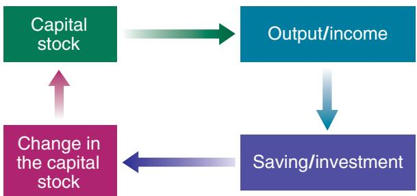
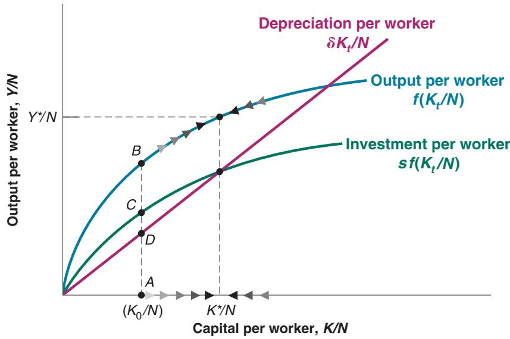

# Saving, Capital Accumulation, and Output

Since 1970, the US saving rate—the ratio of saving to gross domestic product (GDP)—has averaged only 17%, compared to 23% in Germany and 29% in Japan. Would ahigher US saving rate have led to a higher US growth rate over the period? Would has averaged only 17%, compared to 23% in Germany and 29% in Japan. Would a higher US saving rate have led to a higher US growth rate over the period? Would increasing the US saving rate lead to sustained higher US growth in the future?

We gave the basic answer to these questions at the end of Chapter 10: no. Over long periods—an important qualification to which we will return—an economy’s growth rate does not depend on its saving rate. It does not appear that a higher saving rate would have led to higher US growth rate over the last 50 years. Nor should we expect that an increase in the saving rate will lead to sustained higher US growth.

This conclusion does not mean, however, that we should not be concerned about the low US saving rate. Even if the saving rate does not permanently affect the growth rate, it does affect the level of output and the standard of living. An increase in the saving rate would lead to higher growth for some time and eventually to a higher standard of living in the United States.

This chapter focuses on the effects of the saving rate on the level and growth rate of output.

Sections 11-1 and 11-2 look at the interactions between output and capital accumulation and the effects of the saving rate.

Section 11-3 plugs in numbers to give a better sense of the magnitudes involved.

Section 11-4 extends our discussion to take into account not only physical but also human capital.

If you remember one basic message from this chapter, it should be: Capital accumulation increases output, but cannot by itself sustain growth.

## 11-1 INTERACTIONS BETWEEN OUTPUT AND CAPITAL

At the center of the determination of output in the long run are two relations between output and capital:

■ The amount of capital determines the amount of output being produced.

■ The amount of output being produced determines the amount of saving and, in turn, the amount of capital being accumulated over time.

Together, these two relations, which are represented in Figure 11-1, determine the evolution of output and capital over time. The green arrow captures the first relation, from capital to output. The blue and purple arrows capture the two parts of the second relation, from output to saving and investment, and from investment to the change in the capital stock. Let’s look at each relation in turn.

## The Effects of Capital on Output

We started discussing the first of these two relations, the effect of capital on output, in Section 10-4 in Chapter 10. There we introduced the aggregate production function and you saw that, under the assumption of constant returns to scale, we can write the following relation between output and capital per worker (equation (10.3)):

Suppose, for example, that the function F has the double square root form $F ( K , N ) = { \sqrt { K \vee N } } ,$ so

$$
Y = \sqrt {K} \sqrt {N}
$$

Divide both sides by2 2 $N ,$ so

$$
Y / N = \sqrt {K} \sqrt {N} / N
$$

Note that Note that

$\sqrt { N } / N = \sqrt { N } / ( \sqrt { N } \sqrt { N } )$ Using this result in the preceding equation leads to the following model of income per person:2

$$
Y / N = \sqrt {K} / \sqrt {N} = \sqrt {K / N}
$$

So, in this case, the function f giving the relation between output per worker and capital per worker is simply the square root function

$$
f (K / N) = \sqrt {K / N}
$$

$$
\frac {Y}{N} = F \bigg (\frac {K}{N}, 1 \bigg)
$$

Output per worker $( Y / N )$ is an increasing function of capital per worker $( K / N )$ Under the assumption of decreasing returns to capital, the effect of a given increase in capital per worker on output per worker decreases as the ratio of capital per worker gets larger. When capital per worker is already high, further increases in capital per worker have only a small effect on output per worker.

To simplify notation, we will rewrite this relation between output and capital per worker as

$$
\frac {Y}{N} = f \bigg (\frac {K}{N} \bigg)
$$

where the function f represents the same relation between output and capital per worker as the functionc $F \colon$

$$
f \bigg (\frac {K}{N} \bigg) \equiv F \bigg (\frac {K}{N}, 1 \bigg)
$$

In this chapter, we shall make two further assumptions:

The first is that the size of the population, the participation rate, and the unemployment rate are all constant. This implies that employment, N, is also constant. To see why, go back to the relations we saw in Chapter 2 and again in Chapter 7, between population, the labor force, unemployment, and employment:

– The labor force is equal to population multiplied by the participation rate. So if population is constant and the participation rate is constant, the labor force is also constant.

Employment, in turn, is equal to the labor force multiplied by 1 minus the unemployment rate. If, for example, the size of the labor force is 100 million and the unemployment rate is 5%, then employment is equal to 95 million (100 million times $( 1 - 0 . 0 5 ) $ . So, if the labor force is constant and the unemployment rate is constant, employment is also constant.

Capital, Output, and Saving/Investment

Under these assumptions, output per worker, output per person, and output itself all move proportionately. Although we will usually refer to movements in output or capital per worker, to lighten the text we shall sometimes just talk about movements in output or capital, leaving out the “per worker” or “per person” qualification.

In the United States in 2017, output per person (in 2011 PPP dollars) was \$54,795; output per worker was much higher, at \$115,120. (From these two numbers, can you derive the ratio of employment to population?)

The reason for assuming that N is constant is to make it easier to focus on how capital accumulation affects growth. If N is constant, the only factor of production that changes over time is capital. The assumption is not realistic, however, so we will relax it in the next two chapters. (There are two ways in which this is a simplification. The first is that population, and thus employment, typically increase over time. The other is that, in the short run, as we saw in the first nine chapters, employment may deviate from potential employment.)

■ The second assumption is that there is no technological progress, so the production function f (or, equivalently, F) does not change over time.

Again, the reason for making this assumption—which is obviously contrary to reality—is to focus just on the role of capital accumulation. In Chapter 12, we shall introduce technological progress and see that the basic conclusions we derive here about the role of capital in growth also hold when there is technological progress. Again, this step is better left to later.

With these two assumptions, our first relation between output and capital per worker, from the production side, can be written as

$$
\frac {Y _ {t}}{N} = f \bigg (\frac {K _ {t}}{N} \bigg)\tag{11.1}
$$

where we have introduced time indexes for output and capital—but not for labor, N, which we assume to be constant and so does not need a time index.

In words: Higher capital per worker leads to higher output per worker.

From the production side: The level of capital per worker determines the level b of output per worker.

## The Effects of Output on Capital Accumulation

To derive the second relation between output and capital accumulation, we proceed in two steps.

First, we derive the relation between output and investment.

Then we derive the relation between investment and capital accumulation.

## Output and Investment

To derive the relation between output and investment, we make three assumptions:

■ We continue to assume that the economy is closed. As we saw in Chapter 3 (equation (3.10)), this means that investment, I, is equal to saving—the sum of private saving, S, and public saving, $T \mathrm { ~ - ~ } G .$

$$
I = S + (T - G)
$$

As we shall see in Chapter 17, saving and investment need not be equal in an open economy. A country can save less than it invests, and borrow the difference from the rest of the world. This is the case for the United States today.

You have now seen two specifications of saving behavior (equivalently consumption behavior): one for the short run in Chapter 3, and one for the long run in this chapter. You may wonder how the two specifications relate to each other and whether they are consistent. The answer is yes. A full discussion is given in Chapter 15.

■ To focus on the behavior of private saving, we assume that public saving, $T \mathrm { ~ - ~ } G ,$ , is equal to zero. (We shall later relax this assumption when we focus on the effects of fiscal policy on growth.) With this assumption, the previous equation becomes

$$
I = S
$$

Investment is equal to private saving.

■ We assume that private saving is proportional to income, so

$$
S = s Y
$$

The parameter s is the saving rate. It has a value between zero and 1. This assumption captures two basic facts about saving. First, the saving rate does not appear to systematically increase or decrease as a country becomes richer. Second, richer countries do not appear to have systematically higher or lower saving rates than poorer ones.

Combining these two relations and introducing time indexes gives a simple relation between investment and output:

$$
I _ {t} = s Y _ {t}
$$

Investment is proportional to output; the higher output is, the higher is saving and so the higher is investment.

## Investment and Capital Accumulation

Recall: Flows are variables that have a time dimension (that is, they are defined per unit of time); stocks are variables that do not have a time dimension (they are defined at a point in time). Output, saving, and investment are flows. Employment and capital are stocks.

The second step relates investment, which is a flow (the new machines produced and new plants built during a given period), to capital, which is a stock (the existing machines and plants in the economy at a point in time).c

Think of time as measured in years, so t denotes year $t , t + 1$ denotes year $t + 1$ and so on. Think of the capital stock as being measured at the beginning of each year, so $K _ { t }$ refers to the capital stock at the beginning of year t, $K _ { t + 1 }$ to the capital stock at the beginning of year t + 1, and so on.

Assume that capital depreciates at rate d (the lowercase Greek letter delta) per year. That is, from one year to the next, a proportion d of the capital stock breaks down and becomes useless. Equivalently, a proportion $( 1 - \delta )$ of the capital stock remains intact from one year to the next.

The evolution of the capital stock is then given by

$$
K _ {t + 1} = (1 - \delta) K _ {t} + I _ {t}
$$

The capital stock at the beginning of year $t + 1 , K _ { t + 1 }$ , is equal to the capital stock at the beginning of year t, which is still intact in year $t + 1 , ( 1 - \delta ) K _ { t } ,$ , plus the new capital stock put in place during year t (i.e., investment during year t, I ).

We can now combine the relation between output and investment and the relation between investment and capital accumulation to obtain the second relation we need to think about growth: the relation between output and capital accumulation.

Replacing investment by its expression above and dividing both sides by N (the number of workers in the economy) gives

$$
\frac {K _ {t + 1}}{N} = (1 - \delta) \frac {K _ {t}}{N} + s \frac {Y _ {t}}{N}
$$

In words: Capital per worker at the beginning of year t + 1 is equal to capital per worker at the beginning of year t, adjusted for depreciation, plus investment per worker during year t, which is equal to the saving rate times output per worker during year t.

Expanding the term $\left( 1 - \delta \right) K _ { t } / N$ to $K _ { t } / N - \delta K _ { t } / N ,$ , moving $K _ { t } / N$ to the left, and reorganizing the right side,

$$
\frac {K _ {t + 1}}{N} - \frac {K _ {t}}{N} = s \frac {Y _ {t}}{N} - \delta \frac {K _ {t}}{N}\tag{11.2}
$$

In words: The change in the capital stock per worker, represented by the difference between the two terms on the left, is equal to saving per worker, represented by the first term on the right, minus depreciation, represented by the second term on the right. This equation gives us the second relation between output and capital per worker.

From the saving side: The level of output per worker determines the change in the level of capital per worker b over time.

## 11-2 THE IMPLICATIONS OF ALTERNATIVE SAVING RATES

We have derived two relations:

■ From the production side, we have seen in equation (11.1) how capital determines output.

■ From the saving side, we have seen in equation (11.2) how output in turn determines capital accumulation.

We can now put the two relations together and see how they determine the behavior of output and capital over time.

## Dynamics of Capital and Output

Replacing output per worker $( Y _ { t } / N )$ in equation (11.2) by its expression in terms of capital per worker $( K _ { t } / N )$ from equation (11.1) gives

$$
\begin{array}{r c l} \frac {K _ {t + 1}}{N} - \frac {K _ {t}}{N} & = & s f \left(\frac {K _ {t}}{N}\right) - \delta \left(\frac {K _ {t}}{N}\right) \\ \text {change in capital} & = & \text {investment} - \text {depreciation} \\ \text {from year $t$ to year $t$ + 1} & & \text {during year $t$} \quad \text {during year $t$} \end{array}\tag{11.3}
$$

This relation describes what happens to capital per worker. The change in capital per worker from this year to next year depends on the difference between two terms:

Investment per worker, the first term on the right: The level of capital per worker this year determines output per worker this year. Given the saving rate, output per worker determines the amount of saving per worker and thus the investment per worker this year.

■ Depreciation per worker, the second term on the right: The capital stock per worker determines the amount of depreciation per worker this year.

$$
\begin{array}{l} \blacktriangleleft K _ {t} / N \Rightarrow f (K _ {t} / N) \Rightarrow s f (K _ {t} / N) \\ \blacktriangleleft K _ {t} / N \Rightarrow \delta K _ {t} / N \end{array}
$$

If investment per worker exceeds depreciation per worker, the change in capital per worker is positive. Capital per worker increases.

If investment per worker is less than depreciation per worker, the change in capital per worker is negative. Capital per worker decreases.

Given capital per worker, output per worker is then given by equation (11.1):

$$
\frac {Y _ {t}}{N} = f \bigg (\frac {K _ {t}}{N} \bigg)
$$

To make the graph easier to read, I have assumed an unrealistically high saving rate. (Can you tell roughly what value I have assumed for s? What would be a

## Figure 11-2

## Capital and Output Dynamics

When capital and output are low, investment exceeds depreciation and capital increases. When capital and output are high, investment is less than depreciation and capital dec reases.

The hard work is done. Equations (11.3) and (11.1) contain all the information we need to understand the dynamics of capital and output over time. The easiest way to interpret them is to use a graph. We do this in Figure 11-2: Output per worker is measured on the vertical axis, and capital per worker is measured on the horizontal axis.

In Figure 11-2, look first at the curve representing output per worker, $f ( K _ { t } / N )$ , as a function of capital per worker. The relation is the same as in Figure 10-4: Output per worker increases with capital per worker, but, because of decreasing returns to capital, the effect is smaller the higher the level of capital per worker.

Now look at the two curves representing the two components on the right side of equation (11.3):

■ The relation representing investment per worker, $s f ( K _ { t } / N )$ , has the same shape as the production function except that it is lower by a factor s (the saving rate). Suppose the level of capital per worker is equal to $K _ { 0 } / N$ in Figure 11-2. Output per worker is then given by the vertical distance AB, and investment per worker is given by the vertical distance AC, which is equal to s times the vertical distance AB. Thus, just like output per worker, investment per worker increases with capital per worker, but by less and less as capital per worker increases. When capital per worker is already high, the effect of a further increase in capital per worker on output per worker, and by implication on investment per worker, is small.

plausible value for s?) c

■ The relation representing depreciation per worker, $\delta K _ { t } / N ,$ is represented by a straight line. Depreciation per worker increases in proportion to capital per worker so the relation is represented by a straight line with slope equal to d. At the level of capital per worker $K _ { 0 } / N ,$ , depreciation per worker is given by the vertical distance AD.

The change in capital per worker is given by the difference between investment per worker and depreciation per worker. At $K _ { 0 } / N ,$ , the difference is positive; investment per worker exceeds depreciation per worker by an amount represented by the vertical distance $C D = A C - A D$ , so capital per worker increases. As we move to the right along the horizontal axis and look at higher and higher levels of capital per worker, investment increases by less and less, while depreciation keeps increasing in proportion to capital. For some level of capital per worker, $K ^ { * } / N$ in Figure 11-2, investment is just enough to cover depreciation, and capital per worker remains constant. To the left of $K ^ { * } / N ,$ , investment exceeds depreciation and capital per worker increases. This is indicated by the arrows pointing to the right along the curve representing the production function. To the right of $K ^ { * } / N ,$ depreciation exceeds investment, and capital per worker decreases. This is indicated by the arrows pointing to the left along the curve representing the production function.

Characterizing the evolution of capital per worker and output per worker over time now is easy. Consider an economy that starts with a low level of capital per worker—say, $K _ { 0 } / N$ in Figure 11-2. Because investment exceeds depreciation at this point, capital per worker increases. And because output moves with capital, output per worker increases as well. Capital per worker eventually reaches $K ^ { * } / N ,$ , the level at which investment is equal to depreciation. Once the economy has reached the level of capital per worker $K ^ { * } / N ,$ , output per worker and capital per worker remain constant at $Y ^ { * } / N$ and $K ^ { * } / N$ , their long-run equilibrium levels.

When capital per worker is low, capital per worker and output per worker increase over time. When capital per worker is high, capital per worker and output per worker decrease over time.

Think, for example, of a country that loses part of its capital stock, say as a result of bombing during a war. The mechanism we have just seen suggests that, if the country has suffered larger capital losses than population losses, it will come out of the war with a low level of capital per worker; that is, at a point to the left of $K ^ { * } / N$ . The country will then experience a large increase in both capital per worker and output per worker for some time. This describes well what happened after World War II to countries that had proportionately larger destructions of capital than losses of human lives (see the Focus Box “Capital Accumulation and Growth in France in the Aftermath of World War II”).

What does the model predict for postwar growth if a country suffers proportional losses in population and in capital? Do you find this answer convincing? What elements may be missing from the model?

If a country starts instead from a high level of capital per worker—that is, from a point to the right of $K ^ { * } / N \bar { . }$ —then depreciation will exceed investment, and capital per worker and output per worker will decrease. The initial level of capital per worker is too high to be sustained given the saving rate. This decrease in capital per worker will continue until the economy again reaches the point where investment is equal to depreciation and capital per worker is equal to $K ^ { * } / N .$ . From then on, capital per worker and output per worker will remain constant.

Let’s look more closely at the levels of output per worker and capital per worker to which the economy converges in the long run. The state in which output per worker and capital per worker are no longer changing is called the steady state of the economy. Setting the left side of equation (11.3) equal to zero (in steady state, by definition, the change in capital per worker is zero), the steady-state value of capital per worker, $K ^ { * } / N$ , is given by

$$
s f \bigg (\frac {K ^ {*}}{N} \bigg) = \delta \frac {K ^ {*}}{N}\tag{11.4}
$$

The steady-state value of capital per worker is such that the amount of saving per worker (the left side) is just sufficient to cover depreciation of the capital stock per worker (the right side of the equation).

Given steady-state capital per worker $( K ^ { * } / N )$ , the steady-state value of output per worker $( Y ^ { * } / N )$ is given by the production function

$$
\frac {Y ^ {*}}{N} = f \bigg (\frac {K ^ {*}}{N} \bigg)\tag{11.5}
$$

We now have all the elements we need to discuss the effects of the saving rate on output per worker, both over time and in steady state.

## The Saving Rate and Output

Let’s return to the question we posed at the beginning of the chapter: How does the saving rate affect the growth rate of output per worker? Our analysis leads to a three-part answer:

1. The saving rate has no effect on the long-run growth rate of output per worker, which is equal to zero.

This conclusion is rather obvious; we have seen that, eventually, the economy converges to a constant level of output per worker. In other words, in the long run, the growth rate of output is equal to zero, no matter what the saving rate is.
