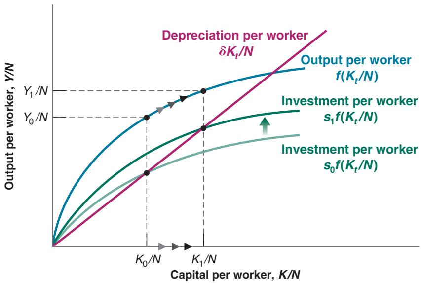
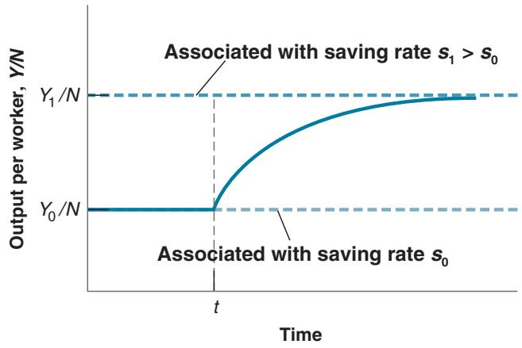
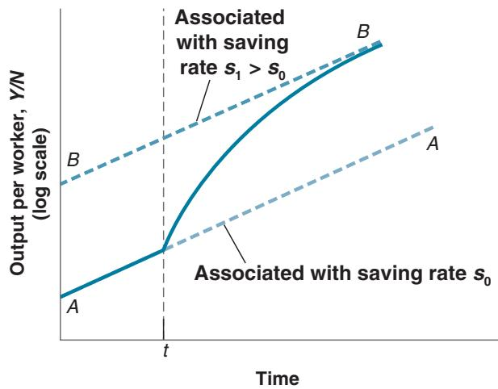
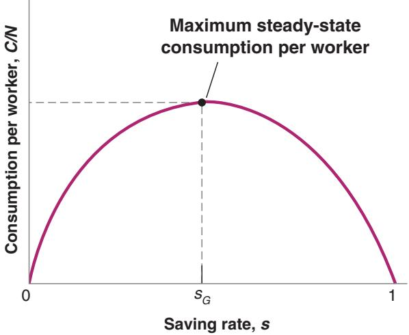

# Capital Accumulation and Growth in France in the Aftermath of World War II

When World War II ended in 1945, France had suffered some of the heaviest losses of all European countries. The losses in lives were large; out of a population of 42 million, more than 550,000 people died. Relatively speaking, though, the losses in capital were much larger. It is estimated that the French capital stock in 1945 was about 30% below its prewar value. A vivid picture of the destruction of capital is provided by the numbers in Table 1.

The model of growth we have just seen makes a clear prediction about what will happen to a country that loses a large part of its capital stock. The country will experience high capital accumulation and output growth for some time. In terms of Figure 11-2, a country with capital per worker initially far below K\*>N will grow rapidly as it converges to K\*>N and output per worker converges to Y\*>N.

This prediction fares well in the case of postwar France. There is plenty of anecdotal evidence that small increases in capital led to large increases in output. Minor repairs to a major bridge would lead to the reopening of the bridge.

Reopening the bridge would significantly shorten the travel time between two cities, leading to much lower transport costs. The lower transport costs would then enable a plant to get much-needed inputs, increase its production, and so on.

More convincing evidence, however, comes directly from actual aggregate output numbers. From 1946 to 1950, the annual growth rate of French real GDP was a high 9.6% per year. This led to an increase in real GDP of about 60% over 5 years.

Was all of the increase in French GDP the result of capital accumulation? The answer is no. There were other forces at work in addition to the mechanism in our model. Much of the remaining capital stock in 1945 was old. Investment had been low in the 1930s (a decade dominated by the Great Depression) and nearly nonexistent during the war. A good portion of the postwar capital accumulation was associated with the introduction of more modern capital and the use of more modern production techniques. This was another reason for the high growth rates of the postwar period.1

Table 1 Proportion of the French Capital Stock Destroyed by the End of World War II

<table><tr><td>Railways</td><td>Tracks</td><td>6%</td><td>Rivers</td><td>Waterways</td><td>86%</td></tr><tr><td></td><td>Stations</td><td>38%</td><td></td><td>Canal locks</td><td>11%</td></tr><tr><td></td><td>Engines</td><td>21%</td><td></td><td>Barges</td><td>80%</td></tr><tr><td></td><td>Hardware</td><td>60%</td><td>Buildings</td><td>(numbers)</td><td></td></tr><tr><td>Roads</td><td>Cars</td><td>31%</td><td></td><td>Dwellings</td><td>1,229,000</td></tr><tr><td></td><td>Trucks</td><td>40%</td><td></td><td>Industrial</td><td>246,000</td></tr></table>

Some economists argue that the high output growth achieved by the Soviet Union from 1950 to 1990 was the result of such a steady increase in the saving rate over time, which could not be sustained forever. Paul Krugman has used the term Stalinist growth to denote this type of growth, which is growth resulting from a higher and higher saving rate over time.

Note that the first proposition is a statement about the growth rate of output per worker. The second proposition is a statement about the level of output per worker.

There is, however, a way of thinking about this conclusion that will be useful when we allow for technological progress in Chapter 12. Think of what would be needed to sustain a constant positive growth rate of output per worker in the long run. Capital per worker would have to increase. Not only that, but because of decreasing returns to capital, it would have to increase faster than output per worker. This implies that each year the economy would have to save a larger and larger fraction of its output and dedicate it to capital accumulation. At some point, the fraction of output it would need to save would be greater than 1—something clearly impossible. This is why it is impossible, absent technological progress, to sustain a constant positive growth rate forever. In the long run, capital per worker must be constant, and so output per worker must also be constant.

2. Nonetheless, the saving rate determines the level of output per worker in the long run. Other things being equal, countries with a higher saving rate will achieve higher output per worker in the long run.

Figure 11-3 illustrates this point. Consider two countries with the same production function, the same level of employment, and the same depreciation rate, but with different saving rates, say $s _ { 0 }$ and $s _ { 1 } > s _ { 0 } .$ . Figure 11-3 draws

  
Figure 11-3

## The Effects of Different Saving Rates

A country with a higher saving rate achieves a higher steady-state level of output per worker.

their common production function, $f ( K _ { t } / N )$ , and the functions showing saving/investment per worker as a function of capital per worker for each of the two countries, $s _ { 0 } f ( K _ { t } / N )$ and $s _ { 1 } f ( K _ { t } / N )$ . In the long run, the country with saving rate $s _ { 0 }$ will reach the level of capital per worker $K _ { 0 } / N$ and output per worker $Y _ { 0 } / N$ . The country with saving rate $s _ { 1 }$ will reach the higher levels $K _ { 1 } / N$ and $Y _ { 1 } / N$

3. An increase in the saving rate will lead to higher growth of output per worker for some time, but not forever.

This conclusion follows from the two propositions we just discussed. From the first, we know that an increase in the saving rate does not affect the long-run growth rate of output $p e r$ worker, which remains equal to zero. From the second, we know that an increase in the saving rate leads to an increase in the long-run level of output per worker. It follows that, as output per worker increases to its new higher level in response to the increase in the saving rate, the economy will go through a period of positive growth. This period of growth will come to an end when the economy reaches its new steady state.

We can use Figure 11-3 again to illustrate this point. Consider a country that has an initial saving rate of $s _ { 0 } .$ . Assume that capital per worker is initially equal to $K _ { 0 } / N ,$ with associated output per worker $Y _ { 0 } / N$ . Now consider the effects of an increase in the saving rate from $s _ { 0 }$ to $s _ { 1 }$ . The relation giving saving/investment per worker as a function of capital per worker shifts upward from $s _ { 0 } f ( K _ { t } / N )$ to $s _ { 1 } f ( K _ { t } / N )$

At the initial level of capital per worker, $K _ { 0 } / N ,$ , investment exceeds depreciation, so capital per worker increases. As capital per worker increases, so does output per worker, and the economy goes through a period of positive growth. When capital per worker eventually reaches $K _ { 1 } / N ,$ , however, investment is again equal to depreciation, and growth ends. From then on, the economy remains at $K _ { 1 } / N$ , with associated output per worker $Y _ { 1 } / N .$ . The movement of output per worker is plotted against time in Figure 11-4. Output per worker is initially constant at level $Y _ { 0 } / N .$ . After an increase in the saving rate at time t, output per worker increases for some time until it reaches $Y _ { 1 } / N$ and the growth rate returns to zero.

We have derived these three results under the assumption that there was no technological progress, and therefore, no growth of output per worker in the long run. But, as we will see in Chapter 12, the three results extend to an economy in which there is technological progress. Let us briefly see how.

Figure 11-4

The Effects of an Increase in the Saving Rate on Output per Worker in an Economy without Technological Progress

An increase in the saving rate leads to a period of higher growth until output reaches its new higher steady-state level.

An economy in which there is technological progress has a positive growth rate of output per worker, even in the long run. This long-run growth rate is independent of the saving rate—the extension of the first result just discussed. The saving rate affects the level of output per worker, however—the extension of the second result. An increase in the saving rate leads to growth greater than steady-state growth for some time until the economy reaches its new higher path—the extension of our third result.

These three results are illustrated in Figure 11-5, which extends Figure 11-4 by plotting the effect of an increase in the saving rate on an economy with positive technological progress. The figure uses a logarithmic scale to measure output per worker. It follows that an economy in which output per worker grows at a constant rate is represented by a line with slope equal to that growth rate. At the initial saving rate, $s _ { 0 } ,$ the economy moves along AA. If, at time t, the saving rate increases to $s _ { 1 }$ , the economy experiences higher growth for some time until it reaches its new, higher path, BB. The growth rate then becomes the same as before the increase in the saving rate (that is, the slope of BB is the same as the slope of AA).c

See the discussion of logarithmic scales in Appendix 2 at the end of the book.

## The Saving Rate and Consumption

Recall: Saving is the sum of private plus public saving. Recall also that Public saving 3 Budget surplus; Public dissaving 3 Budget deficit.

Governments can affect the saving rate in various ways. First, they can vary public saving. Given private saving, positive public saving—a budget surplus, in other words— leads to higher overall saving. Conversely, negative public saving—a budget deficit— leads to lower overall saving. Second, governments can use taxes to affect private saving. For example, they can give tax breaks to people who save, making it more attractive to save and thus increasing private saving.c

Figure 11-5

The Effects of an Increase in the Saving Rate on Output per Worker in an Economy with Technological Progress

An increase in the saving rate leads to a period of higher growth until output reaches a new, higher path.

What saving rate should governments aim for? To think about the answer, we must shift our focus from the behavior of output to the behavior of consumption. The reason: What matters to people is not how much is produced, but how much they consume.

It is clear that an increase in saving must come initially at the expense of lower consumption (except when we think it helpful, we drop “per worker” in this subsection and just refer to consumption rather than consumption per worker, capital rather than capital per worker, and so on). A change in the saving rate this year has no effect on capital this year and consequently no effect on output and income this year. So an increase in saving comes initially with an equal decrease in consumption.

Does an increase in saving lead to an increase in consumption in the long run? Not necessarily. Consumption may decrease, not only initially but also in the long run. You may find this surprising. After all, we know from Figure 11-3 that an increase in the saving rate always leads to an increase in the level of output per worker. But output is not the same as consumption. To see why not, consider what happens for two extreme values of the saving rate.

Because we assume that employment is constant, we are ignoring the short-run effect of an increase in the saving rate on output we focused on in Chapters 3, 5, and 9. In the short run, not only does an increase in the saving rate reduce consump-

tion given income, but it may also create a recession and decrease income further. We shall return to a discussion of short-run and long-run effects of changes in saving in Chapters 16 and 22.

■ An economy in which the saving rate is (and has always been) zero is an economy in which capital is equal to zero. In this case, output is also equal to zero, and so is consumption. A saving rate equal to zero implies zero consumption in the long run.

■ Now consider an economy in which the saving rate is equal to one. People save all their income. The level of capital, and thus output, in this economy will be high. But because people save all of their income, consumption is equal to zero. What happens is that the economy is carrying an excessive amount of capital. Simply maintaining that level of output requires that all output be devoted to replacing depreciation! A saving rate equal to one also implies zero consumption in the long run.

These two extreme cases mean that there must be some value of the saving rate between zero and one that maximizes the steady-state level of consumption. Increases in the saving rate below this value lead to a decrease in consumption initially, but they lead to an increase in consumption in the long run. Increases in the saving rate beyond this value decrease consumption not only initially but also in the long run. This happens because the increase in capital associated with the increase in the saving rate leads to only a small increase in output—an increase that is too small to cover the increased depreciation. In other words, the economy carries too much capital. The level of capital associated with the value of the saving rate that yields the highest level of consumption in steady state is known as the golden-rule level of capital. Increases in capital beyond the golden-rule level reduce steady-state consumption.

This argument is illustrated in Figure 11-6, which plots consumption per worker in steady state (on the vertical axis) against the saving rate (on the horizontal axis).

  
Figure 11-6  
The Effects of the Saving Rate on Steady-State Consumption per Worker  
An increase in the saving rate leads to an increase, then to a decrease in steady-state consumption per worker.

A saving rate equal to zero implies a capital stock per worker equal to zero, a level of output per worker equal to zero, and, by implication, a level of consumption per worker equal to zero. For s between zero and $s _ { G }$ (G for golden rule), a higher saving rate leads to higher capital per worker, higher output per worker, and higher consumption per worker. For s larger than $s _ { G } ,$ increases in the saving rate still lead to higher values of capital per worker and output per worker; but they now lead to lower values of consumption per worker. This is because the increase in output is more than offset by the increase in depreciation as a result of the larger capital stock. For $s = 1$ , consumption per worker is equal to zero. Capital per worker and output per worker are high, but all of the output is used just to replace depreciation, leaving nothing for consumption.

If an economy already has so much capital that it is operating beyond the golden rule, then increasing saving further will decrease consumption not only now, but also later. Is this a relevant worry? Do some countries actually have too much capital? The empirical evidence indicates that OECD countries are typically below their golden-rule level of capital. If they were to increase the saving rate, it would lead to higher consumption in the future—not lower consumption.

This means that, in practice, governments face a trade-off: An increase in the saving rate leads to lower consumption for some time but higher consumption later. So what should governments do? How close to the golden rule should they try to get? That depends on how much weight they put on the welfare of current generations—who are more likely to lose from policies aimed at increasing the saving rate—versus the welfare of future generations—who are more likely to gain. Enter politics: Future generations do not vote. This means that governments are unlikely to ask current generations to make large sacrifices, which, in turn, means that countries are more likely to underinvest than overinvest. These intergenerational issues are at the forefront of the debate on Social Security reform in the United States. The Focus Box “Social Security, Saving, and Capital Accumulation in the United States” explores this further.

## 11-3 GETTING A SENSE OF MAGNITUDES

How big an impact does a change in the saving rate have on output in the long run? For how long and by how much does an increase in the saving rate affect growth? How far is the United States from the golden-rule level of capital? To get a better sense of the answers to these questions, let’s now make more specific assumptions, plug in some numbers, and see what we get.

Assume the production function is

Check that this production function exhibits both constant returns to scale and decreasing returns to either capital or labor.

$$
Y = \sqrt {K} \sqrt {N}\tag{11.6}
$$

Output equals the product of the square root of capital and the square root of labor. (A more general specification of the production function known as the Cobb-Douglas production function, and its implications for growth, is given in the appendix to this chapter.)

Dividing both sides by N (because we are interested in output per worker),2 2 2

$$
\frac {Y}{N} = \frac {\sqrt {K} \sqrt {N}}{N} = \frac {\sqrt {K}}{\sqrt {N}} = \sqrt {\frac {K}{N}}
$$

The second equality 2 Output per worker equals the square root of capital per worker. Put another way, the $\begin{array} { r } { \mathsf { f o l l o w s f r o m } \sqrt { N } / N = } \\ { \sqrt { N } / \left( \sqrt { N } \sqrt { N } \right) = 1 / \sqrt { N } . } \end{array}$ production function f relating output per worker to capital per worker is given byc

$$
f \bigg (\frac {K _ {t}}{N} \bigg) = \sqrt {\frac {K _ {t}}{N}}
$$

