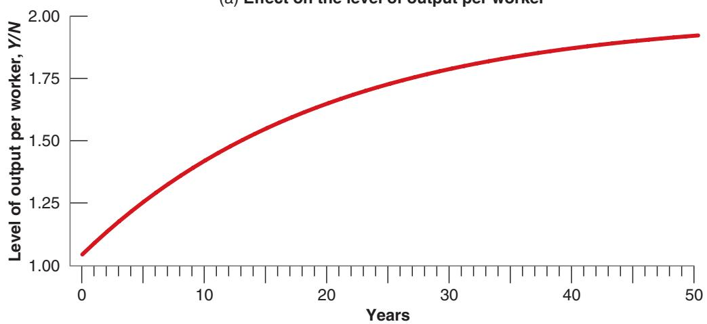
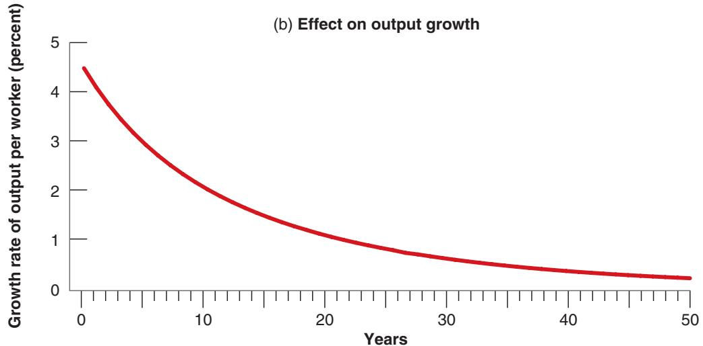

# Social Security, Saving, and Capital Accumulation in the United States

Social Security was introduced in the United States in 1935. The goal of the program was to make sure the elderly would have enough to live on. Over time, Social Security has become the largest government program in the United States. Benefits paid to retirees now exceed 4% of GDP. For twothirds of retirees, Social Security benefits account for more than 50% of their income. There is little question that, on its own terms, the Social Security system has been a great success and has decreased poverty among the elderly. There is also little question that it has also led to a lower US saving rate and therefore lower capital accumulation and lower output per person in the long run.

To understand why, we must take a theoretical detour. Think of an economy in which there is no social security system—one where workers must save to provide for their own retirement. Now, introduce a social security system that collects taxes from workers and distributes benefits to the retirees. It can do so in one of two ways:

One way is by taxing workers, investing their contributions in financial assets, and paying back the principal plus the interest to the workers when they retire. Such a system is called a fully funded social security system: At any time, the system has funds equal to the accumulated contributions of workers, from which it will be able to pay benefits to these workers when they retire.

The other way is by taxing workers and redistributing the tax contributions as benefits to the current retirees. Such a system is called a pay-as-you-go social security system. The system pays benefits out “as it goes,” that is, as it collects them through contributions.

From the point of view of workers, the two systems may look broadly similar. In both cases, people pay contributions when they work and receive benefits when they retire. But there are two major differences.

First, what retirees receive is different in each case:

What they receive in a fully funded system depends on the rate of return on the financial assets held by the fund.

■ What they receive in a pay-as-you-go system depends on demographics—the ratio of retirees to workers—and on the evolution of the tax rate set by the system. When the population ages and the ratio of retirees to workers increases, then either retirees receive less or workers must contribute more. This is the case in the United States today. The ratio of retirees to workers, which is about 0.3 today, is forecast to increase to 0.4–0.5 in 20 years. Under current rules, benefits will increase from 5% of GDP today to 6% in 20 years. Thus, either benefits will have to be reduced, in which case the rate of return to workers who contributed in the past will be low, or contributions will have to be increased, in which case this will decrease the rate of return to workers who are contributing today, or more likely, some combination of both will have to be implemented.

Second, and leaving aside the aging issue, the two systems have different macroeconomic implications:

In the fully funded system, workers save less because they anticipate receiving benefits when they are old. But the Social Security system saves on their behalf, by investing their contributions in financial assets. The presence of a social security system changes the composition of overall saving: Private saving goes down, and public saving goes up. But, to a first approximation, it has no effect on total saving and therefore no effect on capital accumulation.

In the pay-as-you-go system, workers also save less because they again anticipate receiving benefits when they are old. But now, the Social Security system does not save on their behalf. The decrease in private saving is not compensated by an increase in public saving. Total saving goes down, and so does capital accumulation.

Most social security systems are somewhere between pay-as-you-go and fully funded systems. When the US system was set up in 1935, the intention was to partially fund it. But this did not happen. Rather than being invested, contributions from workers were used to pay benefits to the retirees, and this has been the case ever since. Today, because contributions have slightly exceeded benefits since the early 1980s, Social Security has built a Social Security trust fund. But this trust fund is far smaller than the value of benefits promised to current contributors when they retire. The US system is basically a pay-as-you-go system, and this has probably led to a lower US saving rate over the last 70 years.

In this context, some economists and politicians have suggested that the United States should shift back to a fully funded system. One of their arguments is that the US saving rate is indeed too low and that funding the Social Security system would increase it. Such a shift could be achieved by investing, from now on, tax contributions in financial assets rather than distributing them as benefits to retirees. Under such a shift, the Social Security system would steadily accumulate funds and would eventually become fully funded. Martin Feldstein, an economist at Harvard and an advocate of such a shift, has concluded that it could lead to a 34% increase of the capital stock in the long run.

How should we think about such a proposal? It would probably have been a good idea to fully fund the system at the start. The United States would have a higher saving rate. The US capital stock would be higher, and output and consumption would also be higher. But we cannot rewrite history. The existing system has promised benefits to retirees and these promises must be honored. This means that, under the proposal just described, current workers would, in effect, have to contribute twice; once to fund the system and finance their own retirement, and then again to finance the benefits owed to current retirees. This would impose a disproportionate cost on current workers. And this would come on top of the problems coming from the aging of population which will increase the ratio of retirees to workers, and will require, if retirement benefits are to be maintained, larger contributions from workers. The practical implication is that, if it is to happen, the move to a fully funded system will have to be slow, so that the burden of adjustment does not fall too much on one generation relative to the others.

The debate is likely to be with us for some time. In assessing proposals from the administration or from Congress, ask yourself how they deal with these issues. Take, for example, the proposal to allow workers, from now on, to make contributions to personal accounts instead of to the Social Security system, and to be able to draw from these accounts when they retire. By itself, this proposal would clearly increase private saving: Workers would be saving more. But its ultimate effect on saving depends on how the benefits already promised to current workers and retirees by the Social Security system are financed. If, as is the case under some proposals, these benefits are financed not through additional taxes but through debt finance, then the increase in private saving will be offset by an increase in deficits (i.e., a decrease in public saving). The shift to personal accounts will not increase the US saving rate. If, instead, these benefits are financed through higher taxes, then the US saving rate will increase, but current workers will have to both contribute to their personal accounts and pay the higher taxes. They will indeed pay twice.

To follow the debate on Social Security, look at the site run by the (nonpartisan) Concord Coalition (www.concordcoalition.org) and find the discussion related to Social Security, or look at the annual report of the Social Security Administration, www.ssa.gov/OACT/TR/2018/tr2018.pdf.

Replacing $f ( K _ { t } / N )$ by $\sqrt { K _ { t } / N }$ in equation (11.3),

$$
\frac {K _ {t + 1}}{N} - \frac {K _ {t}}{N} = s \sqrt {\frac {K _ {t}}{N}} - \delta \frac {K _ {t}}{N}\tag{11.7}
$$

This equation describes the evolution of capital per worker over time. Let’s look at what it implies.

## The Effects of the Saving Rate on Steady-State Output

How big an impact does an increase in the saving rate have on the steady-state level of output per worker?

Start with equation (11.7). In steady state the amount of capital per worker is constant, so the left side of the equation equals zero. This implies

$$
s \sqrt {\frac {K ^ {*}}{N}} = \delta \frac {K ^ {*}}{N}
$$

(We have dropped time indexes, which are no longer needed because in steady state $K / N$ is constant. The star is to remind you that we are looking at the steady-state value of capital.) Square both sides:

$$
s ^ {2} \frac {K ^ {*}}{N} = \delta^ {2} \bigg (\frac {K ^ {*}}{N} \bigg) ^ {2}
$$

Divide both sides by $( K / N )$ and reorganize:

$$
\frac {K ^ {*}}{N} = \left(\frac {s}{\delta}\right) ^ {2}\tag{11.8}
$$

Steady-state capital per worker is equal to the square of the ratio of the saving rate to the depreciation rate.

From equations (11.6) and (11.8), steady-state output per worker is given by

$$
\frac {Y ^ {*}}{N} = \sqrt {\frac {K ^ {*}}{N}} = \sqrt {\left(\frac {s}{\delta}\right) ^ {2}} = \frac {s}{\delta}\tag{11.9}
$$

Steady-state output per worker is equal to the ratio of the saving rate to the depreciation rate.

A higher saving rate and a lower depreciation rate both lead to higher steadystate capital per worker (equation (11.8)) and higher steady-state output per worker (equation (11.9)). To see what this means, let’s take a numerical example. Suppose the depreciation rate is 10% per year and the saving rate is also 10%. Then, from equations (11.8) and (11.9), steady-state capital per worker and output per worker are both equal to 1. Now suppose that the saving rate doubles, from 10% to 20%. It follows from equation (11.8) that in the new steady state, capital per worker increases from 1 to 4. And, from equation (11.9), output per worker doubles, from 1 to 2. Thus, doubling the saving rate leads, in the long run, to doubling the output per worker. This is a large effect.

## The Dynamic Effects of an Increase in the Saving Rate

We have just seen that an increase in the saving rate leads to an increase in the steadystate level of output. But how long does it take for output to reach its new steady-state level? Put another way, by how much and for how long does an increase in the saving rate affect the growth rate?

To answer these questions, we must use equation (11.7) and solve it for capital per worker in year 0, in year 1, and so on.

Suppose that the saving rate, which had always been equal to 10%, increases in year 0 from 10% to 20% and remains at this higher value forever. In year 0, nothing happens to the capital stock (recall that it takes one year for higher saving and higher investment to show up in higher capital). So capital per worker remains equal to the steady-state value associated with a saving rate of 0.1. From equation (11.8),

$$
\frac {K _ {0}}{N} = (0. 1 / 0. 1) ^ {2} = 1 ^ {2} = 1
$$

In year 1, equation (11.7) gives

$$
\frac {K _ {1}}{N} - \frac {K _ {0}}{N} = s \sqrt {\frac {K _ {0}}{N}} - \delta \frac {K _ {0}}{N}
$$

With a depreciation rate equal to 0.1 and a saving rate now equal to 0.2, this equation implies

$$
\frac {K _ {1}}{N} - 1 = \left[ (0. 2) (\sqrt {1}) \right] - \left[ (0. 1) 1 \right]
$$

so

$$
\frac {K _ {1}}{N} = 1. 1
$$

In the same way, we can solve for $K _ { 2 } / N ,$ and so on. Once we have determined the values of capital per worker in year 0, year 1, and so on, we can then use equation (11.6) to solve for output per worker in year 0, year 1, and so on. The results of this computation are presented in Figure 11-7. Panel (a) plots the level of output per worker against time. $( Y / N )$ increases from its initial value of 1 in year 0 to its steadystate value of 2 in the long run. Panel (b) gives the same information in a different

The difference between investment and depreciation is largest at the beginning. This is why capital accumulation, and in turn output growth, are highest at the beginning.

way, plotting instead the growth rate of output per worker against time. As panel (b) shows, growth of output per worker is highest at the beginning and then decreases over time. As the economy reaches its new steady state, growth of output per worker returns to zero.

Figure 11-7 clearly shows that the adjustment to the new, higher, long-run equilibrium takes a long time. It is only 40% complete after 10 years, and 63% complete after 20 years. Put another way, the increase in the saving rate increases the growth rate of output per worker for a long time. The average annual growth rate is 3.1% for the first 10 years, and 1.5% for the next 10. Although the changes in the saving rate have no effect on growth in the long run, they do lead to higher growth for a long time.

To go back to the question raised at the beginning of the chapter, would US growth have been substantially higher if the saving rate had been higher since 1950? The answer would be yes if the United States had had a higher saving rate in the past, and if this saving rate had fallen substantially in the last 70 years. Then, this fall in the saving rate would have led, other things being equal, to lower growth in the United States in the last 70 years along the lines of the mechanism in Figure 11-7 (with the sign reversed, as we would be looking at a decrease,

Figure 11-7

The Dynamic Effects of an Increase in the Saving Rate from 10% to 20% on the Level and Growth Rate of Output per Worker

It takes a long time for output to adjust to its new higher level after an increase in the saving rate. Put another way, an increase in the saving rate leads to a long period of higher growth.

(a) Effect on the level of output per worker  

not an increase, in the saving rate). But this is not the case. The US saving rate has been low for a long time.

## The US Saving Rate and the Golden Rule

What is the saving rate that would maximize steady-state consumption per worker? Recall that, in steady state, consumption is equal to what is left after enough is put aside to maintain a constant level of capital. More formally, in steady state, consumption per worker is equal to output per worker minus depreciation per worker:

$$
\frac {C}{N} = \frac {Y}{N} - \delta \frac {K}{N}
$$

Using equations (11.8) and (11.9) for the steady-state values of output per worker and capital per worker, consumption per worker is thus given by

$$
\frac {C}{N} = \frac {s}{\delta} - \delta \bigg (\frac {s}{\delta} \bigg) ^ {2} = \frac {s (1 - s)}{\delta}
$$

Using this equation, together with equations (11.8) and (11.9), Table 11-1 gives the steady-state values of capital per worker, output per worker, and consumption per worker for different values of the saving rate (and for a depreciation rate equal to 10%).

Steady-state consumption per worker is largest when s equals 1/2. In other words, the golden-rule level of capital is associated with a saving rate of 50%. Below that level, increases in the saving rate lead to an increase in long-run consumption per worker. We saw previously that the average US saving rate since 1970 has been only 17%. So we can be quite confident that, at least in the United States, an increase in the saving rate would increase both output per worker and consumption per worker in the long run. What could be done to increase the saving rate is discussed in the Focus Box “Nudging US Households to Save More.”

This may, however, not be true of all countries in the world. Some researchers argue that China, with a saving rate of close to 50%, may indeed be on the other side b of the golden rule.

Check your understanding of the issues: Using the equations in this section, argue the pros and cons of policy measures aimed at increasing the US saving rate.

Table 11-1 The Saving Rate and the Steady-State Levels of Capital, Output, and Consumption per Worker

<table><tr><td>Saving Rate s</td><td>Capital per Worker K/N</td><td>Output per Worker Y/N</td><td>Consumption per Worker C/N</td></tr><tr><td>0.0</td><td>0.0</td><td>0.0</td><td>0.0</td></tr><tr><td>0.1</td><td>1.0</td><td>1.0</td><td>0.9</td></tr><tr><td>0.2</td><td>4.0</td><td>2.0</td><td>1.6</td></tr><tr><td>0.3</td><td>9.0</td><td>3.0</td><td>2.1</td></tr><tr><td>0.4</td><td>16.0</td><td>4.0</td><td>2.4</td></tr><tr><td>0.5</td><td>25.0</td><td>5.0</td><td>2.5</td></tr><tr><td>0.6</td><td>36.0</td><td>6.0</td><td>2.4</td></tr><tr><td>...</td><td>...</td><td>...</td><td>...</td></tr><tr><td>1.0</td><td>100.0</td><td>10.0</td><td>0.0</td></tr></table>
