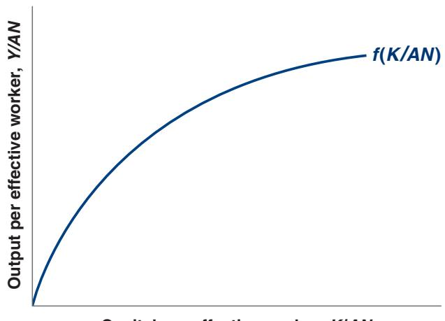
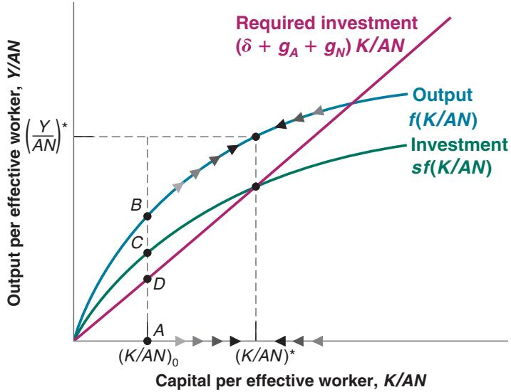
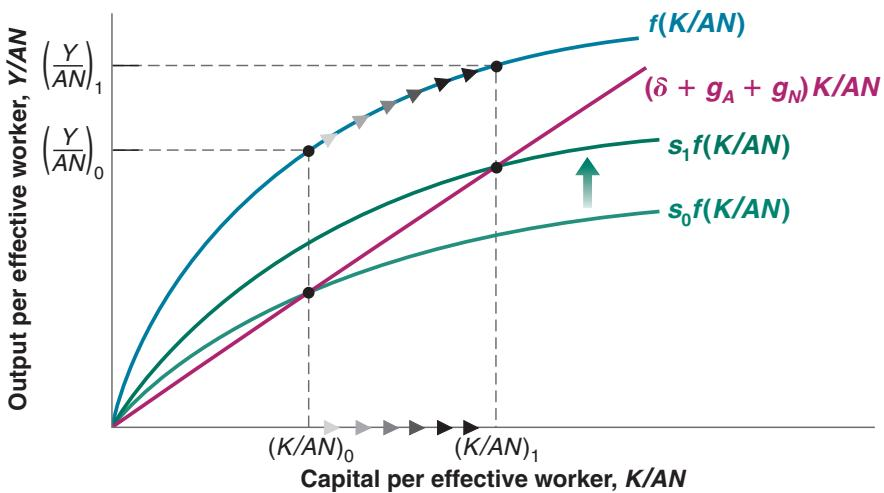
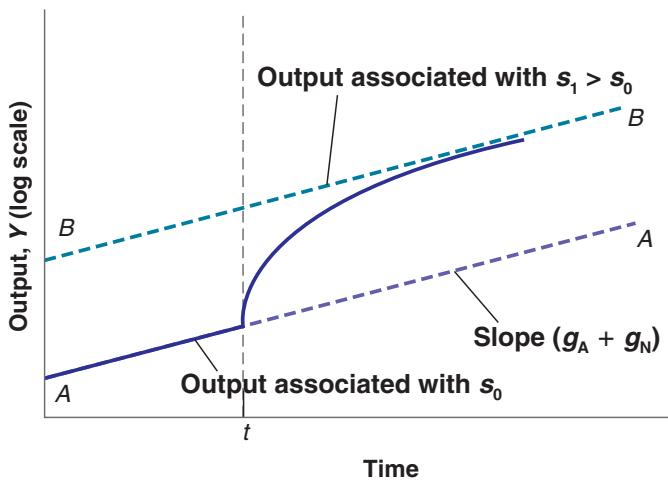

# 12-1 TECHNOLOGICAL PROGRESS AND THE RATE OF GROWTH

In an economy in which there is both capital accumulation and technological progress, at what rate will output grow? To answer this question, we need to extend the model developed in Chapter 11 to allow for technological progress. To do so, we must first revisit the aggregate production function.

## Technological Progress and the Production Function

The average number of items carried by a supermarket increased from 2,200 in 1950 to 38,700 in 2010. To get a sense of what this means, see Robin Williams (who plays an immigrant from the Soviet Union) in the supermarket scene in the movie Moscow on the Hudson.

Technological progress has many dimensions:

■ It can lead to larger quantities of output for given quantities of capital and labor. Think of a new type of lubricant that allows a machine to run at a higher speed and to increase production.

■ It can lead to better products. Think of the steady improvement over time in automobile safety and comfort.

■ It can lead to new products. Think of the introduction of the iPad, wireless communication technology, flat screen monitors, and self-driving cars.

■ It can lead to a larger variety of products. Think of the steady increase in the number of breakfast cereals available at your local supermarket.

These dimensions are more similar than they appear. If we think of consumers as caring not about the goods themselves but about the services these goods provide, then they all have something in common: In each case, consumers receive more services. A better car provides more safety, a new product such as an iPad or faster communication technology provides more communication services, and so on. If we think of output as the underlying services provided by the goods produced in the economy, we can think of technological progress as leading to increases in output for given amounts of capital and labor. We can then think of the state of technology as a variable that tells us how much output can be produced from given amounts of capital and labor at any time. If we denote the state of technology by A, we can rewrite the production function as

For simplicity, we shall ignore human capital here. We return to it later in the

chapter.

$$
\begin{array}{c} Y = F \left(K, N, A\right) \\ \left(+, +, +\right) \end{array}
$$

This is our extended production function. Output depends on both capital and labor (K and N) and on the state of technology (A). Given capital and labor, an improvement in the state of technology, A, leads to an increase in output.

It will be convenient to use a more restrictive form of the preceding equation, namely

$$
Y = F (K, A N)\tag{12.1}
$$

This equation states that production depends on capital and on labor multiplied by the state of technology. Introducing the state of technology in this way makes it easier to think about the effect of technological progress on the relation between output, capital, and labor. Equation (12.1) implies that we can think of technological progress in two equivalent ways:

■ Technological progress reduces the number of workers needed to produce a given amount of output. If A doubles, firms can produce the same quantity of output with only half the original number of workers, N.

■ Technological progress increases the output that can be produced with a given number of workers. We can think of AN as the amount of effective labor in the economy. If the state of technology A doubles, it is as if the economy had twice as many workers. In other words, we can think of output being produced by two factors: capital 1K2, and effective labor 1AN2.

AN is also sometimes called labor in efficiency units.

What restrictions should we impose on the extended production function (12.1)? We can build directly here on our discussion in Chapter 11.

The use of efficiency forb “efficiency units” here and for “efficiency wages” in Chapter 6 is a coincidence; the two notions are unrelated.

Again, it is reasonable to assume constant returns to scale. For a given state of technology 1A2, doubling both the amount of capital 1K2 and the amount of labor 1N2 is likely to lead to a doubling of output

$$
F (2 K, 2 A N) = 2 Y
$$

More generally, for any number x,

$$
F (x K, x A N) = x Y
$$

It is also reasonable to assume decreasing returns to each of the two factors—capital and effective labor. Given effective labor, an increase in capital is likely to increase output but at a decreasing rate. Symmetrically, given capital, an increase in effective labor is likely to increase output, but at a decreasing rate.

It was convenient in Chapter 11 to think in terms of output per worker and capital per worker. That was because the steady state of the economy was a state where output per worker and capital per worker were constant. It is convenient here to look at output per effective worker and capital per effective worker. The reason is the same; as we shall soon see, in steady state, output per effective worker and capital per effective worker are constant.

To get a relation between output per effective worker and capital per effective worker, take $x = 1 / A N$ in the preceding equation. This gives

$$
\frac {Y}{A N} = F \bigg (\frac {K}{A N}, 1 \bigg)
$$

Or, if we define the function f so that $f ( K / A N ) = F ( K / A N , 1 )$

Per worker: divided by the number of workers (N). Per effective worker: divided by the number of effective workers (AN)—the number ofb workers, N, times the state of technology, A.

Suppose that F has the double square root form:

$$
Y = F (K, A N) = \sqrt {K} \sqrt {A N}
$$

Then

$$
\frac {Y}{A N} = f \bigg (\frac {K}{A N} \bigg)\tag{12.2}
$$

$$
\frac {Y}{A N} = \frac {\sqrt {K} \sqrt {A N}}{A N} = \frac {\sqrt {K}}{\sqrt {A N}}
$$

In words: Output per effective worker (the left side) is a function of capital per effective worker (the expression in the function on the right side).

So, in this case, the function f is simply the square root function:b

The relation between output per effective worker and capital per effective worker is drawn in Figure 12-1. It looks much the same as the relation we drew in Figure 11–2

$$
f \bigg (\frac {K}{A N} \bigg) = \sqrt {\frac {K}{A N}}
$$

  
Capital per effective worker, K/AN

## Figure 12-1

## Output per Effective Worker versus Capital per Effective Worker

Because of decreasing returns to capital, increases in capital per effective worker lead to smaller and smaller increases in output per effective worker.

A simple key to understanding the results in this section: The results we derived for output per worker in Chapter 11 still hold in this chapter, but now for output per effective worker. For example, in Chapter 11, we saw that output per worker was constant in steady state. In this chapter, we shall see that output per effective worker is constant in steady state. And so on.

between output per worker and capital per worker in the absence of technological progress. There, increases in K>N led to increases in $Y / N$ , but at a decreasing rate. Here, increases in K>AN lead to increases in Y>AN, but at a decreasing rate.

## Interactions between Output and Capital

We now have the elements we need to think about the determinants of growth. Our analysis will parallel the analysis of Chapter 11. There we looked at the dynamics of output per worker and capital per worker. Here we look at the dynamics of output per effective worker and capital per effective worker.c

In Chapter 11, we characterized the dynamics of output and capital per worker using Figure 11–2, where we drew three relations:

The relation between output per worker and capital per worker.

■ The relation between investment per worker and capital per worker.

■ The relation between depreciation per worker—equivalently, the investment per worker needed to maintain a constant level of capital per worker—and capital per worker.

The dynamics of capital per worker and, by implication, output per worker, were determined by the relation between investment per worker and depreciation per worker. Depending on whether investment per worker was greater or smaller than depreciation per worker, capital per worker increased or decreased over time, as did output per worker.

We shall follow the same approach in building Figure 12-2. The difference is that we focus on output, capital, and investment per effective worker rather than per worker.

■ The relation between output per effective worker and capital per effective worker was derived in Figure 12-1. This relation is repeated in Figure 12-2; output per effective worker increases with capital per effective worker, but at a decreasing rate.

■ Under the same assumptions as in Chapter 11—that investment is equal to private saving, and the private saving rate is constant—investment is given by

$$
I = S = s Y
$$

Divide both sides by the number of effective workers, AN, to get

Figure 12-2

The Dynamics of Capital per Effective Worker and Output per Effective Worker

Capital per effective worker and output per effective worker converge to constant values in the long run.

$$
\frac {I}{A N} = s \frac {Y}{A N}
$$

Replacing output per effective worker, Y/AN, by its expression from equation (12.2) gives

$$
\frac {I}{A N} = s f \bigg (\frac {K}{A N} \bigg)
$$

The relation between investment per effective worker and capital per effective worker is drawn in Figure 12-2. It is equal to the upper curve—the relation between output per effective worker and capital per effective worker—multiplied by the saving rate, s. This gives us the lower curve.

■ Finally, we need to ask what level of investment per effective worker is needed to maintain a given level of capital per effective worker.

In Chapter 11, the answer was: For capital to be constant, investment had to be equal to the depreciation of the existing capital stock. Here, the answer is slightly more complicated. The reason is as follows: Now that we allow for technological progress (so A increases over time), the number of effective workers 1AN2 increases over time. Thus, maintaining the same ratio of capital to effective workers 1K>AN2 requires an increase in the capital stock 1K2 proportional to the increase in the number of effective workers 1AN2. Let’s look at this condition more closely.

Let d be the depreciation rate of capital. Let the rate of technological progress be equal to $g _ { A }$ . Let the rate of population growth be equal to $g _ { N } .$ If we assume that the ratio of employment to the total population remains constant, the number of workers 1N2 also grows at annual rate $g _ { N } .$ . Together, these assumptions imply that the growth rate of effective labor 1AN2 equals $g _ { A } + g _ { N } .$ For example, if the number of workers is growing at 1% per year and the rate of technological progress is 2% per year, then the growth rate of effective labor is equal to 3% per year.

In Chapter 11, we assumed $g _ { A } = 0$ and $g _ { N } = 0$ . Our focus in this chapter is on the implications of technological progress, $g _ { A } > 0 .$ . Once we allow for technological progress, introducing population growth $g _ { N } > 0$ is straightforward. Thus, we allow for both $g _ { A } > 0$ and $g _ { N } > 0$

$$
I = \delta K + (g _ {A} + g _ {N}) K
$$

These assumptions imply that the level of investment needed to maintain a given level of capital per effective worker is therefore given by

The growth rate of the product of two variables is the sum of the growth rates of the two variables. See Proposition 7 in Appendix 2 at the end of the book.

Or, equivalently,

$$
I = (\delta + g _ {A} + g _ {N}) K\tag{12.3}
$$

An amount dK is needed just to keep the capital stock constant. If the depreciation rate is 10%, then investment must be equal to 10% of the capital stock to maintain the same level of capital. And an additional amount $( g _ { A } + g _ { N } )$ K is needed to ensure that the capital stock increases at the same rate as effective labor. If effective labor increases at 3% per year, for example, then capital must increase by 3% per year to maintain the same level of capital per effective worker. Putting dK and $( g _ { A } + g _ { N } )$ K together in this example: If the depreciation rate is 10% and the growth rate of effective labor is 3%, then investment must equal 13% of the capital stock to maintain a constant level of capital per effective worker.

Dividing the previous expression by the number of effective workers to get the amount of investment per effective worker needed to maintain a constant level of capital per effective worker gives

$$
\frac {I}{A N} = (\delta + g _ {A} + g _ {N}) \frac {K}{A N}
$$

The level of investment per effective worker needed to maintain a given level of capital per effective worker is represented by the upward-sloping line “Required investment” in Figure 12-2. The slope of the line equals $( \delta + g _ { A } + g _ { N } )$

## Dynamics of Capital and Output

We can now give a graphical description of the dynamics of capital per effective worker and output per effective worker.

Consider a given level of capital per effective worker, say $( K / A N ) _ { 0 }$ in Figure 12-2. At that level, output per effective worker equals the vertical distance AB. Investment per effective worker is equal to AC. The amount of investment required to maintain that level of capital per effective worker is equal to AD. Because actual investment exceeds the investment level required to maintain the existing level of capital per effective worker, K/AN increases.

Hence, starting from $( K / A N ) _ { 0 } ,$ the economy moves to the right, with the level of capital per effective worker increasing over time. This goes on until investment per effective worker is just sufficient to maintain the existing level of capital per effective worker, until capital per effective worker equals $( K / A N ) ^ { * }$

In the long run, capital per effective worker reaches a constant level, and so does output per effective worker. Put another way, the steady state of this economy is such that capital per effective worker and output per effective worker are constant and equal to $( K / A N ) ^ { * }$ and $( Y / A N ) ^ { * }$ , respectively.

This implies that, in steady state, output $( Y )$ is growing at the same rate as effective labor $( A N )$ , so that the ratio of the two is constant. Because effective labor grows at rate $( g _ { A } + g _ { N } )$ , output growth in steady state must also equal $( g _ { A } + g _ { N } )$ . The same reasoning applies to capital. Because capital per effective worker is constant in steady state, capital is also growing at ratec $( g _ { A } + g _ { N } )$

$$
g _ {A} + g _ {N}.
$$

Stated in terms of capital or output per effective worker, these results seem rather abstract. But it is straightforward to state them in a more intuitive way, and this gives us our first important conclusion:

In steady state, the growth rate of output equals the rate of population growth $\left( g _ { N } \right)$ plus the rate of technological progress $\left( g _ { A } \right)$ . By implication, the growth rate of output is independent of the saving rate.

To strengthen your intuition, let’s go back to the argument we used in Chapter 11 to show that, in the absence of technological progress and population growth, the economy could not sustain positive growth forever.

■ The argument went as follows: Suppose the economy tried to sustain positive output growth. Because of decreasing returns to capital, capital would have to grow faster than output. The economy would have to devote a larger and larger proportion of output to capital accumulation. At some point there would be no more output to devote to capital accumulation. Growth would come to an end.

■ Exactly the same logic is at work here. Effective labor grows at rate $( g _ { A } + g _ { N } )$ Suppose the economy tried to sustain output growth in excess of $( g _ { A } + g _ { N } )$ . Because of decreasing returns to capital, capital would have to increase faster than output. The economy would have to devote a larger and larger proportion of output to capital accumulation. At some point this would prove impossible. Thus, the economy cannot permanently grow faster than $( g _ { A } + g _ { N } )$

The growth rate of Y/N is equal to the growth rate of Y minus the growth rate of N (see Proposition 8 in Appendix 2 at the end of the book). So the growth rate of Y>N is given by

$$
\begin{array}{c} \left(g _ {Y} - g _ {N}\right) = \\ \left(g _ {A} + g _ {N}\right) - g _ {N} = \\ g _ {A}. \end{array} \blacktriangleright
$$

We have focused on the behavior of aggregate output. To get a sense of what happens not to aggregate output but rather to the standard of living over time, we must look instead at the behavior of output per worker (not output per effective worker). Because output grows at rate $( g _ { A } + g _ { N } )$ and the number of workers grows at rate $g _ { N } ,$ output per worker grows at rate $g _ { A } .$ . In other words, when the economy is in steady state, output per worker grows at the rate of technological progress.

Because output, capital, and effective labor all grow at the same rate $( g _ { A } + g _ { N } )$ in steady state, the steady state of this economy is also called a state of balanced growth.

<table><tr><td colspan="3">Table 12-1 The Characteristics of Balanced Growth</td></tr><tr><td></td><td></td><td>Growth Rate</td></tr><tr><td>1</td><td>Capital per effective worker</td><td>0</td></tr><tr><td>2</td><td>Output per effective worker</td><td>0</td></tr><tr><td>3</td><td>Capital per worker</td><td> $g_A$ </td></tr><tr><td>4</td><td>Output per worker</td><td> $g_A$ </td></tr><tr><td>5</td><td>Labor</td><td> $g_N$ </td></tr><tr><td>6</td><td>Capital</td><td> $g_A + g_N$ </td></tr><tr><td>7</td><td>Output</td><td> $g_A + g_N$ </td></tr></table>

In steady state, output and the two inputs, capital and effective labor, grow “in balance” at the same rate. The characteristics of balanced growth will be helpful later in the chapter and are summarized in Table 12-1.

On the balanced growth path (equivalently: in steady state; equivalently: in the long run):

■ Capital per effective worker and output per effective worker are constant; this is the result we derived in Figure 12-2.

Equivalently, capital per worker and output per worker are growing at the rate of technological progress, $g _ { A }$

■ Or in terms of labor, capital, and output: Labor is growing at the rate of population growth, $g _ { N } ;$ capital and output are growing at a rate equal to the sum of population growth and the rate of technological progress, $( g _ { A } + g _ { N } )$

## Back to the Effects of the Saving Rate

In steady state, the growth rate of output depends only on the rate of population growth and the rate of technological progress. Changes in the saving rate do not affect the steady-state growth rate. But changes in the saving rate do increase the steady-state level of output per effective worker.

This result is best seen in Figure 12-3, which shows the effect of an increase in the saving rate from $s _ { 0 }$ to $s _ { 1 }$ . The increase in the saving rate shifts the investment relation up, from $s _ { 0 } f ( K / A N )$ to $s _ { 1 } f ( K / A N )$ . It follows that the steady-state level of capital per

  
Figure 12-3  
The Effects of an Increase in the Saving Rate: I  
An increase in the saving rate leads to an increase in the steady-state levels of output per effective worker and capital per effective worker.

## Figure 12-4

The increase in the saving rate leads to higher growth until the economy reaches its new, higher, balanced growth path.

Figure 12-4 is the same as Figure 11-5, which anticipated the derivation presented here.

2 at the end of the book. When a logarithmic scale is used, a variable growing at a constant rate moves along a straight line. The slope of the line is equal to the rate of growth of the variable.

effective worker increases from $( K / A N ) _ { 0 } \mathrm { t o } ( K / A N ) _ { 1 }$ , with a corresponding increase in the level of output per effective worker from $( Y / A N ) _ { 0 } \mathrm { t o } ( Y / A N ) _ { 1 }$ .

Following the increase in the saving rate, capital per effective worker and output per effective worker increase for some time as they converge to their new higher level.c Figure 12-4 plots output against time. Output is measured on a logarithmic scale.c The economy is initially on the balanced growth path AA: Output is growing at rate $( g _ { A } + g _ { N } )$ —so the slope of $A A$ is equal to $( g _ { A } + g _ { N } )$ . After the increase in the saving rate at time t, output grows faster for some period of time. Eventually, output ends up at a higher level than it would have been without the increase in saving. But its growth rate returns to $g _ { A } + g _ { N } .$ In the new steady state, the economy grows at the same rate, but on a higher growth path, BB, which is parallel to AA and also has a slope equal to $( g _ { A } + g _ { N } )$

Let’s summarize: In an economy with technological progress and population growth, output grows over time. In steady state, output per effective worker and capital per effective worker are constant. Put another way, output per worker and capital per worker grow at the rate of technological progress. Put yet another way, output and capital grow at the same rate as effective labor, and therefore at a rate equal to the growth rate of the number of workers plus the rate of technological progress. When the economy is in steady state, it is said to be on a balanced growth path.

The rate of output growth in steady state is independent of the saving rate. However, the saving rate affects the steady-state level of output per effective worker. And increases in the saving rate lead, for some time, to an increase in the growth rate above the steadystate growth rate.

## 12-2 THE DETERMINANTS OF TECHNOLOGICAL PROGRESS

We have just seen that the growth rate of output per worker is ultimately determined by the rate of technological progress. This leads naturally to the next question: What determines the rate of technological progress? This is the question we take up in this and the next sections.

The term technological progress brings to mind images of major discoveries—the invention of the microchip, the discovery of the structure of DNA, and so on. These discoveries suggest a process driven largely by scientific research and chance rather than by economic forces. But the truth is that most technological progress in modern advanced economies is the result of a humdrum process: the outcome of firms’ research and development (R&D) activities. Industrial R&D expenditures account for between

2% and 3% of GDP in each of the four major rich countries we looked at in Chapter 10 (the United States, France, Japan, and the United Kingdom). About 75% of the roughly one million US scientists and researchers working in R&D are employed by firms. US firms’ R&D spending equals more than 20% of their spending on gross investment, and more than 60% of their spending on net investment—gross investment less depreciation.

Firms spend on R&D for the same reason they buy new machines or build new plants: to increase profits. By increasing spending on R&D, a firm increases the probability that it will discover and develop a new product. (We shall use product as a generic term to denote new goods or new techniques of production.) If the new product is successful, the firm’s profits will increase. There is, however, an important difference between purchasing a machine and spending more on R&D. The difference is that the outcome of R&D is fundamentally ideas. And unlike a machine, an idea can potentially be used by many firms at the same time. A firm that has just acquired a new machine does not have to worry that another firm will use that particular machine. A firm that has discovered and developed a new product can make no such assumption.

This last point implies that the level of R&D spending depends not only on the fertility of research—how spending on R&D translates into new ideas and new products—but also on the appropriability of research results, which is the extent to which firms can benefit from the results of their own R&D. Let’s look at each aspect in turn.

## The Fertility of the Research Process

If research is fertile—that is, if R&D spending leads to many new products—then, other things being equal, firms will have strong incentives to spend on R&D: R&D spending and, by implication, technological progress will be high. The determinants of the fertility of research lie largely outside the realm of economics. Many factors interact here.

The fertility of research depends on the successful interaction between basic research (the search for general principles and results) and applied research and development (the application of these results to specific uses, and the development of new products). Basic research does not by itself lead to technological progress. But the success of applied R&D depends ultimately on basic research. Much of the computer industry’s development can be traced to a few breakthroughs, from the invention of the transistor to the invention of the microchip. On the software side, much of the progress comes from progress in mathematics. For example, progress in encryption comes from progress in the theory of prime numbers.

Some countries appear more successful at basic research; other countries are more successful at applied research and development. Studies point to differences in the education system as one of the reasons why. For example, it is often argued that the French higher education system, with its strong emphasis on abstract thinking, produces researchers who are better at basic research than at applied research. Studies also point to the importance of a “culture of entrepreneurship,” in which a big part of technological progress comes from the ability of entrepreneurs to organize the successful development and marketing of new products—a dimension in which the United States appears better than most other countries.

In Chapter 11, we looked at the role of human capital as an input in production. People with more education can use more complex machines or handle more complex tasks. Here, we see a second role for human capital: better researchers and scientists and, by implication, a higher rate of technologicalb progress.

It takes many years, and often many decades, for the full potential of major discoveries to be realized. The usual sequence is one in which a major discovery leads to the exploration of potential applications, then to the development of new products, and finally to the adoption of these new products. The Focus Box “The Diffusion of New Technology: Hybrid Corn” shows the results of one of the first studies of this process of the diffusion of ideas. Closer to us is the example of personal computers: 40 years after the commercial introduction of personal computers (Apple I was introduced in 1976), it often seems as if we have just begun discovering their uses.
