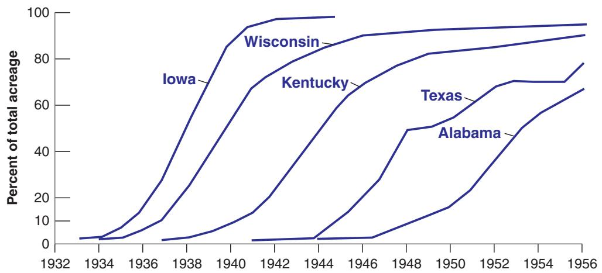
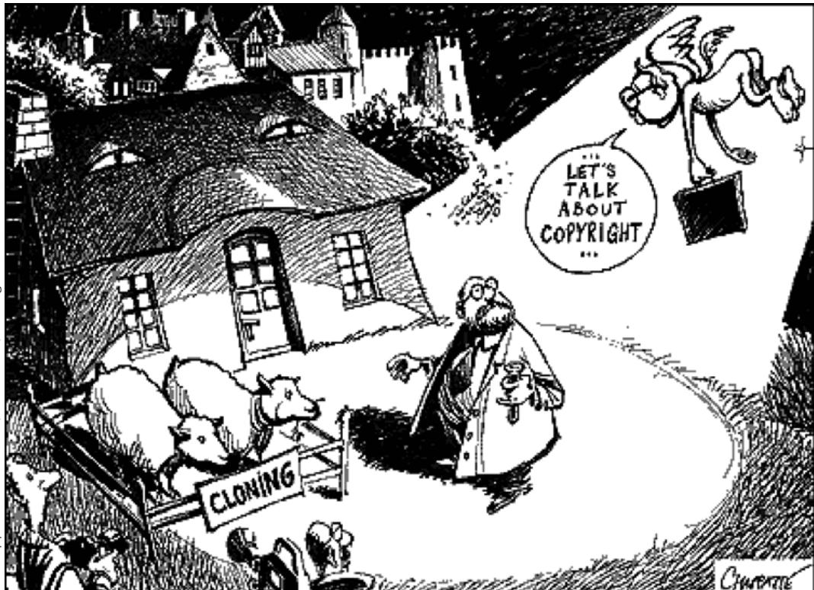

# The Diffusion of New Technology: Hybrid Corn

New technologies are not developed or adopted overnight. One of the first studies of the diffusion of new technologies was carried out in 1957 by Zvi Griliches, a Harvard economist, who looked at the diffusion of hybrid corn in different states in the United States.

Hybrid corn was, in the words of Griliches, “the invention of a method of inventing.” Producing hybrid corn entails crossing different strains of corn to develop a type of corn adapted to local conditions. The introduction of hybrid corn can increase the corn yield by up to 20%.

Although the idea of hybridization was developed at the beginning of the 20th century, commercial application did not take place until the 1930s in the United States. Figure 1 shows the rate at which hybrid corn was adopted in selected states from 1932 to 1956.

The figure shows two dynamic processes at work. One is the process through which hybrid corns appropriate to each state were discovered. Hybrid corn became available in southern states (Texas and Alabama) more than 10 years after it had become available in northern states (Iowa, Wisconsin, and Kentucky). The other is the speed at which hybrid corn was adopted in each state. Within 8 years of its introduction, practically all corn in Iowa was hybrid corn. The process was much slower in the South. More than 10 years after its introduction, hybrid corn accounted for only 60% of total acreage in Alabama.

Why was the speed of adoption higher in the North than in the South? Griliches’s article showed that the reason was economic: The speed of adoption in each state was a function of the profitability of introducing hybrid corn: profitability was higher in Iowa than in the southern states.1

  
Figure 1  
Percentage of Total Corn Acreage Planted with Hybrid Seed, Selected US States, 1932–1956

An age-old worry is that research will become less and less fertile, that most major discoveries have already taken place and that technological progress will begin to slow down. This fear may come from thinking about mining, where higher-grade mines were exploited first, and where we have had to exploit increasingly lower-grade mines. But this is only an analogy, and so far there is no evidence that it is correct.

## The Appropriability of Research Results

The second determinant of the level of R&D and of technological progress is the degree of appropriability of research results. If firms cannot appropriate the profits from the development of new products, they will not engage in R&D and technological progress will be slow. Many factors are also at work here.

The nature of the research process itself is important. For example, if it is widely believed that the discovery of a new product by one firm will quickly lead to the discovery of an even better product by another firm, there may be little advantage to being first. In other words, a highly fertile field of research may not generate high levels of R&D because no company will find the investment worthwhile. This example is extreme, but revealing.

Even more important is the legal protection given to new products. Without such legal protection, profits from the development of a new product are likely to be small. Except in rare cases where the product is based on a trade secret (such as Coca Cola), it will generally not take long for other firms to produce the same product, eliminating any advantage the innovating firm may have initially had. This is why countries have patent laws. Patents give a firm that has discovered a new product—usually a new technique or device—the right to exclude anyone else from the production or use of the new product for some time.

How should governments design patent laws? On the one hand, protection is needed to provide firms with the incentives to spend on R&D. On the other, once firms have discovered new products, it would be best for society if the knowledge embodied in those new products were made available without restriction to other firms and to people. Take, for example, biogenetic research. Only the prospect of large profits can lead bioengineering firms to embark on expensive research projects. Once a firm has found a new product, and the product can save many lives, it would clearly be best to make it available at cost to all potential users. But if such a policy were systematically followed, it would eliminate incentives for firms to do research in the first place. So patent law must strike a difficult balance. Too little protection will lead to little R&D. Too much protection will make it difficult for new R&D to build on the results of past R&D and may also lead to little R&D. (The difficulty of designing good patent or copyright laws is illustrated in the cartoon about cloning.)

This type of dilemma is known as time inconsistency. We shall see other examples and discuss it at length in Chapter 22.

These issues go beyond patent laws. To take two controversial examples: What is the role of open-source software? Should students download music, movies, and even textbooks (you see where I am going here) without making payments to the creators?

© Chappatte in “L’Hebdo,” Lausanne, www.globecartoon.com

