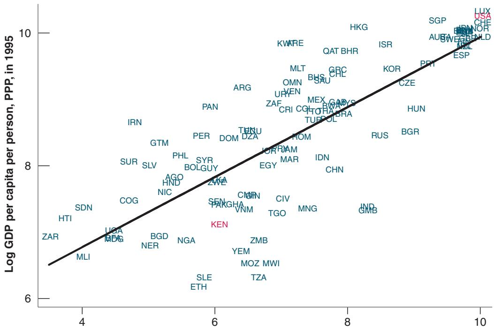

# 12-3 INSTITUTIONS, TECHNOLOGICAL PROGRESS, AND GROWTH

To get a sense of why some countries are good at imitating existing technologies, whereas others are not, compare Kenya and the United States. PPP GDP per person in Kenya is about 1/18th of PPP GDP per person in the United States. The difference is partly due to a much lower level of capital per worker in Kenya. It is also due to a much lower technological level in Kenya, where the state of technology is estimated to be about 1/13th of the US level. Why is the state of technology in Kenya so low? The country potentially has access to most of the technological knowledge in the world. What prevents it from simply adopting much of the advanced countries’ technology and quickly closing much of its technological gap with the United States?

One can think of a number of potential answers, ranging from Kenya’s geography and climate to its culture. Most economists believe, however, that the main source of the problem, for poor countries in general and for Kenya in particular, lies in their poor institutions.

What institutions do economists have in mind? At a broad level, the protection of property rights may well be the most important. Few individuals are going to create firms, introduce new technologies, and invest in R&D if they expect that profits will be appropriated by the state, extracted in bribes by corrupt bureaucrats, or stolen by other people in the economy. Figure 12-5 plots PPP GDP per person in 1995 (using a logarithmic scale) for 90 countries against an index measuring the degree of protection from expropriation; the index was constructed for each of these countries by an international business organization. The positive correlation between the two is striking (the figure also plots the regression line). Low protection is associated with a low GDP per person (at the extreme left of the figure are the Democratic Republic of the Congo and Haiti); high protection is associated with a high GDP per person (at the extreme right are the United States, Luxembourg, Norway, Switzerland, and the Netherlands).

  
With an index of 6, Kenya is below the regression line, which means it has lower GDP per person than would be predicted based just on the index.  
Average Protection against Risk of Expropriation, 1985–1995

## Figure 12-5

## Protection from Expropriation and GDP per Person

There is a strong positive relation between the degree of protection from expropriation and the level of GDP per person.

Source: Daron Acemoglu, “Understanding Institutions,” Lionel Robbins Lectures, 2004, London School of Economics. http://economics.mit.edu/ files/1353.
