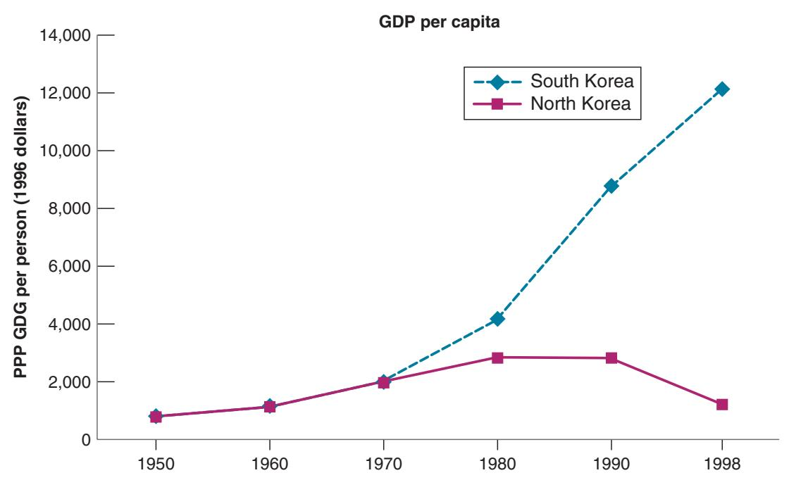
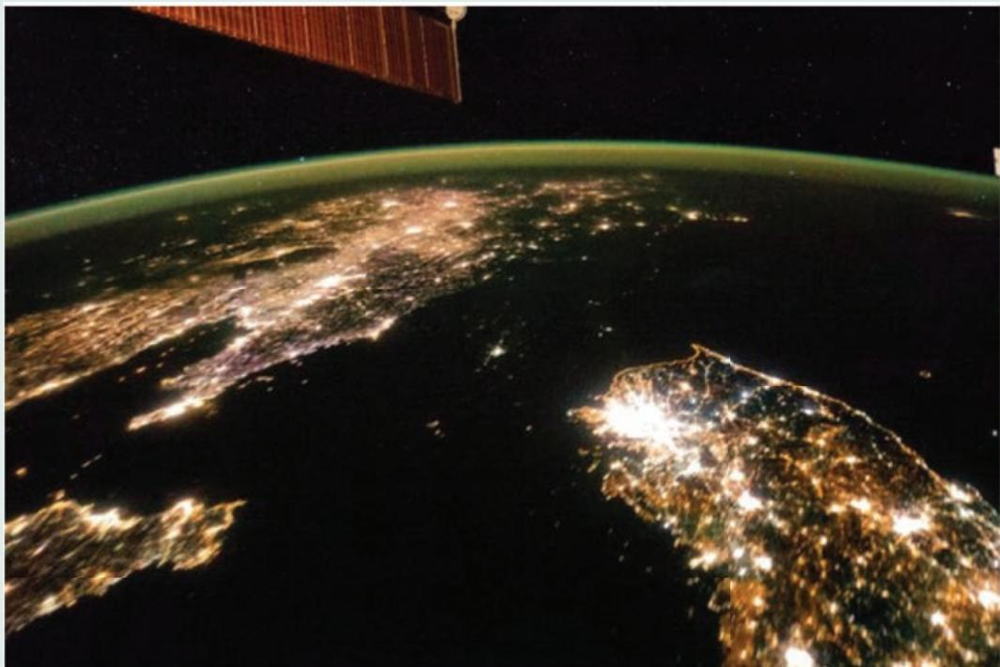

# The Importance of Institutions: North Korea and South Korea

Following the surrender of Japan in 1945, Korea formally acquired its independence but became divided at the 38th parallel into two zones of occupation, with Soviet armed forces occupying the North and US armed forces occupying the South. Attempts by both sides to claim jurisdiction over all of Korea triggered the Korean War (1950–1953). At the armistice in 1953, Korea became formally divided into two countries, the Democratic People’s Republic of North Korea and, in the South, the Republic of Korea.

An interesting feature of Korea before separation was its ethnic and linguistic homogeneity. The North and the South were inhabited by essentially the same people, with the same culture and the same religion. Economically, the two regions were also highly similar at the time of separation. PPP GDP per person, in 1996 dollars, was roughly the same, about \$700 in both the North and South.

But 50 years later, as shown in Figure 1, PPP GDP per person was 10 times higher in South Korea than in North Korea—\$12,000 versus \$1,100! South Korea had joined the OECD, the club of rich countries, whereas North Korea had seen its GDP per person decrease by nearly two-thirds from its peak of \$3,000 in the mid-1970s and was facing famine on a large scale. (The figure, taken from the work of Daron Acemoglu, shows the numbers up to 1998. In 2017, the difference had further increased, with PPP GDP per person around \$30,000 in South Korea versus \$1,800 for North Korea.)

A striking visualization of the difference is shown in Figure 2, which shows a satellite picture of Korea at night. The dark space between South Korea (lower right quadrant) and China (upper left quadrant) is North Korea.

What happened? Institutions and the organization of the economy were dramatically different during that period in the South and in the North. South Korea relied on a capitalist organization of the economy, with strong state intervention but also private ownership and legal protection of private producers. North Korea relied on central planning: Industries were quickly nationalized. Small firms and farms were forced to join large cooperatives so they could be supervised by the state. There were no private property rights for individuals. The result was the decline of the industrial sector and the collapse of agriculture. The lesson is sad, but clear; institutions matter very much for growth.2

  
Figure 1  
PPP GDP per Person: North and South Korea, 1950–1998

  
Figure 2  
NASA Earth Observatory  
Korea at night

What does protection of property rights mean in practice? It means a good political system, in which those in charge cannot expropriate or seize the property of the citizens. It means a good judicial system, where disagreements can be resolved efficiently, rapidly, and fairly. Looking at a finer degree of detail, it means laws against insider trading in the stock market, so people are willing to buy stocks and thus provide financing to firms; clearly written and well-enforced patent laws, so firms have an incentive to do research and develop new products; good antitrust laws, so competitive markets do not turn into monopolies with few incentives to introduce new methods of production and new products—and the list obviously goes on. (A particularly dramatic example of the role of institutions is given in the Focus Box “The Importance of Institutions: North Korea and South Korea.”)

This still leaves one essential question: Why don’t poor countries adopt these good institutions? The answer is that it is hard! Good institutions are complex and difficult for poor countries to put in place. Certainly, causality runs both ways in Figure 12-5: Low protection against expropriation leads to low GDP per person. But it is also the case that low GDP per person leads to worse protection against expropriation. Poor countries are often too poor to afford a good judicial system and to maintain a good police force, for example. Thus, improving institutions and starting a virtuous cycle of higher GDP per person and better institutions is difficult. The fast-growing countries of Asia have succeeded. (The Focus Box “What Is behind Chinese Growth?” explores the case of China in more detail.) Some African countries appear also to be succeeding; others are still struggling.

A quote from Gordon Brown, a former UK prime minister: “In establishing the rule of law, the first five centuries are b always the hardest!”
