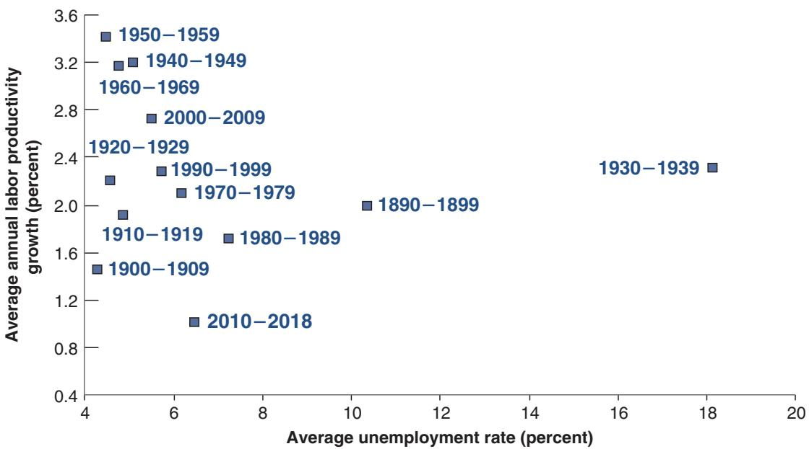
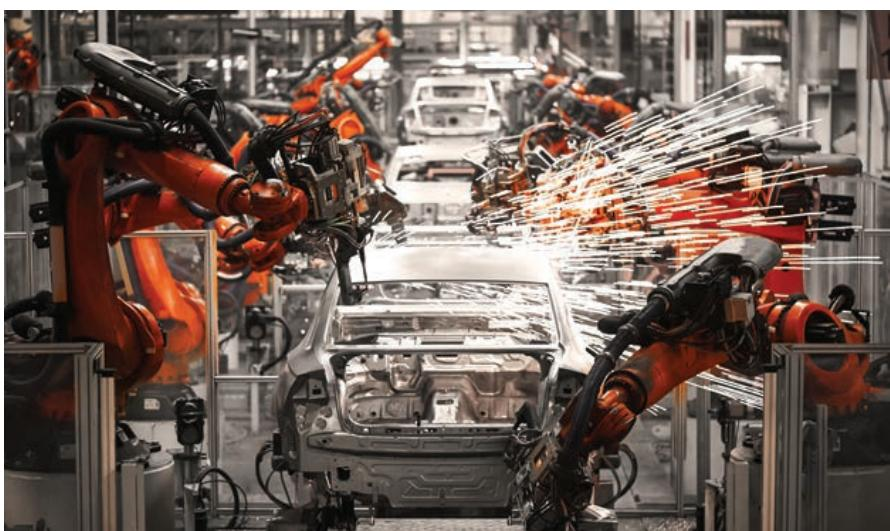

# The Challenges of Growth

13

Mincrease in the standard of living over time. This may have led you to form toooptimistic a picture. Growth is in fact a complex process, facing many chal- increase in the standard of living over time. This may have led you to form too optimistic a picture. Growth is in fact a complex process, facing many challenges. You read about them in newspapers every day: Can we be confident that technological progress will continue at the same rate? Should we be worried that robots will destroy jobs and lead to mass unemployment? Does everybody really benefit from the increased standard of living? And, in the process of growing, aren’t we destroying the planet and mortgaging our future? These are the issues I take up in this chapter.

Section 13-1 discusses the future of technological progress. Some economists believe that the era of major inventions is largely over and we should expect technological progress to slow down considerably. Others believe instead that we are on the verge of another technological revolution and the future is bright. What are the arguments on both sides, and what should we expect?

Section 13-2 discusses whether technological progress will lead to mass unemployment. Such fears go back a long way but have so far proven unfounded. Will the future be different? If so, what policies should we adopt?

Section 13-3 discusses the relation between growth and inequality. Inequality has increased, and technological progress and globalization are blamed. What is the evidence? And, if they are responsible, what policies should be adopted to limit the increase in inequality?

Section 13-4 discusses climate change. Growth is blamed for various ecological disasters. It is believed to be one of the main factors behind climate change. What is the evidence? If it is responsible, what policies should be adopted? What is the chance that the policies will indeed be adopted?

I have started every chapter so far with “If you remember one basic message from this chapter, it should be...”. I did not succeed in summarizing the conclusions of this chapter in one sentence. But the general theme is that growth is a complex process, and policies to make it fair and sustainable are of the essence.

## 13-1 THE FUTURE OF TECHNOLOGICAL PROGRESS

There is a strange tension between, on the one hand, the perception of fast technological progress and, on the other, the productivity growth numbers. Looking around us, we have the impression of fast technological change, be it the introduction of robots, the development of artificial intelligence, the use of machine learning, or, more concretely, the number of applications that we can use on our smart phones. One might have expected this to be reflected in higher measured productivity growth. Yet, as we saw in Table 1-2 in Chapter 1, US measured productivity growth has slowed down since the mid-2000s, running at less than half the rate of earlier decades.

How can the two be reconciled? One possible answer is measurement error. As we discussed in the Focus Box “Real GDP, Technological Progress, and the Price of Computers” in Chapter 2, measuring technological progress is difficult. For example, how much better is a 2018 computer relative to a 2010 computer? Although statistical agencies try to adjust for changes in speed, hard disk size, and so on, they do not do a perfect job. And the challenge is even bigger with respect to new software. How much should we value the fact that we can now access instantaneously nearly any piece of music we want to listen to?

Could it be therefore that we understate the rate of productivity growth, and that the true rate is higher? Research on the topic suggests that the answer is yes, but it comes with a twist: It does not appear that, for the economy as a whole, the mismeasurement has substantially increased. Put another way, mismeasurement can explain only a small part of the decrease in measured productivity growth.

If we take as given that there is truly a decline in productivity growth, how can we explain it? This is the subject of intense debate among researchers.

Some argue that the current major innovations are less important than the major innovations of the past. Major innovations are innovations that have applications in many fields and many products. (For this reason, these innovations are called generalpurpose technologies.) Robert Gordon, of Northwestern University, has studied the history of technological innovations and argues that the two major innovations of the last 150 years were electricity and the internal combustion engine. For many decades after their introduction, they transformed methods of production and life in general in often dramatic ways. To list a few examples: Electricity led to the use of air conditioning and the development of the South of the United States. It led to the development of refrigerators and thus the ability to keep food for much longer periods of time, changing the system of food production and distribution. The internal combustion engine led to automobiles, triggering the building of interstate highways and shaping the development of cities. The current major innovation, he argues, namely digitization, does not come close to having the same wide implications. Thus, we should not expect it to have the same impact as those previous major innovations. The period of high technological progress, he claims, is behind us.

Others, in particular Eric Brynjolfsson of MIT, argue that digitization, together with the increasing power of computers, will transform our lives as much as or more than electricity or the internal combustion engine did earlier. Artificial intelligence and machine learning may transform nearly any activity, from driverless cars to the mapping of the human genome and major progress in medicine, to the way lawyers access relevant jurisprudence. He argues that the current low productivity growth reflects the slow process of diffusion and the discovery of new applications. He concludes that the future is bright, and he sees no end to technological progress.

Who is right, who is wrong? The honest answer is that nobody really knows. There are a number of spectacularly wrong predictions, including that of Thomas Watson, former CEO of IBM, who in 1943 said, “I think there is a world market for maybe five computers.” But the debate shows the importance of both the process of innovation and of the speed of diffusion in explaining technological progress at the frontier. (As I discussed in Chapter 12, technological progress in countries behind the frontier depends largely on other factors, the ability to adapt and use existing technologies, which in turn depend on institutions from property rights to education.)

For more wildly incorrect forecasts of technological progress, see www.pcworld. com/article/155984/worst\_ tech\_predictions.html

## 13-2 ROBOTS AND UNEMPLOYMENT

Since the beginning of the Industrial Revolution, workers have worried that technological progress would eliminate jobs and increase unemployment. In early 19th-century England, groups of workers in the textile industry, known as the Luddites, destroyed the new machines that they saw as a direct threat to their jobs. Similar movements took place in other countries. The term saboteur comes from one of the ways French workers destroyed machines: by putting their sabots (heavy wooden shoes) into the machines.

The theme of technological unemployment typically resurfaces whenever unemployment is high. During the Great Depression, a movement called the technocracy movement argued that high unemployment came from the introduction of machinery, and that things would only get worse if technological progress were allowed to continue. In the late 1990s, France passed a law reducing the normal workweek from 39 to 35 hours. One of the reasons invoked was that, because of technological progress, there was no longer enough work for all workers to have full-time jobs; the proposed solution was to have each worker work fewer hours (at the same hourly wage) so that more of them could be employed. (This was not the only rationale behind the law. Another and better reason was that increases in productivity should be taken partly in the form of higher income and partly in the form of more leisure. The problem with that argument is why the choice between income and leisure should have been legislated rather than left to the workers and firms to decide.)

In its crudest form, the argument that technological progress must necessarily lead to higher unemployment is obviously false. The large improvements in the standard of living that advanced countries enjoy have come with large increases in employment and no increase in the unemployment rate. In the United States, real output per person has increased by a factor of 10 since 1890 and, far from declining, employment has increased by a factor of 6.5 (reflecting a parallel increase in the size of the US population). As we have seen, the unemployment rate is very low. Nor, looking across countries, is there any evidence of a systematic positive relation between the unemployment rate and the level of productivity.

More sophisticated versions of the technological unemployment hypothesis, however, must be taken more seriously. First, one might expect that, as higher productivity leads some firms to reduce employment, it may take time for new jobs to replace the jobs that are destroyed, leading to higher unemployment for some time if not forever. The evidence, however, suggests that this is not the case.

Figure 13-1 plots average US labor productivity growth and the average unemployment rate during each decade since 1890. At first glance, there seems to be little relation between the two. But if we ignore the 1930s (the decade of the Great Depression), then a relation emerges between productivity growth and the unemployment rate. But it is the opposite of the relation predicted by those who believe in technological unemployment. Periods of high productivity growth, like the 1940s to the 1960s, have been associated

## Figure 13-1

Productivity Growth and Unemployment, Averages by Decade, 1890–2018

Source: Data prior to 1960: Historical Statistics of the United States. Data after 1960: Bureau of Labor Statistics.

with a lower unemployment rate. Periods of low productivity growth, such as the United States saw during 2010–2018, have been associated with a higher unemployment rate.

What was true in the past may not, however, be true in the future. And robots seem threatening enough (the picture makes the case). By their very nature, they can replace the least skilled workers; then, as they become more sophisticated, the workers with higher skills, and so on. A recent study concludes that, over the next two decades, 47% of US workers are at risk of being replaced by robots.

A study by Daron Acemoglu and Pascual Restrepo of MIT, looking at the evidence on the effect of the introduction of robots on employment in local labor markets, concludes that, where they are introduced, robots do indeed destroy jobs. Even if the reduction in costs allows firms that use robots to sell their goods more cheaply and thus increase sales and output, the substitution of robots for workers dominates the outcome and leads to fewer jobs.

The question is whether robots lead to job creation elsewhere. For example, if firms that use robots produce cheaper intermediate inputs, other firms now will see their costs

of production go down and are thus likely to increase employment. This is much harder to assess. What can be said is that, so far, the US unemployment rate is low by historical standards even for workers with low skills: The unemployment rates for workers with a high school degree but no college and for workers who have not finished high school are 3.8% and 5.7%, respectively, both at historical lows. Clearly, whatever jobs were eliminated because of robots have been replaced by jobs elsewhere. This might, however, be due to other factors, other favorable shocks to employment, and

one cannot be sure that it will hold in the future. And it also leaves open the issue of whether workers who lost their jobs to robots got new ones at the same wage or at a lower wage. This gets us to the issue of income inequality that we focus on in the next section.

In short, so far, robots have not led to anything like mass unemployment or, for that matter, to higher unemployment. Although this gets close to science fiction, it is interesting to think of what the economy would look like if robots were to eliminate all jobs. Put bluntly, it could be hell or heaven. Hell: All robots belong to, say, one extremely wealthy owner and everybody else is unemployed. Heaven: Everybody owns the rights to one robot apiece and lives on the income from the robot production while enjoying a life of leisure. Admittedly, these are beyond extreme scenarios, but they indicate the issues that policymakers may face in the future: how to fight inequality—whether, for example, to guarantee a minimum income for all, or how much to redistribute wealth and property rights.

## 13-3 GROWTH, CHURN, AND INEQUALITY

Robots are a particularly striking form of technological progress. But the issues they raise are more general. Technological progress is fundamentally a process of structural change, with profound implications for what happens in labor markets.

The theme was central to the work of Joseph Schumpeter, a Harvard economist who, in the 1930s, emphasized that the process of growth was fundamentally a process of creative destruction: New goods are developed, making old ones obsolete. New techniques of production are introduced, requiring new skills and making some old skills less useful. As this happens, old jobs are eliminated, new jobs are created.

The essence of this process is nicely captured in the following quote from Robert McTeer, a past president of the Federal Reserve Bank of Dallas, in his introduction to a report titled The Churn:

“My grandfather was a blacksmith, as was his father. My dad, however, was part of the evolutionary process of the churn. After quitting school in the seventh grade to work for the sawmill, he got the entrepreneurial itch. He rented a shed and opened a filling station to service the cars that had put his dad out of business. My dad was successful, so he bought some land on the top of a hill and built a truck stop. Our truck stop was extremely successful until a new interstate went through 20 miles to the west. The churn replaced US 411 with Interstate 75, and my visions of the good life faded.”

Many professions, from those of blacksmiths to harness makers, have vanished forever. There were more than 11 million farm workers in the United States at the beginning of the 20th century; because of high productivity growth in agriculture, there are fewer than 1 million today. By contrast, there are now more than 3 million truck, bus, and professional car drivers; there were none in 1900. There are more than 1 million computer programmers today; there were practically none in 1960.

Even for those with the right skills, the firm where they work may be replaced by a more efficient firm, or the product their firm was selling may be replaced by another product. This tension between the benefits of technological progress for consumers (and, by implication, for firms and their shareholders) and the risks for workers is well captured in the cartoon below. The tension between the large gains for society from technological change and the potentially large costs for the workers who lose their jobs is explored in the Focus Box “Job Destruction, Churn, and Earnings Losses.”
