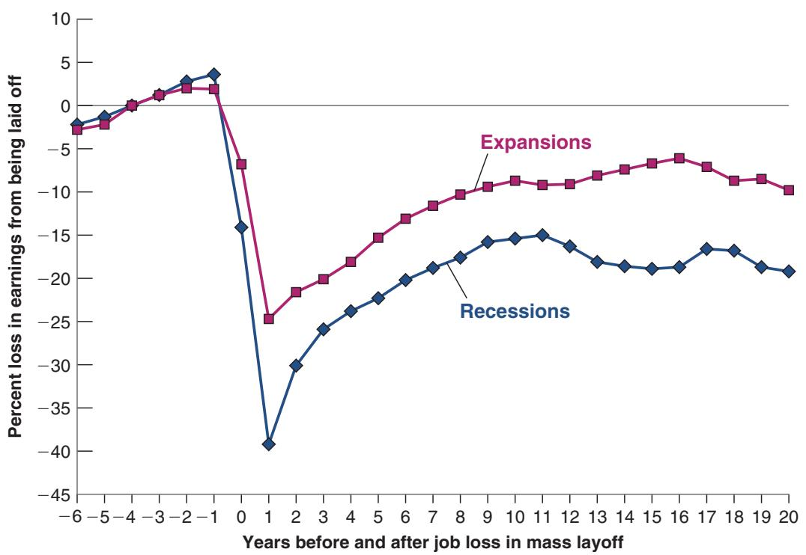
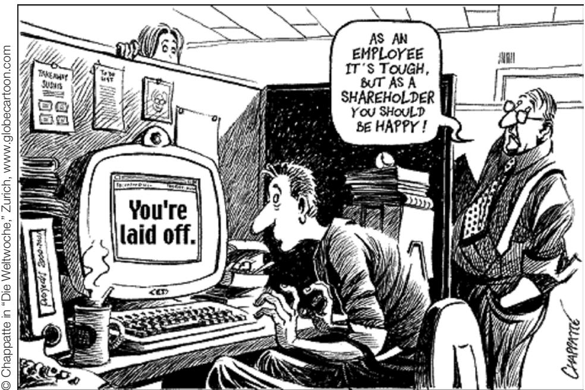
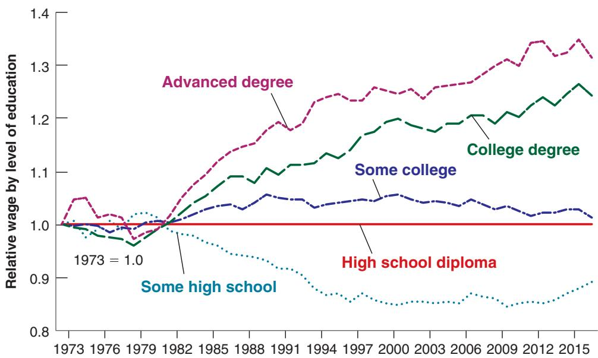

# Job Destruction, Churn and Earnings Losses

Technological progress is good for consumers, but it can be tough on the workers who lose their jobs. This is documented in a study by Steve Davis and Till von Wachter, who used records from the Social Security Administration between 1974 and 2008 to look at what happens to workers who lose their job as a result of a mass layoff.

Davis and von Wachter first identified all the firms with more than 50 workers where at least 30% of the workforce was laid off during one quarter, an event they call a mass layoff. Then they identified the laid-off workers who had been employed at that firm for at least three years; they classified these as long-term employees. They compared the labor market experience of long-term employees who were laid off in a mass layoff to similar workers in the labor force who did not separate in the layoff year or in the next two years. Finally, they compared the workers who experience a mass layoff in a recession to those who experience a mass layoff in an expansion.

Figure 1 summarizes their results. The year 0 is the year of the mass layoff; years 1, 2, 3, and so on are the years after, and the years with negative numbers are those before.

Long-term employees saw their earnings rise relative to the rest of society prior to the mass layoff event. Having a long-term job at the same firm is good for an individual’s wage growth. This is true in both recessions and expansions.

Look at what happened in the first year after the layoff. If the mass layoff happened during a recession, a laid-off worker’s earnings fell by 40 percentage points relative to a worker who did not experience a mass layoff. For the less unfortunate worker who experienced a mass layoff during an expansion, the fall in relative earnings was smaller but was still 25 percentage points. The conclusion: A mass layoff causes enormous relative earnings declines whether it occurs in a recession or an expansion.

Figure 1 makes another important point. The decline in relative earnings of workers who were part of a mass layoff persisted for years after the layoff. Beyond 5 years or even up to 20 years after the mass layoff, workers who experienced it suffered a sustained decline in relative earnings of about 20 percentage points if the mass layoff took place in a recession and about 10 percentage points if it took place during an expansion. A mass layoff is thus associated with a substantial decline in lifetime earnings.

It is not hard to explain why such earnings losses are likely, even if the size of the loss is surprising. The workers who have spent a considerable part of their career at the same firm have specific skills—skills that are most useful in that firm or industry. These skills are likely to be less valuable elsewhere.

Other studies have found that in families that experience a mass layoff, the worker has a less stable employment path (more periods of unemployment), poorer health outcomes, and children who have a lower level of educational achievement and higher mortality when compared to the workers who have not experienced a mass layoff. These are additional costs associated with mass layoffs.

So, although technological change is the main source of growth in the long run and clearly enables a higher standard of living for the average person, workers who experience mass layoffs are clear losers. It is not surprising that technological change can and does generate anxiety.

Figure 1

Earnings Losses of Workers Who Experience a Mass Layoff

Source: Steven J. Davis and Till M. von Wachter, “Recessions and the Cost of Job Loss,” National Bureau of Economics Working Paper No. 17638, 2011. Used with Permission.

© Chappatte in “Die Weltwoche,” Zurich, www.globecartoon.com

## The Increase in Wage Inequality

For those in growing sectors or those with the right skills, technological progress leads to new opportunities and higher wages. But for those in declining sectors or those with skills that are no longer in demand, technological progress can mean the loss of their job, a period of unemployment, and possibly much lower wages. The last 35 years in the United States have seen a large increase in wage inequality. Most economists believe that the main culprit behind this increase is technological change.

Figure 13-2 shows the evolution of relative wages for various groups of workers, by education level, since 1973. The figure is based on information about individual workers from the Current Population Survey. Each of the lines in the figure shows the evolution of the wage of workers with a given level of education—some high school, high school diploma, some college, college degree, advanced degree—relative to the wage of workers who only have high school diplomas. All relative wages are further divided by their value in 1973, so the resulting wage series are all equal to one in 1973. The figure yields a striking conclusion:

We described the Current Population Survey and some b of its uses in Chapter 7.

  
Figure 13-2  
Evolution of Relative Wages by Education Level since 1973

Since the early 1980s, the relative wages of workers with a low education level have fallen; the relative wages of workers with a high education level have risen.

Source: Economic Policy Institute Data Zone. www.epi.org/types data-zone/.

Starting around the early 1980s, workers with low levels of education have seen their relative wage steadily fall over time, whereas workers with high levels of education have seen their relative wage steadily rise. At the bottom end of the education ladder, the relative wage of workers who have not completed high school has declined by 11% since the early 1980s. This implies that, in many cases, these workers have seen a drop not only in their relative wage but in their absolute real wages as well. At the top end of the education ladder, the relative wage of those with an advanced degree has increased by 31%. In short, wage inequality has increased a lot in the United States over the last 30 years.c

## The Causes of Increased Wage Inequality

What are the causes of this increase in wage inequality? The main force behind the increase in the wage of high-skill relative to low-skill workers is a steady increase in the demand for high-skill workers relative to the demand for low-skill workers. This trend in relative demand is not new, but it appears to have strengthened. Until the 1980s it was largely offset by a steady increase in the relative supply of high-skill workers: A steadily larger proportion of children finished high school, went to college, finished college, and so on. Since the early 1980s, however, relative supply has continued to increase, but not fast enough to match the continuing increase in relative demand. The result has been a steady increase in the relative wage of high-skill workers versus low-skill workers. The Focus Box “The Long View: Technology, Education, and Inequality” shows how not only the demand but also the supply of skills shaped the evolution of wage inequality in the United States during the 20th century.

This leads to the next question: What is behind this steady shift in relative demand?

One line of argument has focused on the role of international trade. US firms that employ higher proportions of low-skill workers, the argument goes, are increasingly driven out of markets by imports from similar firms in low-wage countries. Alternatively, to remain competitive, firms must relocate some of their production to low-wage countries. In both cases, the result is a steady decrease in the relative demand for low-skill workers in the United States. There are clear similarities between the effects of trade and the effects of technological progress. Although both trade and technological progress are good for the economy as a whole, they lead nonetheless to structural change and make some workers worse off.

There is no question that trade is partly responsible for increased wage inequality. A closer examination, however, shows that trade accounts for only part of the shift in relative demand. The most telling fact countering explanations based solely on trade is that the shift in relative demand toward high-skill workers is present even in sectors that are not exposed to foreign competition.

The other line of argument has focused on skill-biased technological progress. New machines and new methods of production, the argument goes, require more and more high-skill, high-education workers. The development of computers requires workers to be increasingly computer literate. New methods of production require workers to be more flexible and better able to adapt to new tasks. Greater flexibility in turn requires more skills and more education. Unlike explanations based on trade, skill-biased technological progress can explain why the shift in relative demand appears to be present in nearly all sectors of the economy. At this point, most economists believe it is the dominant factor in explaining the increase in wage inequality.
