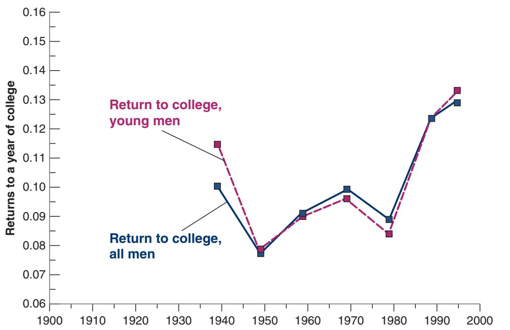
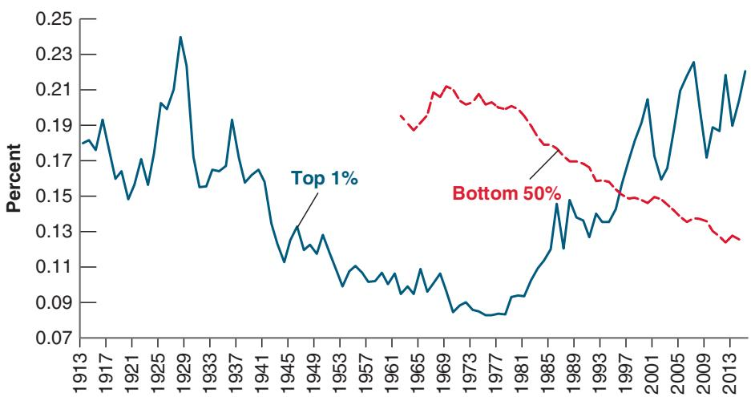
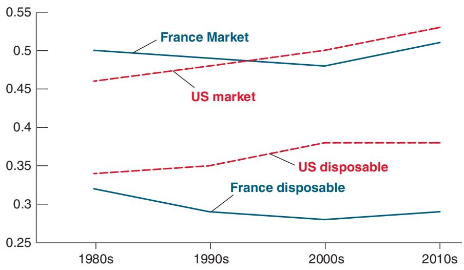

# The Long View: Technology, Education, and Inequality

For the first three-quarters of the 20th century, wage inequality declined. Then it started to rise and has kept growing since. Claudia Goldin and Larry Katz, two economists at Harvard University, point to education as a major factor behind the two different trends in inequality.

US educational attainment, measured by the completed schooling levels of successive generations of students, was exceptionally rapid during the first three-quarters of the century. But educational advance slowed considerably for young adults beginning in the 1970s and for the overall labor force by the early 1980s. For generations born from the 1870s to about 1950, every decade was accompanied by an increase of about 0.8 year of education. During that 80-year period the vast majority of parents had children whose educational attainment greatly exceeded theirs. A child born in 1945 would have been in school 2.2 years more than his or her parents born in 1921. But a child born in 1975 would have been in school just half a year more than his or her parents born in 1951.

Underlying the decision to stay in school longer were clear economic incentives. As shown in Figure 1, the return to one more year of college education (meaning the increase in the average wage for a worker with one more year of college education) was high in the 1940s: 11% for young men and 10% for all men. This induced US families to keep their children in school longer and then send them to college. The increase in the supply of educated workers lowered both the returns to education and the wage differentials. By 1950, the return to one more year of college education had fallen back to 8% for young men, 9% for all men. But by 1990, rates of return were back to their 1930s levels. The return to a year of college today is higher than in the 1930s.

There are two lessons to be drawn from this evidence:

The first is that technological progress, even when skillbiased, that is accompanied by an increase in the demand for skilled and educated workers does not necessarily increase economic inequality. For the first three-quarters of the 20th century, the increase in demand for skills was more than met by an increase in the supply of skills, leading to decreasing inequality. Since then, demand growth has continued, whereas supply growth has decreased, leading once again to increasing inequality.

The second is that, although market forces provide incentives for demand to respond to wage differentials, institutions are also important. For most Americans in the early 20th century, access to schooling, at least through high school, was largely unlimited. Education was publicly provided and funded and thus free of direct charge, except at the highest levels. Even the most rural Americans could send their children to public secondary schools, although African Americans, especially in the South, were often excluded from various levels of schooling. This has made an essential difference.

  
Figure 1  
Wage Differentials and the Returns to Education, 1939 to 1995  
Source: Claudia Goldin and Larry F. Katz, “Decreasing (and then Increasing) Inequality in America: A Tale of Two Half Centuries,” In: Finis Welch The Causes and Consequences of Increasing Inequality. Chicago: University of Chicago Press; 2001.pp. 37–82. Used with Permission.

## Inequality and the Top 1%

We have focused on wage inequality, the distribution of wages across wage earners. Another dimension of inequality, however, is the proportion of income that accrues to the richest households (e.g., those in the top 1% of the income distribution). When we consider inequality at very high levels of income, wages are not a good measure of income. Rich rentiers derive their income from the assets they own. Successful entrepreneurs derive a large fraction of their income (sometimes almost all of it) not from wages but from capital income and capital gains. This is because they are typically paid both through wages and through company shares that they can then sell (with some limitations) at a profit.

The evolution of the top 1% share, shown in Figure 13-3, is striking. The share of income going to households in the top 1% steadily decreased from the 1930s until the late 1970s. Since then, however, it has increased sharply, from about 9% to 22% today. By contrast, the share of the bottom 50% has sharply decreased, from about 21% in the early 1970s (data are not available before 1965) to less than 13% today.

Looking within the top 1%, the numbers are even more striking: While the top 1% account for 22% of income, the top 0.1% alone account for 17%, and the top 0.01% account for 5.1%. Looking at wealth, inequality is even stronger. The top 0.01% account for 11% of total wealth. Inequality in the United States measured this way is “probably higher than in any other society at any time in the past, anywhere in the world,” writes Thomas Piketty, whose book Capital in the 21st Century topped the list of best-selling books worldwide when it was published in 2014.

Who are the people in those high income groups? In the top 1%, the list is the one you would expect—doctors, lawyers, executives, owners of medium-size businesses. What about the 0.01%? One image is of heirs, living mostly on the income from their capital. Another is of successful entrepreneurs, founders of businesses like Amazon, Facebook, and Google. To get a sense of which image fits best, one can look at the yearly list put together by Forbes of the 400 wealthiest Americans (who account for 2.5% of the 16,000 households in the top 0.01% and have an average wealth of about \$400 million). In that list, about one-third has inherited a substantial proportion of their wealth, and two-thirds are mostly self-made entrepreneurs and high level executives.

Why have these entrepreneurs and executives become so rich? Piketty points to bad corporate governance—company boards who grant their chief executives exorbitant pay packages. Above a certain level, he argues, it is hard to find in the data any link between

Figure 13-3

The Evolution of the Top 1% and the Bottom 50% Income Shares in the United States since 1913

Source: World Inequality Database. https://wid.world/

pay and performance. Although there is plenty of anecdotal evidence for such excesses, another factor is clearly at work, and it is again the nature of technological progress. Many new sectors exhibit strong increasing returns to scale: their costs are largely fixed costs and do not depend very much on the number of users. Thus, the more users there are, the smaller the cost per user. The result is the emergence of very large firms with a very large number of customers. At the end of 2018, the number of Facebook users was 2.3 billion, and the number of subscribers to Amazon Prime was 100 million. The same is true in finance, where the largest funds often manage hundreds of billions or even trillions of dollars. At the end of 2018, BlackRock, the largest asset management fund, managed \$6 trillion of assets. Given the size of these firms and the size of their profits, it is not surprising that the founders and the top executives have such large income and large wealth.

## Growth and Inequality

Is it possible for countries to sustain growth without having ever-increasing inequality? The trends we just saw are not reassuring. But there are two reasons to not be too pessimistic.

The first is that not all advanced economies are like the United States. Wage inequality and the share of the top 1% have been rising in most countries, but typically much less than in the United States. The second is that we must distinguish between market income inequality, which is income inequality before taxes and transfers, and disposable income inequality, which is income after taxes and transfers. So far, we have looked at market inequality, but what matters in the end is disposable income inequality. And here again, not all advanced economies are like the United States.

Figure 13-4, which compares the evolution of both types of inequality in the United States and in France, makes these points clearly. It plots the evolution of a standard measure of inequality, known as the Gini coefficient, or the Gini for short. The construction of the coefficient is explained in the Focus Box “Inequality and the Gini Coefficient,” but its general characteristics are simple: the coefficient ranges between 0 and 1. A coefficient of 0 means complete equality, with everybody having the same income; a coefficient of 1 means complete inequality, with one person receiving all the income, and everybody else receiving nothing. (In practice, the coefficient ranges from 0.2 for the most equal countries to 0.6 for the most unequal.)

The name comes from Corrado Gini, an Italian statistician who developedb the coefficient in the early part of the 20th century.

  
Figure 13-4  
The Evolution of Gini Coefficients for Market Income and for Disposable Income in France and the United States since the 1980s  
Source: Income Inequality by Max Roser and Esteban Ortiz-Ospina, First published in December 2013; updated October, 2016. (https://ourworldindata.org/ income-inequality).
