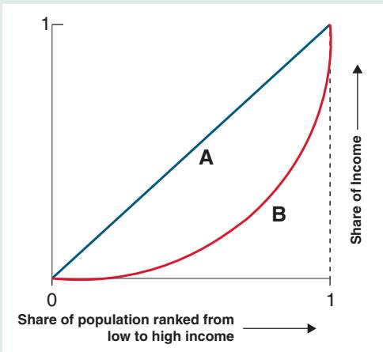
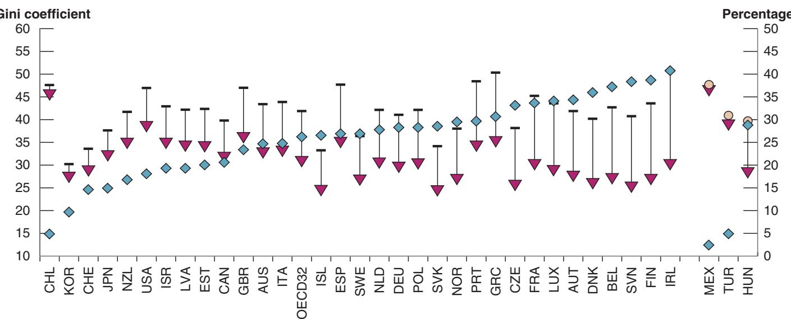
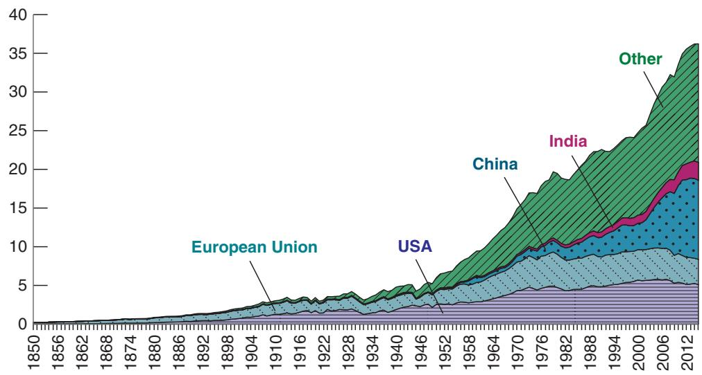
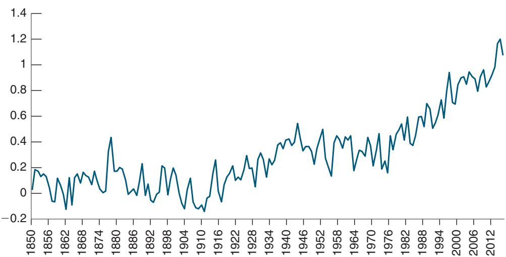
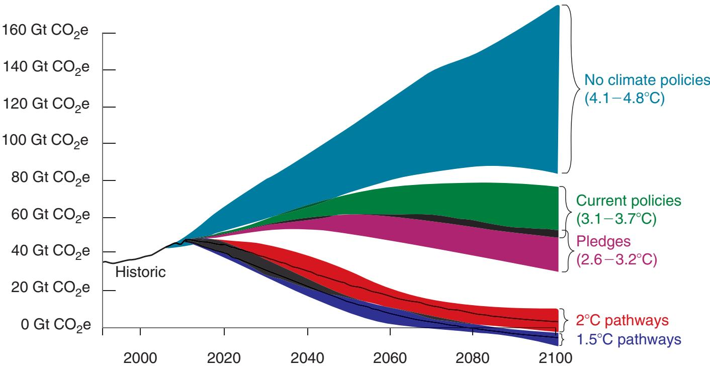

# Inequality and the Gini Coefficient

The Gini coefficient is a measure of inequality. The best way to describe it is with the picture below. The share of population ranked by increasing income is plotted on the horizontal axis, from zero to one. The share of income is plotted on the vertical axis, from zero to one. The relation giving the share of income associated with a given population share is given by the convex curve in red. The Gini coefficient is given by the ratio of area A to area (A + B).

To see what it implies, consider an economy where everybody has the same income. The share of income is always equal to the share of population, so the relation between the two is given by the diagonal line. Area A is equal to zero, and thus the Gini coefficient is also equal to zero. Take the opposite extreme and consider an economy where all the income goes to the richest individual. Then the relation between the two is a flat line covering the horizontal axis, ending with a jump from zero to one at the end. Area B is equal to zero, and so the Gini coefficient is equal to one.

These are obviously extreme and counterfactual cases, and Gini coefficients typically range between 0.2 and 0.6. In general, the more inequality, the smaller the share of income going to a given share of population. If, for example, inequality is such that a large proportion of the population is very poor, the curve will be very flat starting from 0. If inequality is such that a small proportion of the population is very rich, the curve will be very steep close to 1.

Summarizing the complexity of the distribution of income in one number has obvious limits. Inequality can take different forms, which may all lead to the same Gini coefficient. But it is a simple and intuitive statistic and one that allows comparisons of income distributions across time or across countries.

  
Figure 1

The two series at the top show the evolution of the Gini coefficients for market income inequality for the United States in red and for France in blue. The Gini for the United States goes up over time, reflecting the wage and top 1% income increasing inequalities we discussed earlier. The Gini for France, however, remains roughly constant. This is an important fact as both countries are affected in similar ways by globalization and have access to the same technologies. This suggests that, beyond trade and technological progress, other factors such as institutions and social norms about “acceptable pay” influence market inequality.

The two series at the bottom show the evolution of the Gini coefficients for disposable income inequality for the two countries. Again, there is a striking contrast between them. While the Gini coefficient for the United States goes up, by about half of the increase in the market Gini coefficient, the Gini coefficient for France is lower today than it was in the 1980s. In other words, redistribution through taxes and transfers has led to a (small) decrease in inequality. This is also an important fact. It suggests that, until now, redistribution has been enough to limit inequality. (The Gini coefficient is a simple but rough measure, and the fact that it has decreased does not imply that all groups have benefited equally from growth; some workers or groups of workers have seen a relative decrease in income.)

There are strong moral reasons to want to limit inequality, to achieve what is known as inclusive growth. There are also good political reasons for governments to do so. The evidence suggests that perceived inequality, be it about relative wages or about 1%, has played a role in the rise of populism in many countries. What can governments do?

  
Inequality before taxes and transfers Inequality after taxes and transfers Redistribution (in %, right axis)

Figure 13-5

## Market Income, Disposable Income, and Redistribution, across OECD Countries

Source: Market income, Disposable income, and redistribution, across OECD countries. Used with Permission. https://oecdecoscope.blog/2019/02/14/income-redistribution-across-oecd-countries-main-findings-andpolicy-implications/.

They can try to reduce market income inequality, through better education, through minimum wages, through rules about governance within firms. Or, given market income inequality, they can reduce disposable income inequality through progressive taxation, including the use of a negative income tax to increase revenue at the low end of the wage distribution, and through transfers such as food stamps and unemployment benefits. All governments use some of these tools, and redistribution can substantially reduce inequality. Evidence from a recent OECD study is given in Figure 13-5, which shows the Gini coefficients (multiplied by 100) associated with market income and with disposable income inequality, and by implication shows the degree of redistribution, for each OECD country.

The figure yields three conclusions.

■ Countries vary substantially in their degree of market inequality, with the United States near the top. Gini coefficients range from lows of 30% in Korea and 34% in Iceland to 50% in Ireland and Greece, and 48% in the United States. As most of these countries are open to trade and have access to similar technologies, it shows the importance of other factors in determining the outcome.

■ The degree of redistribution, defined as the difference in the market income Gini and the disposable income Gini, divided by the market income Gini, varies from lows of 5% in Chile and 10% in Korea to 38% in Finland and 40% in Ireland. The United States stands toward the low end, at 18%. This shows the importance of political choices in determining the final outcome.

■ As a result of redistribution, disposable income Ginis are lower than market income Ginis, often by a large amount. For example, in Ireland market income inequality is high but, as a result of redistribution, disposable income inequality is low. The variation in disposable income inequality, from 25% to 45%, is smaller than in market income inequality, which ranges from 30% to 50%, but it remains substantial. In the United States, market income inequality is high and redistribution limited.

If inequality continues to increase, governments will have to do more. This is why, for example, it appears that discussions about the marginal income tax rate, or higher inheritance taxes, are likely to play an important role in the 2020 US elections, and why discussions about the provision of a universal income, which would give a minimum amount to people whether they work or not, are taking place in countries like Italy or Finland. Sustaining growth while limiting or reducing inequality is one of the most important challenges facing policymakers today.

## 13-4 CLIMATE CHANGE AND GLOBAL WARMING

It is well known that markets work poorly when there are externalities. In the context of growth, a major externality is the emission of greenhouse gases. These gases have a cost but it is not taken into account by firms and by people when they make decisions about, for example, whether to choose one technology or another, or whether to buy a car.

The most important greenhouse gas is carbon dioxide $( \mathrm { C O } _ { 2 } )$ . To understand its role, consider the light sent by the sun to the earth. Some of this sunlight is absorbed by the earth and some is reradiated back to space. The amount of $\mathrm { C O } _ { 2 }$ in the atmosphere determines the strength of the “greenhouse effect”—and how much is absorbed by the earth and how much is reradiated. How much is absorbed is in turn a major determinant of the global temperature. Were there no carbon dioxide or other greenhouse gases in the atmosphere, too little sunlight would be absorbed, too much would be reradiated, and it is estimated that the global temperature would be about—18 degrees Celsius (roughly zero Fahrenheit). If, however, there is too much carbon dioxide, the temperature of the earth will increase, leading to global warming. Substantial global warming would be catastrophic, leading to a large increase in sea levels, extreme weather events, and parts of the world becoming uninhabitable.

Since the Industrial Revolution the use of fossil fuels (primarily coal) has led to a large increase in $\mathrm { C O } _ { 2 }$ emissions. At the same time, there has been a steady increase in the average global temperature. The evidence for each one is shown in Figures 13-6 and 13-7.

Figure 13-6 shows the increase in $\mathrm { C O } _ { 2 }$ emissions since 1850, by region of the world. It shows a very large increase in emissions over time, starting with Europe during the Industrial Revolution and the United States taking the relay later. Since the 2000s however, emissions from China have exceeded the emissions of both Europe and the United States combined.

Figure 13-6

CO Emissions since 1850, by Region

Source: Annual carbon dioxide (CO ) emissions measured in billion tons (Gt) per year. Carbon Dioxide Information Analysis Center (CDIAC), http://cdiac.ornl. gov/CO2\_Emission/.

  
Figure 13-7  
Global Average Temperature since 1850  
Source: Met Office Hadley Center, www.metoffice.gov.uk/hadobs hadcrut4/index.html.

Figure 13-7 shows the increase in the global average temperature since 1850, as a deviation from the temperature in 1850. The temperature has increased by roughly 1.2 degrees Celsius since 1850, with much of the increase taking place since the late 1970s.

The fact that both $\mathrm { C O } _ { 2 }$ levels and the global temperature have increased is indisputable; only cranks (who unfortunately exist) deny it. One may, however, question whether the increase in global temperature is due to the increase in $\mathrm { C O } _ { 2 }$ levels or to other factors. Nearly all scientists believe that the relation is indeed causal. And even it is not, global warming is a major concern, and limiting $\mathrm { C O } _ { 2 }$ can alleviate the problem.

Turning from the past to the future, the main question is how fast global warming is likely to happen. The consensus forecast is shown in Figure 13-8. If there were no climate policies at all, temperature would be forecast to increase, relative to its value before the pre–Industrial Revolution, by 4.1 to 4.8 degrees Celsius by 2100, making the planet largely uninhabitable. Under existing policies, the forecast is for an increase of 3.1 to 3.7 degrees, still a catastrophic outcome. Under current pledges, the forecast is for an increase of 2.6 to 3.2 degrees. Pledges, however, are not binding, and the evidence is that many countries are not delivering. Even if they were, the pledged changes would be insufficient to limit the increase to 1.5% to 2%, the level considered acceptable by scientists.

What policies should be adopted by countries to limit the increase? There is wide agreement among economists that the best policy is to put a price on carbon emissions, in effect to internalize the externality. The reason it has not happened is probably fourfold. First, until recently, global warming was not seen as a high priority. Indeed, some governments are still reluctant to accept the reality. Second, any policy that implies a cost today in exchange for difficult-to-assess benefits far in the future is politically difficult to sell. Third, because the relatively poor in each country tend to have cars that are older and have larger emissions, the policy, unless compensated by the right transfers, is regressive. Fourth, and probably most importantly, policy discussions lead to sharp tensions between emerging market and advanced economies. You can see why in Figure 13-6. China is now the main source of $\mathrm { C O } _ { 2 }$ emissions and thus would see the largest increase in costs. It argues that Europe and the United States were able to grow and emit earlier in time without paying this cost, and it is unfair to ask China now to pay the full cost.

As I write, a statement signed by more than 3,000 US economists, including 27 Nobel Laureates and 15 for-b mer chairs of the Council of Economic Advisers, argues for the introduction of a carbon tax.

Put more generally, it is difficult to achieve an agreement across all countries, and this has been reflected in the limited success of past climate conferences. Short of

  
Figure 13-8  
Global Warming Scenarios  
Source: Max Roser, https://ourworldindata.org/uploads/2018/04/Greenhouse-gas-emission-scenarios-01.png.

an agreement, a solution has been proposed by William Nordhaus, of Yale University.William Nordhaus received c Countries willing to adopt a carbon tax should do so and impose a carbon tariff on thethe Nobel Prize for his work on climate change in 2018. goods imported from countries that do not have a carbon tax. This would in turn give incentives for those countries to adopt a carbon tax and no longer be subject to tariffs. Whether this or another solution is adopted, the problem will not go away.

## SUMMARY

There is a tension between the feeling of fast technological progress and the decrease in measured productivity growth. The decrease in measured productivity growth does not appear to be due to mismeasurement but to a true decline. In the past, technological progress came from the discovery of general-purpose technologies and their diffusion to many sectors in the economy. Nobody really knows whether digitization, the current general-purpose technology, will have the same effect.

The worry that technological progress will lead to mass unemployment is an old worry that has not proven warranted in the past. Productivity is many times higher than it used to be and so is employment. Unemployment is low, even for low-skill workers. The future, however, could be different, and worries about robots are not necessarily wrong.

Technological progress is a process of structural change. New products are introduced, others disappear. New firms are created, old firms disappear. While the process benefits people as consumers, it makes some of them worse off as workers. The evidence is that people who lose their jobs because their firm is not doing well end up with lower income for a long time. Skill-biased technological progress has led to increasing inequality between those with low skills or low education and those with more skills or more education.

Increasing inequality has also taken the form of an increase in the relative income and wealth of the top 1% income group. Part of the reason is that some of the new technologies exhibit increasing returns to scale, leading to the presence of large firms and large incomes for the founders and executives.

Market income inequality varies across countries, even across advanced countries exposed to similar globalization and technological progress trends, suggesting that it depends also on other factors, such as institutions or social norms.
