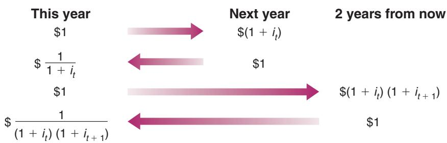
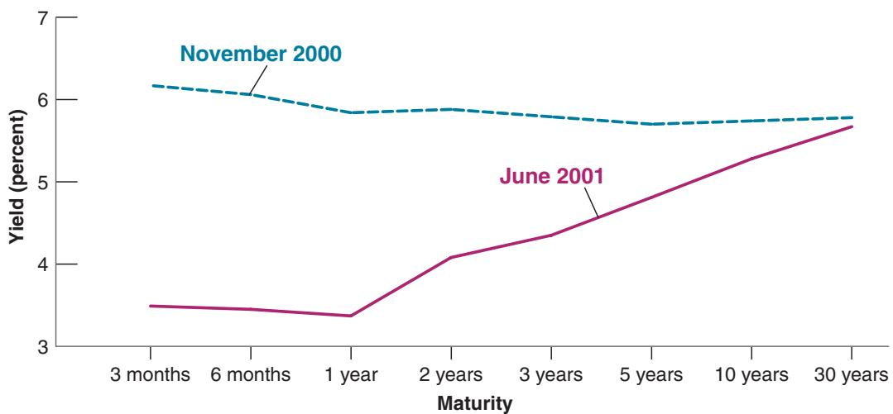
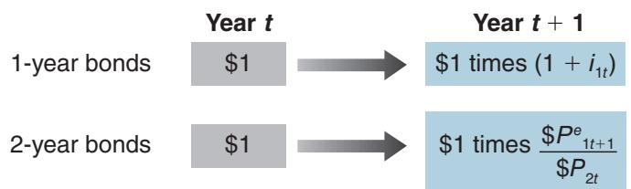

# Financial Markets and Expectations

ur focus throughout this chapter will be on the role expectations play in the determination of asset prices, from bonds to stocks to houses. We discussed the role of expectations informally at various points in the core. It is now time to do it more formally. As you will see, not only are asset prices affected by current and expected future activity, but they in turn affect decisions that influence current economic activity. Understanding their determination is thus central to understanding fluctuations.

Section 14-1 introduces the concept of expected present discounted value, which plays a central role in the determination of asset prices and in consumption and investment decisions.

Section 14-2 looks at the determination of bond prices and bond yields. It shows how bond prices and yields depend on current and expected future short-term interest rates. It then shows how we can use the yield curve to learn about the expected course of future short-term interest rates.

Section 14-3 looks at the determination of stock prices. It shows how stock prices depend on current and expected future profits, as well as on current and expected future interest rates. It then discusses how movements in economic activity affect stock prices.

Section 14-4 looks more closely at the relevance of fads and bubbles—episodes in which asset prices (stock or house prices, in particular) appear to move for reasons unrelated to either current and expected future payments or interest rates.

If you remember one basic message from this chapter, it should be: Expectations determine bond and stock prices.

Figure 14-1

## 14-1 EXPECTED PRESENT DISCOUNTED VALUES

To understand why present discounted values are important, consider the problem facing a manager who is deciding whether or not to buy a new machine. On the one hand, buying and installing the machine involves a cost today. On the other, the machine allows for higher production, higher sales, and higher profits in the future. The question facing the manager is whether the value of these expected profits is higher than the cost of buying and installing the machine. This is where the concept of expected present discounted value comes in handy. The expected present discounted value of a sequence of future payments is the value today of this expected sequence of payments. Once the manager has computed the expected present discounted value of the sequence of profits, her problem becomes simpler. She compares two numbers, the expected present discounted value and the initial cost. If the value exceeds the cost, she should go ahead and buy the machine. If it does not, she should not.

The practical problem is that expected present discounted values are not directly observable. They must be constructed from information on the sequence of expected payments and expected interest rates. Let’s look at the mechanics of construction.

## Computing Expected Present Discounted Values

Denote the one-year nominal interest rate by $i _ { t } ,$ so lending one dollar this year implies getting back $1 + i _ { t }$ dollars next year. Equivalently, borrowing one dollar this year implies paying back $1 + i _ { t }$ dollars next year. In this sense, one dollar this year is worth $1 + i _ { t }$ dollars next year. This relation is represented graphically in the first line of Figure 14-1.

Turn the argument around and ask: How much is one dollar next year worth this year? The answer, shown in the second line of Figure 14-1, is $1 / ( 1 + i _ { t } )$ dollars. Think of it this way: If you lend $1 / ( 1 + i _ { t } )$ dollar this year, you will receive $1 / ( 1 + i _ { t } )$ times $( 1 + i _ { t } ) = 1$ dollar next year. Equivalently, if you borrow $1 / ( 1 + i _ { t } )$ dollar this year, you will have to repay exactly one dollar next year. So, one dollar next year is worth $1 / ( 1 + i _ { t } )$ dollar this year.

More formally, we say that $1 / ( 1 + i _ { t } )$ is the present discounted value of one dollar next year. The word present comes from the fact that we are looking at the value of a payment next year in terms of dollars today. The word discounted comes from the fact that the value next year is discounted, with $1 / ( 1 + i _ { t } )$ being the discount factor. (The rate at which you discount, in this case the nominal interest rate, $i _ { t }$ , is sometimes called the discount rate.)

The higher the nominal interest rate, the lower the value today of a dollar received next year. If $i = 5 \%$ , the value this year of a dollar next year is $1 / 1 . 0 5 \approx 9 5 $ cents. If $i = 1 0 \%$ , the value today of a dollar next year is $1 / 1 . 1 0 \approx 9 1 $ cents.

Now apply the same logic to the value today of a dollar received two years from now. For the moment, assume that current and future one-year nominal interest rates are known with certainty. Let $i _ { t }$ be the nominal interest rate for this year, and $i _ { t + 1 }$ be the oneyear nominal interest rate next year.

If today you lend one dollar for two years, you will get $( 1 + i _ { t } ) ( 1 + i _ { t + 1 } )$ dollars two years from now. Put another way, one dollar today is worth $( 1 + i _ { t } ) ( 1 + i _ { t + 1 } )$ dollars two years from now. This relation is represented in the third line of Figure 14-1.

What is one dollar two years from now worth today? By the same logic as before, the answer is $1 / ( 1 + i _ { t } ) ( 1 + i _ { t + 1 } )$ dollars. If you lend $1 / ( 1 + i _ { t } ) ( 1 + i _ { t + 1 } )$ dollars this year, you will get exactly one dollar in two years. So, the present discounted value of a dollar two years from now is equal to $1 / ( 1 + i _ { t } ) ( 1 + i _ { t + 1 } )$ dollars. This relation is shown in the last line of Figure 14-1. If, for example, the one-year nominal interest rate is the same this year and next and equal to 5%, so $i _ { t } = i _ { t + 1 } = 5 \%$ , then the present discounted value of a dollar in two years is equal to $1 / ( 1 . 0 5 ) ^ { 2 }$ or about 91 cents today.

## A General Formula

Having gone through these steps, it is easy to derive the present discounted value for the case where both payments and interest rates can change over time.

Consider a sequence of payments in dollars, starting today and continuing into the future. Assume for the moment that both future payments and future interest rates are known with certainty. Denote today’s payment by $\$ 2$ the payment next year by $\$ 2$ the payment two years from today by $\$ 2$ , and so on.

The present discounted value of this sequence of payments—that is, the value in today’s dollars of the sequence of payments—which we shall call $\$ 1$ is given by

$$
\mathrm{S} V _ {t} = \mathrm{S} z _ {t} + \frac {1}{(1 + i _ {t})} \mathrm{S} z _ {t + 1} + \frac {1}{(1 + i _ {t}) (1 + i _ {t + 1})} \mathrm{S} z _ {t + 2} + \dots
$$

Each payment in the future is multiplied by its respective discount factor. The more distant the payment, the smaller the discount factor, and thus the smaller today’s value of that distant payment. In other words, future payments are discounted more heavily, so their present discounted value is lower.

We have assumed that future payments and future interest rates were known with certainty. Actual decisions, however, must be based on expectations of future payments rather than on actual values for these payments. In our previous example, the manager cannot be sure how much profit the new machine will bring, nor does she know what interest rates will be in the future. The best she can do is get the most accurate forecasts she can and then compute the expected present discounted value of profits based on these forecasts.

How do we compute the expected present discounted value when future payments and interest rates are uncertain? Basically in the same way as before, but by replacing the known future payments and known interest rates with expected future payments and expected interest rates. Formally: Denote expected payments next year by $\$ 2$ , expected payments two years from now by $\$ 2$ and so on. Similarly, denote the expected oneyear nominal interest rate next year by $i _ { t + 1 } ^ { e }$ , and so on (the one-year nominal interest rate this year, $i _ { t } ,$ is known today, so it does not need a superscript e). The expected present discounted value of this expected sequence of payments is given by

$$
\mathrm{S} V _ {t} = \mathrm{S} z _ {t} + \frac {1}{(1 + i _ {t})} \mathrm{S} z _ {t + 1} ^ {e} + \frac {1}{(1 + i _ {t}) (1 + i _ {t + 1} ^ {e})} \mathrm{S} z _ {t + 2} ^ {e} + \dots\tag{14.1}
$$

“Expected present discounted value” is a heavy expression to carry; instead, we will often just use present discounted value, or even just present value. Also, it will be convenient to have a shorthand way of writing expressions like equation (14.1). To denote the present value of an expected sequence for $\$ 2$ , we shall write $V \big ( \mathbb { S } z _ { t } \big )$ , or just V1\$z2.

## Using Present Values: Examples

Equation (14.1) has two important implications:

■An increase in \$z or an c increase in future $\$ 2$ increase in V

The present value depends positively on today’s actual payment and expected future payments. An increase in either today’s \$z or any future $\$ 2$ leads to an increase in the present value.

An increase in i or an c increase in future $i ^ { e } \Rightarrow { \sf a }$ decrease in V

The present value depends negatively on current and expected future interest rates. An increase in either current i or in any future ie leads to a decrease in the present value.

Equation (14.1) is not simple, however, and so it will help to go through some examples.

## Constant Interest Rates

To focus on the effects of the sequence of payments on the present value, assume that interest rates are expected to be constant over time, so that $i _ { t } = i _ { t + 1 } ^ { e } = . . . ,$ , and denote their common value by i. The present value formula—equation (14.1)—becomes:

$$
\mathrm{S} V _ {t} = \mathrm{S} z _ {t} + \frac {1}{(1 + i)} \mathrm{S} z _ {t + 1} ^ {e} + \frac {1}{(1 + i) ^ {2}} \mathrm{S} z _ {t + 2} ^ {e} + \dots\tag{14.2}
$$

The weights correspond to the terms of a geometric series. See the discussion of geometric series in Appendix 2 at the end of the book.

In this case, the present value is a weighted sum of current and expected future payments, with weights that decline geometrically through time. The weight on a paymentc this year is 1, the weight on the payment n years from now is $( 1 / ( 1 + i ) ) ^ { n }$ . With a positive interest rate, the weights get closer and closer to zero as we look further and further into the future. For example, with an interest rate equal to 10%, the weight on a payment 10 years from today is equal to $1 / ( 1 + 0 . 1 0 ) ^ { 1 0 ^ { - } } = 0 . 3 8 6$ , so that a payment of \$1,000 in 10 years is worth \$386 today. The weight on a payment in 30 years is $1 / ( 1 + 0 . 1 0 ) ^ { 3 0 } = 0 . 0 5 7$ , so that a payment of \$1,000 30 years from today is worth only \$57 today!

## Constant Interest Rates and Payments

In some cases, the sequence of payments for which we want to compute the present value is simple. For example, a typical fixed-rate, 30-year mortgage requires constant dollar payments over 30 years. Consider a sequence of equal payments—call them \$z without a time index—over n years, including this year. In this case, the present value formula in equation (14.2) simplifies to

$$
\mathrm{S} V _ {t} = \mathrm{S} z \left[ 1 + \frac {1}{(1 + i)} + \dots + \frac {1}{(1 + i) ^ {n - 1}} \right]
$$

Because the terms in the expression in brackets represent a geometric series, we can compute the sum of the series and getc

$$
\mathrm{S} V _ {t} = \mathrm{S} z \frac {1 - [ 1 / (1 + i) ^ {n} ]}{1 - [ 1 / (1 + i) ]}
$$

Suppose you have just won \$1 million from your state lottery and have been presented with a 6-foot \$1,000,000 check on TV. Afterward, you are told that, to protect you from your worst spending instincts as well as from your many new “friends,” the state will pay you the million dollars in equal yearly installments of \$50,000 over the next 20 years. What is the present value of your prize today? Taking, for example, an interest rate of 6% per year, the preceding equation gives

$V = \ : \mathfrak { H } 5 0 , 0 0 0 ( 0 . 6 8 8 ) / ( 0 . 0 5 7 ) = \mathrm { o r }$ about \$608,000. Not bad, but winning the prize did not make you a millionaire.

What is the present value if i equals 4%? 8%? (Answers:b \$706,000, \$530,000)

## Constant Interest Rates and Payments Forever

Let’s go one step further and assume that payments are not only constant, but go on forever. Real-world examples are harder to come by for this case, but one example comes from 19th-century England, when the government issued consols, bonds that paid a fixed yearly amount forever. Let \$z be the constant payment. Assume that payments start next year rather than right away as in the previous example (this makes for simpler algebra). From equation (14.2) we have

Some of these consols were still in circulation in 2015, when the British government b decided to buy them back.

$$
\begin{array}{r l} \mathbb {S} V _ {t} & = \frac {1}{(1 + i)} \mathbb {S} z + \frac {1}{(1 + i) ^ {2}} \mathbb {S} z + \dots \\ & = \frac {1}{(1 + i)} \left[ 1 + \frac {1}{(1 + i)} + \dots \right] \mathbb {S} z \end{array}
$$

where the second line follows by factoring out $1 / ( 1 + i )$ . The reason for factoring out $1 / ( 1 + i )$ should be clear from looking at the term in brackets. It is an infinite geometric sum, so we can use the property of geometric sums to rewrite the present value as

$$
\mathrm{S} V _ {t} = \frac {1}{1 + i} \frac {1}{(1 - (1 / (1 + i))} \mathrm{S} z
$$

Or, simplifying (the steps are given in the application of Proposition 2 in Appendix 2 at the end of the book),

$$
\$ V _ {t} = \frac {\$ z}{i}
$$

The present value of a constant sequence of payments \$z is simply equal to the ratio of \$z to the interest rate i. If, for example, the interest rate is expected to be 5% per year forever, the present value of a consol that promises \$10 per year forever equals $\$ 10/0.05=8200$ . If the interest rate increases and is now expected to be 10% per year forever, the present value of the consol decreases to $\$ 10/0.10=9100$

## Zero Interest Rates

Because of discounting, computing present discounted values typically requires the use of a calculator. There is, however, a case where computations simplify. This is the case where the interest rate is equal to zero. If $i = 0$ , then $1 / ( 1 + i )$ equals 1, and so does $( 1 / ( 1 + i ) ^ { n } )$ for any power n. For that reason, the present discounted value of a sequence of expected payments is just the sum of those expected payments. Because the interest rate is typically positive, assuming the interest rate is zero is only an approximation. But it can be a useful one for back-of-the-envelope computations.

## Nominal versus Real Interest Rates and Present Values

So far, we have computed the present value of a sequence of dollar payments by using interest rates in terms of dollars—nominal interest rates. Specifically, we have written equation (14.1):

$$
\mathrm{S} V _ {t} = \mathrm{S} z _ {t} + \frac {1}{(1 + i _ {t})} \mathrm{S} z _ {t + 1} ^ {e} + \frac {1}{(1 + i _ {t}) (1 + i _ {t + 1} ^ {e})} \mathrm{S} z _ {t + 2} ^ {e} + \dots
$$

where $i _ { t } , i _ { t + 1 } ^ { e } , \ldots$ is the sequence of current and expected future nominal interest rates and $\$ 123,456$ is the sequence of current and expected future dollar payments.

The proof is given in the appendix to this chapter. Although it may not be fun, go through it to test your understanding of the two concepts, real interest rate versus nominal interest rate and expected present value.

Suppose we want to compute instead the present value of a sequence of real payments—that is, payments in terms of a basket of goods rather than in terms of dollars. Following the same logic as before, we need to use the right interest rates for this case, namely interest rates in terms of the basket of goods—real interest rates. Specifically, we can write the present value of a sequence of real payments as

$$
V _ {t} = z _ {t} + \frac {1}{\left(1 + r _ {t}\right)} z _ {t + 1} ^ {e} + \frac {1}{\left(1 + r _ {t}\right) \left(1 + r _ {t + 1} ^ {e}\right)} z _ {t + 2} ^ {e} + \dots\tag{14.3}
$$

where $r _ { t } , r _ { t + 1 } ^ { e } , . . .$ is the sequence of current and expected future real interest rates, $z _ { t } , z _ { t + 1 } ^ { e } , z _ { t + 2 } ^ { e } , . . .$ is the sequence of current and expected future real payments, and $V _ { t }$ is the real present value of future payments.

These two ways of writing the present value turn out to be equivalent. That is, the real value obtained by constructing $\$ 1$ using equation (14.1) and dividing by $P _ { t }$ , the price level, is equal to the real valuec $V _ { t }$ obtained from equation (14.3), so

$$
\$ V _ {t} / P _ {t} = V _ {t}
$$

In words: We can compute the present value of a sequence of payments in two ways. One way is to compute it as the present value of the sequence of payments expressed in dollars, discounted using nominal interest rates, and then divided by the price level today. The other way is to compute it as the present value of the sequence of payments expressed in real terms, discounted using real interest rates. The two ways give the same answer.

Do we need both formulas? Yes. Which one is more helpful depends on the context.

Take bonds, for example. Bonds typically are claims to a sequence of nominal payments over a period of years. For example, a 10-year bond might promise to pay \$50 each year for 10 years, plus a final payment of \$1,000 in the last year. So when we look at the pricing of bonds in the next section, we shall rely on equation (14.1) (which is expressed in terms of dollar payments) rather than on equation (14.3) (which is expressed in real terms).

But sometimes, we have a better sense of future expected real values than of future expected dollar values. You might not have a good idea of what your dollar income will be in 20 years. Its value depends very much on what happens to inflation between now and then. But you might be confident that your nominal income will increase by at least as much as inflation—in other words, that your real income will not decrease. In this case, using equation (14.1), which requires you to form expectations of future dollar income, will be difficult. However, using equation (14.3), which requires you to form expectations of future real income, may be easier. For this reason, when we discuss consumption and investment decisions in Chapter 15, we shall rely on equation (14.3) rather than equation (14.1).

## 14-2 BOND PRICES AND BOND YIELDS

## Bonds differ in two basic dimensions:

■ Maturity: The maturity of a bond is the length of time over which the bond promises to make payments to the holder of the bond. A bond that promises to make one payment of \$1,000 in six months has a maturity of six months; a bond that promises to pay \$100 per year for the next 20 years and a final payment of \$1,000 at the end of those 20 years has a maturity of 20 years.

■ Risk: This may be default risk, the risk that the issuer of the bond (it could be a government or a company) will not pay back the full amount promised by the bond. Or it may be price risk, the uncertainty about the price at which you can sell the bond in the future if you want to sell it before maturity.

Both maturity and risk matter in the determination of interest rates. As I want to focus here on the role of maturity and, by implication, the role of expectations, I shall ignore risk for now and reintroduce it later.

Some definitions first: Bonds of different maturities each have a price and an associated interest rate called the yield to maturity, or simply the yield. Yields on bonds with a short maturity, typically a year or less, are called short-term interest rates. Yields on bonds with a longer maturity are called long-term interest rates. On any given day, we observe the yields on bonds of different maturities, and so we can trace graphically how the yield depends on the maturity of a bond. This relation between maturity and yield is called the yield curve, or the term structure of interest rates (the word term is synonymous with maturity).

We introduced earlier two distinctions between different interest rates, real versus nominal interest rates, and policy rate versus borrowing rate (we are leaving this second distinction aside for the moment). We now introduce a third one, short versus long rates. Note that this makes for eight combinations.

Figure 14-2 gives, for example, the term structure of US government bonds on November 1, 2000, and the term structure of US government bonds on June 1, 2001. The choice of the two dates is not accidental; why I chose them will become clear later.

Note that in Figure 14-2, on November 1, 2000, the yield curve was slightly downward sloping, declining from a three-month interest rate of 6.2% to a 30-year interest rate of 5.8%. In other words, long-term interest rates were slightly lower than short-term interest rates. Note that, seven months later, on June 1, 2001, the yield curve was sharply upward sloping, increasing from a three-month interest rate of 3.5% to a 30-year interest rate of 5.7%. In other words, long-term interest rates were much higher than short-term interest rates.

To find out what the yield curve for US bonds is at the time you read this chapter, go to yieldcurve.com and click on “yield curves.” You will see the yield curves for both UK and US bonds.

Why was the yield curve downward sloping in November 2000 but upward sloping in June 2001? Put another way, why were long-term interest rates slightly lower than short-term interest rates in November 2000, but substantially higher than short-term interest rates in June 2001? What were financial market participants thinking at each date? To answer these questions, and more generally to think about the determination of the yield curve and the relation between short- and long-term interest rates, we proceed in two steps:

1. First, we derive bond prices for bonds of different maturities.

2. Second, we go from bond prices to bond yields and examine the determinants of the yield curve and the relation between short- and long-term interest rates.

## Figure 14-2

US Yield Curves: November 1, 2000 and June 1, 2001

The yield curve, which was slightly downward sloping on November 1, 2000, was sharply upward sloping seven months later.

Source: FRED. Series DGS1MO, DGS3MO, DGS6MO, DGS1, DGS2, DGS3, DGS5, DGS7, DGS10, DGS20, DGS30.

## The Vocabulary of Bond Markets

Understanding the basic vocabulary of financial markets will help make them (a bit) less mysterious. Here is a basic vocabulary review.

Bonds are issued by governments or by firms. If issued by the government or government agencies, the bonds are called government bonds. If issued by firms (corporations), they are called corporate bonds.

Bonds are rated for their default risk (the risk that they will not be repaid) by rating agencies. The two major rating agencies are the Standard and Poor’s Corporation (S&P) and Moody’s Investors Service. Standard and Poor’s bond ratings range from AAA to D. In August 2011, Standard and Poor’s downgraded US government bonds from AAA to AA + (the next rating down), reflecting its worry about the large budget deficits. This downgrade created a strong controversy. A lower rating typically implies that the bond must pay a higher interest rate or investors will not buy it. The difference between the interest rate paid on a given bond and the interest rate paid on the bond with the highest (best) rating is called the risk premium associated with the given bond. Bonds with high default risk are sometimes called junk bonds.

Bonds that promise a single payment at maturity, rather than annual payments along the way, are called discount bonds. The single payment is called the face value of the bond.

Bonds that promise multiple payments before maturity and one payment at maturity are called coupon bonds. The payments before maturity are called coupon payments. The final payment is called the face value of the bond. The ratio of coupon payments to the face value is called the coupon rate. The current yield is the ratio of the coupon payment to the price of the bond.

For example, a bond with coupon payments of \$5 each year, a face value of \$100, and a price of \$80 has a coupon rate of 5% and a current yield of 5>80 = 0.0625 = 6.25%. From an economic viewpoint, neither the coupon rate nor the current yield are interesting measures. The correct measure of the interest rate on a bond is its yield to maturity, or simply yield; you can think of it as roughly the average interest rate paid by the bond over its life (the life of a bond is the amount of time left until the bond matures). We shall define the yield to maturity more precisely later in this section.

US government bonds range in maturity from a few days to 30 years. Bonds with a maturity of up to a year when they are issued are called Treasury bills (T-bills). They are discount bonds, making only one payment at maturity. Bonds with a maturity of 1 to 10 years when they are issued are called Treasury notes. Bonds with a maturity of 10 or more years when they are issued are called Treasury bonds. Both Treasury notes and Treasury bonds are coupon bonds. Bonds with longer maturities are riskier, and thus typically carry a risk premium, also called the term premium.

Bonds are typically nominal bonds. They promise a sequence of fixed nominal payments—payments in terms of domestic currency. There are, however, other types of bonds. Among them are indexed bonds, bonds that promise payments adjusted for inflation rather than fixed nominal payments. Instead of promising to pay, say, \$100 in a year, a one-year indexed bond promises to pay 100 11 + p2 dollars, whatever p, the rate of inflation that will take place over the coming year, turns out to be. Because they protect bondholders against the risk of inflation, indexed bonds are popular in many countries. They play a particularly important role in the United Kingdom, where, over the last 30 years, people have increasingly used them to save for retirement. By holding long-term indexed bonds, people can make sure that the payments they receive when they retire will be protected from inflation. Indexed bonds, called Treasury Inflation Protected Securities (TIPS), were introduced in the United States in 1997.

## Bond Prices as Present Values

In much of this section, we shall look at just two types of bonds: a bond that promises Note that both bonds are one payment of \$100 in one year—a one-year bond—and a bond that promises one payment of \$100 in two years—a two-year bond. Once you understand how their prices anddiscount bonds (see the c Focus Box “The Vocabulary yields are determined, it will be easy to generalize the results to bonds of any maturity. I of Bond Markets”). shall do so later.

Let’s start by deriving the prices of the two bonds.

■ Given that the one-year bond promises to pay \$100 next year, it follows, from the previous section, that its price, call it $\$ 9$ must be equal to the present value of a payment of \$100 next year. Let the current one-year nominal interest rate be $i _ { 1 t } .$ Note that we now denote the one-year interest rate in year t by $i _ { 1 t }$ rather than simply by $i _ { t }$ as we did in previous chapters. This is to make it easier for you to remember that it is the one-year interest rate. So,

$$
\$ P _ {1 t} = \frac {\$ 1 0 0}{1 + i _ {1 t}}\tag{14.4}
$$

The price of the one-year bond varies inversely with the current one-year nominal interest rate.

■ Given that the two-year bond promises to pay \$100 in two years, its price, call it $\$ 9$ must be equal to the present value of \$100 two years from now:

$$
\mathrm{P} _ {2 t} = \frac {\mathrm{100}}{\left(1 + i _ {1 t}\right) \left(1 + i _ {1 t + 1} ^ {e}\right)}\tag{14.5}
$$

where $i _ { 1 t }$ denotes the one-year interest rate this year and $i _ { 1 t + 1 } ^ { e }$ denotes the one-year rate expected by financial markets for next year. The price of the two-year bond depends inversely on both the current one-year rate and the one-year rate expected for next year.

## Arbitrage and Bond Prices

Before further exploring the implications of equations (14.4) and (14.5), let us look at an alternative derivation of equation (14.5). This alternative derivation will introduce you to the important concept of arbitrage.

Suppose you have the choice between holding one-year bonds or two-year bonds and what you care about is how much you will have one year from today. Which bonds should you hold?

■ Suppose you hold one-year bonds. For every dollar you put in one-year bonds, you will get $( 1 + i _ { 1 t } )$ dollars next year. This relation is represented in the first line of Figure 14-3.

Suppose you hold two-year bonds. Because the price of a two-year bond is \$ $P _ { 2 t }$ , every dollar you put in two-year bonds buys you $\$ 1/\mathbb { S } P _ { 2 t }$ bonds today. When next year comes, the bond will have one more year before maturity. Thus, one year from today, the two-year bond will now be a one-year bond. Therefore, the price at which you can expect to sell it next year is $\$ 9$ , the expected price of a one-year bond next year. So for every dollar you put in two-year bonds, you can expect to receive $\$ 1/\mathbb { S } P _ { 2 t }$ multiplied by $\$ 9$ , or, equivalently, $\mathbb { S } P _ { 1 t + 1 } ^ { e } / \mathbb { S } P _ { 2 t }$ dollars next year. This is represented in the second line of Figure 14-3.

Which bonds should you hold? Suppose you and other financial investors care only about the expected return and do not care about risk. This assumption is known as the expectations hypothesis. It is a simplification. You and other investors are likely to care not only about the expected return but also about the risk associated with holding each bond. If you hold a one-year bond, you know with certainty what you will get next year. If you hold a two-year bond, the price at which you will sell it next year is uncertain; holding the two-year bond for one year is risky. As I indicated previously, I am disregarding this for now but shall come back to it later.

  
Figure 14-3  
Returns from Holding One-Year and Two-Year Bonds for One Year

Under the assumption that you and other financial investors care only about expected return, it follows that the two bonds must offer the same expected one-year return. Suppose this condition was not satisfied. Suppose that, for example, the oneyear return on one-year bonds was lower than the expected one-year return on two-year bonds. In this case, no one would want to hold the existing supply of one-year bonds, and the market for one-year bonds could not be in equilibrium. Only if the expected one-year return is the same on both bonds will you and other financial investors be willing to hold both one-year bonds and two-year bonds.

If the two bonds offer the same expected one-year return, it follows from Figure 14-3 that

$$
1 + i _ {1 t} = \frac {\$ P _ {1 t + 1} ^ {e}}{\$ P _ {2 t}}\tag{14.6}
$$

The left side of the equation gives the return per dollar from holding a one-year bond for one year; the right side gives the expected return per dollar from holding a two-year bond for one year. We shall call equations such as (14.6)—equations that state that the expected returns on two assets must be equal—arbitrage relations. Rewrite equation (14.6) asc

$$
\$ P _ {2 t} = \frac {\$ P _ {1 t + 1} ^ {e}}{1 + i _ {1 t}}\tag{14.7}
$$

Arbitrage implies that the price of a two-year bond today is the present value of the expected price of the bond next year. This naturally raises the next question: What does the expected price of one-year bonds next year $\left( \$ 9 P _ { 1 t + 1 } ^ { e } \right)$ depend on?

The answer is straightforward. Just as the price of a one-year bond this year depends on this year’s one-year interest rate, the price of a one-year bond next year will depend on the one-year interest rate next year. Writing equation (14.4) for next year 1year t + 12 and denoting expectations in the usual way, we get

$$
\$ P _ {1 t + 1} ^ {e} = \frac {\$ 1 0 0}{\left(1 + i _ {1 t + 1} ^ {e}\right)}\tag{14.8}
$$

The price of the bond next year is expected to equal the final payment, \$100, discounted by the one-year interest rate expected for next year.

Replacing $\$ 9$ from equation (14.8) in equation (14.7) gives

The relation between arbitrage and present values: Arbitrage between bonds of different maturities implies that bond prices are equal to the expected present values of payments on these bonds.

$$
\mathrm{P} _ {2 t} = \frac {\mathrm{100}}{\left(1 + i _ {1 t}\right) \left(1 + i _ {1 t + 1} ^ {e}\right)}\tag{14.9}
$$

This expression is the same as equation (14.5). This is the point. What we have shown is that arbitrage between one- and two-year bonds implies that the price of twoyear bonds is the present value of the payment in two years, namely \$100, discounted using current and next year’s expected one-year interest rates.c

## From Bond Prices to Bond Yields

Having looked at bond prices, we now go on to bond yields. The basic point: Bond yields contain the same information about future expected interest rates as bond prices. They just do so in a much clearer way.

To begin, we need a definition of the yield to maturity. The yield to maturity on an n-year bond, or equivalently, the n-year interest rate, is defined as the constant annual interest rate that makes the bond price today equal to the present value of future payments on the bond.

This definition is simpler than it sounds. Take, for example, the two-year bond we introduced previously. Denote its yield by $i _ { 2 t } ,$ , where the subscript 2 is there to remind us that this is the yield to maturity on a two-year bond, or, equivalently, the two-year interest rate. Following the definition of the yield to maturity, this yield is the constant annual interest rate that would make the present value of \$100 in two years equal to the price of the bond today. So, it satisfies the following relation:

$$
\$ P _ {2 t} = \frac {\$ 1 0 0}{\left(1 + i _ {2 t}\right) ^ {2}}\tag{14.10}
$$

Suppose the bond sells for \$90 today. Then the two-year interest rate $i _ { 2 t }$ is given by $\sqrt { 1 0 0 / 9 0 } - 1$ , or 5.4%. In other words, holding the bond for two years—until maturity—yields an interest rate of 5.4% per year.

What is the relation of the two-year interest rate to the current one-year interest rate and the expected one-year interest rate? To answer that question, look at equation (14.10) and equation (14.9). Eliminating $\$ 9_ { 2 t }$ between the two gives

$\mathbb { S } 9 0 = \mathbb { S } 1 0 0 / ( 1 + i _ { 2 t } ) ^ { 2 } \Longrightarrow$ 11 + i 22 = \$100> \$90 12b $( 1 + i _ { 2 t } ) \sqrt  \{ { \scriptsize { 1 0 0 } } / { \scriptsize { \mathbb { S 9 0 } } } \Longrightarrow$ i2t = 5.4%

$$
\frac {\$ 1 0 0}{\left(1 + i _ {2 t}\right) ^ {2}} = \frac {\$ 1 0 0}{\left(1 + i _ {1 t}\right) \left(1 + i _ {1 t + 1} ^ {e}\right)}
$$

Rearranging,

$$
(1 + i _ {2 t}) ^ {2} = (1 + i _ {1 t}) (1 + i _ {1 t + 1} ^ {e})
$$

This gives us the relation between the two-year interest rate $i _ { 2 t } ,$ , the current one-year interest rate $i _ { 1 t } ,$ , and next year’s expected one-year interest rate $i _ { t + 1 } ^ { e } . \mathrm { A }$ useful approximation to this relation is given by

$$
i _ {2 t} \approx \frac {1}{2} \left(i _ {1 t} + i _ {1 t + 1} ^ {e}\right)\tag{14.11}
$$

We used a similar approximation when we looked at the relation between the nominal interest rate and theb real interest rate in Chapter 6. See Proposition 3 in Appendix 2 at the end of the book.

Equation (14.11) simply says that the two-year interest rate is (approximately) the average of the current one-year interest rate and next year’s expected one-year interest rate.

We have focused on the relation between the prices and yields of one- and two-year bonds. But our results generalize to bonds of any maturity. For instance, we could have looked at bonds with maturities of less than a year. To take an example, the yield on a bond with a maturity of six months is (approximately) equal to the average of the current three-month interest rate and next quarter’s expected three-month interest rate. Or we could have looked instead at bonds with maturities longer than two years. For example, the yield on a 10-year bond is (approximately) equal to the average of the current one-year interest rate and the one-year interest rates expected for the next nine years.

The general principle is clear: Long-term interest rates reflect current and future expected short-term interest rates. Before we return to an interpretation of the yield curves in Figure 14-2, we need to reintroduce risk.
