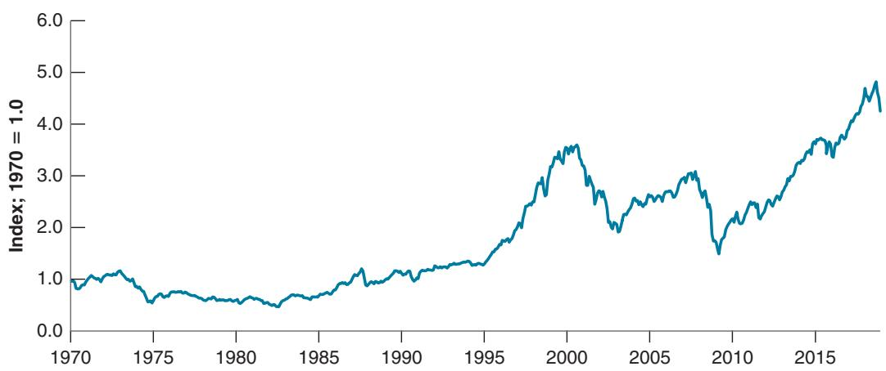
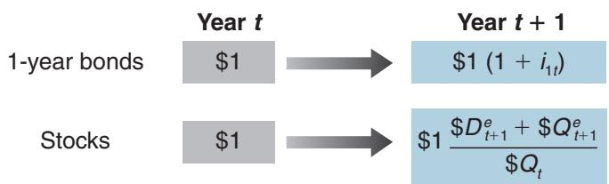
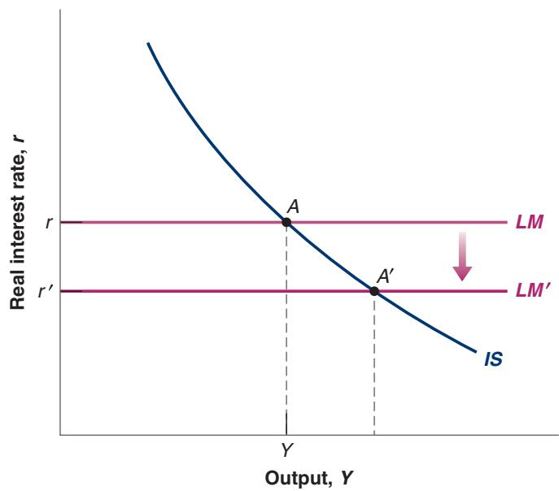
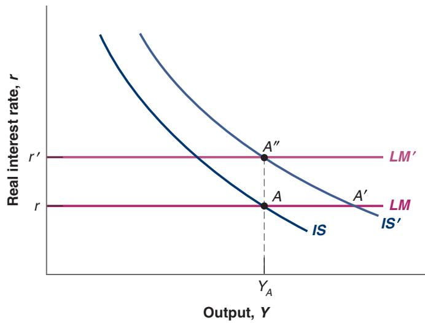

## Reintroducing Risk

We have assumed so far that investors did not care about risk. But they do care. Go back to the choice between holding a one-year bond for one year or holding a two-year bond for one year. The first option is riskless. The second is risky as you do not know the price at which you will sell the bond in a year. You are thus likely to ask for a risk premium to hold the two-year bond, and the arbitrage equation takes the form:

$$
1 + i _ {1 t} + x = \frac {\$ P _ {1 t + 1} ^ {e}}{\$ P _ {2 t}}
$$

The expected return on the two-year bond (the right-hand side) must exceed the return on the one-year bond by some risk premium x. Reorganizing gives:

$$
\$ P _ {2 t} = \frac {\$ P _ {1 t + 1} ^ {e}}{1 + i _ {1 t} + x}
$$

The price of the two-year bond is the discounted value of the expected price of a one-year bond next year, with the discount rate now reflecting the risk premium. As one-year bonds have a known return and are therefore not risky, the expected price of a one-year bond next year is still given by equation (14.8). So replacing in the previous equation gives:

$$
\$ P _ {2 t} = \frac {\$ 1 0 0}{\left(1 + i _ {1 t}\right) \left(1 + i _ {1 t + 1} ^ {e} + x\right)}\tag{14.12}
$$

Now, to go from prices to yields, let’s go through the same steps as before. Using the two expressions for the price of the two-year bond, equation (14.10) and equation (14.12), gives:

$$
\frac {\$ 1 0 0}{\left(1 + i _ {2 t}\right) ^ {2}} = \frac {\$ 1 0 0}{\left(1 + i _ {1 t}\right) \left(1 + i _ {1 t + 1} ^ {e} + x\right)}
$$

Manipulating the equation gives:

$$
(1 + i _ {2 t}) ^ {2} = (1 + i _ {1 t}) (1 + i _ {1 t + 1} ^ {e} + x)
$$

Finally, using the same approximation as before gives:

$$
i _ {2 t} \approx \frac {1}{2} \left(i _ {1 t} + i _ {1 t + 1} ^ {e} + x\right)\tag{14.13}
$$

Recently, the term premium has decreased, due to the use of quantitative easing by the Fed (more on this in

The two-year rate is the average of the current and expected one-year rate plus a risk premium. Take the case where the one-year rate is expected to be the same next year as this year. Then the two-year rate will exceed the one-year rate by a term reflecting the risk in holding two-year bonds. As the price risk increases with the maturity of the bonds, the risk premium typically increases with maturity, typically reaching 1–2% for long-term bonds. This implies that, on average, the yield curve is slightly upward sloping, reflecting the higher risk involved in holding longer maturity bonds.c

## Interpreting the Yield Curve

We now have what we need to interpret Figure 14-2.

Consider the yield curve for November 1, 2000. Recall that when investors expect interest rates to be constant over time, the yield curve should be slightly upward sloping, reflecting the fact that the risk premium increases with maturity. The fact that the yield curve was downward sloping, something relatively rare, tells us that investors expected interest rates to go down slightly over time, with the expected decrease in rates more than compensating for a rising term premium. And if we look at the macroeconomic situation at the time, they had good reasons to hold this view. At the end of November 2000, the US economy was slowing down. Investors expected what they called a smooth landing. They thought that to maintain growth, the Fed would slowly decrease the policy rate, and these expectations were what lay behind the downward-sloping yield curve. By June 2001, however, growth had declined much more than was expected in November 2000, and by then the Fed had decreased the interest rate much more than investors had expected. Investors now expected that, as the economy recovered, the Fed would start increasing the policy rate. So the yield curve sloped upward. Note, however, that the yield curve was nearly flat for maturities up to one year. This tells us that financial markets did not expect interest rates to start rising until a year hence—that is, before June 2002. Did they turn out to be right? Not quite. In fact, the recovery was much weaker than expected, and the Fed did not increase the policy rate until June 2004—fully two years later than financial markets had anticipated.

You may want to read again the Focus Box on the 2001 recession in Chapter 5.

Let’s summarize what you have learned in this section. We have focused on bonds. You have seen how arbitrage determines the price of bonds. You have seen how bond prices and bond yields depend on current and future expected interest rates and risk premiums and what can be learned by looking at the yield curve.

## 14-3 THE STOCK MARKET ANDMOVEMENTS IN STOCK PRICES

While governments finance themselves by issuing bonds, the same is not true of firms. Firms finance themselves in four ways. First, they rely on internal finance— that is, they use some of their own profits; second—and this is the main channel of external finance for small firms—through bank loans (as we saw in Chapter 6, this channel played a central role in the crisis); third, through debt finance—bonds and loans; and fourth, through equity finance, issuing stocks—or shares, as stocks are also called. Instead of paying predetermined amounts as bonds do, stocks pay dividends in an amount decided by the firm. Dividends are paid from the firm’s profits. Typically, dividends are less than profits because firms retain some of their profits to finance their investment. But dividends move with profits: When profits increase, so do dividends.

Our focus in this section is on the determination of stock prices. As a way of introducing the issues, let’s look at the behavior of an index of US stock prices, the Standard & Poor’s 500 Composite Index (the S&P index) since 1980. Movements in the S&P index measure movements in the average stock price of 500 large companies.

Figure 14-4 plots the real stock price index constructed by dividing the S&P index by the consumer price index (CPI) for each month and normalizing so the index is equal to 1 in 1970. The striking feature of the figure is obviously the sharp movements in the value of the index. Note that the index went up from 1.4 in 1995 to 3.5 in 2000, only to decline sharply to 2.1 in 2003. And in the Great Financial Crisis, the index declined from 3.4 in 2007 to 1.7 in 2009, only to recover since then, standing at 4.3 at the end

Another and better-known index is the Dow Jones Industrial Average, an index of stocks of primarily industrial firms and therefore less representative of the average price of stocks than is the S&P index. Similar indexes exist for other countries. The Nikkei index reflects movements of stock prices in Tokyo, and the FTSE and CAC 40 indexes reflect stock price movements in London and Paris, respectively.

Figure 14-4

Standard and Poor’s Stock Price Index in Real Terms since 1970

Note the sharp fluctuations in stock prices since the mid-1990s.

Source: FRED SP500, CPIAUCSL.

of 2018. What determines these sharp movements in stock prices? How do stock prices respond to changes in the economic environment and macroeconomic policy? These are the questions we take up in this section.

## Stock Prices as Present Values

What determines the price of a stock that promises a sequence of dividends in the future? By now, I am sure the material in Section 14-1 has become second nature, and you already know the answer. The stock price must be equal to the present value of future expected dividends.

Just as we did for bonds, let’s derive this result by looking at the implications of arbitrage between one-year bonds and stocks. Suppose you face the choice of investing either in one-year bonds or in stocks for a year. What should you choose?

■ Suppose you decide to hold one-year bonds. Then for every dollar you put in one-year bonds, you will get $( 1 + i _ { 1 t } )$ dollars next year. This payoff is represented in the upper line of Figure 14-5.

1 Suppose you decide instead to hold stocks for a year. Let \$ $\mathcal { Q } _ { t }$ be the price of the stock. Let $\$ 0$ denote the dividend this year, and $\$ { D } _ { t + 1 } ^ { e }$ the expected dividend next year. Suppose we look at the price of the stock after the dividend has been paid this year; this price is known as the ex-dividend price—so that the first dividend to be paid after the purchase of the stock is next year’s dividend. (This is just a matter of convention; we could alternatively look at the price before this year’s dividend has been paid. What term would we have to add?)

Holding the stock for a year implies buying a stock today, receiving a dividend next year, and then selling the stock. As the price of a stock is $\$ 0$ , every dollar you put in stocks buys you \$ $1 / \mathbb { S } \mathcal { Q } _ { t }$ stocks. And for each stock you buy, you expect to receive $\left( \mathbb { S } D _ { t + 1 } ^ { e } + \mathbb { S } Q _ { t + 1 } ^ { e } \right)$ , the sum of the expected dividend and the stock price next year. Therefore, for every dollar you put in stocks, you expect to receive $\left( \mathbb { S } D _ { t + 1 } ^ { e } + \mathbb { S } Q _ { t + 1 } ^ { e } \right) / \mathbb { S } Q _ { t }$ This payoff is represented in the lower line of Figure 14-5.

Let’s use the same arbitrage argument we used for bonds. It is clear that holding a stock for one year is risky, much riskier than holding a one-year bond for a year (which is riskless). Rather than proceeding in two steps as we did for bonds (first leaving out risk considerations and then introducing a risk premium), let’s take risk into account from the start and assume that financial investors require a risk premium to hold stocks.

In the case of stocks, the risk premium is called the equity premium. Equilibrium then requires that the expected rate of return from holding stocks for one year be the same as the rate of return on one-year bonds plus the equity premium:

$$
\frac {\$ D _ {t + 1} ^ {e} + \$ Q _ {t + 1} ^ {e}}{\$ Q _ {t}} = 1 + i _ {1 t} + x
$$

where x denotes the equity premium. Rewrite this equation as

$$
\$ Q _ {t} = \frac {\$ D _ {t + 1} ^ {e}}{\left(1 + i _ {1 t} + x\right)} + \frac {\$ Q _ {t + 1} ^ {e}}{\left(1 + i _ {1 t} + x\right)}\tag{14.14}
$$

Figure 14-5

Returns from Holding One-Year Bonds or Stocks for One Year

Arbitrage implies that the price of the stock today must be equal to the present value of the expected dividend plus the present value of the expected stock price next year.

The next step is to think about what determines $\$ 0_ { t +1 } ^ { e }$ , the expected stock price next year. Next year, financial investors will again face the choice between stocks and one-year bonds. Thus, the same arbitrage relation will hold. Writing the previous equation, but now for time $t + 1$ and taking expectations into account, gives

$$
\$ Q _ {t + 1} ^ {e} = \frac {\$ D _ {t + 2} ^ {e}}{\left(1 + i _ {1 t + 1} ^ {e} + x\right)} + \frac {\$ Q _ {t + 2} ^ {e}}{\left(1 + i _ {1 t + 1} ^ {e} + x\right)}
$$

The expected price next year is simply the present value next year of the sum of the expected dividend and price two years from now. Replacing the expected price $\$ 0_ { t +1 } ^ { e }$ in equation (14.14) gives

$$
\$ Q _ {t} = \frac {\$ D _ {t + 1} ^ {e}}{\left(1 + i _ {1 t} + x\right)} + \frac {\$ D _ {t + 2} ^ {e}}{\left(1 + i _ {1 t} + x\right) \left(1 + i _ {1 t + 1} ^ {e} + x\right)} + \frac {\$ Q _ {t + 2} ^ {e}}{\left(1 + i _ {1 t} + x\right) \left(1 + i _ {1 t + 1} ^ {e} + x\right)}
$$

The stock price is the present value of the expected dividend next year, plus the present value of the expected dividend two years from now, plus the expected price two years from now.

If we replace the expected price in two years with the present value of the expected price and dividends in three years, and so on for n years, we get

$$
\begin{array}{l} \mathbb {S} Q _ {t} = \frac {\mathbb {S} D _ {t + 1} ^ {e}}{(1 + i _ {1 t} + x)} + \frac {\mathbb {S} D _ {t + 2} ^ {e}}{(1 + i _ {1 t} + x) (1 + i _ {1 t + 1} ^ {e} + x)} + \dots \\ \quad + \frac {\mathbb {S} D _ {t + n} ^ {e}}{(1 + i _ {1 t} + x) \cdots (1 + i _ {1 t + n - 1} ^ {e} + x)} + \frac {\mathbb {S} Q _ {t + n} ^ {e}}{(1 + i _ {1 t} + x) \cdots (1 + i _ {1 t + n - 1} ^ {e} + x)} \end{array}\tag{14.15}
$$

Look at the last term in equation (14.15), the present value of the expected price in n years. As long as people do not expect the stock price to explode in the future, then as we keep replacing $\boldsymbol { Q } _ { t + n } ^ { e }$ and n increases, this term will go to zero. To see why, suppose the interest rate is constant and equal to i. The last term becomes

$$
\frac {\S Q _ {t + n} ^ {e}}{\left(1 + i _ {1 t} + x\right) \cdots \left(1 + i _ {1 t + n - 1} ^ {e} + x\right)} = \frac {\S Q _ {t + n} ^ {e}}{\left(1 + i + x\right) ^ {n}}
$$

Suppose further that people expect the price of the stock to converge to some value, call it \$Q, in the far future. Then, the last term becomes

$$
\frac {\$ Q _ {t + n} ^ {e}}{(1 + i + x) ^ {n}} = \frac {\$ \overline {{Q}}}{(1 + i + x) ^ {n}}
$$

A subtle point: The condition that people expect the price of the stock to converge to some value over time seems reasonable. Indeed, most of the time it is likely to be satisfied. When, however, prices are subject to rational bubbles (Section 14–4), people expect large increases in the stock price in the future and this is when the condition that the expected stock price does not explode is not satisfied. This is why, when there are bubbles, this argument fails, and the stock price is no longer equal to the present value of expected dividends.

If the discount rate is positive, this expression goes to zero as n becomes large. Equation (14.15) reduces to

$$
\begin{array}{c} \mathbb {S} Q _ {t} = \frac {\mathbb {S} D _ {t + 1} ^ {e}}{(1 + i _ {1 t} + x)} + \frac {\mathbb {S} D _ {t + 2} ^ {e}}{(1 + i _ {1 t} + x) (1 + i _ {1 t + 1} ^ {e} + x)} + \dots \\ \quad + \frac {\mathbb {S} D _ {t + n} ^ {e}}{(1 + i _ {1 t} + x) \cdots (1 + i _ {1 t + n - 1} ^ {e} + x)} + \dots \end{array}\tag{14.16}
$$

Two equivalent ways of writing the stock price: The nominal stock price equals the expected present discounted value of future nominal dividends, discounted by current and future nominal interest rates.

The real stock price equals the expected present discounted value of future real dividends, discounted by current and future real interest rates.

The price of the stock is equal to the present value of the dividend next year, discounted using the current one-year interest rate plus the equity premium, plus the present value of the dividend two years from now, discounted using both this year’s one-year interest rate and the next year’s expected one-year interest rate, plus the equity premium, and so on.

Equation (14.16) gives the stock price as the present value of nominal dividends, discounted by nominal interest rates. From Section 14-1, we know we can rewrite this equation to express the real stock price as the present value of real dividends, discounted by real interest rates. So we can rewrite the real stock price as:

$$
Q _ {t} = \frac {D _ {t + 1} ^ {e}}{(1 + r _ {1 t} + x)} + \frac {D _ {t + 2} ^ {e}}{(1 + r _ {1 t} + x) (1 + r _ {1 t + 1} ^ {e} + x)} + \dots\tag{14.17}
$$

Q and $D _ { t } ,$ , without a dollar sign, denote the real price and real dividends at time t. The real stock price is the present value of future real dividends, discounted by the sequence of one-year real interest rates plus the equity premium.

This relation has three important implications:

■ Higher expected future real dividends lead to a higher real stock price.

■ Higher current and expected future one-year real interest rates lead to a lower real stock price.

■ A higher equity premium leads to a lower stock price.

Let’s now see what light this relation sheds on movements in the stock market.

## The Stock Market and Economic Activity

Figure 14-4 showed the large movements in stock prices over the last two decades. It is not unusual for the index to go up or down by 15% within a year. In 1997, the stock market went up by 24% (in real terms); in 2008, it went down by 46%. Daily movements of 2% or more are not unusual. What causes these movements?

You may have heard that stock prices follow a random walk. This is a technical term, but with a simple interpretation. Something—it can be a molecule, or the price of an asset—follows a random walk if each step it takes is as likely to be up as it is to be down. Its movements are therefore unpredictable.

The first point to be made is that these movements should be, and are for the most part, unpredictable. The reason why is best understood by thinking in terms of the choice people have between stocks and bonds. If it were widely believed that, a year from now, the price of a stock was going to be 20% higher than today’s price, holding the stock for a year would be unusually attractive, much more attractive than holding short-term bonds. There would be a very large demand for the stock. Its price would increase today to the point where the expected return from holding the stock was back in line with the expected return on other assets. In other words, the expectation of a high stock price next year would lead to a high stock price today.

There is a saying in economics that it is a sign of a well-functioning stock market that movements in stock prices are unpredictable. The saying is not quite right. At any moment, a few financial investors will have better information or simply be better at reading the future. If they are only a few, they may not buy enough of the stock to bid its price all the way up today. Thus, they may get large expected returns. But the basic idea is nevertheless correct. Financial market gurus who regularly predict large imminent movements in the stock market are quacks. Major movements in stock prices cannot be predicted.

If movements in the stock market cannot be predicted, if they are the result of news, where does this leave us? We can still do two things:

■ We can do Monday-morning quarterbacking, looking back and identifying the news to which the market reacted.

■ We can ask “what if” questions. For example: What would happen to the stock market if the Fed were to embark on a more expansionary policy, or if consumers were to become more optimistic and increase spending?

Let us look at two “what if” questions using the IS-LM model we developed earlier (we shall extend it in the next chapter to take explicit account of expectations; for the moment the old model will do). To simplify, let’s assume, as we did earlier, that expected inflation equals zero, so that the real interest rate and the nominal interest rate are equal.

## A Monetary Expansion and the Stock Market

Suppose the economy is in a recession and the Fed decides to decrease the policy rate. The LM curve shifts down to LM′ in Figure 14-6, and equilibrium output moves from point A to point A′. How will the stock market react?

This assumes that the policy rate is positive to start with, so the economy is not in a b liquidity trap.

The answer depends on what participants in the stock market expected monetary policy to be before the Fed’s move:

Stock prices may go up. If the Fed’s move is at least partly unexpected, stock prices are likely to increase, for two reasons: First, a more expansionary monetary policy implies lower interest rates for some time. Second, it also implies higher output for some time (until the economy returns to the natural level of output), and therefore higher dividends. As equation (14.17) tells us, both lower interest rates and higher dividends— current and expected—will lead to an increase in stock prices.

Stock prices may not change. If investors fully anticipated the expansionary policy, then the stock market will not react. Neither its expectations of future dividends nor its expectations of future interest rates are affected by a move it had already anticipated. Thus, in equation (14.17), nothing changes, and stock prices remain the same.

Stock prices may go down. If stock market participants believe that the Fed is acting because it knows something they don’t, namely that the economy is much worse than they thought, they might conclude that, on net, lower interest rates will not be enough to offset the bad news. They might then lower their forecasts of output and of dividends, leading to a decrease in stock prices.

  
Figure 14-6  
An Expansionary Monetary Policy and the Stock Market

A monetary expansion decreases the interest rate and increases output. What it does to the stock market depends on whether or not financial markets anticipated the monetary expansion and on the motives of the central bank.

## Figure 14-7

An Increase in Consumption Spending and the Stock Market

An increase in consumption leads to a higher level of output. What happens to the stock market depends on the reaction of the Fed.

## An Increase in Consumer Spending and the Stock Market

Now consider an unexpected shift of the IS curve to the right, resulting, for example, from stronger-than-expected consumer spending. As a result of the shift, output in Figure 14-7 increases from A to $A ^ { \prime }$

Will stock prices go up? You might be tempted to say yes. A stronger economy means higher profits and higher dividends for some time. But this answer is not necessarily right.

The reason is that it ignores the response of the Fed. If the market expects that the Fed will not respond and will keep the real policy rate unchanged at r, output will increase a lot, as the economy moves to A′. With unchanged interest rates and higher output, stock prices go up.

The Fed’s behavior however is what financial investors often care about the most. After receiving the news of unexpectedly strong economic activity, the main question on Wall Street is: How will the Fed react?

What will happen if the market expects that the Fed might worry that an increase in output above $Y _ { A }$ may lead to an increase in inflation? This will be the case if $Y _ { A }$ was already close to the natural level of output. In this case, a further increase in output would lead to an increase in inflation, something that the Fed wants to avoid. A decision by the Fed to counteract the rightward shift of the IS curve with an increase in the policy rate causes the LM curve to shift up, from LM to LM′, so the economy goes from A to $A ^ { \prime \prime }$ and output does not change. In that case, stock prices will surely go down: There is no change in expected profits, but the interest rate is now higher.

Let’s summarize: Stock prices depend on current and future movements in activity. But this does not imply any simple relation between stock prices and output. How stock prices respond to a change in output depends on (1) what the market expected in the first place, (2) the source of the shocks behind the change in output, and (3) how the market expects the central bank to react to the output change. Test your newly acquired understanding by reading the Focus Box “Making (Some) Sense of (Apparent) Nonsense: Why the Stock Market Moved Yesterday, and Other Stories.” Good luck!

