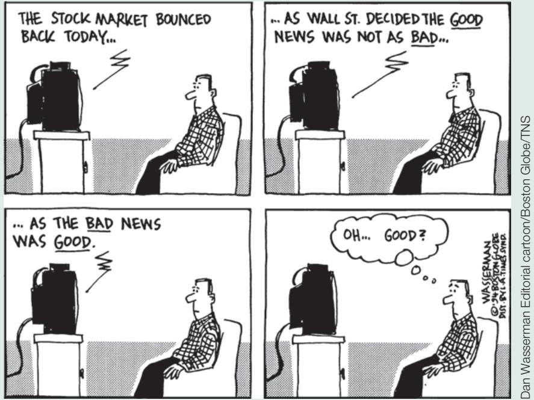

# Making (Some) Sense of (Apparent) Nonsense: Why the Stock Market Moved Yesterday, and Other Stories

Here are some quotes from The Wall Street Journal from April 1997 to August 2001. Try to make sense of them, using what you’ve just learned. (And if you have time, find your own quotes.)

April 1997. Good news on the economy, leading to an increase in stock prices:

“Bullish investors celebrated the release of marketfriendly economic data by stampeding back into stock and bond markets, pushing the Dow Jones Industrial Average to its second-largest point gain ever and putting the blue-chip index within shooting distance of a record just weeks after it was reeling.”

December 1999. Good news on the economy, leading to a decrease in stock prices:

“Good economic news was bad news for stocks and worse news for bonds ... The announcement of stronger-than-expected November retail-sales numbers wasn’t welcome. Economic strength creates inflation fears and sharpens the risk that the Federal Reserve will raise interest rates again.”

September 1998. Bad news on the economy, leading to a decrease in stock prices:

“Nasdaq stocks plummeted as worries about the strength of the US economy and the profitability of US corporations prompted widespread selling.”

August 2001. Bad news on the economy, leading to an increase in stock prices:

“Investors shrugged off more gloomy economic news, and focused instead on their hope that the worst is now over for both the economy and the stock market. The optimism translated into another 2% gain for the Nasdaq Composite Index.”

  
Dan Wasserman Editorial cartoon/Boston Globe/TNS

## 14-4 RISK, BUBBLES, FADS, AND ASSET PRICES

Do all movements in stock and other asset prices come from news about future dividends or interest rates? The answer is no, for two reasons: The first is that there is variation over time in perceptions of risk. The second is deviations of prices from their fundamental value, namely bubbles or fads. Let’s look at each one in turn.

## Stock Prices and Risk

In the previous section, I assumed that the equity premium x was constant. It is not. After the Great Depression, the equity premium was very high, perhaps reflecting the fact that investors, remembering the collapse of the stock market in 1929, were reluctant to hold stocks unless the premium was high enough. It started to decrease in the early 1950s, from around 7% to less than 4% today. And it can also change quickly. Part of the large stock market fall in 2008 was due not only to more pessimistic expectations of future dividends, but also to the large increase in uncertainty and the perception of higher risk by stock market participants. Thus, much of the movement in stock prices comes not just from expectations of future dividends and interest rates but also from shifts in the equity premium.

## Asset Prices, Fundamentals, and Bubbles

In the previous section, we assumed that stock prices were always equal to their fundamental value, defined as the present value of expected dividends given in equation (14.17). Do stock prices always correspond to their fundamental value? Most economists doubt it. They point to Black October in 1929, when the US stock market fell
