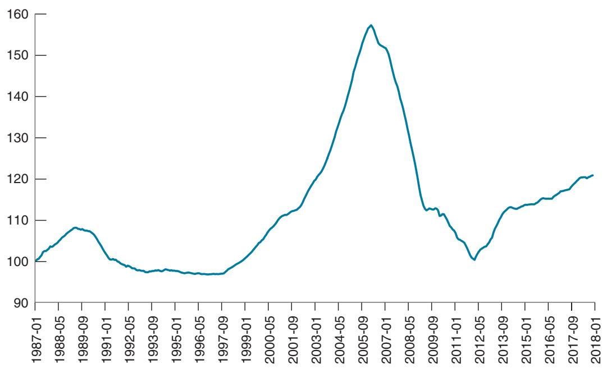
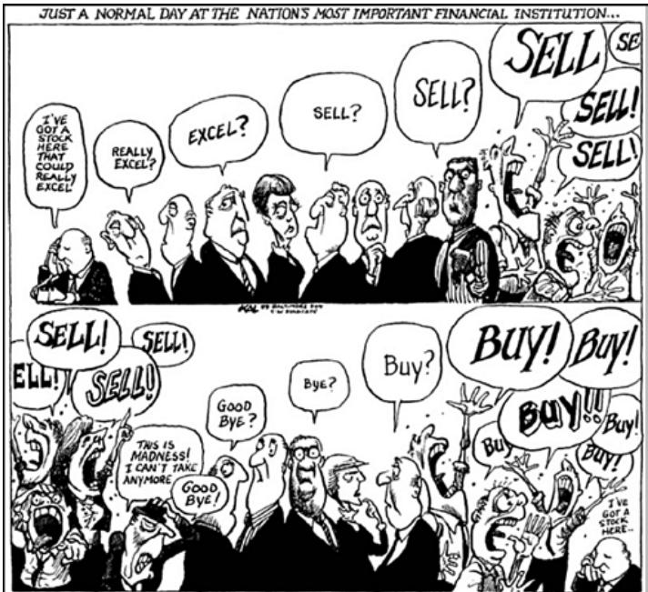

# The Increase in US Housing Prices During the First Half of the 2000s: Fundamentals or Bubble?

Recall from Chapter 6 that the trigger behind the current crisis was a decline in housing prices that started in 2006 (see Figure 6–7 for the evolution of the housing price index). In retrospect, the large increase from 2000 on that preceded the decline is now widely interpreted as a bubble. But in real time as prices went up, there was little agreement as to what laid behind this increase.

## Economists belonged to three camps:

The pessimists argued that the price increases could not be justified by fundamentals. In 2005, Robert Shiller said: “The home-price bubble feels like the stock-market mania in the fall of 1999, just before the stock bubble burst in early 2000, with all the hype, herd investing and absolute confidence in the inevitability of continuing price appreciation.”

To understand his position, go back to the derivation of stock prices in the text. We saw that, absent bubbles, we can think of stock prices as depending on current and expected future interest rates, current and expected future dividends, and a risk premium. The same applies to house prices. Absent bubbles, we can think of house prices as depending on current and expected future interest rates, current and expected rents, and a risk premium. In that context, pessimists pointed out that the increase in house prices was not matched by a parallel increase in rents. You can see this in Figure 1, which plots the price-to-rent ratio (i.e., the ratio of an index of house prices to an index of rents) since 1987 (the index is set so its value in

January 1987 is 100). After remaining roughly constant from 1987 to the late 1990s, the ratio increased by nearly 60%, reaching a peak in 2006 before declining. (It remains substantially lower than the peak.) Furthermore, Shiller pointed out, surveys of house buyers suggested extremely high expectations of continuing large increases in housing prices—often in excess of 10% a year—and thus of large capital gains. As we saw previously, if assets are valued at their fundamental value, investors should not be expecting large capital gains in the future.

The optimists argued that there were good reasons for the price-to-rent ratio to go up. First, as we saw in Figure 6–2, the real interest rate was decreasing, increasing the present value of rents. Second, the mortgage market was changing. More people were able to borrow and buy a house. And those who borrowed were able to borrow a larger proportion of the value of the house. Both factors contributed to an increase in demand, and thus an increase in house prices. The optimists also pointed out that, every year since 2000, the pessimists had kept predicting the end of the bubble, and prices continued to increase. The pessimists were losing credibility.

The third group was by far the largest and remained agnostic. (Harry Truman is reported to have said: “Give me a onehanded economist! All my economists say, ‘On the one hand... on the other.’”) They concluded that the increase in house prices reflected both improved fundamentals and bubbles and that it was difficult to identify their relative importance.

  
Figure 1  
The US Housing Price-to-Rent Ratio since 1987  
Source: FRED: CSUSHPISA: Case-Shiller Home Price Index. CUSR0000SEHA, Rent of Primary Residence.

What conclusions should you draw? The pessimists were clearly largely right. But bubbles and fads are clearer to see in retrospect than while they are taking place. This makes the task of policymakers much harder. If they were sure it was a bubble, they should try to stop it before it gets too large and then bursts. But they can rarely be sure until it is too late.1

  
Jason Zweig.com

## SUMMARY

The expected present discounted value of a sequence of payments equals the value this year of the expected sequence of payments. It depends positively on current and future expected payments and negatively on current and future expected interest rates.

When discounting a sequence of current and expected future nominal payments, one should use current and expected future nominal interest rates. In discounting a sequence of current and expected future real payments, one should use current and expected future real interest rates.

Arbitrage between bonds of different maturities implies that the price of a bond is the present value of the payments on the bond, discounted using current and expected short-term interest rates over the life of the bond, plus a risk premium. Higher current or expected short-term interest rates lead to lower bond prices.

The yield to maturity on a bond is (approximately) equal to the average of current and expected short-term interest rates over the life of a bond, plus a risk premium.

The slope of the yield curve—equivalently, the term structure—indicates what financial markets expect to happen to short-term interest rates in the future.

The fundamental value of a stock is the present value of expected future real dividends, discounted using current and future expected one-year real interest rates plus the equity premium. In the absence of bubbles or fads, the price of a stock is equal to its fundamental value.

An increase in expected dividends leads to an increase in the fundamental value of stocks; an increase in current and expected one-year interest rates leads to a decrease in their fundamental value.

Changes in output may or may not be associated with changes in stock prices in the same direction. Whether they are or not depends on (1) what the market expected in the first place, (2) the source of the shocks, and (3) how the market expects the central bank to react to the output change.

Asset prices can be subject to bubbles and fads that cause the price to differ from its fundamental value. Bubbles are episodes in which financial investors buy an asset for a price higher than its fundamental value, anticipating to resell it at an even higher price. Fads are episodes in which, because of excessive optimism, financial investors are willing to pay more for an asset than its fundamental value.
