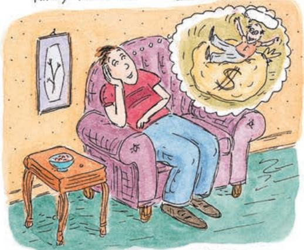
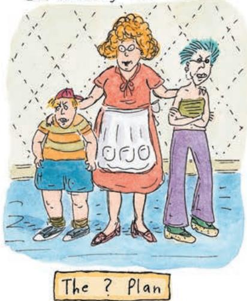
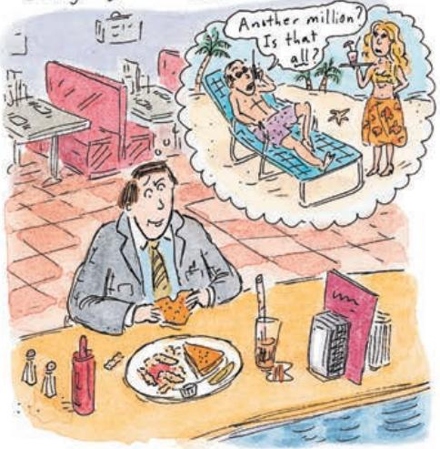
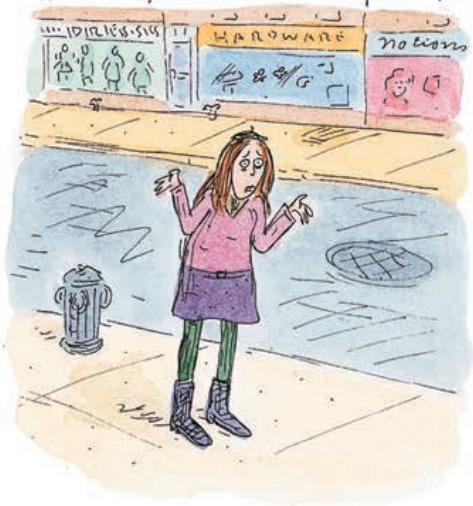

# UNUSUAL RETIREMENT PLANS

T'll take a thousand bucks, stick it in bonk "forget about it, " and in thinty years I'llbe pleasantly surprised.

Jackpot Account T'm not going to need one, because I'm going to be RICH,yessirree Bob.

## M.K.Plan

"My Kids" will take care of me. I'm virtually certain of that.

Who can plan, like, next week?Because an asteroid could smash into the Earth tomorrow, so what's the point?

  
Roz Chast / The New Yorker Collection/The Cartoon Bank.

Or take the fourth reason: It implies that you may have little choice anyway. Even if you wanted to consume more than your current income, you might be unable to do so because no bank will give you a loan.

If we want to allow for a direct effect of current income on consumption, what measure of current income should we use? A convenient measure is after-tax labor income, which we introduced when we defined human wealth. This leads to a consumption function of the form

$$
\begin{array}{c}C _ {t} = C (\text {Total wealth} _ {t}, Y _ {L t} - T _ {t})\\\left(\begin{array}{c c c}&+&,\end{array}\right. +\end{array}\left. \right)\tag{15.2}
$$
