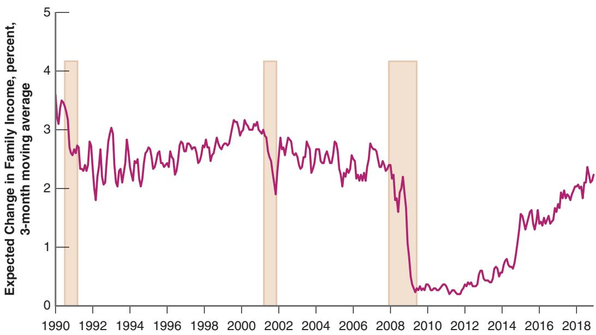
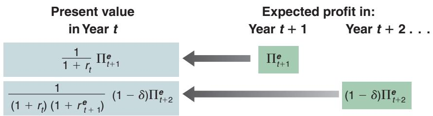
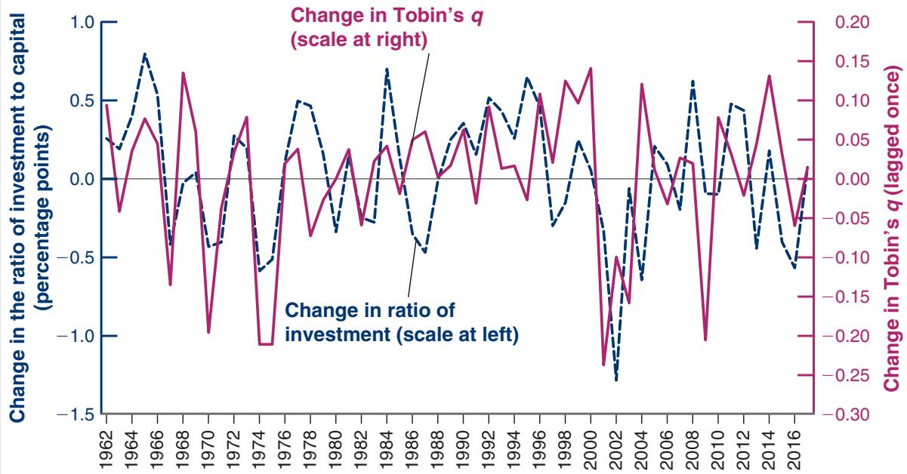
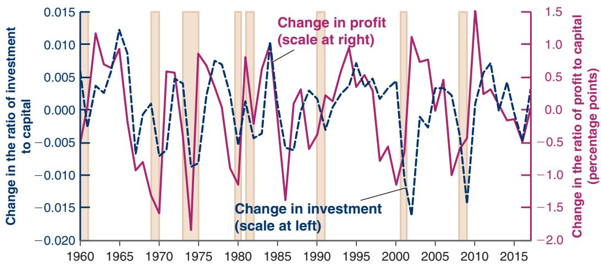
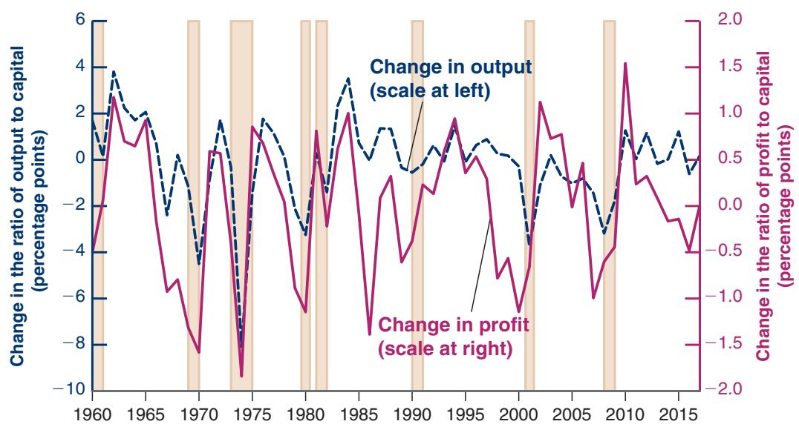
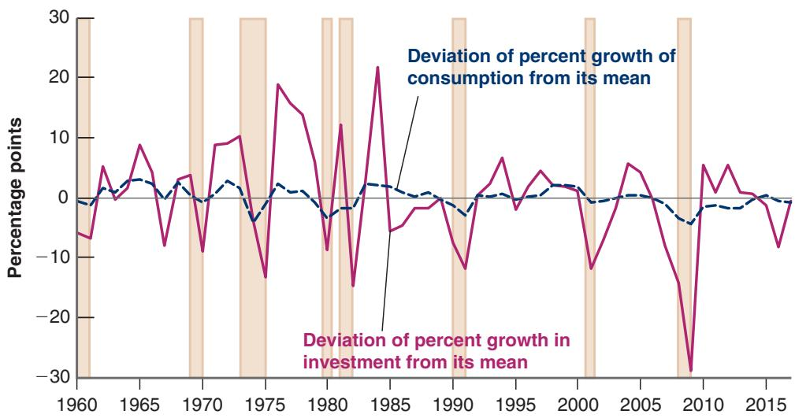

# Do People Save Enough for Retirement?

How carefully do people look forward when making consumption and saving decisions? One way to answer this question is to look at how much people save for retirement.

Table 1, taken from a study by James Poterba of MIT, Steven Venti of Dartmouth, and David Wise of Harvard, gives some basic numbers. They are based on a panel dataset called the Health and Retirement Study, a panel study run by the University of Michigan that surveys a representative sample of approximately 20,000 Americans over the age of 50 every two years. The table shows the mean level and the composition of (total) wealth for people aged between 65 and 69 years in 2008—so, most of them retired. It also distinguishes between people who reach that age as singles or as a couple; in this case the numbers refer to the wealth of the couple.

The first three components of wealth capture the various sources of retirement income. The first is the present value of Social Security benefits. The second is the value of the retirement plans provided by employers. And the third is the value of personal retirement plans. The last three components include the other assets held by consumers, such as bonds and stocks, and housing.

A mean wealth of \$1.1 million dollars for a couple is substantial. It gives an image of forward-looking individuals making careful saving decisions and retiring with enough wealth to enjoy a comfortable retirement.

We must be careful, however. The high average may hide important differences across individuals. Some individuals may save a lot, others little. Another study, by John Scholz, Ananth Seshadri, and Surachai Khitatrakun, from the University of Wisconsin, sheds light on this aspect, also using data from the Health and Retirement Study. The authors construct a target level of wealth for each household (i.e., the wealth level that each household should have if it wants to maintain a roughly constant level of consumption after retirement). The authors then compare the actual wealth level to the target level for each household.

The first conclusion of their study is similar to the conclusion reached by Poterba, Venti, and Wise: On average, people save enough for retirement. More specifically, the authors find that more than 80% of households have wealth above the target level. Put the other way around, only 20% of households have wealth below the target. But these numbers hide important differences across income levels.

Among those in the top half of the income distribution, more than 90% have wealth that exceeds the target often by a large amount. This suggests that these households plan to leave bequests and so save more than what is needed for retirement.

Among those in the bottom 20% of the income distribution, however, fewer than 70% have wealth above the target. For the 30% of households below the target, the difference between actual and target wealth is typically small. But the relatively large proportion of individuals with wealth below the target suggests that there are a number of individuals who, through bad planning or bad luck, do not save enough for retirement. For most of these individuals, nearly all their wealth comes from the present value of Social Security benefits (the first component of wealth in Table 1), and it is reasonable to think that the proportion of people with wealth below the target would be even larger if Social Security did not exist. This is indeed what the Social Security system was designed to do: to make sure that people have enough to live on when they retire. In that regard, it appears to be a success.1

<table><tr><td colspan="3">Table 1 Mean Wealth of People, Age 65–69, in 2008 (in thousands of 2008 dollars)</td></tr><tr><td></td><td>Married couples</td><td>Single-person household</td></tr><tr><td>Social Security pension</td><td>262</td><td>134</td></tr><tr><td>Employer-provided pension</td><td>129</td><td>63</td></tr><tr><td>Personal retirement assets</td><td>182</td><td>47</td></tr><tr><td>Other financial assets</td><td>173</td><td>83</td></tr><tr><td>Home equity</td><td>340</td><td>188</td></tr><tr><td>Other equity</td><td>69</td><td>18</td></tr><tr><td>Total</td><td>1,155</td><td>533</td></tr></table>

Source: James M. Poterba, Steven F. Venti, and David A. Wise, “The composition and drawdown of wealth in retirement,” Journal of Economic Perspectives, 25(4), pages 95–118, Fall 2011.

In words, consumption is an increasing function of total wealth and also an increasing function of current after-tax labor income. Total wealth is the sum of nonhuman wealth—financial wealth plus housing wealth—and human wealth—the present value of expected after-tax labor income.

How much does consumption depend on total wealth (and therefore on expectations of future income) and how much does it depend on current income? The evidence is that most consumers look forward in the spirit of the theory developed by Modigliani and Friedman. (See the Focus Box “Do People Save Enough for Retirement?”) But some consumers, especially those who have temporarily low income and poor access to credit, are likely to consume their current income, regardless of what they expect will happen to them in the future. A worker who becomes unemployed and has no financial wealth may have a hard time borrowing to maintain his level of consumption, even if he is fairly confident that he will soon find another job. Consumers who are richer and have easier access to credit are more likely to give more weight to the expected future and to try to maintain roughly constant consumption over time.

## Putting Things Together: Current Income, Expectations, and Consumption

Let’s go back to the importance of expectations in the determination of spending. Note first that, with consumption behavior described by equation (15.2), expectations affect consumption in two ways:

■ Expectations affect consumption directly through human wealth: To compute their human wealth, consumers must form their own expectations about future labor income, real interest rates, and taxes.

■ Expectations affect consumption indirectly through nonhuman wealth—stocks, bonds, and housing. Consumers do not need to do any computation here and can just take the value of these assets as given. As you saw in Chapter 14, the computation is in effect done for them by participants in financial markets. The price of their stocks, for example, itself depends on expectations of future dividends and interest rates.

This dependence of consumption on expectations has in turn two main implications for the relation between consumption and income:

■ Consumption is likely to respond less than one-for-one to fluctuations in current income. When deciding how much to consume, a consumer looks at more than her current income. If she concludes that a decrease in her income is permanent, she is likely to decrease consumption one-for-one with the decrease in income. But if she concludes that the decrease in her current income is transitory, she will adjust her consumption by less. In a recession, consumption adjusts less than one-for-one to decreases in income. This is because consumers know that recessions typically do not last for more than a few quarters and that the economy will eventually recover. The same is true in expansions. Faced with an unusually rapid increase in income, consumers are unlikely to increase consumption by as much as income. They are likely to assume that the boom is transitory and that things will return to normal.

■ Consumption may move even if current income does not change. The election of a charismatic president who articulates the vision of an exciting future may lead people to become more optimistic about the future in general, and about their own future income, leading them to increase consumption even if their current income does not change. Other events may have the opposite effect.

The effects of the Great Recession are particularly striking in this respect. Using data from a survey of consumers, Figure 15-1 shows the evolution of expectations about family income growth over the following year, for each year since 1990. Note

How expectations of higher output in the future affect consumption today:

Expected future output increases

1 Expected future labor income increases

1 Human wealth increases

1 Consumption increases

Expected future output increases

1 Expected future dividends increase

1 Stock prices increase

1 Nonhuman wealth increases

b 1 Consumption increases

Looking at the short run (Chapter 3), we assumed $C = c _ { 0 } + c _ { 1 } Y$ (ignoring taxes here). This implied that, when income increased, consumption increased less than proportionately with income (C>Y went down). This was appropriate because our focus was on fluctuations, on transitory movements in income.

1 Looking at the long run (Chapter 10), we assumed that S = sY, or equivalently $C = ( 1 - s ) Y$ . This implied that, when income increased, consumption increased proportionately with income (C>Y remained the same). This was appropriate because our focus was on permanent—longrun—movements in income.

## Figure 15-1

## Expected Change in Family Income since 1990

After falling sharply in 2008 and 2009, expectations of income growth remained low for a long time.

Source: Survey of Consumers, Table 14, University of Michigan, https://data.sca.isr.umich.edu. Shaded areas denote recessions.

Expected Change in Family Income, percent,

how relatively stable expectations remained until 2008, how sharply they dropped in 2008 and 2009, and how long they remained low after that. Only in 2014 did they start increasing.

The drop at the start of the crisis is not surprising. As consumers saw output falling, it was normal for them to expect a drop in income over the following year. But its magnitude is striking. Both previous recessions, in 1991 and in 2000, also had a drop in expected income growth, but it was much smaller and much less persistent. In 2008, consumers got very scared and remained scared for a long time. This led them to limit their consumption, and this in turn led to a slow recovery.

## 15-2 INVESTMENT

How do firms make investment decisions? In our first pass at the answer in the core (Chapter 5), we took investment to depend on the current interest rate and the current level of sales. We refined that answer in Chapter 6 by pointing out that what mattered was the real interest rate, not the nominal interest rate. It should now be clear that investment decisions, like consumption decisions, depend on more than current sales and the current real interest rate. They also depend very much on expectations of the future. We now explore how those expectations affect investment decisions.

Just like the basic theory of consumption, the basic theory of investment is straightforward. A firm deciding whether to invest—say, whether to buy a new machine—must make a simple comparison. It must first compute the present value of profits it can expect from having this additional machine. It must then compare the present value of profits to the cost of buying the machine. If the present value exceeds the cost, the firm should buy the machine— invest; if the present value is less than the cost, then the firm should not buy the machine—not invest. This, in a nutshell, is the theory of investment. Let’s look at it in more detail.

## Investment and Expectations of Profit

Let’s go through the steps a firm must take to determine whether to buy a new machine. (Although we refer to a machine, the same reasoning applies to the other components of investment—the building of a new factory, the renovation of an office complex, and so on.)

Computing the Present Value of Expected Profits

## Depreciation

To compute the present value of expected profits, the firm must first estimate how long the machine will last. Most machines are like cars. They can last nearly forever, but as time passes, they become more and more expensive to maintain and less and less reliable.

b Look at cars in Cuba.

Assume a machine loses its usefulness at rate d (the Greek lowercase letter delta) per year. A machine that is new this year is worth only $( 1 - \delta )$ machine next year, $( 1 - \delta ) ^ { 2 }$ machine in two years, and so on. The depreciation rate, d, measures how much usefulness the machine loses from one year to the next. What are reasonable values for d? This is a question that the statisticians in charge of measuring the US capital stock have had to answer. Based on their studies of depreciation of specific machines and buildings, US statisticians use numbers from 2.5% for office buildings to 15% for communication equipment to 55% for prepackaged software.

## The Present Value of Expected Profits

If the firm has a large number of machines, we can think of d as the proportion of machines that die every year (think of light bulbs, which work perfectly until they die). If the firm starts the year with K working machines and

does not buy new ones, it willb have $K ( 1 - \delta )$ machines left one year later, and so on.

The firm must then compute the present value of expected profits.

To capture the fact that it takes some time to put machines in place (and even more time to build a factory or an office building), let’s assume that a machine bought in year t becomes operational—and starts depreciating—only one year later, in year t + 1. Denote profit per machine in real terms by Π.

If the firm buys a machine in year t, the machine will generate its first profit in year $t + 1$ ; denote this expected profit by $\Pi _ { t + 1 } ^ { e }$ . The present value, in year t, of this expected profit in year $t + 1$ is given by

$$
\frac {1}{1 + r _ {t}} \Pi_ {t + 1} ^ {e}
$$

This is an uppercase Greek pi as opposed to the lowercase Greek pi, which we use b to denote inflation.

For simplicity, and to focus on the role of expectations as opposed to risk, let us assume again that the risk premium is equal to zero, so we do not have to carry it along in the formulas below.

This term is represented by the arrow pointing left in the upper line of Figure 15-2. Because we are measuring profit in real terms, we are using real interest rates to discount future real profits.

Denote expected profit per machine in year $t + 2$ by $\Pi _ { t + 2 } ^ { e }$ . Because of depreciation, only $( 1 - \delta )$ of the machine is left in year $t + 2$ , so the expected profit from the machine is equal to $( 1 - \delta ) \Pi _ { t + 2 } ^ { e }$ . The present value of this expected profit as of year t is equal to

$$
\frac {1}{(1 + r _ {t}) (1 + r _ {t + 1} ^ {e})} (1 - \delta) \Pi_ {t + 2} ^ {e}
$$

This computation is represented by the arrow pointing left in the lower line of Figure 15-2.

The same reasoning applies to expected profits in the following years. Putting the pieces together gives us the present value of expected profits from buying the machine in year t, which we shall call $V ( \Pi _ { t } ^ { e } )$

$$
V (\Pi_ {t} ^ {e}) = \frac {1}{1 + r _ {t}} \Pi_ {t + 1} ^ {e} + \frac {1}{(1 + r _ {t}) (1 + r _ {t + 1} ^ {e})} (1 - \delta) \Pi_ {t + 2} ^ {e} + \dots\tag{15.3}
$$

  
Figure 15-2

The expected present value is equal to the discounted value of expected profit next year, plus the discounted value of expected profit two years from now (taking into account the depreciation of the machine), and so on.

## The Investment Decision

The firm must now decide whether to buy the machine. This decision depends on the relation between the present value of expected profits and the price of the machine. To simplify notation, let’s assume the real price of a machine—that is, the price of the machine in terms of the basket of goods produced in the economy—equals 1. What the firm must then do is to compare the present value of profits to 1.

If the present value is less than 1, the firm should not buy the machine. If it did, it would be paying more for the machine than it expects to get back in profits later. If the present value exceeds 1, the firm has an incentive to buy the new machine.

Let’s now go from this one-firm, one-machine example to investment in the economy as a whole.

Let $I _ { t }$ denote aggregate investment.

Denote profit per machine or, more generally, profit per unit of capital (where capital includes machines, factories, office buildings, and so on) for the economy as a whole by $\Pi _ { t } .$

Denote the expected present value of profit per unit of capital by V1Πet2, as defined in equation (15.3).

Our discussion suggests an investment function of the form

$$
\begin{array}{c} I _ {t} = I \left[ V (\Pi_ {t} ^ {e}) \right] \\ \text {(+)} \end{array}\tag{15.4}
$$

In words: Investment depends positively on the expected present value of future profits (per unit of capital). The higher the expected profits, the higher the expected present value and the level of investment. The higher expected real interest rates, the lower the expected present value, and thus the lower the level of investment.

If the present value computation the firm has to make strikes you as quite similar to the present value computation we saw in Chapter 14 for the fundamental value of a stock, you are right. This relation was first explored by James Tobin, of Yale University, who argued that, for this reason, there should be a tight relation between investment and the value of the stock market. His argument and the evidence are presented in the Focus Box “Investment and the Stock Market.”c

## A Convenient Special Case

Before exploring further implications and extensions of equation (15.4), it is useful to go through a special case where the relation between investment, profit, and interest rates becomes simple.

Suppose firms expect both future profits (per unit of capital) and future interest rates to remain at the same level as today, so that

$$
\Pi_ {t + 1} ^ {e} = \Pi_ {t + 2} ^ {e} = \dots = \Pi_ {t}
$$

and

$$
r _ {t + 1} ^ {e} = r _ {t + 2} ^ {e} = \dots = r _ {t}
$$

Economists call such expectations—that the future will be like the present—static expectations. Under these two assumptions, equation (15.3) becomes (the derivation is given in the appendix to this chapter)

$$
V (\Pi_ {t} ^ {e}) = \frac {\Pi_ {t}}{r _ {t} + \delta}\tag{15.5}
$$

## Investment and the Stock Market

Suppose a firm has 100 machines and 100 shares outstanding— one share per machine. Suppose the price per share is \$2, and the purchase price of a machine is only \$1. Obviously the firm should invest—buy a new machine—and finance it by issuing a share. Each machine costs the firm \$1 to purchase, but stock market participants are willing to pay \$2 for a share corresponding to this machine when it is installed in the firm.

This is an example of the more general argument made by Tobin that there should be a tight relation between the stock market and investment. When deciding whether to invest, he argued firms might not need to go through the type of complicated computation you saw in the text. In effect, the stock price tells firms how much the stock market values each unit of capital already in place. The firm then has a simple problem: Compare the purchase price of an additional unit of capital to the price the stock market is willing to pay for it. If the stock market value exceeds the purchase price, the firm should buy the machine; otherwise, it should not.

Tobin then constructed a variable corresponding to the value of a unit of capital in place relative to its purchase price and looked at how closely it moved with investment. He used the symbol q to denote the variable, and the variable has become known as Tobin’s q. Its construction is as follows:

1. Take the total value of US corporations as assessed by financial markets. That is, compute the sum of their stock market value (the price of a share times the number of shares). Compute also the total value of their bonds outstanding (remember that firms finance themselves not only through stocks but also through bonds). Add together the value of stocks and bonds. Subtract the firms’ financial assets, the value of the cash, bank accounts, and any bonds the firms might hold.

2. Divide this total value by the value of the capital stock of US corporations at replacement cost (the price firms would have to pay to replace their machines, their plants, and so on).

The ratio gives us, in effect, the value of a unit of capital in place relative to its current purchase price. This ratio is Tobin’s q. Intuitively, the higher q, the higher the value of capital relative to its current purchase price, and the higher investment should be. (In the example at the start of the box, Tobin’s q is equal to 2, so the firm should definitely invest.)

How tight is the relation between Tobin’s q and investment? The answer is given in Figure 1, which plots two variables for each year since 1960 for the United States.

Measured on the left vertical axis is the change in the ratio of investment to capital for nonfinancial US corporations. Measured on the right vertical axis is the change of Tobin’s q. This variable is lagged once. For 2000, for example, the figure shows the change in the ratio of investment to capital for 2000, and the change in Tobin’s q for 1999—that is, a year earlier. The reason for presenting the two variables this way is that the strongest relation in the data appears to be between investment this year and

  
Figure 1

Tobin’s q versus the Ratio of Investment to Capital. Annual Rates of Change since 1962

Source: Flow of Funds, Table s5a. Numerator of q: Market value of equity + Debt + Loans – Financial Assets, nonfinancial US corporations. Denominator: Nonfinancial assets of nonfinancial US corporations.

Tobin’s q last year. Put another way, movements in investment this year are more closely associated with movements in the stock market last year rather than with movements in the stock market this year; a plausible explanation is that it takes time for firms to make investment decisions, build new factories, and so on.

The figure shows that there is a clear relation between Tobin’s q and investment. This is not because firms blindly follow the signals from the stock market, but because investment decisions and stock market prices depend very much on the same factors—expected future profits and expected future interest rates.

The present value of expected profits is simply the ratio of the profit rate—that is, profit per unit of capital—to the sum of the real interest rate and the depreciation rate. Replacing (15.5) in equation (15.4), investment is given by:

$$
I _ {t} = I \bigg (\frac {\Pi_ {t}}{r _ {t} + \delta} \bigg)\tag{15.6}
$$

Investment is a function of the ratio of the profit rate to the sum of the interest rate and the depreciation rate.

Such arrangements exist. For example, many firms lease cars and trucks from leasing companies.

The sum of the real interest rate and the depreciation rate is called the user cost or the rental cost of capital. To see why, suppose the firm, instead of buying the machine, rented it from a rental agency. How much would the rental agency have to charge per year? Even if the machine did not depreciate, the agency would have to ask for an interest charge equal to $r _ { t }$ times the price of the machine (we have assumed the price of a machine to be 1 in real terms, so $r _ { t }$ times 1 is just $r _ { t } )$ . The agency has to get at least as much from buying and renting out the machine as it would from, say, buying bonds. In addition, the rental agency would have to charge for depreciation, d, times the price of the machine, 1. Therefore:

$$
\text {Rental cost} = (r _ {t} + \delta)
$$

Even though firms typically do not rent the machines they use, $( r _ { t } + \delta )$ still captures the firms’ implicit cost—sometimes called the shadow cost—of using the machine for one year.

The investment function given by equation (15.6) then has a simple interpretation. Investment depends on the ratio of profit to the user cost. The higher the profit, the higher the level of investment. The higher the user cost, the lower the level of investment.

This relation between profit, the real interest rate, and investment hinges on a strong assumption: that the future is expected to be the same as the present. It is a useful relation to remember—and one that macroeconomists keep handy in their toolbox. It is time, however, to relax this assumption and return to the role of expectations in determining investment decisions.

## Current versus Expected Profit

The theory we have developed implies that investment should be forward looking and should depend primarily on expected future profits. (Under our assumption that it takes a year for investment to generate profits, current profit does not even appear in equation (15.3).)

One striking empirical fact about investment, however, is how strongly it moves with fluctuations in current profit. This relation is shown in Figure 15-3, which plots yearly changes in investment and profit since 1960 for the US economy. Profit is constructed as the ratio of the sum of after-tax profits plus interest payments paid by US nonfinancial corporations, divided by their capital stock. Investment is constructed as the ratio of investment by US nonfinancial corporations to their capital stock. Profit is lagged once. For 2000, for example, the figure shows the change in investment for 2000, and the change in profit

Investment and profit move very much together.

Source: Gross investment: Federa Reserve Board, Flow of Funds, series FA105013005.A. Capital stock: BEA Fixed Assets Tables, net stock of private nonresidential fixed assets, nonfinancial. Profit: BEA, NIPA Table 1.14, Net operating surplus minus taxes, minus transfers, minus net interest payments.

for 1999—that is, a year earlier. The reason for presenting the two variables this way is that the strongest relation in the data appears to be between investment in a given year and profit the year before—a lag plausibly due to the fact that it takes time for firms to decide on new investment projects in response to higher profit. The shaded areas in the figure represent years in which there was a recession—a decline in output for at least two consecutive quarters of the year.

There is a clear positive relation between changes in investment and changes in current profit in Figure 15-3. Is this relation inconsistent with the theory we have just developed, which holds that investment should be related to the present value of expected future profits rather than to current profit? Not necessarily. If firms expect future profits to move very much like current profit, then the present value of those future profits will move very much like current profit, and so will investment.

Economists who have looked at the question more closely have concluded, however, that the effect of current profit on investment is stronger than would be predicted by the theory developed so far. How they have gathered some of the evidence is described in the Focus Box “Profitability versus Cash Flow.” On the one hand, some firms with highly profitable investment projects but low current profits appear to be investing too little. On the other hand, some firms that have high current profit appear sometimes to invest in projects of doubtful profitability. In short, current profit appears to affect investment, even after controlling for the expected present value of profits.

Why does current profit play a role in the investment decision? The answer parallels our discussion of consumption in Section 15-1, where we discussed why consumption depends directly on current income. Some of the reasons we used to explain the behavior of consumers also apply to firms:

If its current profit is low, a firm that wants to buy new machines can get the funds it needs only by borrowing. But it may be reluctant to borrow. Although expected profits might look good, things may turn bad, leaving the firm unable to repay the debt. If current profit is high, however, the firm might be able to finance its investment just by retaining some of its earnings and without having to borrow. The bottom line is that higher current profit may lead the firm to invest more.

## Profitability versus Cash Flow

How much does investment depend on the expected present value of future profits, and how much does it depend on current profit? In other words: Which is more important for investment decisions: Profitability (the expected present discounted value of future profits) or cash flow (current profit, the net flow of cash the firm is receiving now)?

The difficulty in answering this question is that, most of the time, cash flow and profitability move together. Firms that do well typically have both large cash flows and good future prospects. Firms that suffer losses often have poor future prospects.

The best way to isolate the effects of cash flow and profitability on investment is to identify times or events when cash flow and profitability move in different directions, and then look at what happens to investment. This is the approach taken by Owen Lamont, an economist at Harvard University. An example will help you understand Lamont’s strategy.

Think of two firms, A and B. Both are involved in steel production. Firm B is also involved in oil exploration.

Suppose there is a sharp drop in the price of oil, leading to losses in oil exploration. This shock decreases firm B’s cash flow. If the losses in oil exploration are large enough to offset the profits from steel production, firm B might even show an overall loss.

As a result of the drop in the price of oil, will firm B invest less in its steel operation than firm A does? If only the profitability of steel production matters, there is no reason for firm B to invest less in its steel operation than firm A. But if current cash flow also matters, the fact that firm B has a lower cash flow may prevent it from investing as much as firm A in its steel operation. Looking at investment in the steel operations of the two firms can tell us how much investment depends on cash flow versus profitability.

This is the empirical strategy followed by Lamont. He focused on what happened in 1986 when the price of oil in the United States dropped by 50%, leading to large losses in oil-related activities. He then looked at whether firms that had substantial oil activities cut investment in their nonoil activities relatively more than other firms in the same nonoil activities. He concluded that they did. He found that for every \$1 decrease in cash flow as a result of the decrease in the price of oil, investment spending in nonoil activities was reduced by 10 to 20 cents. In short: Current cash flow matters.2

A firm that wants to invest might have difficulty borrowing. Potential lenders may not be convinced the project is as good as the firm says it is, and they may worry the firm will be unable to repay. If the firm has large current profits, it does not have to borrow and so does not need to convince potential lenders. It can proceed and invest as it pleases and is more likely to do so.

In summary, to fit the investment behavior we observe in practice, the investment equation is better specified as

$$
\begin{array}{c} I _ {t} = I \left[ V (\Pi_ {t} ^ {e}), \Pi_ {t} \right] \\ \text {(+ , +)} \end{array}\tag{15.7}
$$

In words: Investment depends both on the expected present value of future profits and on the current level of profit.

## Profit and Sales

Let’s take stock of where we are. We have argued that investment depends both on current profit and on expected profit or, more specifically, on current and expected profit per unit of capital. We need to take one last step. What determines profit per unit of capital? Primarily two factors: (1) the level of sales and (2) the existing capital stock. If sales are low relative to the capital stock, profits per unit of capital are likely to be low as well.

Let’s write this more formally. Ignore the distinction between sales and output, and let $Y _ { t }$ denote output (equivalently, sales). Let $K _ { t }$ denote the capital stock at time t. Our discussion suggests the following relation:

$$
\Pi_ {t} = \Pi \left(\frac {Y _ {t}}{K _ {t}}\right) (+)\tag{15.8}
$$

Profit per unit of capital is an increasing function of the ratio of sales to the capital stock. For a given capital stock, the higher the sales, the higher the profit per unit of capital. For given sales, the higher the capital stock, the lower the profit per unit of capital.

How well does this relation hold in practice? Figure 15-4 plots yearly changes in profit per unit of capital (measured on the right vertical axis) and changes in the ratio of output to capital (measured on the left vertical axis) for the United States since 1960. As in Figure 15-3, profit per unit of capital is defined as the sum of after-tax profits plus interest payments by US nonfinancial corporations, divided by their capital stock measured at replacement cost. The ratio of output to capital is constructed as the ratio of GDP to the aggregate capital stock.

Figure 15-4 shows that there is a strong relation between changes in profit per unit of capital and changes in the ratio of output to capital. Given that most of the year-to-year changes in the ratio of output to capital come from movements in output, and most of the year-to-year changes in profit per unit of capital come from movements in profit (capital moves slowly over time; the reason is that capital is large compared to yearly investment, so even large movements in investment lead to small changes in the capital stock), we can state the relation as follows: Profit decreases in recessions (shaded areas are periods of recession) and increases in expansions.

Why is this relation between output and profit relevant here? Because it implies a link between current output and expected future output, on the one hand, and investment, on the other. Current output affects current profit, expected future output affects expected future profit, and current and expected future profits affect investment. For example, anticipation of a sustained economic expansion leads firms to expect high profits, now

  
Figure 15-4  
Changes in Profit per Unit of Capital versus Changes in the Ratio of Output to Capital in the United States since 1960

Profit per unit of capital and the ratio of output to capital move largely together.

Source: Capital stock: BEA Fixed Assets Tables. Net stock of private nonresidential fixed assets, nonfinancial assets; Profit: BEA, NIPA Table 1.14, net operating surplus minus taxes minus transfers minus net interest and miscellaneous payments; Output: BEA, Gross value added of nonfinancial corporate business sector.

High expected output 1 High expected profit 1 High investment today.

and for some time in the future. These expectations in turn lead to higher investment. The effect of current and expected output on investment, together with the effect of investment on demand and output, will play a crucial role when we return to the determination of output in Chapter 16.b

## 15-3 THE VOLATILITY OF CONSUMPTION AND INVESTMENT

You will surely have noticed the similarities between our treatment of consumption and of investment behavior in Sections 15-1 and 15-2:

■ Whether consumers perceive current movements in income to be transitory or permanent affects their consumption decisions. The more transitory they expect a current increase in income to be, the less they will increase their consumption.

In the United States, retail sales are 24% higher on average in December than in other months. In France and Italy, sales are 60% higher in c

■ In the same way, whether firms perceive current movements in sales to be transitory or permanent affects their investment decisions. The more transitory they expect a current increase in sales to be, the less they revise their assessment of the present value of profits, and thus the less likely they are to buy new machines or build new factories. This is why, for example, the boom in sales that happens every year between Thanksgiving and Christmas does not lead to a boom in investment every December. Firms understand that this boom is transitory.

December.

But there are also important differences between consumption decisions and investment decisions:

■ The theory of consumption developed previously implies that when consumers perceive an increase in income as permanent, they respond with, at most, an equal increase in consumption. The permanent nature of the increase in income implies that they can afford to increase consumption now and in the future by the same amount as the increase in income. Increasing consumption more than one-for-one would require cuts in consumption later, and there is no reason for consumers to want to plan consumption this way.

■ Now consider the behavior of firms faced with an increase in sales they believe to be permanent. The present value of expected profits increases, leading to an increase in investment. In contrast to consumption, however, this does not imply that the increase in investment should be at most equal to the increase in sales. Rather, once a firm has decided that an increase in sales justifies the purchase of a new machine or the building of a new factory, it may want to proceed quickly, leading to a large but short-lived increase in investment spending. This increase in investment spending may exceed the increase in sales.

More concretely, take a firm that has a ratio of capital to its annual sales of, say, 3. An increase in sales of \$10 million this year, if expected to be permanent, requires the firm to spend \$30 million on additional capital if it wants to maintain the same ratio of capital to output. If the firm buys the additional capital right away, the increase in investment spending this year will equal three times the increase in sales. Once the capital stock has adjusted, the firm will return to its normal pattern of investment. This example is extreme because firms do not adjust their capital stock right away. But even if they adjust their capital stock over a few years, the increase in investment might still exceed the increase in sales for a while.

We can tell the same story in terms of equation (15.8). Because we make no distinction here between output and sales, the initial increase in sales leads to an equal increase in output, Y, so that Y>K—the ratio of the firm’s output to its existing capital stock—also increases. The result is higher profit, which leads the firm to undertake more investment. Over time, the higher level of investment leads to a higher capital stock, K, so that Y>K decreases back to normal. Profit per unit of capital returns to normal and so does investment. Thus, in response to a permanent increase in sales, investment may increase a lot initially and then return to normal over time.

These differences suggest that investment should be more volatile than consumption. How much more? The answer is given in Figure 15-5, which plots yearly rates of change in US consumption and investment since 1960. The shaded areas are years during which the US economy was in recession. To make the figure easier to interpret, both rates of change are plotted as deviations from the average rate of change over the period, so that they are, on average, equal to zero.

Figure 15-5 yields three conclusions:

■ Consumption and investment usually move together. Recessions, for example, are typically associated with decreases in both investment and consumption. Given our discussion, which has emphasized that consumption and investment depend largely on the same determinants, this should not come as a surprise.

■ Investment is much more volatile than consumption. Relative movements in investment range from -29% to +24%, whereas relative movements in consumption range only from -5% to +3%.

■ Because, however, the level of investment is much smaller than the level of consumption (recall that investment accounts for about 15% of GDP, whereas consumption accounts for close to 70%), changes in investment from one year to the next end up being of the same overall magnitude as changes in consumption. In other words, both components contribute roughly equally to fluctuations in output over time.

  
Figure 15-5  
Rates of Change in Consumption and Investment in the United States since 1960  
Relative movements in investment are much larger than relative movements in consumption.  
Source: FRED, series PCECC96, GPDI

## SUMMARY

Consumption depends on both wealth and current income. Wealth is the sum of nonhuman wealth (financial wealth and housing wealth) and human wealth (the present value of expected after-tax labor income).

The response of consumption to changes in income depends on whether consumers perceive these changes as transitory or permanent.

Consumption is likely to respond less than one-for-one to movements in income. Consumption might move even if current income does not change.

Investment depends on both current profit and the present value of expected future profits.

Under the simplifying assumption that firms expect profits and interest rates to be the same in the future as they are today, we can think of investment as depending on the ratio of profit to the user cost of capital, where the user cost is the sum of the real interest rate and the depreciation rate.

Movements in profit are closely related to movements in output. Hence, we can think of investment as depending indirectly on current and expected future output movements. Firms that anticipate a long output expansion, and thus a long sequence of high profits, will invest. Movements in output that are not expected to last will have a small effect on investment.

Investment is much more volatile than consumption. But because investment accounts only for 15% of GDP and consumption accounts for 70%, movements in investment and consumption are of roughly equal importance in accounting for movements in aggregate output.
