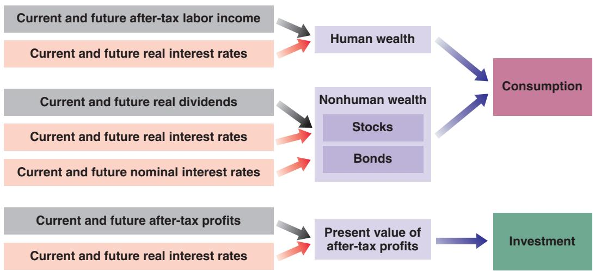
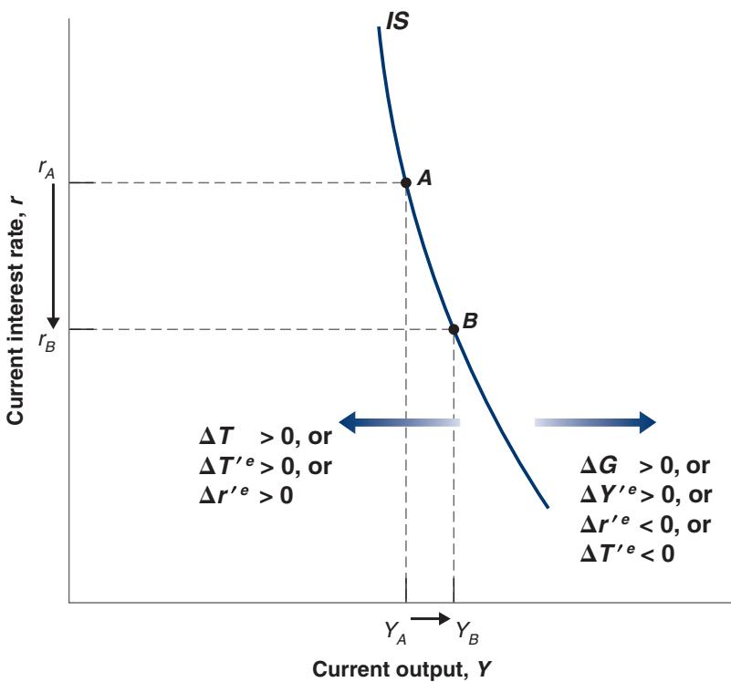
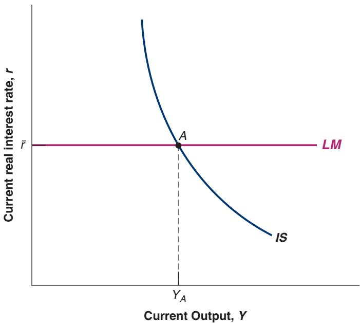
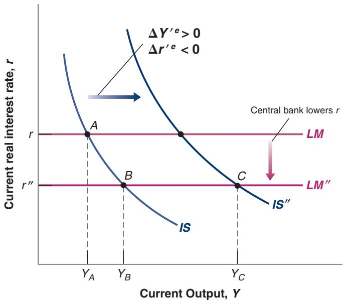
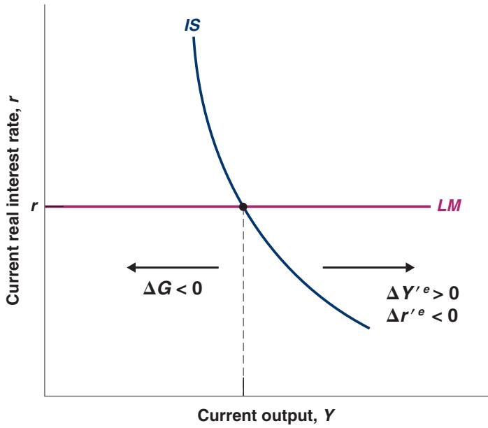

# Expectations, Output, and Policy

n Chapter 14, we saw how expectations affected asset prices, from bonds to stocks to houses. In Chapter 15, we saw how expectations affected consumption decisions and investment decisions. In this chapter we put the pieces together and take another look at the effects of monetary and fiscal policy.

Section 16-1 draws the major implication of what we have learned, namely that expectations of both future output and future interest rates affect current spending, and therefore current output.

Section 16-2 looks at monetary policy. It shows that the effects of monetary policy depend crucially on how changes in the policy rate today lead people and firms to change their expectations of future interest rates and future income and, by implication, to change their spending decisions.

Section 16-3 turns to fiscal policy. It shows how, in contrast to the simple model you saw in the core, a fiscal contraction can sometimes lead to an increase in output, even in the short run. Again, how expectations respond to policy is at the center of the story.

If you remember one basic message from this chapter, it should be: The effects of monetary and fiscal policy depend very much on how they affect expectations.

## 16-1 EXPECTATIONS AND DECISIONS:TAKING STOCK

Let’s start by reviewing what we have learned, and then discuss how we should modify the characterization of goods and financial markets—the IS-LM model—developed in the core.

## Expectations, Consumption, and Investment Decisions

The theme of Chapter 15 was that both consumption and investment decisions depend very much on expectations of future income and interest rates. The channels through which expectations affect consumption and investment spending are summarized in Figure 16-1.

Note the many channels through which expected future variables affect current decisions, both directly and through asset prices:

■ An increase in current and expected future after-tax real labor income or a decrease in current and expected future real interest rates increase human wealth (the expected present discounted value of after-tax real labor income), which in turn leads to an increase in consumption.

Note that in the case of bonds, it is nominal rather than real interest rates that matter because bonds are claims to future dollars rather than to future goods.

■ An increase in current and expected future real dividends or a decrease in current and expected future real interest rates increases stock prices, which leads to an increase in nonhuman wealth and, in turn, an increase in consumption.

■ A decrease in current and expected future nominal interest rates leads to an increase in bond prices, which leads to an increase in nonhuman wealth and, in turn, an increase in consumption.

■ An increase in current and expected future real after-tax profits or a decrease in current and expected future real interest rates increases the present value of real aftertax profits, which leads, in turn, to an increase in investment.

## Expectations and the IS Relation

A model that gave a detailed treatment of consumption and investment along the lines suggested in Figure 16-1 would be complicated. It can be done, and indeed it is done in the large models that macroeconomists build to understand the economy and analyze

## Figure 16-1

## Expectations and Private Spending: The Channels

Expectations affect consumption and investment decisions both directly and through asset prices.

Current and future real interest rates

Current and future real dividends

Current and future nominal interest rates

Current and future after-tax profits

Current and future real interest rates

policy; but this is not the place for such complications. We want to capture the essence of what you have learned so far, how consumption and investment depend on expectations of the future, without getting lost in the details.

To do so, let’s make a major simplification. Let’s reduce the present and the future to only two periods: (1) a current period, which you can think of as the current year, and (2) a future period, which you can think of as all future years lumped together. This way we do not have to keep track of expectations about each future year.

Having made this assumption, the question becomes: How should we write the IS relation for the current period? In Chapter 6 (equation (6.5)), we wrote the following equation for the IS relation:

This way of dividing time between “today” and “later” is the way many of us organize our own lives. Think of “things to do today” versus “things that can wait.” You can also think of the future period as the combination of the “medium run” and the “long run” we saw in the core.

$$
Y = C (Y - T) + I (Y, r + x) + G
$$

We assumed that consumption depended only on current income, and that investment depended only on current output and the current borrowing rate, equal to the policy rate plus a risk premium. We now want to modify this to take into account how expectations affect both consumption and investment. We proceed in two steps:

First, we rewrite the equation in more compact form without changing its content. For that purpose, let’s define aggregate private spending as the sum of consumption and investment spending.

The reason for doing so is to group together the two components of demand, C and I, which both depend on b expectations.

$$
A (Y, T, r, x) \equiv C (Y - T) + I (Y, r + x)
$$

where A stands for aggregate private spending, or simply, private spending. With this notation we can rewrite the IS relation as

$$
\begin{array}{c} Y = A (Y, T, r, x) + G \\ \quad (+, -, -, -) \end{array}\tag{16.1}
$$

The properties of aggregate private spending, A, follow from the properties of consumption and investment that we derived in previous chapters: Aggregate private spending is

■ An increasing function of income Y: Higher income (equivalently, output) increases both consumption and investment.

■ A decreasing function of taxes T: Higher taxes decrease consumption.

■ A decreasing function of the real policy rate r: A higher real policy rate decreases investment.

■ A decreasing function of the risk premium x: A higher risk premium increases the borrowing rate and decreases investment.

The first step only simplified notation. The second step is to modify equation (16.1) to take into account the role of expectations. Because the focus in this chapter is on expectations rather than on the risk premium, I shall assume that it is constant, and so to save on notation, I shall ignore it in the model. With the focus on expectations, the natural extension of equation (16.1) is to allow spending to depend not only on current variables but also on their expected values in the future.

Introducing uncertainty and risk formally in the model would make it too heavy. I give an informal discussion in a Focus Box at the end of the chapter called “Uncertaintyb and Fluctuations.”

$$
\begin{array}{c} Y = A (Y, T, r, Y ^ {\prime e}, T ^ {\prime e}, r ^ {\prime e}) + G \\ (+, -, -, +, -, -) \end{array}\tag{16.2}
$$

Primes denote future values and the superscript e denotes an expectation, so $Y ^ { \prime e } , T ^ { \prime e }$ and $\boldsymbol { r ^ { \prime } { } ^ { e } }$ denote future expected income, future expected taxes, and the future expected real interest rate, respectively. The notation is a bit heavy, but what it captures is straightforward.

Notation: Primes stand for values of the variables in the future period. The superscript e stands for expected.

If Y or $Y ^ { \prime e }$ increases 1 A c increases.

If T or $T ^ { \prime \dag }$ increases 1 A c

If r or $r ^ { \prime } { } ^ { e }$ increases 1 A c decreases.

Suppose you have a 30-year loan and the 1-year interest rate goes down from 5% to 2%. All future 1-year rates remain the same. By how much will the 30-year interest rate come down? (Answer: from 5% to 4.9%. To see why, extend equation (14.11) to the 30-year yield, which is the average of 30 one-year rates.)

rates.) c

## Figure 16-2

## The New IS Curve

Given expectations, a de-crease in the real policy rate leads to a small increase in output. The IS curve is steeply downward sloping. Increases in government spending or in expected future output shift the IS curve to the right. Increases in taxes, in expected future taxes, or in the expected future real policy rate shift the IS curve to the left.

Increases in either current or expected future income increase private spending.

■ Increases in either current or expected future taxes decrease private spending.

■ Increases in either the current or expected future real policy rate decrease private spending.

With the goods market equilibrium now given by equation (16.2), Figure 16-2 shows the new IS curve for the current period. As usual, to draw the curve we take all variables other than current output, Y, and the current real policy rate, r, as given. Thus, the IS curve is drawn for given values of current and future expected taxes, T and $T ^ { \prime e }$ , for given values of expected future output, $Y ^ { \prime e }$ , and for given values of the expected future real policy rate, $r ^ { \prime e } .$

The new IS curve, based on equation (16.2), is still downward sloping, for the same reason it was in Chapter 6: A decrease in the current policy rate leads to an increase in private spending. This increase in private spending leads, through a multiplier effect, to an increase in output. We can say more, however. The new IS curve is much steeper than the IS curve we drew in Chapter 6. Put another way, everything else the same, a large decrease in the current policy rate is likely to have only a small effect on equilibrium output.

To see why the effect is small, take point A on the IS curve in Figure 16-2 and consider the effects of a decrease in the real policy rate, from $r _ { \mathrm { A } }$ to $r _ { \mathrm { B } } .$ . The effect of this decrease on output depends on the strength of the effects of the real policy rate on (1) spending given income and (2) the size of the multiplier.

Let’s examine each one:

A decrease in the current real policy rate, given unchanged expectations of the future real policy rate, does not have much effect on private spending. We saw why in Chapters 14 and 15: A change in only the current real interest rate does not lead to large changes in present values and therefore does not lead to large changes in spending. For example, firms are not likely to change their investment plans very much in response to a decrease in the current real interest rate if they do not expect future real interest rates to be lower as well.

■ The multiplier is likely to be small. Recall that the size of the multiplier depends on the size of the effect that a change in current income (output) has on spending. But a change in current income, given unchanged expectations of future income, is unlikely to have a large effect on spending. The reason: Changes in income that are not expected to last have only a limited effect on either consumption or investment. Consumers who expect their income to be higher for only a year will increase consumption, but by much less than the increase in their income. Firms that expect sales to be higher for only a year are unlikely to change their investment plans much, if at all.

Suppose the firm where you work decides to give all employees a one-time bonus of \$10,000. You do not expect it to happen again. By how much will you increase your consumption this year? (If you need to, look at the discussion of consumption behavior in Chapter 15.)

Putting things together, a large decrease in the current real policy rate—from $r _ { A }$ to $r _ { B }$ in Figure 16-2—leads to only a small increase in output, from $Y _ { A }$ to $Y _ { B } .$ . Put another way: The IS curve, which goes through points A and B, is steeply downward sloping.

Let’s look at the effects of the other variables in equation (16.2). A change in any variable in equation (16.2) other than Y and r shifts the IS curve:

■ Changes in current taxes (T) or current government spending (G) shift the IS curve An increase in current government spending increases spending at a given interest rate, shifting the IS curve to the right; an increase in taxes shifts the IS curve to the left. These shifts are represented in Figure 16-2.

■ Changes in expected future variables $\left( Y ^ { \prime e } , T ^ { \prime e } , r ^ { \prime e } \right)$ also shift the IS curve

An increase in expected future output, Y′e, shifts the IS curve to the right. Higher expected future income leads consumers to feel wealthier and spend more; higher expected future output implies higher expected profits, leading firms to invest more. Higher spending by consumers and firms leads, through the multiplier effect, to higher output. By a similar argument, an increase in expected future taxes leads consumers to decrease their current spending and shifts the IS curve to the left. And an increase in the expected future real policy rate decreases current spending, also leading to a decrease in output and shifting the IS curve to the left. These shifts are also represented in Figure 16-2.

We are now ready to look at the effects of monetary and fiscal policy. This is where the hard work of the two previous chapters will pay off.

## 16-2 MONETARY POLICY, EXPECTATIONS, AND OUTPUT

The interest rate that the Fed affects directly is the current real interest rate, r. So, the LM curve is still given by a horizontal line at the real policy rate chosen by the Fed, called r. The IS and LM relations are thus given by:

$$
I S: \quad Y = A (Y, T, r, Y ^ {\prime e}, T ^ {\prime e}, r ^ {\prime e}) + G\tag{16.3}
$$

$$
L M: \quad r = \bar {r}\tag{16.4}
$$

The corresponding IS and LM curves are drawn in Figure 16-3. Equilibrium in goods and financial markets implies that the economy is at point A.

## Monetary Policy Revisited

Now suppose the economy is in recession and the Fed decides to lower the real policy rate.

Assume first that this expansionary monetary policy does not change expectations of either the future real policy rate or future output. In Figure 16-4, the LM curve shifts down, from LM to LM–. (Because I have already used primes to denote future values of the variables,

## Figure 16-3

## The New IS-LM

The IS curve is steeply downward sloping. Other things being equal, a change in the current interest rate has a small effect on output. Given the current real interest set by the central bank, r, the equilibrium is at point A.

I have to use double primes to denote shifts in curves in this chapter.) The equilibrium moves from point A to point B, with higher output and a lower real interest rate. The steep IS curve, however, implies that the decrease in the current interest rate has only a small effect on output. Changes in the current interest rate, if not accompanied by changes in expectations, have only a small effect on spending and in turn a small effect on output.

Is it reasonable, however, to assume that expectations are unaffected by an expansionary monetary policy? Isn’t it likely that, as the Fed lowers the current real policy rate, financial markets now anticipate lower real interest rates in the future as well, along with higher future output stimulated by the lower future interest rates? What happens if they do anticipate these changes?

At a given current real policy rate, prospects of a lower future real policy rate and of higher future output both increase spending and output, shifting the IS curve to the right, from IS to IS0. The new equilibrium is given by point C. Thus, although the direct effect of the monetary expansion on output is limited, the full effect, once changes in expectations are taken into account, is much larger.

Figure 16-4

The Effects of an Expansionary Monetary Policy

The effects of monetary policy on output depend very much on whether and how monetary policy affects expectations.

## Rational Expectations

The importance of expectations is an old theme in macroeconomics. But until the early 1970s, macroeconomists thought of expectations in one of two ways:

One was as animal spirits (from an expression Keynes introduced in the General Theory to refer to movements in investment that could not be explained by movements in current variables). In other words, shifts in expectations were considered important but were left largely unexplained.

The other was as the result of simple, backwardlooking rules. For example, people were assumed to have static expectations; that is, to expect the future to be like the present (we used this assumption when discussing the Phillips curve in Chapter 8 and when exploring investment decisions in Chapter 15). Or people were assumed to have adaptive expectations. If, for example, their forecast of a given variable in a given period turned out to be too low, people were assumed to “adapt” by raising their expectation for the value of the variable for the following period; so seeing an inflation rate higher than they had expected led people to revise upward their forecast of inflation in the future.

In the early 1970s, a group of macroeconomists led by Robert Lucas (at the University of Chicago) and Thomas Sargent (at the University of Minnesota) argued that these assumptions do not do justice to the way people form expectations. (Lucas received the Nobel Prize in 1995; Sargent received the Nobel Prize in 2011.) They argued that, in thinking about the effects of alternative policies, economists should assume that people have rational expectations—that they look into the future and do the best job they can in predicting it. This is not the same as assuming that people know the future, but rather that they use the information they have in the best possible way.

Using the popular macroeconomic models of the time, Lucas and Sargent showed that replacing traditional assumptions about expectation formation with the assumption of rational expectations could fundamentally alter the results. For example, Lucas challenged the notion that disinflation, achieved through tight monetary policy, necessarily led to an increase in unemployment for some time. Under rational expectations, he argued, a credible disinflation policy might be able to decrease inflation without any increase in unemployment. More generally, the research of Lucas and Sargent showed the need for a rethinking of macroeconomic models under the assumption of rational expectations, and this is what happened over the next two decades.

Most macroeconomists today use rational expectations as a working assumption in their models and analyses of policy. It is not because they believe that people truly have rational expectations. Surely there are times when adaptive expectations may be a better description of reality; there are also times when people, firms, or financial market participants lose sight of reality and become too optimistic or too pessimistic. (Recall our discussion of bubbles and fads in Chapter 14.) But, when thinking about the likely effects of a specific economic policy, the best assumption to make is that financial markets, people, and firms will do the best they can to work out the implications of that policy: Designing a policy on the assumption that people will make systematic mistakes in responding to it seems unwise.

At the same time, it is clear that the assumption of rational expectations overstates the ability of people and firms to think about the future and that we have to go beyond this assumption. Indeed, much current research focuses on how to take into account some of the behavioral limits and biases that determine how people form expectations. A workable and reliable alternative does not yet exist, however, and for the moment, rational expectations remain the default assumption of most macroeconomic models.

You have just learned an important lesson. The effects of monetary policy—the effects of any type of macroeconomic policy, for that matter—depend crucially on its effect on expectations:

■ If a monetary expansion leads financial investors, firms, and consumers to revise their expectations of future interest rates and output, then the effects of the monetary expansion on output may be large.

■ But if expectations remain unchanged, the effects of the monetary expansion on output will be limited.

We can link this to the discussion in Chapter 14 about the effects of changes in monetary policy on the stock market. Many of the same issues were present there. If, when the change in monetary policy takes place, it comes as no surprise to investors, firms, and consumers, then expectations will not change; the stock market will react only a little, if at all,

This is why central banks think of their task as not only to adjust the policy rate but also to “manage expectations,” to lead to predictable effects of changes in the policy rate on the economy. Giving an indication to financial markets about future policy rates is known as “forward guidance” by the central bank. More on this in Chapters 21 and 23.

and thus demand and output will change only a little, if at all. But if the change comes as a surprise and is expected to last, expectations of future output will go up, expectations of future interest rates will come down, the stock market will boom, and output will increase.

At this stage, you may have become skeptical that macroeconomists can say much about the effects of policy or the effects of other shocks. If the effects depend so much on what happens to expectations, can macroeconomists have any hope of predicting what will happen? The answer is yes.

Saying that the effect of a particular policy depends on its effect on expectations is not the same as saying that anything can happen. Expectations are not arbitrary. The manager of a mutual fund who must decide whether to invest in stocks or bonds, the firm thinking about whether to build a new plant, the consumer thinking about how much she should save for retirement, all give a lot of thought to what might happen in the future. We can think of each of them as forming expectations about the future by assessing the likely course of future expected policy and then working out the implications for future activity. If they do not do it themselves (surely most of us do not spend our time solving macroeconomic models before making decisions), they do so indirectly by watching TV, reading newspapers, or finding public information on the internet, all of which in turn rely on the forecasts of public and private forecasters. Economists refer to expectations formed in this forward-looking manner as rational expectations. The introduction of the assumption of rational expectations, starting in the 1970s, has largely shaped the way macroeconomists think about policy. It is discussed further in the Focus Box “Rational Expectations.”

We could go back and think about the implications of rational expectations in the case of the monetary expansion we have just studied. It will be more fun to do this in the context of a change in fiscal policy, and this is what we now turn to.

## 16-3 DEFICIT REDUCTION, EXPECTATIONS, AND OUTPUT

We discussed the short- and medium-run effects of changes in fiscal policy in Section 9–3. We discussed the long-run effects of changes in fiscal policy in Section 11–2.

Recall the conclusions we reached in the core about the effects of a budget deficit reduction:

■ In the short run, a reduction in the budget deficit, unless it is offset by a monetary expansion, leads to lower private spending and to a contraction in output.

■ In the medium run, a lower budget deficit implies higher saving and higher investment.

■ In the long run, higher investment translates into higher capital and thus higher output.

It is the adverse short-run effect that—in addition to the unpopularity of increases in taxes or reductions in government programs—often deters governments from tackling their budget deficits. Why take the risk of a recession now for benefits that will accrue only in the future?

A number of economists have argued, however, that under some conditions a deficit reduction might actually increase output even in the short run. Their argument is that, if people take into account the future beneficial effects of deficit reduction, their expectations about the future might improve enough to lead to an increase—rather than a decrease—in current spending, thereby increasing current output. This section explores their argument. The Focus Box “Can a Budget Deficit Reduction Lead to an Output Expansion? Ireland in the 1980s” reviews some of the supporting evidence.

Assume the economy is described by equation (16.3) for the IS relation and equation (16.4) for the LM relation. Now suppose the government announces a program to reduce the deficit, through decreases in both current spending, G, and future spending, G′e. What will happen to output in the current period?

## The Role of Expectations about the Future

Suppose first that expectations of future output 1Y′e2 and of the future interest rate 1r′e2 do not change. Then we get the standard answer: The decrease in government spending in the current period leads to a shift of the IS curve to the left, and so to a decrease in output.

The crucial question therefore is what happens to expectations. To answer, let us go back to what we learned in the core about the effects of a deficit reduction in the medium run and the long run.

■ In the medium run, a deficit reduction has no effect on output. It leads, however, to a lower interest rate and to higher investment. These were two of the main lessons of Chapter 9.

Let’s review the logic behind each.

Recall that, when we look at the medium run, we ignore the effects of capital accumulation on output. So in the medium run, the natural level of output depends on the level of productivity (taken as given) and on the natural level of employment. The natural level of employment depends in turn on the natural rate of unemployment. If spending by the government on goods and services does not affect the natural rate of unemployment—and there is no obvious reason why it should—then changes in spending will not affect the natural level of output. Therefore, a deficit reduction has no effect on the level of output in the medium run.

Now recall that output must be equal to spending, which is the sum of public and private spending. Given that output is unchanged and that public spending is lower, private spending must therefore be higher. To achieve higher private spending requires a lower equilibrium interest rate: The lower interest rate leads to higher investment and thus to higher private spending, which offsets the decrease in public spending and output is unchanged.

■ In the long run—that is, taking into account the effects of capital accumulation on output—higher investment leads to a higher capital stock and therefore a higher level of output.

This was the main lesson of Chapter 11. The higher the proportion of output saved (or invested; investment and saving must be equal for the goods market to be in equilibrium in a closed economy), the higher the capital stock, and thus the higher the level of output in the long run.

We can think of our future period as including both the medium and the long run. If people, firms, and financial market participants have rational expectations, then, in response to the announcement of a deficit reduction, they will expect these developments to take place in the future. Thus, they will revise their expectation of future output 1Y′e2 up, and their expectation of the future interest rate 1r′e2 down.

## Back to the Current Period

We can now return to the question of what happens this period in response to the announcement and start of the deficit reduction program. Figure 16-5 draws the IS and LM curves for the current period. In response to the announcement of the deficit reduction, there are now three factors shifting the IS curve:

■ Current government spending (G) goes down, leading the IS curve to shift to the left. At a given interest rate (r), the decrease in government spending leads to a decrease

In the medium run: Output, Y, does not change; investment,b I, is higher.

In the long run:b I increases 1 K increases 1 Y increases.

The way this is likely to happen in practice: Forecasts by economists will show that these lower deficits are likely to lead to higher output and lower interest rates in the future. In response to these forecasts, long-term interest rates will decrease and the stock market will increase. People and firms, reading these forecasts and seeing the increase in bond and stock prices, will revise their spending plans and increase spending.

Figure 16-5

The Effects of a Deficit Reduction on Current Output

When account is taken of its effect on expectations, the decrease in government spending need not lead to a decrease in output.

in total spending and so a decrease in output. This is the standard effect of a reduction in government spending, and the only one taken into account in the basic IS-LM model.

■ Expected future output $( Y ^ { \prime e } )$ goes up, leading the IS curve to shift to the right. At a given interest rate, the increase in expected future output leads to an increase in private spending, increasing output.

■ The expected future interest rate $( r ^ { \prime e } )$ goes down, leading the IS curve to shift to the right. At a given current interest rate, a decrease in the future interest rate stimulates spending and increases output.

What is the net effect of these three shifts in the IS curve? Can the effect of expectations on consumption and investment spending offset the decrease in government spending? Without much more information about the exact form of the IS relation and about the details of the deficit reduction program, we cannot tell which shifts will dominate and whether output will go up or down. But our analysis suggests that both cases are possible, that output may go up in response to the deficit reduction. And it gives us a few hints as to when this might happen:

■ Timing matters. Note that the smaller the decrease in current government spending (G), the smaller the adverse effect on spending today. Note also that the larger the decrease in expected future government spending $\left( G ^ { \prime e } \right)$ , the larger the effect on expected future output and interest rates, thus the larger the favorable effect on spending today. This suggests that credibly backloading the deficit reduction program toward the future, with small cuts today and larger cuts in the future, is more likely to lead to an increase in output. On the other hand, backloading raises an obvious issue. Announcing the need for painful cuts in spending, and then leaving them to the future, is likely to decrease the program’s credibility—the perceived probability that the government will do what it has promised when the time comes to do it. The government must play a delicate balancing act: enough cuts in the current period to show a commitment to deficit reduction, enough cuts left to the future to reduce the adverse effects on the economy in the short run.
