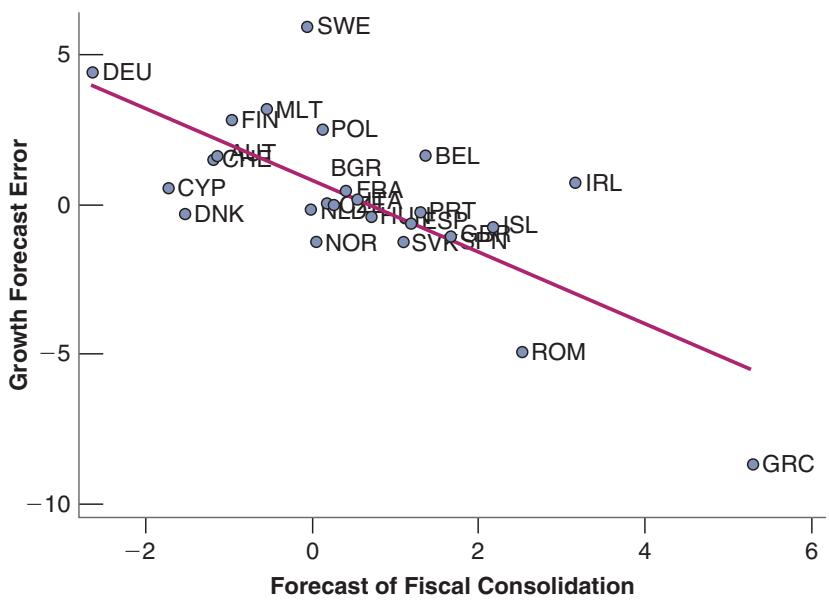
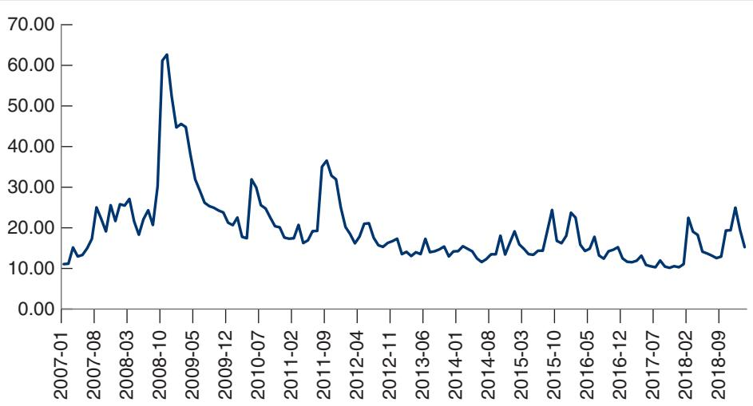

# Can a Budget Deficit Reduction Lead to an Output Expansion? Ireland in the 1980s

Ireland went through two major deficit reduction programs in the 1980s.

1. The first program was started in 1982. In 1981, the budget deficit had reached a high 13% of GDP. Government debt, the result of the accumulation of current and past deficits, was 77% of GDP, also a high level. The Irish government clearly had to regain control of its finances. Over the next three years, it embarked on a program of deficit reduction, based mostly on tax increases. This was an ambitious program. Had output continued to grow at its normal growth rate, the program would have reduced the deficit by 5% of GDP.

The results, however, were dismal. As shown in line 2 of Table 1, output growth was low in 1982 and negative in 1983. Low output growth was associated with a major increase in unemployment, from 9.5% in 1981 to 15% in 1984 (line 3). Because of low output growth, tax revenues—which depend on the level of economic activity—were lower than anticipated. The actual deficit reduction from 1981 to 1984, shown in line 1, was only 3.5% of GDP. And the result of continuing high deficits and low GDP growth was a further increase in the ratio of debt to GDP to 97% in 1984.

2. A second attempt to reduce budget deficits was made starting in February 1987. Things were still very bad. The 1986 deficit was 10.7% of GDP; debt stood at 116% of GDP, a record high in Europe at the time. The new program of deficit reduction was different from the first: It focused more on reducing the role of government and cutting government spending than on increasing taxes. Tax increases were achieved through a tax reform that widened the tax base—increasing the number of households paying taxes—rather than through an increase in the marginal tax rate. The program was again ambitious. Had output grown at its normal rate, the reduction in the deficit would have been 6.4% of GDP.

The results of the second program could not have been more different from the results of the first. The years 1987 to 1989 were years of strong growth, with average

GDP growth exceeding 5%. The unemployment rate was reduced by almost 2%. Because of strong output growth, tax revenues were higher than anticipated, and the deficit was reduced by nearly 9% of GDP.

A number of economists have argued that the striking difference between the results of the two programs can be traced to the different reaction of expectations in each case. The first program, they argue, focused on tax increases and did not change what many people saw as too large a role of government in the economy. The second program, with its focus on cuts in spending and on tax reform, had a much more positive impact on expectations, and so a positive impact on spending and output.

Are these economists right? One variable, the household saving rate—defined as disposable income minus consumption, divided by disposable income—strongly suggests that expectations are an important part of the story. To interpret the behavior of the saving rate, recall the lessons from Chapter 15 about consumption behavior. When disposable income grows unusually slowly or falls—as it does in a recession—consumption typically slows down or declines by less than disposable income because people expect things to improve in the future. Put another way, when the growth of disposable income is unusually low, the saving rate typically comes down. Now look (in line 4) at what happened from 1981 to 1984. Despite low growth throughout the period and a recession in 1983, the household saving rate actually increased slightly during the period. Put another way, people reduced their consumption by more than the reduction in their disposable income: The reason must be that they were pessimistic about the future.

Now turn to the period 1987 to 1989. During that period, economic growth was unusually strong. By the same argument as in the previous paragraph, we would have expected consumption to increase less strongly and thus the saving rate to increase. Instead, the saving rate dropped sharply, from 15.7% in 1986 to 12.6% in 1989. Consumers must have become much more optimistic about the future to increase their consumption by more than the increase in their disposable income.

Table 1 Fiscal and Other Macroeconomic Indicators in Ireland, 1981 to 1984, and 1986 to 1989

<table><tr><td colspan="2"></td><td></td><td></td><td></td><td></td><td></td><td></td><td></td><td></td></tr><tr><td colspan="2"></td><td>1981</td><td>1982</td><td>1983</td><td>1984</td><td>1986</td><td>1987</td><td>1988</td><td>1989</td></tr><tr><td>1</td><td>Budget deficit (% of GDP)</td><td>-13.0</td><td>-13.4</td><td>-11.4</td><td>-9.5</td><td>-10.7</td><td>-8.6</td><td>-4.5</td><td>-1.8</td></tr><tr><td>2</td><td>Output growth rate (%)</td><td>3.3</td><td>2.3</td><td>-0.2</td><td>4.4</td><td>-0.4</td><td>4.7</td><td>5.2</td><td>5.8</td></tr><tr><td>3</td><td>Unemployment rate (%)</td><td>9.5</td><td>11.0</td><td>13.5</td><td>15.0</td><td>16.1</td><td>16.9</td><td>16.3</td><td>15.1</td></tr><tr><td>4</td><td>Household saving rate (% of disposable income)</td><td>17.9</td><td>19.6</td><td>18.1</td><td>18.4</td><td>15.7</td><td>12.9</td><td>11.0</td><td>12.6</td></tr></table>

Source: OECD Economic Outlook, June 1998.

The next question is whether this difference in the adjustment of expectations over the two episodes can be attributed fully to the differences in the two fiscal programs. The answer is no. Ireland was changing in many ways at the time of the second fiscal program. Productivity was increasing much faster than real wages, reducing the cost of labor for firms. Attracted by tax breaks, low labor costs, and an educated labor force, many foreign firms were relocating to Ireland and building new plants. These factors played a major role in the expansion of the late 1980s, and Irish growth remained very strong—usually more than 5% per year—until the crisis in 2007. The long expansion was doubtless due to many factors, but the change in fiscal policy in 1987 probably played an important role in convincing people, firms—including foreign firms—and financial markets that the government was regaining control of its finances. And the fact remains that the substantial deficit reduction of 1987–1989 was accompanied by a strong output expansion, not by the recession predicted by the basic IS-LM model.

For a more detailed discussion, look at Francesco Giavazzi and Marco Pagano, “Can Severe Fiscal Contractions Be Expansionary? Tales of Two Small European Countries,” NBER Macroeconomics Annual (MIT Press, 1990), Olivier Jean Blanchard and Stanley Fischer, editors.

For a more systematic look at whether and when fiscal consolidations have been expansionary (and a mostly negative answer), see “Will It Hurt? Macroeconomic Effects of Fiscal Consolidation,” Chapter 3, World Economic Outlook, International Monetary Fund, October 2010.

■ Composition matters. How much of the reduction in the deficit is achieved by raising taxes and how much by cutting spending may be important. If some government spending programs are perceived as “wasteful,” cutting these programs today will allow the government to cut taxes in the future. Expectations of lower future taxes and lower distortions could induce firms to invest today, thus raising output in the short run.

■ The initial situation matters. Take an economy where the government appears to have, in effect, lost control of its budget. Government spending is high, tax revenues are low, and the deficit is large. Government debt is increasing fast. In such an environment, a credible deficit reduction program is more likely to increase output in the short run. Before the announcement of the program, people may expect major political and economic troubles in the future. The announcement of a program of deficit reduction may reassure them that the government has regained control and that the future is less bleak than they anticipated. This decrease in pessimism about the future may lead to an increase in spending and output, even if taxes are increased as part of the deficit reduction program. Investors who thought that the government might default on the debt and were asking for a large risk premium may conclude that the risk of default is much lower and ask for much lower interest rates. Lower interest rates for the government are likely to translate into lower interest rates for firms and people.

Note how far we have moved from the results of Chapter 3, where, by choosing spending and taxes wisely, the government could achieve any level

■ Monetary policy matters. The three previous arguments focused on the direction of the shift in the IS curve, with no change in monetary policy. But as we have discussed before, even if it cannot fully offset the effect of an adverse shift in the IS curve, monetary policy can, by decreasing the policy rate, help reduce the adverse effects of the shift on output.

of output it wanted. Here, even the sign of the effect of a deficit reduction on output is ambiguous. More on cur-

Let’s summarize.

rent fiscal policy issues in

Chapter 22.

■ The credibility of the program: Will spending be cut or taxes increased in the future as announced?

The composition of the program: Does the program remove some of the distortions in the economy?

■ The state of government finances in the first place: How large is the initial deficit? Is this a “last chance” program? What will happen if it fails?

■ Monetary and other policies: Will they help offset the direct adverse effect on demand in the short run?

This gives you a sense of both the importance of expectations in determining the outcome and the complexities involved in the use of fiscal policy in such a context. And it is far more than an illustrative example. This has been a major bone of contention in the euro area since the beginning of 2010.

By 2010, the sharp economic downturn, together with the fiscal measures to limit the fall in demand during 2009, had led to large budget deficits and large increases in government debt. There was little question that the large deficits could not go on forever, and debt had to be eventually stabilized. The question was when and at what pace?

Some economists, and most of the policymakers in the euro area, believed that fiscal consolidation had to start immediately and be strong. They argued that this was essential to convince investors that the fiscal situation was under control. They argued that, if coupled with structural reforms to increase future output, the effect through anticipations of higher output later would dominate the direct adverse effects of consolidation. They argued for what became known as fiscal austerity. For example, the president of the European Central Bank, Jean Claude Trichet, said in September 2010:

“[Fiscal consolidation] is a prerequisite for maintaining confidence in the credibility of governments’ fiscal targets. Positive effects on confidence can compensate for the reduction in demand stemming from fiscal consolidation, when fiscal adjustment strategies are perceived as credible, ambitious and focused on the expenditure side. The conditions for such positive effects are particularly favourable in the current environment of macroeconomic uncertainty.”

Others were skeptical that, in a depressed environment, the positive expectation effects would be strong. They pointed out that the policy rate was already at the zero lower bound, and so monetary policy could not help much, if at all. They argued for a slow and steady fiscal consolidation, even if it were to lead to higher levels of debt until debt stabilized.

The debate became known as the fiscal multipliers debate. Those in favor of strong consolidation argued that the fiscal multipliers—the net effects of fiscal consolidation once direct and expectation effects were taken into account—were likely to be negative. Smaller deficits would lead, other things being equal, to an increase in output. Those against consolidation argued that fiscal multipliers were likely to be positive and possibly large. Smaller deficits would lead to a decrease in output, or at least slow down the recovery.

The skeptics turned out, unfortunately, to be right. As evidence accumulated, it became clear that the net effect of fiscal consolidation was contractionary. The strongest evidence was the relation between forecast errors and the size of fiscal consolidation across countries. In most euro countries, growth in 2010 and 2011 turned out to be much lower than had been forecast. Looking across countries, the negative forecast errors were closely correlated with the size of fiscal consolidation. As shown in Figure 16-6, which plots growth forecast errors against a measure of fiscal consolidation, countries with larger fiscal consolidations showed a larger (negative) forecast error. This was particularly striking in the case of Greece, but was true of other countries as well. Given that the forecasts had been constructed using models that implied small positive multipliers, this evidence implied that the fiscal multipliers were in fact not only positive, but larger than had been assumed. Expectation effects did not offset the adverse direct effects of lower spending and higher taxes.

## Figure 16-6

Growth Forecast Errors and Fiscal Consolidation in Europe, 2010–2011

European countries with stronger fiscal consolidations in 2010 and 2011 had larger negative growth forecast errors.

## Uncertainty and Fluctuations

The future is, by its nature, uncertain. We hold expectations about the outcome, but we realize that the outcome is uncertain. So far, we have focused on the effect of expectations on consumption and investment decisions and ignored this uncertainty. But, for given expectations, uncertainty is likely to affect our decisions as well.

Consider three examples.

Picture two scenarios. In the first, you are sure that, a year from now, you will be promoted and your salary will be increased by 10%. In the second, you think that there is a 50% chance you will be promoted and your wage will be increased by 40%, and a 50% chance you will be fired, in which case you are confident that you can find another job, but at a wage 20% below your current wage. Your expected income is the same in both cases, namely higher by 10%. Will your consumption this year be the same under both scenarios? Probably not. In the second scenario, you are likely to be more careful and increase consumption by less.

Suppose now that you are the CEO of a firm and you hear that there may be a tariff war that may affect some of your sales abroad. The rumors are vague, the list of products that might be affected is not clear. In other words, and in contrast to the previous case, you are unable to even form an opinion about probabilities and outcomes. This is very likely to lead you to be extremely prudent and to cancel a number of investment plans that you were considering earlier.

Continue with the previous example but assume that you are confident that the uncertainty will be resolved within a year: you will know whether there is a tariff and whether and how it affects your business. Then, if investment decisions are difficult to reverse, it makes a lot of sense for you to wait to make those decisions until the uncertainty will be resolved. Economists refer to such situations as reflecting the option value of waiting. Making what turns out to be the wrong investment decision can be very costly; waiting until the uncertainty is resolved and the right decision can be made may be much less costly.

I have focused on individual decisions. But if many people or many firms are subject to such uncertainty, this may have major macroeconomic effects. Here are three examples.

The first dates back to the Great Depression. When the stock market collapsed in October 1929, people realized that the future was going to be worse than they had anticipated. But they also perceived the future as being much more uncertain. Was the stock market collapse a temporary event, or was it going to trigger a long and painful recession? Christina Romer, of Berkeley, argues that both lower expectations and higher perceived uncertainty were at work. Her argument: Sales of automobiles plummeted in October and November. But sales of department stores barely budged. If only lower expectations had been at work, both sales of automobiles and sales at department stores should have come down. The fact that sales of automobiles went down a lot, while sales at department stores remained roughly the same, suggests that uncertainty and the option value of waiting were at work. Not knowing what was going to happen, consumers decided to wait and see before buying a car. This behavior in turn contributed to the fall in demand and the speed at which the US economy collapsed.

The second refers to the Great Recession. After the collapse of Lehman in September 2008 (see Chapter 6), it became clear that the financial system was in serious trouble. But assessing how bad things were, and guessing what might happen, was extremely

  
Figure 1

The Evolution of the VIX since 2007

Source: FRED, VIXCLS

difficult. (I know; I was at the IMF at the time.) A measure of the degree of uncertainty that prevailed in financial markets is given in Figure 1, which plots the evolution of a stock market volatility index, called the VIX. The VIX is computed using the prices of options on buying or selling stocks at a given price in the future. If investors are worried that the stock market may collapse, they will be willing to pay a high price to have the option to sell at a given price in the future. Conversely, if they expect the stock market to recover rapidly, they will be willing to pay a high price to have the option to buy at a given price in the future. The VIX is constructed by aggregating this information, and gives a sense of the uncertainty in the market at a given point in time. Figure 1 shows how sharply the VIX went up in September and October 2008, reflecting the large increase in uncertainty at the time and contributing to a sharp decline in demand and a deep recession. It also shows how fast the smoke cleared, and how fast it went down and has remained low since then.

The third example deals with current trade tensions. Since the 2016 election, the Trump administration has argued that tariffs on US exports were too high and should be reduced. Talks with Mexico, China, and the European Union are ongoing. There is, however, substantial uncertainty as to what the final outcome will be. In that context, you would expect firms, in particular exporting firms, to put some investment on hold and to wait until the outcome of the talks is clearer. This is indeed what the evidence shows. A survey of firms by the Federal Reserve Bank of Atlanta in January 2019 shows that 19% of them were reassessing their investment plans as a result of the tariff discussions. Of those, 36% were postponing some of their plans. The option value of waiting was clearly at work, not enough to lead to a large decrease in overall investment but enough to be noticeable in aggregate data.

## SUMMARY

Private spending in the goods market depends on current and expected future output and on current and expected future real interest rates.

Expectations affect demand and, in turn, output. Changes in expected future output or in the expected future real interest rate lead to changes in spending and in output today.

By implication, the effects of fiscal and monetary policy on spending and output depend on how the policy affects expectations of future output and real interest rates.

The assumption of rational expectations is the assumption that people, firms, and participants in financial markets form expectations of the future by assessing the course of future expected policy and then working out the implications for future output, future interest rates, and so on. Although it is clear that most people do not go through this exercise themselves, we can think of them as doing so indirectly by relying on the predictions of public and private forecasters.

Although there are surely cases in which people, firms, or financial investors do not have rational expectations, the assumption of rational expectations seems to be the best benchmark to evaluate the potential effects of alternative policies. Designing a policy on the assumption that people will make systematic mistakes in responding to it would be unwise.

The central bank controls the short-term real interest rate. Spending, however, depends instead on current and expected future real interest rates. Thus, the effect of monetary policy on activity depends crucially on whether and how changes in the short-term real interest rate lead to changes in current and expected future real interest rates.

A budget deficit reduction may lead to an increase rather than a decrease in output. This is because expectations

## KEY TERMS

aggregate private spending, or private spending, 337 animal spirits, 341 static expectations, 341 adaptive expectations, 341 rational expectations, 342 backloading, 344

## QUESTIONS AND PROBLEMS

## QUICK CHECK

1. Using the information in this chapter, label each of the following statements true, false, or uncertain. Explain briefly.

a. Changes in the current one-year real interest rate are likely to have a much larger effect on spending than changes in expected future one-year real interest rates.

b. The introduction of expectations in the goods market model makes the IS curve flatter, although it is still downward sloping.

c. Investment depends on current and expected future interest rates.

d. The rational expectations assumption implies that consumers take into account the effects of future fiscal policy on output.

e. Expected future fiscal policy affects expected future economic activity but not current economic activity.

f. Depending on its effect on expectations, a fiscal contraction may actually lead to an economic expansion.

g. Ireland’s experience with deficit reduction programs in 1982 and 1987 provides strong evidence against the hypothesis that deficit reduction can lead to an output expansion.

h. The Euro area experience in 2010 and 2011 suggests that fiscal consolidations, through expectations, lead to substantial increases in output growth.

2. Consider these quotes concerning Federal Reserve policy.

a. On January 25, 2012 the Federal Reserve made two announcements. Here are excerpts from each:

To support a stronger economic recovery and to help ensure that inflation, over time, is at levels consistent with the dual mandate, the Committee expects to maintain a highly accommodative stance for monetary policy. In particular, the Committee decided today to keep the target range for the federal funds rate at 0 to 1/4% and currently of higher output and lower interest rates in the future may lead to an increase in spending that more than offsets the reduction in spending from the direct effect of the deficit reduction on total spending. Whether it does depends on the pace, credibility, nature of the deficit reduction, and the ability of monetary policy to accommodate and sustain demand.

credibility, 344 fiscal austerity, 347 fiscal multipliers, 347 option value of waiting, 348 VIX, 349

anticipates that economic conditions—including low rates of resource utilization and a subdued outlook for inflation over the medium run— are likely to warrant exceptionally low levels for the federal funds rate at least through late 2014.

## The formal announcement of an inflation target:

The inflation rate over the longer run is primarily determined by monetary policy, and hence the Committee has the ability to specify a longer-run goal for inflation. The Committee judges that inflation at the rate of 2%, as measured by the annual change in the price index for personal consumption expenditures, is most consistent over the longer run with the Federal Reserve’s statutory mandate. Communicating this inflation goal clearly to the public helps keep longer-term inflation expectations firmly anchored, thereby fostering price stability and moderate long-term interest rates and enhancing the Committee’s ability to promote maximum employment in the face of significant economic disturbances.

What do you think was the combined goal of the two announcements? What do they imply about real interest rates?

b. The monetary policy announcement December 19, 2018:

Information received since the Federal Open Market Committee met in November indicates that the labor market has continued to strengthen and that economic activity has been rising at a strong rate. Job gains have been strong, on average, in recent months, and the unemployment rate has remained low. Household spending has continued to grow strongly, while growth of business fixed investment has moderated from its rapid pace earlier in the year. On a 12-month basis, both overall inflation and inflation for items other than food and energy remain near 2%. Indicators of longerterm inflation expectations are little changed, on balance.

Consistent with its statutory mandate, the Committee seeks to foster maximum employment and price stability. The Committee judges that some further gradual increases in the target range for the federal funds rate will be consistent with sustained expansion of economic activity, strong labor market conditions, and inflation near the Committee’s symmetric 2% objective over the medium term.

In view of realized and expected labor market conditions and inflation, the Committee decided to raise the target range for the federal funds rate to 2-1/4 to 2-1/2%.

What happened to the target range for the policy interest rate in this announcement? What information was given about the future course of policy interest rates? How was the decision justified? Can you make an inference about the value of the neutral policy rate of interest from this announcement?

3. For each of the changes in expectations in parts a through d, determine whether there is a shift in the IS curve, the LM curve, both curves, or neither. In each case assume that no other exogenous variable is changing.

a. a decrease in the expected future real interest rate

b. an increase in the current real policy interest rate

c. an increase in expected future taxes

d. a decrease in expected future income

4. Consider the following statement: “The rational expectations assumption is unrealistic because, essentially, it amounts to the assumption that every consumer has perfect knowledge of the economy.” Discuss.

5. A new president, who promised during the campaign that she would cut taxes, has just been elected. People trust that she will keep her promise, but expect that the tax cuts will be implemented only in the future. Determine the impact of the election victory on current output, the current interest rate, and current private spending under each of the assumptions in parts a through c. In each case, indicate what you think will happen to Y′e, r′e, and T′e, and then how these changes in expectations affect output today.

a. The Fed will not change its current policy rate, but does not make a commitment as to the direction of rates in the future.

b. The Fed will act to prevent any change in current and future output.

c. The Fed will not change either the current real policy interest rate or the future real policy interest rate.

## 6. The Irish deficit reduction packages

The Focus Box “Can a Budget Deficit Reduction Lead to an Output Expansion? Ireland in the 1980s” provides an example of fiscal consolidation. Ireland had a large budget deficit in 1981 and 1982.

a. What does a deficit reduction imply for the medium run and the long run? What are the advantages of reducing the deficit?

b. The box discusses two deficit reduction programs. How did they differ?

c. The box presents evidence that the two deficit reduction programs had different effects on household expectations. What is that evidence?

d. Although the data show strong output growth from 1987 to 1989, there is some evidence of continued macroeconomic weakness in Ireland during the second fiscal consolidation. What is that evidence?

## DIG DEEPER

## 7. A new Federal Reserve chairman

Suppose, in a hypothetical economy, that the chairman of the Fed unexpectedly announces that he will retire in one year. At the same time, the President announces her nominee to replace the retiring Fed chair. Financial market participants expect the nominee to be confirmed by Congress. They also believe that the nominee will conduct a more contractionary monetary policy in the future. In other words, market participants expect the policy interest rate to increase in the future.

a. Consider the present to be the last year of the current Fed chair’s term and the future to be the time after that. Given that monetary policy will be more contractionary in the future, what will happen to future interest rates and future output? Given these expected changes in future output and future interest rates, what will happen to output and the interest rate in the present? What will happen to the yield curve on the day of the announcement that the current Fed chair will retire in one year?

Now suppose that instead of making an unexpected announcement, the Fed chair is required by law to retire in one year (there are limits on the term of the Fed chair), and financial market participants have been aware of this for some time. Suppose, as in part a, that the president nominates a replacement who is expected to raise interest rates more than the current Fed chair.

b. Suppose financial market participants are not surprised by the president’s choice. In other words, market participants had correctly predicted whom the president would choose as nominee. Under these circumstances, is the announcement of the nominee likely to have any effect on the yield curve?

c. Suppose instead that the identity of the nominee is a surprise and that financial market participants had expected the nominee to be someone who favored an even more contractionary policy than the actual nominee. Under these circumstances, what is likely to happen to the yield curve on the day of the announcement? (Hint: Be careful. Compared to what was expected, is the actual nominee expected to follow a more contractionary or more expansionary policy?)

d. On November 2, 2017, Jerome Powell was nominated to succeed Janet Yellen as chair of the Federal Reserve. You can find the 10-year bond yield on a daily basis (FRED variable DGS10) as well as the daily level of the Dow Jones average (FRED variable DJCA). Are there changes in stock prices or bond yields that suggest financial market participants were surprised by the choice of Powell? You could also do a yield curve analysis of the kind described in Problem 8 for the period around Powell’s nomination. If you do this, use the one- and 10-year interest rates.)

## EXPLORE FURTHER

8. Deficits and fiscal consolidation

As seen in the following table, the 2008 financial crisis left the United States with an enormous federal budget deficit in 2009.

There was a substantial fiscal consolidation from 2011 onward, yet real output continued to grow.

<table><tr><td colspan="5">Fiscal Consolidation in the United States 2009–2014</td></tr><tr><td>Year</td><td>Receipts (% of GDP)</td><td>Outlays (% of GDP)</td><td>Surplus or Deficit (–) (% of GDP)</td><td>Growth in Real GDP (%)</td></tr><tr><td>2008</td><td>17.1</td><td>20.2</td><td>-3.1</td><td>-0.3</td></tr><tr><td>2009</td><td>14.6</td><td>24.4</td><td>-9.8</td><td>-2.8</td></tr><tr><td>2010</td><td>14.6</td><td>23.4</td><td>-8.7</td><td>2.5</td></tr><tr><td>2011</td><td>15.0</td><td>23.4</td><td>-8.5</td><td>1.6</td></tr><tr><td>2012</td><td>15.3</td><td>22.1</td><td>-6.8</td><td>2.3</td></tr><tr><td>2013</td><td>16.7</td><td>20.8</td><td>-4.1</td><td>2.2</td></tr><tr><td>2014</td><td>17.5</td><td>20.3</td><td>-2.8</td><td>2.4</td></tr></table>

(Source: Table B-1, Table B-20, Economic Report of the President 2015.)

## FURTHER READINGS

For a general discussion of the effects of uncertainty on the macroeconomy, read “Fluctuations in Uncertainty” by Nicolas Bloom, Journal of Economic Perspectives, Spring 2014.

For more evidence on the effects of uncertainty, go to the site www.policyuncertainty.com, which gives the evolution a. Which played a larger role in the fiscal consolidation: raising taxes, or reducing outlays?

b. In terms of the language of the text, if this fiscal consolidation were anticipated as of 2009, was it “backloaded?” How might this help minimize the effects of the fiscal consolidation on output growth?

c. We know from Question 2 and from Chapters 4 and 6 that monetary policy maintained the nominal policy rate of interest of close to 0% throughout this period and promised to maintain low interest rates into the future. Why did it do so?

d. The Federal Reserve introduced a target rate of inflation during the consolidation period on January 25, 2012. What is one advantage of introducing a policy where inflation is targeted at 2% during a period of zero interest rates and fiscal consolidation?

e. We used the University of Michigan’s Index of Consumer Sentiment in the previous chapter as a measure of expectations of households about the future. You can look at the values of this index at the FRED database maintained by the Federal Reserve Bank of St. Louis (series UMCSENT). Find this index and comment on its evolution from 2010 to 2014 as the fiscal consolidation proceeded.

of a number of indexes of uncertainty for a large number of countries.

The study of the effects of tariffs on US firms’ decisions is available at https://macroblog.typepad.com/macroblog/ 2019/02/tariff-worries-and-us-business-investmenttake-two.html.

## The Open Economy

The next four chapters cover the second extension of the core. They look at the implications of openness—the fact that most economies trade both goods and assets with the rest of the world.

Chapter 17 discusses the implications of openness in goods markets and financial markets. Openness in goods markets allows people to choose between domestic goods and foreign goods. An important determinant of their decisions is the real exchange rate—the relative price of domestic goods in terms of foreign goods. Openness in financial markets allows people to choose between domestic assets and foreign assets. This imposes a tight relation between the exchange rate, both current and expected, and domestic and foreign interest rates—a relation known as the interest parity condition.

Chapter 18 focuses on equilibrium in the goods market in an open economy: the demand for domestic goods now depends also on the real exchange rate. It shows how fiscal policy affects both output and the trade balance. It discusses the conditions under which a real depreciation improves the trade balance and increases output.

Chapter 19 characterizes the equilibrium in goods and financial markets in an open economy. In other words, it gives an open economy version of the IS-LM model we saw in the core. It shows how, under flexible exchange rates, monetary policy affects output through its effect not only on the interest rate but also on the exchange rate. Fixing the exchange rate also implies giving up the ability to change the interest rate.

Chapter 20 looks at the properties of different exchange rate regimes. It shows that, in the medium run, the real exchange rate can adjust even under a fixed exchange rate regime. The chapter then looks at exchange rate crises under fixed exchange rates, and at movements in exchange rates under flexible exchange rates. It ends by discussing the pros and cons of various exchange rate regimes, including the adop tion of a common currency such as the euro.

This page is intentionally left blank
