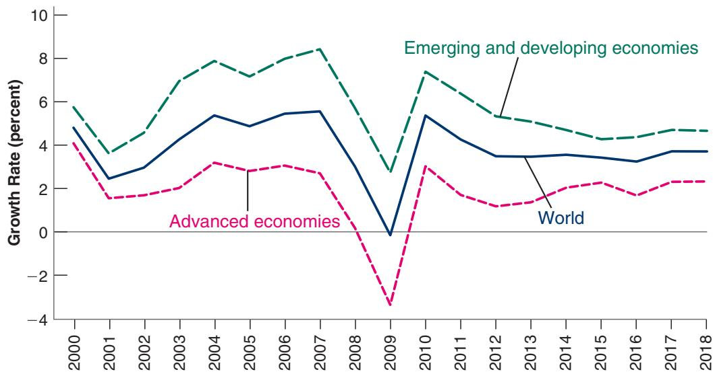
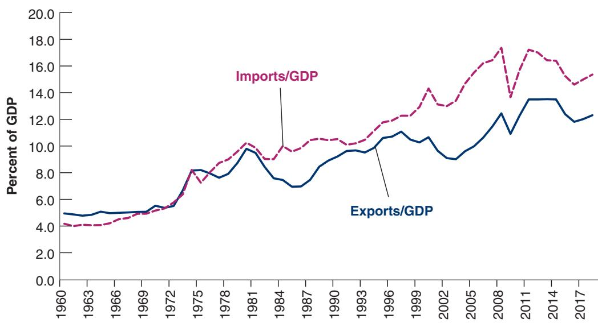
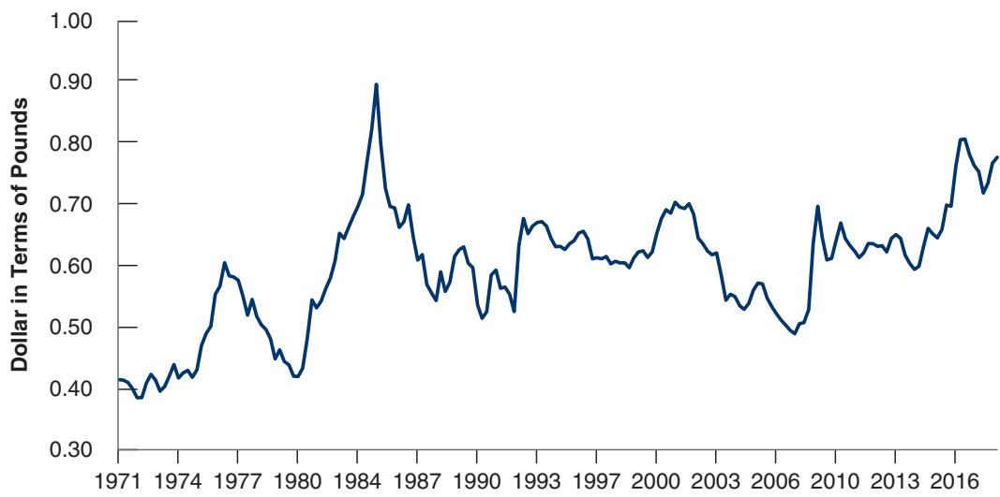
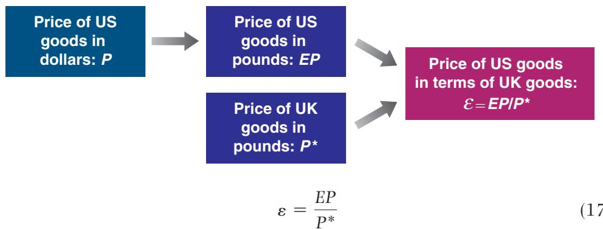
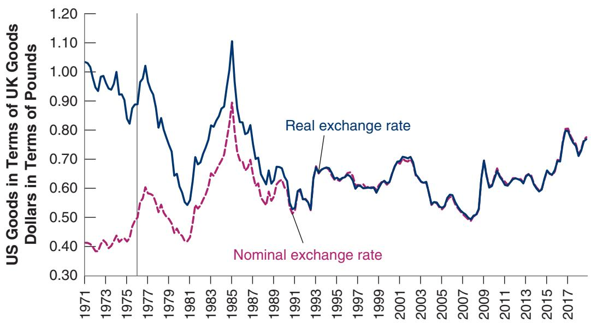
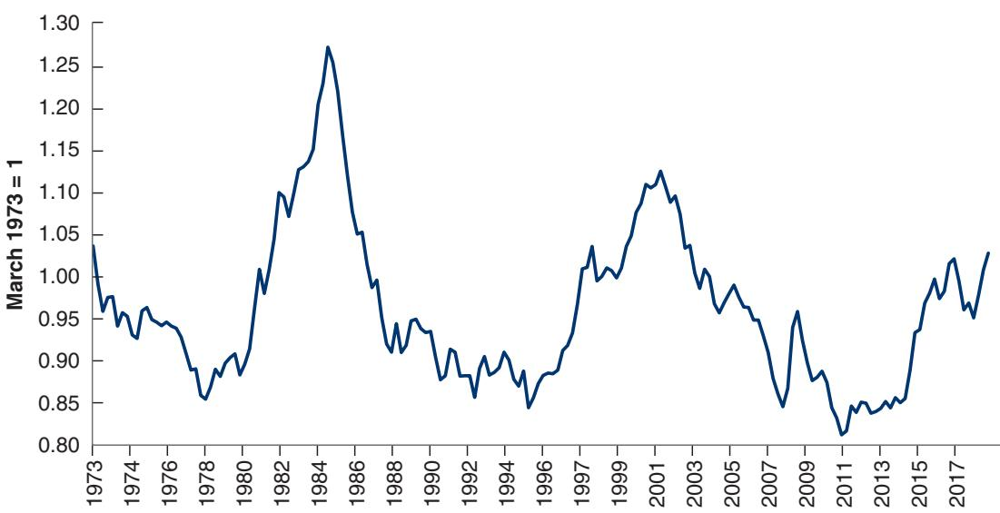
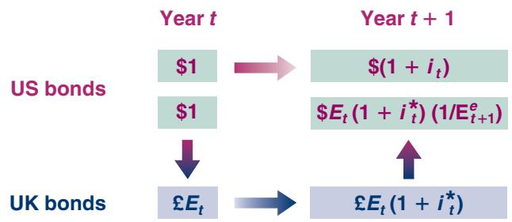

# Openness in Goods and Financial Markets

W have assumed until now that the economy we looked at was closed—that it did not interact with the rest of the world. We had to start this way to keep things simple and to build up intuition for the basic macroeconomic mechanisms. Figure 17-1, which repeats for convenience Figure 1-1, shows how bad, in fact, this assumption is. The figure plots the growth rates for advanced and emerging economies since 2005. What is striking is how the growth rates have moved together. Even though the crisis originated in the United States, the outcome was a worldwide recession with negative growth in advanced economies and much lower growth in emerging economies. It is therefore time to dismiss our closed economy assumption. Understanding the macroeconomic implications of openness will occupy us for this and the next three chapters.

Openness has three distinct dimensions:

1. Openness in goods markets—the ability of consumers and firms to choose between domestic goods and foreign goods. In no country is this choice completely free of restrictions. Even the countries most committed to free trade have tariffs—taxes on imported goods—and quotas—restrictions on the quantity of goods that can be imported—on at least some foreign goods. At the same time, in most countries, average tariffs are low and, until recently, were getting lower.

2. Openness in financial markets—the ability of financial investors to choose between domestic assets and foreign assets. Not long ago, even some of the richest countries in the world, such as France and Italy, had strong capital controls—restrictions on the foreign assets their domestic residents could hold and the domestic assets foreigners could hold. Capital controls are much more limited today. As a result, world financial markets are becoming more closely integrated.

3. Openness in factor markets—the ability of firms to choose where to locate production and of workers to choose where to work. Here also trends have been clear. Multinational companies operate plants in many countries and move their operations around the world to take advantage of low costs. Much of the debate about the North American Free Trade Agreement (NAFTA) signed in 1993 by the United States, Canada, and Mexico centered on how it would affect the relocation of US firms to Mexico. Similar fears now center on China. And immigration from low-wage countries is a hot political issue throughout Europe and in the United States.

In the short run and in the medium run—the focus of this and the next three chapters— openness in factor markets plays much less of a role than openness in either goods markets or financial markets. Thus, we shall ignore openness in factor markets and focus on the implications of the first two dimensions of openness here.

## Figure 17-1

Growth in Advanced and Emerging Economies since 2000

Advanced, emerging, and developing economies move very much together.

Source: IMF, World Economic Outlook, Oct 2015. Used courtesy of IMF.

Section 17-1 looks at openness in goods markets, determinants of the choice between domestic and foreign goods, and the role of the real exchange rate.

Section 17-2 looks at openness in financial markets, determinants of the choice between domestic and foreign assets, and the role of interest rates and exchange rates.

Section 17-3 gives a map to the next three chapters.

If you remember one basic message from this chapter, it should be: When looking at an open economy, we have to think about both the choice of domestic versus foreign goods and that of domestic versus foreign assets.

## 17-1 OPENNESS IN GOODS MARKETS

Let’s start by looking at how much the United States sells to and buys from the rest of the world. Then we shall be better able to think about the choice between domestic goods and foreign goods, and the role of the relative price of domestic goods in terms of foreign goods—the real exchange rate.

## Exports and Imports

Figure 17-2 plots the evolution of US exports and US imports, as ratios to GDP, since 1960 (“US exports” means exports from the United States; “US imports” means imports to the United States). The figure suggests two main conclusions:

■ The US economy is becoming more open over time. Exports and imports, which were equal to 5% of GDP in the early 1960s, are now equal to about 14% of GDP (12.3% for exports, 15.4% for imports). In other words, the United States trades roughly three times as much (relative to its GDP) with the rest of the world than it did 50 years ago.

If imports exceed exports, there is a trade deficit (equivalently, a negative trade balance).

Although imports and exports have followed the same upward trend, since the late 1970s imports have consistently exceeded exports. Put another way, for the last 40 years, the United States has consistently run a trade deficit. For four years in a row in the mid-2000s, the ratio of the trade deficit to GDP exceeded 5% of GDP. Although it has decreased since the beginning of the crisis, it remains large today, at 3%.

  
Figure 17-2  
US Exports and Imports as Ratios to GDP since 1960  
Since 1960, US exports and imports have roughly tripled in relation to GDP. The United States has become a much more open economy.  
Source: Series GDP, EXPGS, IMPGS. Federal Reserve Economic Data (FRED) https:// research.stlouisfed.org/fred2/

Understanding the sources and implications of this large deficit is an important issue and one to which we shall return later.

Given all the talk in the media about globalization, a volume of trade (measured by the average of the ratios of exports and imports to GDP) around 14% of GDP might strike you as small. However, the volume of trade is not necessarily a good measure of openness. Many firms are exposed to foreign competition, but by being competitive and keeping their prices low enough, these firms are able to retain their domestic market share and limit imports. This suggests that a better index of openness than export or import ratios is the proportion of aggregate output composed of tradable goods—goods that compete with foreign goods in either domestic markets or foreign markets. Estimates are that tradable goods represent about 60% of aggregate output in the United States today.

Tradable goods: cars, computers, pharmaceuticals, etc. Nontradable goods: housing, most medicalb services, haircuts, etc.

With exports around 12.3% of GDP, it is true that the United States has one of the smallest ratios of exports to GDP among the rich countries of the world. Table 17-1 gives ratios for a number of OECD countries.

For more on the OECD, see b Chapter 1.

The United States is at the low end of the range of export ratios. Japan’s ratio is a bit higher, the United Kingdom’s nearly three times as large, and Germany’s four times as large. The smaller European countries have very large ratios, from 65.0% in Switzerland to 86.4% in the Netherlands. (The high Netherlands ratio of exports to GDP raises an odd possibility: Can a country have exports larger than its GDP; in other words, can a country have an export ratio greater than one? The answer is yes. The reason why is given in the Focus Box “Can Exports Exceed GDP?”.)

Table 17-1 Ratios of Exports to GDP for Selected OECD Countries, 2017

<table><tr><td>Country</td><td>Export Ratio</td><td>Country</td><td>Export Ratio</td></tr><tr><td>United States</td><td>12.3%</td><td>Germany</td><td>47.2%</td></tr><tr><td>Japan</td><td>16.1%</td><td>Austria</td><td>53.9%</td></tr><tr><td>Chile</td><td>28.7%</td><td>Switzerland</td><td>65.0%</td></tr><tr><td>United Kingdom</td><td>30.5%</td><td>Netherlands</td><td>86.4%</td></tr></table>

Source: World Bank database, exports

## Can Exports Exceed GDP?

Can a country have exports larger than its GDP—that is, can it have an export ratio greater than one?

It would seem that the answer must be no: A country cannot export more than it produces, so that the export ratio must be less than one. Not so. The key to the answer is to realize that exports and imports include intermediate goods.

Take, for example, a country that imports intermediate goods for \$1 billion. Suppose it transforms them into final goods using only labor. Say labor is paid \$200 million and that there are no profits. The value of these final goods is thus equal to \$1,200 million. Assume that \$1 billion worth of final goods is exported and the rest, \$200 million, is consumed domestically.

Exports and imports therefore both equal \$1 billion. What is GDP in this economy? Remember that GDP is value added in the economy (see Chapter 2). So in this example, GDP equals \$200 million, and the ratio of exports to GDP equals \$1000>\$200 = 5.

Hence, exports can exceed GDP. This is actually the case for a number of small countries where most economic activity is organized around a harbor and import-export activities. This is even the case for small countries such as Singapore, where manufacturing plays an important role. In 2017, the ratio of exports to GDP in Singapore was 173%!

Do these numbers indicate that the United States has higher trade barriers than, say, the United Kingdom or the Netherlands? No. The main factors behind these differences are geography and size. Distance from other markets explains a good part of the lower Japanese ratio. Size also matters; the smaller the country, the more it must specialize in producing and exporting only a few products and rely on imports for the other products. The Netherlands can hardly afford to produce the range of goods produced by the United States, a country roughly 20 times its economic size.c

## The Choice between Domestic Goods and Foreign Goods

How does openness in goods markets force us to rethink the way we look at equilibrium in the goods market?

Until now, when we were thinking about consumers’ decisions in the goods market, we focused on their decision to save or to consume. When goods markets are open, domestic consumers face a second decision: whether to buy domestic or foreign goods. Indeed, all buyers—including domestic and foreign firms and governments— face the same decision. This decision has a direct effect on domestic output. If buyers decide to buy more domestic goods, the demand for domestic goods increases, and so does domestic output. If they decide to buy more foreign goods, then foreign output increases instead of domestic output.

Central to this second decision (to buy domestic or foreign goods) is the price of domestic goods relative to foreign goods. We call this relative price the real exchange rate. The real exchange rate is not directly observable, and you will not find it in the newspapers. What you will find in newspapers are nominal exchange rates, the relative prices of currencies. So we start by looking at nominal exchange rates and then see how we can use them to construct real exchange rates.

## Nominal Exchange Rates

Nominal exchange rates between two currencies can be quoted in one of two ways:

■ As the price of the domestic currency in terms of the foreign currency. If, for example, we look at the United States and the United Kingdom, and think of the dollar as the domestic currency and the pound as the foreign currency, we can express the nominal exchange rate as the price of a dollar in terms of pounds. In December 2018, the exchange rate defined this way was 0.79. In other words, one dollar was worth 0.79 pounds.

■ As the price of the foreign currency in terms of the domestic currency. Continuing with the same example, we can express the nominal exchange rate as the price of a pound in terms of dollars. In December 2018, the exchange rate defined this way was 1.26. In other words, one pound was worth 1.26 dollars.

Either definition is fine; the important thing is to remain consistent. In this text, we shall adopt the first definition: we shall define the nominal exchange rate as the price of the domestic currency in terms of foreign currency, and denote it by E. When looking, for example, at the exchange rate between the United States and the United Kingdom (from the viewpoint of the United States, so the dollar is the domestic currency), E will denote the price of a dollar in terms of pounds (thus E was 0.79 in December 2018).

Exchange rates between the dollar and most foreign currencies are determined in foreign exchange markets and change every day—indeed every minute of the day. These changes are called nominal appreciations or nominal depreciations—appreciations or depreciations for short.

■ An appreciation of the domestic currency is an increase in the price of the domestic currency in terms of a foreign currency. Given our definition of the exchange rate, an appreciation corresponds to an increase in the exchange rate.

■ A depreciation of the domestic currency is a decrease in the price of the domestic currency in terms of a foreign currency. So given our definition of the exchange rate, a depreciation of the domestic currency corresponds to a decrease in the exchange rate, E.

You may have encountered two other words to denote movements in exchange rates: “revaluations” and “devaluations.” These two terms are used when countries operate under fixed exchange rates—a system in which two or more countries maintain a constant exchange rate between their currencies. Under such a system, increases in the exchange rate—which are infrequent by definition—are called revaluations (rather than appreciations). Decreases in the exchange rate are called devaluations (rather than depreciations).

Figure 17-3 plots the nominal exchange rate between the dollar and the pound since 1971. Note the two main characteristics of the figure:

■ The trend increase in the exchange rate. In 1971, a dollar was worth only 0.41 pounds. In December 2018, a dollar was worth 0.79 pounds. Put another way, there was an appreciation of the dollar relative to the pound over the period.

■ The large fluctuations in the exchange rate. In the 1980s, a sharp appreciation, in which the dollar more than doubled in value relative to the pound, was followed by a nearly equally sharp depreciation. In the 2000s, a large depreciation was followed by a large appreciation as the Financial Crisis started, and a smaller depreciation. In the 2010s, the exchange rate remained roughly unchanged until the Brexit referendum in June 2016 led to another exchange rate appreciation.

If we are interested, however, in the choice between domestic goods and foreign goods, the nominal exchange rate gives us only part of the information we need. Figure 17-3, for example, tells us only about movements in the relative price of the two currencies, the dollar and the pound. To US tourists thinking of visiting the United Kingdom, the question is not only how many pounds they will get in exchange for their dollars but how much goods will cost in the United Kingdom relative to how much they cost in the United States. This takes us to our next step—the construction of real exchange rates.

## From Nominal to Real Exchange Rates

How can we construct the real exchange rate between the United States and the United Kingdom—the price of US goods in terms of British goods?

Warning: There is unfortunately no agreed-upon rule among economists or among newspapers as to which of theb two definitions to use. You will encounter both. Always check which definition is used.

E: Nominal exchange rate— Price of domestic currency in terms of foreign currency. (From the point of view of theb United States looking at the United Kingdom, the price of a dollar in terms of pounds.)

Appreciation of the domestic currency 3 Increase in the price of the domestic currency in terms of foreign currency 3 Increase in theb exchange rate.

Depreciation of the domestic currency 3 Decrease in the price of the domestic currency in terms of foreign currency 3 Decrease in the exchange rate.

We shall discuss fixed b exchange rates in Chapter 20.

## Figure 17-3

The Nominal Exchange Rate between the Dollar and the Pound since 1971

Although the dollar has appreciated relative to the pound over the past four decades, this appreciation has come with large swings in the nominal exchange rate between the two currencies.

Source: FRED DEXUSUK

Suppose the United States produced only one good, a Cadillac luxury sedan, and the United Kingdom also produced only one good, a Jaguar luxury sedan. (This is one of those “suppose” statements that run completely against the facts, but we shall become more realistic shortly.) Constructing the real exchange rate, the price of the US goods (Cadillacs) in terms of British goods (Jaguars) would be straightforward. We would express both goods in terms of the same currency and then compute their relative price.

Suppose, for example, we expressed both goods in terms of pounds.

exchange rate.

■ The first step would be to take the price of a Cadillac in dollars and convert it to a price in pounds. The price of a Cadillac in the United States is, say, \$40,000. The dollar is worth, say, £0.79, so the price of a Cadillac in pounds is $\$ 40,000$

■ The second step would be to compute the ratio of the price of the Cadillac in pounds to the price of the Jaguar in pounds. The price of a Jaguar in the United Kingdom is, say, £30,000. So the price of a Cadillac in terms of Jaguars—that is, the real exchange rate between the United States and the United Kingdom— would be $\mathrm { f } 3 1 , 6 0 0 / \mathrm { f } 3 0 , 0 0 0 = 1 . 0 5$ . A Cadillac would be 5% more expensive than a Jaguar.

This example is straightforward, but how do we generalize it? The United States and the United Kingdom produce more than Cadillacs and Jaguars, and we want to construct a real exchange rate that reflects the relative price of all the goods produced in the United States in terms of all the goods produced in the United Kingdom.

The computation we just went through tells us how to proceed. Rather than using the price of a Jaguar and the price of a Cadillac, we must use a price index for all goods produced in the United Kingdom and a price index for all goods produced in the United States. This is exactly what the GDP deflators we introduced in Chapter 2 do. They are, by definition, price indexes for the set of final goods and services produced in the economy.

e: The real exchange rate is the price of domestic goods in terms of foreign goods.

Let P be the GDP deflator for the United States, P\* be the GDP deflator for the United Kingdom (as a rule, we shall denote foreign variables by an asterisk, and E be the dollarpound nominal exchange rate. Figure 17-4 goes through the steps needed to construct the real exchange rate.

(For example, from the point of view of the United States looking at the United

■ The price of US goods in dollars is P. Multiplying it by the exchange rate, E—the price of dollars in terms of pounds—gives us the price of US goods in pounds, EP.

Kingdom, the price of US goods in terms of British

goods.) c

■ The price of British goods in pounds is P\*. The real exchange rate, the price of US goods in terms of British goods, which we shall call e (the Greek lowercase epsilon), is thus given by

  
Figure 17-4  
The Construction of the Real Exchange Rate

(17.1)

The real exchange rate is constructed by multiplying the domestic price level by the nominal exchange rate and then dividing by the foreign price level—a straightforward extension of the computation we made in our Cadillac/Jaguar example.

Note, however, that there is an important difference between our Cadillac/Jaguar example and this more general computation. Unlike the price of Cadillacs in terms of Jaguars, the real exchange rate is an index number; that is, its level is arbitrary, and therefore uninformative. It is uninformative because the GDP deflators used to construct the real exchange rate are themselves index numbers. As we saw in Chapter 2, they are equal to 1 (or 100) in whatever year is chosen as the base year.

But all is not lost. Although the level of the real exchange rate is uninformative, the rate of change of the real exchange rate is informative. If, for example, the real exchange rate between the United States and the United Kingdom increases by 10%, this tells us that US goods are now 10% more expensive relative to British goods than they were before.

Like nominal exchange rates, real exchange rates move over time. These changes are called real appreciations or real depreciations.

An increase in the real exchange rate—that is, an increase in the relative price of domestic goods in terms of foreign goods—is called a real appreciation.

■ A decrease in the real exchange rate—that is, a decrease in the relative price of domestic goods in terms of foreign goods—is called a real depreciation.

Figure 17-5 plots the evolution of the real exchange rate between the United States and the United Kingdom since 1971, constructed using equation (17.1). For

Real appreciation 3 Increase in the price of the domestic goods in terms of foreign goods 3 Increase in b the real exchange rate.

## Real depreciation 3b

Decrease in the price of the domestic goods in terms of foreign goods 3 Decrease in the real exchange rate.

## Figure 17-5

Real and Nominal Exchange Rates between the United States and the United Kingdom since 1971

Except for the difference in trend reflecting higher average inflation in the United Kingdom than in the United States unti the early 1990s, the nominal and real exchange rates have largely moved together.

Source: FRED. GDPDEF, GBRGDPDEFQISMEI, DEXUSUK.

convenience, it also reproduces the evolution of the nominal exchange rate from Figure 17-3. The GDP deflators have both been set equal to 1 in the year 2000, so the nominal exchange rate and the real exchange rate are equal in that year by construction.

You should draw two lessons from Figure 17-5.

■ The nominal and the real exchange rate can move in opposite directions. Note, for example, that, from 1971 to 1976, the nominal exchange rate went up, whereas the real exchange rate went down.

How do we reconcile the fact that there was both a nominal appreciation (of the dollar relative to the pound) and a real depreciation (of US goods relative to British goods) during the period? To see why, return to the definition of the real exchange rate in equation (17.1) and rewrite it as:

$$
\varepsilon = E \frac {P}{P ^ {*}}
$$

Two things happened in the 1970s:

First, E increased. The dollar went up in terms of pounds—this is the nominal appreciation we saw previously.

Second, $P / P ^ { * }$ decreased. The price level increased less in the United States than in the United Kingdom. Put another way, over the period, average inflation was lower in the United States than in the United Kingdom.

The resulting decrease in $P / P ^ { * }$ was larger than the increase in E, leading to a decrease in e, a real depreciation—a decrease in the relative price of domestic goods in terms of foreign goods.

To get a better understanding of what happened, let’s go back to our US tourists thinking about visiting the United Kingdom, circa 1976. They would find that they could buy more pounds per dollar than in 1971 (E had increased). Did this imply their trip would be cheaper? No. When they arrived in the United Kingdom, they would discover that the prices of goods in the United Kingdom had increased much more than the prices of goods in the United States $( P ^ { * }$ has increased more than P, so $P / P ^ { * }$ has declined), and this more than canceled the increase in the value of the dollar in terms of pounds. They would find that their trip was actually more expensive (in terms of US goods) than it would have been five years earlier.

Can there be a real appreciation with no nomina appreciation? Can there be a nominal appreciation with no real appreciation? (The answer to both questions: yes.)

There is a general lesson here. Over long periods of time, differences in inflation rates across countries can lead to very different movements in nominal exchange rates and real exchange rates. We shall return to this issue in Chapter 20.c

■ The large fluctuations in the nominal exchange rate we saw in Figure 17-3 also show up in the real exchange rate.

If inflation rates were exactly equal, $P / P ^ { * }$ would be constant, and e and E would move exactly together.

一 This not surprising. Price levels move slowly. So year-to-year movements in the price ratio $P / P ^ { * }$ are typically small compared to the often sharp movements in the nominal exchange rate E. Thus, from year to year, or even over the course of a few years, movements in the real exchange rate e tend to be driven largely by movements in the nominal exchange rate E. Note that since the early 1990s, the nominal exchange rate and the real exchange rate have moved nearly together. This reflects the fact that, since the early 1990s, inflation rates have been similar—and low—in both countries.

## From Bilateral to Multilateral Exchange Rates

We need to take one last step. So far, we have concentrated on the exchange rate between the United States and the United Kingdom. But the United Kingdom is just one of many countries the United States trades with. Table 17-2 shows the geographic composition of US trade for exports and imports.

The main message of the table is that the United States does most of its trading with three sets of countries. The first includes its immediate neighbors to the North and to the South: Trade with Canada and Mexico accounts for 34% of US exports and 26% of US imports. The second includes the European Union, which accounts for 19% of US exports and 19% of US imports. The third includes the Asian countries— including Japan and China—which together account for 26% of US exports and 36% of US imports.

Note also the sharp imbalance between US imports to China and US exports to China, which has been the source of tensions between China and the Trump administration. This has led the Trump administration to introduce tariffs on Chinese goods to decrease this bilateral deficit. More on this in b Chapter 19.

How do we go from bilateral exchange rates, like the real exchange rate between the United States and the United Kingdom, to multilateral exchange rates that reflect this composition of trade?

The principle we want to use is simple, even if the details of construction are complicated. We want the weight of a given country to incorporate not only how much the country trades with the United States but also how much it competes with the United States in other countries. (Why not just look at trade shares between the United States and each individual country? Take two countries, the United States and country A. Suppose the United States and country A do not trade with each other—so trade shares are equal to zero—but they are both exporting to country B. The real exchange rate between the United States and country A will matter very much for how much the United States exports to country B and thus to the US export performance.) The variable constructed in this way is called the multilateral real US exchange rate or the US real exchange rate for short.

Bi means “two.” Multi means b “many.”

Figure 17-6 shows the evolution of this multilateral real exchange rate, the price of US goods in terms of foreign goods since 1973. Like the bilateral real exchange rates we saw a few pages earlier, it is an index number and its level is arbitrary. The index is roughly today where it was in 1973. What is most noticeable about the figure are the large swings in the multilateral real exchange rate in the 1980s and, to a lesser extent, in the 2000s. These swings are so striking that they have been given various names, from the “dollar cycle” to the more graphic “dance of the dollar.” In the coming chapters, we shall examine where these swings come from and their effects on the trade deficit and economic activity.

These are all equivalent names for the relative price of US goods in terms of foreign goods: the multilateral real US exchange rate, the US trade-weighted real exchange rate, the US b effective real exchange rate.

The figure begins in 1973 because the multilateral real exchange rate, which is constructed by the Federal Reserve Board, is available only as far back as 1973.

<table><tr><td colspan="3">Table 17-2 Country Composition of US Exports and Imports, 2018</td></tr><tr><td colspan="3"></td></tr><tr><td></td><td>Percent of Exports to</td><td>Percent of Imports from</td></tr><tr><td>Canada</td><td>18</td><td>12</td></tr><tr><td>Mexico</td><td>16</td><td>14</td></tr><tr><td>European Union</td><td>19</td><td>19</td></tr><tr><td>China</td><td>7</td><td>21</td></tr><tr><td>Japan</td><td>4</td><td>6</td></tr><tr><td>Rest of Asia and Pacific</td><td>15</td><td>9</td></tr><tr><td>Others</td><td>21</td><td>19</td></tr><tr><td colspan="3">Source: US Census, International Trade Data, FT900, exhibit 14.</td></tr></table>

## Figure 17-6

The US Multilateral Real Exchange Rate, since 1973

Since 1973 there have been two large real appreciations of the US dollar and two large real depreciations.

Source: FRED, TWEXBPA

## 17-2 OPENNESS IN FINANCIAL MARKETS

Openness in financial markets allows financial investors to hold both domestic assets and foreign assets, to diversify their portfolios, to speculate on movements in foreign interest rates versus domestic interest rates, on movements in exchange rates, and so on.

Diversify and speculate they do. Given that buying or selling foreign assets implies buying or selling foreign currency—sometimes called foreign exchange—the volume of transactions in foreign exchange markets gives a sense of the importance of international financial transactions. In 2016, for example, the recorded daily volume of foreign exchange transactions in the world was \$5.1 trillion, of which 88% involved US dollars on one side of the transaction and 31% involved the euro.

Daily volume of foreign exchange transactions with dollars on one side of the transaction: \$4.5 trillion. Daily volume of trade of the United States with the rest of the world: \$13 billion (0.29% of the volume of foreign exchange transactions).

To get a sense of the magnitude of these numbers, the sum of US exports and imports in 2016 totaled about \$13 billion per day. Suppose the only dollar transactions in foreign exchange markets had been, on one side, by US exporters selling their foreign currency earnings, and on the other side by US importers buying the foreign currency they needed to buy foreign goods. Then the volume of transactions involving dollars in foreign exchange markets would have been \$13 billion per day, or about 0.29% of the actual daily total volume of dollar transactions (\$5.1 \* 0.88 = \$4.5 trillion) involving dollars in foreign exchange markets. This computation tells us that most of the transactions are associated not with trade but with purchases and sales of financialc assets. Moreover, the volume of transactions in foreign exchange markets is not only high but also rapidly increasing: it has more than quintupled since 2001. Again, this increase in activity reflects mostly an increase in financial transactions rather than an increase in trade.

A country’s openness in financial markets has an important implication. It allows the country to run trade surpluses and trade deficits. Recall that a country running a trade deficit is buying more from the rest of the world than it is selling to the rest of the world. To pay for the difference between what it buys and what it sells, the country must borrow from the rest of the world. It borrows by making it attractive for foreign financial investors to increase their holdings of domestic assets—in effect, to lend to the country.

Let’s start by looking more closely at the relation between trade flows and financial flows. We shall then look at the determinants of these financial flows.

## The Balance of Payments

A country’s transactions with the rest of the world, including both trade flows and financial flows, are summarized by a set of accounts called the balance of payments. Table 17-3 presents the US balance of payments for 2018. The table has two parts, separated by a line. Transactions are referred to as either above the line or below the line.

## The Current Account

The transactions above the line record payments to and from the rest of the world. They are called current account transactions.

■ The first two lines record the exports and imports of goods and services. Exports lead to payments from the rest of the world, imports to payments to the rest of the world. The difference between exports and imports is the trade balance. In 2018, imports exceeded exports, leading to a US trade deficit of \$622 billion—roughly 3% of US GDP.

■ Exports and imports are not the only sources of payments to and from the rest of the world. US residents receive income on their holdings of foreign assets, and foreign residents receive income on their holdings of US assets. In 2018, income received from the rest of the world was \$1,200 billion and income paid to foreigners was \$1,067 billion for a net income balance of \$133 billion.

The sum of these net payments to and from the rest of the world is called the current account balance. If net payments from the rest of the world are positive, the country is running a current account surplus; if they are negative, the country is running a current account deficit. Adding all payments to and from the rest of the world, net payments from the United States to the rest of the world were equal in 2018 to - \$622 + \$133 = - \$489 billion. Put another way, in 2018 the United States ran a current account deficit of \$489 billion—roughly 2.4% of its GDP.

Can a country have: A trade deficit and no current account deficit? A current account deficit and no trade deficit? (The answer to both b questions: yes.)

<table><tr><td colspan="3">Table 17-3 The US Balance of Payments, 2018, in Billions of US Dollars</td></tr><tr><td colspan="3"></td></tr><tr><td>Current Account</td><td></td><td></td></tr><tr><td>Exports</td><td>2,500</td><td></td></tr><tr><td>Imports</td><td>3,122</td><td></td></tr><tr><td>Trade balance (deficit = minus sign)(1)</td><td></td><td>-622</td></tr><tr><td>Income received</td><td>1,200</td><td></td></tr><tr><td>Income paid</td><td>1,067</td><td></td></tr><tr><td>Net income (2)</td><td></td><td>133</td></tr><tr><td>Current account balance (1) + (2) (deficit = minus sign)</td><td></td><td>-489</td></tr><tr><td>Financial Account</td><td></td><td></td></tr><tr><td>Net capital transfers (3)</td><td>9</td><td></td></tr><tr><td>Increase in foreign holdings of US assets (4)</td><td>811</td><td></td></tr><tr><td>Increase in US holdings of foreign assets (5)</td><td>301</td><td></td></tr><tr><td>Financial account balance (7) = (3) + (4) - (5)</td><td></td><td>519</td></tr><tr><td>Statistical discrepancy:financial account – current account balance</td><td></td><td>30</td></tr><tr><td colspan="3">Source: US Bureau of Economic Analysis, US International Transactions, Table. 17.1.</td></tr></table>

Until recently, the financial account was called the capital account. It is still called the capital account in many countries and in the press. Technically, in the United States today the “capital account” refers only to the net capital transfers in Table 17-3. Yes, it is confusing!

In the same way that if you spend more than you earn, you have to finance the difference.

The Financial Account

The fact that the United States had a current account deficit of \$489 billion in 2018 implies that it had to borrow \$489 billion from the rest of the world—or, equivalently, that net foreign holdings of US assets had to increase by \$489 billion. The numbers below the line show how this was achieved. They are called financial account transactions.c

One way a country can finance its deficit is by receiving gifts from other countries. An example of such gifts may be a cancellation of some of the country’s debt. This is reflected in the line called “net capital transfers.” For a country like the United States, this is not an important item, and the number for net capital transfers is close to zero. Nearly all the financing comes from an increase in net foreign holdings of US assets.

The increase in foreign holdings of US assets in 2018 was \$811 billion. Foreign investors—be they private investors, governments, or central banks—bought \$811 billion worth of US stocks, bonds, and other US assets.

At the same time, however, there was an increase in US holdings of foreign assets of \$301 billion. US investors, private and public, bought \$301 billion worth of foreign stocks, bonds, and other assets.

The result was an increase in net US foreign indebtedness (the increase in foreign holdings of US assets, plus net capital transfers, minus the increase in US holdings of foreign assets), also called net capital flows to the United States, of ${ \$ 8 1 1 + \$ 9-93 0 1 = \ S 5 1 9 }$ billion. Another name for net capital flows is the financial account balance. Positive net capital flows are called a financial account surplus; negative net capital flows are called a financial account deficit. So, put another way, in 2018 the United States ran a financial account surplus of \$519 billion.

Shouldn’t net capital flows (equivalently, the financial account surplus) plus net capital transfers be equal to the current account deficit (which was equal to \$489 billion in 2018)? In principle, yes. In practice, no.

The numbers for current and capital account transactions are constructed using different sources; although they should give the same answers, they typically do not. In 2018, the difference between the two—called the statistical discrepancy—was \$30 billion, about 6% of the current account balance. This is yet another reminder that, even for an advanced country such as the United States, economic data are far from perfect. (This problem of measurement manifests itself in another way as well. The sum of the current account deficits of all the countries in the world should be equal to zero. One country’s deficit should show up as a surplus for the other countries taken as a whole. However, this is not the case in the data. If we just add the published current account deficits of all the countries in the world, it would appear that the world is running a large current account deficit!)

Now that we have looked at the current account, we can return to an issue we touched on in Chapter 2, the difference between gross domestic product (GDP), the measure of output we have used so far, and gross national product (GNP), another measure of aggregate output.

GDP measures value added domestically. GNP measures the value added by domestic factors of production. When the economy is closed, the two measures are the same. When the economy is open, however, they can differ. Some of the income from domestic production goes to foreigners; and domestic residents receive some foreign income. Thus, to go from GDP to GNP, one must start from GDP, add income received from the rest of the world, and subtract income paid to the rest of the world. Put another way, GNP is equal to GDP plus net payments from the rest of the world. More formally, denoting these net income payments by NI,

$$
G N P = G D P + N I
$$

• In times of high inflation, people sometimes switch to a foreign currency—in other countries, often the dollar—for use even in some domestic transactions.

In most countries, the difference between the GNP and GDP is small (relative to GDP). For example, in the United States, you can see from Table 17-3 that net income payments were equal to \$133 billion. GNP exceeded GDP by \$133 billion, or about 0.6% of GDP. For some countries, however, the difference can be large. This is explored in the Focus Box “GDP versus GNP: The Example of Kuwait.”

## The Choice between Domestic and Foreign Assets

Openness in financial markets implies that people (or financial institutions that act on their behalf) face a new financial decision: whether to hold domestic assets or foreign assets.

It would appear that we actually have to think about at least two new decisions: the choice of holding domestic money versus foreign money and that of holding domestic interest-paying assets versus foreign interest-paying assets. But remember why people hold money: to engage in transactions. For someone who lives in the United States and whose transactions are mostly or fully in dollars, there is little point in holding foreign currency. Foreign currency cannot be used for transactions in the United States, and if the goal is to hold foreign assets, holding foreign currency is clearly less desirable than holding foreign bonds, which pay interest. This leaves us with only one new decision: the choice between domestic and foreign interest-paying assets.

For now, let’s think of these assets as domestic and foreign one-year bonds. Consider, for example, the choice between US and UK one-year bonds from the point of view of a US investor.

■ Suppose you decide to hold US bonds.

■ Let $i _ { t }$ be the one-year US nominal interest rate. Then, as Figure 17-7 shows for every dollar you put in US bonds, you will get $( 1 + i _ { t } )$ dollars next year. (This is represented by the arrow pointing to the right at the top of the figure.)

■ Suppose you decide instead to hold UK bonds.

■ To buy UK bonds, you must first buy pounds. Let $E _ { t }$ be the nominal exchange rate between the dollar and the pound. For every dollar, you get $E _ { t }$ pounds. (This is represented by the arrow pointing downward in the figure.)

Let $\boldsymbol { i } _ { t } ^ { * }$ denote the one-year nominal interest rate on UK bonds (in pounds). When next year comes, you will have $E _ { t } ( 1 + i _ { t } ^ { * } )$ pounds. (This is represented by the arrow pointing to the right at the bottom of the figure.)

You will then have to convert your pounds back into dollars. If you expect the nominal exchange rate next year to be $E _ { t + 1 } ^ { e }$ , each pound will be worth $\left( 1 / E _ { t + 1 } ^ { e } \right)$ dollars. So you can expect to have $E _ { t } ( 1 + i _ { t } ^ { * } ) ( 1 / E _ { t + 1 } ^ { e } )$ dollars next year for every dollar you invest now. (This is represented by the arrow pointing upward in the figure.)

We shall look at the expression we just derived in more detail soon. But note its basic implication already. In assessing the attractiveness of UK versus US bonds, you cannot look just at the UK interest rate and the US interest rate; you must also assess what you think will happen to the dollar/pound exchange rate between this year and next.

  
Figure 17-7  
Expected Returns from Holding One-Year US Bonds versus One-Year UK Bonds  
Chapter 17 Openness in Goods and Financial Markets
