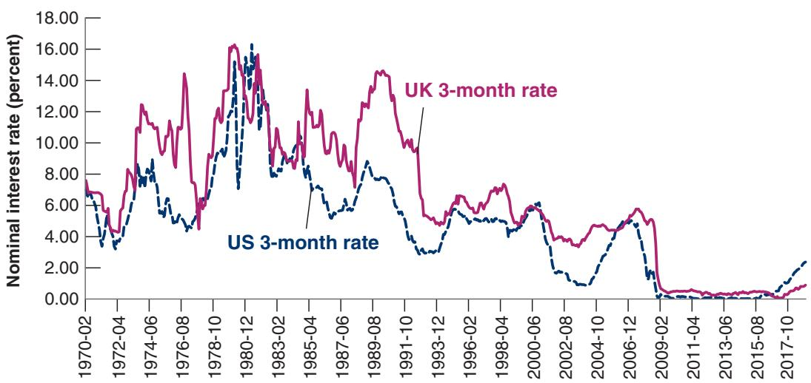

# GDP versus GNP: The Example of Kuwait

When oil was discovered in Kuwait, Kuwait’s government decided that a portion of oil revenues would be saved and invested abroad rather than spent, to provide future Kuwaiti generations with income when oil revenues came to an end. Kuwait ran a large current account surplus, steadily accumulating large foreign assets. As a result, it had large holdings of foreign assets and received substantial income from the rest of the world. Table 1 gives GDP, GNP, and net investment income for Kuwait from 1989 to 1994 (you will see the reason for the choice of dates).

Note how much larger GNP was compared to GDP throughout the period. Net income from abroad was 34% of GDP in 1989. But note also how net factor payments steadily decreased after 1989. This is because Kuwait had to pay its allies for part of the cost of the 1990–1991 Gulf War and also had to pay for reconstruction after the war. It did so by running a current account deficit—that is, by decreasing its net holdings of foreign assets. This in turn led to a decrease in the income it earned from foreign assets and, by implication, a decrease in its net factor payments.

Since the Gulf War, Kuwait has rebuilt a sizable net foreign asset position. Net income from abroad was 6% of GDP in 2018.

<table><tr><td>Table 1</td><td colspan="3">GDP, GNP, and Net Income in Kuwait, 1989–1994</td></tr><tr><td colspan="4"></td></tr><tr><td>Year</td><td>GDP</td><td>GNP</td><td>Net Income (NI)</td></tr><tr><td>1989</td><td>7,143</td><td>9,616</td><td>2,473</td></tr><tr><td>1990</td><td>5,328</td><td>7,560</td><td>2,232</td></tr><tr><td>1991</td><td>3,131</td><td>4,669</td><td>1,538</td></tr><tr><td>1992</td><td>5,826</td><td>7,364</td><td>1,538</td></tr><tr><td>1993</td><td>7,231</td><td>8,386</td><td>1,155</td></tr><tr><td>1994</td><td>7,380</td><td>8,321</td><td>941</td></tr></table>

Source: International Financial Statistics, IMF. All numbers are in millions of Kuwaiti dinars. 1 dinar = \$3.0. (2018).

The word uncovered is to distinguish this relation from another relation called the covered interest parity condition, which is derived by looking at the following choice: Buy and hold US bonds for one year; or buy pounds today, buy one-year UK bonds with the proceeds, and agree to sell the pounds for dollars a year ahead at a predetermined price, called the forward exchange rate. The rate of return on these two alternatives, which can both be realized at no risk today, must be the same. The covered interest parity condition is a riskless arbitrage condition. It typically holds tightly.

Whether holding UK bonds or US bonds is more risky depends on which investors we are looking at. Holding UK bonds is riskier from the point of view of US investors. Holding US bonds is riskier from the point of view of British investors. (Why?)

Let’s now make the same assumption we made in Chapter 14 when first discussing the choice between short- and long-term bonds. Let’s assume that you and other financial investors care only about the expected rate of return, ignoring differences in risk, and therefore want to hold only the asset with the highest expected rate of return. In this case, if both UK and US bonds are to be held, they must have the same expected rate of return. Arbitrage implies that the following relation must hold:

$$
(1 + i _ {t}) = (E _ {t}) (1 + i _ {t} ^ {*}) \bigg (\frac {1}{E _ {t + 1} ^ {e}} \bigg)
$$

Reorganizing,

$$
(1 + i _ {t}) = (1 + i _ {t} ^ {*}) \bigg (\frac {E _ {t}}{E _ {t + 1} ^ {e}} \bigg)\tag{17.2}
$$

Equation (17.2) is called the uncovered interest parity relation or simply the interest parity condition.c

The assumption that financial investors will hold only the bonds with the highest expected rate of return is obviously too strong, for two reasons:

■ It ignores transaction costs. Buying and selling UK bonds requires three separate transactions, each with a transaction cost.

■ It ignores risk. The exchange rate a year from now is uncertain. For the US investor, holding UK bonds is therefore more risky, in terms of dollars, than holding US bonds.

But as a characterization of capital movements among the major world financial markets (New York, Frankfurt, London, and Tokyo), the assumption is not far off. Small changes in interest rates and rumors of impending appreciation or depreciation can lead to movements of billions of dollars within minutes. For the rich countries of the world, the arbitrage assumption in equation (17.2) is a good approximation of reality. Other countries whose capital markets are smaller and less developed, or countries that have various forms of capital controls, have more leeway in choosing their domestic interest rate than is implied by equation (17.2). We shall return to this issue at the end of Chapter 20.

## Interest Rates and Exchange Rates

Let’s get a better sense of what the interest parity condition implies. First rewrite $E _ { t } / E _ { t + } ^ { e } .$ 1 as $1 / ( 1 + ( E _ { t + 1 } ^ { e } - E _ { t } ) / E _ { t } )$ . Replacing in equation (17.2) gives

$$
(1 + i _ {t}) = \frac {(1 + i _ {t} ^ {*})}{[ 1 + (E _ {t + 1} ^ {e} - E _ {t}) / E _ {t} ]}\tag{17.3}
$$

This gives us a relation between the domestic nominal interest rate, $i _ { t } ,$ the foreign nominal interest rate, $i _ { t } ^ { * } ,$ and the expected rate of appreciation of the domestic currency, $( E _ { t + 1 } ^ { e } - E _ { t } ) / E _ { t }$ . As long as interest rates or the expected rate of depreciation are not too large—say, below 20% a year—a good approximation to this equation is given by:

$$
i _ {t} \approx i _ {t} ^ {*} - \frac {E _ {t + 1} ^ {e} - E _ {t}}{E _ {t}}\tag{17.4}
$$

This is the form of the interest parity condition you must remember. Arbitrage by investors implies that the domestic interest rate must be equal to the foreign interest rate minus the expected appreciation rate of the domestic currency.

Note that the expected appreciation rate of the domestic currency is also the expected depreciation rate of the foreign currency. So equation (17.4) can be equivalently stated as saying that the domestic interest rate must be equal to the foreign interest rate minus the expected depreciation rate of the foreign currency.

If the dollar is expected to appreciate by 3% relative to the pound, then the pound is expected to depreciate by 3% relative to the dollar.

Let’s apply this equation to US bonds versus UK bonds. Suppose the one-year nominal interest rate is 2.0% in the United States and 5.0% in the United Kingdom. Should you hold UK bonds or US bonds?

■ It depends whether you expect the pound to depreciate relative to the dollar over the coming year by more or less than the difference between the US interest rate and the UK interest rate, or 3.0% in this case 15.0% - 2.0%2.

■ If you expect the pound to depreciate by more than 3.0%, then, despite the fact that the interest rate is higher in the United Kingdom than in the United States, investing in UK bonds is less attractive than investing in US bonds. By holding UK bonds, you will get higher interest payments next year, but the pound will be worth less in terms of dollars, making it less attractive to invest in UK bonds than in US bonds.

■ If you expect the pound to depreciate by less than 3.0% or even to appreciate, then the reverse holds, and UK bonds are more attractive than US bonds.

Looking at it another way: If the uncovered interest parity condition holds and the US one-year interest rate is 3% lower than the UK interest rate, it must be that financial investors are expecting, on average, an appreciation of the dollar relative to the pound over the coming year of about 3% and this is why they are willing to hold US bonds despite their lower interest rate. (Another—and more striking—example is provided in the Focus Box “Buying Brazilian Bonds.”)

The arbitrage relation between interest rates and exchange rates, in the form of either equation (17.2) or equation (17.4), will play a central role in the following chapters. It suggests that, unless countries are willing to tolerate large movements in their exchange rate, domestic and foreign interest rates are likely to move largely together.

## Buying Brazilian Bonds

Put yourself back in September 1993 (the very high interest rate in Brazil at the time helps make the point I want to get across here). Brazilian bonds are paying a monthly interest rate of 36.9%! This seems attractive compared to the annual rate of 3% on US bonds—corresponding to a monthly interest rate of about 0.2%. Shouldn’t you buy Brazilian bonds?

The discussion in this chapter tells you that to decide you need one more crucial element, the expected rate of depreciation of the cruzeiro (the name of the Brazilian currency at the time; the currency is now called the real) in terms of dollars.

You need this information because, as we saw in equation (17.4), the return in dollars from investing in Brazilian bonds for a month is equal to one plus the Brazilian interest rate, divided by one plus the expected rate of depreciation of the cruzeiro relative to the dollar:

$$
\frac {\mathbf {1} + \boldsymbol {i} _ {t} ^ {*}}{\left[ \mathbf {1} + (E _ {t + 1} ^ {e} - E _ {t}) / E _ {t} \right]}
$$

What rate of depreciation of the cruzeiro should you expect over the coming month? A reasonable first pass is to expect the rate of depreciation during the coming month to be equal to the rate of depreciation last month. The dollar was worth 100,000 cruzeiros at the end of July 1993 and worth 134,600 cruzeiros at the end of August 1993, so the rate of appreciation of the dollar relative to the cruzeiro— equivalently, the rate of depreciation of the cruzeiro relative to the dollar—in August was 34.6%. If depreciation is expected to continue at the same rate in September as it did in August, the expected return from investing in Brazilian bonds for one month is

$$
\frac {1 . 3 6 9}{1 . 3 4 6} = 1. 0 1 7
$$

The expected rate of return in dollars from holding Brazilian bonds is only 11.017 - 12 = 1.7% per month, not the 36.9% per month that initially looked so attractive. Note that 1.7% per month is still higher than the monthly interest rate on US bonds (about 0.2%). But think of the risk and the transaction costs—all the elements we ignored when we wrote the arbitrage condition. When these are taken into account, you may well decide not to buy the Brazilian bonds.

I $\begin{array} { r } { \mathsf { f } E _ { t + 1 } ^ { \mathsf { e } } = E _ { t } , } \end{array}$ then the interest parity condition c implies $i _ { t } = i _ { t } ^ { * }$

Take the extreme case of two countries that commit to maintaining their bilateral exchange rates at a fixed value. If markets have faith in this commitment, they will expect the exchange rate to remain constant and the expected depreciation will be equal to zero. In this case, the arbitrage condition implies that interest rates in the two countries will have to move exactly together. Most of the time, as we shall see, governments do not make such absolute commitments to maintain the exchange rate, but they often do try to avoid large movements in the exchange rate. This puts sharp limits on how much they can allow their interest rate to deviate from interest rates elsewhere in the world.

How much do nominal interest rates actually move together in major countries? Figure 17-8 plots the three-month nominal interest rate in the United States and United Kingdom (expressed at annual rates) since 1970. The figure shows that the movements

Figure 17-8

Three-Month Nominal Interest Rates in the United States and United Kingdom since 1970

US and UK nominal interest rates have largely moved together over the last 40 years.

Source: FRED TB3MS; IR3TTS01GBM156N

are related but not identical. Interest rates were high in both countries in the early 1980s, and high again—although much more so in the United Kingdom than in the United States—in the late 1980s. They have been low in both countries since the mid-1990s, and are both very low and close to each other today. (Note how close to the zero lower bound the rate has been in both countries since mid-2009.) At the same time, differences between the two have sometimes been quite large. In 1990, for example, the UK interest rate was nearly 7% higher than the US interest rate. In the coming chapters, we shall return to why such differences emerge and what their implications may be.

Meanwhile, do the following: Look at the back pages of a recent issue of The Economist for short-term interest rates in different countries relative to the United States. Assume that uncovered interest parity holds. Which currenciesb are expected to appreciate against the dollar?

## 17-3 CONCLUSIONS AND A LOOK AHEAD

We have now set the stage for the study of the open economy:

■ Openness in goods markets allows people and firms to choose between domestic goods and foreign goods. This choice depends primarily on the real exchange rate—the relative price of domestic goods in terms of foreign goods.

■ Openness in financial markets allows investors to choose between domestic assets and foreign assets. This choice depends primarily on their relative rates of return, which depend on domestic and foreign interest rates and on the expected rate of appreciation of the domestic currency.

In Chapter 18 we look at the implications of openness in goods markets. In Chapter 19, we explore the implications of openness in both goods and financial markets. In Chapter 20, we discuss the pros and cons of different exchange rate regimes.

## SUMMARY

Openness in goods markets allows people and firms to choose between domestic and foreign goods. Openness in financial markets allows financial investors to hold domestic or foreign financial assets.

The nominal exchange rate is the price of the domestic currency in terms of foreign currency. From the viewpoint of the United States, the nominal exchange rate between the United States and the United Kingdom is the price of a dollar in terms of pounds.

A nominal appreciation (an appreciation, for short) is an increase in the price of the domestic currency in terms of foreign currency. In other words, it corresponds to an increase in the exchange rate. A nominal depreciation (a depreciation, for short) is a decrease in the price of the domestic currency in terms of foreign currency. It corresponds to a decrease in the exchange rate.

The real exchange rate is the relative price of domestic goods in terms of foreign goods. It is equal to the nominal exchange rate times the domestic price level divided by the foreign price level.

A real appreciation is an increase in the relative price of domestic goods in terms of foreign goods (i.e., an increase in the real exchange rate). It may come either from a nominal appreciation or from domestic inflation being higher than foreign inflation. A real depreciation is a decrease in the relative price of domestic goods in terms of foreign goods (i.e., a decrease in the real exchange rate). It may come either from a nominal depreciation or from domestic inflation being lower than foreign inflation.

The multilateral real exchange rate, or real exchange rate for short, is a weighted average of bilateral real exchange rates.

The balance of payments records a country’s transactions with the rest of the world. The current account balance is equal to the sum of the trade balance and net income the country receives from the rest of the world. The financial account balance is equal to net capital transfers plus capital flows from the rest of the world minus capital flows to the rest of the world.

The current account and the financial account are mirror images of each other. Leaving aside statistical problems, the current account plus the financial account must sum to zero. A current account deficit is financed by net capital flows from the rest of the world, thus by a capital account surplus. Similarly, a current account surplus corresponds to a capital account deficit.

Uncovered interest parity, or interest parity for short, is an arbitrage condition stating that the expected rates of return in terms of domestic currency on domestic and

## KEY TERMS

openness in goods markets, 355 tariffs, 355 quotas, 355 openness in financial markets, 355 capital controls, 355 openness in factor markets, 355 North American Free Trade Agreement (NAFTA), 355 tradable goods, 357 real exchange rate, 358 nominal exchange rate, 359 appreciation (nominal), 359 depreciation (nominal), 359 fixed exchange rates, 359 revaluation, 359 devaluation, 359 real appreciation, 361 real depreciation, 361 bilateral exchange rate, 363 multilateral exchange rate, 363 multilateral real US exchange rate, 363 foreign bonds must be equal. Interest parity implies that the domestic interest rate approximately equals the foreign interest rate minus the expected nominal appreciation rate of the domestic currency.

trade-weighted real exchange rate, 363 effective real exchange rate, 363 foreign exchange, 364 balance of payments, 365 above the line, 365 below the line, 365 current account, 365 income balance, 365 current account balance, 365 current account surplus, 365 current account deficit, 365 financial account, 366 capital account, 366 net capital flows, 366 financial account balance, 366 financial account surplus, 366 financial account deficit, 366 statistical discrepancy, 366 gross national product (GNP), 366 uncovered interest parity relation, 368 interest parity condition, 368

## QUESTIONS AND PROBLEMS

## QUICK CHECK

1. Using the information in this chapter, label each of the following statements true, false, or uncertain. Explain briefly.

a. If there are no statistical discrepancies, countries with current account deficits must receive net capital inflows.

b. Although the export ratio can be larger than one—as it is in Singapore—the same cannot be true of the ratio of imports to GDP.

c. The fact that a rich country like Japan has such a small ratio of imports to GDP is clear evidence of an unfair playing field for US exporters to Japan.

d. Uncovered interest parity implies that interest rates must be the same across countries.

e. The nominal exchange rate in this chapter is defined as the domestic currency price of a unit of foreign currency.

f. The nominal exchange rate and the real exchange rate always move in the same direction.

g. The nominal exchange rate and the real exchange rate usually move in the same direction.

h. If the dollar is expected to appreciate against the yen, uncovered interest parity implies that the US nominal interest rate must be greater than the Japanese nominal interest rate.

i. Given the definition of the exchange rate adopted in this chapter, if the dollar is the domestic currency and the euro the foreign currency, a nominal exchange rate of 0.75 means that 0.75 dollars is worth one euro.

j. A real appreciation means that domestic goods become less expensive relative to foreign goods.

2. Consider two fictional economies, one called the domestic country and the other the foreign country. Given the transactions listed in (a) through (g), construct the balance of payments for each country. If necessary, include a statistical discrepancy.

a. The domestic country purchased \$100 in oil from the foreign country.

b. Foreign tourists spent \$25 on domestic ski slopes.

c. Foreign investors were paid \$15 in dividends from their holdings of domestic equities.

d. Domestic residents gave \$25 to foreign charities.

e. Domestic businesses borrowed \$65 from foreign banks.

f. Foreign investors purchased \$15 of domestic government bonds.

g. Domestic investors sold \$50 of their holdings of foreign government bonds.

3. Consider two bonds, one issued in euros (€) in Germany, and one issued in dollars (\$) in the United States. Assume that both government securities are one-year bonds—paying the face value of the bond one year from now. The exchange rate, E, stands at 0.75 euros per dollar.

The face values and prices on the two bonds are given by

<table><tr><td></td><td>Face Value</td><td>Price</td></tr><tr><td>United States</td><td>$10,000</td><td>$9,615.38</td></tr><tr><td>Germany</td><td>€10,000</td><td>€9,433.96</td></tr></table>

a. Compute the nominal interest rate on each of the bonds.

b. Compute the expected exchange rate next year consistent with uncovered interest parity.

c. If you expect the dollar to depreciate relative to the euro, which bond should you buy?

d. Assume that you are a US investor and you exchange dollars for euros and purchase the German bond today. One year from now, it turns out that the exchange rate, E, is actually 0.72 (0.72 euros buys one dollar). What is your realized rate of return in dollars compared to the realized rate of return you would have made had you held the US bond?

e. Are the differences in rates of return in part d consistent with the uncovered interest parity condition? Why or why not?

## DIG DEEPER

4. Consider a world with three equal-sized economies (A, B, and C) and three goods (clothes, cars, and computers). Assume that consumers in all three economies want to spend an equal amount on all three goods.

The value of production of each good in the three economies is given in the table below.

<table><tr><td></td><td>A</td><td>B</td><td>C</td></tr><tr><td>Clothes</td><td>10</td><td>0</td><td>5</td></tr><tr><td>Cars</td><td>5</td><td>10</td><td>0</td></tr><tr><td>Computers</td><td>0</td><td>5</td><td>10</td></tr></table>

a. What is GDP in each economy? If the total value of GDP is consumed and no country borrows from abroad, how much will consumers in each economy spend on each of the goods?

b. If no country borrows from abroad, what will be the trade balance in each country? What will be the pattern of trade in this world (i.e., which good will each country export and to whom)?

c. Given your answer to part b, will country A have a zero trade balance with country B? with country C? Will any country have a zero trade balance with any other country?

d. The United States has a large trade deficit. It has a trade deficit with each of its major trading partners, but the deficit is much larger with some countries (e.g., China) than with others. Suppose the United States eliminates its overall trade deficit (with the world as a whole). Do you expect it to have a zero trade balance with every one of its trading partners? Does the especially large trade deficit with China necessarily indicate that China does not allow US goods to compete on an equal basis with Chinese goods?

5. The exchange rate and the labor market Suppose the domestic currency depreciates (i.e., E falls).

Assume that P and P\* remain constant.

a. How does the nominal depreciation affect the relative price of domestic goods (i.e., the real exchange rate)? Given your answer, what effect would a nominal depreciation likely have on (world) demand for domestic goods? on the domestic unemployment rate?

b. Given the foreign price level, P\*, what is the price of foreign goods in terms of domestic currency? How does a nominal depreciation affect the price of foreign goods in terms of domestic currency? How does a nominal depreciation affect the domestic consumer price index? (Hint: Remember that domestic consumers buy foreign goods (imports) as well as domestic goods.)

c. If the nominal wage remains constant, how does a nominal depreciation affect the real wage?

d. Comment on the following statement. “A depreciating currency puts domestic labor on sale.”

## EXPLORE FURTHER

6. Retrieve the nominal exchange rates between Japan and the United States from the Federal Reserve Bank of St. Louis FRED data site. It is series AEXJPUS. This exchange rate is written as yen per dollar.

a. In the terminology of the chapter, when the exchange rate is written as yen per dollar, which country is being treated as the domestic country?

b. Plot the number of yen per dollar since 1971. During which time period(s) did the yen appreciate? During which period(s) did the yen depreciate?

c. Given the long-running Japanese slump, one way of increasing demand would be to make Japanese goods more attractive. Does this require an appreciation or a depreciation of the yen?

d. What has happened to the yen during the past few years? Has it appreciated or depreciated? Is this good or bad for Japan?

7. Retrieve the most recent World Economic Outlook (WEO) from the Web site of the International Monetary Fund (www.imf. org). In the Statistical Appendix, find the table titled “Balances on Current Account,” which lists current account balances around the world. Use the data for the most recent year available to answer parts a through c.

a. Note the sum of current account balances around the world. As noted in the chapter, the sum of current account balances should equal zero. What does this sum actually equal? Why does this sum indicate some mismeasurement (i.e., if the sum were correct, what would it imply)?

b. Which regions of the world are borrowing and which are lending?

c. Compare the US current account balance to the current account balances of the other advanced economies. Do other advanced economies lend enough to cover the entire US current account balance?

d. The statistical tables in the WEO typically project data into the future. Look at the projected data on current account balances. Do your answers to parts b and c seem likely to change in the near future?

8. Saving and investment throughout the world

Retrieve the most recent World Economic Outlook (WEO) from the Web site of the International Monetary Fund (www.imf.

## FURTHER READINGS

If you want to learn more about international trade and international economics, a very good textbook is Paul Krugman, Marc Melitz, and Maurice Obstfeld’s International Economics, Theory and Policy, 10th ed. (Prentice Hall, 2014).

org). In the Statistical Appendix, find the table titled “Summary of Net Lending and Borrowing,” which lists saving and investment (as a percentage of GDP) around the world. Use the data for the most recent year available to answer parts a and b.

a. Does world saving equal investment? (You may ignore small statistical discrepancies.) Offer some intuition for your answer.

b. How does US saving compare to US investment? How is the United States able to finance its investment? (We explain this explicitly in the next chapter, but your intuition should help you figure it out now.)

c. From the FRED economic database download real GDP (variable GDPC1) and real GNP (variable GNPC96) for the years 1947 to the latest data. Calculate the percentage difference between GNP and GDP in the United States. Which is larger? Why is that the case?

If you want to know current exchange rates between nearly any pair of currencies in the world, look at the “currency converter” on www.oanda.com/currency/ converter/.
