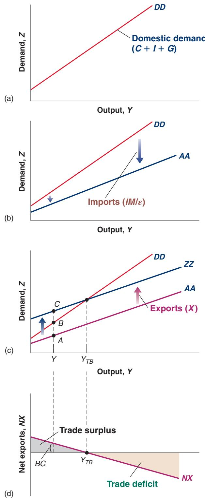
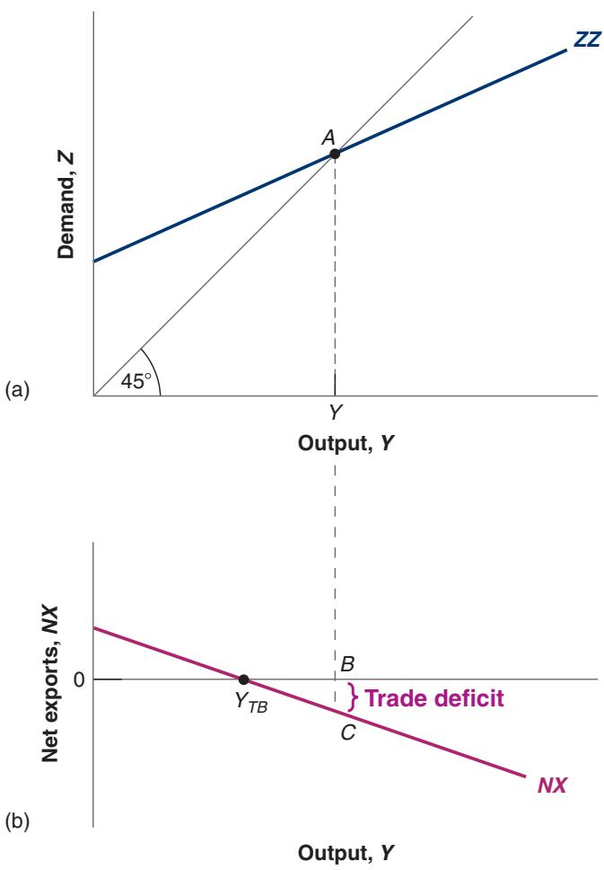
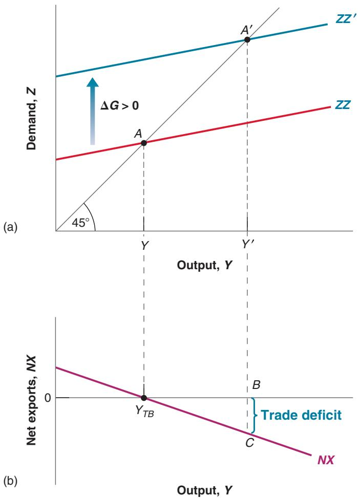
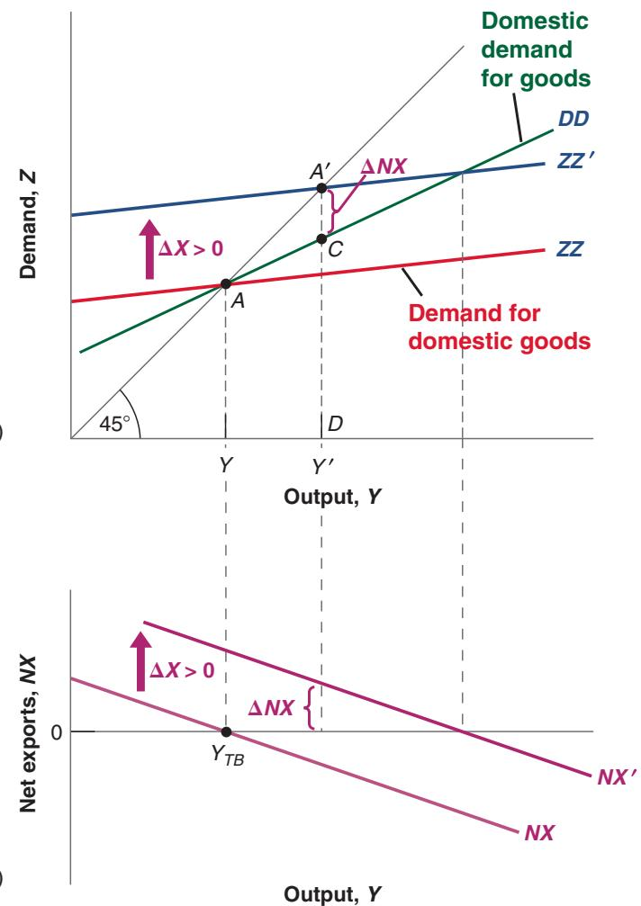

# The Goods Market in an Open Economy

18

n 2009, countries around the world worried about the risk of a recession in the United States, but their worries were not so much for the United States as they were for themselves. To them, a US recession meant lower exports to the United States, a deterioration of their trade position, and weaker growth at home.

Were their worries justified? Figure 17-1 from the previous chapter certainly suggested they were. The US recession clearly led to a world recession. To understand what happened, we must expand the treatment of the goods market in Chapter 3 and account for openness in the analysis of goods markets. This is what we do in this chapter.

Section 18-1 characterizes equilibrium in the goods market for an open economy.

Sections 18-2 and 18-3 show the effects of domestic shocks and foreign shocks on the domestic economy’s output and trade balance.

Section 18-4 looks at the effect of a real depreciation on output and the trade balance.

Section 18-5 gives an alternative description of the equilibrium that shows the close connection among saving, investment, and the trade balance. (It is a really important section. You will think differently about open economy issues after you have read it.)

If you remember one basic message from this chapter, it should be: Output depends on both domestic and foreign demand.

## 18-1 THE IS RELATION IN THE OPEN ECONOMY

“The domestic demand for goods” and “the demand for domestic goods” sound similar but are not the same thing. Part of domestic demand falls on foreign goods. Part of foreign demand falls on domestic goods.

In Chapter 3, I ignored the real exchange rate and subtracted IM, not $I M / \varepsilon .$ . But I was cheating; I did not want to have to talk about the real exchange rate—and complicate matters—so early in the book.

## Domestic demand for goods $C + I + G$

\- Domestic demand for foreign goods (imports), IM>e + Foreign demand for domestic goods (exports), X

When we were assuming the economy was closed to trade, there was no need to distinguish between the domestic demand for goods and the demand for domestic goods; they were the same thing. Now we must distinguish between the two. Some domestic demand falls on foreign goods, and some of the demand for domestic goods comes from foreigners. Let’s look at this distinction more closely.c

= Demand for

domestic goods

$$
C + I + G - I M / \varepsilon + X
$$

## The Demand for Domestic Goods

In an open economy, the demand for domestic goods, Z, is given by

$$
Z = C + I + G - I M / \varepsilon + X\tag{18.1}
$$

The first three terms—consumption, C, investment, I, and government spending, $G -$ constitute the total domestic demand for goods, domestic or foreign. If the economy were closed, $C + I + G$ would also be the demand for domestic goods. This is why, until now, we have only looked at $C + I + G$ . But now we have to make two adjustments:

■ First, we must subtract imports—the part of domestic demand that falls on foreign goods rather than on domestic goods.

We must be careful here. Foreign goods are different from domestic goods, so we cannot just subtract the quantity of imports, IM. If we were to do so, we would be subtracting apples (foreign goods) from oranges (domestic goods). We must first express the value of imports in terms of domestic goods. This is what $I M / \varepsilon$ in equation (18.1) stands for. Recall from Chapter 17 that e, the real exchange rate, is defined as the price of domestic goods in terms of foreign goods. Equivalently, $1 / \varepsilon$ is the price of foreign goods in terms of domestic goods. So IM $( 1 / \varepsilon ) { \mathrm { - } } 0 \Gamma ,$ equivalently, $I M / \varepsilon - \mathrm { i s }$ s the value of imports in terms of domestic goods.

■ Second, we must add exports—the part of demand for domestic goods that comes from abroad. This is captured by the term X in equation (18.1).

## The Determinants of C, I, and G

Having listed the five components of demand, the next task is to specify their determinants. Let’s start with the first three: C, I, and G. Now that we are assuming the economy is open, how should we modify our earlier descriptions of consumption, investment, and government spending? The answer: not very much, if at all. How much consumers decide to spend still depends on their income and their wealth. Although the real exchange rate surely affects the composition of consumption spending between domestic and foreign goods, there is no obvious reason why it should affect the overall level of consumption. The same is true of investment; the real exchange rate may affect whether firms buy domestic machines or foreign machines, but it should not affect total investment.

This is good news because it implies that we can use the descriptions of consumption, investment, and government spending that we developed earlier. Therefore, I assume that domestic demand is given by:

$$
\begin{array}{c} \text {Domestic demand:} C + I + G = C (Y - T) + I (Y, r) + G \\ (+) \quad (+, -) \end{array}
$$

Consumption depends positively on disposable income, $Y \mathrm { ~ - ~ } T ,$ , and investment depends positively on production, Y, and negatively on the real policy rate, r. Note that I leave aside some of the refinements I introduced earlier (i.e., the presence of a risk premium, which we focused on in Chapters 6 and 14, and the role of expectations, which we focused on in Chapters 14 to 16). I want to take things one step at a time to understand the effects of opening the economy; I shall reintroduce some of those refinements later.

## The Determinants of Imports

Imports are the part of domestic demand that falls on foreign goods. What do they depend on? They clearly depend on domestic income. Higher domestic income leads to a higher domestic demand for all goods, both domestic and foreign. So a higher domestic income leads to higher imports. They also clearly depend on the real exchange rate—the price of domestic goods in terms of foreign goods. The more expensive domestic goods are relative to foreign goods—or, equivalently, the cheaper foreign goods are relative to domestic goods—the higher is the domestic demand for foreign goods. So a higher real exchange rate leads to higher imports. Thus, we write imports as:

I again cheat a bit here. Income should include not only domestic income butb also net income and transfers from abroad. For simplicity, I ignore these two additional terms here.

$$
\begin{array}{c} I M = I M (Y, \varepsilon) \\ (+, +) \end{array}\tag{18.2}
$$

Recall the discussion at the start of this chapter. Countries in the rest of the world worry about a US recession because it means a decrease in the US demand for foreign goods.

■ An increase in domestic income, Y (equivalently, an increase in domestic output— income and output are still equal in an open economy), leads to an increase in imports. This positive effect of income on imports is captured by the positive sign under Y in equation (18.2).

■ An increase in the real exchange rate, e (a real appreciation), leads to an increase in imports, IM. This positive effect of the real exchange rate on imports is captured by the positive sign under e in equation (18.2). (As e goes up, IM goes up but 1>e goes down, so what happens to $I M / \varepsilon ,$ the value of imports in terms of domestic goods, is ambiguous. I return to this point below.)

## The Determinants of Exports

Exports are the part of foreign demand that falls on domestic goods. What do they depend on? They depend on foreign income: Higher foreign income means higher foreign demand for all goods, foreign and domestic, and so leads to higher US exports. Exports also depend on the real exchange rate. The higher the price of domestic goods in terms of foreign goods, the lower the foreign demand for domestic goods. In other words, the higher the real exchange rate, the lower are exports.

Let $Y ^ { * }$ denote foreign income (equivalently, foreign output). We therefore write exports as

$$
\begin{array}{c} X = X (Y ^ {*}, \varepsilon) \\ (+, -) \end{array}\tag{18.3}
$$

■ An increase in foreign income, $Y ^ { * }$ , leads to an increase in exports.

■ An increase in the real exchange rate, e, leads to a decrease in exports.

## Putting the Components Together

Figure 18-1 puts together what we have learned so far. It plots the various components of demand against output, keeping constant all other variables (the interest rate, taxes, government spending, foreign output, and the real exchange rate) that affect demand.

In Figure 18-1(a), the line DD plots domestic demand, $C + I + G ,$ , as a function of output, Y. This relation between demand and output is familiar from Chapter 3. Under our standard assumptions, the slope of the relation between demand and output is positive but less than one. An increase in output—equivalently, an increase in

## Figure 18-1

## The Demand for Domestic Goods and Net Exports

(a) The domestic demand for goods is an increasing function of income (output).

(b) and (c) The demand for domestic goods is obtained by subtracting the value of imports from domestic demand and then adding exports.

(d) The trade balance is a decreasing function of output.

income—increases demand but less than one-for-one. (In the absence of good reasons to the contrary, we draw the relation between demand and output, and the other relations in this chapter, as lines rather than curves. This is purely for convenience, and none of the discussions that follow depend on this assumption.)

To arrive at the demand for domestic goods, we must first subtract imports. This is done in Figure 18-1(b) and it gives us the line AA, which represents the domestic demand for domestic goods. The distance between DD and $A A$ equals the value of imports, $I M / \varepsilon$ . Because the quantity of imports increases with income, the distance between the two lines increases with income. We can establish two facts about line AA, which will be useful later in the chapter:

For a given real exchangeb rate e, IM>e—the value of imports in terms of domestic goods—moves exactly with $I M ,$ the quantity of imports.

■ AA is flatter than DD. As income increases, some of the additional domestic demand falls on foreign goods rather than on domestic goods. In other words, as income increases, the domestic demand for domestic goods increases less than total domestic demand.

■ As long as some of the additional demand falls on domestic goods, AA has a positive slope: An increase in income leads to some increase in the demand for domestic goods.

Finally, we must add exports. This is done in Figure 18-1(c) and gives us the line ZZ, which is above AA. The line ZZ represents the demand for domestic goods. The distance between ZZ and AA equals exports, X. Because exports do not depend on domestic income (they depend on foreign income), the distance between ZZ and AA is constant, which is why the two lines are parallel. Because AA is flatter than DD, ZZ is also flatter than DD.

From the information in Figure 18-1(c) we can also characterize the behavior of net exports—the difference between exports and imports 1X - IM>e2—as a function of output. At output level Y, for example, exports are given by the distance AC and imports by the distance AB, so net exports are given by the distance BC.

This relation between net exports and output is represented as the line NX (for Net eXports) in Figure 18-1(d). Net exports are a decreasing function of output: As output increases, imports increase and exports are unaffected, so net exports decrease. Call $Y _ { T B }$ (TB for trade balance) the level of output at which the value of imports equals the value of exports, so that net exports are equal to zero. Levels of output above $Y _ { T B }$ lead to higher imports and to a trade deficit. Levels of output below $Y _ { T B }$ lead to lower imports and to a trade surplus.

Recall that net exports is synonymous with trade balance. Positive net exports correspond to a trade surplus; negative net exports correspond to a trade deficit.

## 18-2 EQUILIBRIUM OUTPUT AND THE TRADE BALANCE

The goods market is in equilibrium when domestic output equals the demand—both domestic and foreign—for domestic goods.

$$
Y = Z
$$

Collecting the relations we derived for the components of the demand for domestic goods, Z, we get

$$
Y = C (Y - T) + I (Y, r) + G - I M (Y, \varepsilon) / \varepsilon + X (Y ^ {*}, \varepsilon)\tag{18.4}
$$

This equilibrium condition determines output as a function of all the variables we take as given, from taxes to the real exchange rate to foreign output. This is not a simple relation; Figure 18-2 represents it graphically in a more user-friendly way.

In Figure 18-2(a), demand is measured on the vertical axis, output (equivalently production or income) on the horizontal axis. The line ZZ plots demand as a function of output; this line just replicates the line ZZ in Figure 18-1(c). ZZ is upward sloping, but with a slope less than 1.

Equilibrium output is at the point where demand equals output, at the intersection of the line ZZ and the 45-degree line: point A in Figure 18-2(a), with associated output level Y.

The equilibrium level of output is given by the

Figure 18-2(b) replicates Figure 18-1(d), drawing net exports as a decreasing function of output. There is in general no reason why the equilibrium level of output, Y, should be the same as the level of output at which trade is balanced, $Y _ { T B } .$ . As shown in the figure, equilibrium output is associated with a trade deficit, equal to the

condition Y = Z. The levelb of output at which there is trade balance is given by the condition $X = I M / \varepsilon$ . These are two different conditions.

## Figure 18-2

## Equilibrium Output and Net Exports

The goods market is in equilibrium when domestic output is equal to the demand for domestic goods. At the equilibrium level of output, the trade balance may show a deficit or a surplus.

As I did in the core, I start with just the goods market and introduce financial markets and labor markets later.

distance BC. The figure could be drawn differently, so that equilibrium output is associated instead with a trade surplus.

We now have the tools needed to answer the questions we asked at the beginning of this chapter.

## 18-3 INCREASES IN DEMAND—DOMESTIC OR FOREIGN

How do changes in demand affect output in an open economy? Let’s start with what is by now an old favorite, an increase in government spending, then turn to a new exercise, on the effects of an increase in foreign demand.

## Increases in Domestic Demand

Suppose the economy is in a recession and the government decides to increase government spending in order to increase domestic demand and, in turn, output. What will be the effects on output and on the trade balance?

The answer is given in Figure 18-3. Before the increase in government spending, demand is given by ZZ in Figure 18-3(a) and the equilibrium is at point A, where output equals Y. Let’s assume that trade is initially balanced—even though, as we have seen, there is no reason why this should be true in general. So, in Figure 18-3(b), $\begin{array} { r } { Y = Y _ { T B } . } \end{array}$

What happens if the government increases spending by ∆G? At any level of output, demand is higher by ∆G, shifting the demand relation up by ∆G from ZZ to ZZ′. The

  
Figure 18-3

The Effects of an Increase in Government Spending

An increase in government spending leads to an increase in output and a trade deficit.

equilibrium point moves from A to $A ^ { \prime }$ and output increases from $Y$ to $Y ^ { \prime }$ . The increase in output is larger than the increase in government spending: There is a multiplier effect.

So far, the story sounds the same as that for a closed economy in Chapter 3. However, there are two important differences:

■ There is now an effect on the trade balance. Because government spending enters neither the exports relation nor the imports relation directly, the relation between net exports and output in Figure 18-3(b) does not shift. So the increase in output from $Y$ to $Y ^ { \prime }$ leads to a trade deficit equal to BC: Imports go up, and exports do not change.

Not only does government spending now generate a trade deficit, but the effect of government spending on output is smaller than it would be in a closed economy. Recall from Chapter 3 that the smaller the slope of the demand relation, the smaller the multiplier (for example, if ZZ were horizontal, the multiplier would be 1). And recall from Figure 18-1 that the demand relation, $\mathrm { Z Z , }$ is flatter than the demand relation in the closed economy, DD. This means the multiplier is smaller in the open economy.

Starting from trade balance, an increase in government spending leads to a trade b deficit.

The trade deficit and the smaller multiplier have the same origin. Because the economy is open, an increase in demand now falls not only on domestic goods but also on foreign goods. So when income increases, the effect on the demand for domestic goods is smaller than it would be in a closed economy, leading to a smaller multiplier. And because some of the increase in demand falls on imports—and exports are unchanged—the result is a trade deficit.

An increase in government spending increases output. The multiplier is smaller than b in a closed economy.

The smaller multiplier and the trade deficit have the same origin. Some domestic demand falls on foreign b goods.

These two implications are important. In an open economy, an increase in domestic demand has a smaller effect on output than in a closed economy, and an adverse effect on the trade balance. Indeed, the more open the economy, the smaller the effect on output and the larger the adverse effect on the trade balance. Take the Netherlands, for example. As we saw in Chapter 17, the Netherlands’ ratio of exports to GDP is very high. It is also true that the Netherlands’ ratio of imports to GDP is very high. When domestic demand increases in the Netherlands, much of the increase in demand is likely to result in an increase in the demand for foreign goods rather than domestic goods. The effect of an increase in government spending is therefore likely to be a large increase in the Netherlands’ trade deficit and only a small increase in its output, making domestic demand expansion a rather unattractive policy for the Netherlands. Even for the United States, which has a much lower import ratio, an increase in demand will be associated with a worsening of the trade balance.

## Increases in Foreign Demand

Consider now an increase in foreign output, that is, an increase in $Y ^ { \ast }$ . This could be due to an increase in foreign government spending, $G ^ { * } .$ —the policy change we just analyzed, but now taking place abroad. But we do not need to know where the increase in $Y ^ { * }$ comes from to analyze its effects on the US economy.

Figure 18-4 shows the effects of an increase in foreign activity on domestic output and the trade balance. The initial demand for domestic goods is given by ZZ in

Figure 18-4

The Effects of an Increase in Foreign Demand

An increase in foreign demand leads to an increase in output and a trade surplus.

Figure 18-4(a). The equilibrium is at point A, with output level Y. Let’s again assume trade is balanced, so that in Figure 18-4(b) the net exports associated with Y equal zero $\left( { { Y } } = { { Y } _ { T B } } \right)$

It will be useful below to refer to the line that shows the domestic demand for goods $C + I + G$ as a function of income. This line is drawn as DD. Recall from Figure 18-1 that DD is steeper than ZZ. The difference between ZZ and DD equals net exports, so that if trade is balanced at point A, then ZZ and DD intersect at point A.

Now consider the effects of an increase in foreign output, $\Delta Y ^ { * }$ (for the moment, ignore the line DD; we need it only later). Higher foreign output means higher foreign demand, including higher foreign demand for US goods. So the direct effect of the increase in foreign output is an increase in US exports by some amount, which we shall denote by ∆X.

DD is the domestic demand for goods. ZZ is the demand for domestic goods. Theb difference between the two is equal to the trade deficit.

■ For a given level of output, this increase in exports leads to an increase in the demand for US goods by ∆X, so the line showing the demand for domestic goods as a function of output shifts up by ∆X, from ZZ to ZZ′.

■ For a given level of output, net exports go up by ∆X. So the line showing net exports as a function of output in Figure 18-4(b) also shifts up by ∆X, from NX to NX′.

The new equilibrium is at point A′ in Figure 18-4(a), with output level Y′. The increase in foreign output leads to an increase in domestic output: Higher foreign output leads to higher exports of domestic goods, which increases domestic output and the domestic demand for goods through the multiplier.

What happens to the trade balance? We know that exports go up. But could it be that the increase in domestic output leads to such a large increase in imports that the trade balance actually deteriorates? No: The trade balance must improve. To see why, note that, when foreign demand increases, the demand for domestic goods shifts up from ZZ to ZZ′; but the line DD, which gives the domestic demand for goods as a function of output, does not shift. At the new equilibrium level of output Y′, domestic demand is given by the distance DC, and the demand for domestic goods is given by DA′. Net exports are therefore given by the distance CA′—which, because DD is necessarily below ZZ′, is necessarily positive. Thus, the increase in imports does not offset the increase in exports, and the trade balance improves.

Y\* directly affects exports and so enters the relation between the demand for domestic goods and output. An increase in Y\* shifts ZZ up. Y\* does not affect domestic consumption, domestic investment, or domestic government spending directly, and so it does not enter the relation between the domesticb demand for goods and output. An increase in Y\* does not shift DD.

An increase in foreign outputb increases domestic output and improves the trade balance.

## Fiscal Policy Revisited

We have derived two results so far:

An increase in domestic demand leads to an increase in domestic output but also to a deterioration of the trade balance. (We looked at an increase in government spending, but the results would have been the same for a decrease in taxes, an increase in consumer spending, and so on.)

■ An increase in foreign demand (which could come from the same types of changes taking place abroad) leads to an increase in domestic output and an improvement in the trade balance.

These results, in turn, have two important implications. Both were in evidence during the Great Financial Crisis.

First, and most obviously, they imply that shocks to demand in one country affect other countries. The stronger the trade links between countries, the stronger the interactions, and the more countries will move together. This is what we saw in Figure 17–1. Although the crisis started in the United States, it quickly affected the rest of the world. Trade links were not the only reason; financial links also played a central role. But the evidence points to a strong effect of trade, starting with a decrease in exports from other countries to the United States.
