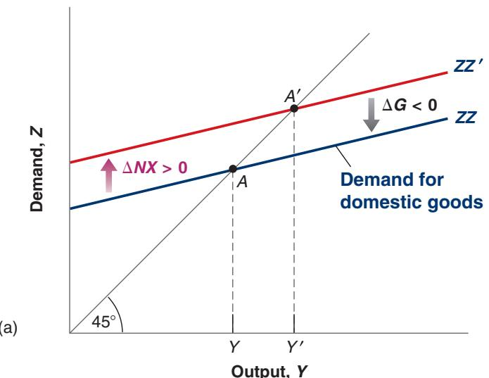
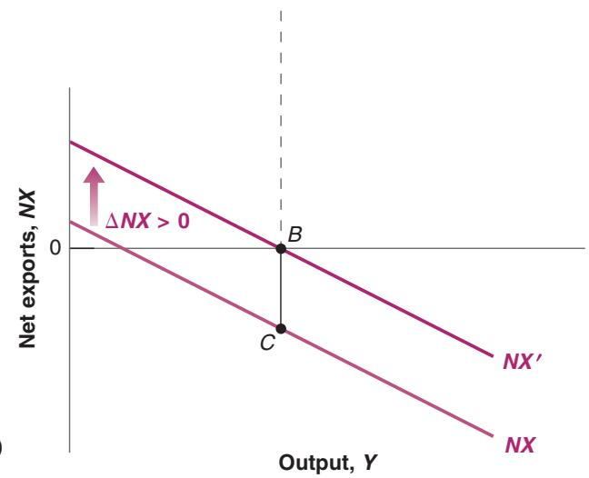

# Depreciation and the Trade Balance: the Marshall-Lerner Condition

Return to the definition of net exports:

More concretely, if the dollar depreciates vis-à-vis the yen by 10%:

US goods will be cheaper in Japan, leading to a larger quantity of US exports to Japan.

Japanese goods will be more expensive in the United States, leading to a smaller quantity of imports of Japanese goods to the United States and a higher import bill for a given quantity of imports of Japanese goods to the United States.

$$
N X = X - I M / \varepsilon
$$

Replace X and IM by their expressions from equations (18.2) and (18.3):

$$
N X = X (Y ^ {*}, \varepsilon) - I M (Y, \varepsilon) / \varepsilon
$$

As the real exchange rate e enters the right side of the equation in three places, this makes it clear that the real depreciation affects the trade balance through three separate channels:

■ Exports, X, increase. The real depreciation makes US goods relatively less expensive abroad. This leads to an increase in foreign demand for US goods—an increase in US exports.

■ Imports, IM, decrease. The real depreciation makes foreign goods relatively more expensive in the United States. This leads to a shift in domestic demand toward domestic goods and to a decrease in the quantity of imports.

■ The relative price of foreign goods in terms of domestic goods, 1>e, increases. For given IM, this increases the import bill, IM>e. The same quantity of imports now costs more to buy (in terms of domestic goods).

For the trade balance to improve following a depreciation, exports must increase enough and imports must decrease enough to compensate for the increase in the price of imports. The condition under which a real depreciation leads to an increase in net exports is known as the Marshall-Lerner condition. (It is derived formally in the appendix, called “Derivation of the Marshall Lerner-Condition,” at the end of this chapter.) It turns out—with a complication we will state when we introduce dynamics later in this chapter—that this condition is satisfied in reality. So, for the rest of this book, I shall assume that a real depreciation—a decrease in e—leads to an increase in net exports— an increase in NX.

## The Effects of a Real Depreciation

We have looked so far at the direct effects of a depreciation on the trade balance—that is, the effects given US and foreign output. But the effects do not end there. The change in net exports changes domestic output, which further affects net exports.

Because the effects of a real depreciation are much like those of an increase in foreign output, we can use Figure 18-4 to show the effects of an increase in foreign output.

Just like an increase in foreign output, a depreciation leads to an increase in net exports (assuming, as we do, that the Marshall-Lerner condition holds) at any level of output. Both the demand relation (ZZ in Figure 18-4(a)) and the net exports relation (NX in Figure 18-4(b)) shift up. The equilibrium moves from A to $A ^ { \prime }$ , and output increases from Y to Y′. By the same argument we used previously, the trade balance improves. The increase in imports induced by the increase in output is smaller than the direct improvement in the trade balance induced by the depreciation.

To summarize: The depreciation leads to a shift in demand, both foreign and domestic, toward domestic goods. This shift in demand leads, in turn, to both an increase in domestic output and an improvement in the trade balance.

Although a depreciation and an increase in foreign output have the same effect on domestic output and the trade balance, there is a subtle but important difference between the two. A depreciation works by making foreign goods relatively more expensive. But this means that, for a given income, people—who now pay more to buy foreign goods because of the depreciation—are worse off. This mechanism is strongly felt in countries that go through a large depreciation. Governments trying to achieve a large depreciation often find themselves with strikes and riots in the streets as people react to the much higher prices of imported goods. This was the case in Mexico, for example, where the large depreciation of the peso in 1994–1995—from 29 cents per peso in November 1994 to 17 cents per peso in May 1995—led to a large decline in workers’ living standards and to social unrest.

## Combining Exchange Rate and Fiscal Policies

There is an alternative to rioting asking for and obtaining an increase in wages. But if wages increase, the prices of domestic goods will increase as well, leading to a smaller real depreciation.

Suppose output is at its natural level but the economy is running a large trade deficit. The government would like to reduce the trade deficit while leaving output unchanged so as to avoid overheating. What should it do?

To discuss this mechanism,b we need to look at the supply side in more detail than we have done so far. We return to the dynamics of depreciation, wage and price movements in Chapter 20.

A depreciation alone will not do. It will reduce the trade deficit, but it will also increase output. Nor will a fiscal contraction do. It will reduce the trade deficit, but it will decrease output. What should the government do? The answer: Use the right combination of depreciation and fiscal contraction. Figure 18-5 shows what this combination should be.

Suppose the initial equilibrium in Figure 18-5(a) is at A, associated with output Y. At this level of output, there is a trade deficit, given by the distance BC in Figure 18-5(b).

  
Figure 18-5  
Reducing the Trade Deficit without Changing Output  
To reduce the trade deficit without changing output, the government must both achieve a depreciation and decrease government spending.

<table><tr><td colspan="3">Table 18-1 Exchange Rate and Fiscal Policy Combinations</td></tr><tr><td colspan="3"></td></tr><tr><td>Initial Conditions</td><td>Trade Surplus</td><td>Trade Deficit</td></tr><tr><td>Low output</td><td>ε? G↑</td><td>ε↓G?</td></tr><tr><td>High output</td><td>ε↑G?</td><td>ε? G↓</td></tr></table>

If the government wants to eliminate the trade deficit without changing output, it must do two things:

一 It must achieve a depreciation sufficient to eliminate the trade deficit at the initial level of output. So the depreciation must be such as to shift the net exports relation from NX to NX′ in Figure 18-5(b). The problem is that this depreciation, and the associated increase in net exports, also shifts the demand relation in Figure 18-5(a) from ZZ to ZZ′. In the absence of other measures, the equilibrium would move from A to A′ and output would increase from Y to Y′.

■ To avoid the increase in output, it must therefore reduce government spending so as to shift ZZ′ back to ZZ. This combination of a depreciation and a fiscal contraction leads to the same level of output and an improved trade balance.

If this combination seems quite different from the policy adopted by the Trump administration to reduce the US trade deficit, you are right. More on this in Chapter 19.

A general lesson: If you want to achieve two targets (here, output and trade balance), you better use two instruments (here, fiscal policy and the exchange rate).

There is a general point behind this example. To the extent that governments care about both the level of output and the trade balance, they have to use both fiscal policy and exchange rate policies. We just saw one such combination. Table 18-1 gives you others, depending on the initial output and trade situation. Take, for example, the box in the top right corner of the table: Initial output is too low (put another way, unemployment is too high) and the economy has a trade deficit. A depreciation will help on both the trade and the output fronts: It reduces the trade deficit and increases output. But there is no reason for the depreciation to achieve both the correct increase in output and the elimination of the trade deficit. Depending on the initial situation and the relative effects of the depreciation on output and the trade balance, the government may need to complement the depre-ciation with either an increase or a decrease in government spending. This ambiguity is captured by the question mark. Make sure that you understand the logic behind each of the other three boxes. (For another example of the role of the real exchange rate and output in affecting the current account balance, look at the Focus Box “The Disappearance of the Current Account Deficit in Greece: Good News or Bad News?”)
