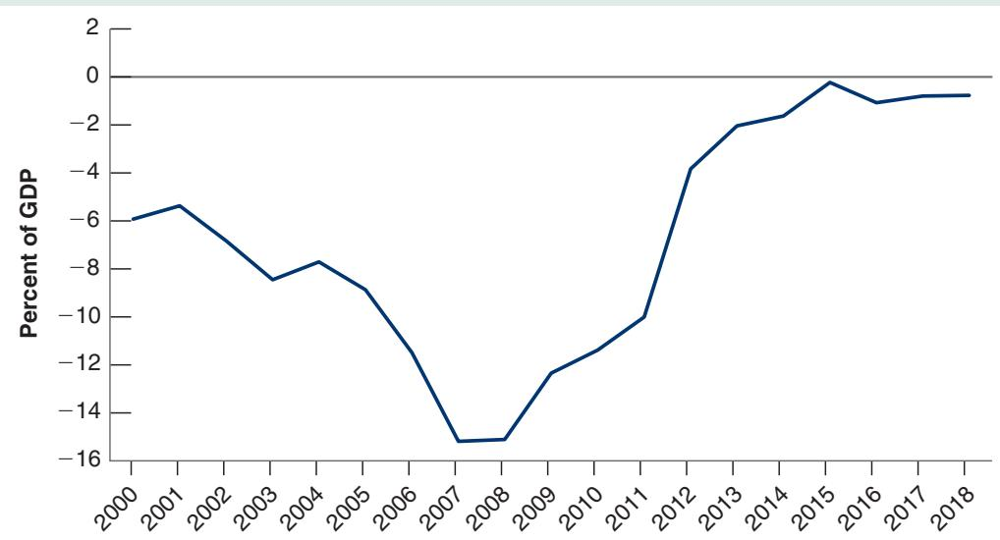
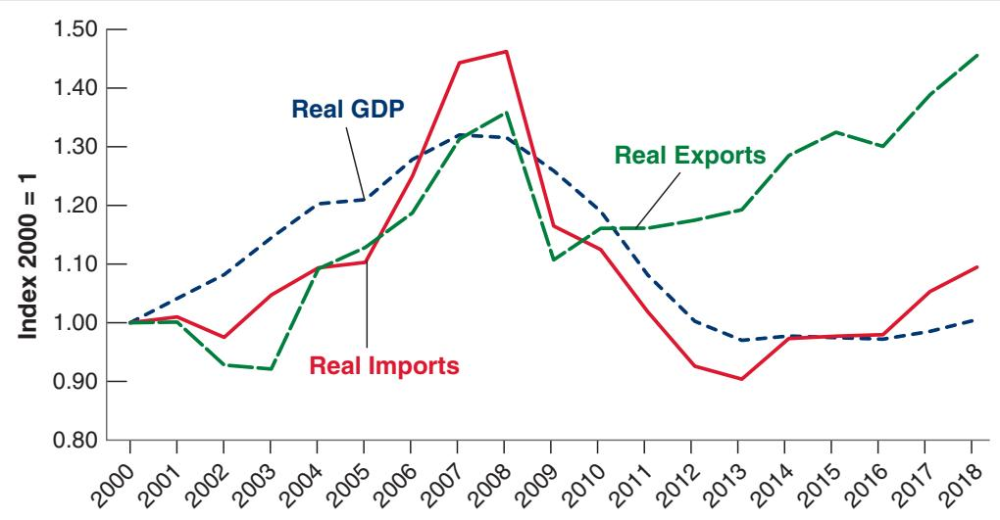

# The Disappearance of the Current Account Deficit in Greece: Good News or Bad News?

Starting in the early 2000s, several euro periphery countries ran larger and larger current account deficits. Particularly striking was the increase in the current account deficit of Greece. As shown in Figure 1, the current account went from an already large deficit of 6% of GDP in 2000 to more than 15% in 2008. When the Great Financial crisis started, Greece found it increasingly difficult to borrow abroad, forcing it to reduce borrowing and thus to reduce its current account deficit. But by 2018, the current account deficit was less than 1% of GDP.

It is an impressive turnaround. Is it unambiguously good news? Not necessarily. The discussion in the text suggests that there are two ways a current account may improve. The first is that the country becomes more competitive: The real exchange rate decreases, exports increase, imports decrease, and the current account balance improves. The second is that the country’s output decreases: Exports, which depend on what happens in the rest of the world, may remain the same, but imports come down with output, and the current account balance improves.

Unfortunately, the evidence is that the second mechanism played a central role in the adjustment.

Given that Greece is a member of the euro area, it could not rely on an adjustment of the nominal exchange rate to become more competitive, at least vis-à-vis its euro partners. It had to rely on a decrease in wages and prices, and this has proven to be slow and difficult (more on this in Chapter 20).

  
Figure 1  
The Evolution of the Greek Current Account Deficit since 2000  
Source: IMF Managing Director Dominique Strauss-Kahn Calls G-20 Action Plan Significant Step toward Stronger International Cooperation, Press Release No. 08/286, November 15, 2008.

Instead, much of the adjustment has taken place through a decrease in imports, triggered by a decrease in output, an adjustment known as import compression. Figure 2 shows the evolution of imports, exports, and GDP in Greece since 2000. All three series are normalized to equal 1.0 in 2000. Note first how much output has decreased from its peak, by roughly 30% since 2008. Note then how imports have moved in tandem with output, also decreasing by 36% since 2008. Exports have done better but not great. After sharply decreasing in 2009, reflecting the world crisis and the decrease in demand from the rest of the world, they are only 10% above their

2008 level (world output growth since 2008 has been a cumulative 34%).

In short, the disappearance of the current account deficit in Greece is, on net, largely bad news. Turning to the future, what happens to the current account next depends largely on what happens to output, and this in turn depends on where output is relative to potential output. If much of the decrease in actual output reflects a decrease in potential output, then output will remain low and the current account will remain in balance. If, as seems more likely, actual output is still far below potential output (if there is, in the terminology of Chapter 9, a large negative output gap), then unless further real depreciation takes place, the return of output to potential will come with higher imports, and thus a likely return to current account deficits.

  
Figure 2  
Imports, Exports, and GDP in Greece since 2000  
Source: IMF Managing Director Dominique Strauss-Kahn Calls G-20 Action Plan Significant Step toward Stronger International Cooperation, Press Release No. 08/286, November 15, 2008.
