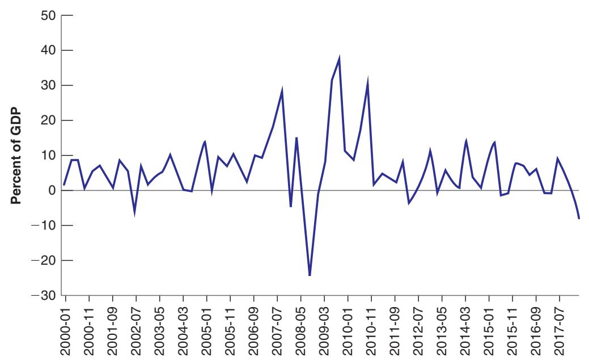
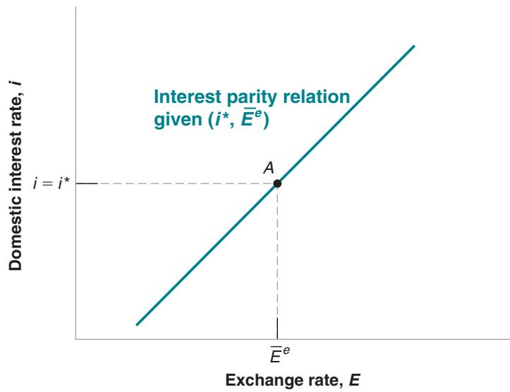
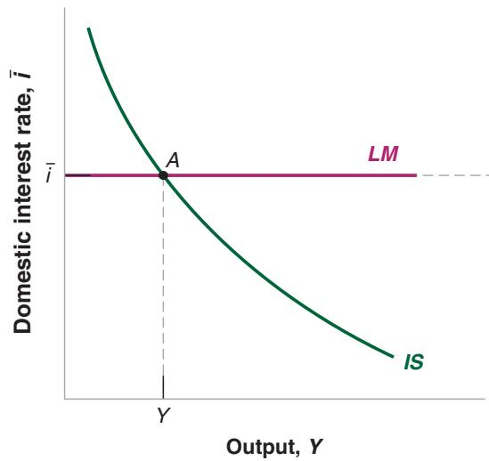
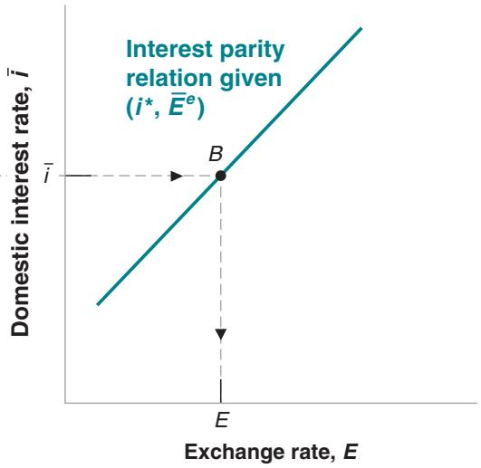
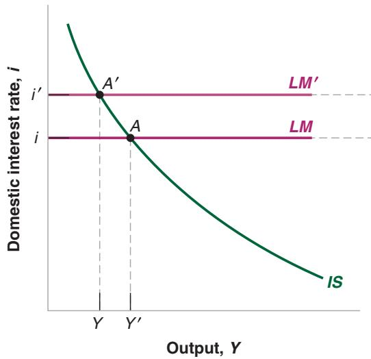
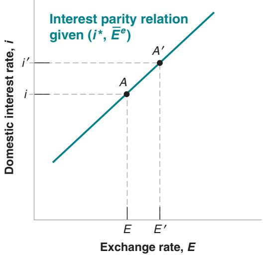
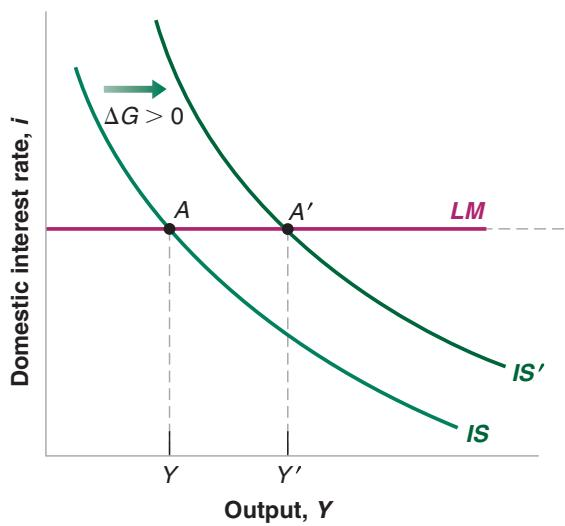
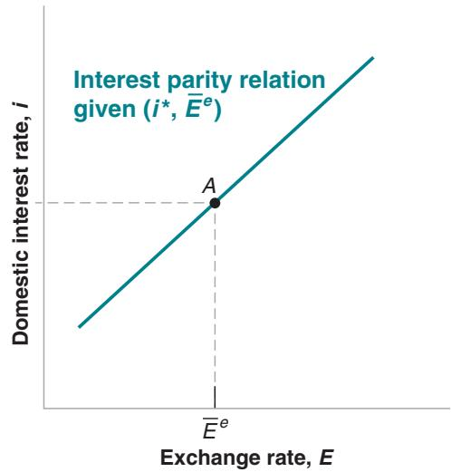
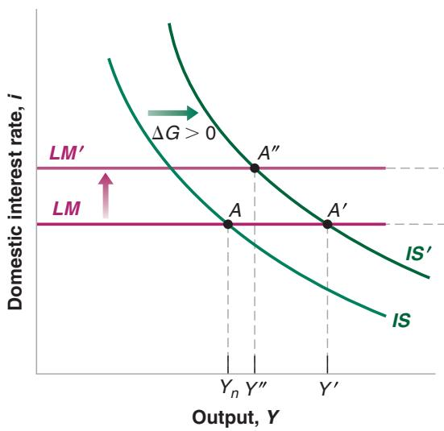
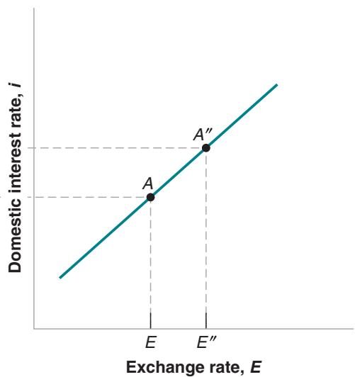

# Capital Flows, Sudden Stops, and the Limits to the Interest Parity Condition

The interest parity condition assumes that financial investors care only about expected returns. But as we discussed in Chapter 14, investors also care about risk and liquidity. Much of the time, one can leave aside these other factors. Sometimes, however, they play a big role in investors’ decisions and in determining exchange rate movements. The perception that risk has increased leads investors to want to sell most or all the assets they have in a country, no matter what the interest rate. These selling episodes, which have affected many Latin American and Asian emerging economies in the past, are known as sudden stops. During these episodes, the interest parity condition fails, and the exchange rate of these emerging market countries may fall a lot without much change in domestic or foreign interest rates.

The start of the Great Recession was associated with large capital movements, which also had little to do with expected returns. Worried about uncertainty, many investors from advanced countries decided to take their funds home, where they felt safer. (Ironically, even though the crisis originated from the United States, the United States was still seen as a safe haven, leading many investors to sell emerging market countries’ assets and buy US assets.) The result was large capital outflows from several emerging countries. An example is given in Figure 1, which shows the net purchases of Brazilian equities by foreign investors from 2000 on. Note that the flows turned sharply negative in the second half of 2008, going from nearly 30% of annual GDP to-25%, only to rebound in 2009. (Negative net purchases indicate that foreign investors sold more stocks than they bought during the quarter.)

The sharp negative flows had major effects on Brazil and other emerging market countries, leading to strong downward pressure on their exchange rates and serious problems in their financial systems. For example, domestic banks that had relied on foreign investors for funds found themselves short of funds, which forced them to cut lending to domestic firms and households. This was an important channel of transmission of the crisis from the United States to the rest of the world.

Further reading: Among the countries affected by large capital outflows in 2008 and 2009 were several small advanced economies, notably Ireland and Iceland. A number of these countries had built up the same financial vulnerabilities as the United States (those we studied in Chapter 6) and suffered badly. A good and easy read is Michael Lewis’s chapters on Ireland and Iceland in Boomerang: Travels in a New Third World (2011, Norton Books).

  
Figure 1  
Net Purchases of Brazilian Equities since 2000  
Source: IMF BOP statistics.

This relation tells us that the current exchange rate depends on the domestic interest rate, the foreign interest rate, and the expected future exchange rate.

■ An increase in the domestic interest rate leads to an increase in the exchange rate.

■ An increase in the foreign interest rate leads to a decrease in the exchange rate.

■ An increase in the expected future exchange rate leads to an increase in the current exchange rate.

This relation plays a central role in the real world and will play a central role in this chapter. Consider the following example:

Think of financial investors—investors, for short—choosing between US bonds and Japanese bonds. Suppose that the one-year interest rate on both is 2%. The current exchange rate is 100 (one dollar is worth 100 yen), and the expected exchange rate a year from now is also 100. Under these assumptions, both US and Japanese bonds have the same expected return in dollars, and the interest parity condition holds.

Suppose that investors now expect the exchange rate, for whatever reason, to be 10% higher a year from now, so $\bar { E } ^ { e }$ is now equal to 110. At an unchanged current exchange rate, US bonds are now much more attractive than Japanese bonds. Both offer an interest rate of 2%, in dollars or yen, but a year from today the yen are now expected to be worth 10% less in terms of dollars. In terms of dollars, the return on Japanese bonds is therefore 2% (the interest rate) -10% (the expected depreciation of the yen relative to the dollar), $\mathrm { o r } - 8 \%$

What, then, will happen to the current exchange rate? At the initial exchange rate of 100, investors will want to shift out of Japanese bonds into US bonds. To do so, they must first sell Japanese bonds for yen, then sell yen for dollars, and then use the dollars to buy US bonds. As investors sell yen and buy dollars, the dollar will appreciate relative to the yen. By how much? Equation (19.5) gives the answer: $E = \left( 1 . 0 2 / 1 . 0 2 \right) 1 1 0 = 1 1 0 .$ The current exchange rate must increase in the same proportion as the expected future exchange rate. Put another way, the dollar must appreciate today by 10%. When it has appreciated by 10%, so $E = \bar { E } ^ { e } = 1 1 0$ , the expected returns on US and Japanese bonds are again equal, and there is equilibrium in the foreign exchange market.

An increase in $\bar { E } ^ { e }$ is an expected appreciation of the dollar relative to the yen.b Equivalently, it is an expected depreciation of the yen relative to the dollar.

Suppose instead that the Fed raises the domestic interest rate from 2% to 5%. Assume that the Japanese interest rate remains unchanged at 2%, and the expected future exchange rate remains unchanged at 100. At an unchanged current exchange rate, US bonds are again more attractive than Japanese bonds. US bonds yield a return of 5% in dollars. Japanese bonds give a return of 2% in yen, and—because the exchange rate is expected to be the same next year as it is today—an expected return of 2% in dollars as well.

Now what will happen to the current exchange rate? Again, at the initial exchange rate of 100, investors will want to shift out of Japanese bonds into US bonds. As they do so, they sell yen for dollars and the dollar will appreciate. By how much? Equation (19.5) gives the answer: $E = \left( 1 . 0 5 / 1 . 0 2 \right) 1 0 0 \approx 1 0 3$ . The current exchange rate will increase by approximately 3%.

Why 3%? Think of what happens when the dollar appreciates. If, as we have assumed, investors do not change their expectation of the future exchange rate, then the more the dollar appreciates today, the more investors expect it to depreciate in the future (as it is expected to return to the same value in the future). When the dollar has appreciated by 3% today, investors expect it to depreciate by 3% during the coming year. Equivalently, they expect the yen to appreciate relative to the dollar by 3% over the coming year. The expected rate of return in dollars from holding Japanese bonds is therefore 2% 1the interest rate in yen2 + 3% (the expected yen appreciation), or 5%. This expected rate of return is the same as the rate of return on holding US bonds, so there is equilibrium in the foreign exchange market.

Make sure you understand the argument. Why doesn’t the dollar appreciate by, say, 20%?

Figure 19-1

The Relation between the Interest Rate and the Exchange Rate Implied by Interest Parity

A higher domestic interest rate leads to a higher exchange rate—an appreciation.

Note that our argument relies heavily on the assumption that, when the interest rate changes, the expected exchange rate remains unchanged. This implies that an appreciation today leads to an expected depreciation in the future because the exchange rate is expected to return to the same, unchanged, value. We shall relax the assumption that the expected future exchange rate is fixed in Chapter 20. But the basic conclusion will remain: An increase in the domestic interest rate relative to the foreign interest rate leads to an appreciation of the domestic currency.

Figure 19-1 plots the relation between the domestic interest rate, i, and the exchange rate, E, implied by equation (19.5)—the interest parity relation. The relation is drawn for a given expected future exchange rate, $\bar { E } ^ { e } ,$ , and a given foreign interest rate, $\smash { i ^ { * } , }$ , and is represented by an upward-sloping line. The higher the domestic interest rate, the higher the exchange rate. Equation (19.5) also implies that when the domestic interest rate is equal to the foreign interest rate $( i = i ^ { * } )$ , the exchange rate is equal to the expected future exchange rate $\left( E = \hat { E } ^ { e } \right)$ . This implies that the line corresponding to the interest parity condition goes through point A (where i = i\*) in the figure.

## 19-3 PUTTING GOODS AND FINANCIAL MARKETS TOGETHER

We now have the elements we need to understand the movements of output, the interest rate, and the exchange rate.

Goods market equilibrium implies that output depends, among other factors, on the interest rate and the exchange rate:

$$
Y = C (Y - T) + I (Y, i) + G + N X (Y, Y ^ {*}, E)
$$

Let’s think of the interest rate, i, as the policy rate set by the central bank:

$$
i = \overline {{i}}
$$

And the interest parity condition implies a positive relation between the domestic interest rate and the exchange rate:

$$
E = \frac {1 + i}{1 + i ^ {*}} \bar {E} ^ {e}
$$

Together, these three relations determine output, the interest rate, and the exchange rate. Working with three equations and three variables is not easy. But we can easily reduce them to two by using the interest parity condition to eliminate the exchange rate in the goods market equilibrium relation. Doing this gives us the following two equations, the open economy versions of the IS and LM relations:

$$
\begin{array}{l l} I S \colon & Y = C (Y - T) + I (Y, i) + G + N X \bigg (Y, Y ^ {*}, \frac {1 + i}{1 + i ^ {*}} \bar {E} ^ {e} \bigg) \\ L M \colon & i = \overline {{i}} \end{array}
$$

Together, the two equations determine the interest rate and equilibrium output. Using equation (19.5) then gives us the implied exchange rate. Take the IS relation first and consider the effects of an increase in the interest rate on output. An increase in the interest rate now has two effects:

■ The first effect, which was already present in a closed economy, is the direct effect on investment. A higher interest rate leads to a decrease in investment, a decrease in the demand for domestic goods, and a decrease in output.

■ The second effect, which is present in the open economy, is the effect through the exchange rate. A higher interest rate leads to an increase in the exchange rate—an appreciation. The appreciation, which makes domestic goods more expensive relative to foreign goods, leads to a decrease in net exports, and therefore a decrease in the demand for domestic goods and a decrease in output.

Both effects work in the same direction. An increase in the interest rate decreases demand directly and indirectly—through the adverse effect of the appreciation on demand.

The IS relation between the interest rate and output is drawn in Figure 19-2(a), for given values of all the other variables in the relation—T, G, Y\*, i\*,and $\bar { E } ^ { e } .$ . The IS curve is downward sloping: An increase in the interest rate leads to lower output. The curve looks much the same as in the closed economy, but it hides a more complex relation than before. The interest rate affects output not only directly but also indirectly through the exchange rate.

The LM relation is the same as in the closed economy: it is a horizontal line, at the level of the interest rate i set by the central bank.

An increase in the interest rate leads, both directly and indirectly (through the exchange rate), to a decrease in output.

(a)  

(b)  
  
Chapter 19 Output, the Interest Rate, and the Exchange Rate

## Figure 19-2

## The IS-LM Model in an Open Economy

An increase in the interest rate reduces output both directly and indirectly (through the exchange rate). The IS curve is downward sloping, for both reasons. The LM curve is horizontal, as in Chapter 6.

Equilibrium in the goods and financial markets is attained at point A in Figure 19-2(a), with output level Y and interest rate i . The equilibrium value of the exchange rate cannot be read directly from the graph. But it is easily obtained from Figure 19-2(b), which replicates Figure 19-1 and gives the exchange rate associated with a given interest rate found at point B, given the foreign interest rate i\* and the expected exchange rate. The exchange rate associated with the equilibrium interest rate i is equal to E.

Let’s summarize. We have derived the IS and LM relations for an open economy:

The IS curve is downward sloping. An increase in the interest rate leads both directly and indirectly (through the exchange rate) to a decrease in demand and a decrease in output.

The LM curve is horizontal at the interest rate set by the central bank.

Equilibrium output and the equilibrium interest rate are given by the intersection of the IS and LM curves. Given the foreign interest rate and the expected future exchange rate, the equilibrium interest rate determines the equilibrium exchange rate.

## 19-4 THE EFFECTS OF POLICY IN AN OPEN ECONOMY

Having derived the IS-LM model for the open economy, we can now put it to use and look at the effects of monetary and fiscal policy.

## The Effects of Monetary Policy in an Open Economy

Let’s start from the effects of the central bank’s decision to increase the domestic interest rate. Look at Figure 19-3(a). At a given level of output, with a higher interest rate, the LM curve shifts up, from LM to LM¿. The IS curve does not shift (remember that the IS curve shifts only if G or T or Y \* or i\* change). The equilibrium moves from point A to point A¿. In Figure 19-3(b), the increase in the interest rate leads to an appreciation.

Can you tell what happens to net exports? (The answer is no: They can go either way. Make

So, in an open economy, monetary policy works through two channels: First, as in the closed economy, it works through the effect of the interest rate on spending; second, it works through the effect of the interest rate on the exchange rate and the effect of the exchange rate on exports and imports. Both effects work in the same direction. In the case of a monetary contraction, the higher interest rate and the appreciation decrease both demand and output.c

sure you understand why.)

## Figure 19-3

The Effects of an Increase in the Interest Rate

An increase in the interest rate leads to a decrease in output and an appreciation.

(a)  

(b)  

## The Effects of Fiscal Policy in an Open Economy

Let’s look now at a change in government spending. Suppose that, starting from a balanced budget, the government decides to increase defense spending without raising taxes and so runs a budget deficit. What happens to the level of output? To the composition of output? To the interest rate? To the exchange rate?

Let us first assume that before the increase in government spending, the level of out put, Y, was below potential. If the increase in G moves output toward potential, but not above potential, the central bank will not be worried that inflation might increase (remember our discussion in Chapter 9, particularly Figure 9-2 and will keep the interest rate unchanged. What happens to the economy is described in Figure 19-4. The economy is initially at point A. The increase in government spending, $\Delta G > 0$ ,increases output at a given interest rate, shifting the IS curve to the right, from IS to IS¿ in Figure 19-4(a). Because the central bank does not change the policy rate, the LM curve does not shift. The new equilibrium is at point A¿, with a higher level of output, $Y ^ { \prime }$ . In panel (b), because the interest rate has not changed, neither has the exchange rate. So an increase in government spending, when the central bank keeps the interest rate unchanged, leads to an increase in output with no change in the exchange rate.

Can we tell what happens to the various components of demand?

An increase in government spending shifts the IS curve to the right. It shifts neitherb the LM curve nor the interest parity line.

■ Clearly, both consumption and government spending increase: Consumption goes up because of the increase in income; government spending goes up by assumption.

■ Investment also rises because it depends on both output and the interest rate: $I = I ( Y , i )$ Here output rises and the interest rate does not change, thus investment rises.

What about net exports? Recall that net exports depend on domestic output, foreign output, and the exchange rate: $N X = N X ( Y , Y ^ { * } , E )$ . Foreign output is unchanged, as we are assuming that the rest of the world does not respond to the increase in domestic government spending. The exchange rate is also unchanged, because the interest rate does not change. We are left with the effect of higher domestic output; as the increase in output increases imports at an unchanged exchange rate, net exports decrease. As a result, the budget deficit leads to a deterioration of the trade balance. If trade was balanced to start, then the budget deficit leads to a trade deficit. Note that, although an increase in the budget deficit increases the trade deficit, the effect is far from mechanical. It works through the effect of the budget deficit on output and, in turn, on the trade deficit.

Now assume instead that the increase in G happens in an economy where output is close to potential output, Yn. The government could decide to increase government spending even if the economy is already at potential output because, for example, it

(a)  

(b)  
  
Figure 19-4  
The Effects of an Increase in Government Spending with an Unchanged Interest Rate  
An increase in government spending leads to an increase in output. If the central bank keeps the interest rate unchanged, the exchange rate also remains unchanged.  
Chapter 19 Output, the Interest Rate, and the Exchange Rate

## Figure 19-5

The Effects of an Increase in Government Spending When the Central Bank Responds by Raising the Interest Rate

An increase in government spending leads to an increase in output. If the central bank responds by raising the interest rate, the exchange rate will appreciate.

(a)  

(b)  

needs to pay for an exceptional event, such as a big flood, and wants to postpone tax increases. Or it could do it for political reasons, because it wants to increase spending but does not want to increase taxes (more on this in Chapter 22). In this case the central bank will worry that the increase in G, by moving the economy above potential output, might push inflation up. It is likely to respond by raising the interest rate. What happens then is described in Figure 19-5. At an unchanged interest rate, output would increase from $Y _ { n }$ to $Y ^ { \prime }$ and the exchange rate would not change. But if the central bank accompanies the increase in government spending with an increase in the interest rate, output will increase by less, from $Y _ { n } \mathrm { t o } Y ^ { \prime \prime }$ , and the exchange rate will appreciate, from E to $E ^ { \prime \prime }$

Again, can we tell what happens to the various components of demand?

■ As before, both consumption and government spending increase: consumption goes up because of the increase in income, and government spending goes up by assumption.

■ What happens to investment is now ambiguous. Investment depends on both output and the interest rate: $I = I ( Y , i )$ . Here output rises, but so does the interest rate.

■ Net exports decrease for two reasons: Output goes up, increasing imports; the exchange rate appreciates, increasing imports and decreasing exports. The budget deficit leads to a trade deficit. (Whether, however, the trade deficit is larger than if the policy rate remained constant is ambiguous. The appreciation makes it worse, but the higher interest rate leads to a smaller increase in output and thus a smaller increase in imports.)

This version of the IS-LM model for the open economy was first put together in the 1960s by the two economists I mentioned at the outset of the chapter, Robert Mundell, at Columbia University, and Marcus Fleming, at the International Monetary Fund—although their model reflected the economies of the 1960s, when central banks used to set the supply of money, M, rather than the interest rate as they do today (remember our discussions in Chapters 4 and 6), so their model was slightly different from the model presented here.

Robert Mundell was awarded the Nobel Prize in Economics in 1999.

How well does the Mundell-Fleming model fit the facts? Typically, quite well, and this is why it is still in use. Like all simple models, it often needs to be extended. One can incorporate, for example, the role of risk in affecting portfolio decisions, or the implications of the zero lower bound, two important aspects of the financial crisis. But the simple exercises we worked through in Figures 19-3, 19-4, and 19-5 are a good starting point to organize thoughts. How the model can be used to interpret events or think about policy is shown in two Focus Boxes. The first looks at the effects of the combination of monetary contraction and fiscal expansion that took place in the United States in the early 1980s. The second looks at whether we can expect the trade tariffs introduced by the Trump administration to reduce the trade deficit.

